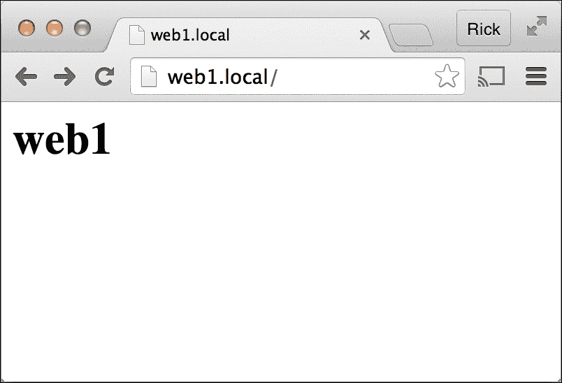
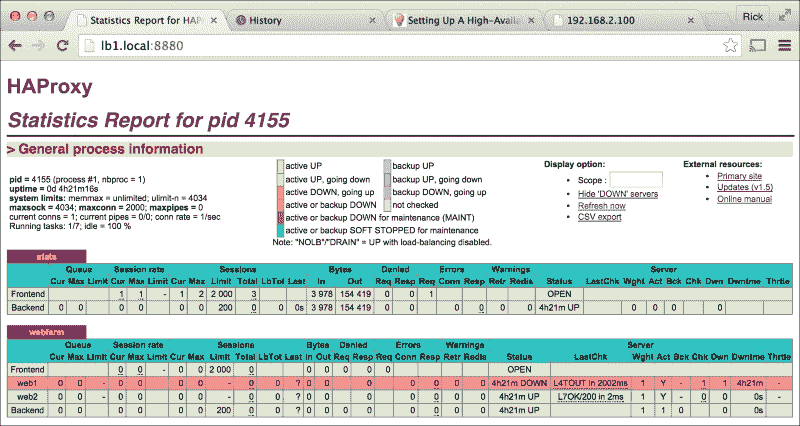
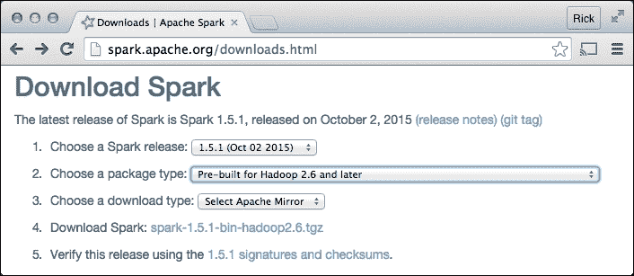
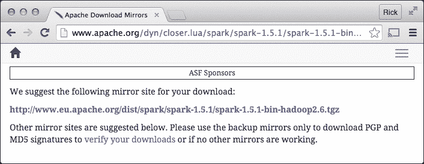
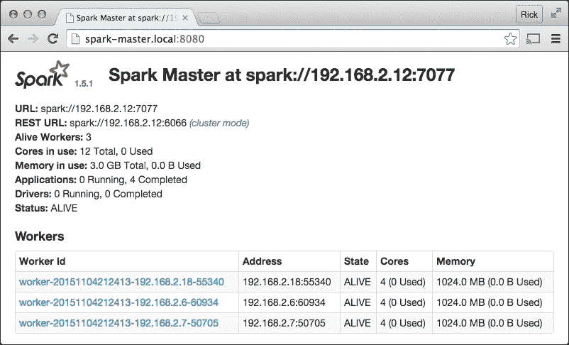

# 第七章 集群

本章将涵盖：

+   安装高可用负载均衡器

+   安装分布式文件系统

+   创建超级计算机

# 引言

本章中的食谱是针对树莓派的网络集群的。

网络集群是指多个计算机通过网络连接，作为一个单一的系统。计算机集群用于扩展和高可用性。集群通过将系统的工作负载分配到集群中的所有计算机上来扩展性能。在高可用性系统中，即使集群中的一台计算机发生故障，网络集群仍然可以继续工作。

树莓派集群可以用于保持网站的持续运行，即使用来托管网站的树莓派之一发生故障。树莓派集群还可以用于将处理和数据存储分布到多个树莓派上，从而创建一个树莓派超级计算机。

本章中的食谱并不专门针对树莓派。它们可以在大多数（基于 Debian 的）Linux 操作系统上重复使用。编写这些食谱是为了展示树莓派计算机集群的可能性。

完成本章中的食谱后，你将使用负载均衡器保持网站的高可用性，分发文件和数据到树莓派集群中的联合存储，并创建一个树莓派超级计算机。

# 安装高可用负载均衡器

本食谱将四台树莓派转变为一个高可用性的网站集群。

两台树莓派用作 Web 服务器，共享托管网站的负载。其他两台树莓派作为负载均衡器，负责将进入的 Web 请求负载均衡到两台 Web 服务器之间。

只需要一个负载均衡器来平衡负载。第二个负载均衡器配置为在第一个负载均衡器发生故障时替代它。

本食谱中的 Web 服务器使用 Apache HTTP 服务器提供简单的无状态网站，以演示负载均衡的实际操作。

本食谱中的负载均衡器使用 HA Proxy 在两台 Web 服务器之间平衡 Web 请求，并使用**Keepalived**创建一个虚拟 IP 地址。如果当前负载均衡器发生故障，该 IP 地址将自动重定向到备份负载均衡器。

完成本食谱后，你将创建一个高可用性的网站。

## 准备工作

本食谱的配料如下：

+   树莓派的四种基本网络设置，所有设备都连接到同一个网络交换机

+   本地网络上的五个可用 IP 地址

本食谱不需要桌面 GUI，可以通过基于文本的控制台或 LXTerminal 运行。

在每台树莓派上运行 Secure Shell 服务器时，可以使用 Secure Shell 客户端远程完成本食谱。网站通常是通过远程方式管理的。

## 如何做到这一点……

构建高可用树莓派网站集群的步骤如下：

1.  登录到每个 Raspberry Pi。设置其主机名和 IP 地址。将两个负载均衡器命名为 `lb1` 和 `lb2`。将两个 Web 服务器命名为 `web1` 和 `web2`。使用您网络中的 IP 地址。

    本配方中使用了以下主机名和 IP 地址：`lb1` – 192.168.2.101；`lb2` – 192.168.2.102；`web1` – 192.168.2.111；`web2` – 192.168.2.112。

    ### 注意

    可以使用 `raspi-config` 命令更改 Raspberry Pi 的主机名。第二章，*管理*，提供了使用 `raspi-config` 命令配置 Raspberry Pi 的方法。

    第五章，*高级网络*，提供了更改静态 IP 地址的配置方法。

1.  接下来，我们将设置 Web 服务器。登录到每个 Web 服务器：`web1` 和 `web2`。

    ### 注意

    在 `web1` 和 `web2` 两个 Web 服务器上重复以下步骤。

1.  现在，我们将在每个 Web 服务器上安装 Apache2。使用 `apt-get install` 命令安装 Apache Web 服务器守护进程（Apache2）。

    ```
    pi@web1 ~ $ sudo apt-get install -y apache2

    Reading package lists... Done
    Building dependency tree       
    Reading state information... Done
    The following extra packages will be installed:
      apache2-bin apache2-data apache2-utils libapr1 libaprutil1 libaprutil1-dbd-sqlite3 libaprutil1-ldap liblua5.1-0 ssl-cert
    Suggested packages:
      apache2-doc apache2-suexec-pristine apache2-suexec-custom openssl-blacklist
    The following NEW packages will be installed:
      apache2 apache2-bin apache2-data apache2-utils libapr1 libaprutil1 libaprutil1-dbd-sqlite3 libaprutil1-ldap liblua5.1-0 ssl-cert
    0 upgraded, 10 newly installed, 0 to remove and 0 not upgraded.
    ...
    ```

1.  为每个 Web 服务器创建独特的测试页面。

1.  将目录（`cd`）更改为 Web 服务器根目录 `(/var/www/html)`。

    ```
    pi@web1 ~ $ cd /var/www/html

    pi@web1 /var/www/html $ 
    ```

1.  使用 `chown` 命令将用户 `pi` 的所有权赋给该目录（`.`）及其所有文件（`*`）。

    ```
    pi@web1 /var/www/html $ sudo chown pi:www-data . *

    pi@web1 /var/www/html $
    ```

1.  使用 `echo` 命令为 Web 服务器创建一个网页。

    ```
    pi@web1 /var/www/html $ echo '<html><body>web1</body></html>' > index.html 

    pi@web1 /var/www/html $
    ```

    ### 注意

    在正常操作期间，两个 Web 服务器将提供相同的内容。

    在测试过程中，页面内容 `<body>web1</body>` 应该对每个 Web 服务器是唯一的。对于 Web 服务器 `web2`，使用 `<body>web2</body>`。

1.  使用 `touch` 命令创建一个文件（`lb-check.txt`），该文件可以被负载均衡器用来验证 Web 服务器是否正在运行。

    ```
    pi@web1 /var/www/html $ touch lb-check.txt 

    pi@web1 /var/www/html $
    ```

1.  现在，测试 Web 服务器。使用 Web 浏览器测试 Web 服务器。测试它们的主机名：`http://web1.local/` 和 `http://web2.local/`，以及它们的 IP 地址：`http://192.168.2.111/` 和 `http://192.168.2.112/`。

1.  设置负载均衡器。登录到每个负载均衡器 `lb1` 和 `lb2`。

    ### 注意

    在 `lb1` 和 `lb2` 上重复以下步骤。

1.  在每个负载均衡器上安装 HAProxy 和 Keepalived。使用 `apt-get install` 命令下载并安装 `haproxy` 和 `keepalived` 包。

    ```
    pi@lb1 ~ $ sudo apt-get install -y haproxy keepalived

    Reading package lists... Done
    Building dependency tree       
    Reading state information... Done
    The following extra packages will be installed:
      iproute ipvsadm libpci3 libperl5.20 libsensors4 libsnmp-base libsnmp30
    Suggested packages:
      heartbeat ldirectord lm-sensors snmp-mibs-downloader vim-haproxy haproxy-doc
    The following NEW packages will be installed:
      iproute ipvsadm keepalived libpci3 libperl5.20 libsensors4 libsnmp-base
      libsnmp30 haproxy
    0 upgraded, 9 newly installed, 0 to remove and 0 not upgraded.

    ...
    ```

1.  为每个负载均衡器配置 HAProxy。使用 `cat` 命令将 `listen stats` 和 `listen webfarm` 部分添加到 `/etc/haproxy/haproxy.cfg` 配置文件的底部。

    ```
    pi@lb1 ~ $ sudo bash

    root@lb1:/home/pi# cat <<EOD >>/etc/haproxy/haproxy.cfg

    listen stats
      bind 0.0.0.0:8880
      stats enable
      stats hide-version
      stats uri     /
      stats realm   HAProxy\ Statistics
      stats auth    pi:raspberry

    listen webfarm 192.168.2.100:80
      mode http
      balance roundrobin
      option httpclose
      option httpchk HEAD /lb-check.txt HTTP/1.0
      server web1 192.168.2.111:80 check
      server web2 192.168.2.112:80 check

    EOD

    root@lb1:/home/pi# exit

    pi@lb1 ~ $
    ```

1.  使用 `systemctl restart` 命令重新启动 `haproxy.service`。

    ```
    pi@lb1 ~ $ sudo systemctl restart haproxy.service 

    pi@lb1 ~ $ 
    ```

1.  为两个负载均衡器启用虚拟 IP 地址监听。将配置参数 `net.ipv4.ip_nonlocal_bind=1` 添加到 `sysctl.conf` 配置文件的底部。

    ```
    pi@lb1 ~ $ sudo bash

    root@lb1:/home/pi# echo "net.ipv4.ip_nonlocal_bind=1" >>/etc/sysctl.conf

    root@lb1:/home/pi# exit

    pi@lb1 ~ $ 
    ```

1.  使用 `sysctl –p` 命令加载更新的配置。

    ```
    pi@lb1 ~ $ sudo sysctl –p

    kernel.printk = 3 4 1 3
    vm.swappiness = 1
    vm.min_free_kbytes = 8192
    net.ipv4.ip_nonlocal_bind = 1

    pi@lb1 ~ $
    ```

1.  为两个负载均衡器配置 Keepalived。

1.  使用`cat`命令创建`keepalived.conf`配置文件，定义以下内容：检查 HAProxy 守护进程状态的函数（`chk_haproxy`）；监听的网络接口`eth0`；负载均衡器的优先级（最高的是主负载均衡器）；以及负载均衡器共享的虚拟 IP 地址（192.168.2.100）。

    ### 注意

    重要的是，负载均衡器应具有不同的优先级。

    在负载均衡器`lb1`上，使用`priority 101`（如下所示）。

    在负载均衡器`lb2`上，使用`priority 100`。

    ```
    pi@lb2 ~ $ sudo bash

    root@lb2:/home/pi# cat <<EOD >/etc/keepalived/keepalived.conf

    vrrp_script chk_haproxy 
    {
            script "killall -0 haproxy"
            interval 2
            weight 2
    }

    vrrp_instance VI_1 
    {
            interface eth0
            state MASTER
            virtual_router_id 51

            priority 101

            virtual_ipaddress 
            {
                192.168.2.100
            }

            track_script 
            {
                chk_haproxy
            }
    }

    EOD

    root@lb2:/home/pi# exit

    exit

    pi@lb2 ~ $ 
    ```

1.  使用`systemctl restart`命令重启`keepalived.service`。

    ```
    pi@lb1 ~ $ sudo systemctl restart keepalived.service 

    pi@lb1 ~ $ 
    ```

1.  测试集群。使用网页浏览器测试集群。浏览到集群的虚拟 IP 地址（`http://192.168.2.100`）。

1.  注意到每次刷新浏览器时，显示的网页在 web 服务器`web1`和`web2`的网页之间交替。集群工作正常！

    ### 注意

    对于实际的网站，web 服务器`web1`和`web2`应提供相同的内容、无状态的相同网站副本，或相同的 Web 服务。

1.  测试 web 服务器故障。登录到`web1`并使用`poweroff`命令关闭它。

    ```
    golden-macbook:~ rick$ ssh pi@web1.local

    Warning: Permanently added the RSA host key for IP address 'fe80::ba27:ebff:fec9:7ea9%en5' to the list of known hosts.
    pi@web1.local's password: 

    The programs included with the Debian GNU/Linux system are free software;
    the exact distribution terms for each program are described in the
    individual files in /usr/share/doc/*/copyright.

    Debian GNU/Linux comes with ABSOLUTELY NO WARRANTY, to the extent
    permitted by applicable law.
    Last login: Sat Oct 24 14:34:34 2015 from fe80::12dd:b1ff:feee:dfc6%eth0

    pi@web1 ~ $ sudo poweroff

    Connection to web1.local closed by remote host.
    Connection to web1.local closed.

    golden-macbook:~ rick$ 
    ```

1.  使用网页浏览器验证集群的虚拟 IP 地址（192.168.2.100）是否仍然有效。

1.  注意，每次刷新浏览器时，显示的网页都来自唯一正在运行的 web 服务器`web2`。

1.  使用网页浏览器检查`lb1`上 HA Proxy 的状态（`http://lb1.local:8880`）。

1.  注意到 web 服务器`web1`的状态显示为红色，表示其已关闭。`web2`的状态是绿色，表示其仍在运行。

1.  重启 web 服务器`web1`。

1.  刷新 HAProxy 状态页面（`http://lb1.local:8880`），并注意到 web 服务器`web1`的状态再次变为绿色。

1.  不断刷新集群的虚拟 IP 地址（`http://192.168.2.100`），并注意到显示的网页一次又一次地在 web 服务器`web1`和 web 服务器`web2`的网页之间交替。

1.  即使一个 web 服务器出现故障，集群仍然能够运行！

1.  测试负载均衡器故障。登录到主负载均衡器`lb1`。

1.  使用`ip addr`命令显示共享网络接口`eth0`的 IP 地址。

    ```
    pi@lb1 ~ $ ip addr show eth0

    2: eth0: <BROADCAST,MULTICAST,UP,LOWER_UP> mtu 1500 qdisc pfifo_fast state UP group default qlen 1000
        link/ether b8:27:eb:57:79:6d brd ff:ff:ff:ff:ff:ff
        inet 192.168.2.101/24 brd 192.168.2.255 scope global eth0
           valid_lft forever preferred_lft forever
        inet 192.168.2.100/32 scope global eth0
           valid_lft forever preferred_lft forever
        inet6 fe80::9b32:5b03:f901:4777/64 scope link 
           valid_lft forever preferred_lft forever

    pi@lb1 ~ $
    ```

1.  请注意，网络接口`eth0`上有两个 IPv4（`inet`）地址，包括集群的虚拟 IP 地址（`http://192.168.2.100`）。

1.  现在，登录到故障转移负载均衡器`lb2`。

1.  使用`ip addr`命令显示负载均衡器`lb2`上共享网络接口`eth0`的 IP 地址。

    ```
    pi@lb2 ~ $ ip addr show eth0

    2: eth0: <BROADCAST,MULTICAST,UP,LOWER_UP> mtu 1500 qdisc pfifo_fast state UP group default qlen 1000
        link/ether b8:27:eb:42:f6:a2 brd ff:ff:ff:ff:ff:ff
        inet 192.168.2.102/24 brd 192.168.2.255 scope global eth0
           valid_lft forever preferred_lft forever
        inet6 fe80::9284:5714:5216:6cde/64 scope link 
           valid_lft forever preferred_lft forever

    pi@lb2 ~ $ 
    ```

1.  请注意，负载均衡器`lb2`上的网络接口`eth0`只分配了一个 IPv4（`inet`）地址，而该地址不是集群的虚拟 IP 地址。

1.  通过断开网络电缆，将主负载均衡器`lb1`从集群中移除。

1.  再次使用`ip addr`命令显示负载均衡器`lb2`上共享网络接口`eth0`的 IP 地址。

    ```
    pi@lb2 ~ $ ip addr sh eth0

    2: eth0: <BROADCAST,MULTICAST,UP,LOWER_UP> mtu 1500 qdisc pfifo_fast state UP group default qlen 1000
        link/ether b8:27:eb:42:f6:a2 brd ff:ff:ff:ff:ff:ff
        inet 192.168.2.102/24 brd 192.168.2.255 scope global eth0
           valid_lft forever preferred_lft forever
        inet 192.168.2.100/32 scope global eth0
           valid_lft forever preferred_lft forever
        inet6 fe80::9284:5714:5216:6cde/64 scope link 
           valid_lft forever preferred_lft forever

    pi@lb2 ~ $ 
    ```

1.  注意，现在在 `lb2` 的网络接口 `eth0` 上有两个 IPv4（`inet`）地址，包括集群的虚拟 IP 地址（`http://192.168.2.100`）。

1.  通过不断刷新集群的虚拟 IP 地址（`http://192.168.2.100`），可以看到负载均衡依然有效——网页仍然在 `web1` 和 `web2` 之间交替显示。

1.  即使一个负载均衡器发生故障，集群仍能运行！

1.  现在，让我们恢复正常操作。通过连接网络电缆将 `lb1` 重新加入集群。

1.  在负载均衡器 `lb2` 上使用 `ip addr` 命令，可以显示集群的虚拟 IP 地址（192.168.2.100）不再分配给负载均衡器 `lb2` 上的网络接口 `eth0`（参见步骤 *32*）。

1.  在负载均衡器 `lb1` 上使用 `ip addr` 命令，可以显示负载均衡器 `lb1` 再次将集群的虚拟 IP 地址分配给其网络接口 `eth0`（参见步骤 *29*）。

1.  高可用性网站集群已成功运行！

## 它是如何工作的…

该配方开始时通过设置四台树莓派的新主机名和 IP 地址，以便它们能更有效地用于集群。

负载均衡器被命名为 `lb1` 和 `lb2`，它们的 IP 地址分别设置为 192.168.2.101 和 192.168.2.102。

Web 服务器命名为 `web1` 和 `web2`，它们的 IP 地址分别设置为 192.168.2.111 和 192.168.112。

可以使用 `raspi-config` 命令更改树莓派的主机名（使用 `raspi-config` 命令的示例可以在 第二章，*管理* 中找到）。

关于 *配置静态 IP 地址* 的配方可以在 第五章，*高级网络* 中找到。

### 配置 Web 服务器

在每个树莓派正确命名并分配地址后，`web1` 和 `web2` 两台 Web 服务器上都已配置好 Apache HTTP 守护进程。

#### 在每台 Web 服务器上安装 Apache2

使用 `apt-get install` 命令在每台 Web 服务器上安装 `apache2` 包。

安装过程包括启动 Apache HTTP 服务器并在每次启动时重启它。

### 注意

第五章，*高级网络*，中有安装 Web 服务器的配方，提供了更详细的 Web 服务器设置说明。

#### 为每台 Web 服务器创建独特的测试网页

`cd` 命令用于更改 Web 服务器的根目录 `/var/www/html`，在该目录下将创建两个文件：默认网页 `index.html` 和一个供负载均衡器定期检查以确保 Web 服务器仍在运行的文件 `lb-check.txt`。

使用 `chown` 命令将根目录（`./`）及其中的所有文件（`*`）的所有权更改为用户 `pi`。更改所有权后，用户 `pi` 可以在 Web 服务器的根目录中创建和删除文件。

每台 Web 服务器上都会创建两个文件：`index.html` 和 `lb-check.txt`。`lb-check.txt` 文件可以为空，它只需要存在。

使用 `echo` 命令写入非常简单的 `index.html` 文件，使用 `touch` 命令创建一个空的 `lb-check.txt` 文件。

本文故意在每个 web 服务器上使用唯一的 `index.html` 文件来演示负载均衡的实际效果。在 web 服务器 `web1` 上，网页内容是 `web1`，而在 web 服务器 `web2` 上，网页内容是 `web2`。

在网站集群的正常运行过程中，网站的客户端应该看到相同的网页，无论负载均衡器选择了哪个 web 服务器。

在网站集群的正常运行过程中，集群中的每个 web 服务器应该是相同的。它们要么拥有相同的 `index.html` 文件，要么配置为提供相同的 web 应用程序。

本文使用两个不同的 `index.html` 文件来演示负载均衡。

#### 测试 web 服务器

使用 web 浏览器测试每个 web 服务器是否正常运行。测试两个 web 服务器的主机名和 IP 地址：

```
http://web1.local/  http://192.168.2.111/
http://web2.local/  http://192.168.2.112/
```

### 设置负载均衡器

在 web 服务器安装并测试完成后，HAProxy 和 Keepalived 在两个负载均衡器 **lb1** 和 **lb2** 上进行设置。HAProxy 是负载均衡服务，Keepalived 是故障切换服务。HAProxy 在两个 web 服务器之间分配 web 请求，Keepalived 在主负载均衡器出现故障时会用另一个负载均衡器替代。

#### 在每个负载均衡器上安装 haproxy 和 keepalived

使用 `apt-get install` 命令在每个负载均衡器上安装 HAProxy 和 Keepalived 软件包。

安装过程包括在每次启动时启动和重新启动 HAProxy 和 Keepalived。然而，HAProxy 和 Keepalived 仍然需要进行配置。

#### 为每个负载均衡器配置 HAProxy

默认的 HAProxy 配置文件 `(/etc/haproxy/haproxy.cfg)` 需要两个新部分：`listen stats` 和 `listen webfarm`。

`listen stats` 部分在负载均衡器的所有网络接口（0.0.0.0）上创建一个受保护的单页 web 服务器，端口为 `8880`，包括集群的虚拟网络接口（192.168.2.100）。统计信息 web 服务器通过用户名（`pi`）和密码（`raspberry`）进行保护（`stats auth`）。

`listen webfarm` 部分定义了由 HAProxy 使用轮询负载均衡算法进行负载均衡的 web 服务器集合（服务器 `web1`，服务器 `web2`），以及用于测试 web 服务器是否仍在运行的方法（`httpchk HEAD`）和 URL（`/lb-check.txt`）。

使用安全外壳（`sudo bash`）更新 HAProxy 的配置文件（`/etc/haproxy/haproxy.cfg`）。

在安全外壳中，`cat` 命令用于将 `cat` 命令之后的行追加到数据标记结束（`<<EOD`）并写入文件底部（`>>haproxy.cfg`）。

文件更新完成后，退出安全外壳（`exit`）。

使用 `systemctl` 命令在每个负载均衡器上重新启动 HAProxy 服务 (`happroxy.service`)，以便服务在每个负载均衡器上更新其配置。

#### 启用两个负载均衡器上的虚拟 IP 地址监听。

树莓派的 Linux 内核默认未配置为监听 Keepalived 使用的虚拟 IP 地址。系统内核配置文件 (`/etc/sysctl.conf`) 需要更新以允许非本地网络绑定。

使用安全外壳 (`sudo bash`) 更新系统内核配置文件 (`sysctl.conf`)。

在安全外壳内部，使用 `echo` 命令通过将语句 `net.ipv4.ip_nonlocal_bind=1` 追加到系统内核配置文件 (`systctl.conf`) 的底部来启用虚拟 IP 地址 (`>>`)。

在更新文件后，安全外壳（Secure Shell）会释放 (`exit`)。

使用 `sysctl –p` 命令加载更新的内核配置。

#### 配置两个负载均衡器的 Keepalived。

尽管 Keepalived 已安装并准备就绪，但尚未配置。

使用安全外壳 (`sudo bash`) 创建 Keepalived 配置文件 (`/etc/keepalived/keepalived.conf`)。

在安全外壳内部，使用 `cat` 命令通过复制从 `cat` 命令后面的行到结束数据标记 (`<<EOD`) 到配置文件 (`>keepalived.conf`) 来创建配置文件。

在更新文件后，安全外壳（Secure Shell）会释放 (`exit`)。

Keepalived 配置有两个部分：`vrrp_script chk_haproxy` 和 `vrrp_instance VI_1`。

`vrrp_script chk_haproxy` 部分定义了一个脚本 (`killall -0 haproxy`)，只要名为 `haproxy` 的进程正在运行，就会完成 OK 状态。

`killall` 命令的命令名称有误导性；`-0` 参数告诉命令仅退出并显示 OK 状态。`killall` 命令也可以用来终止进程；但在这里不是其目的。

`vrrp_instance VI_1` 部分定义了两个负载均衡器（192.168.2.100）共享的 `virtual_ipaddress`。该部分还定义了用于绑定虚拟 IP 地址的网络接口 (`eth0`)，用于跟踪 `haproxy` 进程的 `track_script` (`chk_haproxy`)，以及用于确定哪个负载均衡器为 `MASTER` 的优先级。

### 注意

`priority` 参数在两个负载均衡器上应不同。

主负载均衡器 `lb1` 的优先级应比备用负载均衡器 `lb2` 更高（优先级 `101`）。

每个负载均衡器的优先级应不同。在本示例中，负载均衡器 `lb1` 的优先级为 `101`，负载均衡器 `lb2` 的优先级为 `100`。具有最高优先级 (`lb1`) 的负载均衡器用作主节点，另一个负载均衡器 (`lb2`) 用作备份从节点。

只有主负载均衡器（`lb1`）监听定义的虚拟网络地址（192.168.2.100）。故障切换负载均衡器（`lb2`）不监听。

运行在主负载均衡器（`lb1`）上的 HAProxy 是集群用来在 Web 服务器之间平衡 Web 请求的服务。故障切换负载均衡器（`lb2`）上的 HAProxy 仍在运行，但它不被集群使用，因为故障切换负载均衡器（`lb2`）没有监听集群的虚拟 IP 地址（192.168.2.100）。

如果主负载均衡器（`lb1`）发生故障，具有下一个最高优先级（`lb2`）的负载均衡器将成为主负载均衡器。

如果主负载均衡器（`lb1`）的 `track_script` 报告显示主负载均衡器的 `haproxy` 进程不再运行，主负载均衡器将把虚拟 IP 地址（192.168.2.100）的控制权转交给故障切换负载均衡器（`lb2`）。

如果故障切换负载均衡器（`lb2`）无法再连接到主负载均衡器（`lb1`），故障切换负载均衡器（`lb2`）将尝试接管虚拟 IP 地址。

`virtual_router_id` 参数定义了一个唯一的 ID（`51`），该 ID 由负载均衡器用于保持相同的虚拟 IP 地址持续运行。

文件创建完成后，退出安全外壳（`exit`）。

`systemctl` 命令用于在两个负载均衡器上重启 Keepalived 服务（`keepalived.service`），以便每个负载均衡器上的服务可以更新其配置。

#### 测试集群

使用 Web 浏览器验证网站集群是否仍在定义的虚拟 IP 地址（192.168.2.100）上运行。

当在浏览器中刷新网站 URL（`http://192.168.2.100/`）时，浏览器中显示的页面在 Web 服务器 `web1` 的默认网页（`index.html`）和 Web 服务器 `web2` 的默认页面之间交替显示。主负载均衡器（`lb1`）在两个 Web 服务器之间交替（轮询）处理 Web 请求。

集群正在运行！

### 测试 Web 服务器故障

为了测试在单个 Web 服务器故障后，网站集群的虚拟 IP 地址是否仍然能响应 Web 请求，使用 `poweroff` 命令关闭 Web 服务器 `web1`。

在 Web 服务器 `web1` 被关闭后，使用 Web 浏览器验证网站集群是否仍在定义的虚拟 IP 地址（`192.168.2.100`）上正常运行。

当在浏览器中刷新网站 URL（`http://192.168.2.100/`）时，浏览器中显示的网页不再在两个 Web 服务器之间交替。现在，只有 Web 服务器 `web2` 的默认页面（`index.html`）被显示。主负载均衡器（`lb1`）仍在运行，但只能为来自 Web 服务器 `web2` 的 Web 请求提供服务。

然后，使用网页浏览器访问主负载均衡器（`lb1`）的 HAProxy 统计页面 URL（`http://lb1.local:8880/`）。统计页面显示 Web 服务器`web1`不可用，并以红色背景色显示该 Web 服务器的统计信息。Web 服务器`web2`仍在运行，因此其统计信息以绿色背景色显示。

即使一个 Web 服务器发生故障，网站也会继续正常运行。

接下来，重新启动 Web 服务器`web1`。

在 Web 服务器`web1`重新启动后，主负载均衡器（`lb1`）检测到 Web 服务器跟踪文件（`http://lb1.local/chk_haproxy.txt`）的可用性，并将 Web 服务器`web1`重新加入到负载均衡器的`webfarm`中。

刷新 HAProxy 统计页面显示，来自 Web 服务器`web1`的统计数据再次变为绿色，并且不断刷新网站的虚拟 URL（`http://192.168.2.100/`）时，页面在`web1`和`web2`之间交替切换。

网站受到 Web 服务器故障的保护，可以按需添加 Web 服务器来处理更多的请求！

#### 测试负载均衡器故障

通过断开主负载均衡器（`lb1`）的网络连接来将其移出网络，从而测试主负载均衡器的故障切换。

在主负载均衡器（`lb1`）断开与网络的连接之前，使用`ip addr`命令显示网站集群的虚拟 IP 地址（`192.168.2.100`）绑定到主负载均衡器的网络接口（`eth0`）。`ip addr`命令也用于故障切换负载均衡器（`lb2`）以显示它的网络接口（`eth0`）上未绑定集群的虚拟 IP 地址。

在主负载均衡器（`lb1`）断开与网络的连接后，再次在故障切换负载均衡器（`lb2`）上运行`ip addr`命令。由于主负载均衡器（`lb1`）已从网络中断开，故障切换负载均衡器（`lb2`）已接管了集群的虚拟 IP 地址（`192.168.2.100`）。

当主负载均衡器（`lb1`）断开与网络的连接时，使用网页浏览器验证网站集群是否仍在定义的虚拟 IP 地址（`192.168.2.100`）上正常运行。

当在浏览器中刷新网站 URL（`http://192.168.2.100/`）时，浏览器中显示的网页继续在两个 Web 服务器之间交替。即使主负载均衡器（`lb1`）脱机，负载均衡仍然有效。故障切换负载均衡器（`lb2`）已成功接管负载均衡！

即使一个负载均衡器发生故障，网站集群仍然能够继续正常运行！

#### 恢复正常运行

通过将主负载均衡器（`lb1`）重新连接到网络，恢复网站集群的正常运行。

在主负载均衡器（`lb1`）重新连接后，`ip addr`命令再次在每个负载均衡器上运行。主负载均衡器（`lb1`）再次将集群的虚拟 IP 地址（`192.168.2.100`）绑定到其网络接口（`eth0`），而故障切换负载均衡器（`lb2`）不再将虚拟 IP 地址绑定到其网络接口。

高可用性网站集群已启动并运行！

## 还有更多内容……

这个例子是一个非常简单的高可用性网站集群示例，可以用于服务任何无状态的网站，例如静态网页集合或使用像**Jekyll** ([`jekyllrb.com/`](http://jekyllrb.com/)) 这样的站点生成器创建的网站。

### 通过添加更多 Web 服务器进行水平扩展

通过添加更多服务器来水平扩展集群。

本示例中的网站集群可以通过添加更多树莓派 Web 服务器来进行水平扩展。每添加一个新的 Web 服务器到集群中，都应将其配置与现有的 Web 服务器完全相同（参见步骤*2*到*8*）。

树莓派集群的垂直扩展受限于树莓派可用的内存量。可以减少 GPU 分配的内存，从而为服务腾出更多内存；然而，树莓派的物理内存无法增加。

树莓派的固定内存大小限制了树莓派集群的扩展性。它们可以很容易地进行水平扩展，但无法垂直扩展。

### 会话 cookie

许多网站是有状态的，而不是无状态的。有状态的网站使用会话 cookie 来创建需要登录的唯一会话。本示例中的 HAProxy 配置适用于无状态网站，并不识别会话 cookie。

用户会话存储在 Web 应用服务器中，会话 cookie 是用于识别每个唯一用户会话的唯一键。在大多数情况下，会话不能跨 Web 服务器共享。负载均衡器需要确保一旦用户在某个 Web 服务器上开始会话，所有对网站集群的请求都被定向到该 Web 服务器，而不是其他服务器。

Web 应用服务器和框架如 Apache Tomcat 和 PHP 依赖于会话 cookie。Apache Tomcat 使用会话 cookie `JSESSIONID`，而 PHP 使用`PHPSESSID`会话 cookie。

对于依赖于会话 cookie 的网站，网站集群的负载均衡器需要确保来自同一唯一用户（由会话 cookie 识别）的 Web 请求始终发送到同一 Web 服务器，因为只有该 Web 服务器拥有该用户的会话。

为了使本示例中的 HAProxy 服务器能够识别 Apache Tomcat（或其他 Java 应用服务器）的会话 cookie，请将 HAProxy 配置文件（`/etc/haproxy/haproxy.cfg`）中的两个服务器配置参数替换为以下三行：

```
  option cookie JSESSIONID prefix
  server web1 192.168.2.111:80 check cookie web1
  server web2 192.168.2.112:80 check cookie web2
```

第一行使用 `JSESSIONID` Cookie 和每个 Web 服务器的唯一前缀来启用 Cookie 跟踪选项。两个服务器的配置参数已更新，为每个服务器（`web1` 和 `web2`）设置唯一的 `cookie` 前缀。

在重启 HAProxy 服务（`systemctl restart haproxy.service`）后，集群将识别会话 Cookie。

## 另见

+   **计算机集群** ([`en.wikipedia.org/wiki/Computer_cluster`](https://en.wikipedia.org/wiki/Computer_cluster)): 这篇维基百科文章描述了计算机集群的概念和历史。

+   **Keepalived** ([`www.keepalived.org/`](http://www.keepalived.org/)): 该项目的主要目标是为 Linux 系统及基于 Linux 的基础设施提供简单且稳健的负载均衡和高可用性功能。

+   **HAProxy** ([`www.haproxy.org/`](http://www.haproxy.org/)): HAProxy 是一个免费的、非常快速且可靠的解决方案，提供高可用性、负载均衡和 TCP 与 HTTP 应用程序的代理功能。

+   **systemctl – 控制 systemd 系统和服务管理器** ([`manpages.debian.org/cgi-bin/man.cgi?query=systemctl`](http://manpages.debian.org/cgi-bin/man.cgi?query=systemctl)): Debian 手册页面中描述了 `systemctl` 命令及其选项。

+   **sysctl – 读取/写入系统参数** ([`manpages.debian.org/cgi-bin/man.cgi?query=sysctl&sektion=8`](http://manpages.debian.org/cgi-bin/man.cgi?query=sysctl&sektion=8)): Debian 手册页面中描述了 `sysctl` 命令及其选项。

+   **killall – 按名称杀死进程** ([`manpages.debian.org/cgi-bin/man.cgi?query=killall`](http://manpages.debian.org/cgi-bin/man.cgi?query=killall)): Debian 手册页面中描述了 `killall` 命令及其选项。

+   **Jekyll** ([`jekyllrb.com/`](http://jekyllrb.com/)): 将纯文本转换为静态网站和博客。

+   **可扩展性** ([`en.wikipedia.org/wiki/Scalability`](https://en.wikipedia.org/wiki/Scalability)): 这篇维基百科文章定义了水平和垂直的可扩展性。

+   **会话 Cookie** ([`en.wikipedia.org/wiki/HTTP_cookie#Session_cookie`](https://en.wikipedia.org/wiki/HTTP_cookie#Session_cookie)): 这篇关于 HTTP Cookie 的维基百科文章也定义了会话 Cookie。

# 安装分布式文件系统

这个配方将四台树莓派变成一个高可用的分布式文件系统，使用的是 GlusterFS。

GlusterFS 是一个可扩展的网络文件系统，适用于数据密集型任务，如云存储和媒体流。GlusterFS 是免费且开源的软件，可以利用常见的现成硬件，如树莓派。

完成这个配方后，你将把四台树莓派集群起来，创建一个高可用的分布式文件系统。

## 准备工作

这是这个配方所需的材料：

+   树莓派的四种基本网络配置

+   本地网络上的四个可用 IP 地址

本教程不需要桌面 GUI，可以从基于文本的控制台或 LXTerminal 中运行。

在每个树莓派上运行 Secure Shell 服务时，本教程可以通过 Secure Shell 客户端远程完成。分布式文件系统通常是通过远程管理的。

## 如何操作...

构建高可用的树莓派分布式文件系统的步骤如下：

1.  登录到四个树莓派，设置它们的主机名。将树莓派命名为`gluster1`、`gluster2`、`gluster3`和`gluster4`。

    ### 注意

    `raspi-config`命令可用于更改树莓派的主机名。第二章，*管理*，包含使用`raspi-config`命令配置树莓派的教程。

### 在每个树莓派上安装 GlusterFS 服务器

1.  登录到四个树莓派：`gluster1`、`gluster2`、`gluster3`和`gluster4`。

1.  使用`apt-get install`命令安装 GlusterFS 服务器（`glusterfs-server`）。

    ```
    pi@gluster1 ~ $ sudo apt-get install -y glusterfs-server

    Reading package lists... Done
    Building dependency tree       
    Reading state information... Done
    The following extra packages will be installed:
      glusterfs-client glusterfs-common libaio1 libibverbs1 librdmacm1
    The following NEW packages will be installed:
      glusterfs-client glusterfs-common glusterfs-server libaio1 libibverbs1
      librdmacm1
    0 upgraded, 6 newly installed, 0 to remove and 0 not upgraded.
    Need to get 7,604 kB of archives.
    After this operation, 13.6 MB of additional disk space will be used.
    …
    ```

    ### 注意

    在四个树莓派上重复安装`glusterfs-server`：`gluster1`、`gluster2`、`gluster3`和`gluster4`。

1.  现在，让我们创建一个受信存储池。在每个树莓派上安装了 GlusterFS 后，登录到`gluster1`，使用`gluster peer probe`命令将其他三个树莓派连接到一个受信存储池中。

    ```
    pi@gluster1 ~ $ sudo gluster peer probe gluster2.local

    peer probe: success. 

    pi@gluster1 ~ $ sudo gluster peer probe gluster3.local

    peer probe: success. 

    pi@gluster1 ~ $ sudo gluster peer probe gluster4.local
    peer probe: success. 

    pi@gluster1 ~ $ 
    ```

1.  使用`gluster` `peer status`命令检查存储池是否已成功创建。

    ```
    pi@gluster1 ~ $ sudo gluster peer status

    Number of Peers: 3

    Hostname: gluster2.local
    Uuid: 5b969ed1-01c2-406e-9710-944436c41c98
    State: Peer in Cluster (Connected)

    Hostname: gluster3.local
    Uuid: 9a00c151-af6e-44c5-9d14-5607270b4038
    State: Peer in Cluster (Connected)

    Hostname: gluster4.local
    Uuid: f036b1c4-7a51-49eb-aa63-81babb843b7e
    State: Peer in Cluster (Connected)

    pi@gluster1 ~ $ 
    ```

1.  还可以从存储池中的另一个节点（`gluster2`）使用`gluster peer status`验证存储池。

    ```
    pi@gluster2 ~ $ sudo gluster peer status

    Number of Peers: 3

    Hostname: 192.168.2.12
    Uuid: 4147586b-a723-4068-b8cb-d417df6766d8
    State: Peer in Cluster (Connected)

    Hostname: gluster3.local
    Uuid: 9a00c151-af6e-44c5-9d14-5607270b4038
    State: Peer in Cluster (Connected)

    Hostname: gluster4.local
    Uuid: f036b1c4-7a51-49eb-aa63-81babb843b7e
    State: Peer in Cluster (Connected)

    pi@gluster2 ~ $ 
    ```

1.  注意，`gluster1`显示的`Hostname`是一个 IP 地址（`192.168.2.12`）。

1.  使用`gluster peer probe`命令在任何其他节点（`gluster2`）上将`gluster1`的主机名添加到存储池中。

    ### 注意

    不要使用`gluster peer probe`命令将自身添加到受信服务器池！*一个存储节点不能将自己添加到池中！*

    任何节点尝试将自己添加到池中，可能会破坏整个存储池。

    ```
    pi@gluster2 ~ $ sudo gluster peer probe gluster1.local

    peer probe: success. 

    pi@gluster2 ~ $ sudo gluster peer status

    Number of Peers: 3

    Hostname: gluster1.local
    Uuid: 4147586b-a723-4068-b8cb-d417df6766d8
    State: Peer in Cluster (Connected)

    Hostname: gluster3.local
    Uuid: 9a00c151-af6e-44c5-9d14-5607270b4038
    State: Peer in Cluster (Connected)

    Hostname: gluster4.local
    Uuid: f036b1c4-7a51-49eb-aa63-81babb843b7e
    State: Peer in Cluster (Connected)

    pi@gluster2 ~ $ 
    ```

1.  现在，是时候从受信存储池创建一个条带化复制卷了。从受信存储池中的任何节点（`gluster1`），使用`gluster volume create`命令创建一个分布式条带化复制卷（`stripe 2 replica 2`），并使用受信存储池的四个节点（`gluster1`、`gluster2`、`gluster3`和`gluster4`）。在每个节点上，`/srv/vol0`目录用于存储新卷（`vol0`）的 GlusterFS 配置和数据。

    ```
    pi@gluster1 ~ $ sudo gluster volume create vol0 stripe 2 replica 2 
    gluster1.local:/srv/vol0 gluster2.local:/srv/vol0 gluster3.local:/srv/vol0 gluster4.local:/srv/vol0 force

    volume create: vol0: success: please start the volume to access data

    pi@gluster1 ~ $ 
    ```

1.  使用`gluster volume start`命令启动新创建的卷（`vol0`）。

    ```
    pi@gluster1 ~ $ sudo gluster volume start vol0

    volume start: vol0: success

    pi@gluster1 ~ $ 
    ```

1.  现在，让我们挂载分布式条带化复制卷。使用`mount`命令将来自节点`gluster1.local`的`glusterfs`卷`vol0`挂载到本地挂载点`/mnt`。

    ```
    pi@gluster1 ~ $ sudo mount -t glusterfs gluster1.local:/vol0 /mnt
    pi@gluster1 ~ $ 
    ```

1.  测试条带化复制卷。使用`cp`命令将一个大文件（`/boot/kernel.img`）复制到新创建的分布式条带化复制卷（`vol0`）的本地挂载点（`/mnt`）。

    ```
    pi@gluster1 ~ $ ls -l /boot/kernel.img 

    -rwxr-xr-x 1 root root 4056224 Sep 23 16:10 /boot/kernel.img

    pi@gluster1 ~ $ sha1sum /boot/kernel.img 

    d5e64d892b308b99e9c2c55deaa39c579a2335ec  /boot/kernel.img

    pi@gluster1 ~ $ sudo cp /boot/kernel.img /mnt/

    pi@gluster1 ~ $ ls -l /mnt/kernel.img 

    -rwxr-xr-x 1 root root 4056224 Oct 31 23:37 /mnt/kernel.img

    pi@gluster1 ~ $ sha1sum /mnt/kernel.img 

    d5e64d892b308b99e9c2c55deaa39c579a2335ec  /mnt/kernel.img

    pi@gluster1 ~ $ 
    ```

1.  注意，复制的文件（`/mnt/kernel.img`）的大小（`4056224`）和校验和（`d5e64…35ec`）与原始文件相同。

1.  使用 `ls -la` 命令显示分布式卷（`/srv/vol0`）的 GlusterFS 存储目录的完整内容。

    ```
    pi@gluster1 ~ $ ls -la /srv/vol0/

    total 2068
    drwxr-xr-x 3 root root    4096 Oct 31 23:37 .
    drwxr-xr-x 3 pi   pi      4096 Oct 31 23:12 ..
    drw------- 7 root root    4096 Oct 31 23:37 .glusterfs
    -rwxr-xr-x 2 root root 2090144 Oct 31 23:37 kernel.img

    pi@gluster1 ~ $ 
    ```

1.  注意，只有部分来自大文件（`kernel.img`）的数据存储在此对等节点（`gluster1`）上。存储目录（`/srv/vol0`）中的文件大小（`2090144`）显著小于原始文件（`/boot/kernel.img`）的大小（`4056224`）。

1.  登录到其余三个对等节点（`gluster2`、`gluster3` 和 `gluster4`），并使用 `ls –l` 命令检查每个存储目录（`/srv/vol0`）中的文件大小。

    [登录到对等节点 `gluster2`]

    ```
    pi@gluster2 ~ $ ls -la /srv/vol0/

    total 2068
    drwxr-xr-x 3 root root    4096 Oct 31 23:37 .
    drwxr-xr-x 3 pi   pi      4096 Oct 31 23:12 ..
    drw------- 7 root root    4096 Oct 31 23:37 .glusterfs
    -rwxr-xr-x 2 root root 2090144 Oct 31 23:37 kernel.img

    pi@gluster2 ~ $ 

    [log in to peer gluster3]
    pi@gluster3 ~ $ ls -la /srv/vol0/

    total 1936
    drwxr-xr-x 3 root root    4096 Oct 31 23:37 .
    drwxr-xr-x 3 pi   pi      4096 Oct 31 23:12 ..
    drw------- 7 root root    4096 Oct 31 23:37 .glusterfs
    -rwxr-xr-x 2 root root 1966080 Oct 31 23:37 kernel.img
    pi@gluster3 ~ $ 

    [log in to peer gluster4]
    pi@gluster4 ~ $ ls -la /srv/vol0/

    total 1936
    drwxr-xr-x 3 root root    4096 Oct 31 23:37 .
    drwxr-xr-x 3 pi   pi      4096 Oct 31 23:12 ..
    drw------- 7 root root    4096 Oct 31 23:37 .glusterfs
    -rwxr-xr-x 2 root root 1966080 Oct 31 23:37 kernel.img

    pi@gluster4 ~ $ 
    ```

1.  注意，每个对等节点上的数据存储文件（`/srv/vol0/kernel.img`）有两个不同的文件大小（`2090144` 和 `1966080`）。

1.  注意，`gluster1` 和 `gluster2` 上的数据存储文件（`/srv/vol0/kernel.img`）大小相同；`gluster3` 和 `gluster4` 上的数据存储文件大小也相同。这是复制卷如何在复制对等节点之间复制存储的一个例子，以防其中一个复制对等节点宕机。

1.  注意，两个文件的大小之和等于原始文件的大小（`4056224`）。这是条带化卷如何在条带化对等节点之间划分大文件数据的一个例子。

1.  测试集群的高可用性。通过断开网络电缆将一台树莓派（`gluster4`）从网络中移除。

1.  在剩余的一个对等节点（`gluster1`）上使用 `gluster` 对等节点状态命令检查分布式文件系统的安全存储池状态。

    ```
    pi@gluster1 ~ $ sudo gluster peer status

    Number of Peers: 3

    Hostname: gluster2.local
    Uuid: 5b969ed1-01c2-406e-9710-944436c41c98
    State: Peer in Cluster (Connected)

    Hostname: gluster3.local
    Uuid: 9a00c151-af6e-44c5-9d14-5607270b4038
    State: Peer in Cluster (Connected)

    Hostname: gluster4.local
    Uuid: f036b1c4-7a51-49eb-aa63-81babb843b7e
    State: Peer in Cluster (Disconnected)

    pi@gluster1 ~ $ 
    ```

1.  注意，`Hostname: gluster4.local` 显示为 `Disconnected`。

1.  在 `gluster1` 上使用 `sha1sum` 命令验证存储在文件系统中的大文件（`/mnt/kernel.img`）没有发生变化。

    ```
    pi@gluster1 ~ $ sha1sum /mnt/kernel.img 

    d5e64d892b308b99e9c2c55deaa39c579a2335ec  /mnt/kernel.img

    pi@gluster1 ~ $ 
    ```

1.  注意，校验和（`d5e64…35ec`）仍然相同。

1.  即使一个对等节点宕机，分布式文件系统仍然可以正常工作！

1.  测试复制对等节点的修复功能。当 `gluster4` 仍然与集群断开连接时，使用 `cp` 命令将另一个大文件（`/boot/kernel7.img`）复制到自愈的分布式条带化复制文件系统中。

    ```
    pi@gluster1 ~ $ sudo cp /boot/kernel7.img /mnt/

    pi@gluster1 ~ $ 
    ```

1.  使用 `ls` 和 `sha1sum` 命令检查复制的文件（`/mnt/kernel7.img`）是否与原始文件（`/boot/kernel7.img`）完全相同。

    ```
    pi@gluster1 ~ $ ls -l /boot/kernel7.img 

    -rwxr-xr-x 1 root root 4032544 Sep 23 16:10 /boot/kernel7.img

    pi@gluster1 ~ $ sha1sum /boot/kernel7.img 

    8a2b1f065fc9459de79ba40e7cb791216f2f501b  /boot/kernel7.img

    pi@gluster1 ~ $ ls -la /mnt

    total 7912
    drwxr-xr-x  3 root root    4096 Nov  1 00:47 .
    drwxr-xr-x 21 root root    4096 Oct 31 20:29 ..
    -rwxr-xr-x  1 root root 4032544 Nov  1 00:47 kernel7.img
    -rwxr-xr-x  1 root root 4056224 Oct 31 23:37 kernel.img

    pi@gluster1 ~ $ sha1sum /mnt/kernel7.img 

    8a2b1f065fc9459de79ba40e7cb791216f2f501b  /mnt/kernel7.img

    pi@gluster1 ~ $ 
    ```

1.  使用 `ls –l` 命令检查每个对等节点的存储目录（`/srv/vol0`）中的文件大小，以验证新复制的文件（`kernel7.img`）是否也被条带化和复制。

    [登录到对等节点 `gluster1`]

    ```
    pi@gluster1 ~ $ ls -la /srv/vol0/

    total 4092
    drwxr-xr-x 3 root root    4096 Nov  1 00:47 .
    drwxr-xr-x 3 pi   pi      4096 Oct 31 23:12 ..
    drw------- 8 root root    4096 Nov  1 00:47 .glusterfs
    -rwxr-xr-x 2 root root 2066464 Nov  1 00:47 kernel7.img
    -rwxr-xr-x 2 root root 2090144 Oct 31 23:37 kernel.img

    pi@gluster1 ~ $ 

    ```

    [登录到对等节点 `gluster2`]

    ```
    pi@gluster2 ~ $ ls -la /srv/vol0/

    total 4092
    drwxr-xr-x 3 root root    4096 Nov  1 00:47 .
    drwxr-xr-x 3 pi   pi      4096 Oct 31 23:12 ..
    drw------- 8 root root    4096 Nov  1 00:47 .glusterfs
    -rwxr-xr-x 2 root root 2066464 Nov  1 00:47 kernel7.img
    -rwxr-xr-x 2 root root 2090144 Oct 31 23:37 kernel.img

    pi@gluster2 ~ $ 
    ```

    [登录到对等节点 `gluster3`]

    ```
    pi@gluster3 ~ $ ls -la /srv/vol0/

    total 3864
    drwxr-xr-x 3 root root    4096 Nov  1 00:47 .
    drwxr-xr-x 3 pi   pi      4096 Oct 31 23:12 ..
    drw------- 8 root root    4096 Nov  1 00:47 .glusterfs
    -rwxr-xr-x 2 root root 1966080 Nov  1 00:47 kernel7.img
    -rwxr-xr-x 2 root root 1966080 Oct 31 23:37 kernel.img

    pi@gluster3 ~ $ 
    ```

1.  注意，`gluster1`和`gluster2`上的数据存储文件（`/srv/vol0/kernel7.img`）大小相同，且条带化文件的总大小（`2066464 + 1966080`）等于原始文件的大小（`4032544`）。即使某个节点宕机，分布式文件系统仍然会继续进行条带化和复制文件！

1.  重新连接`gluster4`节点到网络。

1.  重新连接的节点`gluster4`上，立即使用`ls –l`命令检查数据存储目录（`/srv/vol0`）中的文件。

    ```
    pi@gluster4 ~ $ ls -la /srv/vol0/

    total 1940
    drwxr-xr-x 3 root root    4096 Nov  1 00:47 .
    drwxr-xr-x 3 pi   pi      4096 Oct 31 23:12 ..
    drw------- 8 root root    4096 Nov  1 00:50 .glusterfs
    -rwxr-xr-x 2 root root       0 Nov  1 00:47 kernel7.img
    -rwxr-xr-x 2 root root 1966080 Oct 31 23:37 kernel.img

    pi@gluster4 ~ $ 
    ```

1.  注意，新复制的文件（`kernel7.img`）已在数据存储目录（`/srv/vol0`）中创建，但文件大小为空（`0`）。

1.  等待五分钟后，再次使用`ls –l`命令检查`gluster4`上的数据存储目录。

    ```
    pi@gluster4 ~ $ ls -la /srv/vol0/

    total 3864
    drwxr-xr-x 3 root root    4096 Nov  1 00:47 .
    drwxr-xr-x 3 pi   pi      4096 Oct 31 23:12 ..
    drw------- 8 root root    4096 Nov  1 00:50 .glusterfs
    -rwxr-xr-x 2 root root 1966080 Nov  1 00:47 kernel7.img
    -rwxr-xr-x 2 root root 1966080 Oct 31 23:37 kernel.img

    pi@gluster4 ~ $ 
    ```

1.  注意，存储文件`kernel7.img`不再为空。`gluster4`上的数据存储文件（`kernel7.img`）现在与`gluster3`上的存储文件大小相同（`1966080`）。

1.  分布式文件系统已经恢复正常！

1.  现在，这四个树莓派组成的集群已经成为一个高可用的分布式文件系统！

## 它是如何工作的...

该步骤从更改四个树莓派的主机名开始，这些树莓派都连接在同一个网络中。树莓派的新主机名为`gluster1`、`gluster2`、`gluster3`和`gluster4`。

### 在每个树莓派上安装 GlusterFS 服务器

在重命名树莓派后，使用`apt-get install`命令在每个树莓派上安装 GlusterFS 服务器软件包（`glusterfs-server`）。

安装`glusterfs-server`软件包时，还会在每个树莓派上启动 GlusterFS 服务器：`gluster1`、`gluster2`、`gluster3`和`gluster4`。

从`gluster1`树莓派使用`gluster peer probe`命令将其他树莓派（`gluster2`、`gluster3`和`gluster4`）链接到可信节点关系中。

存储池中的第一个节点（`gluster1`）与其他存储池节点（`gluster2`，`gluster3`，`gluster4`）建立了可信节点关系。然而，一旦建立了可信关系，任何节点都可以作为存储池的主节点——管理存储卷、管理可信节点关系，或者作为分布式文件系统的网络可挂载端点。

在`gluster1`和`gluster2`上使用`gluster peer status`命令验证可信存储池是否正在运行。在这两个节点上，其他三个存储池节点都显示为存储池的一部分。

然而，`gluster2`上的`gluster peer status`命令显示了第一个节点`gluster1`的 IP 地址作为`Hostname`字段。因此，使用`gluster peer`命令在`gluster2`上将`gluster1`的主机名添加到存储池的元数据中。

### 注意

不要让节点将自己添加到可信存储池！

使用命令`gluster peer probe`并带上自己的主机名的节点可能会破坏可信存储池！

### 在受信任存储池中创建条带化复制卷

使用`cluster volume create`命令从`gluster1`节点创建一个新的条带化复制卷，该卷分布在四个存储池节点上（`gluster1.local`，`gluster2.local`，`gluster3.local`，`gluster4.local`）。

新的卷命名为`vol0`，它有两个条带（`stripe 2`）和两个副本（`replica 2`）。它在每个存储池节点（`gluster1.local`，`gluster2.local`，`gluster3.local`，`gluster4.local`）上使用相同的存储目录（`/srv/vol0`）。

不建议使用节点根文件系统（`/`）上的存储目录，默认情况下也不允许这样做。可以使用`force`关键字来覆盖默认行为。

本食谱使用根文件系统以简化操作。对于更健壮、可靠的分布式文件系统并具有更高性能的需求，可以将高速外部 USB 磁盘连接到每个 Raspberry Pi，并配置卷的存储目录位于外部磁盘上，而不是根文件系统上。第四章，*文件共享*，提供了多种将外部 USB 磁盘挂载到 Raspberry Pi 上的食谱。

在创建卷（`vol0`）之后，使用`gluster volume start`命令将新创建的卷与 GlusterFS 客户端共享。`gluster volume start`命令可以从集群中的任何节点运行。在此案例中，从`gluster1`节点运行。

### 挂载分布式条带化复制卷

现在，分布式条带化复制卷（`vol0`）已经创建并启动，可以让 GlusterFS 客户端挂载新创建的卷。

为了简化操作，本食谱使用`gluster1`作为客户端。然而，任何安装了 GlusterFS 客户端软件的本地网络计算机，现在应该都可以从任何受信任的节点挂载分布式卷（`vol0`）。

使用`mount –t glusterfs`命令从`gluster1`节点挂载受信任的存储节点`gluster1.local`上的分布式卷（`vol0`）到其本地目录`/mnt`。名为`gluster1`的 Raspberry Pi 既是分布式卷（`vol0`）的客户端，也是服务器。

### 测试条带化复制卷

使用`cp`命令将大文件从本地文件系统（`/boot/kernel.img`）复制到挂载在`/mnt`的分布式条带化复制卷。

使用`ls –l`命令和`sha1sum`命令验证复制的文件（`/mnt/kernel.img`）是否成功复制，通过检查文件的大小（`4056224`）和校验和（`d5e64…35ec`）是否与原文件（`/boot/kernel.img`）相同。

使用`ls –la`命令在存储池的每个节点（`gluster1`，`gluster2`，`gluster3`和`gluster4`）上显示该节点存储目录（`/srv/vol0`）的内容。

没有任何节点的存储目录中存在与原文件（`/boot/kernel.img`）大小相同的文件（`/srv/kernel.img`）。

#### 复制

有两组大小相同的存储文件（`/srv/kernel.img`）。第一组存储文件大小相同（`2090144`），可以在 `gluster1` 和 `gluster2` 上找到。第二组存储文件，`gluster3` 和 `gluster4`，也具有相同的大小（`1966080`）。`gluster1` 和 `gluster2` 是彼此的副本；`gluster3` 和 `gluster4` 也是副本。

数据复制用于保持分发卷的高可用性。如果一个受信存储节点出现故障或与网络断开连接，无法访问的节点的存储数据副本仍然可用。如果 `gluster1` 出现故障，`gluster2` 仍然会有该数据的副本。如果 `gluster4` 与网络断开，`gluster3` 仍然会有它的数据副本。

### 条带化

两个不同的文件大小（`2090144` 和 `1966080`）之和等于原始文件的大小（`4056224`）。原始文件已经分布（条带化）到受信存储节点上。受信存储节点 `gluster1` 和 `gluster2` 正在复制大文件（`kernel.img`）的一部分（`2090144`），而受信节点 `gluster3` 和 `gluster4` 正在存储另一部分的副本（`1966080`）。

数据条带化是一种将大文件分布到多个存储节点的技术。文件的部分内容（条带）被均匀地分布到条带化的存储节点上，这样顺序读取（或写入）一个大文件时，不会持续对单一存储节点造成负担。通过将文件的数据分布到各个存储节点，条带化将访问文件的负载分配到多个存储节点上。条带化提高了分发卷的数据传输速率。

### 测试集群的高可用性

为了测试当一个受信数据存储节点出现故障时集群能否保持可用，受信数据存储节点 `gluster4.local` 被通过断开其网络电缆从集群中移除。

在从 `gluster4` 拔掉网线后，可以使用 `gluster peer status` 命令（在任何剩余的节点上执行）查看，受信存储节点 `gluster4.local` 已被标记为与集群 `断开连接`。

`sha1sum` 命令用于验证分发文件（`/mnt/kernel.img`）的校验和（`d5e64…35ec`）是否与原始文件（`/boot/kernel.img`）的校验和匹配。

即使一个节点从存储池中移除，GlusterFS 分发文件系统仍能正常工作！集群具有高可用性！

### 测试复制节点的修复

在受信存储节点 `gluster4` 仍与集群断开连接的情况下，使用 `cp` 命令将另一个大文件（`/boot/kernel7.img`）复制到分发存储卷（`vol0`），并将其挂载到本地 `gluster1` 的 `/mnt` 目录。

使用 `sha1sum` 命令将复制文件（`/mnt/kernel7.img`）的校验和与原始文件（`/boot/kernel7.img`）的校验和进行比较。文件完全相同。

在每个剩余的受信存储对等节点（`gluster1`、`gluster2` 和 `gluster3`）上使用 `ls –la` 命令，验证新大文件（`kernel7.img`）是否也已在分布式卷的存储目录（`/srv/vol0`）中进行条带和复制。受信存储对等节点 `gluster1` 和 `gluster2` 各自拥有文件的一部分副本，而对等节点 `gluster3` 拥有文件的另一部分副本。

在新大文件已经在分布式卷上进行条带和复制之后，受信对等节点 `gluster4` 再次连接到集群。

在对等节点 `gluster4` 重新连接到集群后，立即使用 `ls –la` 命令显示 `gluster4` 上数据存储目录（`/srv/vol0`）的内容。复制到分布式卷（`vol0`）的文件（`kernel7.img`）在 `gluster4` 从集群断开期间已经创建在数据存储目录中；然而，文件是空的（`0`）。

在等待几分钟，直到 GlusterFS 修复服务完成将新大文件（`kernel7.img`）的条带部分从对等节点 `gluster3` 复制到对等节点 `gluster4` 后，再次使用 `ls –la` 命令验证对等节点 `gluster4` 是否已复制其条带文件部分，并确认分布式卷（`vol0`）已完成修复。

这四个 Raspberry Pi 现在构成了一个自修复的高可用分布式文件系统。

## 还有更多…

GlusterFS 是一个基于对等节点的分布式文件系统。在 GlusterFS 的受信存储池中没有主服务器。在这个方案中，`gluster1` 是受信存储池中的第一个对等节点，并邀请其他受信对等节点加入池中。即使它是存储池中的第一个对等节点，`gluster1` 仍然是一个平等的对等节点，而不是主节点。

另一方面，当前的方案只允许 GlusterFS 客户端从一个受信存储池对等节点（`gluster1`、`gluster2`、`gluster3` 或 `gluster4`）挂载文件系统端点。在此方案中，`gluster1` 是提供分布式文件系统端点的对等节点。

如果挂载的对等节点（`gluster1`）宕机，即使集群中的其他对等节点保持文件系统可用，客户端仍然无法访问分布式文件系统。在此方案中，`gluster1` 同时也是客户端，因此这个问题不会发生。

GlusterFS 分布式文件系统通常是从集群外部访问的，而不是从集群内受信存储对等节点访问。直接从某个存储对等节点挂载分布式文件系统会破坏集群的高可用性，因为它使客户端依赖于单个受信对等节点，而不是依赖整个集群。

### 使用 Keepalived 创建虚拟文件系统端点

Keepalived 提供的虚拟 IP 地址服务可以用于创建一个由所有受信任存储池节点维持活跃的分布式文件系统端点。前面的食谱，*安装高可用负载均衡器*，展示了如何安装和配置 Keepalived，以便与 HA Proxy 一起使用。

Keepalived 还可以与 GlusterFS 配合使用，创建一个虚拟 IP 地址，用于访问分布式文件系统，只要分布式文件系统保持可用，虚拟 IP 也将保持可用。

使用 Keepalived，会为分布式文件系统创建一个虚拟端点（IP 地址）。客户端将挂载文件系统的虚拟端点，而不是直接从受信任存储节点挂载端点。

即使当前提供虚拟文件系统端点的受信任存储节点发生故障，Keepalived 提供的虚拟端点也不会失败；相反，系统会选择另一个受信任存储节点来替代发生故障的节点。不管哪个受信任节点发生故障，虚拟文件系统端点将始终保持活跃。

要在本食谱中使用 Keepalived，首先启用（`=1`）允许监听虚拟 IP 地址（`net.ipv4.ip_nonlocal_bind`）的内核参数，适用于集群中的每个受信任存储节点（`gluster1`、`gluster2`、`gluster3` 和 `gluster4`）。

```
pi@gluster1 ~ $ sudo -i bash

root@gluster1:~# echo "net.ipv4.ip_nonlocal_bind=1" >>/etc/sysctl.conf

root@gluster1:~# sysctl -p

kernel.printk = 3 4 1 3
vm.swappiness = 1
vm.min_free_kbytes = 8192
net.ipv4.ip_nonlocal_bind = 1

root@gluster1:~# exit

exit

pi@gluster1 ~ $ 
```

接下来，使用 `apt-get install` 命令安装 `keepalived` 软件包。

```
pi@gluster1 ~ $ sudo apt-get install -y keepalived

Reading package lists... Done
Building dependency tree       
Reading state information... Done
The following extra packages will be installed:
  iproute ipvsadm libpci3 libperl5.20 libsensors4 libsnmp-base libsnmp30
Suggested packages:
  heartbeat ldirectord lm-sensors snmp-mibs-downloader
The following NEW packages will be installed:
  iproute ipvsadm keepalived libpci3 libperl5.20 libsensors4 libsnmp-base libsnmp30
0 upgraded, 8 newly installed, 0 to remove and 0 not upgraded.
Need to get 3,902 kB of archives.
After this operation, 7,093 kB of additional disk space will be used.

...
```

使用一个 Keepalived 配置，使得任何一个受信任的存储节点（`gluster1`、`gluster2`、`gluster3` 或 `gluster4`）在当前提供虚拟 IP 地址的节点发生故障时，能够接管集群的虚拟 IP 地址。

```
pi@gluster1 ~ $ sudo bash

root@gluster1:/home/pi# cat <<EOD >/etc/keepalived/keepalived.conf

vrrp_script chk_glusterd 
{
        script "killall -0 glusterd"
        interval 2
        weight 2
}

vrrp_instance VI_1 
{
        interface eth0
        state MASTER
        virtual_router_id 13

        priority 100

        virtual_ipaddress 
        {
            192.168.2.100
        }

        track_script 
        {
            chk_glusterd
        }
}

EOD

root@gluster1:/home/pi# exit

exit

pi@gluster1 ~ $ 
```

最后，重启 Keepalived 服务。

```
pi@gluster1 ~ $ sudo systemctl restart keepalived.service 

pi@gluster1 ~ $ 
```

现在，虚拟端点可以被挂载，替代受信任节点。

```
pi@gluster4 ~ $ sudo mount -t glusterfs 192.168.2.100:/vol0 /mnt

pi@gluster4 ~ $ ls -l /mnt
total 7900
-rwxr-xr-x 1 root root 4032544 Nov  1 00:47 kernel7.img
-rwxr-xr-x 1 root root 4056224 Oct 31 23:37 kernel.img

pi@gluster4 ~ $ 
```

## 参见：

+   **GlusterFS** ([`www.glusterfs.org/`](http://www.glusterfs.org/)): GlusterFS 是一个可扩展的网络文件系统。通过使用常见的现成硬件，你可以创建大型分布式存储解决方案，适用于媒体流、数据分析及其他数据和带宽密集型任务。GlusterFS 是免费且开源的软件。

+   **GlusterFS** ([`en.wikipedia.org/wiki/GlusterFS`](https://en.wikipedia.org/wiki/GlusterFS)): 这篇维基百科文章描述了 GlusterFS 的设计。

# 创建超级计算机

本食谱将四台 Raspberry Pi 变成一台使用 Apache Spark 的超级计算机。

Apache Spark 是一个用于大规模数据处理的快速通用引擎。在本食谱中，Apache Spark 被安装在四台网络连接的小型 Raspberry Pi 计算机集群上。该集群将被用来展示超级计算机的速度，通过蒙特卡洛算法计算圆周率值。

完成本食谱后，你将拥有一台 Raspberry Pi 超级计算机。

## 准备工作

创建超级计算机需要以下配件：

+   Raspberry Pi 的四种基本网络配置

+   一个高速网络交换机

这个方法不需要桌面 GUI，可以通过基于文本的控制台或者在 LXTerminal 中运行。

在每个树莓派上运行安全 Shell 服务器后，可以使用安全 Shell 客户端远程完成这个方法。通常，网站会通过远程管理。

所有树莓派应直接连接到同一网络交换机。

## 如何操作...

按照以下步骤构建树莓派超级计算机：

1.  登录到每个树莓派并设置其主机名。一个树莓派将作为 Spark 主服务器，另外三个将作为 Spark 从机。将四个树莓派命名为`spark-master`、`spark-slave-a`、`spark-slave-b`和`spark-slave-c`。

1.  现在，设置主从机之间的安全通信。使用`spark-master`上的`ssh-keygen`命令生成一对 SSH 密钥。按`<enter>`接受默认文件位置（`/home/pi/.ssh/id_rsa`）。然后，按两次`<enter>`以使用空密码（Spark 自动化要求为空密码）。

    ```
    pi@spark-master ~ $ ssh-keygen

    Generating public/private rsa key pair.
    Enter file in which to save the key (/home/pi/.ssh/id_rsa): 

    Enter passphrase (empty for no passphrase): 

    Enter same passphrase again: 

    Your identification has been saved in /home/pi/.ssh/id_rsa.
    Your public key has been saved in /home/pi/.ssh/id_rsa.pub.
    The key fingerprint is:
    29:0e:95:61:a6:e6:30:8f:23:66:cd:68:d3:c4:0c:8e pi@spark-master

    The key's randomart image is:
    +---[RSA 2048]----+
    | .    +          |
    |o +  + o         |
    |E.o+o o          |
    |  *B .   .       |
    |.*o++ . S        |
    |+... o .         |
    |      .          |
    |                 |
    |                 |
    +-----------------+

    pi@spark-master ~ $ 
    ```

1.  使用`ssh-copy-id`命令将新创建的公钥从`spark-master`复制到每个 Spark 从机（`spark-slave-a`，`spark-slave-b`，和`spark-slave-c`）。

    ```
    pi@spark-master ~ $ ssh-copy-id pi@spark-slave-a.local

    The authenticity of host 'spark-slave-a.local (192.168.2.6)' can't be established.
    ECDSA key fingerprint is e9:55:ff:6c:69:be:5d:8f:80:de:b2:d9:85:eb:1b:90.

    Are you sure you want to continue connecting (yes/no)? yes

    /usr/bin/ssh-copy-id: INFO: attempting to log in with the new key(s), to filter out any that are already installed
    /usr/bin/ssh-copy-id: INFO: 1 key(s) remain to be installed -- if you are prompted now it is to install the new keys

    pi@spark-slave-a.local's password: 

    Number of key(s) added: 1
    ```

    ### 注意

    对每个从机重复步骤*3*：`spark-slave-a`，`spark-slave-b`，和`spark-slave-c`。

1.  请注意，从`spark-master`到从机的安全 shell 登录（`ssh`）不再需要密码进行身份验证：

    ```
    pi@spark-master ~ $ ssh spark-slave-a.local

    The programs included with the Debian GNU/Linux system are free software;
    the exact distribution terms for each program are described in the
    individual files in /usr/share/doc/*/copyright.

    Debian GNU/Linux comes with ABSOLUTELY NO WARRANTY, to the extent
    permitted by applicable law.
    Last login: Mon Nov  2 21:29:28 2015 from 192.168.2.1

    pi@spark-slave-a ~ $ 
    ```

1.  现在，开始下载 Apache Spark 软件发行版。使用网页浏览器在 Apache Spark 官网的下载页面上找到正确的 Apache Spark 软件发行包（[`spark.apache.org/downloads.html`](http://spark.apache.org/downloads.html)），如下图所示：

1.  在下载页面上，使用以下下拉选项：

    1.  **选择一个 Spark 版本：** **1.5.1（2015 年 10 月 2 日）**

    1.  **选择软件包类型：** 为 Hadoop 2.6 及以后版本预构建

    1.  **选择下载类型：** 选择 Apache 镜像

    在**1**、**2**和**3**的选择正确之后，点击在**4**处出现的链接（`spark-1.5.1-bin-haddop2.6.tgz`）。下载 Spark。

    

1.  请注意，下一网页显示了正确的 Apache Spark 软件发行包的实际下载链接（[`www.eu.apache.org/dist/spark/spark-1.5.1/spark-1.5.1-bin-hadoop2.6.tgz`](http://www.eu.apache.org/dist/spark/spark-1.5.1/spark-1.5.1-bin-hadoop2.6.tgz)）。

1.  在`spark-master`上使用`wget`命令下载 Apache Spark 软件发行页面，如下所示：

    ```
    pi@spark-master ~ $ wget http://www.eu.apache.org/dist/spark/spark-1.5.1/spark-1.5.1-bin-hadoop2.6.tgz

    --2015-11-05 17:41:01--  http://www.eu.apache.org/dist/spark/spark-1.5.1/spark-1.5.1-bin-hadoop2.6.tgz
    Resolving www.eu.apache.org (www.eu.apache.org)... 88.198.26.2, 2a01:4f8:130:2192::2
    Connecting to www.eu.apache.org (www.eu.apache.org)|88.198.26.2|:80... connected.
    HTTP request sent, awaiting response... 200 OK
    Length: 280901736 (268M) [application/x-gzip]
    Saving to: 'spark-1.5.1-bin-hadoop2.6.tgz'

    spark-1.5.1-bin-hadoop2.6.tgz   100%[============>] 267.89M   726KB/s   in 4m 38s 

    2015-11-05 17:45:39 (987 KB/s) - 'spark-1.5.1-bin-hadoop2.6.tgz' saved [280901736/280901736]

    pi@spark-master ~ $ 
    ```

1.  使用`tar`命令在每个树莓派（`spark-master`，`spark-slave-a`，`spark-slave-b`和`spark-slave-c`）上解压 Apache Spark 软件发行版，如下所示：

    ```
    pi@spark-master ~ $ scp spark-1.5.1-bin-hadoop2.6.tgz spark-slave-a.local:.

    spark-1.5.1-bin-hadoop2.6.tgz                       100%  268MB   4.4MB/s   01:01    

    pi@spark-master ~ $ scp spark-1.5.1-bin-hadoop2.6.tgz spark-slave-b.local:.

    spark-1.5.1-bin-hadoop2.6.tgz                       100%  268MB   4.0MB/s   01:07    

    pi@spark-master ~ $ scp spark-1.5.1-bin-hadoop2.6.tgz spark-slave-c.local:.

    spark-1.5.1-bin-hadoop2.6.tgz                       100%  268MB   5.2MB/s   00:47    

    pi@spark-master ~ $ 
    ```

1.  使用`tar`命令在每个树莓派（`spark-master`，`spark-slave-a`，`spark-slave-b`和`spark-slave-c`）上解压 Apache Spark 软件发行版，如下所示：

    ```
    pi@spark-master ~ $ tar xvfz spark-1.5.1-bin-hadoop2.6.tgz 

    spark-1.5.1-bin-hadoop2.6/
    spark-1.5.1-bin-hadoop2.6/NOTICE
    spark-1.5.1-bin-hadoop2.6/CHANGES.txt
    spark-1.5.1-bin-hadoop2.6/python/
    spark-1.5.1-bin-hadoop2.6/python/run-tests.py
    spark-1.5.1-bin-hadoop2.6/python/test_support/
    spark-1.5.1-bin-hadoop2.6/python/test_support/userlibrary.py
    spark-1.5.1-bin-hadoop2.6/python/test_support/userlib-0.1.zip
    spark-1.5.1-bin-hadoop2.6/python/test_support/sql/
    spark-1.5.1-bin-hadoop2.6/python/test_support/sql/people.json
    spark-1.5.1-bin-hadoop2.6/python/test_support/sql/orc_partitioned/
    spark-1.5.1-bin-hadoop2.6/python/test_support/sql/orc_partitioned/b=1/
    spark-1.5.1-bin-hadoop2.6/python/test_support/sql/orc_partitioned/b=1/c=1/

    ...
    ```

    ### 注意

    在每个树莓派上重复步骤 *10*，即 `spark-master`、`spark-slave-a`、`spark-slave-b` 和 `spark-slave-c`。

1.  使用 `mv` 命令将 Apache Spark 安装目录（`spark-1.5.1-bin-hadoop2.6`）移动到每个树莓派上的更方便的位置（`/opt/spark`），如下所示：

    ```
    pi@spark-master ~ $ sudo mv spark-1.5.1-bin-hadoop2.6 /opt/spark

    pi@spark-master ~ $ 
    ```

1.  现在，配置 Spark 主节点。在 `spark-master` 上使用 `cat` 命令创建一个从节点列表，如下所示：

    ```
    pi@spark-master ~/ $ cat <<EOD >/opt/spark/conf/slaves

    spark-slave-a.local
    spark-slave-b.local
    spark-slave-c.local

    EOD

    pi@spark-master ~/ $ 
    ```

1.  在 `spark-master` 上使用 `scp` 命令将 Spark 执行环境配置文件（`spark-env.sh`）复制到每个 Spark 从节点（`spark-slave-a`、`spark-slave-b` 和 `spark-slave-c`）中，如下所示：

    ```
    pi@spark-master ~ $ echo "SPARK_MASTER_IP=`hostname -I`" >/opt/spark/conf/spark-env.sh
    ```

1.  在 `spark-master` 上使用 `scp` 命令将 Spark 执行环境配置文件（`spark-env.sh`）复制到每个 Spark 从节点（`spark-slave-a`、`spark-slave-b` 和 `spark-slave-c`）中，如下所示：

    ```
    pi@spark-master ~ $ scp /opt/spark/conf/spark-env.sh spark-slave-a:/opt/spark/conf/spark-env.sh

    spark-env.sh                                  100%   30     0.0KB/s   00:00    

    pi@spark-master ~ $ scp /opt/spark/conf/spark-env.sh spark-slave-b.local:/opt/spark/conf/spark-env.sh

    spark-env.sh                                  100%   30     0.0KB/s   00:00    

    pi@spark-master ~ $ scp /opt/spark/conf/spark-env.sh spark-slave-c.local:/opt/spark/conf/spark-env.sh

    spark-env.sh                                  100%   30     0.0KB/s   00:00    

    pi@spark-master ~ $ 
    ```

1.  在 `spark-master` 上使用 `echo` 命令将额外的内存限制（`SPARK_DRIVER_MEMORY=512m`）添加到 Spark 主服务器（`spark-master`）的执行环境（`spark-env.sh`）中，以确保主服务器上保留足够的内存来运行 Spark 任务，如下所示：

    ```
    pi@spark-master ~ $ echo "SPARK_DRIVER_MEMORY=512m" >>/opt/spark/conf/spark-env.sh

    pi@spark-master ~ $ 
    ```

1.  在 `spark-master` 上使用 `echo` 命令将本地 IP 地址（`SPARK_LOCAL_IP`）添加到执行环境（`spark-env.sh`）中。这可以减少 Spark 任务输出中的警告信息：

    ```
    pi@spark-master ~ $ echo "SPARK_LOCAL_IP=$(hostname -I)" >>/opt/spark/conf/spark-env.sh

    pi@spark-master ~ $ 
    ```

1.  使用 `sed` 命令将 Spark 任务的日志级别从 `INFO`（会生成大量信息性输出）更改为 `WARN`（生成的输出较少）。

    ```
    pi@spark-master ~ $ sed 's/rootCategory=INFO/rootCategory=WARN/' 
    spark/conf/log4j.properties.template >/opt/spark/conf/log4j.properties

    pi@spark-master ~ $ 
    ```

1.  此时，Spark 集群已准备好启动。

    ### 注意

    接下来的步骤是分别使用 Spark 集群和不使用 Spark 集群计算 pi，以便对比这两种计算方法的时长。

1.  现在，在不使用 Spark 集群的情况下计算 pi。在 `spark-master` 上使用 `cat` 命令创建一个简单的 Python 脚本来计算 pi，而不使用 Spark 集群，如下所示：

    ```
    pi@spark-master ~ $ cat <<EOD >pi.py

    from operator import add
    from random   import random
    from time     import clock

    MSG  = "Python estimated Pi at %f in %f seconds"

    n = 1000000

    def f(_):
        x = random() * 2 - 1
        y = random() * 2 - 1
        return 1 if x ** 2 + y ** 2 < 1 else 0

    def main():
        st = clock()
        tries = map( f, range( 1, n + 1 ) )
        count = reduce( add, tries )
        et = clock()
        print( MSG % ( 4.0 * count / n, et - st ) )    

    if __name__ == "__main__":
        main()

    EOD

    pi@spark-master ~ $ 
    ```

1.  在 `spark-master` 上使用 `python` 命令运行计算 pi 的脚本（`pi.py`），而不使用 Spark 集群。

    ```
    pi@spark-master ~ $ python pi.py 

    Python esitmated PI at 3.141444 in 13.430613 seconds

    pi@spark-master ~ $
    ```

1.  注意，使用一个树莓派（`spark-master`）计算 pi 时，没有使用 Spark 而花费了超过 13 秒（`13.430613` 秒）。

1.  现在，使用 Spark 集群计算 pi。在 `spark-master` 上使用 `cat` 命令创建一个简单的 Python 脚本，来并行化计算 pi 并在 Spark 集群上使用，如下所示：

    ```
    pi@spark-master ~ $ cat <<EOD >pi-spark.py

    from __future__ import print_function

    from operator   import add
    from random     import random
    from sys        import argv
    from time       import clock

    from pyspark    import SparkConf, SparkContext

    APP_NAME = "MonteCarloPi"
    MSG      = "Spark estimated Pi at %f in %f seconds using %i partitions"

    master     =      argv[ 1 ]   if len( argv ) > 1 else "local"
    partitions = int( argv[ 2 ] ) if len( argv ) > 2 else 2

    n = 1000000

    def f(_):
        x = random() * 2 - 1
        y = random() * 2 - 1
        return 1 if x ** 2 + y ** 2 < 1 else 0

    def main(sc):
        st    = clock()
        tries = sc.parallelize( range( 1, n + 1 ), partitions ).map( f )
        count = tries.reduce( add )
        et    = clock()
        print( MSG % ( 4.0 * count / n, et - st, partitions ) )    

    if __name__ == "__main__":
        conf = SparkConf()
        conf.setMaster( master )
        conf.setAppName( APP_NAME )
        sc = SparkContext( conf = conf )
        main( sc )
        sc.stop()

    EOD

    pi@spark-master ~ $ 
    ```

1.  在 `spark-master` 上使用 `start-all.sh` 脚本启动 Apache Spark 集群。启动集群可能需要 30 秒。

    ```
    pi@spark-master ~ $ /opt/spark/sbin/start-all.sh

    starting org.apache.spark.deploy.master.Master, logging to /home/pi/spark/sbin/../logs/spark-pi-org.apache.spark.deploy.master.Master-1-spark-master.out
    spark-slave-c.local: starting org.apache.spark.deploy.worker.Worker, logging to /home/pi/spark/sbin/../logs/spark-pi-org.apache.spark.deploy.worker.Worker-1-spark-slave-c.out
    spark-slave-b.local: starting org.apache.spark.deploy.worker.Worker, logging to /home/pi/spark/sbin/../logs/spark-pi-org.apache.spark.deploy.worker.Worker-1-spark-slave-b.out
    spark-slave-a.local: starting org.apache.spark.deploy.worker.Worker, logging to /home/pi/spark/sbin/../logs/spark-pi-org.apache.spark.deploy.worker.Worker-1-spark-slave-a.out

    pi@spark-master ~ $ 
    ```

1.  使用 Web 浏览器查看集群的状态，访问集群状态页面 `http://spark-master.local:8080/`。

1.  等待 Spark 主服务器和所有三个从节点启动完毕。当集群准备好进行计算时，状态页面将显示三个工作节点 ID。如果需要，刷新页面。

1.  将用于计算 pi 的 Python 脚本（`pi-spark.py`）提交给 Spark 集群，如下所示：

    ```
    pi@spark-master ~ $ export SPARK_MASTER_URL="http://$(hostname –I | tr –d [:space:]):7077"

    pi@spark-master ~ $ export PATH=/opt/spark/bin:$PATH

    pi@spark-master ~ $ spark-submit pi-spark.py $SPARK_MASTER_URL 24

    15/11/04 21:39:38 WARN NativeCodeLoader: Unable to load native-hadoop library for your platform... using builtin-java classes where applicable
    15/11/04 21:39:51 WARN MetricsSystem: Using default name DAGScheduler for source because spark.app.id is not set.
    [Stage 0:>                                                         (0 + 0) / 24]15/11/04 21:40:00 WARN SizeEstimator: Failed to check whether UseCompressedOops is set; assuming yes
    15/11/04 21:40:05 WARN TaskSetManager: Stage 0 contains a task of very large size (122 KB). The maximum recommended task size is 100 KB.

    Spark esitmated Pi at 3.143368 in 0.720023 seconds using 24 partitions          

    pi@spark-master ~ $ 
    ```

1.  请注意，Spark 集群计算圆周率时用了不到一秒钟（`0.720023 秒`）。这比传统方法快了超过 185 倍！！

1.  树莓派超级计算机正在工作！

## 工作原理...

本食谱包含以下六个部分：

+   设置主节点与从节点之间的安全通信

+   下载 Apache Spark 软件分发包

+   在集群中的每个树莓派上安装 Apache Spark

+   配置 Spark 主节点

+   在没有使用 Spark 集群的情况下计算圆周率

+   使用 Spark 集群计算圆周率

本食谱从设置四台树莓派计算机的主机名开始。选择一台树莓派作为 Spark 主节点（`spark-master`），其他三台树莓派作为 Spark 从节点（`spark-slave-a`、`spark-slave-b` 和 `spark-slave-c`）。

### 设置主节点与从节点之间的安全通信

设置主机名后，使用 `ssh-keygen` 和 `ssh-copy-id` 命令来建立 Spark 主节点（`spark-master`）与每个从节点（`spark-slave-a`、`spark-slave-b` 和 `spark-slave-c`）之间的安全通信连接。

`ssh-keygen` 命令用于创建一对安全密钥（`/home/pi/.ssh/id_rsa` 和 `/home/pi/.ssh/id_rsa.pub`）。`ssh-copy-id` 命令用于将公钥（`id_rsa.pub`）从 `spark-master` 复制到每个从节点。

在将 `spark-master` 的公钥复制到每个从节点后，可以在不使用密码的情况下，从 `spark-master` 登录到每个从节点。主节点到从节点的无密码安全登录是集群启动自动化的要求。

### 下载 Apache Spark 软件分发包

Apache Spark 下载页面（[`spark.apache.org/downloads.html`](http://spark.apache.org/downloads.html)）提供了多个选项，用于确定正确的软件分发包。

本食谱使用的是 Spark 1.5.1（2015 年 10 月 2 日发布）版本，该版本已经为 Hadoop 2.6 及更高版本预先构建。选择正确的选项后，将显示一个链接（`spark-1.5.1-bin-hadoop2.6.tgz`），点击该链接将跳转到实际的下载页面。

使用 `wget` 命令通过实际下载页面提供的链接（[`www.us.apache.org/dist/spark/spark-1.5.1/spark-1.5.1-bin-hadoop2.6.tgz`](http://www.us.apache.org/dist/spark/spark-1.5.1/spark-1.5.1-bin-hadoop2.6.tgz)）将 Spark 软件分发包下载到 `spark-master`。

软件分发包的大小为 280 MB。下载需要一些时间。

一旦 Spark 软件分发包（`spark-1.5.1-bin-hadoop2.6.tgz`）下载到 `spark-master`，然后使用 `scp` 命令将其复制到三个从节点（`spark-slave-a`、`spark-slave-b` 和 `spark-slave-c`）。

### 在集群中的每个树莓派上安装 Apache Spark

`tar`命令用于在集群中的每台树莓派（`spark-master`、`spark-slave-a`、`spark-slave-b`和`spark-slave-c`）上解压 Apache Spark 软件包（`spark-1.5.1-bin-hadoop2.6.tgz`）。

在软件包被解压到用户的主目录`pi`中后，使用`mv`命令将其移动到一个更中心的位置（`/opt/spark`）。

### 配置 Spark 主节点

`cat`命令用于创建从节点列表（`/opt/spark/conf/slaves`）。该列表在集群启动时使用，用于在` spark-master`启动时自动启动从节点。`cat`命令后的所有行直到**数据结束**（**EOD**）标记都会被复制到从节点列表中。

`echo`命令用于创建 Spark 运行时环境文件（位于`/opt/spark/conf/`下的` spark-env.sh`），并设置一个环境变量（`SPARK_MASTER_IP`），该变量的值为`spark-master`的 IP 地址（`hostname -I`）。

然后，将 Spark 运行时环境配置文件` spark-env.sh`从` spark-master`复制到每个从节点（`spark-slave-a`、`spark-slave-b`和` spark-slave-c`）。

配置文件（`spark-env.sh`）复制到从节点后，向文件中添加了两个特定于`spark-master`的额外配置参数。

`echo`命令用于将`SPARK_DRIVER_MEMORY`参数追加（`>>`）到配置文件的底部。此参数用于限制`spark-master`使用的内存为`512m`（512 MB）。这为`spark-master`的内存池留出了运行 Spark 作业的空间。

`echo`命令还用于将`SPARK_LOCAL_IP`参数追加到配置文件（`spark-env.sh`）的底部。此参数设置为`spark-master`的 IP 地址（`hostname -I`）。设置该参数可以消除运行 Spark 作业时出现的一些警告消息。

`sed`命令用于修改`spark-master`的日志记录参数。`log4j.properties`文件被修改，以使`INFO`级别的消息不再显示，只有警告消息（`WARN`）和错误消息会显示。这大大减少了 Spark 作业的输出。

此时，Spark 集群已完全配置，准备启动。

### 不使用 Spark 集群计算圆周率

在启动 Spark 集群之前，使用`cat`命令创建一个简单的 Python 脚本（`pi.py`），用来在不使用 Spark 集群的情况下计算圆周率。

这个脚本（`pi.py`）使用蒙特卡罗方法，通过随机生成 100 万个数据点，并测试每个数据点是否位于圆内，从而估算圆周率的值。位于圆内的点与总点数的比例将大约等于*Pi/4*。

有关计算圆周率（Pi）的更多信息，包括如何使用蒙特卡罗方法，可以在维基百科上找到 ([`en.wikipedia.org/wiki/Pi`](https://en.wikipedia.org/wiki/Pi))。

用于估算 pi 值的 Python 脚本在单个独立的 Raspberry Pi 上运行需要超过 13 秒。

### 使用 Spark 集群计算 pi

另一个 Python 脚本（`pi-spark.py`）使用 `cat` 命令创建。

这个新脚本（`pi-spark.py`）使用相同的蒙特卡洛方法，通过 100 万个随机数据点来估算 pi 值。然而，该脚本使用 `SparkContext`（`sc`）来创建一个 **弹性分布式数据集**（**RDD**），并将这 100 万个数据点（`range(1, n + 1)`）并行化，使其可以分发到从节点进行实际计算（`f`）。

脚本创建后，启动 Spark 集群（`/opt/spark/sbin/start-all.sh`）。启动脚本（`start-all.sh`）使用 `/opt/conf/slaves` 文件中的内容来定位并启动 Spark 从节点（`spark-slave-a`、`spark-slave-b` 和 `spark-slave-c`）。

使用网页浏览器验证所有从节点是否已正确启动。`spark-master` 会生成一个小型网站（`http://spark-master.local:8080/`），展示集群的状态。Spark 集群的状态页面不会自动刷新，因此你需要不断刷新页面，直到所有工作节点启动完成。

每个 Spark 从节点在连接到 `spark-master` 时都会分配一个 Worker ID。你需要等待直到有三个工作节点启动，才能提交 Spark 任务，每个从节点一个工作节点（`spark-slave-a`、`spark-slave-b` 和 `spark-slave-c`）。

一旦所有从节点（工作节点）都已启动，就可以使用 `spark-submit` 命令将 `pi-spark.py` Python 脚本提交到集群。

`spark-submit` 命令传递了两个参数，即 `$SPARK_MASTER_URL` 和 `24`，给 `pi-spark.py` 脚本。

`SPARK_MASTER_URL` 的值用于配置（`SparkConf conf`）Spark 主节点的位置（`conf.setMaster(master)`）。

`pi-spark.py` 脚本的第二个参数（`24`）决定了用于并行计算的计算分区数。分区将总计算任务划分为计算组（24 个独立的组）。

分区数应为可用计算核心数的因数。在这里，我们为每个可用计算核心使用 2 个分区（24 = 2 x 12）。共有 12 个核心——每个 Raspberry Pi 从节点有 4 个核心。

`SPARK_MASTER_URL` 和 `PATH` 环境变量已更新，以简化 `spark-submit` 命令行。

`SPARK_MASTER_URL` 使用 `hostname –I` 命令设置为 `spark-master` 的 IP 地址。`tr` 命令用来去除（`-d`）`hostname –I` 命令输出中的尾部空格（`[:space:]`）。

Spark 命令目录的位置（`/opt/spark/bin`）会被添加到 `PATH` 环境变量的前面，这样就可以在不需要完整路径的情况下使用 Spark 命令。

将`pi-spark.py`脚本提交到集群进行计算需要几秒钟。然而，一旦计算被分配到工作节点（从节点）上，估算π值的时间不到一秒钟（`0.720023`秒）。Spark 集群的计算速度比单一的树莓派快超过 185 倍。

树莓派超级计算机正在运行！

## 还有更多...

本教程仅开始探索使用低成本的树莓派计算机创建超级计算机的可能性。对于 Spark（以及 Spark 构建之上的 Hadoop），有许多用于统计计算和数据可视化的包。有关使用 Spark（和 Hadoop）进行超级计算的更多信息，可以在 Apache 软件基金会网站上找到([`www.apache.org`](http://www.apache.org))。

## 参见

+   **Apache Spark** ([`spark.apache.org/`](http://spark.apache.org/)): Apache Spark™ 是一个用于大规模数据处理的快速通用引擎。

+   **Apache Hadoop** ([`hadoop.apache.org/`](http://hadoop.apache.org/)): Apache™ Hadoop^®项目开发了用于可靠、可扩展和分布式计算的开源软件。

+   **ssh-copy-id** ([`manpages.debian.org/cgi-bin/man.cgi?query=ssh-copy-id`](http://manpages.debian.org/cgi-bin/man.cgi?query=ssh-copy-id)): 使用本地可用的密钥来授权远程机器的登录。Debian 的`ssh-copy-id`手册页面描述了该命令及其选项。

+   **tr** ([`manpages.debian.org/cgi-bin/man.cgi?query=tr`](http://manpages.debian.org/cgi-bin/man.cgi?query=tr)): 用于翻译或删除字符。Debian 的`tr`手册页面描述了该命令及其选项。

+   **用于估算π值的蒙特卡洛方法** ([`en.wikipedia.org/wiki/Pi#Monte_Carlo_methods`](https://en.wikipedia.org/wiki/Pi#Monte_Carlo_methods)): 这篇关于π的维基百科文章描述了多种计算π的方法，包括蒙特卡洛方法。
