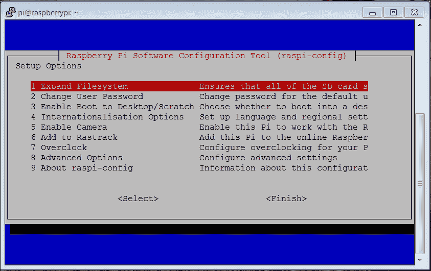
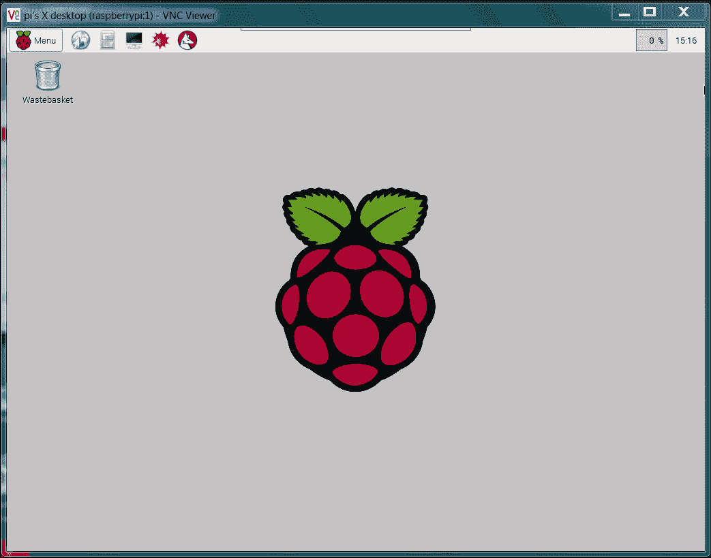

# 第一章：配置和编程树莓派

机器人正逐渐渗透到我们的世界中。它们形态各异，功能各不相同。就像个人计算机的进化一样，机器人开发领域的许多进展也来自于那些利用新一代廉价硬件和免费的开源软件进行开发的爱好者和 DIY 者，他们通过这些工具制造出各种具备惊人能力的机器。在本书中，你将学习如何通过制造一个机器人——一个具备传感器和视觉能力的四足机器人——来学习机器人构建的技能。然而，这些技能也可以应用于各种行走、滚动、游泳或飞行的机器人。

本章中，你将学习：

+   如何使用 Raspbian 操作系统配置树莓派，这将成为你机器人控制中心的一部分。

+   如何设置远程开发环境，以便你可以编程控制你的机器人。

+   具备 Python 和 C 的基本编程技能，这样你就可以创建和编辑机器人所需的程序，来完成所有那些令人惊叹的任务。

# 配置树莓派——你机器人的大脑

你机器人中最重要的部分之一是你用来控制所有不同硬件的处理器系统。在本书中，你将学习如何使用树莓派——一个小型、廉价、易于使用的处理器系统。树莓派有几种不同的型号——最初的 A 型和 B 型，以及改进后的 A+型和 B+型。B+型是最受欢迎的型号，具有额外的输入/输出能力、四个 USB 接口、更大的内存，它将是本书中我们重点介绍的型号。

以下是设置初始树莓派开发环境所需的设备：

+   一个树莓派，B 2 型号。还有其他三种树莓派型号，分别是 B+、B 和 A。这些型号的处理能力较低，并且硬件配置也有所不同。本书将重点介绍树莓派 B 2 型，它具有最佳的处理能力和最实用的输入/输出接口。然而，本书中的许多内容也适用于树莓派 B+和 A 版本，可能需要一些额外的硬件。

+   一条用于为主板提供电力的 USB 电缆。

+   一张 microSD 卡——至少 4GB。

+   一台 microSD 卡读卡器。

+   另一台已连接到互联网的计算机。

+   一条用于连接主板的网络线——在初步配置过程中，你需要一根 LAN 电缆和有线 LAN 连接。

+   一台无线 LAN 设备。

以下是树莓派 B 2 型号主板的外观：


你还应该熟悉主板上的不同连接端口。以下是 B 2 型号的连接端口，已标注以供参考：


# 安装操作系统

在开始之前，你需要下载并创建一张包含 Raspbian 操作系统的 SD 卡。你将把 Raspbian——一个开源的 Debian 版本 Linux 系统——安装到你的树莓派上。

有两种方法可以将 Raspbian 安装到你的板子上。由于树莓派越来越流行，你现在可以购买一张预装了 Raspbian 的 SD 卡，或者你也可以将其下载到个人电脑上，然后安装到 SD 卡上。如果你打算下载一个发行版，你需要决定是使用 Windows 电脑来下载并创建 SD 卡，还是使用 Linux 机器。

无论你将使用哪台机器，都需要下载一个镜像。打开浏览器窗口，访问树莓派官网，[www.raspberrypi.org](http://www.raspberrypi.org)，然后从页面顶部选择**下载**。这将提供多种下载选项。进入**Raspbian**部分，选择图片标识右侧的`.zip`文件。这将下载一个包含 Raspbian 操作系统镜像的压缩文件。请记下默认的用户名和密码，稍后会用到。

如果你使用的是 Windows，你需要通过类似 7-Zip 的归档程序来解压文件。解压后，你将得到一个`.img`扩展名的文件，这个文件可以被写入到你的 SD 卡中。接下来，你需要一个程序将镜像写入到卡片中。如果你打算用 Windows 机器创建 SD 卡，可以使用 Image Writer 程序。你可以在[www.raspberrypi.org](http://www.raspberrypi.org)网站的下载部分找到该程序的链接。将 SD 卡插入 PC，运行该程序，界面应该如下所示：


选择正确的卡片和镜像，应该看起来像这样：


然后选择**写入**。这将需要一些时间，但完成后，从 PC 中弹出卡片。

如果你使用 Linux，你需要先解压文件，然后将其写入到卡片中。你可以通过一条命令完成所有操作。不过，你需要找到卡片的`/dev`设备标签。你可以通过`ls -la /dev/sd*`命令来做到这一点。如果你在插入卡片之前运行此命令，可能会看到如下内容：


插入卡片后，你可能会看到如下内容：


请注意，你的卡片是`/dev/sdb`。现在，进入你下载归档镜像文件的目录，并运行以下命令：

```
sudo dd if=2015-01-31-raspbian.img  of=/dev/sdX

```

`2015-01-31-raspbian.img`命令将被你下载的镜像文件替代，`/dev/sdX`将被你的卡片 ID 替代；在这个例子中是`/dev/sdb`。

一旦你的卡片镜像创建完成，安装到 Raspberry Pi 上。你还需要将 Raspberry Pi 连接到局域网（LAN）电缆，并将 LAN 电缆插入有线局域网网络。

### 注意

如果你没有有线连接，可以通过直接将 Raspberry Pi 连接到显示器、键盘和鼠标来完成以下步骤。

开启设备电源。**POWER LED**应当亮起，设备应从卡片启动。为了配置卡片，你需要远程访问它。为此，你现在需要通过 SSH 连接到设备，SSH 是一种安全协议，允许你从另一台计算机远程控制一台计算机。

远程访问系统的挑战之一是你需要知道板卡的 IP 地址。通过使用 IP 扫描器应用程序，可以发现这一点。有几款免费的扫描器可供选择；在 Windows 上，一个可能的选择是 Advanced IP Scanner，可以从[`www.advanced-ip-scanner.com/`](http://www.advanced-ip-scanner.com/)下载。以下是程序运行时的界面：


点击**Scan**选择器可以扫描所有连接到网络的设备。你也可以在 Linux 上执行此操作；在 Linux 中，一个 IP 扫描应用程序叫做 Nmap。要安装 Nmap，输入`sudo apt-get install nmap`。要运行 Nmap，输入`sudo nmap -sP 10.25.155.1/154`，扫描器将扫描从 10.25.155.1 到 10.25.155.154 的地址。

这些扫描器可以让你知道哪些地址正在使用，这样你就能找到你的 Raspberry Pi 的 IP 地址。由于你将通过 SSH 访问设备，你还需要在远程计算机上运行一个 SSH 终端程序。如果你使用的是 Microsoft Windows，可以下载这样的应用程序。一个简单易用的选择是 Putty。它是免费的，并且做得非常好，可以保存配置，这样你就不必每次都重新输入。该程序可以从[www.putty.org](http://www.putty.org)下载。

在你的 Microsoft Windows 计算机上下载 Putty。然后运行`putty.exe`。你应该会看到一个配置窗口，它看起来像下面的截图：


在**Host Name**字段中输入 IP 扫描器中的`inet addr`，并确保选择了 SSH。你可能希望将此配置保存为“Raspberry Pi”，这样每次都可以重新加载它。

当你点击**Open**时，系统将尝试通过局域网连接打开 Raspberry Pi 的终端窗口。第一次这样做时，你会收到一个关于 RSA 密钥的警告，因为这两台计算机互不认识；所以 Windows 会提示你一台它不认识的计算机即将以相当亲密的方式连接。只需点击**OK**，你应该会看到一个带有登录提示的终端，像下面的截图一样：


现在你可以登录并向 Raspberry Pi 发送命令。如果你希望从 Linux 机器上进行操作，过程会更简单。打开一个终端窗口，并输入`ssh pi@xxx.xxx.xxx.xxx –p 22`，其中`xxx.xxx.xxx.xxx`是设备的`inet addr`。这将带你进入 Raspberry Pi 的登录界面，应该与之前的截图类似。

登录后，你应该看到如下界面：



首先，你需要扩展文件系统以占用整个卡片空间。所以，按下*Enter*键，你将看到以下屏幕：


再次按*Enter*键，你将返回到主配置界面。现在，选择**启用桌面/程序启动**选项。


当你按下*Enter*键时，你将看到以下屏幕：


你也可以选择超频你的设备。这是一种让你从系统中获取更高性能的方式。不过，超频有可能会导致系统出现可靠性问题。

完成后，返回到主配置菜单，按*Tab*键直到光标定位到**<Finish>**选项上，然后按*Enter*键。接着，再次按*Enter*键以重启你的 Raspberry Pi。此次登录时，你将看不到任何配置选项。然而，如果你将来想要更改配置选项，可以通过在命令提示符下输入`raspi-config`来运行配置工具。

# 添加远程图形用户界面

在构建机器人时，有些步骤你需要通过图形界面查看系统。你可以通过名为 vncserver 的应用程序，在你的 Raspberry Pi 上获取这个界面。你需要在 Raspberry Pi 的终端窗口中输入`sudo apt-get install tightvncserver`来安装此应用程序的版本。

Tightvncserver 是一个允许你远程查看完整图形桌面的应用程序。安装完成后，你可以执行以下操作：

1.  你需要通过在 Raspberry Pi 的终端窗口中输入`vncserver`来启动服务器。

1.  接着，你将被要求输入密码，并确认密码，然后询问是否希望设置只读密码。记住你输入的密码，你将需要它来通过 VNC 查看器进行远程登录。

1.  你需要为你的远程计算机安装 VNC 查看器应用程序；一个不错的选择是 Real VNC，可以从[`www.realvnc.com/download/viewer/`](http://www.realvnc.com/download/viewer/)下载。当你运行它时，你应该看到如下界面：

1.  输入 VNC 服务器地址，即你的 Raspberry Pi 的 IP 地址，然后点击**连接**。你会收到一个关于未加密连接的警告；选择**继续**，你会看到这个弹出窗口：

1.  输入你在启动 vncserver 时刚刚设置的密码，接着你将看到 Raspberry Pi 的图形界面，类似以下截图：

现在，你可以访问系统的所有功能，尽管如果你进行图形密集型的数据传输时，速度可能会变慢。为了避免每次启动 Raspberry Pi 时都要输入 vncserver 命令，你可以参考[`www.havetheknowhow.com/Configure-the-server/Run-VNC-on-boot.html`](http://www.havetheknowhow.com/Configure-the-server/Run-VNC-on-boot.html)中的说明来设置。

vncserver 也可以通过 Linux 使用。你可以使用一个名为“远程桌面查看器”的应用程序来查看远程的 Raspberry Pi Windows 系统。如果你还没有安装这个应用程序，可以根据你使用的 Linux 系统类型，使用更新的软件包来安装它。安装完软件后，请按照以下步骤操作：

1.  运行该应用程序后，你应该会看到以下截图：

1.  确保 vncserver 正在 Raspberry Pi 上运行；最简单的方式是通过 SSH 登录并在命令行中运行 vncserver。现在，点击**连接**按钮，进入**远程桌面查看器**。根据以下方式填写屏幕内容。在**协议**选择项中，选择**VNC**，你应该能看到以下截图：

1.  接下来，输入主机 inet 地址—确保在末尾加上`:1`，然后点击**连接**。你需要输入你设置的 vncserver 密码，像下面的截图所示：

现在，你应该能看到 Raspberry Pi 的图形界面。你可以开始与系统进行交互了！

## 建立无线连接

现在你的系统已经配置好了，接下来的步骤是通过无线将你的 Raspberry Pi 连接到远程计算机。为此，你需要添加一个无线 USB 设备并进行配置。请参考[`elinux.org/RPi_USB_Wi-Fi_Adapters`](http://elinux.org/RPi_USB_Wi-Fi_Adapters)来识别已验证与 Raspberry Pi 兼容的无线设备。以下是一款在许多在线电子商店都有销售的设备：


要连接到无线局域网，请启动系统并通过输入`sudo nano /etc/network/interfaces`来编辑网络文件。然后，编辑该文件，使其如下所示：


重启你的设备，它现在应该已经连接到无线网络。

### 注意

如果你使用的是美国键盘，可能需要编辑键盘文件，以便有效使用 nano。为此，输入 `sudo nano /etc/default/keyboard` 并将 `XKBLAYOUT="gb"` 修改为 `XKBLAYOUT="us"`。

你的系统有很多功能。尽管去玩弄系统，这将帮助你了解系统中已有的内容以及你从软件角度想要添加的内容。

# 树莓派上的编程

最后一点介绍，你需要一些基本的编程技能才能在项目中取得成功。本节将简要介绍在树莓派上使用 Python 和 C 进行编程。

## 在树莓派上创建和运行 Python 程序

你将使用 Python 出于两个原因。首先，它是一种简单的语言，直观且非常容易使用。其次，机器人领域中许多开源功能都可以使用 Python。为了运行本节中的示例，你需要安装 Python 的某个版本。幸运的是，基础的 Raspbian 系统已经安装了一个版本，因此你已经准备好开始了。

### 注意

如果你是编程新手，有许多不同的网站提供互动式教程。如果你想使用这些工具练习一些 Python 中的基本编程概念，可以访问 [www.codeacademy.com](http://www.codeacademy.com) 或 [`www.learnpython.org/`](http://www.learnpython.org/) 并试一试。

不过，为了帮助你入门，首先让我们了解如何创建和运行一个 Python 文件。事实上，Python 是一种交互式语言，你可以运行 Python 后逐个输入命令。但是，你希望使用 Python 来创建程序，因此你将编写 Python 程序，并通过在命令行中调用 Python 来运行这些程序。

通过输入 `emacs example.py` 打开一个示例 Python 文件。现在，将一些代码放入文件中。开始时，使用以下截图中的代码行：


### 注意

你的代码可能会有颜色编码。我已将颜色编码去除，以便更容易阅读。

让我们来看看代码，看看发生了什么：

1.  `a = input("Input value: ")`：程序的基本需求之一是获取用户输入。`raw_input` 部分允许我们做到这一点。数据将由用户输入并存储在 `a` 中。提示 `"Input value:"` 会显示给用户。

1.  `b = input("Input second value: ")`：这段数据同样由用户输入并存储在 `b` 中。提示 `"Input second value:"` 会显示给用户。

1.  `c = a + b`：这是一个可以使用数据进行的操作示例；在这个例子中，你可以将 `a` 和 `b` 相加。

1.  `print c`：程序的另一个基本需求是打印输出结果。print 命令会打印出 `c` 的值。

创建完程序后，保存它（使用`ctrl-x ctrl-s`）并退出 emacs（使用`ctrl-x ctrl-c`）。现在，从命令行运行程序，输入`python example.py`。你应该能看到类似以下截图的内容：


你还可以通过在程序中添加一行代码，从命令行直接运行程序，而无需输入`python example.py`。现在，程序应该像以下截图所示：


在第一行添加`#!/usr/bin/python`仅仅是为了使这个文件能够从命令行执行。保存文件并退出 emacs 后，输入`chmod +x example.py`。这将更改文件的执行权限，计算机将认可并执行它。你现在应该能够直接输入`./example.py`，程序应该能如截图所示运行：


请注意，如果你只是输入`example.py`，系统将无法找到可执行文件。在这种情况下，文件尚未在系统中注册，因此你需要为其指定文件路径。在这种情况下，`./`表示当前目录。

## C/C++ 编程语言介绍

现在你已经了解了一种简单的编程语言——Python，你还需要接触一种更复杂但功能强大的语言——C。C 是 Linux 的原始语言，已经存在了几十年，但仍然被开源开发者广泛使用。它与 Python 相似，但也有所不同。由于你可能需要理解并修改 C 代码，因此你应该熟悉它，并了解它的使用方法。

和 Python 一样，你需要访问语言功能。这些功能以编译器和构建系统的形式提供，将你的文本文件转换为包含机器代码的程序，以便处理器可以实际执行。要做到这一点，输入`sudo apt-get install build-essential`。这将安装将代码转换为系统可执行文件所需的程序。

工具安装完成后，让我们从一些简单的例子开始。以下是第一个 C/C++ 代码示例：


以下是对代码的解释：

+   `#include <iostream>`：这是一个包含的库，用于使程序能够从键盘输入数据并将信息输出到屏幕。

+   `int main()`：和 Python 一样，我们可以在文件中放置函数和类，但你总是希望从一个已知的起点开始执行；C 语言将这个起点定义为`main`函数。

+   `int a;`：这定义了一个名为`a`的变量，类型为`int`。C 是我们所说的强类型语言，这意味着我们需要声明定义变量时的类型。常见的类型有`int`（整数，不带小数点）；`float`（带小数点的数字）；`char`（字符）；和`bool`（`true`或`false`值）。还要注意，C 语言中的每一行都以`;`字符结尾。

+   `int b;`：这定义了一个名为`b`的变量，类型为`int`。

+   `int c;`：这定义了一个名为`c`的变量，类型为`int`。

+   `std::cout << "Input value: ";`：这将在屏幕上显示字符串`"Input value: "`。

+   `std::cin >> a;`：用户输入的内容将存入变量`a`。

+   `std::cout << "Input second value: ";`：这将在屏幕上显示字符串`"Input second value: "`。

+   `std::cin >> b;`：用户输入的内容将存入变量`b`。

+   `c = a + b`：这个语句是将两个值相加的简单操作。

+   `std::cout << c << std::endl;`：`cout`命令打印出`c`的值。末尾的`endl`命令会打印一个换行符，使得下一个字符出现在下一行。

+   `return 0;`：主函数结束并返回`0`。

要运行这个程序，你需要通过编译过程将它转换为可执行程序，然后运行。为此，在创建程序后，输入`g++ example2.cpp –o example2`。这将处理你的程序，将它转换为计算机可以执行的文件。可执行程序的名称将是`example2`（由`–o`选项后的名称指定）。

在编译完毕后，如果你在目录中运行`ls`，你应该能在目录中看到`example2`文件，如下图所示：


如果遇到问题，编译器会尝试帮助你找出问题。例如，如果你在`int a`的表达式中忘记了`int`，在尝试编译时会得到以下错误：


错误信息指示在`int main()`函数中出现了问题，并告诉你变量`a`没有成功声明。一旦编译好文件，要运行可执行文件，输入`./example2`，你应该能够得到以下结果：


### 注意

如果你有兴趣学习更多关于 C 编程的内容，互联网上有很多好的教程可以帮助你，例如：[`www.cprogramming.com/tutorial/c-tutorial.html`](http://www.cprogramming.com/tutorial/c-tutorial.html) 和 [`thenewboston.org/list.php?cat=14`](http://thenewboston.org/list.php?cat=14)。

你还需要了解 C 语言的一个方面。你刚刚遇到的编译过程看起来相当直接。然而，如果你的功能分布在很多文件之间，或者需要大量的库，那么使用命令行执行编译可能会变得不太方便。

C 开发环境提供了一种自动化这个过程的方法；它被称为 make 过程。在使用这个方法时，你创建一个名为 `makefile` 的文本程序，定义你想要包含和编译的文件，然后，代替输入一长串命令，你只需要输入 `make`，系统将根据 `makefile` 程序中的定义执行编译。有几个很好的教程介绍了这个系统——例如，[`www.cs.colby.edu/maxwell/courses/tutorials/maketutor/`](http://www.cs.colby.edu/maxwell/courses/tutorials/maketutor/) 或者 [`mrbook.org/tutorials/make/`](http://mrbook.org/tutorials/make/)。

现在你已经具备了编辑和创建自己编程文件的能力。接下来的章节将为你提供很多机会来练习你的技能，同时将代码行转换为炫酷的机器人功能。

# 摘要

恭喜你！你的 Raspberry Pi 已经安装并正常工作。这块硬件不会再被丢进垃圾箱了，现在，你准备好开始指挥你的 Raspberry Pi 做些事情了。

下一章将向你展示如何构建你的双足机器人。
