# 第二章. 构建双足机器人

现在你已经配置好树莓派 2 Model B 并准备就绪，你需要添加一些硬件来进行控制和接口。在本章中，你将学习：

+   如何构建一个基本的 10 **自由度**（**DOF**）双足机器人

+   如何使用连接到树莓派 USB 端口的伺服电机控制器来控制伺服电机，从而使机器人运动

# 构建可以行走的机器人

在考虑如何创建一个移动机器人时，有几种选择。比较有趣的选择之一是能够行走的机器人。通常有三种版本：一种是具有两条腿的双足机器人，另一种是具有四条腿的双足机器人，还有一种是具有六条腿的六足机器人。虽然每种选择都提供了有趣而不同的可能性，但在本章中，你将构建一个基本的 10 自由度双足机器人。

你将为你的项目使用共计 10 个伺服电机，因为每条腿有 5 个活动点，或者说是 5 个自由度（DOF）。由于伺服电机是这个项目中最关键的组件，因此，可能有必要通过一个伺服电机的教程来学习如何控制它们。

# 伺服电机的工作原理

伺服电机与直流电机有些相似。然而，它们之间有一个重要的区别。直流电机通常设计为以连续的方式旋转——以给定的速度旋转 360 度——而伺服电机通常设计为移动到有限的角度范围。换句话说，在直流电机的世界中，你通常希望电机以你控制的连续旋转速度旋转。在伺服电机的世界里，你希望电机移动到你控制的特定位置。

这是通过向伺服电机的控制连接器发送**脉宽调制**（**PWM**）信号来完成的。这个脉冲的长度将控制伺服电机的角度，如下所示：

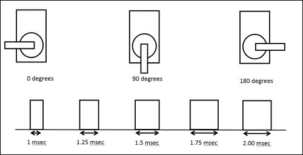

这些脉冲以 60 Hz 的重复率发送。通过设置正确的控制脉冲，你可以将伺服电机定位到任何角度。

# 构建双足平台

构建双足平台有几种方法。也许最简单的方法是购买一套基本的零件；这是你在本章中将看到的示例。市面上有几个套件选择，其中包括在[`www.robotshop.com/en/lynxmotion-biped-robot-scout-bps-ns-servos.html`](http://www.robotshop.com/en/lynxmotion-biped-robot-scout-bps-ns-servos.html)上提供的套件、类似于[`www.ebay.com/itm/10-DOF-Biped-Robot-Mechanical-Leg-Robot-Servo-Motor-Bracket-NO-Servo-Motor-good-/131162548695?pt=LH_DefaultDomain_0&hash=item1e89e5a9d7`](http://www.ebay.com/itm/10-DOF-Biped-Robot-Mechanical-Leg-Robot-Servo-Motor-Bracket-NO-Servo-Motor-good-/131162548695?pt=LH_DefaultDomain_0&hash=item1e89e5a9d7)上提供的套件，或者[`www.amazon.com/gp/product/B00DR7GA4I/ref=oh_aui_detailpage_o04_s00?ie=UTF8&psc=1`](http://www.amazon.com/gp/product/B00DR7GA4I/ref=oh_aui_detailpage_o04_s00?ie=UTF8&psc=1)上的套件。这就是我们将在本章中使用的具体套件。

最终，您的双足机器人将更像人类或霸王龙的腿部，但这将使编程更容易，且关闭时更加平稳。它也会更加稳定。

您还需要 10 个标准尺寸的舵机。可以选择多个品牌，但**Hitec**舵机相对便宜，您可以在大多数模型店和在线电子零售商那里购买。这个过程中的一个重要步骤是选择舵机的型号。舵机有不同的型号，主要根据它们能产生的扭矩大小。

扭矩是舵机能够施加的力量，用来移动与其连接的部件。在本案例中，您的舵机需要提起并移动与双足机器人相关的重量，因此您需要选择具有足够扭矩的舵机。不过，双足机器人对于不同的部位有不同的扭矩需求。角关节不会抬起整个腿部，因此它们可以使用扭矩较小的舵机，例如 HS-422 舵机。对于膝关节舵机，您将需要一个更强大的舵机。在这种情况下，我建议您使用 HS-645MGHB 舵机。抬起腿部的髋关节是需要最多扭矩的地方，因此您也可以使用 HS-645MG 舵机。您也可以为所有舵机都使用 HS-645MG 舵机，但它们价格较高，因此使用不同型号的舵机可以节省一些资金。

另一个需要的零件是一些金属舵机舵盘。这些舵盘是可选的，但它们会让您的双足机器人比通常附带的塑料舵盘更加牢固。以下是其中一个舵盘的图片：

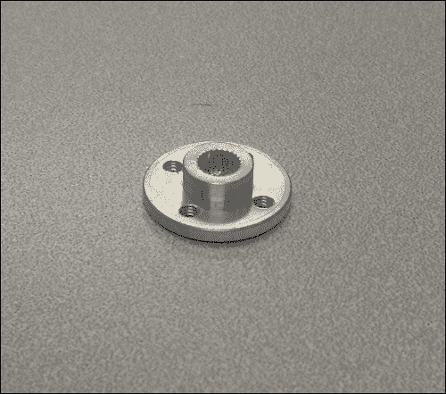

以下是组装双足机器人的步骤：

1.  将第一个脚踝舵机安装到脚部。为此，找到脚板，如下所示：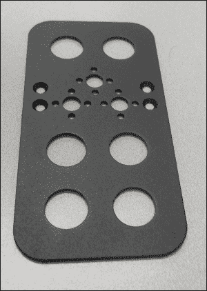

    这是脚底部。注意这些斜角孔——您将使用斜头螺栓将舵机支架连接到脚板上，如下所示：

    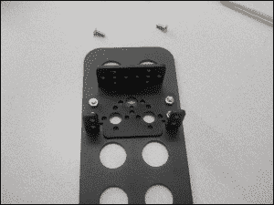

1.  确保脚底平整。在将舵机安装到这个支架之前，您需要先使用套件中的一个轴承将一个 U 形支架连接到舵机支架上，如下所示：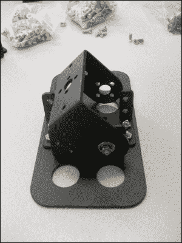

1.  最后，将其中一个舵机安装到支架中，并将 U 形支架连接到舵机的舵盘上，如下所示：

1.  第一个舵机应该允许您的双足机器人移动脚部，使其左右倾斜。现在，安装第二个脚踝舵机到脚部。这将使您的双足机器人能够使脚踝前后倾斜。为此，将一个舵机支架连接到您刚刚创建的装配件上，然后将一个 U 形支架添加到这个装配件中，如下所示：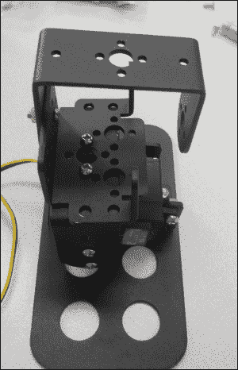

1.  现在，添加支架到这个组件，如下所示：

1.  现在，你可以将膝部舵机添加到你的双足机器人上。不过，首先你需要将上腿，最长的 U 型支架，连接到舵机支架上，如下所示：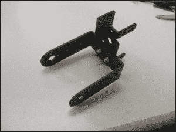

1.  现在，使用另一个轴承将这个组件连接到你已经组装好的下腿上，如下所示：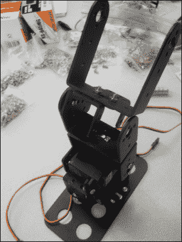

1.  现在，你可以将膝部舵机安装在此位置。如果你使用的是不同的舵机，可以在膝关节处使用更强大的舵机。这里是图片：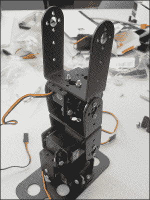

1.  最后一步是将髋部组装好。首先，你需要将转动腿部的舵机与舵机支架连接，如下图所示：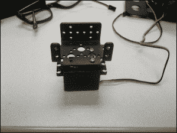

1.  现在，将这个舵机支架连接到长 U 型支架，并安装能够抬起整个腿部的舵机。这是另一个位置；如果你使用的是不同的舵机，需要使用一个具有较大扭矩的舵机。整个组件应如下所示：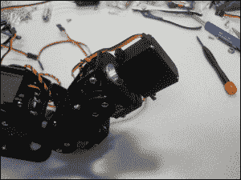

1.  将另一条腿组装好，它将成为第一条腿的镜像。

1.  现在，你需要通过首先将舵机支架连接器连接到髋部件的两个位置，将两条腿连接到髋部，如下所示：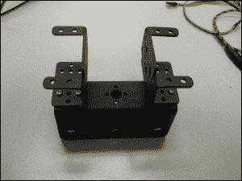

1.  最后，将腿部舵机的顶部安装到支架中，如下所示：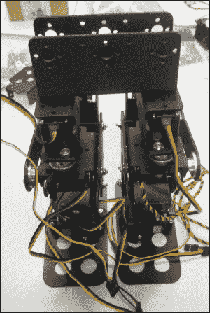

现在你的双足机器人已经准备好行走。既然你已经组装好了基本硬件，可以将注意力转向电子部分。

# 使用舵机控制器来控制舵机

要让你的双足机器人行走，首先需要将舵机控制器连接到舵机。你将在这个项目中使用的舵机控制器是一个简单的舵机控制器，利用 Pololu 的 USB 接口——Pololu 产品编号 1354，可以在 pololu.com 购买——它可以控制 18 个舵机。以下是设备的图片：

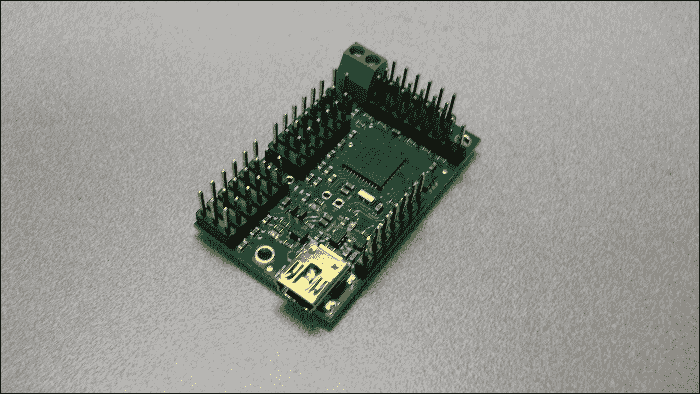

确保你订购的是已组装版本。这个硬件组件将把来自 Raspberry Pi 的 USB 命令转化为控制舵机电机的信号。Pololu 生产了多个不同版本的控制器，每个版本能够控制一定数量的舵机。在这种情况下，你可能想选择 18 舵机版本，这样你就可以用一个控制器控制所有 12 个舵机，还可以增加一个额外的舵机来控制摄像头或传感器的方向。你也可以选择 12 舵机版本。18 舵机控制器的一个优势是通过螺钉型连接器连接电源非常方便。

你需要做两个连接才能开始使用舵机控制器：第一个是连接舵机电机，第二个是连接电池。

首先，将伺服电机连接到控制器。为了保持一致性，使用以下配置将你的 12 个伺服电机连接到控制器上的 0 到 11 编号端口：

| 伺服连接器 | 伺服电机 |
| --- | --- |
| 0 | 右脚踝进/出 |
| 1 | 右脚踝前/后 |
| 2 | 右膝 |
| 3 | 右臀上/下 |
| 4 | 右臀旋转 |
| 5 | 左脚踝进/出 |
| 6 | 左脚踝前/后 |
| 7 | 左膝 |
| 8 | 左上/下 |
| 9 | 左臀旋转 |

以下是控制器背面的图片，它将告诉我们在哪里连接伺服电机：

现在，你需要将伺服电机控制器连接到电池。对于这个项目，你可以使用一个 2S RC 锂电池；它将为你的伺服电机提供所需的 7.4 伏电压和电流，电流大约为 2 安培。以下是一个图片：

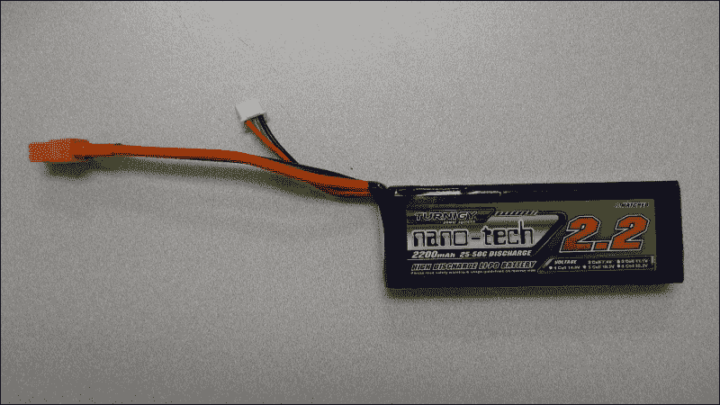

这块电池将配有两个连接器，一个带有较粗的线径用于正常使用，另一个较小的连接器用于连接电池充电器。你可以使用 XT60 连接器对，将一些电线焊接到电池连接器的配对端口，然后将电线的裸端插入伺服控制器。

你的系统现在已经可以正常工作。你可以将电机控制器连接到你的个人计算机，检查是否能够与其通信。为此，将一根迷你 USB 数据线连接到伺服控制器和你的个人计算机。

# 与伺服控制器通过 PC 进行通信

硬件连接完毕后，你可以使用 Polulu 提供的一些软件来控制伺服电机。我们可以通过个人计算机来完成此操作。首先，从 [www.pololu.com/docs/0J40/3.a](http://www.pololu.com/docs/0J40/3.a) 下载 Polulu 软件，并按照网站上的说明进行安装。安装完成后，运行软件，你应该看到如下屏幕：

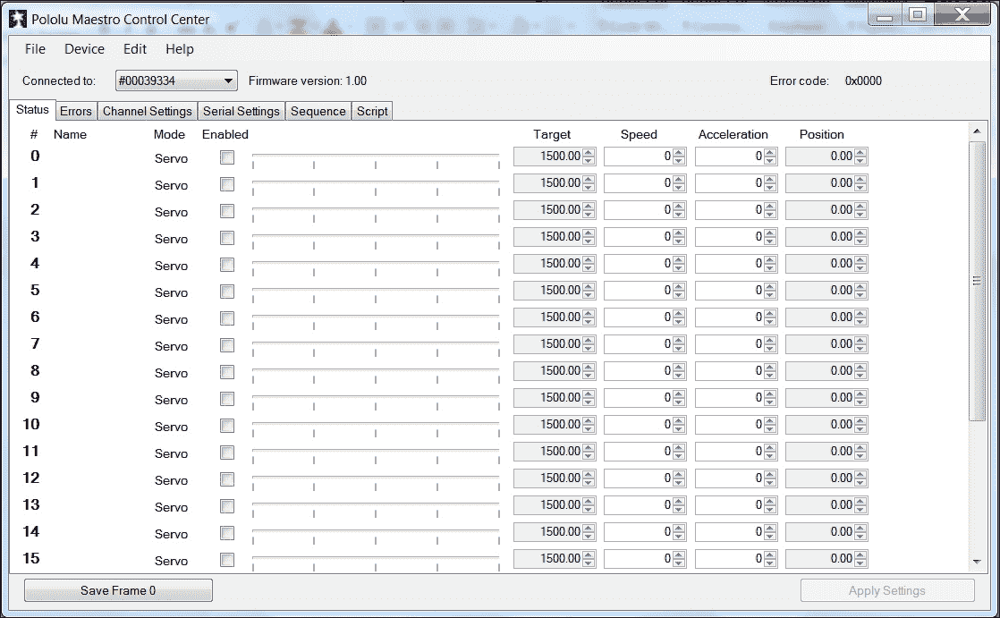

首先，你需要在“串口设置”中更改配置，选择 **串口设置** 标签，你应该会看到如下界面：

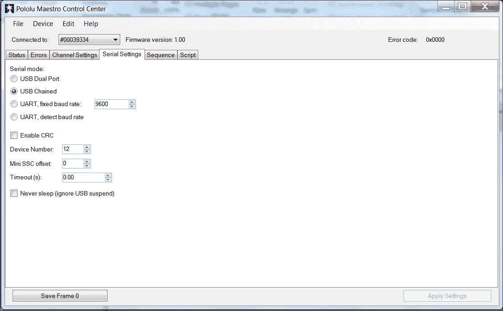

确保选择了“USB Chained”选项；这将允许你通过 USB 连接并控制电机控制器。现在，选择 **状态** 标签返回主屏幕；此时，你可以实际开启 10 个伺服电机。屏幕应当显示如下：

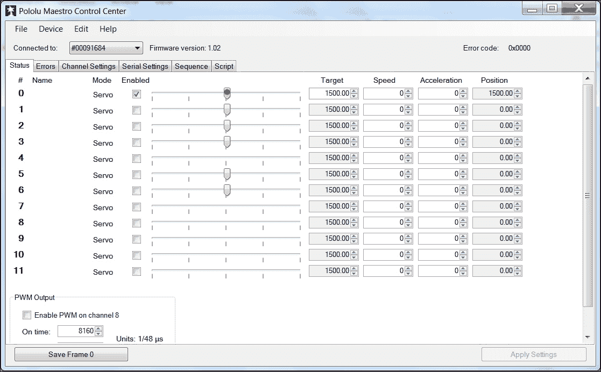

现在，你可以使用滑块来实际控制伺服电机。启动伺服电机 0，确保伺服电机 0 移动的是右下脚踝伺服电机。你也可以使用此功能来居中伺服电机。将伺服电机 1 设置到滑块的中间位置。然后，松开伺服电机上的伺服角直到伺服电机居中。在所有伺服电机的零位置时，你的双足机器人应该看起来是这样的：

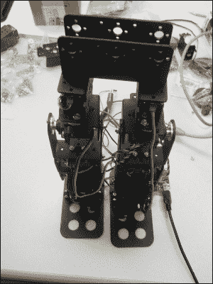

# 将伺服控制器连接到树莓派

您已经检查了舵机电机控制器和舵机。现在，您可以将电机控制器连接到树莓派，并确保您可以从中控制舵机。

现在，让我们与电机控制器交流。以下是步骤：

1.  将树莓派与电机控制器连接，通过将迷你 USB 连接到树莓派上的 USB 主机连接，如图所示：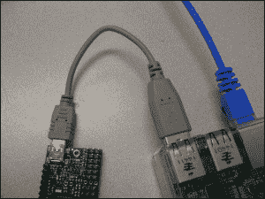

1.  在[`www.pololu.com/docs/0J40/3.b`](https://www.pololu.com/docs/0J40/3.b)下载 Pololu 的 Linux 代码。可能最好的方法是登录到您的树莓派，然后输入`wget http://www.pololu.com/file/download/maestro-linux-100507.tar.gz?file_id=0J315`。

1.  然后，使用`mv maestro-linux-100507.tar.gz\?file_id\=0J315 maestro-linux-100507.tar.gz`移动文件。

1.  输入`tar –xvf maestro_linux_011507.tar.gz`来解压文件。这将创建一个名为`maestro_linux`的目录。输入`cd maestro_linux`进入此目录，然后输入`ls`；您应该看到类似以下的内容：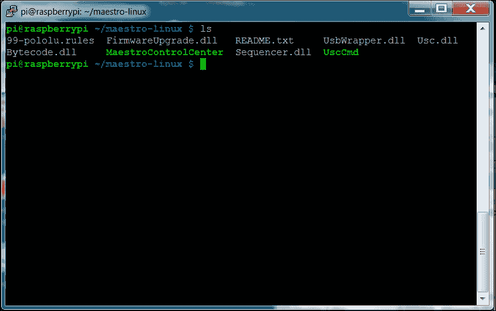

`README.txt`文件将为您提供如何安装软件的明确说明。不幸的是，您无法在树莓派上运行**MaestroControlCenter**；它使用的 Windows 版本不支持图形界面，但您可以使用**UscCmd**命令行应用程序控制您的舵机。首先，输入`./UscCmd --list`，您应该看到以下内容：

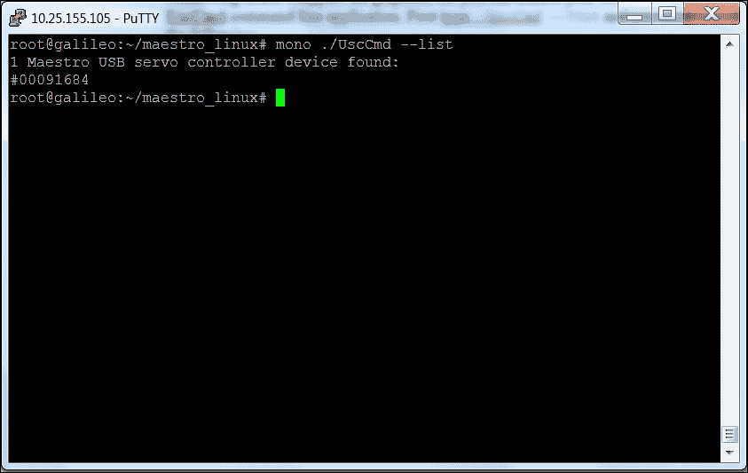

单元看到您的伺服控制器。如果只输入`./UscCmd`，您可以看到可以发送到控制器的所有命令：

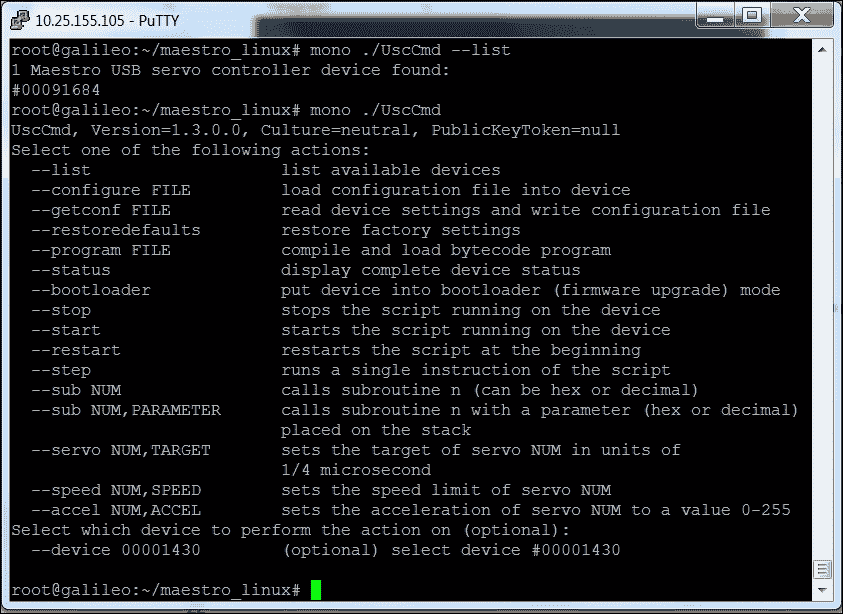

请注意，您可以向舵机发送特定的目标角度，尽管目标不在角度值内，因此很难知道您正在发送舵机的位置。连接了舵机和电池到伺服控制器后，尝试输入`./UscCmd --servo 0, 10`。舵机将移动到其全角位置。输入`./UscCmd – servo 0, 0`，将停止舵机尝试移动。在下一节中，您将编写一些 Python 代码，将您的角度转换为舵机控制器希望看到的命令，以将其移动到特定的角度位置。如果您在 USB 连接方面遇到问题，请参考[`www.linux-usb.org/FAQ.html`](http://www.linux-usb.org/FAQ.html)获取更多信息。

### 注意

如果没有运行 Windows 版本的 Maestro Controller 并将**串行设置**设置为**USB Chained**，则您的电机控制器可能无法响应。重新运行 MaestroController 代码，并将**串行设置**设置为**USB Chained**。

# 创建一个程序来控制您的双足机器人

现在你知道可以与舵机控制器通信并移动舵机了。在本节中，你将创建一个 Python 程序，让你与舵机通信，移动它们到特定的角度。你可以使用 Python，因为它非常简单且容易运行。

让我们从一个简单的程序开始，它会让你腿部移动的机器人舵机转到 90 度（这应该接近 0 到 180 度之间的中间位置）。下面是代码：

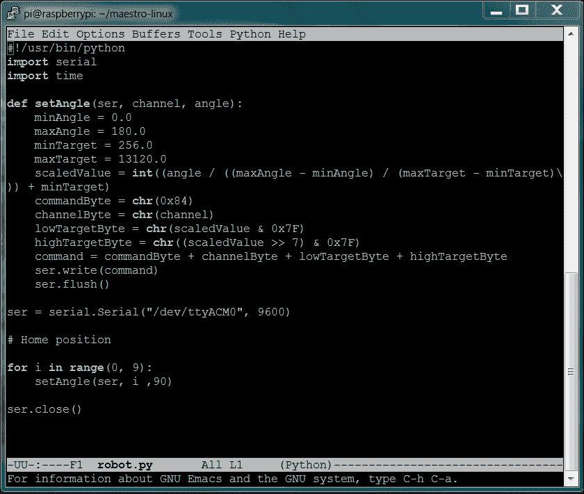

下面是代码的解释：

+   `#!/usr/bin/python`：这行代码让你可以从命令行执行此 Python 文件。

+   `import serial`：这一行导入了串行库。你需要这个库来通过 USB 与你的设备通信。

+   `def setAngle(ser, channel, angle):`：这个函数将你设定的舵机和角度转换为舵机控制器所需的串行命令。要了解用于控制舵机的具体代码，请参考[`www.pololu.com/docs/0J40`](https://www.pololu.com/docs/0J40)。

+   `ser = serial.Serial("/dev/ttyACM0", 9600)`：这行代码打开与你的舵机控制器的串行端口连接。

+   `for i in range(0, 9)`：for 循环用于访问所有九个舵机。

+   `setAngle(ser, i, 90)`：现在，你可以将每个舵机设置为中间（家）位置。默认情况下，每个舵机会设置为 90 度。如果你的腿部不在中间位置，你可以通过调整每个舵机的舵机轮来进行调整。

要访问串行端口，你需要确保你已经安装了 Python 串行库。如果没有，可以输入 `apt-get install python-serial` 来安装。安装好串行库后，你可以通过输入 `python quad.py` 来运行你的程序。

一旦你设置好基本的家庭位置，就可以让你的机器人做一些事情。我们从让双足机器人移动它的脚开始。下面是 Python 代码：

在这种情况下，你正在使用 `setAngle` 命令来设置你的舵机，操控机器人右脚踝。

# 总结

现在你有了一个可以移动的机器人！在下一章中，你将学习如何让你的机器人做很多神奇的事情。你将学习如何让它向前和向后走，如何让它跳舞和转弯。有了一些基本的知识，任何动作都是可能的。
