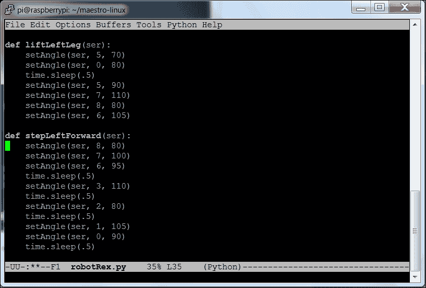

# 第三章：双足机器人的运动

现在你的双足机器人已经启动并运行，你可以开始开发一些有趣的方式来让它移动。在这一章中，你将学习

+   如何调整伺服器的位置以达到霸王龙的姿势

+   你机器人的基本行走步态

+   你的机器人的基本转向

在开始之前，最好为你的双足机器人创建一个支架。你的机器人天生就不稳定，只有两条腿，并且在实验过程中，你可能会犯一些错误。仅凭两条腿，这些错误很可能会导致你的机器人摔倒，从而损坏机器人。

如果你有电子板台钳或“额外的手”设备，它们在这方面非常有用。下面是使用这个设备来创建支架的图片：

如果没有，你也可以使用 PVC 管或木材轻松创建这种悬挂支架。实际上，任何可以防止你在实验过程中摔倒机器人的物品都可以。

# 一个基本的稳定姿势

现在你的双足机器人已经完成，并且你知道如何使用 Python 来编程控制伺服器，你可以尝试一些基本的姿势。你将首先创建一个程序，允许你设置单独的伺服器，这样你就可以进行实验。以下是这个程序：

这段代码包括了来自第二章的 Python `setAngle` 函数，*构建双足机器人*。具体的内容来自于 [www.pololu.com](http://www.pololu.com) 网站，但它的功能非常简单，就是允许你将特定伺服器设置到特定的角度。

代码的下一部分将所有伺服器设置到它们的中心位置。代码的最后一部分，`while 1:` 代码块，简单地要求用户输入伺服器和角度，然后将命令发送到伺服器控制器。

一旦程序运行，你应该看到你的双足机器人直立。如果没有，你可能需要通过调整伺服器的角度来重新校准伺服器的位置。这是一个有用的姿势，但还有一些其他更稳定的姿势。作为一个很好的初步示例，你可以将姿势改为更像恐龙霸王龙（Tyrannosaurus Rex）的姿势，膝盖指向后方。以下是基本的伺服器位置：

| 伺服器 | 角度 |
| --- | --- |
| 1 | 60 |
| 2 | 60 |
| 3 | 60 |
| 6 | 120 |
| 7 | 120 |
| 8 | 120 |

机器人姿势应该是这样的：

你可以使用这些角度来实现这个姿势。然而，这样会限制你的移动能力，因为你的伺服器将在单一方向上接近最大移动范围。由于这是你机器人起始的姿势，为了实现最大灵活性，你需要将伺服器调整到这个中心位置。为此，运行默认的 `robot.py` 来将双腿设置为中心位置。现在，调整伺服器角度，以便在伺服器角度为 90 度时，达到这个姿势。

它应该看起来像这样：

现在你有了一个稳定的基础，你可以开始编写简单的行走动作程序。

# 基本行走动作

你的机器人已经准备好行走，然而，你首先需要让一条腿离开地面。当然，这很简单；只需通过改变膝关节的角度抬起腿部，腿就能离开地面。你还可以改变前后踝关节的角度；这可以让你抬起腿时不需要抬得太高。

然而，如果仅仅调整这两个伺服器，你会遇到问题；当你抬起腿时，机器人会摔倒。这是由于一个简单的原理，叫做重心。当机器人处于静止状态时，重心是这样的：

很明显，如果你抬起一条腿，机器人会朝着被抬起的腿的方向摔倒。你需要做的是使用可以使机器人左右倾斜的踝关节伺服器，将重心转移到将留在地面的腿上，这样它最终会像这样：

然后你需要设置伺服器来抬起左腿。以下是这些伺服器设置的侧视图：

现在，是时候编写一些 Python 代码来实现这一点了。你将从 `robot.py` 代码开始，并在一个名为 `liftLeftLeg` 的函数中添加以下几行代码：

这样会让机器人倾斜到右腿上，然后抬起左腿，如下所示：

现在，向前迈步相对容易。只需将左腿的髋关节向前移动，然后将右腿的踝关节移动，以便将整个机器人向前倾斜。下面是图示和伺服器设置：

这是 Python 代码：

这是机器人的照片：

这是行走步态的第一阶段。那么，让我们详细说明你需要的所有动作，以便让机器人向前行走。以下是不同状态的侧视图：

下面是机器人在不同状态下的图片：

下面是不同状态下各个函数的 Python 代码：

你会注意到每个功能都有一些不同的伺服控制指令；这些必须按照这个顺序执行才能得到期望的结果。

下面是将两个步骤的函数按顺序排列的 Python 代码：一个是左腿，另一个是右腿：

这是一种非常简单的步态，虽然不算特别优雅。你可以看到每个状态都是由许多独立的伺服动作组成的。当然，你可以添加更多的伺服动作，使其更加平滑和精细。你具体的伺服角度设置可能会与这些不同；你需要进行一些实验来确保双足机器人的腿部定位正确。

既然你已经能让机器人行走了，接下来你还需要教它如何转弯。

# 机器人的基本转弯

你的机器人可以向前走，但你还希望它能够转弯。转弯的限制在于你能转动机器人髋部的角度，对于这款机器人来说，大约是 20 度。所以，要完成一个 90 度的转弯，你需要将转弯分为几个步骤。这里的一个重要区别是，当你回到站立状态时，你不想将髋部旋转伺服电机重置为 90 度。以下是转弯的图示，其中包括一些后视图：

这是一个基本转弯操作的 Python 代码：

这是将这些基本状态连接在一起，以实现转弯的 Python 代码：

现在你的机器人可以行走并转弯了！显然，通过反转每个函数中的伺服控制语句顺序，机器人还可以向后走。按照本章中概述的规划方法，你还可以编程更多类型的动作。

# 总结

现在，机器人可以移动了。下一步是添加一些传感器，使机器人能够避开或找到路径上的物体。
