# 第四章：避免障碍物的传感器应用

你已经构建了双足机器人。现在，机器人可以移动了。但是如果你希望它能够感知外部世界，避免碰到物体呢？在本章中，你将学习如何添加一些传感器来帮助避免障碍物。

具体而言，你将学习：

+   如何将 Raspberry Pi 连接到**红外**（**infrared**）传感器

+   如何将 Raspberry Pi 连接到 USB **声纳传感器**以检测外部世界

+   如何将 Raspberry Pi 和其 GPIO 连接到声纳传感器以检测外部世界

# 将 Raspberry Pi 连接到红外传感器

你的机器人现在可以移动，但你可能希望它能够感知障碍物或目标。实现这一点的方式之一是使用红外（IR）传感器。首先，需要了解红外传感器的基础知识。红外传感器包含发射器和接收器。发射器发出一束窄光束，传感器接收这束光。

传感器中的差异最终表现为一个角度测量，如下图所示：

不同的角度给出了物体距离的指示。传感器将这些角度测量转换为一个电压信号，你可以通过该信号来判断距离。不幸的是，传感器输出与距离之间的关系并不是线性的，因此你需要进行一些校准，以预测实际距离及其与传感器输出之间的关系。

### 注意

红外传感器非常准确，误差率较低；但是，如果环境光线过强，它们可能工作不佳。传感器的准确性还会受到被测物体反射特性的影响。在决定使用哪种传感器时，这一点也是需要考虑的因素。

在开始之前，你需要获取一个传感器。较为流行的选择是由 Sharp 提供的廉价红外传感器。它可以在许多在线电子商店购买，并且有多个型号可感应不同的距离。你将使用**Sharp 2Y0A02**型号，这款设备可以感知最远 150 厘米的距离。以下是该传感器的图片：

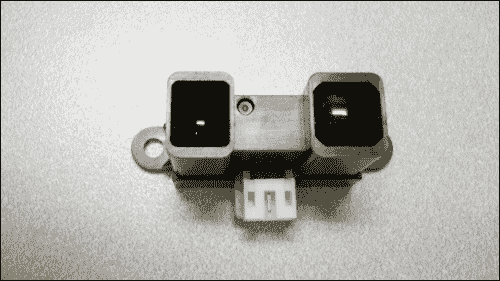

你还需要确保获取设备的连接电缆，通常设备会附带此电缆。以下是带有电缆的传感器图片：

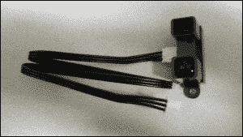

如教程中所述，传感器输出的电压将表示距离。然而，这是一个模拟信号，而 Raspberry Pi 并没有模拟到数字的转换器，无法将该模拟电压转换为可以在程序中读取的数字。因此，你需要为项目添加一个模拟到数字转换器。

有两种选择。如果你想要一个直接插入 USB 接口的模拟到数字转换器，可以访问[www.phidgets.com](http://www.phidgets.com)。这块板非常了不起；它将模拟信号转换成数字数据，并通过 USB 端口提供读取。这部分的型号是**1011_0 - PhidgetInterfaceKit 2/2/2**，如下所示：

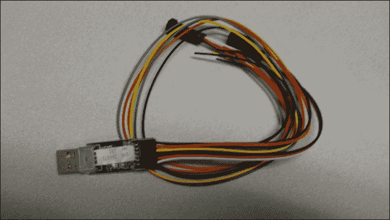

不幸的是，启动并运行这个系统需要一些编程经验。另一个选择是使用一个连接到树莓派 GPIO 引脚的模拟到数字转换器。有一款名为**ADC pi+**的部件，来自[www.abelectronics.co.uk](http://www.abelectronics.co.uk)，它可以实现这一功能。它的图片如下：

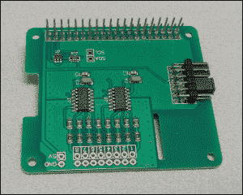

这个设备更容易编程，因此你将在这个项目中使用它。现在，来连接传感器：

1.  将焊接针脚到 ADC Pi+板上，以连接到 ADC，像这样：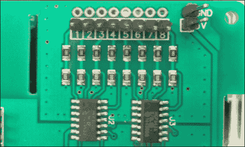

1.  现在，将板子插入树莓派 B 2 型号。以下是组合连接的图片：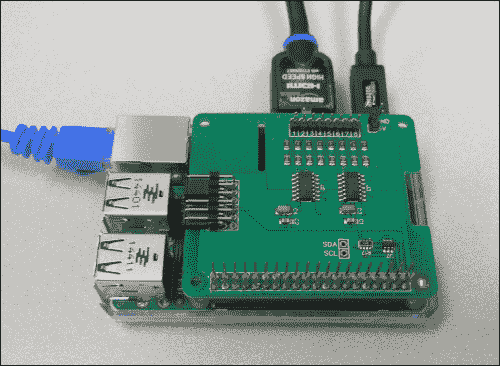

1.  现在，你将把红外传感器连接到 ADC。为了连接这个模块，你需要将传感器底部的三个引脚连接起来。以下是连接清单：

    | ADC-DAC 板 | 传感器引脚 |
    | --- | --- |
    | 5V | Vcc |
    | GND | Gnd |
    | In1 | Vo |

    不幸的是，模块上没有标签，但你需要连接的引脚如下：

    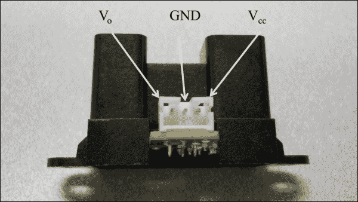

    最简单的连接方式是使用通常随传感器附带的三线电缆。一旦连接好引脚，你就可以通过树莓派上的 Python 程序访问传感器的数据。整个系统看起来是这样的：

    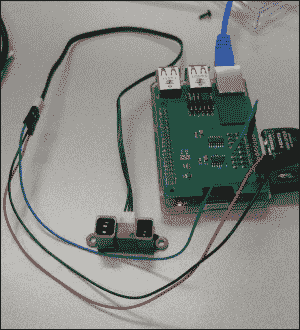

现在，你已经准备好添加一些代码来读取红外传感器。你需要按照以下步骤与 ADC 进行通信：

1.  启用 ADC 的第一步是启用 I2C 接口。你可以通过运行`raspi-config`并选择**8 高级选项**来完成这一操作，像这样：

1.  一旦完成，进入**A7 I2C**选项来启用 I2C，像这样：

    完成所有选项以启用 I2C 接口并加载库，然后重启树莓派。

    你还需要编辑`/etc/modules`文件，并添加以下两行：

    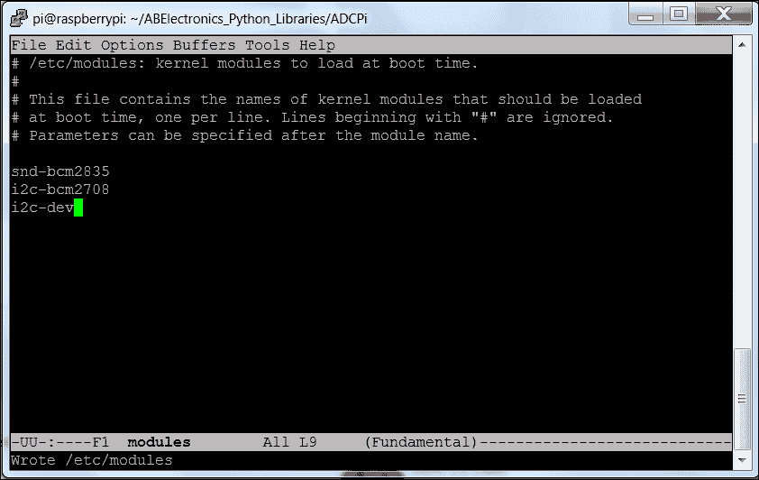

    重启树莓派。你可以通过输入`sudo i2cdetect -y 1`来检查 I2C 是否已启用，你应该会看到类似这样的输出：

    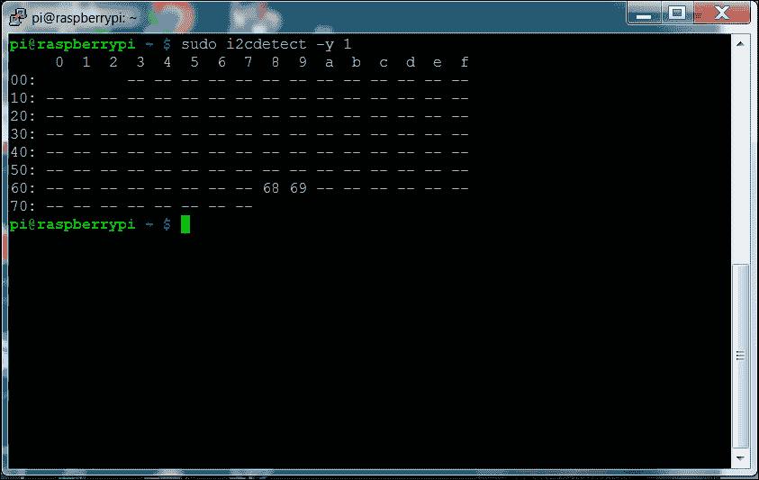

    I2C 设备，你的 ADC，位于**68**和**69**地址。

1.  现在，你可以下载代码了。为此，在主目录中输入`git clone https://github.com/abelectronicsuk/ABElectronics_Python_Libraries.git`，Python 库将被安装到你的树莓派中。

1.  转到`./ABElecttronics_Python_Libraries/ADCPi`目录；这里有你硬件的程序。按照`README.md`文件中的说明，输入`sudo apt-get update`，然后输入`sudo apt-get install python-smbus`。这将安装`smibus`库，这是 ADC 工作的必需库。同时，输入`sudo adduser pi i2c`将`pi`添加到可以访问 i2c 的组中。

1.  你需要编辑家目录中的`.bashrc`文件，添加以下几行：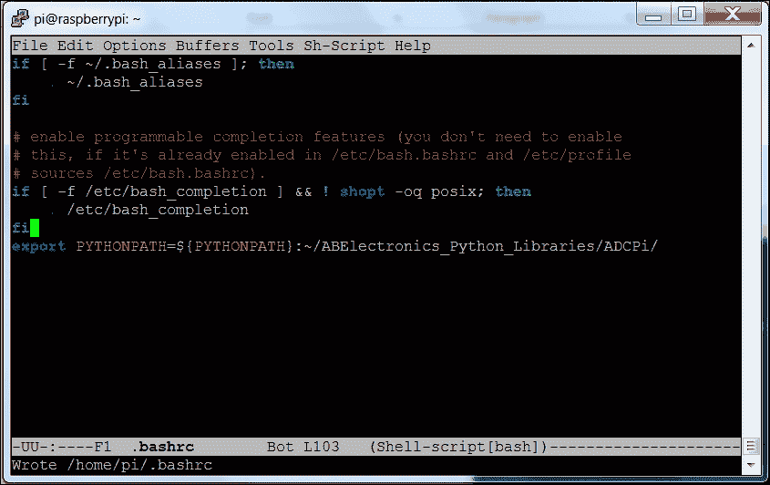

    添加此行代码将把这个库添加到路径中，以便你可以访问其功能。重启树莓派。

1.  现在，你可以运行其中一个演示程序。输入`python demo-readvoltage.py`，你应该会看到类似这样的内容：

    这些原始读数很不错，但现在你需要编写一个程序，获取第一个 ADC 的数据并将其转换为距离。为此，你需要为你的传感器绘制一个电压与距离的图表。以下是该示例中 IR 传感器的图表：

    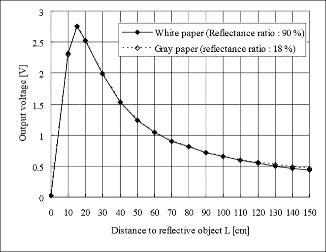

    曲线实际上分为两部分；第一部分是距离约 15 厘米以内，第二部分是从 15 厘米到 150 厘米的距离。最简单的方法是建立一个简单的数学模型，忽略小于 15 厘米的距离，只对 15 厘米以上的距离进行建模。有关如何构建这个模型的更多信息，请参考[`davstott.me.uk/index.php/2013/06/02/raspberry-pi-sharp-infrared/`](http://davstott.me.uk/index.php/2013/06/02/raspberry-pi-sharp-infrared/)。以下是使用此模型的 Python 程序：

    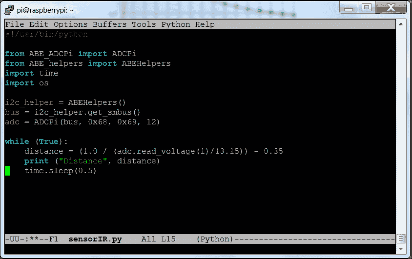

    唯一的新代码行是`distance = (1.0 / (adc.read_adc_voltage(1) / 13.15)) - 0.35`。它将你的电压转换为距离。现在，你可以运行程序，你将看到以厘米为单位的结果，像这样：

    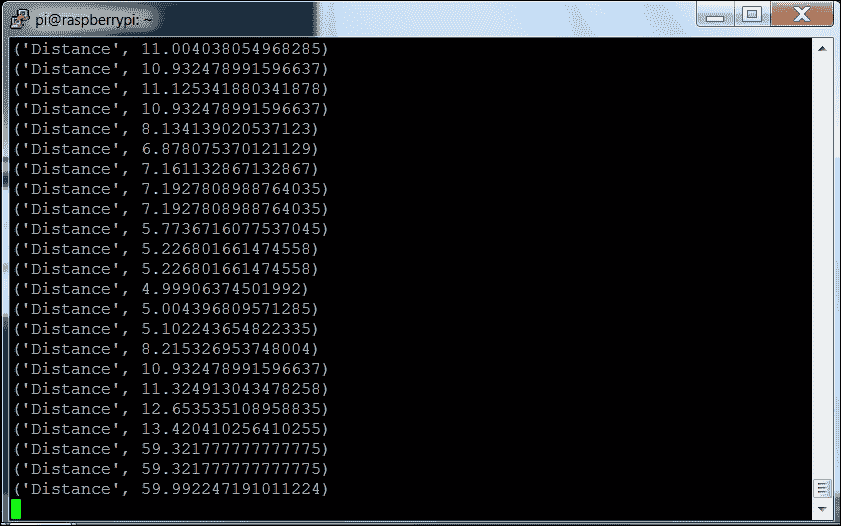

    现在，你可以使用 IR 传感器测量物体的距离了！

# 将树莓派连接到 USB 声纳传感器

还有另一种感应物体存在的方法：使用声纳传感器。但在将此功能添加到你的系统之前，这里有一个关于声纳传感器的小教程。这种类型的传感器使用超声波来计算与物体的距离。声波从传感器发出，如下图所示：

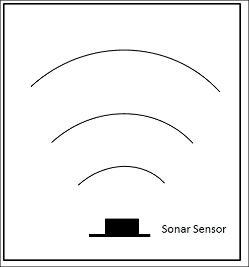

设备每秒发送 10 次声波。如果路径中有物体挡住这些波，波将反射物体，并返回传感器，如下图所示：

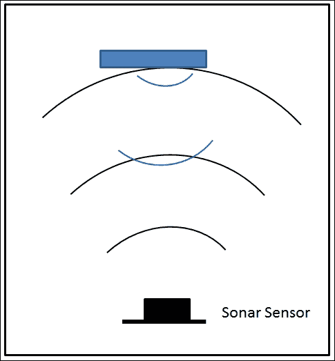

然后传感器测量任何返回。它使用发送声波和返回声波的时间差来测量与物体之间的距离。

### 注意

声纳传感器通常非常精确，误差率低，并且不受环境中的光照或颜色影响。

如果你想使用声纳传感器来测量距离，有几种选择。首先是使用连接到 USB 端口的声纳传感器。以下是 USB 声纳传感器的图片：

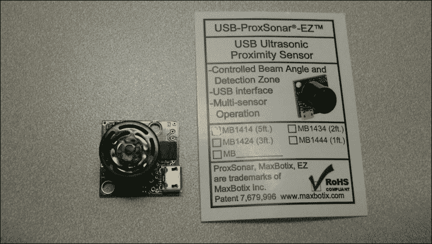

这是**USB-ProxSonar-EZ**传感器，可以直接从 MaxBotix 或亚马逊购买。有几种型号，每种型号具有不同的距离规格；然而，它们的工作方式都相同。

你也可以选择连接到树莓派 GPIO 的声纳传感器。以下是这种廉价声纳传感器的图片：

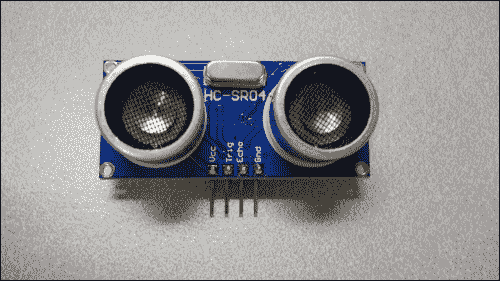

这种传感器价格较低且易于使用；它需要一定的处理能力来协调发送和接收信号的时间，但树莓派 B 2 具有所需的处理能力。以下是设置此声纳传感器以测量距离的步骤：

1.  第一步是了解树莓派 B 2 的 GPIO 引脚。以下是引脚布局图示：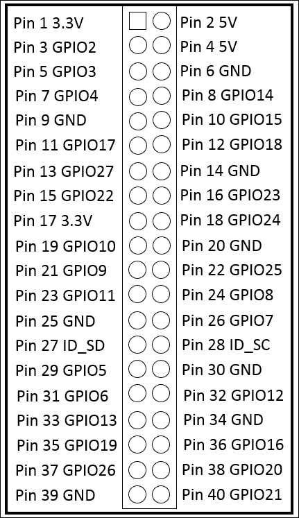

    在这种情况下，你需要连接到树莓派 B2 的 5 伏连接器，即引脚 2。你还需要连接到 GND，即引脚 6。你将使用引脚 16 作为输出触发引脚，并使用引脚 18（GPIO24）作为输入引脚来计时来自声纳传感器的回波。

1.  现在你知道你要连接的引脚，可以连接声纳传感器了。有一个问题，你不能直接将声纳传感器的 5 伏返回连接到树莓派 GPIO 引脚；它们需要 3.3 伏。你需要建立一个电压分压器，将 5 伏电压降低到 3.3 伏。这可以通过两个电阻器来完成，连接方式如下图所示：

    如果你想了解在这种配置中电压分压器的工作原理，请参考[`www.modmypi.com/blog/hc-sr04-ultrasonic-range-sensor-on-the-raspberry-pi`](http://www.modmypi.com/blog/hc-sr04-ultrasonic-range-sensor-on-the-raspberry-pi)。这两个电阻器的组合将电压降低到所需的水平。你可能希望将所有这些放在一个小面包板上，如下所示：

    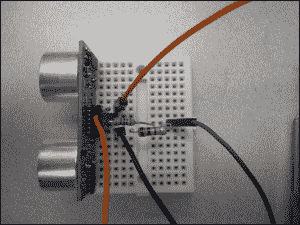

    最后，将其连接到树莓派，如下所示：

    

1.  现在设备已连接，你需要一些代码来读取值，确保它稳定（即测量值稳定），然后将其转换为距离。以下是这段程序的 Python 代码：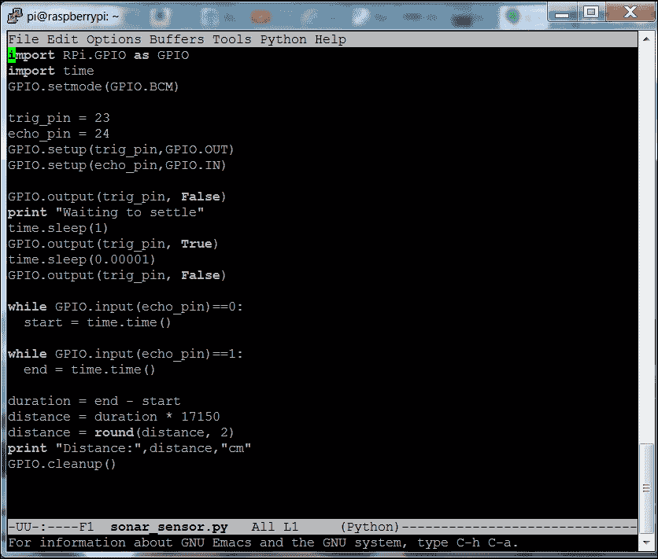

    现在，你应该能够运行程序并看到像这样的结果：

    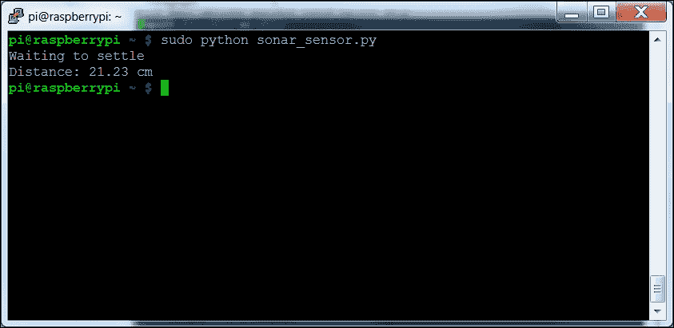

    现在你已经让传感器正常工作，你可以让双足机器人避开或找到物体。

# 概述

恭喜！现在你可以检测并避开墙壁及其他障碍物，也可以利用这些传感器来探测你可能想要找到的物体。在下一章，你将学习如何进行路径规划，将你的机器人从 A 点移动到 B 点，甚至让机器人在遇到路径上的障碍物时知道该如何应对。
