# 第五章：路径规划与双足机器人

现在你的双足机器人已经可以移动，并能发现障碍物，你可以开始让它自动地移动了。不过，你需要让你的机器人规划它的路径，也就是说，如果它知道自己从哪里出发以及目标终点在哪，它就能从起点移动到终点。

本章内容包括：

+   如何将指南针添加到你的双足机器人上，这样你就能让它有方向感

+   学习一些基本的路径规划技术，以便你的机器人能更好地执行任务

# 将数字指南针连接到树莓派

对于你的机器人来说，一个重要的信息是它的行进方向，这对于它规划自己的路径至关重要。那么，让我们学习如何将数字指南针连接到树莓派。

有几种芯片提供数字指南针功能，其中最常见的是**HMC5883L 三轴数字指南针芯片**。该芯片被多家公司封装到模块中，几乎所有这些模块都提供类似的接口。以下是**GY-271 HMC5883L 三轴指南针磁力计传感器模块**的图片，该模块可以通过许多在线零售商购买：

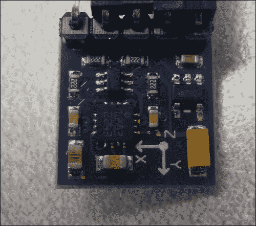

这种类型的数字指南针利用磁传感器来探测地球的磁场。传感器的输出通过一组寄存器提供给外界，这些寄存器允许用户设置采样率、连续或单次采样等参数。*x*、*y*和*z*方向的输出也使用寄存器进行访问。

该芯片的连接方式非常简单，设备通过使用 I2C 总线与树莓派进行通信，I2C 总线是一种标准的串行通信总线。I2C 接口是一个同步串行接口，提供的性能比异步的 Rx/Tx 串行接口更高。SCL 数据线提供时钟信号，而数据则通过 SDA 线传输。该总线还提供寻址功能，因此可以同时将多个设备连接到主设备上。在模块的背面，连接端口已标明，如下图所示：

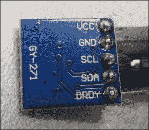

然后你将把设备连接到树莓派的 GPIO 引脚。以下是树莓派的引脚分布图：

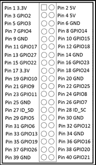

将设备的 VCC 连接到树莓派的引脚 1（3.3V），将 GND 连接到引脚 9（GND）。将设备的 SCL 连接到引脚 5（GPIO 3），将 SDA 连接到引脚 3（GPIO 2）。注意，你无需连接**数据准备好**（**DRDY**）线。现在，你就可以与设备进行通信了。

# 通过编程访问指南针

为了访问指南针功能，你需要在树莓派上启用 I2C 库。如果你在第四章《避免使用传感器的障碍物》中使用了 IR 传感器和 ADC 附加硬件，你已经完成了这一步。如果没有，按照以下说明启用 I2C 接口：

1.  运行`raspi-config`。选择**配置高级设置**，如下面的截图所示：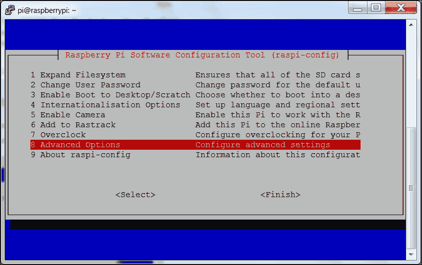

    在接下来的选择页面，选择启用/禁用 I2C 接口的自动加载，如下截图所示：

    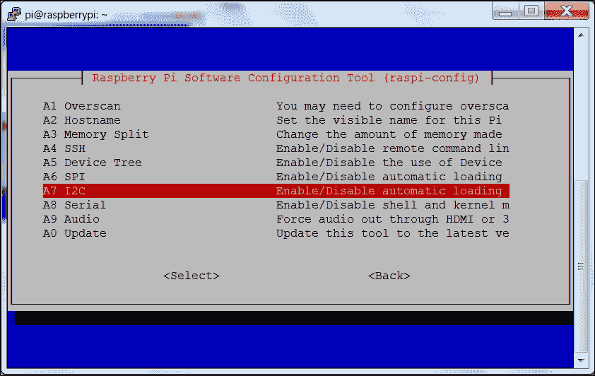

    然后选择**yes**，如下面的截图所示：

    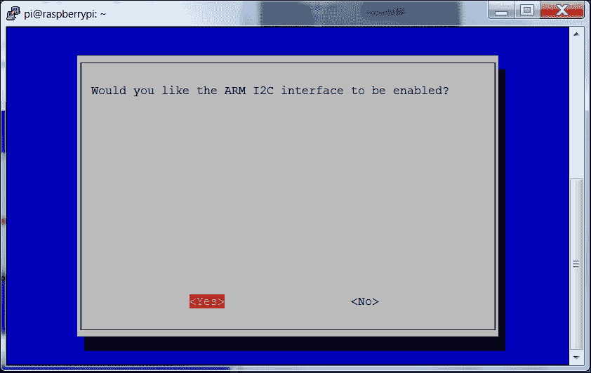

    你还需要编辑`/etc/modules`文件，添加以下两行`i2c-bcm2708`和`i2c-dev`，如下截图所示：

    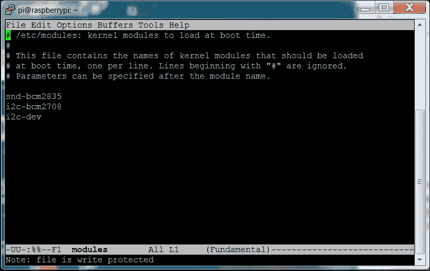

    最后一次编辑，修改`/boot/config.txt`中的最后一行，如下截图所示：

    

    现在，重新启动树莓派。

1.  连接设备后，你可以查看系统是否识别到你的设备。为此，输入以下命令：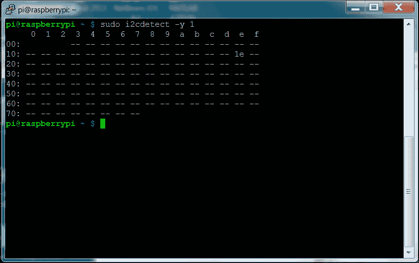

    你可以看到设备的地址是**1e**。

1.  现在，你可以与数字指南针进行通信了。为此，你需要创建一个 Python 程序。但在创建 Python 代码之前，你需要下载一个库，这将使这一切变得更加容易。首先，创建一个名为`compass`的目录并进入该目录。然后，输入`git clone https://github.com/quick2wire/quick2wire-python-api.git`来下载`quick2wire-python-api`库。最后，输入`git clone https://bitbucket.org/thinkbowl/i2clibraries.git`来获取 i2clibraries。

    你还需要设置一些环境变量。通过进入你的主目录并编辑`.bashrc`文件，在文件末尾添加以下两行：

    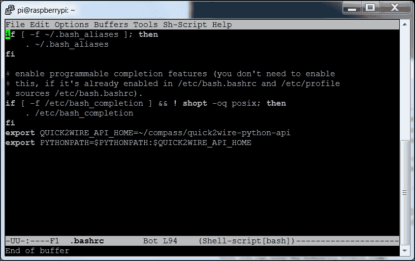

1.  现在，你可以创建以下的 Python 代码：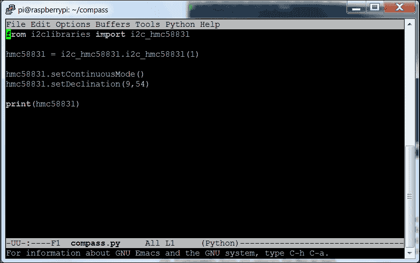

1.  现在，运行代码，输入`python3 compass.py`命令，你应该会看到：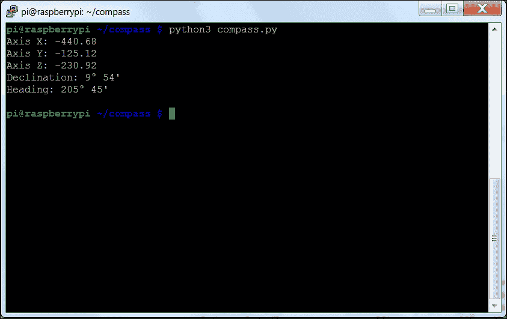

    现在，你可以为你的项目添加方向功能了！当你移动设备时，应该能看到**方向**值发生变化。

    ### 注意

    这是一个基础程序；你可以在[`think-bowl.com/raspberry-pi/i2c-python-library-3-axis-digital-compass-hmc5883l-with-the-raspberry-pi/`](http://think-bowl.com/raspberry-pi/i2c-python-library-3-axis-digital-compass-hmc5883l-with-the-raspberry-pi/)找到有关此库的更多其他功能。

    开发指南针代码的最后一步是将其制作成一个文件，这样函数就可以被导入到其他 Python 程序中。为此，编辑文件，使所有代码都包含在函数中，如下所示：

    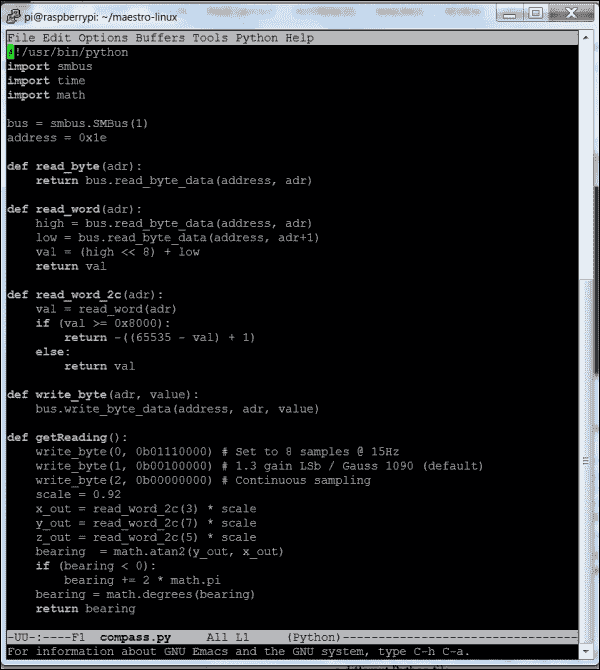

    然后，你就可以使用 Python 的导入功能将这个功能导入到另一个 Python 文件中。

# 机器人动态路径规划

现在你可以看到障碍物，并且知道方向，你就可以进行动态路径规划了。动态路径规划意味着你在遇到障碍物之前，无法知道整个环境的所有障碍物。你的机器人必须在移动的过程中决定如何前进。这是一个复杂的话题，但有一些基本概念你可以开始理解并应用，当你让机器人在环境中移动时。首先，我们解决目标位置的识别问题，并需要执行一条没有障碍物的路径，然后再加入障碍物。

## 基本路径规划

为了讨论动态路径规划，即规划一条你不知道可能遇到哪些障碍物的路径，你需要一个框架来理解你机器人所在的位置，并确定目标的位置。一个常见的框架是*x*和*y*网格。下面是这样一个网格的示意图：

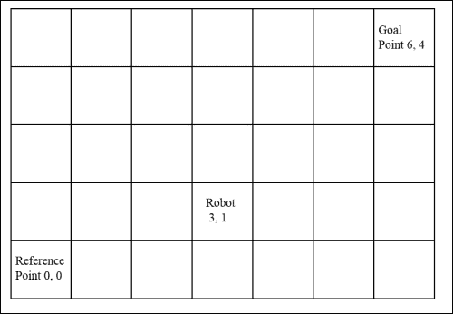

有三个关键点：

+   左下角是固定参考位置。*x*和*y*方向也是固定的，所有其他位置都将相对于这个位置和这些方向进行测量。

+   另一个重要点是机器人起始位置。机器人将通过使用其*x*坐标（相对于某个固定参考位置的* x*方向上的位置）以及*y*坐标（相对于某个固定参考位置的*y*方向上的位置）来跟踪其位置，直到目标。它将使用指南针来保持这些方向。

+   第三个重要点是目标的位置，也可以用相对于固定参考位置的*x*和*y*坐标表示。如果你知道机器人起始位置和起始角度，就可以规划一条最优（最短距离）路径到达目标。为此，你可以使用目标位置和机器人位置，并通过一些相对简单的数学计算来得出从机器人到目标的距离和角度。

    要计算距离，使用以下公式：

    

    使用以下公式告诉你的机器人到达目标的旅行距离。第二个公式将告诉你的机器人需要行进的角度：

    

    以下是这两条信息的图形表示：

    

现在你已经有了目标角度和距离，你可以编程让你的机器人移动。为此，你需要编写一个程序来进行路径规划，并调用在 第三章，*双足机器人的运动* 中创建的运动函数。不过，你需要知道机器人每步行进的距离，以便你告诉机器人应该走多少步，而不是直接告诉它行进的距离单位。

你还需要能够计算机器人转向时可能覆盖的距离；然而，这个距离可能太小，几乎不重要。如果你知道了角度和距离，你就可以让机器人朝着目标前进。

以下是你将要编写的程序步骤：

1.  计算你的机器人需要行进的距离，以到达目标。将这个距离转换成所需的步数。

1.  计算你的机器人需要行进的角度以到达目标。你将使用指南针和机器人转向函数来实现这个角度。

1.  现在，调用适当次数的步进函数，以使机器人走到正确的距离。

就是这样。现在，我们将使用一些非常简单的 Python 代码，通过使用函数来让机器人前进和转向。这样做时，创建一个名为 `robotLib.py` 的文件，其中包含所有执行实际伺服设置的函数，以便让双足机器人前进和转向是很有意义的。然后，你可以使用 `from robotLib import *` 语句导入这些函数，之后你的 Python 程序就可以调用这些函数了。这样，路径规划的 Python 程序会变得更小、更易于管理。你将对 `compass` 程序做同样的操作，使用 `from compass import *` 命令。

### 注意

有关如何将函数从一个 Python 文件导入到另一个文件的更多信息，请参考 [`www.tutorialspoint.com/python/python_modules.htm`](http://www.tutorialspoint.com/python/python_modules.htm)。

以下是程序的代码列表：

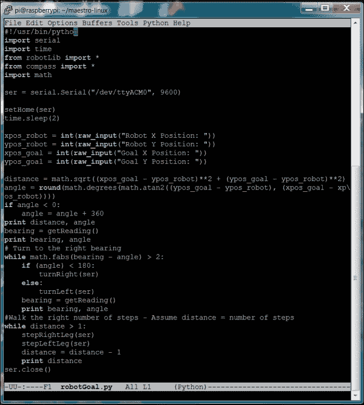

在这个程序中，用户输入目标位置，然后机器人首先通过读取角度来决定到达目标角度的最短方向。为了简单起见，机器人被放置在网格中，并朝着角度 0 的方向前进。如果目标角度小于 180 度，机器人将向右转；如果大于 180 度，机器人将向左转。机器人会一直转直到目标角度和实际测得的角度相差很小。然后，机器人就会按步数前进直到到达目标。

## 避免障碍物

如前所述，规划没有障碍物的路径是非常简单的。然而，当你的机器人需要绕过障碍物时，就会变得有些挑战。让我们看一个实例，其中在你之前计算的路径中有一个障碍物。它可能看起来像下面这样：

你仍然可以使用相同的路径规划算法来找到起始角度；然而，现在你需要使用声呐传感器来检测障碍物。当声呐传感器检测到障碍物时，你需要停止并重新计算路径以避开障碍物，然后重新计算通向目标的理想路径。实现这一点的一种非常简单的方法是，当你的机器人感知到障碍物时，向右转 90 度，行进一段固定距离，然后重新计算最佳路径。当你转回来朝着目标移动时，如果没有检测到障碍物，你将能够沿着最佳路径继续前进。

然而，如果你的机器人再次遇到障碍物，它将重复这个过程，直到到达目标。在这种情况下，按照这些规则，机器人将沿着以下路径行驶：

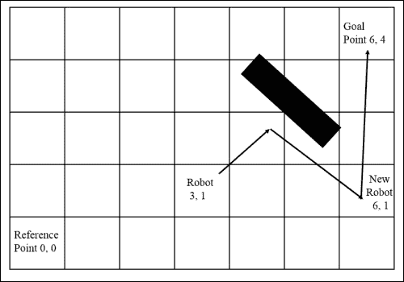

在将声呐传感器的功能添加到你的机器人之前，还有一步需要完成。你需要修改声呐传感器代码，以便它可以作为库添加到 Python 代码中。以下是这段代码：

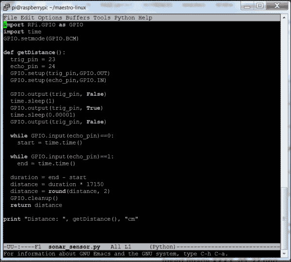

你还需要通过`from compass import *`语句导入此代码。你还将使用 time 库和`time.sleep`命令来在代码中的不同语句之间添加延迟。以下是代码的第一部分，利用这些内容来检测障碍物，向右转，然后是利用声呐传感器的第一部分 Python 代码：

以下是代码的最后一部分：

现在，这个算法相当简单；还有一些算法对障碍物有更复杂的响应。你还可以看到，通过在机器人两侧添加声呐传感器，机器人实际上能够感知障碍物是否已结束。你还可以提供更复杂的决策过程，来判断该如何转向以避开物体。同样，有许多不同的路径寻找算法。请参见[`www.academia.edu/837604/A_Simple_Local_Path_Planning_Algorithm_for_Autonomous_Mobile_Robots`](http://www.academia.edu/837604/A_Simple_Local_Path_Planning_Algorithm_for_Autonomous_Mobile_Robots)以获取相关示例。这些更复杂的算法可以通过使用本章中建立的基本功能进行探索。

# 总结

现在，你已经为机器人添加了路径规划功能。你的机器人不仅能够从 A 点移动到 B 点，还能够避开可能存在的障碍物。在下一章，你将学习如何为你的双足机器人添加摄像头。这将为你的机器人提供一整套新的方式来感知周围的世界。
