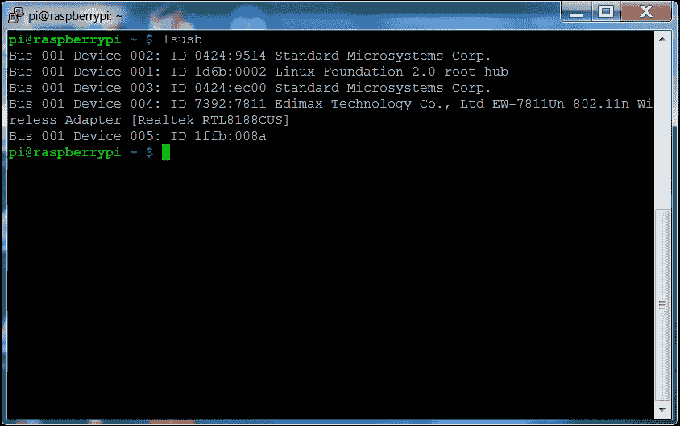

# 第七章. 远程访问你的双足机器人

现在，双足机器人已经启动并运行，你会希望能够让它进入世界，但仍然能够远程监控和控制它。这不仅有助于你的开发，还能促进部署，开启各种新的场景和应用。

在这一章，你将学习：

+   如何将无线局域网加密狗添加到你的双足机器人并将其设置为无线接入点

+   如何使用此访问和摇杆控制你的双足机器人

+   如何使用无线局域网连接获取**第一人称视频**（**FPV**），以便你可以看到双足机器人看到的内容

# 添加无线加密狗并创建接入点

在第一章，*配置和编程树莓派*中，你学会了如何将无线加密狗添加到树莓派，并使其连接到无线网络。这是一种有用的方式来访问树莓派，但如果你想将你的机器人带到无线局域网覆盖范围之外，你需要将它设置为接入点。

执行此操作的第一步是安装无线局域网设备。一个价格便宜且易于配置的设备是 Edimax Wifi 适配器设备（产品信息可以在[`www.edimax.com/edimax/merchandise/merchandise_detail/data/edimax/global/wireless_adapters_n150/ew-7811un`](http://www.edimax.com/edimax/merchandise/merchandise_detail/data/edimax/global/wireless_adapters_n150/ew-7811un)上查看）。它可以在大多数在线电子商店找到：

安装设备并启动树莓派后，输入`lsusb`命令。这应该会显示类似以下截图的信息：

Edimax 设备列在连接到 USB 端口的设备列表中。现在，执行以下步骤：

1.  通过输入`sudo apt-get install hostapd`，确保已安装`hostapd`。此应用程序是一个后台程序，用于控制树莓派上的无线配置。

1.  不幸的是，默认版本的`hostapd`并不支持 Edimax 芯片组。因此，你需要通过输入`wget http://www.daveconroy.com/wp3/wp-content/uploads/2013/07/hostapd.zip`来下载一个支持的版本。

1.  现在，通过输入`unzip hostapd.zip`来解压此文件。

1.  通过输入`sudo mv /usr/sbin/hostapd /usr/sbin/hostapd.bak`来备份原始的`hostapd`应用程序。这样，如果以后需要恢复，你可以使用它。

1.  现在，通过输入`sudo mv hostapd /usr/sbin/hostapd.edimax`将新版本的`hostapd`移到正确的目录。

1.  接下来的步骤，输入`sudo ln -sf /usr/sbin/hostapd.edimax /usr/sbin/hostapd`；这将创建一个指向新文件的软链接，使其作为`hostapd`应用程序执行。

1.  输入 `sudo chown root.root /usr/sbin/hostapd`，这将把该文件的所有者和组更改为 `root`。

1.  输入 `sudo chmod 755 /usr/sbin/hostapd` 使得该文件对所有者可执行。

1.  现在你将配置你的无线接入点。通过输入 `sudo emacs /etc/hostapd/hostapd.conf` 编辑该文件，使其像以下截图一样：

1.  你现在需要编辑 `/etc/network/interfaces` 文件，如下截图所示：

1.  这将把接入点的地址设置为 **10.10.0.1**。

1.  现在，输入 `sudo apt-get install isc-dhcp-server` 来安装 `dhcp` 服务器，以便连接到它的设备能够获得动态地址。

1.  现在，编辑 `/etc/dhcp/dhcpd.conf` 并添加以下几行：

1.  下一步是编辑 `/etc/default/hostapd` 文件，以便在启动时自动启动这一切，只需添加这一行：

1.  现在输入以下两条命令：`sudo update-rc.d hostapd enable` 和 `sudo update-rc.d isc-dhcp-server enable`，然后重启树莓派。

现在你应该能够将你的树莓派连接为无线接入点。

# 添加操纵杆遥控

现在你可以从远程计算机访问树莓派，你可以像使用有线连接时一样进行 SSH 操作，发出命令，甚至使用远程计算机控制双足机器人。这为你提供了许多不同的可能性，其中之一就是通过连接到远程计算机的操纵杆来控制你的项目。

要添加游戏控制器，你需要首先找到一个能够连接到计算机的游戏控制器。如果你在主机计算机上使用的是 Microsoft Windows 操作系统，那么几乎任何可以连接到 PC 的 USB 控制器都可以使用。如果你在远程计算机上使用的是 Linux 操作系统，同样类型的控制器也适用。事实上，你可以使用另一个树莓派作为远程计算机。

由于操纵杆将连接到远程计算机，你需要运行两个程序：一个在远程计算机上，另一个在双足机器人上的树莓派上。你还需要一种通信方式。在以下示例中，你将使用无线局域网接口和客户端-服务器通信模型。你将在远程计算机上运行服务器程序，在树莓派上运行客户端程序。

### 注意

要了解如何在游戏应用中使用这种类型的模型，参考这个优秀的教程：[`www.raywenderlich.com/38732/multiplayer-game-programming-for-teens-with-python`](http://www.raywenderlich.com/38732/multiplayer-game-programming-for-teens-with-python)。

第一步是将 USB 游戏控制器直接插入到远程计算机。一旦你将控制器连接到远程计算机，就需要在树莓派上创建一个 Python 程序，该程序将接收来自远程计算机客户端发送的信号，并将控制信号发送到树莓派上运行的服务器，以便将正确的信号传递给双足机器人的伺服器。

在此之前，你需要在树莓派上安装一些库，以便使其正常工作。第一个是一个叫做`pygame`的库。通过输入`sudo apt-get install python-pygame`来安装它。你还需要安装一组 Python 安装工具，通过输入`sudo apt-get install python-setuptools`来安装。然后，你需要安装一个叫做`PodSixNet`的局域网通信层库。这个库将允许远程计算机上的客户端和在树莓派上运行的服务器进行通信。要安装它，请按照[`mccormick.cx/projects/PodSixNet/`](http://mccormick.cx/projects/PodSixNet/)上的说明进行操作。现在你可以在树莓派上创建程序，控制双足机器人。程序的第一部分来自你在第三章中创建的程序，*双足机器人运动*。在这一部分，你将创建一个叫做`QuadGame`的类。该类将接收来自连接到服务器的游戏控制器的输入，并将其转化为发送给伺服控制器的指令，从而控制你的双足机器人。

以下是这些控制的表格：

| 摇杆控制 | 双足机器人控制 |
| --- | --- |
| 按钮 2 | 机器人原点位置 |
| 按钮 1 | 机器人右转 |
| 按钮 3 | 机器人左转 |
| 摇杆上 | 机器人向前行走 |

接下来是代码的初始部分，即 Python 导入语句：

以下是`BoxesGame`类的代码，它将响应摇杆的操作：

这是代码中有趣的部分。该代码获取来自远程计算机的输入并将其转化为操作。第一个`if`语句确定远程计算机通过连接的摇杆发送的数据类型。它可能是一个按钮按下事件，当`data["type"] == 10`时，`data["info"]["button"] == 2`语句则表示**按钮 2**被按下。在这种情况下，程序会发送指令让机器人回到原点位置。如果`if data["type"] == 7:`，则表示这是一个摇杆事件，`if data["info"]["value"] < - 0.9`则会判断摇杆处于上方位置，机器人应该向前移动。

以下是客户端程序中关于摇杆控制部分的最后部分，为了完整性：

这段最终的代码初始化了游戏循环，循环中接收输入、将其发送到伺服控制器，再传送到飞行控制器。

你还需要在远程计算机上运行一个服务器程序，接收来自游戏控制器的信号并将其发送到客户端。你将使用 Python 2.7 编写此代码，可以从这里安装。此外，你还需要安装`pygame`库。如果你在远程计算机上使用 Linux，则输入`sudo apt-get install python-pygame`。如果你在远程计算机上使用 Microsoft Windows，则按照[`www.pygame.org/download.shtml`](http://www.pygame.org/download.shtml)上的说明进行操作。

你还需要之前描述的局域网通信层。你可以在[`mccormick.cx/projects/PodSixNet/`](http://mccormick.cx/projects/PodSixNet/)找到适用于 Microsoft Windows 或 Linux 的版本。以下是服务器代码的两部分：

第一部分创建了三个类：

1.  第一个类`ClientChannel`为你的项目建立了一个通信通道。

1.  第二个类`BoxServer`设置一个服务器，以便你可以将摇杆操作传送到双足机器人的 Raspberry Pi 上。

1.  最后，第三个类`Game`只是初始化一个游戏，其中包含你需要的所有内容。

以下是代码的后半部分：

这部分代码初始化摇杆，以便将所有控制信号发送到双足机器人的 Raspberry Pi 上。

你需要在两台计算机上运行这些程序，并输入连接到摇杆的远程计算机的互联网地址。以下是运行该程序时的界面，在运行远程计算机上的程序之前：

以下是当在 Raspberry Pi 上运行并连接到机器人时，程序的界面：

最后，以下是当机器人的 Raspberry Pi 启动并连接时，远程计算机上程序的界面：

现在，你可以使用摇杆远程控制你的机器人！

# 添加远程查看功能

现在，你的双足机器人可以从远程计算机获取信息并响应摇杆按键，但你可能希望能够查看双足机器人通过其摄像头所看到的内容。这可以通过配置摄像头、vncserver，以及你在第六章中使用的能力——*为双足机器人添加视觉*——来轻松实现。使用这种方法，你可以轻松获取双足机器人所看到的画面，应该类似于以下内容：

现在，你既可以看到你的机器人正在前进的方向，也可以通过操纵杆来控制它。

# 总结

就这样，但实际上这只是开始。你的机器人已经具备了一些基本的运动和控制能力，但现在你应该也掌握了知识和技能，让你的双足机器人走得更远。你可以教它跳舞、跟随手势，几乎任何你能想象的事情。
