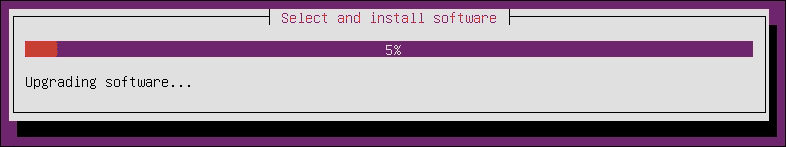

# 第一章. Ubuntu Server 安装

本章将介绍如何通过不同的方法安装 Ubuntu Server。我们将了解如何通过简单或高级安装在手动和自动模式下安装 Ubuntu Server。

为了实现这个目标，我们将按照以下计划进行：

+   安装前的准备

+   手动安装

+   自动安装

# 安装前的准备

在本节中，我们将快速了解最新的 Ubuntu Server 版本发布信息，然后列出所有的系统要求。

## 最新的 Ubuntu 版本

生产 Ubuntu 的公司 Canonical 每 6 个月发布一个新版本。每个版本都有一个*YY.ZZ*模式的代码，其中*YY*表示年份，*ZZ*表示月份。

我开始写这本书是在 2015 年 4 月 23 日 Ubuntu 15.04（Vivid Vervet）发布之后。目前有两个主要版本——去年发布的 LTS 版本（**LTS**代表**长期支持**），即版本 14.04，以及最新的版本 15.04。如果你选择这两个版本中的任意一个来执行接下来的章节任务，应该没有太大问题，因为没有区别。因此，我们决定以最新版本为示例，尤其是因为下一个 LTS 版本将基于该版本。（请注意，只有 LTS 版本由 Canonical 提供 5 年的支持，而非 LTS 版本的支持期仅为 9 个月。这就是我们通常选择 LTS 版本来部署 Ubuntu Server 的原因。）当这两个版本之间有显著差异时，我们会提到它。

现在，让我们来看看与最新版本相关的一些信息：

+   它使用了 Linux 内核 3.19，带来了很多关于性能的改进，同时也为服务器和云计算提供了更好的网络功能。

+   15.04 是第一版引入 LXD 的 Ubuntu 版本。

+   它使用了最新版本的 OpenStack、**LXC**（**Linux 容器**）、LXD、Juju、libvirt、QEMU、Open vSwitch、Ceph、cloud-init、Docker 以及与 HA 相关的软件包更新。

+   它将服务管理器和标准启动`upstart`替换为`systemd`。

### 注意

`upstart`启动方式在 Ubuntu 中仍然存在。你可以通过打开**GRUB**启动菜单，选择**Ubuntu 的高级选项**，然后点击**Ubuntu，使用 Linux（upstart）**来使用它。

如果你希望永久切换到`upstart`启动方式，可以安装`upstart-sysv`包，它将移除`ubuntu-standard`和`systemd-sysv`。

## 系统要求

系统要求取决于未来可能需要部署和安装的服务。为了演示/测试的目的，我们需要一个最小配置：300 MHz 的 CPU，192 MB 的 RAM 和 1.5 GB 的硬盘。这个轻量级配置使我们可以在旧计算机甚至虚拟机上部署 Ubuntu Server。这种有限的资源占用主要是因为没有 X Windows 系统（图形界面），而在服务器环境中通常不需要图形界面。

在生产环境中，您应小心考虑资源（CPU、RAM 和硬盘）的实际需求以及这些需求的预估增长。为此，您需要根据即将部署的服务，做好尺寸的良好衡量。

本书中的示例将使用 64 位版本的 Ubuntu Server 15.04，并将在一台拥有 1 GB RAM 和 2 TB 硬盘的虚拟机上安装。

### 提示

请注意，如果您使用的是二手计算机/服务器，在安装或升级 Ubuntu 之前，您应先备份数据。安装过程中使用的分区工具是可靠的，通常可以无问题地使用多年，但有时它们可能会执行灾难性的操作。

## 额外资源

本书仅包含必要的内容。它恰好涵盖了您完成特定任务所需了解的内容。如果您需要更多关于 Ubuntu 的信息并深入了解，可以访问官方文档，[`help.ubuntu.com`](https://help.ubuntu.com)。

您应根据您的系统架构下载 CD 镜像。完整的镜像列表可以在[`releases.ubuntu.com/15.04/`](http://releases.ubuntu.com/15.04/)找到。

# 手动安装

在本节中，我们将看看如何手动安装 Ubuntu Server，无论是从 CD 还是 USB 驱动器。在此，我们仅讨论从 CD 安装的过程；从 USB 驱动器安装的过程相同。在后者的情况下，您需要通过 BIOS 界面配置计算机从 USB 启动。

还有一种手动安装 Ubuntu Server 的方式，即通过网络安装，但由于我们将在下一节**自动化安装**中深入讲解此过程，因此在这里不做讨论。

## 从 CD 进行简单安装

从 CD 安装 Ubuntu 的过程与大多数 Linux 发行版相同。因此，如果您已经熟悉这一过程，可以节省时间，直接跳到下一节。如果您是这个领域的新手，请仔细阅读这一节，因为接下来的章节（高级安装和自动化安装）将基于此。请注意，Ubuntu Server 版没有桌面版那样的图形环境。因此，您只需使用键盘，而不能使用鼠标。以下是从 CD 安装 Ubuntu 的逐步过程：

1.  首先，从[`releases.ubuntu.com/15.04/`](http://releases.ubuntu.com/15.04/)的下载页面下载与你的 CPU 架构匹配的安装 CD 镜像，并将其刻录到空白 CD 上。

1.  其次，验证你的服务器 BIOS 是否配置为从 CD-ROM 驱动器启动；如果不是这种情况，请确保进行更改。

1.  将 CD 插入 CD-ROM 驱动器并启动。

1.  在启动过程刚开始时，你将被要求选择安装语言。选择你需要的语言。如果你不小心选择了其他语言，也不用担心，你很快就会学会如何更改设置。

1.  现在，你将看到以下界面：

    你可以看到很多选项，满足你的需求：

    +   如果在选择默认的 **安装 Ubuntu 服务器** 选项时直接按 *Enter* 键，你将启动安装过程。

    +   第二个选项，**使用 MAAS 安装多个服务器**，将在本章后面讲解虚拟化和云计算时讨论。

    +   有些人更喜欢从第三个选项，**检查磁盘缺陷**，开始，以验证将 ISO 文件刻录到 CD 上的过程是否正确。

    +   第四个选项，**测试内存**，非常有帮助，特别是在你的服务器开始崩溃并且你怀疑是内存相关问题时。

    +   你可以使用第五个选项，**从第一个硬盘启动**，以防你忘记在 CD-ROM 驱动器中启动 CD。

    +   最后，最后一个选项，**修复损坏的系统**，将 CD 变成一个救援磁盘，对于备份和恢复非常有用。

    +   在大多数情况下，当你选择默认的 **安装 Ubuntu 服务器** 选项时，所有你需要做的就是按 **Enter** 键启动安装过程，但也有一些情况需要一些特殊选项，要么是因为你的机器有一些特定的硬件需求，要么是因为你需要为未来使用定制服务器的内核参数。为此，Ubuntu 通过启动画面底部的菜单提供了许多可能性，可以通过功能键访问。

    +   如果你按 **F1**，你将看到一个交互式帮助屏幕，里面有其他选项的文档。

    +   如果你在启动时不小心选择了错误的语言，按 **F2** 键进行更改。启动屏幕将根据你的语言自动选择一个键盘映射。

    +   如果你想选择不同的键盘映射（例如，我在准备本书的截图时使用的是英文，但我使用的是法语键盘），按 **F3** 键从键盘映射选项列表中选择。启动屏幕还提供了许多优秀的辅助功能选项。

    +   **F4**键会显示一个安装模式的列表，您可以选择使用 OEM 安装、最小化系统或最小化虚拟化客户端来安装 Ubuntu 服务器。OEM 安装适用于制造商。最小化虚拟化客户端为您提供了一个轻松安装虚拟化版 Ubuntu 的方法。

    +   **F5**键显示了一个辅助功能菜单，允许您选择高对比度屏幕、屏幕放大器、屏幕阅读器、盲文终端、键盘修饰符，甚至屏幕键盘。

    +   一旦按下**F6**键，您将获得对启动过程的真正控制。在这里，您可以看到一个常见参数的菜单，这些参数有助于在硬件较为复杂的情况下从 CD 启动。如果按下*Esc*键，您将从该菜单返回启动提示符。在此处，您可以输入可能需要的额外内核启动参数，具体如下所示的截图：

    

1.  在启动安装过程后，系统会要求您选择安装过程的语言，这将成为您要安装的服务器的默认语言。使用键盘上的上下箭头键选择您想要的语言，然后按*Enter*键。系统还会要求您选择服务器的位置（基于此，系统将调整服务器时间设置）。之后，您可以选择让安装程序自动检测键盘布局，或手动输入键盘布局。

1.  执行完这些步骤后，安装程序将通过检测硬件并加载一些软件包来启动安装过程。然后，它将继续配置网络设置，使用**DHCP**（**动态主机配置协议**），并询问您想要为服务器设置的主机名。如果您不想使用 DHCP 进行网络配置，请选择**返回**，或者简单按*Esc*键回到网络配置的第一个界面，在这里您可以找到**手动配置网络**选项，如下图所示：

    通过做出这个选择，系统会通过不同的界面提示您输入 IP 地址、子网掩码、默认网关和 DNS。

    ### 注意

    请注意，如果您不小心输入了错误的信息，并且在按下*Enter*键后才发现，也不必担心。您可以轻松返回上一界面并重新输入正确的数据。只需要选择**返回**，或者简单按*Esc*键。

    还请注意，这些数据并非“固定不变”，您可以稍后更改它们。我们将在下一章中介绍如何操作。

1.  此时，我们几乎完成了网络设置部分。接下来将要求输入主机名，然后我们进入用户设置部分。首先，你将被问及完整的用户名。接着，你将看到一个界面，要求输入用于身份验证的 Ubuntu 用户名，该用户名通常会根据你之前输入的完整用户名给出建议。你可以接受这个建议或进行修改。最后，你将被要求输入并重新输入该用户的密码。此步骤需要小心，因为输入的密码将被隐藏，如下截图所示。因此，记得输入的密码非常重要：

    接下来，你将被问是否想要加密你的家目录。除非你知道自己在做什么，否则不要选择加密。在这一步的最后，你将被要求检查时区。如果时区不正确，请进行更改。

1.  现在，安装的最关键部分到来了——分区！如果你使用的是一块新的硬盘，你将看到一个屏幕，如下截图所示：

    如果你使用的是一块二手硬盘，你将看到一个稍微不同的界面。它通常包含相同的四个选项，并且与现有分区的重用选项相关联。前三个选项是推荐给新手的。在我们的例子中，我们将选择**引导——使用整个磁盘并设置 LVM**选项。**手动**选项将在**高级安装**部分介绍。

    按下*Enter*键后，你将进入下一屏幕，系统会要求你选择要分区的磁盘。然后你将进入一个界面，系统会询问你是否允许在磁盘上写入更改，默认选择的是**否**。我们当然需要对磁盘进行更改。在继续之前，我们应该确保已经备份了磁盘上的数据。接下来选择**是**选项并按*Enter*键。完成此步骤前，你将被要求输入每个卷组的大小，这些卷组将用于这次分区。你可以输入一个数字，后面跟上单位，如 MB、GB 或 TB，或者简单地使用百分比。最后，你将得到分区步骤的摘要，需在应用之前确认，如下截图所示。选择**是**选项并按*Enter*键：

    

1.  此时，真正的安装过程开始了。在安装过程中，安装程序只需要 CD，但如果有网络连接，它可以用来下载软件列表并安装最新的更新。为此，它将要求你输入代理设置（如果有的话），或者保持此字段为空。

    完成此步骤后，安装程序将开始下载软件包列表（我们将在下一章中介绍此内容）。此步骤可能需要一些时间，具体取决于你的互联网速度：

    

    几分钟后，安装过程开始：

    

    在此步骤中，系统会询问你有关更新策略的问题。就个人而言，我建议你禁用自动更新安装。最好让管理员根据 Ubuntu Server 上运行的服务器手动管理更新安装。

1.  Ubuntu 安装程序提供的一个有用功能是能够选择安装服务器软件包，如 SSH 和 DNS 服务器。你可以按*空格键*选择其中一个，按*回车键*继续安装过程。在我们的案例中，我们决定在此步骤不安装服务器。我们将在后续章节中介绍如何操作：

1.  最后，系统会要求你确认是否安装 GRUB 引导加载程序到**主引导记录**（**MBR**）。然后，你会在安装过程结束时看到以下通知：

## 从旧版升级

如果你有现有的 Ubuntu Server，并希望将其升级到最新版本，可以使用`do-release-upgrade`命令。该命令是`update-manager-core`包的一部分，且没有任何图形化依赖，默认已安装。

你可以通过运行以下命令查看与此命令相关的选项列表：

```
do-release-upgrade --help

```

以下选项将非常有用：

+   `do-release-upgrade --check-dist-upgrade-only`：`--check-dist-upgrade-only`选项用于检查是否有新版本。如果发现新版本，终端会显示相应的结果。执行此命令后，它仅执行验证操作，不会进行升级。

+   `do-release-upgrade --sandbox`：`--sandbox`选项用于在受保护的环境中测试升级。这对于希望在将升级应用到生产环境之前进行测试非常有用。

+   `do-release-upgrade`：`do-release-upgrade`工具会检查并升级到下一个 LTS 或稳定版本（如果有的话）。

### 提示

`do-release-upgrade`工具使用的升级策略定义在`/etc/update-manager/release-upgrades`文件中。文件末尾的提示变量表示在请求升级时是仅考虑 LTS 版本，还是会搜索所有版本（包括 LTS 和常规版本）。该提示变量可以取以下值：`lts`（仅 LTS 版本），`normal`（所有版本），`never`（从不搜索新版本）。

当您部署的是已经是 LTS 版本的 Ubuntu 时，您应仅使用`Prompt=lts`模式。否则，`do-release-upgrade`将无法检测到新版本。

# 高级安装

大多数 Ubuntu 服务器的安装过程满足了大多数用户的需求，并且大部分用户（无论是新手还是高级用户）都是以相同的方式使用它，但需要更多关注并且根据需求由许多高级系统管理员自定义的部分是分区步骤。在本节中，我们将看看如何针对特定硬盘架构执行高级分区。

## 使用 RAID

**RAID**技术（**冗余独立磁盘阵列**的缩写）指的是将数据分布在多个硬盘上（从几个硬盘创建一个存储单元）的一种技术。由此创建的单元具有更高的容错能力（高可用性）或更高的性能（容量/写入速度）。将数据分布在多个硬盘上可以提高相关服务的安全性和可靠性。

### 注意

如需了解更多关于此技术的信息，您可以访问[`www.tldp.org/HOWTO/Software-RAID-HOWTO.html`](http://www.tldp.org/HOWTO/Software-RAID-HOWTO.html)进行学习。

在本节中，我们将展示如何使用两个 RAID1 分区在两个不同的硬盘上安装 Ubuntu 服务器，一个用于**根**分区，另一个用于**交换**分区：

1.  在**分区磁盘**步骤中，选择**手动**。然后，逐个选择您希望成为 RAID 分区的一部分的所有磁盘（在我们的例子中，只有两个磁盘）。对于每个磁盘，创建一个新的空分区表。

1.  选择第一个硬盘上的空闲空间。然后，选择**创建新分区**。设置您希望为**交换区**分配的大小；它应为 RAM 大小的两倍，最大不超过 2 GB。接着，选择**主分区**并选择**起始位置**。在**用作：**一行中，应选择**RAID 的物理卷**选项。最后，选择**完成分区设置**。

1.  使用剩余的空闲空间，为根分区执行相同的步骤。唯一的例外是，在设置大小后，选择**继续**，然后选择**主分区**。此外，选择**可启动标志：**一行并将其值更改为**开**。

1.  返回**分区磁盘**步骤，并在页面开头选择**配置软件 RAID**。然后，选择**是**以将更改写入磁盘。

1.  在**创建 MD 设备**设置中，对于本示例，选择**RAID1**，但如果您应用的是其他架构，请选择适合您需求的选项。

1.  现在，输入您为阵列选择的硬盘数量（在我们的例子中，我们有两个活动设备）。然后，选择**继续**。

1.  接下来，输入备用设备的数量（对于 RAID1，选择默认设置为 0），然后选择**继续**。

1.  在此步骤中，选择您希望使用的分区。对于**交换**分区，选择**sda1**和**sdb1**。选择**继续**以进入下一步。

1.  重复步骤 3 到 7 以准备根分区，最后选择**sda2**和**sdb2**。最后，选择**完成**。

我们现在应该有一个 RAID 设备和硬盘的列表。接下来的步骤是对 RAID 设备进行格式化并设置挂载点。将 RAID 设备当作本地硬盘处理，进行格式化并挂载：

1.  返回到初始分区页面后，我们将看到新创建的**RAID 设备#0**和**#1**分区。

1.  在**RAID1 设备#0**分区下，选择**#1**并按*Enter*键。

1.  在**用作：**字段中，选择**交换区**，然后通过使用**完成设置分区**项来应用此分区。

1.  在**RAID1 设备#1**分区下，选择**#1**并按*Enter*键。

1.  在**用作：**字段中，选择**Ext4 日志文件系统**。

1.  在**挂载点**字段中，选择**/**（根文件系统）。您可以根据需要更改其他选项。然后，通过使用**完成设置分区**项来应用该分区。

1.  最后，选择**完成分区并写入磁盘更改**。

安装过程将继续正常进行。

## 使用 LVM

**LVM**（**逻辑卷管理器**）允许在 Linux 上创建和管理逻辑卷。使用逻辑卷某种程度上替代了磁盘分区。这是一个更灵活的系统，它允许您，例如，减少一个文件系统的大小，扩展另一个文件系统，无论它们在磁盘上的位置如何。

### 注意

有关此技术的更多信息，您可以参观[`tldp.org/HOWTO/LVM-HOWTO/`](http://tldp.org/HOWTO/LVM-HOWTO/)。

在本节中，我们将查看 Ubuntu 服务器安装过程中的分区步骤，其中**/srv**分区挂载在 LVM 卷上。本节将分为两部分——第一部分是在 Ubuntu 安装过程中，只有一个**PV**（**物理卷**），它将成为**VG**（**卷组**）的一部分，第二部分将在 Ubuntu 安装后。执行此过程时，我们将演示如何向 VG 添加第二个 PV：

1.  在**分区磁盘**屏幕中，选择**手动**。

1.  选择硬盘。然后，选择**是**以确认**在此设备上创建一个新的空分区表**命令。

1.  接下来，创建标准的交换分区和/分区，并选择您希望使用的文件系统。

1.  对于我们的`/srv` LVM 分区，创建一个新的逻辑分区，并将**用作**字段更改为**LVM 的物理卷**。然后，选择**完成设置分区**。

1.  现在，选择**配置逻辑卷管理器**并选择**是**。

1.  在下一屏幕中，选择**LVM 配置操作**，然后选择**创建卷组**。命名 VG（例如，vg01）。然后，选择为 LVM 准备的分区，并选择**继续**。

1.  返回**LVM 配置操作**页面并选择**创建逻辑卷**。选择新创建的 VG 并为新 LV 命名。然后，选择一个大小，最后选择**完成**。您将再次进入主**分区磁盘**页面。

1.  现在，让我们为新的 LVM 添加一个文件系统。为此，选择 LVM 下您创建的分区，设置所需的文件系统，并选择**/srv**作为挂载点。接下来，选择**完成设置分区**。

1.  最后，应用**完成分区并将更改写入磁盘**命令。然后，确认更改并继续安装。

现在，我们将继续第二部分，该部分从 Ubuntu Server 安装后开始，涵盖了添加第二块硬盘、创建 PV、将其添加到现有 VG、使用 srv 命令扩展 LV，以及最后扩展文件系统。在此部分中，我们将使用一块名为`/dev/sdb`的第二硬盘，并将其完全作为 PV 使用。您可以根据需要配置并使用任何数量的 PV：

1.  首先，使用以下命令创建 PV：

    ```
    sudo pvcreate /dev/sdb

    ```

1.  接下来，扩展 VG（在我们的示例中为`vg01`），如下所示：

    ```
    sudo vgextend vg01 /dev/sdb

    ```

1.  使用`vgdisplay`命令来查找可以分配的大小（有关空闲物理区的大小，请查看**Free PE / size**行）。我们假设在示例中，空闲大小为 511 PE（相当于 4 MB PE 大小的 2 GB），并且我们将使用所有可用的空闲空间。

1.  现在，我们可以使用 PE 通过以下命令扩展 LV（还有其他方法，但它们超出了本书的范围）：

    ```
    sudo lvextend /dev/vg01/srv -l +511

    ```

1.  我们在这里使用了`-l`选项来通过 PE 扩展 LV。如果您想使用 MB、GB 和 TB 来扩展，您可以使用`-l`选项。

1.  在扩展`ext3`或`ext4`文件系统之前，建议先卸载它（作为最佳实践）。如果您想减少一个 LV，必须先卸载它。以下命令将卸载分区并进行检查：

    ```
    sudo umount /srv
    sudo e2fsck -f /dev/vg01/srv

    ```

1.  最后，您可以使用以下命令来调整文件系统的大小：

    ```
    sudo resize2fs /dev/vg01/srv

    ```

1.  现在，您可以挂载分区并使用以下命令检查其新大小：

    ```
    mount /dev/vg01/srv /srv && df -h /srv

    ```

# 自动化安装

有时，我们需要安装大量的服务器。在这种情况下，手动安装将花费大量时间来执行重复任务。为了解决这个问题，我们有自动化安装，或者我们称之为网络引导。

为此，我们需要一台配备 DHCP 服务器和 TFTP 服务器的机器，这些服务器将为我们提供安装系统所需的服务和配置文件。

## PXE 过程

客户端计算机（我们未来的服务器）将以**PXE**（**Preboot Execution Environment**）模式启动其网络接口。然后，网络中的 DHCP 服务器将发送`pxelinux.0`文件；这一点将在后面解释。因此，客户端计算机通过 TFTP 访问`pxelinux.cfg`配置文件，该文件包含启动安装过程所需的必要信息。

### PXE 安装过程

让我们从服务器安装开始：

1.  首先，使用`sudo apt-get install isc-dhcp-server -y`命令安装 DHCP 服务器，然后通过使用`/etc/default/isc-dhcp-server`文件配置它，选择你想要监听的网络（如`eth0`）。

    在`/etc/dhcp/dhcpd.conf`文件中，你需要配置一些参数，比如子网和地址范围。然后，使用以下命令重新启动它：

    ```
    sudo service isc-dhcp-server restart

    ```

1.  完成此步骤后，安装以下必要的软件包，如果你希望设置 PXE 环境：

    ```
    sudo apt-get install apache2 tftpd-hpa inetutils-inetd

    ```

    现在，到了配置 TFTP 服务的时刻。为此，向`/etc/default/tftpd-hpa`文件中添加以下两行：

    ```
    RUN_DAEMON="yes"
    OPTIONS="-l -s /var/lib/tftpboot"

    ```

    同时，在`/etc/inetd.conf`文件末尾添加以下一行：

    ```
    tftp    dgram   udp    wait    root    /usr/sbin/in.tftpd /usr/sbin/in.tftpd -s /var/lib/tftpboot

    ```

    然后，通过使用`sudo /etc/init.d/tftpd-hpa restart`命令重启服务。

1.  现在，我们需要将安装文件复制到 PXE 服务器。在我们的示例中，我使用了我家目录中的 ISO 镜像。首先，通过以下命令将其挂载：

    ```
    sudo mount loop /home/abdelmonam/ubuntu-15.04-server-amd64.iso /mnt

    ```

    然后，通过以下命令将所需的文件复制到服务器：

    ```
    cd /mnt
    sudo cp -fr install/netboot/* /var/lib/tftpboot/
    sudo mkdir /var/www/Ubuntu
    sudo cp -fr /mnt/* /var/www/ubuntu/

    ```

    完成此操作后，修改`/var/lib/tftpboot/pxelinux.cfg/default`的 PXE 配置文件，在文件末尾添加以下几行：

    ```
    label linux
    kernel ubuntu-installer/amd64/linux
    append ks=http://192.168.1.1/ks.cfg vga=normal initrd=ubuntu-installer/amd64/initrd.gz
    ramdisk_size=16432 root=/dev/rd/0 rw  --

    ```

    添加 IP 地址时要小心。

1.  设置 PXE 服务器的最后一步是将以下几行添加到`/etc/dhcp/dhcpd.conf`文件末尾：

    ```
    allow booting;
    allow bootp;
    option option-128 code 128 = string;
    option option-129 code 129 = text;
    next-server 192.168.1.1;
    filename "pxelinux.0";

    ```

    然后，通过以下命令重启 DHCP 服务器：

    ```
    sudo service isc-dhcp-server restart

    ```

让我们继续进行客户端配置。在我们的案例中，我使用了一个`virtualbox`实例来测试这种安装方式：

1.  通过`virtualbox`管理器创建具有所需特性的虚拟机。

1.  然后，进入机器的**设置**，选择**系统**选项卡。在**启动顺序**部分，取消选择所有选项并选择**网络**，如下图所示：

1.  选择**网络**选项卡，并将网络适配器配置为桥接模式。

1.  最后，启动你的虚拟机。你将看到以下界面：

如果你是在本地通过 CD 进行安装，享受服务器安装的过程吧。

### 提示

PXE 安装可以用来并行安装许多机器，也可以在没有 CD-ROM 驱动器的机器上安装 Ubuntu Server。

如果将 PXE 方法与`kickstart`和/或`preseed`文件结合使用，安装过程将完全自动化。关于`kickstart`的一个不错的起点是[`help.ubuntu.com/community/KickstartCompatibility`](https://help.ubuntu.com/community/KickstartCompatibility)。

## 附加资源

由于本书仅涵盖了 Ubuntu Server 的基本内容，无法深入探讨所有话题。因此，以下是一些有用的链接，帮助你在这个主题上深入探索：

+   有关从 PXE 服务器安装 Ubuntu 桌面版本的详细信息，请访问：[`help.ubuntu.com/community/Installation/LocalNet`](https://help.ubuntu.com/community/Installation/LocalNet)。你可以使用相同的程序来安装 Ubuntu Server。

+   如果你想学习如何准备一个 PXE 服务器，允许你启动多个发行版（如 Ubuntu、Debian、Fedora、CentOS 和 openSUSE），请访问：[`help.ubuntu.com/community/PXEInstallMultiDistro`](https://help.ubuntu.com/community/PXEInstallMultiDistro)。

+   对于那些正在寻找如何设置一个通过`netboot`部署 Ubuntu 系统的 MAAS 服务器的读者，可以参考一个非常好的指南：[`maas.ubuntu.com/docs/install.html`](http://maas.ubuntu.com/docs/install.html)。

# 总结

在本章中，我们了解了如何通过简单或高级安装的方式，在不同模式下安装 Ubuntu Server——手动安装和自动安装。

现在，我们可以开始管理我们的服务器，这是我们将在下一章中讨论的主题。
