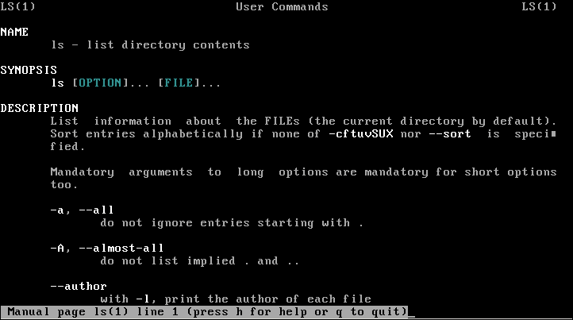
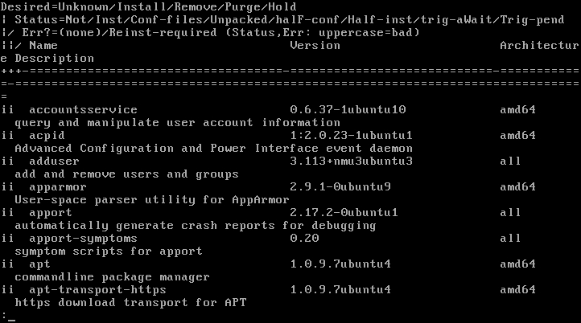
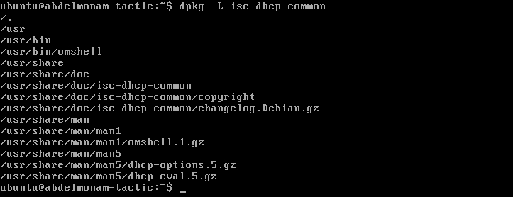
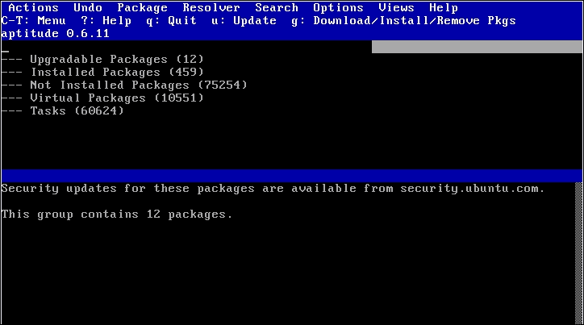
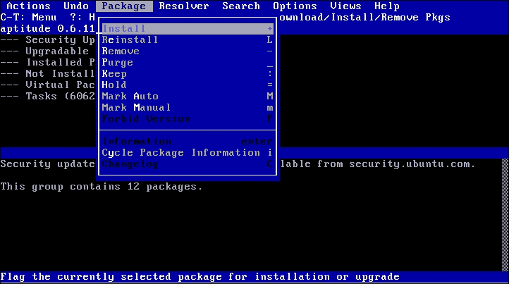
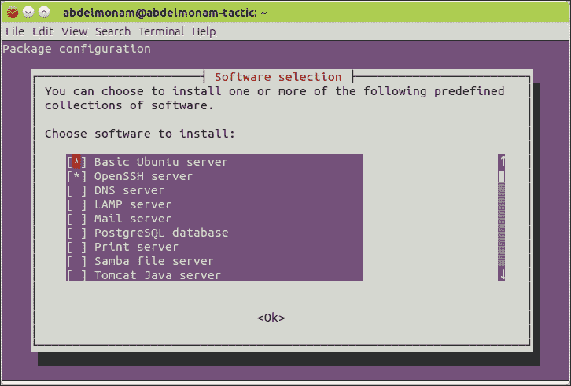
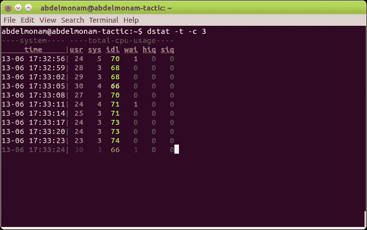

# 第二章。配置和管理 Ubuntu Server

在安装 Ubuntu Server 后，您需要进行管理。如果您是新手，本章对您来说是必不可少的。因此，请严格按照指南操作。如果您是有经验的 Linux 用户，并且熟悉其他发行版的工作方式，您可以考虑尝试类似于驾驶新车的体验。汽车当然有方向盘、油门和刹车，但您仍然需要花一点时间调整镜子，找到仪表和控制装置的位置，并调整座位直到感觉舒适。将本章视为在新车驾驶座位后花费的那一两分钟。

为了达成这个目标，我们将按照以下计划进行：

+   使用命令行进行管理

+   Ubuntu Server 的软件包管理

+   Ubuntu Server 的网络配置

+   执行基本系统管理任务

# 使用命令行进行管理

有关命令行工具及其有效使用方式，已经有整本书专门写作。在本节中，我们将查看我们需要的基本工具。如果您是经验丰富的管理员，可以跳过到下一节。只需记住以下注意事项即可。

### 注意

请注意，与其他 Linux 发行版不同，Ubuntu 默认禁用超级用户作为 root 用户使用，出于安全考虑。因此，当您希望以 root 权限运行命令时，应在命令前加上 `sudo` 关键字。系统会要求您输入密码（安装 Ubuntu Server 时使用的密码）。例如，如果您希望编辑 `/etc/hosts` 文件，请运行以下代码：

```
abdelmonam@abdelmonam-tactic:~$ sudo vi /etc/hosts
[sudo] password for abdelmonam:

```

如果您想激活 root 帐户（不推荐），或允许其他用户运行 `sudo`，您可以按照详细的教程操作。[`help.ubuntu.com/community/RootSudo`](https://help.ubuntu.com/community/RootSudo).

现在，让我们从我认为对 Linux 管理员最重要的命令开始—`man`，或在线参考手册的界面。它为您提供任何您想使用的命令的必要信息（当然，前提是该命令已经有文档，这在大多数情况下是真实的）。我们通过在希望了解的命令前输入 `man` 关键字来使用它。我们使用箭头键进行导航，`/` 字符进行搜索，*Enter* 键查看下一行，*空格键* 查看下一页，`q` 字符退出界面。例如，以下截图展示了当您运行 `man ls` 命令时会看到的内容：



`man` 页面按章节分组，每个章节对应一个主题。例如，第一个章节的 `man` 页面是可执行程序或 `shell` 命令，第二个章节是 **系统调用**（由内核提供的函数），依此类推。你可以通过运行 `man man` 命令查看所有章节。

另一个有用的命令是 `apropos`，它显示参数中找到的单词所在的章节和 `man` 页面。例如，当搜索包含 `pwd` 命令的 `man` 页面/章节时，我们使用以下命令：

```
abdelmonam@abdelmonam-tactic:~$ apropos pwd
lckpwdf (3)          - get shadow password file entry
pwd (1)              - print name of current/working directory
pwdx (1)             - report current working directory of a process
ulckpwdf (3)         - get shadow password file entry
unix_chkpwd (8)      - Helper binary that verifies the password of the current user

```

让我们考虑一个命令出现在多个章节中的情况，如下所示：

```
abdelmonam@abdelmonam-tactic:~$ apropos smbpasswd
smbpasswd (5)        - The Samba encrypted password file
smbpasswd (8)        - change a user's SMB password

```

你可以通过使用 `man <章节号> <命令>` 来查看与该章节相关的信息（例如，`man 5 smbpasswd`）。或者，如果你想查看该命令所有 `man` 页面章节的内容，可以使用 `man -a <命令>`（例如，`man -a smbpasswd`）。如果省略章节号，`man` 会返回它找到的第一个章节的 `man` 页面。

`ls` 命令列出参数中指定路径下的文件和目录（实际的 `.` 目录是默认选择）。有些选项非常有用。例如，使用 `-a` 选项，我们可以列出缓存项目。使用 `-l` 选项，我们可以获取额外的信息，如文件大小和权限：

```
abdelmonam@abdelmonam-tactic:~$ ls -la /etc/systemd/
total 48
drwxr-xr-x  5 root root 4096 Jun  2 17:30 .
drwxr-xr-x 93 root root 4096 Jun  2 17:40 ..
-rw-r--r--  1 root root  720 Apr 18 22:11 bootchart.conf
-rw-r--r--  1 root root  970 Apr 18 22:11 journald.conf
-rw-r--r--  1 root root  966 Apr 18 22:11 logind.conf
drwxr-xr-x  2 root root 4096 Apr 18 22:11 network
-rw-r--r--  1 root root  589 Apr 18 22:11 resolved.conf
drwxr-xr-x 13 root root 4096 Jun  2 17:38 system
-rw-r--r--  1 root root 1471 Apr 18 22:11 system.conf
-rw-r--r--  1 root root  607 Apr 18 22:11 timesyncd.conf
drwxr-xr-x  2 root root 4096 Apr 18 22:11 user
-rw-r--r--  1 root root 1127 Apr 18 22:11 user.conf

```

`pwd` 命令给出当前路径（工作目录）。

`history` 命令列出了你运行的最后几个命令。

`chmod` 命令允许你更改文件权限。使用时请小心，尤其是在使用 `*` 魔法符号代替文件名并配合 `-R` 选项递归执行时。与此相关的命令还有 `chown` 和 `chgrp`，它们分别允许你更改文件的所有者和组。

`top` 命令列出正在你 Ubuntu 服务器上运行的进程；这些进程按 CPU 使用率排序。该列表实时更新，且受屏幕大小限制。如果你想查看系统上运行的所有进程列表，可以运行著名的 `ps -ef | less` 命令。在这里，我们通过使用 `|` 字符将该命令的结果传递给 `less` 命令，按页面逐步查看结果输出，`less` 的功能类似于著名的 `more` 命令。此外，`less` 允许你向前和向后浏览。

### 提示

请注意，管道（使用 `|` 字符）是一种优化命令输出的机制，通过将第一个命令（`|` 字符前的命令）的输出作为输入传递给第二个命令（`|` 字符后的命令）。我们可以在单个命令行中使用多个管道进行级联。

在没有图形界面的服务器环境中，有一些有用的快捷键，比如 *Ctrl+C*，用于退出未响应的命令（或执行时间过长的命令），*Ctrl+D*，用于向命令发送 **文件结束**（**EOF**）信号，最后是 *Ctrl+Z*，用于停止正在前台运行的命令（在控制台上）。尽管它会停止命令的执行，但并不会终止它。相反，它只是被暂停了。我们可以通过 `bg` 命令将其恢复到后台，或者通过 `fg` 命令再次将其恢复到前台。要做到这一点，你需要知道与程序相关联的作业号。你可以通过 `jobs` 命令获取作业号列表。

对于文件管理，你需要使用 `mkdir` 来创建目录，`cd` 进入目录，`touch` 创建文件，`cat` 查看文件内容。对于目录/文件管理，你可以使用 `cp` 进行复制，`rm` 进行删除，`mv` 进行移动/重命名。

要编辑文件，你可以使用两个著名的编辑器中的任意一个，`vi` 或 `vim`。

### 提示

请注意，这些是最常用的 CLI 命令。在本书的后续章节中，我们将会介绍其他命令。每当我们需要使用某个命令时，都会为其提供解释。如果你希望充分利用某个特定的命令，可以使用之前提到的 `man` 命令。

### 注意

如果你想深入了解 Linux **命令行**（**CLI**），我建议你参考[`linuxcommand.org/tlcl.php`](http://linuxcommand.org/tlcl.php)上的书籍。

在服务器环境中工作时，了解基本的 `vi`/`vim` 编辑器是强制性的。学习如何使用 `vi` 超出了本书的范围。所以，你需要自己做一些努力来学习它。如果需要更多帮助，你可以在[`www.cs.colostate.edu/helpdocs/vi.html`](http://www.cs.colostate.edu/helpdocs/vi.html)找到一些很好的 `vi` 编辑器基础培训。

# Ubuntu 服务器的软件包管理

Ubuntu 和其他基于 Debian 的系统一样，使用 Debian 软件包格式，如 `.deb` 软件包。在安装软件时，我更喜欢使用 `.deb` 软件包，而不是 `tarball` 压缩包。因为一方面，与 `tarball` 不同，使用 `.deb` 软件包可以让我们追踪系统中安装的每个软件包。另一方面，只有 `.deb` 软件包可以通过包管理器请求服务器上的软件包数据库，并获取有关已安装和可用软件包的信息，包管理器会自动处理缺失的依赖项。

## 软件包库

Ubuntu 软件包存储在软件库中，软件库是一个预编译的二进制格式的软件包集合，这些软件包可以存储在不同的介质上，例如 CD-ROM，或通过互联网获取。Canonical（Ubuntu 的创建公司）提供了四个官方软件库：

+   `main`：这是一个包含完全自由许可下分发的软件，并且由 Ubuntu 团队支持的仓库。

+   `restricted`：这是一个包含可能不完全符合自由许可的软件，但由 Ubuntu 团队支持的仓库，通常包含特定硬件组件的驱动程序。

+   `universe`：这个仓库包含大多数 Linux 世界中的开源软件，这些软件可能不完全符合与其他软件相同的自由许可。该仓库中的软件不由 Ubuntu 团队提供支持。

+   `multiverse`：在这里，你会找到一些不符合自由软件标准的软件。该仓库中的软件不由 Ubuntu 团队提供支持。

还有许多其他的仓库。它们中的许多是由软件编辑器拥有并包含与其产品相关的软件包。大多数是由社区提供的，并且存在于 **个人软件包档案** (**PPA**) 下，这是一个适用于 Ubuntu 的仓库软件（更多信息请访问 [`launchpad.net/ubuntu/+ppas`](https://launchpad.net/ubuntu/+ppas)）。

在 Ubuntu 服务器上管理仓库是在 `/etc/apt/sources.list` 文件中完成的。以下是一个新安装的 Ubuntu 服务器的该文件示例：

```
abdelmonam@abdelmonam-tactic:~$ cat /etc/apt/sources.list
#

# deb cdrom:[Ubuntu-Server 15.04 _Vivid Vervet_ - Release amd64 (20150422)]/ vivid main restricted

#deb cdrom:[Ubuntu-Server 15.04 _Vivid Vervet_ - Release amd64 (20150422)]/ vivid main restricted

# See http://help.ubuntu.com/community/UpgradeNotes for how to upgrade to
# newer versions of the distribution.
deb http://tn.archive.ubuntu.com/ubuntu/ vivid main restricted
deb-src http://tn.archive.ubuntu.com/ubuntu/ vivid main restricted

## Major bug fix updates produced after the final release of the
## distribution.
deb http://tn.archive.ubuntu.com/ubuntu/ vivid-updates main restricted
deb-src http://tn.archive.ubuntu.com/ubuntu/ vivid-updates main restricted

## N.B. software from this repository is ENTIRELY UNSUPPORTED by the Ubuntu
## team. Also, please note that software in universe WILL NOT receive any
## review or updates from the Ubuntu security team.
deb http://tn.archive.ubuntu.com/ubuntu/ vivid universe
deb-src http://tn.archive.ubuntu.com/ubuntu/ vivid universe
deb http://tn.archive.ubuntu.com/ubuntu/ vivid-updates universe
deb-src http://tn.archive.ubuntu.com/ubuntu/ vivid-updates universe

## N.B. software from this repository is ENTIRELY UNSUPPORTED by the Ubuntu
## team, and may not be under a free licence. Please satisfy yourself as to
## your rights to use the software. Also, please note that software in
## multiverse WILL NOT receive any review or updates from the Ubuntu
## security team.
deb http://tn.archive.ubuntu.com/ubuntu/ vivid multiverse
deb-src http://tn.archive.ubuntu.com/ubuntu/ vivid multiverse
deb http://tn.archive.ubuntu.com/ubuntu/ vivid-updates multiverse
deb-src http://tn.archive.ubuntu.com/ubuntu/ vivid-updates multiverse

## N.B. software from this repository may not have been tested as
## extensively as that contained in the main release, although it includes
## newer versions of some applications which may provide useful features.
## Also, please note that software in backports WILL NOT receive any review
## or updates from the Ubuntu security team.
deb http://tn.archive.ubuntu.com/ubuntu/ vivid-backports main restricted universe multiverse
deb-src http://tn.archive.ubuntu.com/ubuntu/ vivid-backports main restricted universe multiverse

deb http://security.ubuntu.com/ubuntu vivid-security main restricted
deb-src http://security.ubuntu.com/ubuntu vivid-security main restricted
deb http://security.ubuntu.com/ubuntu vivid-security universe
deb-src http://security.ubuntu.com/ubuntu vivid-security universe
deb http://security.ubuntu.com/ubuntu vivid-security multiverse
deb-src http://security.ubuntu.com/ubuntu vivid-security multiverse

## Uncomment the following two lines to add software from Canonical's
## 'partner' repository.
## This software is not part of Ubuntu, but is offered by Canonical and the
## respective vendors as a service to Ubuntu users.
# deb http://archive.canonical.com/ubuntu vivid partner
# deb-src http://archive.canonical.com/ubuntu vivid partner

```

在修改了源列表文件后，使用 `sudo apt-get update` 命令更新软件包数据库。接下来我们将看看如何使用 `apt` 工具。

## 软件包管理工具

在 Ubuntu 中，有一些软件包管理工具，尤其是在大多数服务器安装的非图形环境中。在接下来的部分，你将了解除了著名的 `tasksel` 工具外，最常用的三个工具——`dpkg`、`aptitude` 和 `apt`。

### 注意

请注意，使用多个软件包管理数据库可能会导致困惑。我建议你选择一个软件包管理系统并坚持使用它。接下来我们将使用 `apt` 来进行操作。

### dpkg 工具

该工具用于管理（安装、移除和构建）来自 CD-ROM 或其他磁盘存储的本地 `.deb` 软件包。它不会自动从仓库下载和安装软件包，也不会管理依赖关系。

`dpkg` 工具非常强大。当处理本地安装的软件包时，它可以派上用场。例如，它可以帮助你列出系统上安装的所有软件包，包括那些使用其他工具（如 `apt`）安装的软件包。要查看这些内容，你可以运行命令 `dpkg -l`（由于该命令的输出是一个巨大的列表，你可以运行 `dpkg -l` 命令并使用 `less` 分页查看）。以下是我们服务器上执行 `dpkg -l | less` 的结果：



`dpkg` 命令还可以列出与特定软件包一起安装的不同文件。在这种情况下，我们应该使用 `-l` 选项，并将软件包的名称作为参数。如以下截图所示，我们列出了与 `isc-dhcp-common` 软件包一起安装的文件：



另一方面，我们可以使用 `-S` 选项检查包中安装的特定文件。如下面的截图所示，`/usr/bin/omshell` 文件是与 `isc-dhcp-common` 包一起安装的：


### 注意

请注意，在安装包时会自动生成许多文件，尽管它们存在于文件系统中，`dpkg -S` 可能无法识别它们属于哪个包。

使用 `dpkg`，我们可以通过 `-i` 选项安装本地的 `.deb` 包：

```
sudo dpkg -i <file_name.deb>

```

我们还可以通过 `-r` 选项删除包，但不推荐这么做，因为 `dpkg` 不处理依赖关系。如果你使用 `dpkg` 删除一个程序依赖的包，可能会导致这些程序崩溃。

### aptitude 工具

`aptitude` 工具基于 **apt**（**高级包管理工具**），这一部分将在本章后面讨论，但这个工具更加用户友好。你可以使用 `aptitude`，通过 `search` 关键字在包描述数据库中搜索特定的词，或者使用 `show` 关键字来显示特定包的很多有用信息。然而，`aptitude` 最有帮助的用法是，你可以在不加任何关键字的情况下启动它，这时你将看到一个基于菜单的文本界面来操作 `apt`。这个界面适用于服务器环境（通常是非图形化工具）。它帮助用户自动执行许多任务。

当你执行 `sudo aptitude` 命令时，你会看到以下界面：



你可以通过使用 *Ctrl+T* 快捷键查看 `Package` 菜单，并使用箭头键进行导航，如下图所示：



你也可以像使用 `apt` 命令行界面那样使用 `aptitude` 命令行界面（非菜单驱动界面）。例如，你可以使用 `sudo aptitude install bind9` 来安装 `bind9` DNS 服务器。

### apt 工具

`apt` 用于从在线仓库下载并安装包。`apt` 命令（如 `apt-get`、`apt-cache` 等）通常用于与在线软件配合使用。然而，它们也可以用于安装本地包。

`apt-cache` 命令允许你操作 apt 包缓存。`apt-cache` 命令不会修改系统的状态，但它提供了搜索和从包元数据中生成有用输出的功能。例如，使用 `search` 关键字，你可以在包描述数据库中搜索特定词汇。使用 `show` 关键字，你可以显示特定包的详细信息。

`apt-get` 工具功能强大。它执行许多功能，如安装新包、升级旧包、更新包数据库，甚至升级整个 Ubuntu 服务器。

要安装一个新软件包，你只需要运行带有 `install` 关键字的命令。例如，要安装 `apache2` web 服务器，你应该运行以下命令：

```
sudo apt-get install apache2

```

当然，你可以使用以下命令将其删除：

```
sudo apt-get remove apache2
```

### 注意

请注意，使用 `--purge` 选项，你还可以删除配置文件。因此，请谨慎使用它。

我们可以同时安装和删除一整批软件包。只需写出软件包的名称，名称之间用空格隔开。

`apt-get` 的常见用法是，在修改源列表文件后更新软件数据库。要做到这一点，请执行以下命令：

```
sudo apt-get update

```

随着时间的推移，很多软件包将会有更新的版本。因此，进行 `upgrade` 操作是必要的，以保持你的 Ubuntu 服务器最新，特别是当涉及到安全更新时。`apt-get` 工具允许我们通过以下命令来完成此操作（在如前所述更新数据库后）：

```
sudo apt-get upgrade.

```

### 注意

请注意，一般情况下，完成新安装后的第一件事就是通过运行以下命令升级系统中的所有软件：

```
sudo apt-get update && sudo apt-get upgrade

```

若想了解有关 `apt-get` 的更多信息，你可以参考手册页，或使用 `help` 关键字，如下所示：

```
abdelmonam@abdelmonam-tactic:~$ apt-get help
apt 1.0.9.7ubuntu4 for amd64 compiled on Apr  7 2015 14:42:59
Usage: apt-get [options] command
 apt-get [options] install|remove pkg1 [pkg2 ...]
 apt-get [options] source pkg1 [pkg2 ...]

apt-get is a simple command line interface for downloading and
installing packages. The most frequently used commands are update
and install.

Commands:
 update - Retrieve new lists of packages
 upgrade - Perform an upgrade
 install - Install new packages (pkg is libc6 not libc6.deb)
 remove - Remove packages
 autoremove - Remove automatically all unused packages
 purge - Remove packages and config files
 source - Download source archives
 build-dep - Configure build-dependencies for source packages
 dist-upgrade - Distribution upgrade, see apt-get(8)
 dselect-upgrade - Follow dselect selections
 clean - Erase downloaded archive files
 autoclean - Erase old downloaded archive files
 check - Verify that there are no broken dependencies
 changelog - Download and display the changelog for the given package
 download - Download the binary package into the current directory

Options:
 -h  This help text.
 -q  Loggable output - no progress indicator
 -qq No output except for errors
 -d  Download only - do NOT install or unpack archives
 -s  No-act. Perform ordering simulation
 -y  Assume Yes to all queries and do not prompt
 -f  Attempt to correct a system with broken dependencies in place
 -m  Attempt to continue if archives are unlocatable
 -u  Show a list of upgraded packages as well
 -b  Build the source package after fetching it
 -V  Show verbose version numbers
 -c=? Read this configuration file
 -o=? Set an arbitrary configuration option, eg -o dir::cache=/tmp
See the apt-get(8), sources.list(5) and apt.conf(5) manual
pages for more information and options.
This APT has Super Cow Powers.

```

## 使用 tasksel 添加软件集合

`tasksel` 工具为你提供了同时安装和配置新软件的可能性——无论是使用默认值，还是让你输入适当的值。因此，你将得到你想要安装的软件，它可以正常工作并且随时可用，无需额外的自定义（当然，你可以稍后根据需要重新配置它）。

你可能还记得在安装软件时，我们看到一个界面，询问是否安装一些服务器（如 DNS、邮件、Web 等）。这一任务可以通过 `tasksel` 完成。我们可以随时通过以下命令启动相同的菜单界面：

```
sudo tasksel

```

该命令的输出如下：



使用箭头键在集合之间导航，按 *空格键* 选择你想要安装的软件（你将看到软件左侧有一个星号），按 *Tab* 键导航到 **OK** 按钮，按 *Enter* 键启动安装。

如果你想知道为完成特定任务将安装哪些软件包，可以运行以下命令，以 `lamp` web 服务器为例：

```
abdelmonam@abdelmonam-tactic:~$ tasksel --task-packages lamp-server
libmysqlclient18
apache2
php5-cli
libapache2-mod-php5
apache2.2-common
apache2-utils
php5-common
php5-mysql
mysql-server
apache2.2-bin
mysql-client-5.5
mysql-server-5.5
perl-modules
perl
mysql-server-core-5.5
mysql-client-core-5.5
ssl-cert
apache2-mpm-prefork
mysql-common

```

# Ubuntu 服务器的网络配置

要涵盖 Linux 系统管理员的所有网络配置方面，我们需要大量的书籍。因此，在这一小节中，我们将只涵盖每个 Ubuntu 服务器管理员在设置和更改网络设置时需要的基本主题。

## 配置文件

在这一节中，我们将查看 Ubuntu 服务器网络设置的核心文件。

### 注意

请注意，修改这些文件后，你应该通过输入以下命令重启网络进程：

```
sudo /etc/init.d/networking restart

```

与 Red Hat 系统不同，Ubuntu 以及所有基于 Debian 的发行版使用一个独特的文件来配置所有网络接口；这个文件叫做 `/etc/network/interfaces`。一般来说，在 Ubuntu 服务器上，你会看到回环接口和以太网接口。对于回环接口（127.0.0.1），其配置是标准的，不需要你做任何修改。对于以太网接口，在大多数情况下（当你处理服务器时），你会发现多个接口。它们通常被命名为 `ethX`，其中 `X` 是一个从 *0* 开始并根据接口数量递增的数字。

以太网接口可以配置为 DHCP 或静态模式。如果是 DHCP 模式，我们将在 `/etc/network/interfaces` 中看到以下内容：

```
auto eth0
iface eth0 inet dhcp

```

这里，包含 `auto` 关键字的那一行表示该接口在计算机启动时应自动启动。

如果是静态模式，你将看到如下的输出：

```
iface eth0 inet static
address 192.168.1.58
netmask 255.255.255.0
gateway 192.168.1.1

```

这些字段非常简单，且几乎不需要解释。

另一个重要的网络配置文件是 `/etc/resolv.conf`，它包含了你的服务器使用的 DNS 列表。如果你使用的是 DHCP，这个文件的内容会自动设置。你可以通过以下格式编辑它，添加你自己的/喜欢的 DNS 服务器：

```
nameserver 192.168.1.11
nameserver 192.168.1.12

```

该列表中 DNS 服务器的顺序将会在处理 DNS 请求时被遵循。

### 注意

请注意，一般来说，我们使用以下命令编辑 DNS 服务器：

```
sudo vi /etc/resolv.conf

```

然而，从 Ubuntu 12.04 及之后的版本开始，你应该使用以下内容：

```
sudo vi /etc/resolvconf/resolv.conf.d/base

```

`/etc/hosts` 文件也是核心网络设置文件之一。默认情况下，它包含了回环地址和本地主机地址，但你可以在其中添加其他地址/主机名对。在检查 DNS 之前，它将被首先使用。当你希望为主机名分配一个 IP 地址，即使你的 DNS 宕机时，它也非常有用。这个文件也被许多服务使用。我们将在下一章中查看这一点。

## 网络工具

在本节中，我们将了解一些 Ubuntu 服务器管理员应该了解的网络程序。

你应该了解的前两个命令是 `ifup` 和 `ifdown`，分别用于启用和禁用接口。你应该在参数中使用接口的名称。

### 注意

当你关闭一个接口时要小心。这样做可能会干扰系统中的任何服务。此外，如果你通过 SSH 连接到系统，并且关闭了系统的主要接口，你将会断开与 SSH 的连接。

另一个重要的工具是 `ifconfig`，它可以提供关于接口的详细信息，如下所示：

```
abdelmonam@abdelmonam-tactic:~$ ifconfig
eth0  Link encap:Ethernet  HWaddr 08:00:27:74:26:9b
 inet addr:192.168.1.58  Bcast:192.168.1.255  Mask:255.255.255.0
 inet6 addr: fe80::a00:27ff:fe74:269b/64 Scope:Link
 UP BROADCAST RUNNING MULTICAST  MTU:1500  Metric:1
 RX packets:3182 errors:0 dropped:0 overruns:0 frame:0
 TX packets:758 errors:0 dropped:0 overruns:0 carrier:0
 collisions:0 txqueuelen:1000
 RX bytes:296560 (296.5 KB)  TX bytes:117994 (117.9 KB)

lo    Link encap:Local Loopback
 inet addr:127.0.0.1  Mask:255.0.0.0
 inet6 addr: ::1/128 Scope:Host
 UP LOOPBACK RUNNING  MTU:65536  Metric:1
 RX packets:176 errors:0 dropped:0 overruns:0 frame:0
 TX packets:176 errors:0 dropped:0 overruns:0 carrier:0
 collisions:0 txqueuelen:0
 RX bytes:14144 (14.1 KB)  TX bytes:14144 (14.1 KB)

```

`ifconfig` 命令也允许你配置接口、启用它们以及禁用它们。你可以通过 `man ifconfig` 查看它的潜力。

另一个重要的网络程序是 `route` 命令。与 `ifconfig` 相似，这个命令既可以用来查看网络设置，也可以用来设置网络路由（在本例中是网络路由）。它用于管理服务器上的路由（例如列出、添加、删除等）。我们来看一下以下命令：

```
abdelmonam@abdelmonam-tactic:~$ route
Kernel IP routing table
Destination  Gateway      Genmask      Flags Metric Ref    Use Iface
default      192.168.1.1  0.0.0.0       UG    0      0        0 eth0
192.168.1.0  *            255.255.255.0  U    0      0        0 eth0

```

在路由配置的相同上下文中，有一个著名的 `traceroute6` 命令，它能显示从服务器到目标的路径。

`ethtool` 命令是一个用于操作以太网卡设置的程序，如端口速度、自动协商、双工模式和 Wake-on-LAN。你可以使用以下命令安装它：

```
sudo apt-get install ethtool

```

要查看 `ethtool` 选项，你可以运行 `man ethtool` 或 `ethtool -h | less`。

# 执行基本的系统管理任务

在本节中，我们将探讨一组有用的 Ubuntu Server 管理任务，如监控和进程管理。

## 监控资源

对于系统管理员来说，监控任务是最重要的，因为它们能帮助我们保持系统的稳定，防止事故发生。Ubuntu Server 提供了一套强大的监控工具，涵盖了 CPU 使用情况、硬盘、虚拟内存等内容。

有些工具是 Ubuntu 自带的，而有些则需要安装。`sysstat` 包含其中的一些工具。你可以使用以下命令安装它：

```
sudo apt-get install sysstat

```

Ubuntu Server 管理员需要永久监控的最重要资源之一是内存使用情况，因为内存不足会对系统性能产生负面影响。

你可以使用 `free` 和 `top` 命令查看有关 RAM 和交换空间使用的基本信息。若要获得有关服务器内存使用的更详细信息，可以参考 `vmstat` 命令。`slabtop` 命令在你想查看内核（内存 slab 缓存）消耗多少内存时非常有用。

如前所述，`top` 命令用于查看当前正在运行的进程。默认情况下，这些进程会根据 CPU 使用情况进行排序。你还可以使用 `top` 以屏幕方式监控内存使用情况。当 `top` 正在运行时，只需按下 *Shift+m*，运行中的进程就会按内存使用情况进行排序（这样你可以检查哪些进程消耗了最多内存）。

另一个 Ubuntu Server 管理员需要监控的重要系统资源是 CPU 使用情况。我们之前提到过的 `vmstat` 命令可以生成与 CPU 使用情况相关的基本统计信息，如系统活动、用户活动、I/O 等待时间、空闲时间等。如果你想要更详细的 CPU 利用率报告，可以使用 `iostat` 命令，它包含在开头提到的 `sysstat` 包中。

例如，下面是如何每 5 秒显示一次 CPU 统计信息：

```
abdelmonam@abdelmonam-tactic:~$ iostat -c 5
Linux 3.19.0-15-generic (abdelmonam-tactic)  2015-06-13  _x86_64_ (1 CPU)

avg-cpu:  %user   %nice  %system  %iowait  %steal   %idle
 24,27   0,08   5,17     0,94     0,00     69,55

avg-cpu:  %user   %nice %system %iowait  %steal   %idle
 24,45   0,00  3,41    0,25     0,00     71,89

avg-cpu:  %user   %nice %system %iowait  %steal   %idle
 24,66    0,00    3,11    0,15    0,00   72,08

avg-cpu:  %user   %nice %system %iowait  %steal   %idle
 28,17   0,00  3,39    0,10     0,00     68,34

avg-cpu:  %user   %nice %system %iowait  %steal   %idle
 23,97   0,00  2,65    0,41     0,00     72,98

avg-cpu:  %user   %nice %system %iowait  %steal   %idle
 25,08   0,00  3,13    0,21     0,00     71,59

avg-cpu:  %user   %nice %system %iowait  %steal   %idle
 25,56   0,00  3,46    0,00     0,00     70,99

```

`iostat`的替代方法是`dstat`命令，它可以查看 CPU 使用情况和其他性能相关的信息。`dstat`命令具有一些其他工具所不具备的优势，比如信息显示的简洁性和清晰性，以及颜色的使用。要安装这个工具，请使用以下命令安装`dstat`包：

```
$ sudo apt-get install dstat

```

这是`dstat`显示 CPU 信息的一个示例：



如前所述，`top`命令允许你专门找出哪些进程占用了最多的处理时间。默认情况下，排序顺序是基于 CPU 使用率的，但如果你因某些原因改变了排序方式（比如我们之前把排序方式改成了基于内存使用情况），你可以通过在运行`top`时使用*Shift+p*命令恢复到默认的排序顺序。

像`du`和`df`这样的命令可以让你获取有关你 Ubuntu 服务器可用存储空间的基本信息。要了解存储设备的详细性能，可以使用`vmstat`和`iostat`等命令。

让我们通过使用`vmstat`命令查看与磁盘相关的统计信息。以下是使用`vmstat`查看磁盘读写统计信息的示例，使用了-d 选项：

```
abdelmonam@abdelmonam-tactic:~$ vmstat -d

```

```
disk--------reads-------- ---------writes-------- -----IO------
     total merged sectors ms  total  merged  sectors  ms  cur  sec
ram0  0     0      0       0   0      0       0        0   0     0
ram1  0     0      0       0   0      0       0        0   0     0
ram2  0     0      0       0   0      0       0        0   0     0
ram3  0     0      0       0   0      0       0        0   0     0
ram4  0     0      0       0   0      0       0        0   0     0
ram5  0     0      0       0   0      0       0        0   0     0
ram6  0     0      0       0   0      0       0        0   0     0
ram7  0     0      0       0   0      0       0        0   0     0
ram8  0     0      0       0   0      0       0        0   0     0
ram9  0     0      0       0   0      0       0        0   0     0
ram10 0     0      0       0   0      0       0        0   0     0
ram11 0     0      0       0   0      0       0        0   0     0
ram12 0     0      0       0   0      0       0        0   0     0
ram13 0     0      0       0   0      0       0        0   0     0
ram14 0     0      0       0   0      0       0        0   0     0
ram15 0     0      0       0   0      0       0        0   0     0
loop0 0     0      0       0   0      0       0        0   0     0
loop1 0     0      0       0   0      0       0        0   0     0
loop2 0     0      0       0   0      0       0        0   0     0
loop3 0     0      0       0   0      0       0        0   0     0
loop4 0     0      0       0   0      0       0        0   0     0
loop5 0     0      0       0   0      0       0        0   0     0
loop6 0     0      0       0   0      0       0        0   0     0
loop7 0     0      0       0   0      0       0        0   0     0
sr0   0     0      0       0   0      0       0        0   0     0
sr1   0     0      0       0   0      0       0        0   0     0
sda   6742  89   493438  73140 732   969    43336   17552  0    37
```

另一个有用的文件系统管理命令是`lsof`。它可以帮助你查找哪些文件和目录实际上在存储设备上是打开的。你需要使用这个命令的最常见情况之一是当你试图卸载一个提示仍然在使用中的文件系统时。在这种情况下，你可以评估哪个打开的文件阻止了卸载，决定是否停止持有该文件的进程，然后再次执行卸载操作。

## 进程管理

如前所述，`ps`和`top`命令允许我们显示大量与运行中的进程相关的信息。在本节中，我们将探讨其他可以帮助我们管理进程的命令。

当你运行`top`时，除了排序之外，你还可以执行很多操作。例如，你可以输入字母*k*，后跟一个信号编号（例如 9 或 15）和 PID，这会将信号发送到具有该 PID 的进程。你也可以使用字母*n*来更改一个进程的优先级。

改变正在运行的进程优先级的另一种方法是使用`renice`命令。如果你想在启动进程时更改默认优先级或设置更高或更低的优先级，可以使用 nice 命令。

改变正在运行的进程行为的另一种方法是向该进程发送信号。像`kill`、`pkill`和`killall`这样的命令可以用来向正在运行的进程发送信号。我们可以用数字（例如 9 和 15）或字符串（如 SIGKILL 和 SIGTERM）来表示信号。

## 调度需要运行的进程

与 `cron` 服务相关的命令可以用于在特定时间（包括当前时间）运行一个命令，因此它不会与当前的 shell 连接。`at` 命令用于在你设置的时间运行命令。例如，如果你想在 1 分钟后运行命令，只需运行 `at now +1 min` 命令。然后，当你看到 at 提示符时，写下你要执行的命令，如下所示：

```
at> your_command

```

之后，按 *Enter* 键。你将再次看到 at 提示符。你可以输入另一个命令或多个命令，每个命令占一行。然后，按 Enter 键。最后，运行 *Ctrl+d* 快捷键来关闭 at 提示符。

以同样的方式，你可以输入 `at now +7 days` 来在 7 天后运行一个命令。或者，如果你想在特定日期执行命令，可以运行 `at`，后跟 `dd/mm/yy` 格式的日期。

如果你想查看你输入命令后将执行的 at 作业队列（如前所述），你需要运行 `atq` 命令。如果你是新用户，你只能看到自己排队的 at 作业。只有 root 用户才能看到所有人的排队 at 作业。使用 `atrm` 命令，后跟作业编号（通过 `at` 创建步骤或 `atq` 命令获得），可以删除队列中的某个 `at` 作业。

`at` 命令用于排队一个只运行一次的命令。如果你想设置让命令反复运行，你可以使用 `cron` 服务，它允许你在 `crontab` 文件中编写脚本来安排 `cron` 作业。通常，有一个系统级的 `crontab` 文件（位于 `/etc/crontab`），但每个用户都可以创建个人的 `crontab` 文件，允许他们在自己选择的时间启动命令。要创建个人的 `crontab` 文件，你需要输入以下命令：

```
crontab -e

```

`crontab -e` 命令会打开 `crontab` 文件（如果文件存在的话），如果没有，它会使用你选择的文本编辑器创建一个新的文件：

```
abdelmonam@abdelmonam-tactic:~$ crontab -e
no crontab for abdelmonam - using an empty one

Select an editor.  To change later, run 'select-editor'.
 1\. /bin/ed
 2\. /bin/nano        <---- easiest
 3\. /usr/bin/emacs23
 4\. /usr/bin/vim.tiny

Choose 1-4 [2]:

```

在 `crontab` 文件中，每个作业都由一行表示，该行决定了作业的运行时间，后面跟着需要运行的命令。对于 `times` 字段，它们的顺序如下：**分钟** (**m**)、**小时** (**h**)、**日期** (**dom**)、**月份** (**mon**) 和 **星期几** (**dow**)。你可以在这些字段中使用 `*`（表示 `任何`）。

### 注意

以下是从左到右的字段：分钟（0 到 59）、小时（0 到 23）、日期（0 到 31）、月份（0 到 12 或 Jan, Feb, Mar, Apr, May, Jun, Jul, Aug, Sep, Oct, Nov, Dec）和星期几（0 到 7 或 Sun, Mon, Tue, Wed, Thu, Fri, Sat）。字段中的星号（*）表示该字段可以匹配任何值。

你可以为每个字段使用单个值或多个值。例如，对于`dow`字段，你可以使用**Mon**、**Fri**的值来在每周的开始和结束（每个**星期一**和**星期五**）运行作业。举个例子，对于`mon`字段，值 1,4,7,10 意味着作业将在每个季度的第一个月启动（即 1 月、4 月、7 月和 10 月）。

`crontab`作业的输出（包括错误信息）会通过电子邮件发送给属于该`crontab`文件的用户（除非被重定向）。

要列出你的`crontab`文件内容，应该运行`crontab –l`，要删除你的`crontab`文件，应该运行`crontab -r`。

# 总结

在本章中，我们了解了配置和管理 Ubuntu Server 系统的不同方面。我们学习了使用 CLI 进行网络设置、软件包管理和管理任务。

在下一章，我们将开始本书的新部分，涉及服务的创建和管理。
