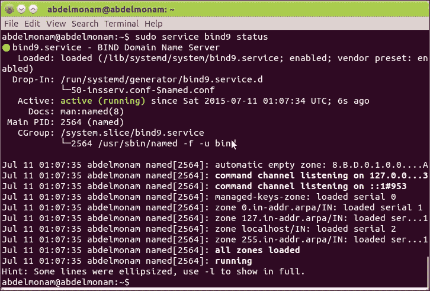
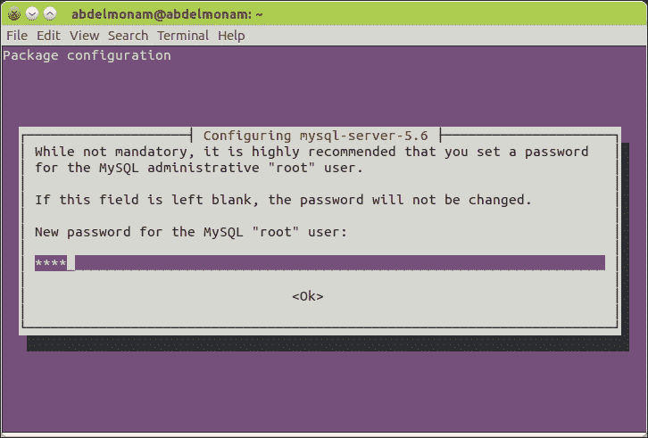
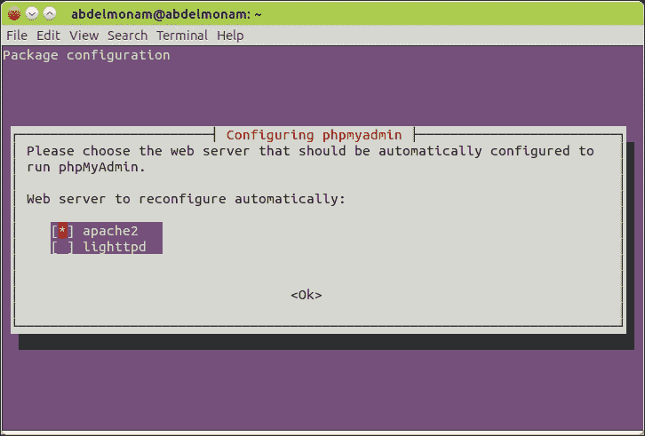
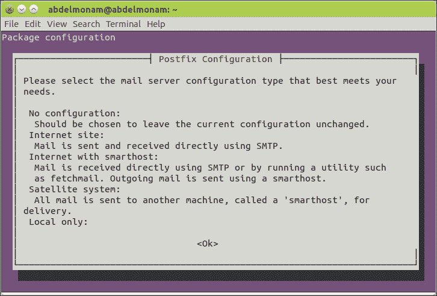
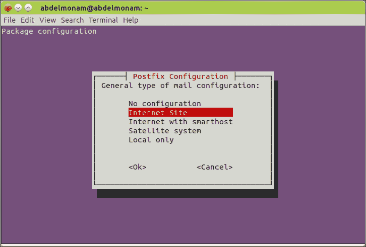
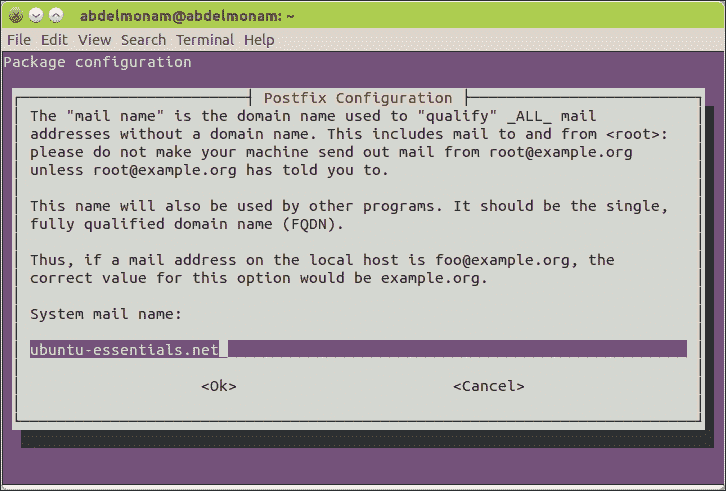

# 第三章：在 Ubuntu 上部署服务器

数百种不同的服务可以部署在 Ubuntu 服务器上，每一种服务都可以在一本书中详细介绍。本章将重点介绍一些系统管理员常见的服务器设置和配置要点。新手将获得逐步指导，而高级用户将了解 Ubuntu 的服务器方法。我们将从部署著名的 OpenSSH 服务器开始，然后设置 DNS 服务器。接着，我们将介绍如何启动 Web 服务器和邮件服务器。最后，我们将介绍如何部署数据库、DHCP 和文件服务器。

本章内容涵盖了以下主题：

+   部署 OpenSSH 服务器

+   设置 DNS 服务器

+   启动 Web 服务器

+   部署邮件服务器

+   设置数据库服务器

+   设置 DHCP 服务器

+   安装文件服务器

# 部署 OpenSSH 服务器

让我们从最有用的服务器开始，依我看来，每个管理员都应该在他们的服务器上安装它，无论该服务器的目的是什么，以及需要放置哪些服务。它就是 **OpenSSH** 服务器，允许你通过安全的方式从一个可以访问该服务器的计算机远程连接到服务器。OpenSSH 服务器是一组工具，除了提供安全的远程连接外，还支持通过 scp 协议进行安全的文件传输。

OpenSSH 服务器允许客户端使用多种认证方式连接，如简单密码、公共密钥和 Kerberos 票证。

## 安装 OpenSSH 服务器

我们可以只安装 OpenSSH 服务器，但通常我们需要同时安装 OpenSSH 工具——即服务器和客户端。我们需要一个服务器来从可访问的计算机连接到我们正在使用的 Ubuntu 服务器。我们还需要一个客户端来将其连接到另一个服务器或计算机。

安装 OpenSSH（包括服务器和客户端）非常简单。要安装 OpenSSH 客户端，你需要运行以下命令：

```
sudo apt-get install openssh-client

```

对于 OpenSSH 服务器，我们之前看到可以在 Ubuntu Server 安装过程中使用 `tasksel` 工具进行安装，但如果你在之前的步骤中忘记执行此操作，你需要运行以下命令：

```
sudo apt-get install openssh-server

```

### 注意

要同时安装客户端和服务器，你只需运行以下命令：

```
sudo apt-get install ssh

```

## 配置 OpenSSH 服务器

OpenSSH 服务器由 `sshd` 守护进程管理。其配置文件位于 `/etc/ssh/sshd_config`，可以通过编辑该文件来修改配置。

### 提示

对该文件的不当操作可能会影响 SSH 服务器的正常运行，甚至使其崩溃。因此，最好先对该文件进行备份，并作为安全措施，通过以下命令将备份文件设置为只读：

```
sudo cp /etc/ssh/sshd_config /etc/ssh/sshd_config.original
sudo chmod a-w /etc/ssh/sshd_config.original

```

让我们看几个可以通过此文件进行更改的示例。第一个例子是查找端口号。默认情况下，`sshd`监听端口*22*。您可以更改此行为，并通过在该文件中将端口指令的值设置为*2233*，使其监听端口*2233*。您还会找到**HostKey**指令，它允许我们设置认证密钥的路径。另一个例子是，当您想在登录前显示`/etc/issue.net`文件中的横幅消息时，通过注释掉以下行来实现：

```
#Banner /etc/issue.net

```

如果您想了解更多可以更改的配置指令及其可能的值和用途，只需运行 `man sshd_config` 命令。

在修改了`/etc/ssh/sshd_config`文件后，您应保存文件，并使用`sudo service ssh restart`命令重启守护进程。

### 小贴士

在远程位置编辑此文件时要小心，尤其是当远程连接是连接到服务器的唯一方式时，因为修改此文件可能会改变与网络交互时的行为。此外，如果该文件中有错误并且您重新启动`sshd`守护进程，服务器可能无法重新启动，您将失去与服务器的连接。因此，请小心操作，并准备好应急计划（例如，让现场人员通过恢复原始备份文件重新建立连接）。

请注意，通过运行`/usr/bin/sshd -t`，您可以在重启服务器之前测试`config`文件，从而避免我们在前一节中讨论的潜在问题。

# 设置 DNS 服务器

**DNS** 是一种**域名系统**服务器，它通过提供相应的 IP 地址来回答有关域名的查询。它是 www 工作的必要条件；没有它，用户将不得不学习每个网站的 IP 地址并手动输入到浏览器中（或者将它们手动添加到主机文件中），这是不可能的。

在 Ubuntu 下有许多提供 DNS 服务的程序，但最常见的是 BIND。

## BIND 安装

如果在 Ubuntu Server 安装过程中错过了安装 BIND，您现在可以安装，方法有不止一种。

您可以使用`tasksel`工具，它会自动为您安装`bind9`和`bind9-doc`两个软件包。或者，您也可以使用`apt-get`工具，如下所示：

```
sudo apt-get install bind9 bind9-doc

```

一旦安装了 BIND 软件包，它将使用默认参数完全配置并能够作为递归查询的缓存 DNS 工作。您当然可以根据需要自定义它。我们将在接下来的章节中讨论如何做到这一点。

您可以使用以下命令检查 BIND 的状态：

```
sudo service bind9 status

```

如果它没有运行，您可以使用以下命令启动它：

```
sudo service bind9 start

```

此命令的输出如下图所示：



### Ubuntu 的 BIND 约定

BIND 文件在 Ubuntu 中的组织方式可能与其他发行版有所不同。以下是基本的文件和目录：

+   `/etc/bind`：这是 BIND 配置文件的主目录，它还包含 `区域` 文件。

+   `/etc/bind/named.conf`：这是 BIND 的主配置文件。它包含了来自其他文件的脚本，其中最著名的文件有：`/etc/bind/named.conf.default-zones`，它包含如本地主机的默认区域；`/etc/bind/named.conf.local`，它包含由系统管理员添加的区域（当您想要添加区域时使用此文件）；以及 `/etc/bind/named.conf.options`，它包含诸如转发器地址等附加选项。

+   `/etc/bind/db.*`：包含与每个区域相关的信息的区域文件，约定以 `db.` 开头，每个文件表示一个特定的区域。

+   `/etc/init.d/bind9`：这是包含启动 BIND 服务所需的启动参数的文件。

+   `/var/log/syslog`：默认情况下，BIND 使用此文件存储其日志。该文件包含许多其他服务的日志。因此，如果您只希望获取 BIND 的日志，可以使用 `grep` 命令查找关键字 `named`，如下所示：

    ```
    grep named /var/log/syslog

    ```

## 配置 BIND

配置 BIND 很简单。它通常是创建新的区域（或编辑现有的区域）。这可以通过执行以下三个步骤来完成：

1.  可以创建与需要添加的区域相关的区域文件，或者编辑现有的文件。

1.  在 `/etc/bind/named.conf.local` 中添加对区域文件的引用

1.  使用以下命令重新加载 BIND 服务：

    ```
    sudo service bind9 reload

    ```

## 区域文件配置

与特定域名相关的详细信息存储在 DNS 服务器中的一个实体中，称为 **区域**。每个区域都由 `/etc/bind/` 目录下的一个文件表示。在本节中，我们将了解如何配置 DNS 区域文件。

### 注意

如果您想了解更多关于该主题的信息，可以在 [`www.slashroot.in/what-dns-zone-file-complete-tutorial-zone-file-and-its-contents`](http://www.slashroot.in/what-dns-zone-file-complete-tutorial-zone-file-and-its-contents) 找到完整的关于区域文件及其内容的教程。

区域文件具有相同的结构。因此，配置新区域的一个简单方法是复制现有的区域文件（例如 `/etc/bind/db.local`），然后根据需要修改它。

默认情况下，区域文件中的定时器是以秒为单位设置的。您可以通过在值后添加字母 `d` 来使用其他时间单位，例如天、添加字母 `w` 表示周、使用字母 `h` 表示小时，等等。

以下是区域文件配置中最重要的字段：

+   **SOA**：**授权开始**，该服务器被认为是信息的最佳来源

+   **NS**：这是区域文件的名称服务器

+   **A**：这是 IPv4 地址

+   **AAAA**：这是 IPv6 地址

+   **MX**：这是邮件服务器

你还需要为每个创建的区域配置一个反向 DNS 文件。其结构与正向文件相同，因此你可以简单地复制一个默认的反向区域，例如 `/etc/bind/db.127`。

要在 `/etc/bind/named.conf.local` 文件中引用一个区域文件，只需复制现有引用的示例并进行修改。以下是一个示例，演示了这个过程：

```
zone "localhost" {
  type master;
  file "/etc/bind/db.local";
};
zone "127.in-addr.arpa" {
  type master;
  file "/etc/bind/db.127";
};
```

### 注意

当你重新加载 BIND 时，它会考虑到修改后的区域文件，并且该文件具有更高的序列号。所以，在每次修改文件时，确保增加区域文件中的序列号。如果不这样做，你的修改将会被忽略。大多数系统管理员使用 yyyyMMddHHmm 格式来表示这个字段。

## DNS 冗余

DNS 是 Web 和电子邮件应用程序的关键服务。因此，保持主 DNS 服务器（称为 **salve**）的冗余非常重要，它应该与 **master** DNS 服务器拥有相同的信息。

配置这个过程时，你需要通过使用 NS 记录将 salve 服务器添加到主服务器的区域文件中。然后，在引用区域文件时，应该在主 DNS 的区域定义中添加 allow-transfer 选项，以允许 slave DNS 从主 DNS 复制数据。你还可以添加 also-notify 选项，以便主 DNS 在该区域有任何修改时通知 slave DNS。另一方面，在 slave 服务器中，区域定义应该包含 slave 类型，并指向主服务器。例如，假设主 DNS 的 IP 地址是 *192.168.1.1*，而 slave DNS 的 IP 地址是 *192.168.1.2*，那么你应该得到如下输出：

在 `master` 服务器上，你会看到如下输出：

```
zone "localhost" {
  type master;
  file "/etc/bind/db.local";
  allow-transfer { 192.168.1.2; };
  also-notify { 192.168.1.2; };
};
zone "127.in-addr.arpa" {
  type master;
  file "/etc/bind/db.127";
  allow-transfer { 192.168.1.2; };
  also-notify { 192.168.1.2; };
};
```

在 `slave` 服务器上，你会看到如下输出：

```
zone "localhost" {
  type slave;
  file "/etc/bind/db.local";
  masters { 192.168.1.1; };
};
zone "127.in-addr.arpa" {
  type slave;
  file "/etc/bind/db.127";
  masters { 192.168.1.1; };
};
```

## DNS 测试

要测试你的 DNS 是否正常工作，你应该向服务器发送请求并检查信息的正确性。为此，你可以使用一台计算机，将其 DNS 服务器指向该 DNS，或者直接将该 DNS 服务器的 IP 地址作为参数添加。

著名的 NsLookup 工具是最简单的 DNS 和反向 DNS 测试工具。还有 `dig` 工具，它可以提供更丰富的答案，以及与 NsLookup 类似的 host 工具。

# 启动 web 服务器

有很多开源的 web 服务器可以在 Ubuntu Server 上部署，例如 Apache Tomcat、NGINX 和 Jetty。每个 web 服务器都应该安装并配置好，以处理特定的编程语言。我们还需要安装相关的库，并配置与 web 服务器所需的数据库。与其做这些繁琐的步骤，尤其是当你需要一个 web 服务器来部署 PHP、Perl 或 Python 开发的应用时，最好的选择是安装一个 LAMP 服务器。

**LAMP** 是 **Linux Apache MySQL PHP**（有时是 **Perl** 或 **Python**）的缩写。它是基于 Apache web 服务器程序与 Perl、PHP 或 Python 处理动态内容，以及 MySQL 数据库在后台共同运行在 Linux 服务器上的标准 Web 服务器部署方案。它已成为在 Linux 下设置 Web 服务器部署的一种常见方式。这也是为什么 Ubuntu 将所有必要的包组合在一起——为了简化在 Ubuntu 服务器中使用 LAMP。

## LAMP 安装

在默认的 Ubuntu 服务器安装中，有几种不同的方法来设置 Web 服务器。最简单的方法可能是在初始安装过程中选择 LAMP 服务器，或者之后使用`tasksel`工具。这将添加`apache2`、`apache2-mpm-prefork`、`mysql-server-5.6`、`mysql-client-5.6`和`php5-mysql`包以及它们的所有库和其他依赖项。或者，你也可以通过命令行使用 `apt-get install` 工具单独安装这些包。

在安装过程中，包管理器会要求你输入 MySQL 数据库的 root 密码，如下图所示：



输入密码是可选的。你可以将其保持为空，但出于安全原因，建议你为 MySQL 数据库设置 root 密码。如果不这样做，任何在服务器上有账户的人都可以访问你的数据库，读取、修改甚至删除数据。

安装 LAMP 服务器后，还有一个额外的程序非常有用，可以进行安装。这个程序叫做**phpMyAdmin**。它是一个专门为 MySQL 服务器管理编写的 LAMP 应用程序，提供了一个简便的图形界面，用于数据库管理任务，编写语言为 PHP，可以通过 web 浏览器访问。

要安装它，请运行以下命令：

```
sudo apt-get install phpmyadmin

```

在安装过程中，系统会要求你选择想要为 phpMyAdmin 配置的 web 服务器。在我们的案例中，选择的是`apache2`，如下图所示：



你可以通过在浏览器中使用 Ubuntu 服务器的 IP 地址来测试 LAMP 服务器。你应该会看到 Apache2 的默认页面。此外，你还可以通过`<ubuntu-server-IP>/phpmyadmin`来测试`phpmyadmin`。你将看到登录界面（使用 MySQL 参数登录到`phpmyadmin`）。

### Ubuntu 的 LAMP 约定

和大多数其他发行版一样，Ubuntu 在 Apache 管理方面有一些约定。配置文件的组织方式、管理工具和日志的组织方式都有特定的规则。如果你不习惯 Debian 和 Ubuntu 对 Apache 的组织方式，可能会觉得与其他发行版有很大不同。以下是 Apache 的主要文件约定：

+   `/etc/apache2`: 该目录包含所有 Apache 配置文件。以前，Apache 是通过一个大的 `httpd.conf` 文件进行配置的，文件中包含了选项、设置和不同的虚拟主机。实际上，该文件为空，因为 Ubuntu 已经不再使用单一的 `httpd.conf` 模式，而是将配置分散到多个文件和子目录中。

+   `/etc/apache2/apache2.conf`: 这是 Ubuntu 的 Apache2 二进制文件使用的主配置文件。默认的 `apache2.conf` 文件注释丰富，因此它本身就可以作为每个配置选项及其作用的指南。

+   `/etc/apache2/envvars`: 该文件包含 Apache 启动时用于定义环境变量的定义，这些变量会被不同的脚本使用，例如 PID 文件的位置等设置。

+   `/etc/apache2/ports.conf`: 该文件用于定义 Apache 启动时监听的端口。默认设置使 Apache 监听标准端口 *80*，并且当启用 SSL 模块时，监听端口 *443*。

+   `/etc/apache2/conf.d/`: 该目录在主 `apache2.conf` 文件中被列为包含目录，这意味着当 Apache 启动时，它也会包括此目录中的配置文件，并将其添加到整体配置中。该目录用于管理员（或软件包）可能希望与核心 `apache2.conf` 文件分开添加的附加 Apache 选项。

+   `/etc/apache2/mods-available/`: Ubuntu 提供了一种比传统方式更简单且模块化的模块添加方法。系统中所有可用的模块都通过 .load 和 `.conf` 文件在此目录中表示。

+   `/etc/apache2/mods-enabled/`: 该目录基本上包含指向 `mods-available` 目录中 .load 和 .conf 文件的符号链接。当 Apache 启动时，它会扫描此目录并加载其中引用的所有模块。因此，例如，如果您想启用 SSL 模块，可以运行 `sudo ln -s /etc/apache2/mod-available/ssl.load /etc/apache2/mods-enabled/ssl.load`。Ubuntu 甚至提供了简化这一过程的工具。要启用模块，只需运行 `a2enmod`，后跟您想启用的模块。例如，要启用之前提到的 SSL 模块，只需运行 `sudo a2enmod ssl`。同样，`a2dismod` 程序可以帮助您禁用模块。它的语法与 `a2enmod` 相同。因此，要禁用 SSL，执行 `sudo a2dismod ssl`。

+   `/etc/apache2/sites-available/`: Ubuntu 以类似于组织模块的方式组织 Apache 虚拟主机。在 Ubuntu 中，每个可由 Apache 服务的虚拟主机或站点都会有一个单独的配置文件，位于 sites-available 目录下。

+   `/etc/apache2/sites-enabled/`：与 `mods-enabled` 类似，该目录包含指向 `sites-available` 中配置文件的符号链接。因此，当您想为 Apache 添加一个新的虚拟主机时，只需在 `sites-available` 中为该主机创建一个包含完整 `<VirtualHost>` 块的新配置文件，并将其 **符号链接**（**symlink**）到此处：

    ```
    sudo ln -s /etc/apache2/sites-available/mysite /etc/apache2/sites-enabled/mysite

    ```

    或者，您可以使用与 `a2enmod` 相同工作原理的 `a2ensite` 脚本。只需运行 `a2enmod` 并传入您希望启用的站点作为参数。要启用 `mysite`，输入 `sudo a2ensite mysite`，要禁用它，您可以使用 `a2dissite`，如下所示：

    ```
    sudo a2dissite mysite
    ```

+   `/var/www/`：这是 Apache 的默认文档根目录。任何可以被 Apache 读取并放置在此目录中的 HTML 文件，一旦您指向浏览器到该服务器，便可以访问。该目录中已经有一个默认的 `index.html` 文件。

+   `/usr/lib/cgi-bin/`：这是 CGI 脚本的默认位置。通过 `/cgi-bin` 引用的脚本将指向此处。

+   `/var/log/apache2/`：这是 Apache 日志存储的标准目录。`access.log` 文件包含关于已访问文件的信息，`error.log` 文件列出了 Apache 错误。如果您在启动 Apache 时遇到问题，可以查看 `error.log` 文件以获取线索。

### 注意

要激活新的配置，您需要运行以下命令：

```
sudo service apache2 restart

```

## Apache 管理和测试

在接下来的部分，我们将介绍一个非常有用的 Apache 工具，名为 `apache2ctl`，以及它的一些应用。

### apache2ctl

`/usr/sbin/apache2ctl` 程序是您在 Ubuntu 上管理 Apache 的主要命令行程序。该命令的语法相当简单。从命令行运行 `apache2ctl` 并将一个命令作为参数传递给它。简单的启动、停止和重启命令，顾名思义，将分别启动、停止和重启 Apache 进程。您也可以通过 `apache2 init` 脚本实现相同的功能。因此，执行相同操作的三个命令如下：

```
sudo apache2ctl restart
sudo /etc/init.d/apache2 restart
sudo service apache2 restart

```

### 优雅地停止 Apache

`restart` 和 `stop` 命令存在潜在风险。当您使用这些命令重启或停止 Apache 时，所有当前运行的 Apache 进程都会被终止，即使它们正在为用户提供文件。如果您在用户正在加载页面时发出 `restart` 命令，页面只会加载当前有的信息，然后停止加载，从而迫使用户重新加载页面。为了避免这种情况，`apache2ctl` 提供了 `graceful` 和 `graceful-stop` 命令。

这些命令分别重新启动和停止 Apache，但在执行此操作时，它们会等待每个进程完成未完成的请求。在活动站点上，优雅重启对于正在使用服务的任何人来说甚至都不会被注意到。一般来说，除非你知道站点不会主动提供流量（或者你不在乎所有活动连接是否关闭），否则应该使用 `graceful` 和 `graceful-stop`。唯一的例外是当你添加新的 SSL 证书到站点或进行其他需要完全重启 Apache 才能生效的更改时。

### 诊断 apache2ctl 命令

`apache2ctl` 的其他主要命令提供了更多的诊断功能。首先，`configtest` 将测试当前的 Apache 配置文件是否存在错误。这在您决定自动部署 Apache 脚本时非常有用。当您设置脚本来部署配置文件并重新启动 Apache 时，您可能面临的挑战是，如果配置文件中出现错误，Apache 可能不会启动备份。如果您将相同的文件部署到整个 Web 农场，那么一个语法错误和一个盲目部署和重启 Apache 的脚本可能会导致整个 Web 农场崩溃。通过 `configtest`，您可以在部署脚本中设置逻辑，一旦服务器通过了 `configtest` 命令，就重新启动 Apache。

当 Apache 服务器获得流量时，您通常希望从中获取诊断信息，例如有多少个 Apache 进程处于活动状态，这些进程正在做什么以及您还有多少空闲槽可用。`status` 和 `fullstatus apache2ctl` 命令为您提供了大量优秀的诊断数据。status 命令输出 Apache 服务器的通用整体状态，包括服务器已运行时间，有多少个请求处于活动状态以及有多少个进程处于空闲状态。除此之外，它还输出了一个 ASCII 艺术图，显示所有可用进程的地图，不同的字母代表不同的进程状态。`fullstatus` 命令输出类似的信息，只是更详细。

# 部署电子邮件服务器

与网络一同，电子邮件可能是大多数人在想到互联网时首先想到的服务。像网页服务器一样，电子邮件服务器传统上设置起来相当棘手，并且有许多关于此主题的指南和书籍。然而，在 Ubuntu 下设置和使用电子邮件服务器相当容易。

安装电子邮件服务器要求您管理发送和接收电子邮件。这两个概念很重要，因为它们实现了两种不同的协议——**SMTP** 用于发送，**POP** 或 **IMAP** 用于接收消息。

当用户发送电子邮件时，实际上并不是直接与接收方进行联系。电子邮件至少会经过两个服务器，顺序是发送服务器（SMTP），称为**MTA**（**邮件传输代理**），然后将邮件发送到接收服务器（POP 或 IMAP），称为**MDA**（**邮件投递代理**），可能还会通过其他 SMTP 服务器中转电子邮件。然后，电子邮件将在这个最后的服务器上等待，直到接收方启动他们的电子邮件客户端（例如 Thunderbird），并通过 POP 或 IMAP 协议从接收服务器中提取消息。

### 注意

我们可以将所有这些服务器安装在同一台机器上，也可以安装在不同的机器上，这取决于你想使用的电子邮件服务器的规模。

还要注意，为了让电子邮件服务器能够正常工作并与互联网进行收发邮件，你需要拥有一个有效的 DNS 服务器并且拥有一个有效的域名。

如果你想避免自己组装电子邮件服务器的各个组件，同时又希望在 Ubuntu 上使用一个非常强大的邮件服务器，你可以选择一个像著名的 Zimbra 服务器这样的解决方案。解释如何安装和管理 Zimbra 需要的不仅仅是章节中的一部分内容。这就是为什么我写了一本名为 *Learning Zimbra Server Essentials* 的书，Packt 出版社出版，2013 年 10 月发布（欲了解更多信息，请访问 [`www.packtpub.com/networking-and-servers/learning-zimbra-server-essentials`](https://www.packtpub.com/networking-and-servers/learning-zimbra-server-essentials)）。如果你愿意，你可以参考它。

现在，让我们来看看如何处理电子邮件服务器的每个组件。

## MTA 服务器

有很多可以在 Ubuntu 服务器上部署的**邮件传输代理**（**MTA**），但最著名的 MTA 是**Postfix**，因为它是一个安全、易于管理的好邮件服务器。此外，它是 Ubuntu 在选择**邮件服务器**时默认使用的电子邮件服务器，选择方法是在 `tasksel` 中进行选择。

### 安装 Postfix

Postfix 可以使用与本章中提到的许多其他服务相同的方法进行安装。你可以在初始安装时选择**邮件服务器**，或在运行 `tasksel` 程序时选择。此外，你还可以使用以下命令：

```
sudo apt-get install postfix

```

当你安装 Postfix 时，安装程序将启动初始的 Postfix 配置脚本。这是一个交互式程序，它为你提供了一些常见的电子邮件服务器配置。根据你的选择，它会提出更多选项，最终使你至少能够拥有一个功能齐全的电子邮件服务器。

首先，它给你一个不同配置模式的概览，你可以根据需要选择，如下图所示：



然后，它会给你选择的选项。在我们的例子中，我们将选择**Internet site**，如下图所示，这样我们就可以通过 SMTP 直接发送和接收电子邮件：



最后，它会询问您将用于该邮件服务器的域名。这是您用来发送电子邮件的域名。在我们的例子中，我们选择 `ubuntu-essentials.net`，这将允许我们发送类似 `contact@ ubuntu-essentials.net` 的邮件，如下图所示：



请记住，尽管邮件服务器能够正常工作，如果您想添加灰名单、垃圾邮件/病毒检查、IMAP 或 POP 服务器，或其他高级选项，您还需要进行一些额外的配置。

### 注意

在安装过程中，您只需提供少量信息。因此，为了完成其他必要参数的自定义设置，例如信任子网、默认邮箱大小和根地址，您可以在安装过程完成后运行以下命令并按照给定的步骤进行操作：

```
sudo dpkg-reconfigure postfix

```

### 管理 Postfix

Ubuntu 的 Postfix 约定没有太多意外。Postfix 在 Ubuntu 下使用的大多数目录和文件与其他平台上的结构相同。例如，`/etc/postfix/` 目录包含大多数 Postfix 配置文件，特别是 `/etc/postfix/main.cf`，在这里您可以启用 SSL 安全认证、安装 TLS 证书进行签名和加密，并使用许多其他选项。`/var/spool/mail/` 目录包含用户的邮箱，而 `/var/log/mail.*` 是日志文件。

您将用来管理 Postfix 的主要工具名为 postfix。它的工作方式与 `apache2ctl` 类似，接受多个不同的命令作为参数，也可以作为 `init` 脚本的替代品来启动和停止服务。例如，要停止 Postfix 并重新启动它，请输入以下命令：

```
sudo postfix stop
sudo postfix start

```

对于其他参数及其说明，您可以通过以下命令从 `man` 命令获取：

```
man postfix

```

除了 Postfix 命令行工具外，Postfix 还提供了一些其他工具来帮助您管理服务。以下是一些这些工具：

+   `postqueue` 命令可以由普通用户用来获取当前邮件队列的信息。

+   `postsuper` 命令允许超级用户对队列执行特权操作。

+   `postconf` 命令将每个 Postfix 设置及其值输出到屏幕上。如果您修改了主配置文件并希望在重新加载之前查看当前的运行配置，这将非常有用。例如，如果您想查看当前 `config` 文件中 `myhostname` 的值，只需输入以下命令：

    ```
    sudo postconf | grep ^myhostname

    ```

## MDA 服务器

像 MTA 一样，很多 MDA 软件也存在于官方的 Ubuntu 仓库中，它们在复杂性和功能性方面有所不同，此外，还与其他电子邮件服务器组件（如 Postfix）之间的互操作性也有差异。为了举例说明，我将介绍 Dovecot POP 和 IMAP 服务器，因为它们与 Postfix 集成良好，支持 Maildirs，并且有很多附加软件包可供选择，这些软件包提供了如 LDAP、MySQL 和 Postgres 支持等高级功能。步骤相当简单，从在 Postfix 上启用 Maildirs 开始，然后安装 Dovecot。

Maildir 是一种特定的目录结构，用来保存电子邮件，而不是传统的使用 `mbox` 格式的方式。它应通过设置 `/etc/postfix/main.cf` 文件中的 `home_mailbox` 变量来在 Postfix 上启用，具体如下：

```
home_mailbox = Maildir/

```

或者，要启用它，你只需运行以下命令：

```
sudo postconf -e 'home_mailbox = Maildir/'

```

当然，在这一步之后，你应该通过以下命令重新加载 `postfix`：

```
sudo postfix reload

```

然后，通过以下命令安装 Dovecot：

```
sudo apt-get install dovecot-imapd dovecot-pop3d

```

这将安装并启用 POP、POP 带 SSL、IMAP 和 IMAP 带 SSL。

安装后，你可以通过主配置文件 `/etc/dovecot/dovecot.conf` 来定制 Dovecot。每次修改 `config` 文件时，不要忘记使用 `sudo /etc/init.d/dovecot reload` 命令重新加载守护进程，以实施更改。

下一步是告诉 Dovecot 使用 Maildirs，并且让它知道在哪里可以找到它们。在此过程中，检查是否已经有一个未被注释的以 `mail_location` 开头的行（在默认安装中，它是被注释掉的）。如果不存在，那么添加以下行；如果存在，则修改 `mail_location` 行，使其看起来像下面的行：

```
mail_location = maildir:~/Maildir

```

然后，通过 `sudo /etc/init.d/dovecot reload` 命令重新加载 Dovecot。现在，你应该能够配置电子邮件客户端指向服务器并访问其本地电子邮件。

# 电子邮件服务器的过滤器和安全性

今天，**未请求的大宗电子邮件**（**UBE**）已经成为电子邮件服务器面临的最大问题之一。也被称为 **垃圾邮件**，这些信息还可能携带病毒和其他形式的恶意软件。为了解决这个问题，有许多强大的工具可以安装在 Ubuntu 服务器上并与电子邮件服务器集成。以下是一些最好的工具列表：

+   **Amavisd-new** 是一个通用的扫描程序。它的作用是调用若干内容过滤工具，如病毒扫描、垃圾邮件检测等。你可以通过以下命令安装它：

    ```
    sudo apt-get install amavisd-new.

    ```

    要配置它，你首先需要通过编辑`/etc/amavis/conf.d/15-content_filter_mode`文件并取消注释其中的一些行来激活 Amavisd-new 中的防病毒和反垃圾邮件检测功能，文件中有详细说明。要自定义 Amavisd-new，你可以编辑`/etc/amavis/conf.d/`目录下的`config`文件中的选项。别忘了通过以下命令重新启动守护进程：

    ```
    sudo service amavis restart
    ```

    若要与 Postfix 集成，你需要输入以下命令：

    ```
    sudo postconf -e 'content_filter = smtp-amavis:[127.0.0.1]:10024'
    ```

    然后，通过在文件末尾添加以下内容来编辑`/etc/postfix/master.cf`文件：

    ```
    smtp-amavis   unix  smtp
    -o smtp_data_done_timeout=1200
    -o smtp_send_xforward_command=yes
    -o disable_dns_lookups=yes
    -o max_use=20
    127.0.0.1:10025 inet   n  smtpd
    -o content_filter=
    -o local_recipient_maps=
    -o relay_recipient_maps=
    -o smtpd_restriction_classes=
    -o smtpd_delay_reject=no
    -o smtpd_client_restrictions=permit_mynetworks,reject
    -o smtpd_helo_restrictions=
    -o smtpd_sender_restrictions=
    -o smtpd_recipient_restrictions=permit_mynetworks,reject
    -o smtpd_data_restrictions=reject_unauth_pipelining
    -o smtpd_end_of_data_restrictions=
    -o mynetworks=127.0.0.0/8
    -o smtpd_error_sleep_time=0
    -o smtpd_soft_error_limit=1001
    -o smtpd_hard_error_limit=1000
    -o smtpd_client_connection_count_limit=0
    -o smtpd_client_connection_rate_limit=0
    -o receive_override_options=no_header_body_checks,no_unknown_recipient_checks,no_milters
    ```

    为了防止生成的报告垃圾邮件的消息被误分类为垃圾邮件，请在 pickup 传输服务下方立即添加以下两行：

    ```
    -o content_filter=
    -o receive_override_options=no_header_body_checks
    ```

    最后，通过以下命令重新启动 Postfix：

    ```
    sudo service postfix restart
    ```

    在此步骤中，已启用垃圾邮件和病毒检测的内容过滤。

+   **Spamassassin**是目前世界上使用最广泛的开源反垃圾邮件程序。它利用多种机制根据邮件内容过滤电子邮件。你可以通过`sudo apt-get install spamassassin`命令来安装它。要启动`spamassassin`守护进程，你需要在`/etc/default/spamassassin`文件中将 enabled 参数的值从*0*更改为*1*。然后，使用以下命令启动守护进程：

    ```
    sudo service spamassassin start
    ```

+   **ClamAV**是最著名的开源防病毒应用程序。你可以使用`sudo apt-get install clamav-daemon`命令来安装它。ClamAV 的默认配置符合我们的需求，因此我们可以开始使用它。然而，你也可以通过编辑`/etc/clamav`中的`config`文件进行自定义配置。

    ### 提示

    你需要将 ClamAV 和 Amavis 用户添加到彼此的用户组中，以便 Amavisd-new 能够获得适当的访问权限，扫描文件并避免因所有权问题而阻碍扫描，具体操作如下：

    ```
    sudo adduser clamav amavis
    sudo adduser amavis clamav

    ```

+   **Postgrey**是一个为 Postfix 服务器实现灰名单的程序。**灰名单**是一种帮助减少服务器收到的垃圾邮件量的技术。你可以通过使用`sudo apt-get install postgrey`命令来安装它。对于其配置，你只需修改 Postfix 的`main.cf`文件中的`smtpd_recipient_restrictions`选项，添加`localhost:10023`服务。

+   **OpenDKIM**实现了**Sendmail 邮件过滤器**（**Milter**）用于**DomainKeys Identified Mail**（**DKIM**）标准，而`python-postfix-policyd-spf`则启用**发送者策略框架**（**SPF**）与 Postfix 进行检查。你可以通过以下命令安装 OpenDKIM：

    ```
    sudo apt-get install opendkim postfix-policyd-spf-python

    ```

    要了解更多关于这个主题的知识，请访问[`mandrill.zendesk.com/hc/en-us/articles/205582267-What-are-SPF-and-DKIM-and-how-do-I-set-them-up-`](https://mandrill.zendesk.com/hc/en-us/articles/205582267-What-are-SPF-and-DKIM-and-how-do-I-set-them-up-)。

+   **Spamassassin** 进程可以通过使用与其集成的一些可选软件包来增强，从而提高垃圾邮件检测效果。我们可以通过使用 `sudo apt-get install pyzor razor` 命令安装这些软件包。Spamassassin 会自动检测可选组件，并在组件存在时使用它们。所以，不需要配置 `pyzor` 和 `razor`。

+   要过滤电子邮件附件，我们需要主过滤应用程序的压缩工具，可以使用以下命令安装：

    ```
    sudo apt-get install arj cabextract cpio lha nomarch pax rar unrar unzip zip
    ```

## 其他功能

安装完邮件服务器后，你可以通过配置 Thunderbird 或 Evolution 等电子邮件客户端来使用它。如果你已经安装了 Webmail 客户端，也可以通过 Web 访问它。你可以安装许多 Webmail 客户端。你需要的只是一个正常工作的 MTA 和 MDA，以及一个 Web 服务器。我们在之前的章节中已经讨论过这些话题。然后，你应该安装 Webmail 解决方案，并配置它与电子邮件服务器配合使用。你可以选择 SquirrelMail、Horde、OpenWebMail 和 Roundcube 中的任何一种解决方案。作为示例，我们将安装并配置 Roundcube。为此，你需要运行 `sudo apt-get install roundcube-mysql roundcube` 命令。然后，编辑 `/etc/roundcube/apache.conf` 文件并取消注释以下两行：

```
Alias /roundcube/program/js/tiny_mce/ /usr/share/tinymce/www/
Alias /roundcube /var/lib/roundcube

```

最后，通过使用以下命令重启 Apache：

```
sudo service apache2 restart

```

现在，你可以通过 `<domaine-name>/roundcube` 访问你的 Webmail。在我们的例子中，它是 `www.buntu-essentials.net/roundcube`。

你还可以安装一个批量邮件管理器（邮件列表管理器），如著名的 mailman，并将其配置为与电子邮件服务器配合工作，方式与安装和配置 Webmail 客户端类似。

# 设置数据库服务器

数据库也是每个系统管理员每天都要处理的常用服务之一。在 Ubuntu Server 上，安装和管理数据库非常简单。我们之前已经看到如何在 LAMP 服务器中安装 MySQL 数据库。在本节中，我们将看到如何单独完成这项操作。我们还将看到如何安装和管理另一种常用的开源数据库服务器——Postgres。

## MySQL 服务器

在 Ubuntu 上安装 MySQL 数据库非常简单，只需运行以下命令：

```
sudo apt-get install mysql-server

```

系统会要求你输入 root 密码。你可以留空，但我建议你设置一个密码，并且设置一个强密码会更好。

对于定制任务，你可以在 `/etc/mysql/` 目录下找到 MySQL 的主配置文件。

Ubuntu 包含了 `mysqladmin` 工具，帮助你进行 MySQL 管理。你可以把它看作是 `apache2ctl` 程序，因为它接受命令行中的特定命令，然后与你的 `mysqld` 进程进行交互。例如，要获取 MySQL 进程的当前状态，运行以下命令：

```
sudo mysqladmin -p status

```

### 注意

我在此命令中使用了 `-p` 参数，这会告诉 `mysqladmin` 在命令行上提示我输入密码。如果你为 root 用户设置了密码，那么在执行命令时需要使用 `-p`。然而，如果你打算运行一批命令并且不想每次都输入密码，你可以将密码添加到 `-p` 选项中。例如，如果 MySQL 密码是 myP@ssword，请输入以下命令：

```
sudo mysqladmin -p myP@ssword status

```

`mysqladmin` 手册页面（在控制台中输入 man mysqladmin）列出了完整的命令集。

### 注意

管理 MySQL 数据库最简单的方法是使用 phpMyAdmin 工具。请查看本章 *Web 服务器* 部分中关于如何安装和配置它的内容。

## Postgre 服务器

尽管 MySQL 因易于使用而闻名，但在 Ubuntu 上安装和使用 PostgreSQL 同样简单。要安装 PostgreSQL，你可以在安装 Ubuntu 时选择 **PostgreSQL 服务器**，或者事后使用 `tasksel`，也可以通过包管理器安装 `postgresql` 包，如下所示：

```
sudo apt-get install postgresql

```

安装 `postgresql` 包后，数据库服务将在后台启动，然后你可以设置超级用户账户并创建数据库。初始的管理工作将由 `postgres` 用户执行。因此，首先使用 `sudo` 切换到该用户，执行以下命令：

```
sudo -u postgres -s

```

现在，在这个 shell 中，你可以使用 `createuser` 程序创建一个新用户账户。另一方面，`dropuser` 命令用于删除用户。创建数据库使用 `createdb` 程序，访问数据库使用 `psql` 命令。

与 MySQL 一样，也有一个基于 PHP 的管理工具叫做 **phpPgAdmin**。要安装 phpPgAdmin，你只需要安装 `phppgadmin` 包，如下所示：

```
sudo apt-get install phppgadmin

```

该包将下载所有依赖项，包括一个 Web 服务器，以防未安装一个。安装包后，创建指向其 Apache 配置文件的符号链接，位于 `/etc/apache2/sites-available`，然后使用 `a2ensite` 启用该站点，如下所示：

```
sudo ln -s /etc/phppgadmin/apache.conf /etc/apache2/sites-available/phppgadmin
sudo a2ensite phppgadmin
sudo apache2ctl graceful

```

# 设置 DHCP 服务器

**DHCP** 代表 **动态主机配置协议**。通过此协议，网络上的新主机可以请求 IP 信息。DHCP 服务器随后会为主机提供它所需的所有通信信息，例如 IP 地址、子网掩码、网关和需要使用的 DNS 服务器。

## 安装 DHCP

在 Ubuntu 上安装 DHCP 服务器是一项简单的任务，只需输入以下命令，你就可以安装 DHCP 服务器：

```
sudo apt-get install dhcp3-server

```

## Ubuntu DHCP 约定

它只需要额外的配置才能发挥作用；我们将在本节中看到这一点：

+   `/etc/dhcp3/dhcpd.conf`：这是 DHCP 服务器的配置文件。默认情况下，它是一个带有大量注释的文件，应该为你提供许多示例以供参考。

+   `/var/lib/dhcp3/dhcpd.leases`: 此文件包含服务器分发的当前 DHCP 租约列表。如果您想知道哪个 MAC 地址获取了特定的 IP 或者特定租约何时到期，请查看此文件。

+   `/var/log/syslog`: DHCP 使用标准的 `syslog` 文件记录其所有日志。在这里，您将能够找到来自网络的 DHCP 请求以及 DHCP 服务器的回复。

## 配置 DHCP

Ubuntu 提供了一个详细注释的 DHCP 配置文件，解释了所有主要选项并提供了多个不同的配置示例。对于基本的 DHCP 服务，通常您希望设置一个或两个场景——**动态 DHCP** 和 **静态 DHCP**。在动态 DHCP 配置中，新主机将从可能的 IP 范围中分配一个 IP。不能保证每个主机每次都分配相同的 IP。使用静态 DHCP，您可以将特定的 IP 地址绑定到主机的 MAC 地址，并确保每次它出现在网络上时都会获取相同的 IP。动态 DHCP 适用于简单易于维护的 DHCP 服务器，而静态 DHCP 则提供了静态 IP 的许多好处，而几乎没有太多麻烦。另外，对于静态 IP，如果您确实想要更改主机的 IP 地址，您可以在 `dhcpd.conf` 文件中执行此操作并重新加载 DHCP，而不必跟踪并更改主机。

现在，为了重新加载 DHCP 并启用我的设置，请运行以下命令：

```
sudo service dhcp3-server restart

```

如果你没有出现语法错误，DHCP 服务器将会停止然后重新启动。如果文件中存在错误，它应该在屏幕上输出错误以及其位置。一个常见的错误是在特定行的末尾缺少分号。

# 安装文件服务器

这是本章的最后一节。在本节中，我们将了解如何在 Ubuntu 服务器上安装和配置两种最常用的文件服务器——**FTP** 和 **Samba**。

## FTP 服务器

`vsftpd` 是 Ubuntu 中提供的 FTP 守护程序。它易于安装、设置和维护。要安装 `vsftpd`，请运行以下命令：

```
sudo apt-get install vsftpd

```

`/etc/vsftpd.conf` 文件包含 FTP 服务器的主要配置选项。它有很好的注释。因此，您可以轻松地进行编辑。在修改配置之后，您应该使用以下命令重启服务器：

```
sudo restart vsftpd

```

连接到 FTP 服务器非常简单。您可以通过在客户机的 CLI 中使用 FTP 命令或者像 FileZilla 这样的客户端 GUI 程序来进行连接。

### 注意

使用 FTP 时，数据通过网络以未加密的方式传输。要安全地传输数据，您可以使用 FTPS 协议（FTP over SSL），或者更好地转向**SFTP**（**SSH 文件传输协议**）。

## Samba 服务器

**Samba** 是一个实现 SMB 和 CIFS 协议的程序，这些是 Windows 文件共享协议。因此，它非常适合作为 Windows 下共享文件的平台，因为所有客户端都可以无需额外软件即可访问服务器。随着时间的推移，Samba 已经发展成支持 Windows 文件共享的高级功能，甚至能够像其他 Windows 文件服务器或 **主域控制器**（**PDC**）一样工作。

要安装 Samba，你可以在安装 Ubuntu 时选择 **Samba 服务器** 选项，或者在安装后通过 `tasksel` 程序帮助安装，或者通过包管理器单独安装 `samba`、`samba-doc`、`smbfs` 和 `winbind` 包，具体方法如下：

```
sudo apt-get install samba samba-doc smbfs winbind

```

Samba 服务将自动启动。当然，默认情况下并不会共享任何有趣的内容。因此，你需要在共享任何目录之前调整 Samba 的配置文件。主要的配置文件位于 `/etc/samba/` 目录下，特别是名为 `/etc/samba/smb.conf` 的核心配置文件。该文件有大量注释，并包含了多个不同的共享设置示例，其中包括一个有用的配置示例。

安装并配置好 Samba 服务器后，去网络上的另一台主机尝试连接 Samba 服务器。在 Ubuntu 桌面上，导航至 **位置** | **连接到服务器**。然后，从 **服务类型** 下拉菜单中选择 **Windows 共享**。最后，输入 Samba 服务器的 IP 地址或主机名，然后输入你在 `smb.conf` 文件中方括号之间的共享名称。点击 **连接**。Ubuntu 将挂载并在桌面显示该共享。

# 总结

在本章中，我们深入讨论了在 Ubuntu 服务器上部署服务的相关内容。我们讨论了如何安装和配置一些系统管理员通常会处理的最常用的服务器。

在下一章中，我们将探讨 Ubuntu 服务器的安全性方面。
