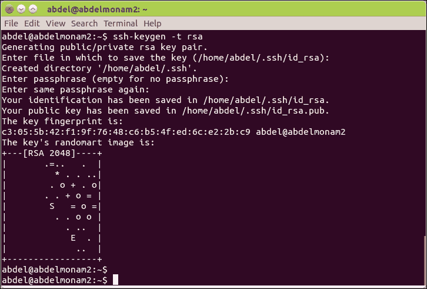
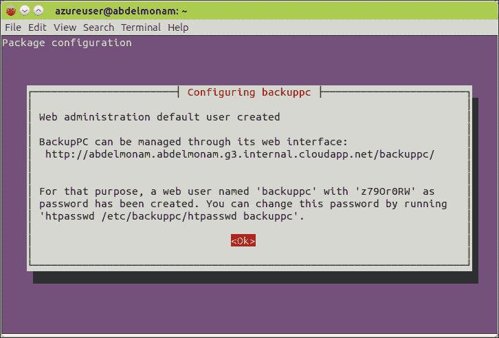
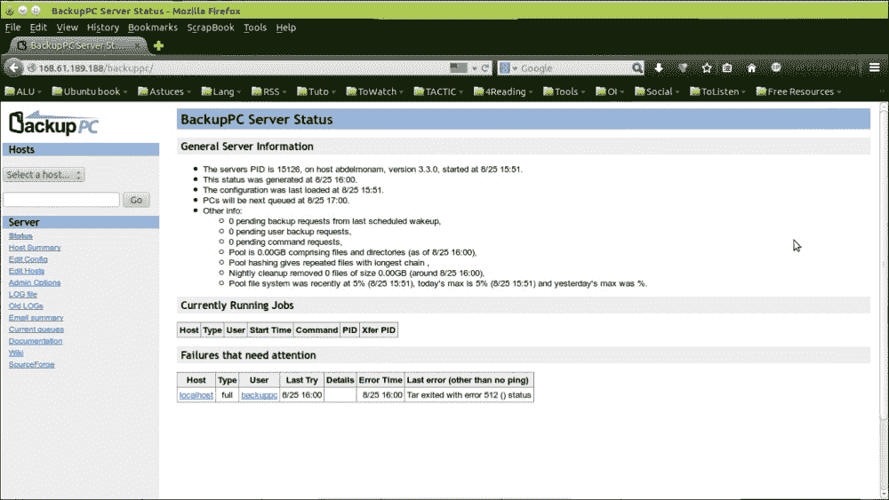

# 第四章：Ubuntu 的安全性

在计算机服务器领域，安全性是一个非常热门的主题。这就是为什么 Ubuntu Server 非常重视它。在本章中，我们将看看如何激活、配置和增强许多安全方面。本章将分为以下三部分：

+   为 Ubuntu Server 获得基本的安全级别

+   深入了解如何配置高级安全设置

+   执行整个 Ubuntu Server 的备份/恢复程序

# 基本安全设置

首先，让我们看看如何为 Ubuntu Server 设置基本的安全级别。安全领域有一句话叫做*安全是一个过程，而不是一个产品*。这意味着，尽管你的供应商可能告诉你，你不能通过某个应用程序或软件解决所有的安全问题。相反，只有当你开始遵循好的安全原则并制定良好的安全流程时，才能实现真正的安全。这正是我们在本节中将主要讨论的内容。

## 用户管理

在本小节中，你将了解关于用户管理的最佳实践，涉及不仅仅是用户创建、修改和删除，还包括组分配、权限和其他许多细节。

### 用户账户管理

以下是设置和管理用户账户时需要的最有用的命令：

+   `useradd`：此命令将作为参数传递的用户添加到本地身份验证系统。

+   `usermod`：此命令修改作为参数传递的用户属性。

+   `userdel`：此命令正确删除系统中作为参数传递的用户。

+   `passwd`：此命令修改作为参数传递的用户密码。

我们可以为这些命令添加一些选项，这些选项会列出并详细说明——例如，在`useradd-`的情况下，可以通过`man useradd`或`useradd --help`来查看。

### 提示

存在一个`adduser`命令，也允许你创建新用户。`useradd`和`adduser`的区别取决于 Linux 发行版。例如，对于 Fedora/Centos/Gentoo，`adduser`只是指向`useradd`的符号链接。但在我们的例子中，在 Debian 或 Ubuntu 系统上，`useradd`是命令本身，你可以使用它来创建用户并为这些用户定义选项。另一方面，`adduser`是一个 Perl 脚本，它使用`useradd`来创建账户，并会询问你密码、全名、电话号码和其他信息。可以说，在这种情况下，它为你简化了操作。

以下是创建新用户时需要考虑的最重要选项，尤其是出于安全原因：

+   `-m`：在创建需要创建的用户的主目录时使用此选项。如果不使用此选项，你将需要手动创建新目录、更改其所有权和权限，使其符合用户需求，将默认的文件和目录放入主目录中，然后通过使用`usermod`命令和`-d`选项，将默认的目录和文件分配给主目录。

+   `-e date`：用于设置用户的过期日期。过了这个日期，系统将自动禁用该用户的账户。如果需要为服务器创建临时用户时，可以使用此选项。即使你忘记删除它们，系统至少会锁定他们的账户。

+   `-G groups`：此选项用于设置用户的组成员资格。将服务器用户按组分类，并为每个组设置特定的参数和权限是良好的安全实践。

### 提示

每个用户都有一个唯一的 ID，即 UID 变量。在 Ubuntu 中，普通用户的 UID 从*1,000*开始，低于*500*的值保留给具有特定值的系统账户；UID 变量*0*保留给 root 用户。通常情况下，UID 是唯一的，但在有一种情况你可能想要给多个用户分配相同的 UID——即当你想创建一个备份的 root 用户时。为了做到这一点，你需要在创建用户时使用`-o`选项或使用`-u 0`选项与`useradd`命令结合使用。

### 密码管理

密码是**操作系统**（**OS**）的安全钥匙之一。在 Ubuntu 服务器中，密码通过使用`passwd`命令进行管理。普通用户可以使用它来更改密码，而管理员则可以用它来更改其他普通用户的密码。不仅如此，`passwd`命令还具有其他一些重要功能，如以下这些，对于系统安全的维护非常有用：

+   通过使用`-l`选项，管理员可以暂时锁定用户账户。稍后可以通过使用`-u`选项解锁账户。

+   可以通过使用`-S`选项来报告特定用户账户的密码状态。

+   用户可以通过使用`-e`选项，在下次登录时强制更改密码。

+   设置密码在再次更改之前必须使用的最小天数，通过`-n min_days_number`选项进行设置。此选项有助于防止用户在密码过期后立即将密码更改回原来的密码。

+   你可以设置密码的最大使用天数。完成这个周期后，用户必须更改密码。通过使用`-x max_days_number`选项来完成此操作。

+   你可以通过`-c notif`选项通知用户密码即将过期；该选项的参数是以天为单位的通知期。

+   您还可以设置用户账户的自动过期时间，如果一段时间内没有活动，则账户将过期。此时间以天为单位，并作为`-i exper`选项的参数传递。

与密码管理和用户登录相关的一些额外安全功能可以在`/etc/login.defs`文件中找到并进行修改。以下是这些参数中最重要的几个：

+   `FAIL_DELAY`：此参数设置系统在登录失败后等待的时间（以秒为单位），然后再提示用户重新输入密码。默认情况下，它是*3*秒。通过在此设置适当的值，我们可以阻止**暴力破解攻击**。

+   `LASTLOG_ENAB`：这是一个布尔值。当设置为*1*时，表示此功能已启用。启用此功能后，系统将在`/var/log/lastlog`文件中记录所有成功的登录记录。`lastlog`文件必须存在才能使此功能生效。如果不存在，您可以通过使用`touch /var/log/lastlog`命令来创建它。

+   `PASS_MIN_LEN`：此参数包含新密码必须使用的最小字符数。

### 权限设置

权限是操作系统登录过程后的第二道安全屏障。与其他 Linux 服务器一样，Ubuntu 拥有强大且完善的权限结构。在本节中，我们将介绍两个主要概念——文件所有权和操作权限（读/写/执行）。

#### 文件所有权

每个 Ubuntu 服务器上的文件都有所有者（用户）和组所有者（通常是用户的主组）。在某些情况下，管理员可能需要由于某些原因（如一般的安全原因）更改文件的所有权。为此，我们需要调用`chown`或`chgrp`命令。

对于`chown`，命令的模式如下：

```
chown [OWNER][:[GROUP]] file

```

以下是几个该命令的示例：

+   `chown one_user some_file`：此命令将`some_file`的所有者更改为`one_user`。

+   `chown one_user:one_group some_file`：此命令不仅执行了前面命令的操作，还将文件的组更改为`one_group`。

我们也可以使用`chown`来仅更改组所有权。一个例子是`chown .one_group some_file`。不要忘记在组名之前的（.）字符，这里组名是`one_group`。注意我们最近开始使用冒号字符（`:`）；` .`和`:`都能完成这项工作。

对于组所有权，还有一个替代命令，即`chgrp`命令。它的使用示例是`chgrp one_group some_file`。请注意，在组名之前我们不需要` .`字符，这里组名是`one_group`。

### 注意

默认情况下，`chown`和`chgrp`命令的作用范围仅限于它们所使用的文件或目录。如果您希望递归使用这些命令，只需添加`-R`选项。例如，`chown -R one_user some_dir`会将`one_user`用户设置为`some_dir`及其所有子目录中文件的所有者。

#### 配置权限

操作权限有三种类型，分别是**读**（**r**符号或值为**4**）、**写**（**w**符号或值为**2**）和**执行**（**x**符号或值为**1**）。这些权限可以分别应用于**所有者用户**（**u**）、其**主用户组**（**g**）成员和**其他用户**（**o**）。我们还可以对**所有用户**（**a**）应用权限。设置这些权限的方法有两种：

+   **特定用途**：此功能用于配置特定文件的特定权限。通过使用`chmod`命令来完成此操作。

+   **通用用途**：用于配置新创建文件的默认权限分配。通过使用`umask`命令来完成此操作。

### 提示

还有一些额外的特殊权限，称为**特殊权限**，即**SUID**、**SGID**和**粘滞位**。这些内容超出了本书的范围，您可以在高级 Linux 管理指南中进一步探讨。

对于`chmod`工具，您可以使用以下两种模式：

+   相对模式：这种模式与绝对模式相似，后者将在下一节中详细介绍，可以一次性设置大量权限变更。但当您需要一次仅添加或删除一个权限时，它更加实用且方便。当使用`chmod`的相对模式时，您需要指定要授予权限的实体（u、g、o、a），然后是授予符号（`+`表示添加，`-`表示删除，`=`表示设置权限）以及您希望应用的权限（r、w、x）。例如，`chmod g+w some_file`命令将向实体组添加`some_file`文件的写权限。我们来看另一个例子，通过使用`chmod u+rwx,g+rx-w,o+r-wx another_file`模式，我们一次性设置多个权限，其中将所有权限授予用户，向组添加`read`和`execute`权限并移除`write`权限，同时仅向其他用户添加`read`权限并移除`write`和`execute`权限。

+   绝对模式：这种模式提供了一种简短而方便的方式来设置权限，特别是当您需要一次修改多个权限时。在此模式下，我们使用数字值来定义权限。权限值由四个数字组成。第一个数字表示特殊权限（本书不涉及，之前的注释中有解释）。除非您需要使用此权限，否则可以省略该数字（小心，因为它可能有危险）。其余的数字按从左到右的顺序分别表示与用户、组和其他用户相关的权限。每个实体的值是通过将与每个权限相关的值相加来计算的（r=4，w=2，x=1）。例如，`chmod u+rwx,g+rx-w,o+r-wx another_file`命令的等效命令应为`chmod 754 another_file`。

对于`umask`工具，它是**用户文件创建模式掩码**。它决定了创建新文件时所设置的默认权限。`umask`参数以数字值表示，该值从可以自动设置的最大权限中减去；文件的最大权限是*666*，目录的最大权限是*777*。`umask`中使用的数字顺序与`chmod`命令相同；最左边的数字是针对用户的，第二个数字是针对组的，第三个数字是针对其他人的。默认情况下，`umask`设置为*022*，这为所有新创建的文件提供*644*权限，为所有新创建的目录提供*755*权限。

`umask`设置可以为所有用户或单独的用户进行更改。如果您希望为所有用户设置`umask`值，必须确保在`/etc/login.defs`配置文件中输入`umask`设置（以前是在`/etc/profile`文件中输入的，但现在已更改为`/etc/login.defs`）。另一方面，如果您希望仅对特定用户应用特定的`umask`设置，则必须编辑该用户主目录下的配置文件，并在其中设置所需的`umask`值。

## 对用户帐户应用配额

用户配额是服务器的另一层安全防护。它们允许管理员对用户和组的文件和目录创建应用配额限制。

要使用此功能，您需要执行以下步骤：

1.  首先，安装`quota`软件。可以使用`sudo apt-get install quota`命令完成此操作。

1.  其次，准备文件系统以支持配额。为此，您需要在`/etc/fstab`文件中的选项列中，为每个希望使用配额的文件系统添加`usrquota`选项（如果要对用户应用配额）或`grpquota`选项（如果是对组应用配额）。然后，通过使用以下命令，重新挂载所有已应用配额的分区：

    ```
    sudo mount -o remount <partition_name>

    ```

1.  接下来，初始化配额软件。初始化配额系统的最佳方法是运行`sudo quotacheck -augmv`命令，这将创建`aquota.user`和`aquota.group`文件，以列出所有实际用户的配额信息。

1.  最终，实际的工作是为用户和组设置配额。这是通过`edquota`命令完成的。例如，`sudo edquota -u <username>`命令会在文本编辑器中为该用户打开一个临时的配额文件。该文件包含六个数字，指定了服务器上所有文件系统的配额。第一个数字表示当前用户所使用的块数量。第二个数字是该块数量的软限制，而第三个数字是硬限制。第五个和第六个数字是 inode 的对应值，几乎等同于该用户在文件系统上能创建的文件数量。第一个和第四个数字用于记录此用户当前使用的块和 inode 数量。

1.  设置完配额后，你需要使用`sudo edquota -t`命令来设置你想使用的宽限期（可以是小时或天数）。宽限期是按文件系统设置的。因此，没有选项可以为不同的用户指定不同的宽限期设置。

### 提示

初始化步骤是为新用户设置配额时的必需步骤；它确保新用户被配额系统识别。

设置配额后，监控它是很有用的。你可以使用`repquota`命令来做到这一点。使用`-aug`选项时，命令会显示所有用户和组在所有卷上的当前配额设置。

最后，在设置完配额后，别忘了通过运行`/etc/init.d/quota start`命令来启动配额服务。

设置一个用户的配额后，你可能想将其应用到其他用户。你可以使用`edquota -p`命令，而不是为系统上所有用户遵循相同的程序。例如，`sudo edquota -p user1 user2`会将当前应用于`user1`的配额复制到`user2`。

### 提示

`edquota`命令仅对块（blocks）有效，而不是字节、千字节或其他单位。因此，为了正确设置配额，你需要知道当前使用的块大小。要查找此块大小，可以使用`sudo dumpe2fs <device> | grep "Block size"`命令。

# 使用 sudo 配置管理任务

Ubuntu 通过一些默认的实践来提高默认安装的安全性。其做法之一是禁用 root 账户，并使用`sudo`来获得超级用户权限。与传统的 su 程序相比，`sudo`程序提供了一套更为强大的功能来提升用户权限。

`sudo`命令的配置文件位于`/etc/sudoers`。默认情况下，Ubuntu 提供了一个基本文件，允许 root 用户以任何其他用户的身份执行任何操作，并允许 admin 组成员成为 root 用户（在安装时创建的用户会自动被添加到此组）。

`sudo`软件包提供了一个叫做`visudo`的工具，任何时候你想修改文件时都应该使用它。因此，要查看和编辑`/etc/sudoers`文件，可以输入以下命令：

```
sudo visudo

```

你想使用`visudo`的原因是它会自动检查你的`sudoers`文件是否存在错误。由于`sudoers`文件中的错误可能会导致你无法访问 root 权限，因此这个语法检查非常重要。如果你确实犯了错误，`visudo`会在你保存设置并退出页面后告诉你。这样，你可以选择回去修复错误、不保存并退出，或者忽略警告并保存（这不推荐）。

### 注意

为了最佳地编辑文件和管理`sudo`程序，最简单的方法是阅读并遵循手册页面中的示例。你可以通过`man sudoers`命令访问它。

## 配置 AppArmor 工具

默认情况下，Ubuntu Server 安装的 AppArmor 系统为特定的系统服务添加了访问控制，旨在增强服务器的安全性。AppArmor 基于最小权限的安全原则。它为每个程序分配一系列规则，定义了该程序可以处理的一组文件和目录，并解释如何处理这些文件（`只读`或`读写`）。当一个由 AppArmor 管理的应用程序违反这些访问控制时，AppArmor 会介入，阻止它这样做，并记录该事件。默认情况下，有大量的服务包含了 AppArmor 配置文件，并且每个 Ubuntu 版本都会添加更多的服务。除了默认的配置文件，宇宙仓库中还有一个`apparmor-profiles`软件包，你可以安装它来为其他服务添加更多的配置文件。一旦你学会了 AppArmor 规则的语法，你甚至可以添加自己的配置文件。

了解 AppArmor 如何工作的最佳方式是通过使用一个示例程序。MySQL 数据库服务器是一个在 Ubuntu 下由 AppArmor 自动管理的程序。因此，一旦安装了 MySQL 软件包，你可以使用`aa-status`程序查看 AppArmor 已经在管理它，如下所示：

```
sudo aa-status
apparmor module is loaded.
7 profiles are loaded.
7 profiles are in enforce mode.
 /sbin/dhclient
 /usr/lib/NetworkManager/nm-dhcp-client.action
 /usr/lib/NetworkManager/nm-dhcp-helper
 /usr/lib/connman/scripts/dhclient-script
 /usr/sbin/mysqld
 /usr/sbin/named
 /usr/sbin/tcpdump
0 profiles are in complain mode.
3 processes have profiles defined.
3 processes are in enforce mode.
 /sbin/dhclient (945)
 /usr/sbin/mysqld (6288)
 /usr/sbin/named (13679)
0 processes are in complain mode.
0 processes are unconfined but have a profile defined.

```

在这里，你可以看到`/usr/sbin/mysqld profile`已加载，并且处于强制模式，当前正在运行的`/usr/sbin/mysqld process`（PID *6288*）正由 AppArmor 管理。

AppArmor 将其配置文件存储在`/etc/apparmor.d/`目录下，每个文件名来源于它们管理的二进制文件。例如，`/usr/sbin/mysqld`的配置文件位于`/etc/apparmor.d/usr.sbin.mysqld`。如果你查看文件内容，你将了解 AppArmor 配置文件如何工作以及它们提供什么样的保护：

```
cat /etc/apparmor.d/usr.sbin.mysqld
# vim:syntax=apparmor
# Last Modified: Tue Jun 19 17:37:30 2007
#include <tunables/global>

/usr/sbin/mysqld {
 #include <abstractions/base>
 #include <abstractions/nameservice>
 #include <abstractions/user-tmp>
 #include <abstractions/mysql>
 #include <abstractions/winbind>

 capability dac_override,
 capability sys_resource,
 capability setgid,
 capability setuid,

 network tcp,

 /etc/hosts.allow r,
 /etc/hosts.deny r,

 /etc/mysql/** r,
 /usr/lib/mysql/plugin/ r,
 /usr/lib/mysql/plugin/*.so* mr,
 /usr/sbin/mysqld mr,
 /usr/share/mysql/** r,
 /var/log/mysql.log rw,
 /var/log/mysql.err rw,
 /var/lib/mysql/ r,
 /var/lib/mysql/** rwk,
 /var/log/mysql/ r,
 /var/log/mysql/* rw,
 /var/run/mysqld/mysqld.pid rw,
 /var/run/mysqld/mysqld.sock w,
 /run/mysqld/mysqld.pid rw,
 /run/mysqld/mysqld.sock w,

 /sys/devices/system/cpu/ r,

 # Site-specific additions and overrides. See local/README for details.
 #include <local/usr.sbin.mysqld>
}

```

文件的语法非常简单。首先是文件或目录路径，其后是允许的权限。还支持通配符。例如，`/etc/mysql/**` 会递归地应用到`/etc/mysql`目录下的所有文件。一个单独的`*`会将文件应用到当前目录下的文件。

修改 AppArmor 配置文件后，应重新加载 AppArmor 守护程序以使更改生效。您可以通过以下命令执行此操作：

```
sudo /etc/init.d/apparmor reload

```

在 AppArmor 中，有两种模式，即**enforce**和**complain**。在**enforce**模式下，AppArmor 会积极阻止程序违反其配置文件的尝试。在**complain**模式下，AppArmor 只是记录这些尝试，但允许它们发生。您可以使用`aa-enforce`和`aa-complain`程序轻松地将配置文件设置为 enforce 或 complain 模式。

例如，如果您想要将 MySQL 的 AppArmor 配置文件从 enforce 模式更改为 complain 模式，则此配置文件可以在配置文件中执行读取和写入而无需限制，但只会记录这些操作。我们只需要运行以下命令：

```
sudo aa-complain /usr/sbin/mysqld
Setting /usr/sbin/mysqld to complain mode.

```

在进行此更改后，我们可以检查 AppArmor 的状态，方法如下：

```
sudo aa-status
apparmor module is loaded.
7 profiles are loaded.
6 profiles are in enforce mode.
 /sbin/dhclient
 /usr/lib/NetworkManager/nm-dhcp-client.action
 /usr/lib/NetworkManager/nm-dhcp-helper
 /usr/lib/connman/scripts/dhclient-script
 /usr/sbin/named
 /usr/sbin/tcpdump
1 profiles are in complain mode.
 /usr/sbin/mysqld
3 processes have profiles defined.
2 processes are in enforce mode.
 /sbin/dhclient (945)
 /usr/sbin/named (13679)
1 processes are in complain mode.
 /usr/sbin/mysqld (6288)
0 processes are unconfined but have a profile defined.

```

### 注意

要使用`aa-complain`和`aa-enforce`程序，您首先需要使用以下命令安装`apparmor-utils`软件包：

```
sudo apt-get install apparmor-utils

```

如果您想临时禁用 AppArmor（例如，出于调试目的，以检查某些进程是否按预期工作，以及您是否尝试确定`apparmor`配置文件是否是问题的原因或其他原因），只需运行以下命令：

```
sudo /etc/init.d/apparmor stop
[ ok ] Stopping apparmor (via systemctl): apparmor.service.

```

请注意，运行上述命令只会清除配置文件的缓存。如果您需要卸载配置文件，则需要运行以下命令：

```
sudo /etc/init.d/apparmor teardown
 * Unloading AppArmor profiles [ OK ]

```

# 高级安全配置

在这一部分，我们将探讨一些在生产环境中大多数 Ubuntu 服务器上都需要的高级安全设置，特别是当它们包含关键服务时。这些高级配置非常重要，因为它们直接影响除 Ubuntu 服务器本身以外的服务行为。

## SSH 安全增强

按定义，SSH 是一种安全通信协议，但我们可以应用一些额外的增强措施来进一步提升安全性。

让我们从默认的 Ubuntu SSH 配置开始。`/etc/ssh/sshd_config`文件非常安全，因为它允许使用身份验证密钥、使用权限分离并且只允许 SSH 协议 2。唯一值得怀疑的设置是**PermitRootLogin** `yes`，该选项定义了允许 root 用户通过 SSH 登录的选项。在我们的例子中（默认安装的 Ubuntu Server），这个设置是无用的，因为 root 账户已被禁用，但如果你想启用 root 账户，你可能需要将此选项设置为 no，并运行`sudo service ssh reload`来保存设置。通过这些步骤，你强制用户使用常规账户登录，如果需要 root 权限，他们可以执行`sudo up`命令来获取 root 权限。这也可以防止用户猜测 root 密码并获得访问权限。

SSH 的另一个重要安全增强是使用基于密钥的身份验证而不是密码。这项功能可以保护你的服务器免受暴力破解攻击。基于密钥的身份验证工作原理非常简单。它基于用户生成的一对密钥（一个公钥和一个私钥）。然后，公钥被放置在远程服务器的一个特殊文件中，私钥则必须保存在用户本地，并且不能与他人共享。当用户登录时，这些密钥将用于身份验证，而不是密码。通过这种方法，用户还可以更加舒适地工作，因为他们可以在不每次输入密码的情况下登录到自己的机器。然而，如果你希望增加额外的安全层，你还可以在你的密钥上设置密码短语。

设置基于密钥的身份验证相对简单。在本例中，我们有一个名为`abdel`的用户，他想在名为`abdelmonam1`的服务器上设置密钥身份验证，且这台计算机的名称为**abdelmonam2**。第一步是在`abdelmonam2`上使用`ssh-keygen`程序创建 RSA 公钥和私钥。在每次提示时，你可以按*Enter*键接受默认设置，如下截图所示：



脚本将在你的主目录下的`.ssh`目录中创建密钥，在本例中是`/home/abdel/.ssh`。私钥和公钥分别命名为`id_rsa`和`id_rsa.pub`。如果你选择了空的密码短语，保持私钥（`id_rsa`）的安全非常重要！如果有人获得了这个文件的访问权限，他们可以复制它并能够登录到你设置了这个密钥的机器上。

一旦你创建了密钥，下一步是将`id_rsa.pub`密钥复制到服务器上，然后将其附加到`~/.ssh/authorized_keys`文件中。有多种方法可以做到这一点。自动化方法涉及使用以下命令：

```
ssh-copy-id -i ~/.ssh/id_rsa.pub <username>@<ipaddress>

```

一种手动的方法是通过 SSH 登录到远程机器，使用文本编辑器打开 `~/.ssh/authorized_keys`，并粘贴 `id_rsa.pub` 的内容。

一旦你在机器上设置好密钥，除非你为密钥设置了密码短语，否则应该能够登录而无需密码提示。如果是后者，你将需要输入密码短语。在你的密钥正常工作后，你可能想要完全禁用 SSH 密码认证。只要确保你的 SSH 密钥正常工作，否则你可能会锁定自己！要禁用密码认证，编辑 `/etc/ssh/sshd_config` 文件，找到包含 `#PasswordAuthentication yes` 的行。取消该行的注释并将其设置为 no，如下所示：

```
PasswordAuthentication no

```

最后，运行 `sudo service sshd reload` 来加载新的更改。

### 提示

默认情况下使用 *2048 位* 密钥。你可以使用 `-b` 标志将其增加到 *4096 位*（增加位数可以使密钥更难通过暴力破解方法破解），如下所示：

```
ssh-keygen -t rsa -b 4096

```

另一种防止 SSH 暴力破解攻击的方法，特别是当由于某些原因无法禁用密码认证时，是使用 `denyhosts` 包。这个包会监控失败的 SSH 登录。当一个主机尝试以不存在的用户身份登录，或多次尝试失败时，该主机会被添加到 `/etc/hosts.deny` 中，并阻止未来的 SSH 访问。

## 配置防火墙

保护网络中机器的一种常见方法是使用防火墙。本质上，防火墙使你能够限制对网络服务的访问。例如，使用防火墙，你可以将对 SSH 的访问限制为仅允许来自内部网络的主机访问，同时允许每个人访问 HTTP 服务。

历史上，Linux 中的防火墙规则需要通过一组冗长且复杂的 `iptables` 命令来设置（也称为 `iptables` 规则）。这种复杂性是一个弱点，因为主要的安全原则之一是以简单的方式处理事务。幸运的是，对于 Ubuntu 管理员来说，现在有一个名为 `ufw` 的更简单工具，旨在通过提供 `iptables` 命令的前端来简化防火墙管理。

`ufw` 程序默认安装在 Ubuntu Server 上，但它是禁用的；你需要在添加规则之前启用它。

`ufw` 的基本命令集非常简单。如果你运行 `ufw -h`，你将得到一个帮助页面，描述了主要的 `ufw` 命令；但如果你想查看完整的语法信息，可以输入 `man ufw` 阅读完整的手册页。首先，让我们识别主要命令，然后看一些示例：

+   你可以通过使用 `sudo ufw enable` 和 `sudo ufw disable` 来分别启用和禁用 `ufw`。

+   使用 `sudo ufw status` 检查 `ufw` 的状态；相同的命令将列出所有规则，以防 `ufw` 被启用。

+   你还可以设置防火墙的默认策略。你需要考虑的一个非常重要的命令是`default`命令。该命令定义了防火墙的默认策略，例如，所有数据包是否默认被允许或拒绝。普遍的共识是，防火墙如果默认拒绝所有数据包，然后根据需要启用服务，通常会更安全。这样，在你启动一个新服务时（或者更糟的是，一个用户启动了一个服务），如果你忘记为其设置防火墙规则，它将会被默认阻止。因此，为了默认拒绝所有数据包，请输入`sudo ufw default deny`。要默认允许所有数据包，请输入`sudo ufw default allow`。请注意，除非你更改设置，否则`ufw`默认会拒绝所有数据包。

+   你可以配置日志功能来追踪任何被阻止的内容以及任何违反默认策略的内容。要启用日志记录，请输入`sudo ufw logging on`，要禁用日志记录，请输入`sudo ufw logging off`。

+   一个基本的`ufw`规则接受端口或服务作为参数。要打开端口 53（用于 DNS 服务器），你需要运行`sudo ufw allow 53`。

+   `ufw`命令还接受在`/etc/services`文件中定义的服务名称，而不是特定的端口。如果你查看`/etc/services`文件，你会发现端口 53 的 TCP 和 UDP 都设置为域名服务。因此，另一种表达该规则的方式是`sudo ufw allow domain`。

+   你还可以指定传输协议。举个例子，`sudo ufw allow 53/udp`。

+   你也可以设置允许访问服务器的特定子网。以下是一个命令示例，用于将 Web 访问（端口 80）限制为仅*192.168.1.0*网络：

    ```
    sudo ufw allow proto tcp from 192.168.1.0/24 to any port 80

    ```

+   即使你默认拒绝所有数据包，也可能会遇到需要添加拒绝规则的情况。例如，假设你正在运行一个外部的 SMTP（电子邮件）服务器，并且发现你网络内部的某台主机（IP 地址为*192.168.1.111*）似乎感染了病毒，并且正在向你的电子邮件服务器发送大量无效的消息。为了阻止该 IP 地址，你可以执行以下命令：

    ```
    sudo ufw deny proto tcp from 192.168.1.111 to any port 25

    ```

+   如果你希望阻止来自该主机的所有数据包，而不仅仅是 SMTP，你就不需要定义 proto 和 to 参数：

    ```
    sudo ufw deny from 192.168.1.111

    ```

+   稍后，一旦病毒被清除并且主机恢复正常，你可以通过以下命令删除该规则：

    ```
    sudo ufw delete deny proto tcp from 192.168.1.111 to any port 25

    ```

+   或者，如果你已经丢弃了来自该主机的所有数据包，以下命令将会删除该规则：

    ```
    sudo ufw delete deny from 192.168.1.111

    ```

### 提示

当你通过 SSH 连接时，使用`ufw`要小心，因为启用`ufw`并使用默认的拒绝所有数据包的操作会关闭你的 SSH 连接并隔离你的服务器。在你开始配置`ufw`并在启用它或添加任何其他规则之前，最好的做法是添加以下规则：

```
sudo ufw allow ssh

```

现在，让我们来看几个示例：

+   对于 DNS 服务器，我们需要允许 DNS 数据包并拒绝其他数据包，当然在允许 SSH 后，最后启用 `ufw` 并检查其状态。以下是命令的顺序，顺序很重要，务必注意：

    ```
    sudo ufw allow ssh
    sudo ufw allow domain
    sudo ufw default deny
    sudo ufw enable
    sudo ufw status

    ```

+   以下是另一个示例，展示了我们拥有多个服务的情况。这是一个 web 服务器，一般来说，我们应该允许 `http (80)` 和 `https (443)` 访问：

    ```
    sudo ufw allow ssh
    sudo ufw allow www
    sudo ufw allow https
    sudo ufw default deny
    sudo ufw enable
    sudo ufw status

    ```

# 备份与恢复

本章中我们看到的工具和流程允许我们提升服务器安全级别并增强防御攻击的能力，但如果我们正遭受攻击怎么办？在某些情况下，我们可以调查并清理系统，但在大多数情况下，既没有足够的时间，也没有足够的手段来完成此操作，最好的解决方案是恢复一个健康的备份镜像。备份和恢复过程不仅可以解决与攻击相关的问题，还可以解决因人为错误或物理事故（如服务器机房火灾）导致的数据丢失问题。

在接下来的部分中，你将学到如何使用多种工具和多种方法进行 Ubuntu Server 的备份/恢复。

## 备份原则

在选择备份策略时，有一些原则应当遵循。大多数这些原则是常识，但值得反复强调：

+   将你的数据备份到独立的系统

+   测试你的备份

+   RAID 不能替代备份

+   创建完整的增量备份计划

+   决定备份的频率

+   存档你的备份

## 磁盘镜像

镜像是驱动器的完整逐位复制。因此，一旦你对驱动器进行镜像，你将得到一个与原始驱动器完全相同的镜像。

### 注意

在镜像驱动器时，重要的是该驱动器不能在使用中。如果在镜像过程中驱动器发生变化，你将无法确保镜像的一致性。所以，请确保驱动器上的文件系统已卸载。

Ubuntu Server 使用经典的 UNIX 镜像工具 `dd`。其工作过程简单——它逐位读取输入文件并逐位复制到输出文件。如果你有两个大小相同的驱动器，比如 `/dev/sda` 和 `/dev/sdb`，使用以下命令将 `sda` 镜像到 `sdb`：

```
sudo dd if=/dev/sda of=/dev/sdb

```

`dd` 工具也可以处理文件作为输入和输出参数，而不是驱动器。因此，将目标镜像到文件而非驱动器会更好，这样我们就可以将其轻松复制到便携设备如 USB 驱动器中，或发送到远程文件服务器。

例如，如果你想将 `sda` 分区备份到 `/media/myUSB/` 下的 USB 驱动器中的镜像文件中，你只需执行以下命令：

```
sudo dd if=/dev/sda of=/media/myUSB/sda-image.img

```

要恢复此镜像，只需交换这两个参数。以下是恢复之前两个示例的命令：

```
sudo dd if=/dev/sdb of=/dev/sda
sudo dd if=/media/myUSB/sda-image.img of=/dev/sda

```

你也可以对单个分区进行镜像。这是有用的，因为你可以轻松地挂载镜像回环并读取它们。首先，让我们对 `/dev/sda` 上的分区进行镜像，步骤如下：

```
sudo dd if=/dev/sda1 of=/media/myUSB/sda1-image.img

```

现在，您可以创建一个名为`/mnt/temp`的目录，并使用循环挂载选项来挂载此镜像，如下所示：

```
sudo mkdir /mnt/temp
sudo mount loop /media/myUSB/sda1-image.img /mnt/temp

```

当您只需要从镜像中恢复几个文件时，这非常方便。您可以像浏览其他文件系统一样浏览`/mnt/temp`，并从中复制单个文件或整个目录。

我们可以通过 SSH 直接将给定驱动器的镜像备份到远程服务器。例如，要将`/dev/sda`从本地机器通过网络传输到*192.168.1.200*并将镜像转储到`/media/MyBackupData/sda-image.img`，可以输入以下代码：

```
sudo dd if=/dev/sda | ssh username@192.168.1.200 \
"cat > /media/MyBackupData/sda-image.img"

```

要恢复此镜像，请使用以下代码：

```
ssh username@192.168.1.200 "cat /media/MyBackupData/sda-image.img" \ sudo dd of=/dev/sda

```

## 数据库备份

大多数情况下，备份一个系统就像创建其文件的副本一样简单。然而，在数据库系统中，事情并不那么简单。数据库通常不会立即将更改提交到磁盘。因此，如果您仅仅复制数据库文件，数据库本身可能处于不一致的状态。当您恢复它时，无法保证它是一个未损坏的副本。

解决这个问题的方法是使用数据库自带的工具，提供一个一致的数据库转储，将其保存到一个可以备份的文件中。在接下来的部分，您将学习如何在 Ubuntu 中使用 MySQL 数据库的工具。类似的步骤也适用于其他数据库，具体取决于它们自己的转储工具。

MySQL 用来创建数据库备份的工具叫做**mysqldump**。这个工具将整个数据库或多个数据库转储到屏幕上。大多数人然后将输出重定向到一个文件，或者将其通过管道传输给像 gzip 这样的工具进行压缩。例如，如果您的用户有一个名为`mySite`的数据库，下面是备份方法：

```
mysqldump mySite > mySite_backup.sql

```

如果您希望在转储数据库的同时进行压缩，可以在中间加上`gzip`管道，如下所示：

```
mysqldump MySite | gzip > MySite_backup.sql.gz

```

现在，如果您想要备份多个数据库，有两种主要的方法。第一种方法是使用`--databases`参数，后面跟上需要备份的数据库列表，数据库之间用空格分隔。另一种方法是使用`--all-databases`参数，这将备份所有内容，如下所示：

```
mysqldump --all-databases > all_databases_backup.sql

```

如果您为 MySQL 用户设置了密码，您需要通过`-u`和`-p`选项来提供密码，以使此命令生效。例如，对于具有`mySecret`密码的 root 用户，请运行以下命令：

```
mysqldump --all-databases -u root -pmySecret \ > all_databases_backup.sql

```

上述命令将备份所有数据库，因为 root 用户使用的是不安全的密码。我给出这个例子只是想说明，虽然这个选项有效，但它是不安全的。原因是，所有参数的完整列表，包括密码，都可以通过运行`ps`命令的系统用户看到。更好的方法是使用`-p`而不指定密码：

```
mysqldump --all-databases -u root -p \ >
all_databases_backup.sql

```

当你指定`-p`但不提供密码时，`mysqldump`会像`mysql`命令一样提示你输入密码。这提供了良好的安全性，但当然也意味着你必须手动输入密码。大多数备份 MySQL 数据库的人都会设置一个`cron`任务在晚上自动执行。MySQL 推荐的解决方法是将密码添加到执行备份的用户的`~/.my.cnf`文件中的客户端部分。如果你还没有`~/.my.cnf`文件，可以创建一个新的，并在其中添加以下内容：

```
[client]
password=mypassword

```

将`mypassword`替换为你的用户用来登录的密码。一旦你设置好这个文件，就不再需要指定`-p`选项了，因为`mysqldump`会从这个文件中获取密码。这里的缺点是密码以明文文件的形式存储在系统中。所以，你需要设置文件权限，以确保只有你的用户可以查看它：

```
chmod 400 ~/.my.cnf

```

要在 MySQL 上恢复备份，使用`mysql`命令行工具并指向你的备份。例如，要将`mySite`数据库备份到`mySite_backup.sql`，执行以下命令：

```
mysql mySite < mySite_backup.sql

```

如果你备份的是多个数据库，只需执行以下命令：

```
mysql < multiple_database_backup.sql

```

要恢复所有数据库，你需要以 root 用户身份登录。如果你设置了 root 密码，必须使用`-p`选项（除非你设置了`.my.cnf`文件，在这种情况下可以省略`-p`），如下所示：

```
mysql -u root -p < all_databases.sql

```

## 备份工具

我们可以使用很多备份工具来备份并轻松恢复 Ubuntu Server。有些使用 CLI，有些使用 GUI；有些是免费的，其他则需要付费许可。它们还根据备份模式有所不同，备份模式可以是**完全备份**（工具备份备份目标中的所有文件）、**增量备份**（工具备份自上次备份以来所有已更改的文件）或**差异备份**（工具备份自上次完全备份以来所有已更改的文件）。

下面是一些知名工具的比较：

| 工具名称 | 界面 | 备注 |
| --- | --- | --- |
| **Areca Backup** | GUI | 这是一个出色的备份软件，可以本地使用或通过 FTP 工作，使用 Java 编写，具有非常直观的 GTK 图形界面，并提供完全恢复和文件搜索的功能。 |
| **Bacula** | GUI | 这是一个专业的开源备份软件。它可以备份单台计算机或多网络计算机的内容。Bacula 有很多功能，但需要你具备一定的备份知识。 |
| **BackInTime** | GUI | 这是一个非常简单的备份工具，适用于 Linux。备份通过对一组目录进行“快照”来完成。目前，有两个可用的 GUI，分别是 Gnome 和 KDE。该解决方案是少数几个能够通过 SSH 将文件保存到远程服务器并以加密形式存储的工具之一。一旦存储，您可以毫不担心数据的安全性，将文件保存到专用服务器上。 |
| **BackupPC** | GUI | 这是一个非常强大的工具，可以用于备份多个客户端（Linux 或 Windows）。BackupPC 用于保存一组机器。它具有一个网页界面，可以配置和启动备份或恢复文件。它还可以备份数据库。BackupPC 可以定期自动保存网络计算机上的目录。它还可以做更多的事情。 |
| **Déjà Dup** | GUI | 这是一个简单的备份工具，是 duplicity 的图形界面工具。它允许您在本地目录、服务器（SSH/FTP/HTTP）或云端创建备份。它还允许您加密保存的文件并安排自动备份。 |
| **LuckyBackup** | GUI | 这是一个简单的工具，具有 rsync 的强大功能，且界面友好。它提供简单模式或高级模式、恢复、模拟、远程操作、超级用户模式、配置文件和计划等功能。 |
| **SBackup** | GUI | 这是一个简单易用且功能强大的工具。它允许您执行增量备份，但不支持差异备份。 |
| **Backup-Manager** | CLI | 使用此工具，备份文件会保存在本地档案中，并可以导出到服务器（FTP、SSH、rsync 等），或刻录到 CD/DVD 上。 |
| **Duplicity** | CLI | 该工具通过创建 TAR 压缩包并使用 GnuPG 加密来执行备份。然后，将这些压缩包发送到本地或远程备份目录。支持的远程协议包括 FTP、SSH/SCP、Rsync、WebDAV/WebDAVs 和 Amazon S3。 |
| **Rsync** | CLI | Rsync（用于远程同步）是一个文件同步软件。它通常用于实现远程备份系统。Rsync 是单向同步，这意味着它通过传输已修改文件的字节，将源数据（本地或远程）同步、复制或更新到目标位置（本地或远程）。 |
| **Unison** | CLI | Unison 是一个同步软件。与 Rsync 不同，它显示双向同步。 |

还有一些专门用于分区克隆的备份工具。以下是两种 Ubuntu 系统中非常有名的工具：

| 工具名称 | 界面 | 备注 |
| --- | --- | --- |
| **Clonezilla** | GUI | 这是 Norton Ghost 或 Acronis True Image 的免费等效工具。它允许您创建硬盘或分区的镜像备份，并进行恢复。 |
| **Partclone** | CLI | 它用于备份分区。它某种程度上是 Norton Ghost 的等效工具。可以将其安装在 `live usb` 上以保存您的系统。 |

现在，让我们以一个强大的备份工具**BackupPC**为例。要安装它，你需要运行以下命令：

```
sudo apt-get install backuppc

```

系统会要求你提供一些关于邮件服务器（postfix）和你希望使用的 Web 服务器的信息（在我们的案例中，是 Apache），如下图所示。最后，你将收到一条消息，指出管理 BackupPC 所需的 URL 和登录系统所需的凭证：



为了激活新配置，你需要运行以下命令：

```
sudo service apache2 restart

```

然后，你可以通过使用消息中给出的 URL，或者服务器 IP 地址后跟`/backuppc/`，通过网页浏览器开始使用 BackupPC。系统会要求你输入登录凭证，如下图所示。输入凭证后，你将看到一个易于使用且文档非常丰富的界面：



### 注意

你可以在[`help.ubuntu.com/community/BackupPC`](https://help.ubuntu.com/community/BackupPC)找到更多关于如何在 GUI 和 CLI 模式下使用 BackupPC 的信息。

# 总结

本章我们专注于一个与 Ubuntu Server 相关的重要主题，即安全管理。我们覆盖了 Ubuntu Server 内的基本和高级安全功能，并探讨了如何利用这些功能提高系统的安全性。接着，我们概览了 Ubuntu Server 的备份/恢复操作。

在下一章中，我们将集中讨论当今最热门的 IT 话题之一——基于 Ubuntu Server 的虚拟化和云计算。
