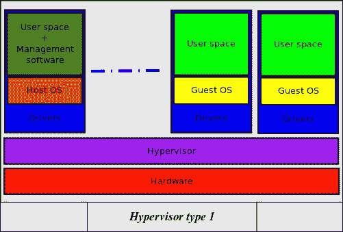
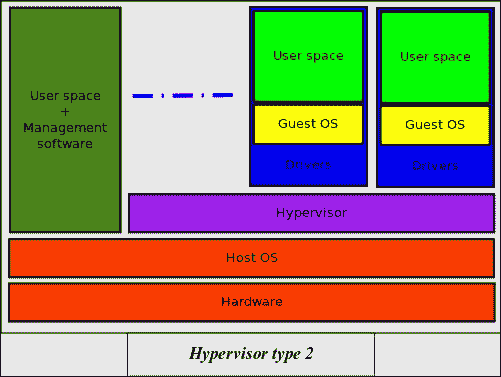
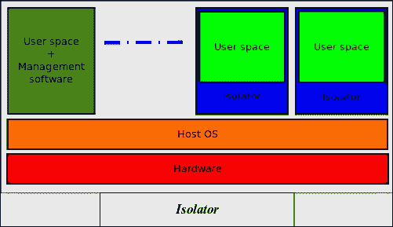
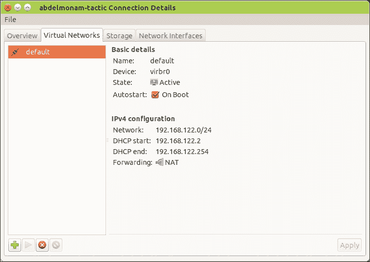
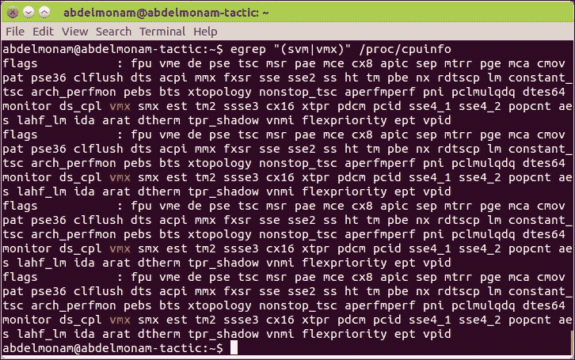
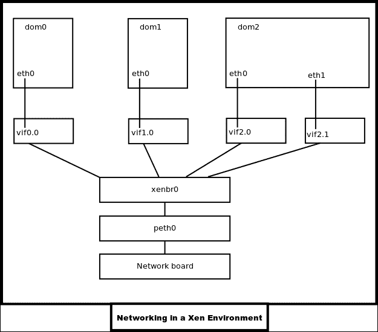

# 第五章：Ubuntu Server 中的虚拟化与云计算

虚拟化和云计算是目前系统管理社区中的一些热门话题。它们为系统管理员提供了在同一硬件上运行更多服务器的可能性，并以可靠的方式使用资源。已经基于虚拟化的云概念提供了更多的好处，尤其是在安全性和新兴的商业模式，如 SaaS、PaaS 和 IaaS 方面。

Ubuntu 提供了一套优秀的虚拟化和云计算平台。在本章中，我们将了解 Ubuntu Server 如何处理一些最知名的平台：

+   在第一部分，我们将重点介绍虚拟化。我们将了解如何管理三大虚拟化程序，即 KVM、XenServer 和 Docker。

+   在第二部分，我们将介绍 Ubuntu Server 提供的云计算功能。

# 虚拟化

在 Ubuntu Server 下有多种不同的虚拟化技术可用。在这一部分中，我们将了解虚拟化概念及其不同的技术和方法。然后，我们将学习一些最受欢迎的虚拟化程序，如**基于内核的虚拟机**（**KVM**）、XenServer 和 Docker，每个技术中选取一个程序进行研究。

## 虚拟化介绍

虚拟化用于在一台或多台计算机/服务器上作为简单软件运行一个或多个操作系统/应用程序，而不是每台计算机只能安装一个操作系统。这些**虚拟机**被称为**虚拟机**、**环境**，甚至是**虚拟环境**。**操作系统**（**OS**）的虚拟化是一种技术，使你能够在单台计算机上同时运行多个操作系统，仿佛它们在独立的计算机上工作一样。

## 虚拟化的好处

虚拟化有几个优点。以下是它的一些好处：

+   你可以在不重新启动计算机的情况下使用不同的操作系统来运行那些在 Ubuntu 上原生不兼容的程序。

+   你还可以使用与 Ubuntu 不兼容但可以与其他操作系统兼容的设备。

+   你可以在操作系统下进行测试，而不会危及稳定的环境。

+   你还可以在受控、隔离和安全的环境中进行软件测试。

+   你可以使用运行在具有兼容虚拟机监控器的计算机上的虚拟机将操作系统从一台计算机传输到另一台计算机。

个人和**中小型企业**（**SMEs**）/ **中小型工业**（**SMIs**）通常更关心同时运行两个不同操作系统，以便运行与一个虚拟机监控器兼容但与另一个不兼容的软件。大型公司越来越多地使用虚拟化技术来节省服务器机房空间、简化安装、便于在发生故障后重新启动，当然，还能开发安全可靠的业务网络。

## 虚拟化的不同技术

虚拟化概念的主要方面是一个叫做**虚拟机管理程序**（Hypervisor）的实体。虚拟机管理程序是用于创建和运行虚拟机的软件、固件或硬件。运行虚拟机管理程序的机器称为主机机器，每个在虚拟机管理程序上运行的虚拟机称为客户机。在本节中，我们将看到两种类型的虚拟机管理程序。除了虚拟机管理程序外，还有一个虚拟化概念的主要组成部分，它有多个名称。有些人称其为**隔离器**，而其他人则称之为**容器**、**虚拟化引擎**，甚至是**操作系统级虚拟化**。在我们的案例中，我们将其称为隔离器。我们将在本节中探讨它以及两种虚拟机管理程序类型。

### 类型 1 虚拟机管理程序

这种类型的虚拟机管理程序也叫做**本地虚拟机管理程序**或**裸机虚拟机管理程序**。它直接运行在主机的硬件上，直接处理硬件并管理客户操作系统。这种类型的虚拟机管理程序的一个例子是**XenServer**。

我们可以通过使用以下架构来进行建模：



### 类型 2 虚拟机管理程序

这种类型的虚拟机管理程序也叫做**托管虚拟机管理程序**。它像其他任何软件一样在主机操作系统上运行。它为客户系统提供硬件级别的仿真。这种类型的虚拟机管理程序的一个例子是**Oracle VirtualBox**。

### 注意

一些虚拟化程序，如 KVM，无法轻松地归类为这两种类型之一。**KVM**是一个内核模块，它将主机操作系统转化为类型 1 虚拟机管理程序，但与此同时，主机操作系统始终作为通用操作系统运行，并运行其他与虚拟机资源竞争的应用程序。因此，KVM 也可以归类为类型 2 虚拟机管理程序。

我们可以通过使用以下架构来建模类型 2 虚拟机管理程序：



### 一个隔离器

隔离器是用于将应用程序的执行隔离在所谓的上下文或执行区域中的一段软件。隔离器允许你在多实例模式下多次运行相同的应用程序（多个执行实例），即使该应用程序并未为此设计。这种解决方案非常高效，因为系统开销较小（系统用于做更多事情而不仅仅是管理自身的时间）。需要注意的是，虚拟化环境并非完全隔离。性能始终是一个关键因素。然而，我们无法真正谈论操作系统虚拟化。我们可以通过使用以下架构来进行建模：



## 针对虚拟化的不同方法

在开始虚拟化项目之前，必须了解该领域的两种主要方法——**完全虚拟化**和**半虚拟化**。XenServer 和 KVM 都提供这两种方法。因此，你需要非常清楚它们之间的区别，这也是我们将在接下来的章节中解释的内容。

### 半虚拟化

半虚拟化方法需要对客户操作系统进行修改，使其生成特定的指令，这些指令可以被虚拟机监控程序轻松处理，虚拟机监控程序只需解释并将其传递给物理硬件。

在这种情况下，客户操作系统知道自己是虚拟化的。因此，它将生成最适合在虚拟环境中使用的指令，而无需先进行翻译。

### 完全虚拟化

另一种方法是完全虚拟化，它允许你将未修改的操作系统作为客户操作系统。它的一个缺点是需要特殊的硬件支持，这通常是现代 CPU（包括 AMD 和 Intel 处理器）提供的一个特性。由于服务器 CPU 中内置了这种支持，完全虚拟化的机器可以高效地运行，尽管来自虚拟化操作系统的指令首先需要被虚拟机监控程序翻译。

## KVM（基于内核的虚拟机）

在本节中，我们将了解 Ubuntu 实际支持的默认虚拟化技术。名为 **KVM**（**基于内核的虚拟机**），这种虚拟化技术是一种免费软件，已内置于 Linux 内核中。该软件利用了英特尔和 AMD 处理器内置的虚拟化支持，允许你在单个主机上运行多个不同的操作系统和发行版作为 **虚拟机**（**VMs**）。

### 前提条件

在开始安装过程之前，你应该验证计算机是否支持虚拟化。要检查这一点，你需要运行 `kvm-ok` 命令，它是 `cpu-checker` 包的一部分。因此，你首先需要安装该包，然后使用以下代码调用该命令：

```
sudo apt-get install cpu-checker
sudo kvm-ok

```

然后，检查结果并验证你得到了以下结果：

```
INFO: Your CPU does not support KVM extensions
KVM acceleration can NOT be used

```

这意味着你应该寻找另一台计算机。然而，你也许会看到类似这样的信息：

```
INFO: /dev/kvm does not exist
HINT: sudo modprobe kvm_intel
INFO: Your CPU supports KVM extensions
KVM acceleration can be used

```

或者，你可能会看到类似这样的内容：

```
INFO: /dev/kvm exists
KVM acceleration can be used

```

这意味着你可以继续进行到下一部分。

### 注意

有时候你的 CPU 支持虚拟化，但你可能会看到一条消息说它无法支持。在这种情况下，大多数时候，虚拟化在 BIOS 中被禁用。因此，你需要从 BIOS 中启用它。你所需要做的就是重启计算机并使用适当的功能键进入 BIOS（启动后屏幕上会显示几秒钟；通常你需要按 *F12*）。在出现的 BIOS 屏幕中，寻找类似 CPU 或性能的选项并选择它。然后，寻找一个虚拟化选项，如 **Intel 虚拟化技术**，并启用它。保存更改并重启计算机。

### 配置 KVM 网络

有两种主要方式可以用来为虚拟机设置网络。默认的网络设置提供一个位于 *192.168.122.0/24* 的私有网络，DHCP 服务器会分配剩余的 IP 地址。或者，你也可以为虚拟机设置静态 IP。KVM 主机的 IP 是 *192.168.122.1*。虚拟机通过此网关使用 **NAT**（**网络地址转换**）与外界通信。这种方式很好，尤其适合桌面上的虚拟机，但既然我们在讨论服务器，我猜测你希望 KVM 主机外的机器能够与虚拟机通信。虽然你当然可以设置一些 iptables DNAT 规则并转发流量回去，但这种解决方案扩展性较差。真正的解决方案是设置桥接网络，这样虚拟机就会显示在与主机相同的网络上。

在 Ubuntu 上设置 `br0` 桥接接口相对简单。本质上，你需要识别你希望桥接流量的接口（可能是 `eth0`，如果你设置了绑定，可能是 `bond0`），将其所有配置转移到 `br0`，并添加一些额外的桥接选项，然后将原接口设置为手动模式。当你看到示例时，这会更容易理解。假设我为 `eth0` 设置了 DHCP，而我在 `/etc/network/interfaces` 中的旧配置如下：

```
auto eth0
iface eth0 inet dhcp

```

然后，我的新配置将如下所示：

```
auto eth0
iface eth0 inet manual
auto br0
iface br0 inet dhcp
bridge_ports eth0
bridge_fd 9
bridge_hello 2
bridge_maxage 12
bridge_stp off

```

### 注意

要了解更多关于 Ubuntu Server 上网络桥接的信息，你可以访问 [`help.ubuntu.com/community/NetworkConnectionBridge`](https://help.ubuntu.com/community/NetworkConnectionBridge)。

请注意，我将 `eth0` 的 `inet` 模式从 `dhcp` 更改为 `manual`。如果 `eth0` 配置了静态 IP，我可以直接将配置转移到 `br0`。让我们看一下以下配置：

```
auto eth0
iface eth0 inet static
address 192.168.0.5
network 192.168.0.0
netmask 255.255.255.0
broadcast 192.168.0.255
gateway 192.168.0.1
```

这将会进入以下配置：

```
auto eth0
iface eth0 inet manual
auto br0
iface br0 inet static
address 192.168.0.5
network 192.168.0.0
netmask 255.255.255.0
broadcast 192.168.0.255
gateway 192.168.0.1
bridge_ports eth0
bridge_fd 9
bridge_hello 2
bridge_maxage 12
bridge_stp off

```

一旦我配置了 `/etc/network/interfaces` 文件以设置桥接，我就可以使用以下命令重启网络：

```
sudo /etc/init.d/networking restart

```

### 注意

要了解更多关于在 Ubuntu Server 上进行 KVM 高级网络配置的信息，你可以查看社区页面 [`help.ubuntu.com/community/KVM/Networking`](https://help.ubuntu.com/community/KVM/Networking) 和官方的 Ubuntu 文档 [`wiki.ubuntu.com/KvmWithBridge`](https://wiki.ubuntu.com/KvmWithBridge)。

### KVM 安装

要执行 KVM 虚拟化，除了 KVM 之外，还需要安装一些额外的软件。以下软件组件需要添加：

+   `libvirt`：提供虚拟化硬件的接口

+   `qemu`：模拟 PC 硬件到虚拟机

+   `bridge-utils`：提供一种方式通过主机桥接虚拟机的网络

要安装 KVM 虚拟化所需的基本软件，可以运行以下命令：

```
sudo apt-get install libvirt-bin kvm bridge-utils qemu-common qemu-kvm qemu-utils

```

请注意，要管理这一组程序，你将主要使用**命令语言解释器**（**CLI**）命令。如果你想使用 GUI 来管理虚拟机，可以使用著名的`virt-manager`图形软件。请注意，你需要安装图形环境，或者通过使用`-X`选项的 SSH 连接到服务器。还有另一种解决方案——在安装有图形环境的另一台台式机/笔记本电脑上安装`virt-manager`，然后使用以下命令通过它远程管理虚拟机：

```
virt-manager -c qemu+ssh://root@your-server-ip-or-name/system

```

要安装`virt-manager`，执行以下命令：

```
sudo apt-get install virt-manager

```

安装了`virt-manager`后，你现在可以选择通过图形界面或命令行管理虚拟机。接下来，你需要确保你想用来管理虚拟化的用户帐户已配置好。

### 注意

完成安装过程后，你应该使用以下命令将希望管理`libvirtd`组虚拟化的用户添加到该组中：

```
sudo adduser <user_name> libvirtd

```

最后，重启你的服务器，作为用户登录，并检查虚拟化服务是否正在运行。此时，你可以开始管理虚拟环境。

### 管理虚拟机

如果你想使用`virt-manager`图形工具管理虚拟环境，只需运行`virt-manager`命令，你将获得一个直观、易用的 GUI。你可以通过编辑**编辑**菜单下的**首选项**子菜单来进行自定义。你还需要通过**编辑**菜单检查连接详情，以自定义高级设置，如网络和存储，如下图所示：



然后，你可以开始创建和管理虚拟机；这非常简单且直观。

另一方面，如果你选择使用 CLI 工作，你应该掌握可以与主要虚拟化命令一起使用的选项。首先，你可以使用`virt-install`命令来安装虚拟机。使用`virt-clone`，你可以克隆一个现有的虚拟镜像。要管理虚拟机，你可以使用`virsh`命令列出虚拟机的信息，并启动、停止或重启它们。

请注意，在使用`virt-install`创建虚拟机之前，你需要先创建存储镜像。可以通过使用`qemu-img`命令来实现。例如，以下命令将在`/media/Data`目录下创建一个名为`ubuntuserver`、类型为`qcow2`的 20GB 存储镜像：

```
sudo qemu-img create -f qcow2 /media/Data/ubuntuserver.qcow2 20G

```

完成此步骤后，你可以创建虚拟机。下面是一个创建 Ubuntu 虚拟机的`virt-install`命令行示例。此命令包含了你在`virt-manager`窗口中需要点击或填写的许多选项。请注意，此命令还包含了我们在本节之前通过`qemu-img`命令创建的镜像：

```
virt-install --connect qemu:///system --name ubuntu_server15.04 \
--ram 1024 --disk path=/media/Data/ubuntuserver.qcow2,format=qcow2 \
--network=bridge:virbr0,model=virtio --vnc --os-type=linux \
--cdrom /media/Data/ISOs/ ubuntu-15.04-server-amd64.iso \
--noautoconsole --keymap=en-us

```

要查看可以与`virt-install`命令一起使用的每个选项的含义（以及更多内容），你需要查阅`virt-install man`页面（输入 man `virt-install`）。

一旦`virt-install`命令开始执行，你可以打开桌面上的一个应用程序来查看安装进度。`virt-manager`和`virt-viewer`命令是你可以用来查看虚拟机控制台的命令之一。虚拟机安装完成后，你可以使用`virsh`命令来管理虚拟机。

`virsh`命令提供了一种管理虚拟机的好方法，特别是在虚拟机创建之后。你可以使用`virsh`查看哪些虚拟机正在运行。然后，你可以启动、停止、暂停以及以其他方式管理它们。还有许多替代`virsh`命令的方式可以用来管理虚拟机。有关详细信息，请参考`virsh man`页面（输入`man virsh`）。

## XenServer

我们将讨论的第二个虚拟化平台是著名的**XenServer**。自 7.10 版本起，XenServer 开始支持 Ubuntu Server，但从 8.04 版本起，Canonical 决定将 KVM 作为 Ubuntu Server 中的默认虚拟化解决方案。

在本节中，我们将讨论如何将 Ubuntu Server 设置为 Xen 虚拟化的主机。我们还将学习如何在 Xen 环境中安装客户端。在开始本节的动手操作之前，让我们先了解一下 Xen 的术语。在 Xen 中，主机操作系统和客户操作系统之间没有区别。这是因为“主机”和“客户”这两个词暗示着一种层级关系，但这种关系并不存在（请参阅本章第一节中描述的类型 1 虚拟化管理程序模型）。因此，Xen 使用“域”来表示。存在**domain 0**操作系统（可以与其他虚拟化技术中的主机操作系统进行比较）以及其他操作系统（可以与客户操作系统进行比较）。

这些其他操作系统被称为**domain U**机器。**domain 0**操作系统（或简称**dom0**）是第一个加载到物理机器上的操作系统，在 Xen 环境中承担着特定的职责，包括驱动程序管理。**domain U**（或简称**domU**）机器是虚拟化的机器，它们没有与虚拟化相关的特殊职责。

### 先决条件

Linux 支持的硬件也可用于 Xen（只要与内核兼容）。默认情况下，Xen 支持所有经过修改以在其内运行的操作系统，这被称为半虚拟化。Xen 也通过硬件虚拟化支持未经修改的操作系统，这被称为完全虚拟化。然而，在这里我们必须使用支持硬件虚拟化的 CPU（Intel VT 和 AMD-V）。验证这一点有多种方法。例如，我们可以检查`/proc/cpuinfo`文件中为 CPU 设置的标志。通过使用`egrep`命令，我们可以搜索该文件，查找 Intel-VT 支持（vmx）或 AMD-V 支持（svm），使用以下命令：

```
egrep "(svm|vmx)" /proc/cpuinfo

```

此命令的输出如下图所示：



另一种检查此点的方法是使用`xm dmesg`命令，查看与 Xen 虚拟化相关的所有功能概览，如下所示：

```
sudo xm dmesg | grep VMX
(XEN) HVM: VMX enabled
(XEN) VMX: MSR intercept bitmap enabled

```

如果没有结果，说明你的 CPU 不支持虚拟化，这意味着你不能虚拟化未修改的操作系统。

### 安装 XenServer

在 Ubuntu 上安装 XenServer 非常简单。你只需要运行以下命令：

```
sudo apt-get install xen-hypervisor

```

然后，重启系统并从**GRand Unified Bootloader**（**GRUB**）中选择包含 XenServer 的启动项。

重启后，检查是否使用了正确的内核。运行`sudo uname -a`命令，验证结果中是否包含`xen`。同时，使用`sudo xm list`命令验证`dom0`是否已经启动。

验证网络是否配置正确。`ifconfig`命令必须至少返回三个接口，即`lo`（回环系统）、`eth0`（不再是网络接口，而是`domU`的图像的桥接）和`peth0`（网络接口）。如果不是这种情况，请编辑`/etc/xen/xend-config.sxp`文件，确保以下行未被注释：

```
(network-script network-bridge)
(vif-script vif-bridge)

```

修改完此脚本后，别忘了使用以下命令重启 Xen 守护进程：

```
service xend restart

```

`Xen`守护进程负责虚拟网络基础设施管理。

### XenServer 环境中的网络概念

Xen 有一个与其他虚拟环境不同的特定网络环境。每个域（从`dom0`开始）都有自己的虚拟驱动程序，作为网络卡使用；它们简单地命名为`eth0`、`eth1`等。在`dom0`操作系统中，你会发现这些虚拟驱动程序的逻辑表示（逻辑接口），其名称遵循`vifx.y`的模式，其中`x`表示虚拟化操作系统的 ID（**U**代表**domU**），而`y`表示虚拟化网络板的编号（从 0 开始）。

例如，`dom0`中的第一个网络卡（`eth0`）由`vif0.0`表示，`dom3`中的第二个网络卡（`eth1`）由`vif3.1`表示，依此类推。

继续探索这个概念，在`dom0`系统中，所有的`vif`接口都连接到虚拟桥接（称为`xenbr0`），它表现得像一个真实的交换机。接下来，这个桥接与`peth0`通信，`peth0`是物理网络卡的表示，最终与服务器中的网络板直接通信。以下图像是所有这些如何组织的图形表示：



### 注意

创建虚拟网络后，你必须在`/etc/modules`文件中添加`max_loop=64`行。这是强制性的，因为你需要确保可以为虚拟机创建足够的虚拟磁盘。重启系统以确认这个新设置有效，然后才能开始创建虚拟机。

### 管理虚拟机

与 KVM 类似，XenServer 也可以通过图形界面（GUI）或命令行界面（CLI）进行管理。对于 GUI，有许多工具可供选择。以下是其中的一些工具：

+   **Virt-manager**：我们在 KVM 部分已经看过了这个工具。如果您希望创建和管理 XenServer 虚拟机，它非常好用。

+   **OpenXenManager**：这是一个专门用于管理 Xen 的图形界面（GUI）。您可以使用以下命令安装它：

    ```
    sudo apt-get install openxenmanager

    ```

+   **XCP 项目 Kronos**：**XCP**代表**Xen Cloud Platform**。要安装此项目，您必须将`ppa:ubuntu-xen-org/xcp1` PPA 添加到源列表中（请参见第二章，*配置和管理 Ubuntu 服务器*，了解如何操作），然后更新软件包列表，最后运行`sudo apt-get install xcp-storage-managers`。

+   **xen-tools**：您可以使用以下命令安装此工具：

    ```
    sudo apt-get install xen-tools

    ```

在本节的后续部分，我们将重点讨论 CLI 工具。实现这一目标的原生方法是使用像`dd`这样的工具创建存储映像，如在第四章，*安全与 Ubuntu*部分中讨论的那样。接下来，您需要为客户系统创建一个配置文件，其中包含客户系统使用的所有设置（如 RAM、硬盘等），然后使用以下命令基于该`config`文件创建虚拟机：

```
sudo xm create -c <path_to_the_conf_file>

```

`xm create`命令也可以在没有`config`文件的情况下使用，如下所示：

```
sudo xm create /dev/null ramdisk=initrd.img \
kernel=/boot/vmlinuz-2.6.12.6-xenU \
name=ramdisk vif='' vcpus=1 \
memory=64 root=/dev/ram0

```

如果您希望使用`xm`，`xm`手册包含了许多有用的信息。在开始使用`xm`之前，可以先阅读一下。

## Docker 简介

Docker 是一个著名的程序，它自动化并简化了在软件容器内部署应用程序和服务的过程。它是最好的工具之一，属于隔离器类别（请参见本章的第一部分）。Docker 基于操作系统级虚拟化的附加抽象和自动化层（也称为隔离器）。从 Ubuntu Server 14.04 版本开始，它得到了支持。根据一家行业分析公司 451 Research 的说法：

> *“Docker 是一个可以将应用程序及其依赖项打包到一个虚拟容器中的工具，这个容器可以在任何 Linux 服务器上运行。这有助于提高应用程序的灵活性和可移植性，无论是在本地、公共云、私有云、裸金属等环境中。”*

### Docker 工作原理

如前所述，隔离器提供了一个环境（容器）来隔离运行的进程。这正是 Docker 通过实现一个高级 API 来轻量化地完成的，API 使用 Linux 内核提供的资源隔离功能（如内核命名空间、cgroups 等），使得不同的容器可以在同一个 Linux 实例中运行。

与虚拟机不同，Docker 容器不需要单独的操作系统。相反，它使用资源隔离（CPU、内存、块 I/O、网络等）来隔离应用程序对操作系统的视图。Docker 可以通过两种方式访问 Linux 内核的虚拟化功能。第一种方式是直接使用 `libcontainer` 库，自 Docker 0.9 版本起就已经提供。第二种方式是间接使用一系列工具，如 `libvirt`、`systemd-nspawn` 和 **LXC**（**Linux 容器**）。

容器使用带来的资源隔离和服务限制提供了几乎完全私有的操作系统视图。因此，每个容器都有自己的进程 ID 空间、文件系统结构和网络接口。通过为每个容器添加一些额外的约束，限制它们仅使用特定数量的资源（如 CPU、内存和 I/O），我们可以限制共享相同内核的多个容器的缺点。

使用 Docker 进行容器管理将简化分布式系统的设置以及新节点的部署，这为 **平台即服务**（**PaaS**）模式开辟了新的时代。

### 安装 Docker

对于 Ubuntu Server 14.04 及更高版本，Docker 已包含在主 Ubuntu 仓库中。因此，安装 Docker 只需运行以下命令：

```
sudo apt-get install docker.io

```

对于旧版本，你需要在执行安装命令之前更新你的源列表。这个操作可以通过以下步骤完成：

1.  创建一个名为 `/etc/apt/sources.list.d/docker.list` 的文件，并在其中放入以下行：

    ```
    deb http://get.docker.io/ubuntu docker main

    ```

1.  然后，使用以下命令下载 GPG 密钥并安装 `lxc-docker` 包：

    ```
    sudo apt-key adv --keyserver hkp://keyserver.ubuntu.com:80 \ --recv-keys 36A1D7869245C8950F966E92D8576A8BA88D21E9
    sudo apt-get update
    sudo apt-get install lxc-docker

    ```

### 提示

如果你不想每次 Docker 命令都使用 `sudo`，可以通过以下命令将用户添加到 Docker 组：

```
sudo addgroup user docker

```

安装完成后，你需要像启动其他普通服务一样，通过以下命令启动 Docker：

```
service docker start

```

### 使用 Docker

作为一个例子，我们将看看如何使用 Docker 与 LAMP 容器。但首先，让我们探讨一些后续理解不同操作时所需要的术语：

+   **DockerFile**：这是一个源文件，包含配置文件的指令。

+   **Image**：这是一个 `DockerFile` 的编译，用来构建一个可以部署的便携镜像。

+   **Container**：这是镜像的执行过程，简单来说，就是用来运行镜像的进程。

现在，让我们进入实际操作部分。

首先，对于镜像，你可以准备自己的镜像，或者直接下载社区构建的现成镜像。你可以通过访问 [`hub.docker.com/explore/`](https://hub.docker.com/explore/) 网站，或通过 CLI 使用以下命令来搜索它们：

```
docker search lamp

```

您将得到一个长列表的镜像。您需要选择自己的镜像。在此示例中，我们选择了`reinblau/lamp`镜像。要安装此镜像，您只需运行以下命令：

```
docker pull reinblau/lamp

```

此命令将下载并安装此镜像。完成此步骤后，需要在容器中运行它。可以通过使用`docker run`命令来实现，该命令可以接受一些参数，例如 LAMP 案例中使用的端口 NAT：

```
docker run -d -p 80:80 -p 3306:3306 reinblau/lamp

```

这里，意味着主机的端口`80`将映射到`docker`容器的端口`80`。端口`3306`也是如此。我们可以从 Docker 的仓库页面获取此信息。

在此步骤中，我们可以开始使用在此`docker`容器中运行的 LAMP 服务器。

在`docker`容器中工作时，您将看到类似这样的提示：

```
root@xxxxxx#

```

完成工作后，需要保存对镜像所做的更改。为此，需要运行以下代码：

```
root@xxxxxx# exit
docker commit xxxxxx image_name

```

要列出已安装在机器上的镜像，您需要运行以下代码：

```
docker images

```

要列出容器（运行中的镜像），需要执行以下命令：

```
docker ps -a

```

要获取容器的作业 ID，请执行以下命令：

```
docker run -d container_name

```

当需要通过以下命令停止容器时，此作业 ID 非常有用：

```
docker stop JOB_ID

```

当您想要移除作业 ID 时，使用以下命令：

```
docker rm JOB-ID
docker rm container_id

```

Docker 的一个最佳优势是可以轻松地导入/导出镜像。

要将容器导出为`tar.gz`文件，请执行以下命令：

```
docker export 2520aedc6bc5 > zimbra-after-install.tgz

```

要导入`tar.gz`文件，请执行以下命令：

```
cat zimbra-after-install.tgz  | docker import - zimbra-after-install

```

# Ubuntu Server 的云计算

云计算是 IT 世界中的最新趋势和热门话题，而 Ubuntu Server 是该领域的领先操作系统之一，尤其是其基于 OpenStack 的基础设施，由 NASA、NSA、HP、AT&T、阿尔卡特-朗讯等大公司部署。

在接下来的章节中，我们将探讨可以轻松部署在 Ubuntu Server 上的两个最佳开源云服务——一个用于文件共享，另一个用于 PaaS——以及关于在 Ubuntu 上部署 OpenStack 的最佳部分。

## ownCloud 软件

**ownCloud**软件允许您创建并使用存储服务器并在线共享文件。在接下来的章节中，我们将介绍 ownCloud 软件中使用的技术。

### ownCloud 使用的技术

ownCloud 软件使用 WebDAV 协议，通过 Linux、Windows 或 Mac 上的网络驱动器无缝访问服务器。还有适用于多个平台（Linux、Mac、Windows、Android 等）的同步软件，您可以保持文件的本地副本并离线工作。ownCloud 软件不仅提供文件共享服务，还可以用来管理日历、联系人、书签，甚至音乐。

该项目使用 PHP 开发。因此，它可以安装在许多 Web 服务器上。它不需要诸如 Java 或特定 Web 服务器扩展的功能。

在接下来的部分中，我们将仅介绍 ownCloud 服务器的安装过程。本书不涉及客户端的安装和配置。

### ownCloud 服务器的安装

自从 ownCloud 版本 5.0 发布以来，它的安装变得非常简单。ownCloud 的软件包已为 Ubuntu 支持的版本提供，下载地址为[`download.owncloud.org/download/repositories/stable/`](http://download.owncloud.org/download/repositories/stable/)。

例如，要为 Ubuntu 15.04 安装 ownCloud，请运行以下命令：

```
sudo sh -c "echo 'deb http://download.opensuse.org \
/repositories/isv:/ownCloud:/community/ \
xUbuntu_15.04/ /' >> /etc/apt/sources.list.d/owncloud.list
sudo apt-get update
sudo apt-get install owncloud

```

你可以将仓库密钥添加到`apt`中。请记住，密钥的所有者可能会分发更新、软件包和仓库，你的系统将会信任这些内容。要添加密钥，请运行以下代码：

```
wget –nv \ https://download.owncloud.org/download/repositories/stable/ \ xUbuntu_15.04/Release.key -O Release.key

sudo apt-key add - < Release.key

```

现在你的服务器可以通过`http://<server_ip>/owncloud/`访问。在第一次连接时，你必须创建一个账户。如果服务器提示缺少依赖项，请使用`sudo service apache2 reload`命令重新启动 Web 服务器。

要启用对 Apache 服务器的安全连接（HTTPS），请运行以下命令：

```
sudo a2enmod ssl
sudo a2ensite default-ssl
sudo service apache2 reload

```

现在，通过`https://<server_ip>/owncloud/`登录服务器。从**管理**菜单中，在`https://<server_ip>/owncloud/index.php/settings/admin`页面，勾选**强制使用 HTTPS**选项。

## CozyCloud

CozyCloud 是一个免费的个人云服务器。它专注于与个人数据相关的应用程序和协作应用程序。CozyCloud 是一个个人**PaaS**（**平台即服务**）解决方案，允许你一键部署个人 Web 应用程序。你可以选择现有的 Cozy 应用程序（如 Notes、Todos、Calendar、Contacts、Photos 等），也可以适配现有的 Node.js 应用程序，或者从头开始创建你自己的 Web 应用程序（相关文档和教程在网上可找到）。

### 在 Ubuntu Server 上安装 CozyCloud

首先，在你的机器上使用以下命令安装 Python 和 `pip` 工具：

```
apt-get install python python-pip python-dev \ software-properties-common

```

安装好`pip`工具后，你需要使用以下命令安装`fabric`和`fabtools`：

```
sudo pip install fabric fabtools

```

然后，下载`fabric`文件（这是一个将在你的远程服务器上运行命令的脚本），如下所示：

```
wget https://raw.githubusercontent. \
com/cozy/cozy-setup/master/fabfile.py

```

一旦系统准备好，使用本地机器上的`fabric`脚本启动 Cozy 安装（在你下载的`fabfile`所在的目录运行该脚本）。可以使用以下命令：

```
fab -H <user>@<ip_address> install

```

一旦运行了上述命令，你需要耐心等待片刻。正如你所知，某些命令或应用程序的部署可能需要一些时间，具体取决于你的网络和硬件能力。当安装程序提示时，你需要输入你的设置。

安装完成后，你可以访问`https://<IP_address>:443`来创建主 Cozy 账户。使用 HTTPS 是强制性的。如果你仅使用 HTTP，你将只看到`nginx`欢迎页面。

### 使用 CozyCloud

安装完成后，你可以按照之前的说明通过 HTTPS 访问你的平台。由于这是你第一次登录，你需要注册你的账户（提供电子邮件和密码）。

### 注意

你选择的密码也将成为启用 Cozy 应用程序加密数据库中特定信息的密钥。

然后，你将进入 Cozy 的主页，显示已安装的应用程序。操作类似于智能手机——你进入市场（**标签 + 应用**），并安装现有的应用程序或你构建的应用程序（如果它们已经在 GitHub 仓库中）。

CozyCloud 应用开发的一个重要方面是，Cozy 是一个 PaaS，这意味着应用程序的开发不依赖于 SDK（如 Android 或 iPhone 应用程序）。你可以像往常一样创建一个 Web 应用程序，并将其部署到 Cozy 或其他任何地方！

### 注意

如果你希望编写有关 Cozy 的文档，一个好的起点是 [`github.com/cozy/cozy-setup/wiki`](https://github.com/cozy/cozy-setup/wiki)。该页面包含与开发相关的资源。

## OpenStack

OpenStack 是一款自由软件，允许构建私有和公共云。OpenStack 不仅是软件，还是一个社区和项目，旨在帮助组织实现自己的云。OpenStack 由一系列由社区维护的软件和开源项目组成，其中包括 OpenStack Compute（名为 Nova）、OpenStack Object Storage（名为 Swift）、OpenStack Image Service（名为 Glance）等许多组件，且随着每次新版本发布，组件数量不断增加。

用户主要以**IaaS**（**基础设施即服务**）的方式进行部署。该技术由一组互联的项目组成，这些项目控制着数据中心中处理、存储和网络资源的池，这些资源通过多个工具（如基于 Web 的仪表盘、命令行工具，甚至 RESTful API）由用户进行管理。

Canonical 提供了一个完全集成且优化的最新版本的 Ubuntu Server 和 OpenStack 的组合，允许用户通过 Ubuntu OpenStack 获得最佳的用户体验。根据 2014 年 11 月进行的 OpenStack 用户调查：

> *64% 的生产 OpenStack 云运行在 Ubuntu 上。*

Canonical 提供了一套有用的工具。当与 OpenStack 配合使用时，它们能赋予 OpenStack 更多维度。在本节中，我们将首先介绍这些工具。然后，我们将继续查看如何在 Ubuntu Server 上安装 OpenStack。

### OpenStack 工具

如前所述，Ubuntu 是全球最受欢迎的 OpenStack 操作系统。Ubuntu 提供了一套创新的工具和程序，帮助用户以最简单和最快的方式构建企业级云。

#### Juju

Juju，也意味着魔法，是由 Canonical 主要为云计算开发的服务编排管理工具。Juju 专注于服务。它以一种简单快捷的方式提供软件部署的新概念，并且可以在大量云基础设施上进行集成和扩展。Juju 的主要组成部分之一称为 Charms，可以用任何可以从命令行执行的编程语言编写。

#### MAAS

**Metal as a Service**（**MAAS**）的概念是由 Canonical 创建的，旨在提供一个系统，可以简化设置物理硬件的任务，您可以在其中像 Ubuntu 的 OpenStack 云基础设施一样部署复杂可伸缩的服务。

MAAS 负责准备新节点，安装 Ubuntu 镜像，配置并使其功能正常。此外，它还检查硬件特定的任务，例如烧录测试、固件和 RAID 升级。

MAAS 和 Juju 的组合将通过将旧硬件回收再利用，为您的基础设施的其他部分注入新的生命。

#### Landscape

Ubuntu Server 下的云计算官方管理工具是 Landscape。它是 Ubuntu OpenStack 组合中最强大的工具之一。它是一个功能丰富的基于 Web 的 GUI，允许用户在几分钟内轻松构建其云，实时监控并以最有效的方式进行管理。

#### LXD

LXD，也被称为 Linux 容器超级监控程序，是由 Canonical 提供的下一代超级监控程序。它将容器的密度与虚拟机的可管理性结合在一起。LXD 简化了在联网和安全环境中部署和运行虚拟机的过程，具有高扩展性和互操作性的可能性。

#### Snappy

Snappy 是由 Canonical 提供的基于云的操作系统，基于 Ubuntu Server。它专为**物联网**（**IoT**）设备设计。Snappy Ubuntu Core 与标准 Ubuntu 系统的区别在于，应用程序通过更简单、更快速的机制提供，并且最重要的是，它为应用程序提供了更强大的安全保证，使其成为 Docker 和其他云部署框架的理想选择。

### OpenStack 设置

精通 OpenStack，从其设置、配置和管理，到故障排除和维护，这些都是需要通过数百页的书籍来解释的主题。在本节中，我们没有足够的空间详细介绍所有这些内容。因此，我将尝试让您略知一二。我们将探索在 Ubuntu Server 上两种方式设置 OpenStack 云的主要步骤——手动安装和基于 DevStack 的安装。

### 使用 DevStack 安装 OpenStack

DevStack 是一个脚本，可以快速创建 OpenStack 开发环境，或展示 OpenStack 服务并提供从 CLI 使用它们的示例。它从一个简单的演示工具发展为 OpenStack 安装的一个有用、快速的有效性检查工具。

DevStack 的使命是提供并维护用于从源代码（`git` 仓库的主分支或特定分支）安装中央 OpenStack 服务的工具，适用于开发和操作测试。它还演示并记录了配置和运行服务以及使用命令行客户端的示例。

以下是使用 DevStack 安装 OpenStack 所需的步骤：

1.  安装所选操作系统。在我们的案例中，它是 Ubuntu Server 15.04。

1.  使用以下命令下载 DevStack：

    ```
    git clone https://git.openstack.org/openstack-dev/devstack

    ```

1.  `devstack` 仓库包含一个安装 OpenStack 的脚本和配置文件的模板。

1.  配置你的环境。你可以参考[`docs.openstack.org/developer/devstack/configuration.html`](http://docs.openstack.org/developer/devstack/configuration.html)获取更多细节。

1.  使用以下命令开始安装：

    ```
    cd devstack; ./stack.sh

    ```

执行前面的命令需要几分钟时间。我们建议你在安装过程中阅读前面的脚本。

### 注意

你可以在[`docs.openstack.org/developer/devstack/`](http://docs.openstack.org/developer/devstack/)找到许多指南。

### 手动安装

手动安装实际上是最适合你的，如果你想部署一个真正的云而不仅仅是测试 OpenStack 的功能。我们可以在一台机器上安装云，但 Canonical 建议你至少使用七台机器，每台机器有两块硬盘，并且其中两台必须有两个**网络接口**（**NICs**）。

### 注意

如果你只想在单个 Ubuntu Server 上设置 OpenStack，并且基于 14.04 LTS 或 15.04 版本，可以参考[`fosskb.wordpress.com/2015/04/18/installing-openstack-kilo-on-ubuntu-15-04-single-machine-setup/`](https://fosskb.wordpress.com/2015/04/18/installing-openstack-kilo-on-ubuntu-15-04-single-machine-setup/)的教程。

然而，如果你希望根据 Canonical 的建议建立一个真正的云，以下是一个简要总结，列出了如果你希望在 Ubuntu 服务器上运行自己的 Cloud OpenStack 所需的步骤：

1.  首先，你需要在一台有两个网络接口的机器上安装 Ubuntu Server。然后，你需要设置一个包含所有机器的私有网络，并将网络划分为以下三个逻辑范围：

    +   动态范围将一个 IP 地址映射到每个连接到网络的网络接口卡（NIC）。

    +   静态范围将一个 IP 地址映射到每台连接到网络的机器。

    +   浮动 IP 范围将一个 IP 地址映射到你在云中将拥有的每个实例。

1.  其次，您需要通过以下命令将所需的仓库添加到您的源列表并更新软件包列表：

    ```
    sudo add-apt-repository ppa:juju/stable
    sudo add-apt-repository ppa:maas-maintainers/stable
    sudo add-apt-repository ppa:cloud-installer/stable
    sudo apt-get update

    ```

1.  接下来，如果您想设置 MAAS，您需要运行以下命令：

    ```
    sudo apt-get install maas

    ```

1.  现在，按照以下逐步指令操作：

    +   访问`http://<maas_ip_address>/MAAS/`并按照页面提供的指示创建管理员的配置文件。然后，使用这些凭据登录。

    +   导入 Ubuntu 的磁盘映像。

    +   通过访问`http://<maas_ip_address>/MAAS/account/prefs/`将 SSH 密钥添加到您的用户配置文件中。

    +   复制 MAAS 密钥（稍后需要）。

    +   在为每个网络接口卡（NIC）自动创建的网络中，填写其他详细信息，例如网关和 DNS。

    接下来，您需要配置 MAAS 集群，具体操作如下：

    +   点击**集群**标签并选择**集群主节点**。

    +   您将看到机器上的网络接口列表。点击连接到显示所有节点的私有网络接口旁边的编辑图标。

    +   设置该接口以管理 DHCP 和 DNS。

    +   将路由器 IP 设置为该私有网络的默认网关。

    +   填写动态和静态范围的详细信息；记住您应该为浮动 IP 留出空隙。

    +   保存更改。

    现在，您需要列出并配置机器，具体操作如下：

    +   确保所有机器设置为**预启动执行环境**（**PXE**）启动。如果可能，请在 BIOS 中禁用其他所有启动选项，包括本地磁盘。

    +   通过启动机器来列出它们。这通常可以通过某种虚拟控制台完成。它们将全部出现在 MAAS 的节点列表中，之后可以再次关闭电源。

    +   编辑节点列表中的每台机器，填写电源类型和电源参数（即用户名和密码），以便 MAAS 可以根据需要开启或关闭它们。

    +   选择所有机器，并通过**批量操作**下拉菜单配置它们。

    +   等待直到所有机器都完成配置（即处于`Ready`状态）。

1.  此时，您需要设置`Landscape`并通过以下命令启动 OpenStack 的`自动化`：

    ```
    sudo apt-get install openstack
    sudo openstack-install

    ```

1.  选择**Landscape OpenStack 自动化**选项。

1.  使用在设置 MAAS 时保存的 MAAS 密钥填写 MAAS 凭据。

1.  打开链接以访问 Landscape UI。

1.  解决清单上的剩余问题。最后，点击**配置**按钮。

1.  访问指定的 URL，进入 Landscape UI 的登录页面。

1.  登录页面底部包含一个清单，显示所有资源的状态。验证所有资源是否显示绿色，以确认您的基础设施健康状态。

1.  点击**配置**并为您的区域和云输入一个可选名称。

1.  选择以下组件（这是初步列表；更多选项将在后续版本中添加，前提是它们通过了 OpenStack 互操作性实验室的测试）：

    +   虚拟化组件（KVM）

    +   网络组件（Open vSwitch）

    +   存储组件：

        对象存储（Ceph, Swift）

        块存储（Ceph, iSCSI）

1.  选择需要部署云计算的硬件，并点击**保存选择**。

1.  点击**安装**以构建你的云计算环境。

1.  最后，开始使用你的云计算！

# 总结

在本章中，我们重点介绍了 Ubuntu Server 最有趣的功能之一——虚拟化和云计算。此时，你可以在 Ubuntu 服务器上定义并轻松使用与此主题相关的一整套程序。

在下一章中，我们将发现一些有用的小技巧，帮助 Ubuntu 系统管理员简化工作。
