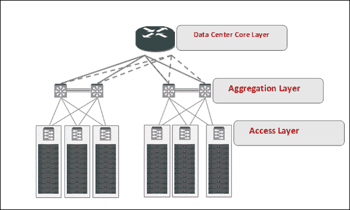
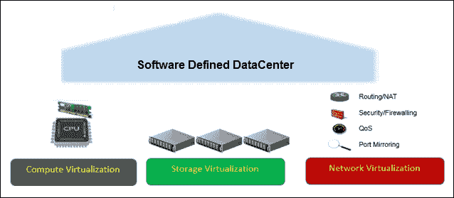
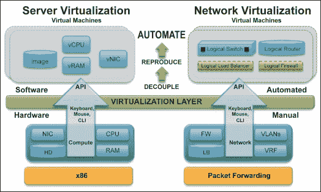
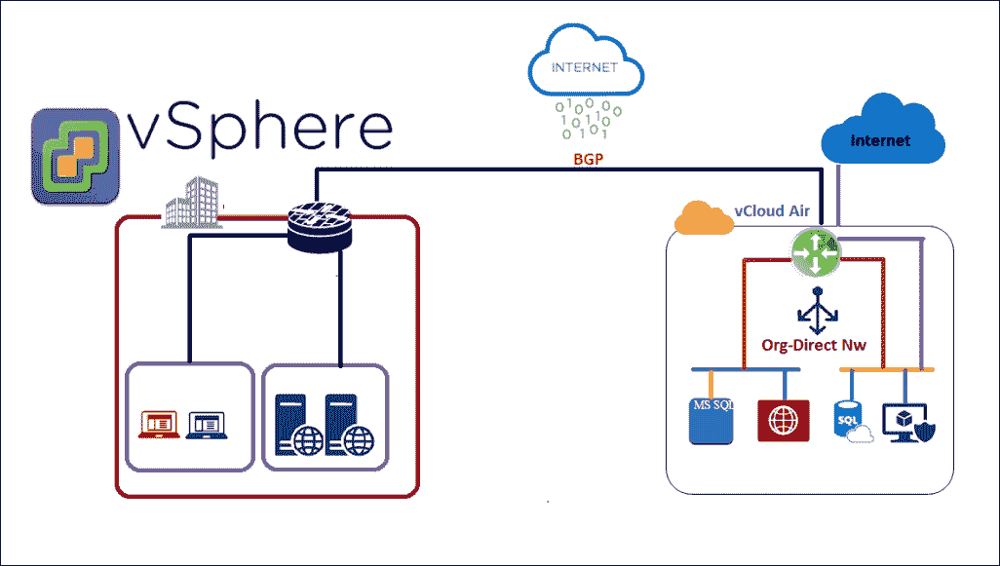
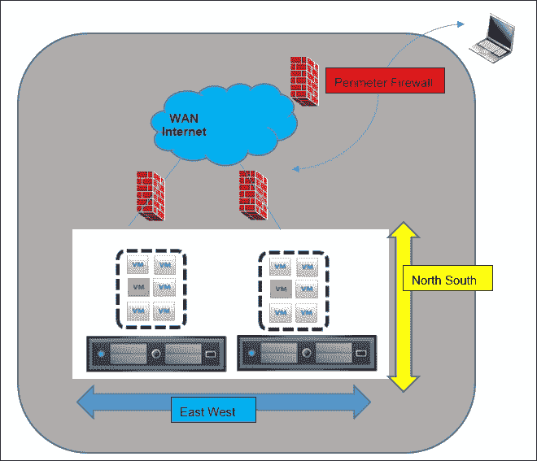
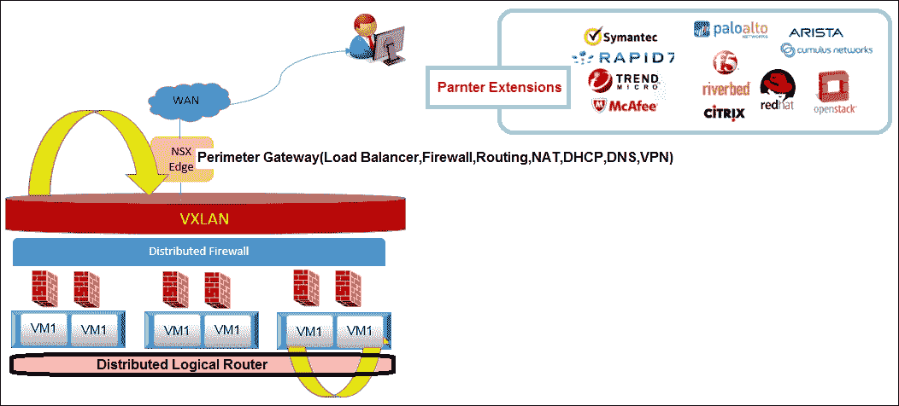
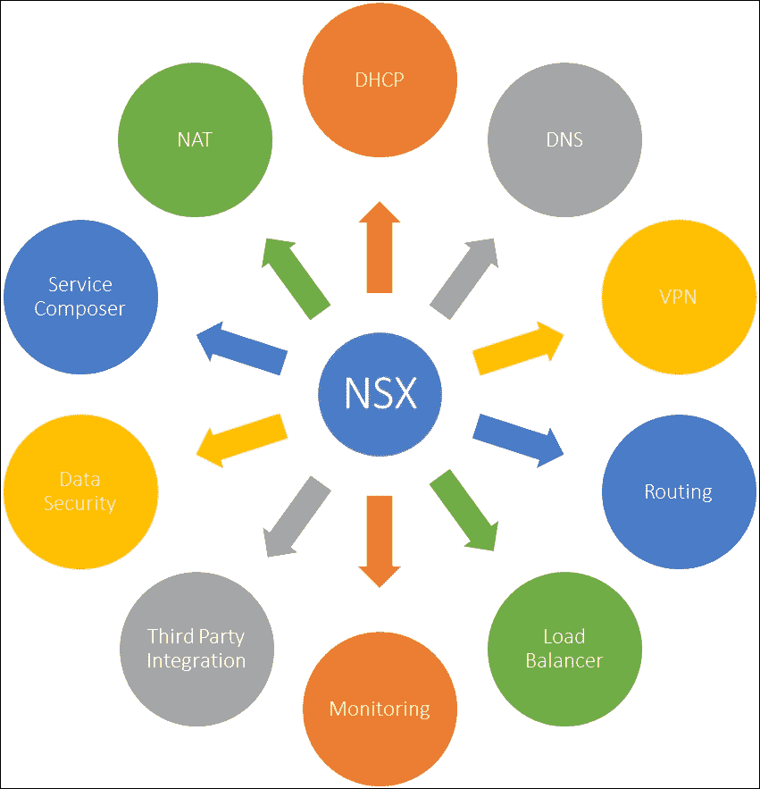

# 第一章：网络虚拟化简介

从主机时代开始，服务器虚拟化就有了悠久的历史。然而，今天的数据中心利用虚拟化特性将物理硬件抽象化，形成一个资源池，包含 CPU、存储和内存等，供最终用户以虚拟机的形式使用。提高服务器资源利用率的最简单方法是通过虚拟化技术。服务器虚拟化的成功被誉为数据中心的变革性事件，主要是因为一台物理机器可以运行多个操作系统，而每个操作系统可以像独立的物理机器一样进行管理。这是一个非常简单但强大的解决方案。虚拟化有不同类型，比如服务器虚拟化、存储虚拟化、应用虚拟化、桌面虚拟化，而行业最新的流行词就是网络虚拟化。网络虚拟化已经存在了很长时间，VLAN、VPN、MPLS、VPLS 和 VSS 都是网络虚拟化的广泛应用示例。如果你曾在数据中心工作，你会同意，网络总是很难操作。网络架构师被迫执行手动配置，这导致配置 VLAN、ACL、路由、防火墙规则、QoS、负载均衡等。该模型的缺点是复杂且速度慢，在动态的云环境中，复杂度将进一步增加。

本章将涵盖以下主题：

+   传统网络模型

+   **软件定义数据中心**（**SDDC**）的三大支柱

+   引入 NSX-V 网络虚拟化平台

+   服务器虚拟化和网络虚拟化的强大功能

+   如何利用 NSX

+   VMware NSX 特性

# 传统网络模型

传统的架构是建立在经典的三层层次结构之上的。为了冗余和可用性，每一层都会有一个或多个网络设备：

+   **数据中心核心层**：核心层是骨干层，通过与多个提供高速交换的聚合层设备互联，提供更快的包传输。最好在此层不要配置任何流量过滤功能。

+   **聚合层**：聚合层是核心层和接入层之间的中介。最好在此层配置路由和过滤策略。

+   **接入层**：接入层通常是终端用户设备直接连接到**机架顶部**（**ToR**）交换机或**机架末端**（**EoR**）的地方，具体取决于网络设计。

以下截图是经典三层网络架构的示例：

现在，让我们问自己以下几个问题：

+   如果我的网络、存储和服务器团队之间存在性能瓶颈，如何协作？

+   需要多少个 VLAN、STP、LACP 和路由配置？

+   应用需求的变化是否需要更改物理网络？

+   我是否需要重复进行初始配置，比如 VLAN、STP、LACP 和路由？

+   我的所有功能是否都依赖于硬件设备？

+   租户/虚拟机的隔离是否与 VLAN 相关？

+   我需要在将应用迁移到公共云之前重新设计我的应用吗？

+   将虚拟机从服务器迁移（VMotion）到另一台服务器是否需要改变物理网络配置？

+   我是否能从一个统一的管理界面中获得端到端的网络可视性？

+   防火墙功能是放置在机架外部还是机架内部？

上面的问答列表很长，确实，网络技术仍停留在过去，解决方案只有一个——*是时候虚拟化网络了！*

# 软件定义数据中心的三大支柱

在**SDDC**中，所有基础设施元素，包括存储、网络和计算，都完全虚拟化并以服务的形式交付。VMware 将其描述为*“一个统一的数据中心平台，提供前所未有的自动化、灵活性和效率，改变 IT 交付方式。计算、存储、网络、安全性和可用性服务被池化、聚合并作为软件交付，由智能、基于策略的软件进行管理”*。SDDC 是通过云服务高效交付的机制。SDDC 的一个关键目标是构建基于云的数据中心。像 Amazon、Google、IBM 和 VMware 这样的厂商都拥有基于 SDDC 架构的公共云服务。是的，现如今我们拥有了下一代数据中心，在这里我们可以将所有物理服务器池化，并根据 IT 定义的策略运行应用。

如标题所示，以下截图展示了软件定义数据中心（SDDC）的三大支柱：

让我们一一了解每个问题：

+   在**计算虚拟化**中，CPU 和内存从物理硬件中解耦，每个应用程序都驻留在一个叫做虚拟机的软件对象中。VMware VSphere、Microsoft Hyper-V、Citrix XenServer、Oracle VM 是这一类虚拟化的几个例子。

+   **存储虚拟化**在**软件定义存储**（**SDS**）环境中，是一种基于虚拟化管理程序的存储抽象，将物理服务器的异构模型转化为统一管理。使能 SDS 的软件提供了大多数传统存储阵列的功能，如复制、去重、精简配置和快照。由于这是完全的软件定义存储，我们提高了灵活性、管理的便捷性和成本效率。通过这种方式，池化的存储资源可以在软件定义的数据中心环境中，自动且高效地映射到应用需求上。VMware VSAN 是 SDS 的经典示例，因为它是一个分布式的软件层，原生运行于 ESXi 虚拟化管理程序的一部分。

+   **网络虚拟化**是**软件定义数据中心**（**SSDC**）的第三个也是最关键的支柱，提供一整套第 2 层到第 7 层的网络服务，如路由、交换、防火墙、负载均衡和服务质量（QoS），这些都在软件层实现。网络虚拟化是通过软件和网络硬件对网络资源进行虚拟化，使得网络资源的配置和部署变得更快速。软件的创新速度远远快于硬件，未来的答案不是硬件定义的数据中心，而是软件定义的数据中心，这将使我们能够跨物理数据中心扩展虚拟化层。使得亚马逊和谷歌成为世界上最大的数据中心的是软件定义数据中心的卓越性。网络虚拟化通过有效解决所有传统网络挑战，为我们提供了一个强大的基础，以确保我们获得一个完整的软件定义数据中心（SDDC）堆栈。随着云消费模型在行业中的快速采用，对计算、存储和网络资源按需配置的需求比以往任何时候都更强烈。网络虚拟化将网络和安全功能从物理硬件中解耦，允许我们在逻辑网络中复制相似的网络拓扑。

# 介绍 NSX-V 网络虚拟化平台

既然我们已经定义了网络虚拟化的概念，接下来我们来讨论 VMware NSX 及其历史。**Nicira**（**NSX**）是一家专注于软件定义网络和网络虚拟化的公司，由 Martin Casado、Nic Mckeown 和 Scott Shenker 于 2007 年创立。2012 年 7 月 23 日，VMware 收购了 Nicira，NSX 是从 VMware 的**vCloud 网络安全**（**vCNS**）和 Nicira 的网络虚拟化平台中创建的产品。截至目前，VMware NSX-v 可以与 vSphere、vCloud Director 和 vCloud Automation Center 进行集成，提供完整的私有云网络自动化。多种虚拟机管理程序环境，如 Xen 服务器、KVM 或 VMware ESXi，以及选择的云管理解决方案，如 vCloud 自动化中心、OpenStack 和 CloudStack，也可以与 VMware NSX 进行集成。本书仅介绍**NSX-VMware**（**NSX-V**）版本的 NSX，后续内容中将统一称 NSX-V 为 NSX。

# 服务器虚拟化和网络虚拟化的强大功能

服务器虚拟化是 21 世纪的主框架。虚拟化在现代商业中的一个关键用途是将现有的基础设施整合到更少的物理机器中。所有公司已经虚拟化了他们的基础设施，因为这是一个潜在的游戏规则改变者，能够让我们整合服务器和管理，部署也变得更简单。一个虚拟机管理程序（hypervisor）是一种软件，它允许我们运行多个虚拟机。以下是两种类型的虚拟机管理程序：

+   **裸金属**：裸金属或类型-1 的虚拟化管理程序是直接在硬件上运行的软件，例如，VMware ESXi、KVM、Citrix XenServer 和 Microsoft Hyper-V。

+   **托管**：托管或类型-2 的虚拟化管理程序运行在现有操作系统上。基本上，它们将客户操作系统与主机操作系统分离，例如，VirtualBox、VMware 工作站和 VMware 播放器。

类似于虚拟机的创建、监控和删除，NSX for vSphere 提供逻辑交换、虚拟化管理程序级路由、虚拟 NIC 级防火墙保护和层 4 至层 7 的负载均衡服务，这些都可以从单一控制面板中配置、监控和删除。因此，虚拟化网络相比传统的物理网络部署和管理，具有更好的可扩展性和成本效益。由于其与其他 VMware 产品（如 VRealize Automation 和 VCloud Director）的原生集成，客户通常会在大多数 VMware 环境中使用 NSX。

下图展示了服务器虚拟化和网络虚拟化：

# 如何利用 NSX

在利用 NSX 功能时，客户有以下三种选择：

+   在私有云中安装 NSX 并利用 NSX 功能。

    VMware NSX 可以与 vSphere、vCloud Director、vCloud Automation Center 和 VMware Integrated Openstack 进行集成。一个多虚拟化管理程序环境，例如 Xen Server、KVM 或 VMware ESXi^™，并结合如 vCloud Automation Center 这样的云管理解决方案。

+   VMware vCloud Air 作为公共云，提供由 NSX 驱动的先进网络服务和安全功能。

    客户可以在与 vSphere 相同平台上构建的公共云中保护网络安全。通过最小化设计和网络拓扑的变化，将本地网络镜像到云中。在网络安全管理员熟悉的控制和构造下进行大规模管理，从而最小化操作中断和减少再培训需求。

+   对于真正的网络混合性，客户可以在私有云中使用 NSX，并在公共云中使用 VMware vCloud Air。

    云网络是云计算的一个重要组成部分，是混合云的基础。每个 vCloud Air 服务都包括与互联网的连接、一个或多个公共 IP 地址以及关键的网络功能，如负载均衡、防火墙、**网络地址转换**（**NAT**）和通过 Edge Gateway 的 VPN 连接。vCloud Air 中的 NSX 支持**边界网关协议**（**BGP**）和**开放最短路径优先**（**OSPF**）路由，以简化客户公共云工作负载与本地应用程序和资源的集成。

下图描述了相同的内容：

在私有云和公有云中提供丰富的网络和安全服务，确保两个环境都得到保护，最重要的是，在工作负载进出时无需修改任何应用程序。私有云与 NSX 和 vCloud Air 之间的其他集成和设计超出了本书的范围。我们将快速了解 NSX 特性，以及它们如何适应我们当前的数据中心部署场景。

理解驱动任何数据中心环境中网络流量的应用程序特性非常重要。传统的网络架构基于一系列交换机和路由器，这些类型的网络架构非常适合客户端-服务器环境。今天的应用程序工作负载非常需要减少通信时的跳数。在现代应用需求中，虚拟机之间需要在同一机架或不同机架上进行通信，然后再向数据中心外部的客户端发送回复包。工作负载正在从服务器内存转移到服务器闪存驱动器进行分析。大数据、虚拟化和云计算对这种流量类型有很大的推动作用。因此，我们肯定需要为这种大规模应用工作负载提供智能网络。网络虚拟化特性帮助解决了网络速度和灵活性不足的问题。

话虽如此，让我们来看一下以下图表，该图解释了数据中心环境中的流量类型。数据中心环境中的网络流量流动有两种类型：**东西向**和**南北向**：

让我们来看一个例子。假设我们有一个私有数据中心，并且需要从数据中心外部访问一些托管在虚拟化服务器中的应用程序：

+   **东西向流量**：同一数据中心内虚拟机之间的流量

+   **南北向流量**：进出数据中心的流量

# VMware NSX 特性

VMware NSX 是用于**软件定义数据中心**（**SDDC**）的网络虚拟化平台，它是一种完全无中断的解决方案，通过软件重现整个网络基础设施，包括 L2-L7 网络服务。NSX 允许虚拟网络通过根据虚拟网卡的安全性维持细粒度的安全性，与物理网络连接：

让我们讨论 NSX 特性：

+   **逻辑交换**：NSX 允许创建逻辑交换机，这实际上就是 vSphere 端口组，用于工作负载隔离和逻辑网络之间 IP 地址空间的分离。这意味着，你不再受到 `4096` 个物理广播域的限制，主要得益于 VXLAN 覆盖网络。我们将在逻辑交换机模块中更详细地讨论 VXLAN，具体内容请参考第四章，*NSX 虚拟网络与逻辑路由器*。

+   **网关服务**：Edge Gateway 服务将你的逻辑网络与物理网络互联。这意味着连接到逻辑网络的虚拟机可以通过网关直接向物理网络发送和接收流量。Edge Gateway 提供了边界服务，如 DHCP、VPN、动态/静态路由、NAT、防火墙、负载均衡、DNS 转发和高可用性。

+   **逻辑路由**：NSX 逻辑路由功能允许虚拟化管理程序通过限制传统数据中心路由的北南方向，学习并在不同的逻辑网络之间进行路由。逻辑路由器还可以提供北南连接，允许访问物理网络中的工作负载。NSX Edge 支持静态和动态路由（OSPF、BGP、ISIS）。

+   **逻辑防火墙**：在 NSX 引入之前，从以边界为中心的安全防护转向每个虚拟机级别的保护是不可能实现的。这对按需云和 VDI 环境产生了重大影响。与传统的每数据中心级别的防火墙保护不同，逻辑防火墙提供每个虚拟机级别的保护，且可以通过几个点击创建和删除策略，即使虚拟机从一个主机迁移到另一个主机，策略也会保持不变。VMware NSX 允许我们使用分布式逻辑防火墙和 Edge 防火墙，在你的软件定义网络架构中使用。分布式逻辑防火墙允许你根据多个属性（不仅仅是 IP 地址和 VLAN，还包括虚拟机名称和 vCenter 对象）构建规则。Edge Gateway 提供防火墙服务，可以用于对北南流量施加安全性和访问限制。

+   **可扩展性**：利用 NSX 的可扩展性功能，可以将第三方 VMware 合作伙伴解决方案直接集成到 NSX 平台中，从而在多种服务选项中实现供应商选择。有许多 VMware 合作伙伴提供解决方案，如防病毒保护、IPS/IDS 和下一代防火墙服务，这些解决方案可以直接集成到 NSX 中，例如 Palo-Alto。除此之外，NSX 管理员可以从单一界面管理安全策略和规则。

+   **负载均衡器**：NSX Edge 提供多种网络和安全服务，逻辑负载均衡器就是其中之一。NSX 支持两种类型的逻辑负载均衡器：

    +   代理模式负载均衡器

    +   内联模式负载均衡器

        逻辑负载均衡器将传入请求分配到多个服务器上，实现负载分配，同时将此功能对终端用户进行抽象。为了确保应用程序最大限度的正常运行，我们可以为 NSX Edge 配置高可用性特性，从而将其转变为一个高可用的负载均衡器。

+   **动态主机配置协议（DHCP）**：NSX Edge 提供 DHCP 服务，支持 IP 地址池化和静态 IP 分配。管理员现在可以依赖 DHCP 服务来管理环境中的所有 IP 地址，而不需要维护单独的 DHCP 服务。该 DHCP 服务还可以将 DHCP 请求转发到现有的 DHCP 服务器。NSX Edge DHCP 服务能够将来自虚拟机的 DHCP 请求转发到预先存在的物理或虚拟 DHCP 服务器，且不发生任何中断。

+   **虚拟私人网络（VPN）**：Edge 提供 VPN 服务，可以为终端用户创建加密的安全连接，使其访问托管在私有云和公有云中的应用和工作负载。Edge VPN 服务提供 SSL-VPN Plus，支持用户访问以及基于 IPSEC 策略的站点到站点连接，确保两个站点之间的安全互联。

+   **域名系统中继（DNS）**：NSX Edge 提供 DNS 服务，可以将任何 DNS 请求转发到外部 DNS 服务器。

+   **服务编排器**：服务编排器使您能够为虚拟化基础设施中托管的应用程序配置并分配网络安全特性。每当虚拟机添加到虚拟网络中时，网络策略会自动应用到这些虚拟机上。

+   **数据安全**：NSX 数据安全功能提供对敏感数据的可视化，并确保数据保护，报告任何合规性违规情况。对指定虚拟机进行数据安全扫描后，NSX 可以分析并报告这些虚拟机的安全策略违规情况。

+   **流量跟踪**：流量跟踪是 NSX 6.2 中新增的功能，允许我们跟踪数据包从源头到目的地的路径。通过使用流量跟踪功能，我们可以监控链路利用率并排查网络故障。

+   **流量监控**：流量监控是一项流量分析功能，提供了每个会话传输的包数量、使用的端口等详细信息，随后管理员可以根据输出结果和业务需求允许或阻止相关操作。

+   **活动监控**：为了更详细地查看每个应用程序的状态，活动监控提供了极大的价值。通过这种方式，管理员可以监控用户和应用程序级别的信息。

以下功能在下方的框图中得到了完美总结：

VMware NSX 包括一套逻辑网络服务库——逻辑交换机、逻辑路由器、逻辑防火墙、逻辑负载均衡器、逻辑 VPN 和分布式安全性。你可以在隔离的软件虚拟网络中创建这些服务的自定义组合，这些虚拟网络能够支持现有应用而无需修改，或满足新应用工作负载的独特需求。

### 注意

NSX 6.2.3 是本文写作时的当前 NSX 版本。

# 总结

本章开始时，我们介绍了网络虚拟化和软件定义网络的概念。我们讨论了网络虚拟化的基本概念，并介绍了 VMware 的 NSX 网络虚拟化平台。接着，我们讨论了不同的 NSX 特性和服务，包括逻辑交换、逻辑路由、Edge Gateway 服务、可扩展性、服务编排器和数据安全性。

在下一章，我们将讨论 NSX 架构。
