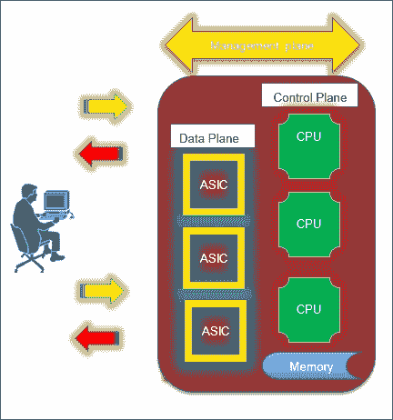
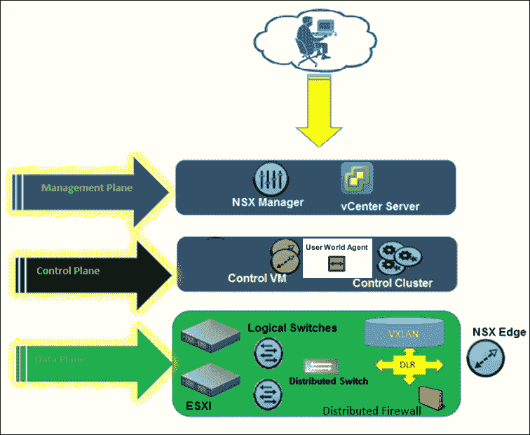
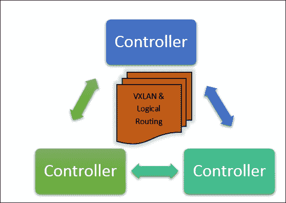
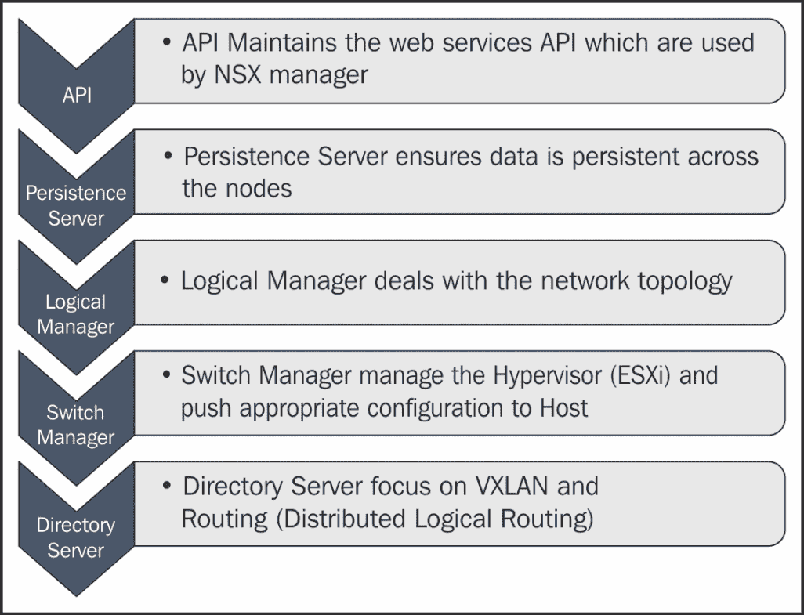
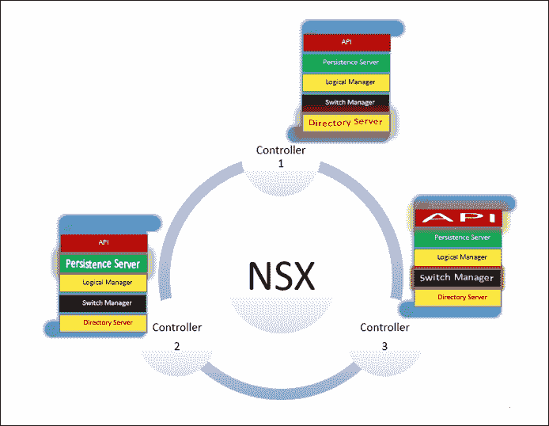
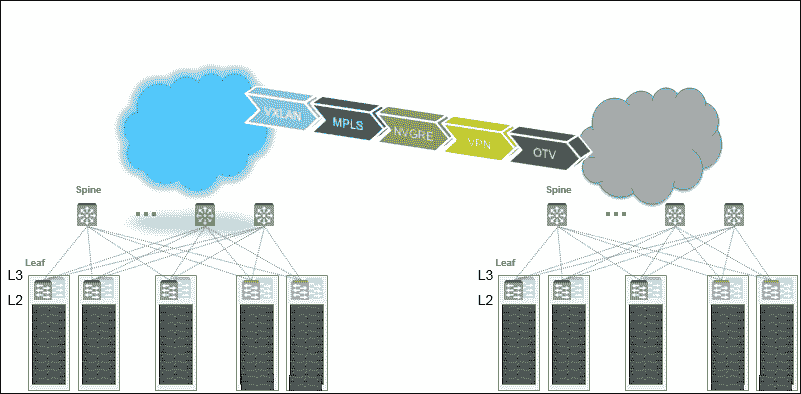
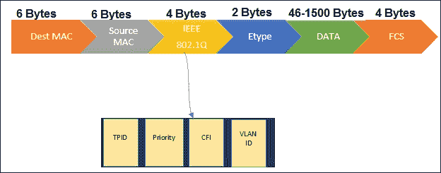
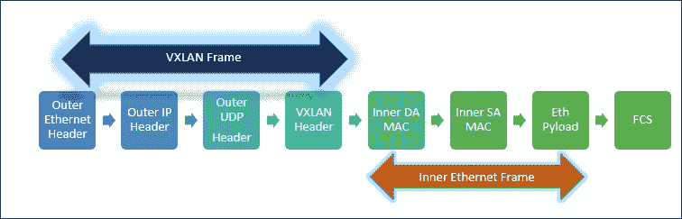
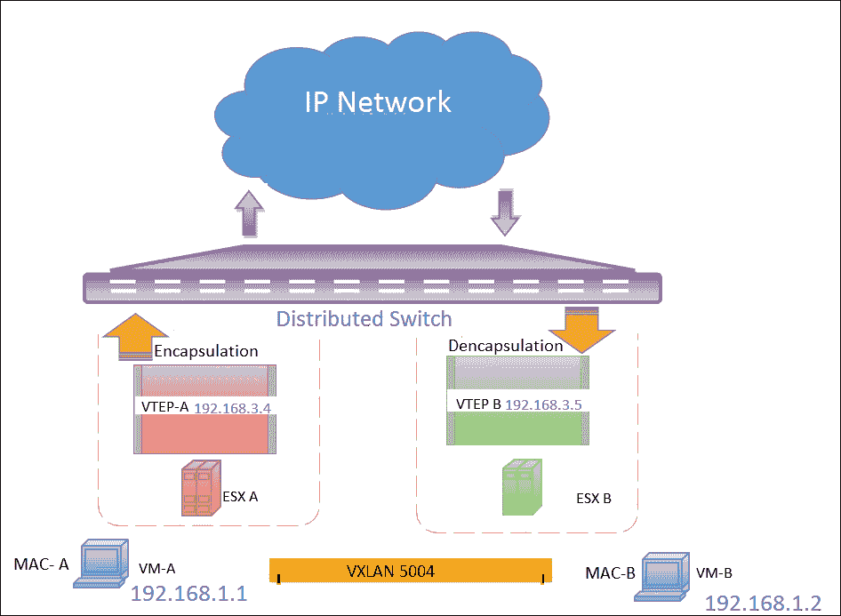

# 第二章. NSX 架构

在本章中，我们将对 NSX 架构进行高层次的讨论。为了正确安装和配置 NSX，我们应该了解涉及到 NSX 解决方案的核心组件。到本章结束时，我们将对以下方面有一个较为清晰的理解：

+   网络平面

+   NSX 核心组件

+   确定控制器角色

+   控制器集群

+   VXLAN 架构

# 介绍网络平面

在传统的交换机/路由器中，路由和数据包转发通常是在同一设备上完成的。这意味着什么呢？我们可以举一个配置路由器的经典例子。我们可能会配置 SSH 来管理路由器，然后再配置路由协议与其邻居交换路由。这些常见任务都是在同一硬件设备上完成的。因此，简而言之，每个路由器都会根据路由器的配置做出转发决策。软件定义网络的优势在于将转发平面和控制平面功能解耦到一个集中式设备，称为控制器，最终的结果是控制器维护转发信息并做出决策，而不是像传统方式那样逐跳转发。如图所示，网络的三个功能平面分别是管理平面、控制平面和数据平面：

网络的三个功能平面解释如下：

+   **管理平面**：管理平面是一个直观的概念：通过这块软件切片，我们可以进行变更并配置网络设备，使用如 SSH 和 SNMP 等协议来访问和监控这些设备。

+   **控制平面**：控制平面的经典示例是学习路由并基于路由算法做出决策。然而，控制平面功能不仅限于学习路由。控制平面还帮助与特定厂商的设备进行配对，并保护控制平面的访问，如 SSH 和 Telnet。

+   **数据平面**：数据平面流量通常由专用硬件设备执行，消耗少量计算资源。数据平面主要关注数据转发任务。

我知道我们大多数人可能会想，为什么在这里讨论网络平面。网络平面是 NSX 世界中的 DNA，三种平面共同构成了网络虚拟化层。

# NSX vSphere 组件

NSX 使用管理平面、控制平面和数据平面模型。组件在下图中以示意图的形式展示：

## 管理平面

管理平面包含 NSX Manager 和 vCenter Server。需要了解的是，每个 NSX Manager 应只注册一个 vCenter Server。NSX Manager 为 NSX 提供管理 UI 和 API。我们将在 NSX Manager 安装和配置模块中讨论 NSX Manager 与 vCenter Server 的集成。一旦集成完成，NSX Manager 可以通过 vSphere Web 客户端进行管理，vSphere Web 客户端作为一个单一的管理界面，用于配置和保护 vSphere 基础设施。即时的好处是，网络管理员不再需要在多个管理控制台之间切换。所有网络服务都可以通过单一界面进行配置和监控。

## 控制平面

控制平面主要由 NSX 控制器和控制虚拟机组成，允许我们执行分布式路由。控制平面还支持无组播的 VXLAN 网络，这是早期 vCloud 网络与安全版本的一个限制。控制器维护 ARP、VTEP（VXLAN 隧道端点）和 MAC 表。NSX 逻辑路由器控制虚拟机和 VMware NSX 控制器是由 VMware NSX Manager 部署的虚拟机。**用户世界代理**（**UWA**）由 ESXi 主机上的 ntcpad 和 vsfwd 守护进程组成。NSX Manager 实例或 NSX 控制器实例与 ESXi 主机之间的 NSX 相关通信通过 UWA 进行。NSX 控制器集群以奇数个方式部署，最大支持的控制器数量为三。由于控制集群中的每个控制器同时处于活动状态，它确保即使某个控制器发生故障，控制平面仍然完好。控制器之间通过安全的 SSL 通道进行同步通信。控制器使用切片技术在控制器之间分配工作负载。请看下面的图，它是一个三节点控制器集群，其中切片技术在控制器之间分配工作负载：

重要的是要理解在每个控制器上运行着两种类型的应用程序：

+   **VXLAN**：使得可以在网络中任何地方扩展一个二层 IP 子网，而不受物理网络设计的限制。

+   **逻辑路由器**：在逻辑空间内可以进行 IP 子网之间的路由，而无需流量经过物理路由器。这种路由直接在虚拟机监控程序内核中执行，并且 CPU/内存开销最小。这一功能为在虚拟基础设施中路由流量提供了最佳的数据路径。

这些应用程序的功能是学习并填充控制器表格，同时将学习到的路由分发给底层的 ESXi 主机。最后，即使管理平面发生故障，控制平面和数据平面的配置仍然保持完整——这就是软件定义网络的真正力量。

### 三节点控制器集群

在一个大规模的分布式系统中，有 *n* 个服务器时，确保一个特定的服务器能够对数据库执行写操作，或确保只有一个服务器是处理所有写操作的主服务器，是极其困难的。根本问题在于我们没有一个简单的方式来执行进程。我们如何解决这个问题呢？我们只需要提升一个服务器为主服务器，并与其他服务器达成共识。Paxos 是一个分布式共识协议，发布于 1989 年。该算法还确保每当服务器发生故障时，我们会进行领导者选举。Paxos 区分了提议者、接受者和学习者的角色，其中一个进程（服务器/节点）可以同时扮演一个或多个角色。以下是一些广泛使用 Paxos 算法的厂商，原因相同：

+   VMware NSX 控制器在 NSX 控制器集群中使用基于 Paxos 的算法

+   亚马逊 Web 服务广泛使用 Paxos 算法为其平台提供支持

+   Nutanix 实现了 Paxos 算法，以确保在 Cassandra（用于存储集群元数据）中保持严格的一致性

+   Apache Mesos 使用 Paxos 算法进行其复制日志协调

+   Google 使用 Paxos 算法为松耦合的分布式系统提供 Chubby 锁服务

+   许多 Azure 服务使用的 Windows fabric 利用 Paxos 算法实现集群节点之间的复制

为确保获取最高级别的可靠性，NSX 控制器以三节点集群的方式进行部署，因为控制器运行的是一种容错的分布式共识算法，称为**Paxos**。

#### 控制器角色

NSX 控制器提供路由和逻辑交换功能的控制平面功能。每个控制器节点运行一组角色，这些角色定义了控制器节点可以执行的任务类型。一个控制器节点总共运行五个角色，它们如下所示：

+   API

+   持久化服务器

+   逻辑管理器

+   交换机管理器

+   目录服务器

虽然每个角色需要不同的主节点，但重要的是要理解领导者是负责将任务分配给其他控制器的控制器。

以下图示描述了各个角色的职责：

如我们所知，三个节点控制器组成一个控制集群。我们将查看每个控制器的角色选举。每个角色都有一个主控制器节点，只有当某个给定角色的主控制器节点失败时，才会进行全集群范围的选举来选出新的主角色。这是三节点集群在企业环境中必不可少的主要原因之一，以避免出现分脑情况，这可能最终导致数据不一致，从而破坏整个控制平面的目的。在下图中，我们有一个正在运行的三节点控制集群，每个控制器都在运行主角色：

+   **控制器 1**：目录服务器主角色正在运行

+   **控制器 2**：持久性服务器主角色正在运行

+   **控制器 3**：API 和交换机管理主角色正在运行

## 数据平面

NSX 逻辑交换机、ESXi 虚拟化服务器、分布式交换机和 NSX 边缘设备都是数据平面组件。一旦管理平面启动并运行，我们就可以部署控制平面和数据平面软件及组件。在幕后，这三个 **VMware 安装包**（**VIB**）会被推送到底层的 ESXi 虚拟化服务器上：

1.  VXLAN VIB

1.  分布式路由 VIB

1.  分布式防火墙 VIB

到目前为止，我们已经讨论了 NSX 世界中的管理平面、控制平面和数据平面组件；在接下来的模块中，我们将更详细地了解每一层的安装部分和设计规范。

# 覆盖网络

在物理网络之上构建的虚拟网络称为覆盖网络。这听起来熟悉吗？大多数企业环境会使用 VPN 技术来保护私有或公共网络，这是一种 IP-over-IP 的覆盖技术。然而，重要的是要理解，并非所有的覆盖网络都是建立在 IP 网络之上的。真正的问题是，为什么我们需要覆盖网络？如以下图所示，我们有两个数据中心，每个数据中心都遵循一个 spine-leaf 拓扑结构。在虚拟化基础设施中，灵活的工作负载部署和虚拟机迁移能力，以及为每个租户提供强大的多租户性，都是常见的需求：

VXLAN、MPLS、NVGRE、VPN 和 OTV 是一些经典的基于网络的覆盖网络例子。让我们回到服务器虚拟化的根源。服务器虚拟化将一台物理服务器虚拟化，并允许多个虚拟机在其上运行，每个虚拟机拥有自己的计算和存储资源。现在，每个虚拟机可能拥有一个或多个 MAC 地址，这最终会增加网络中的 MAC 表。加之，虚拟机的迁移迫使广播域扩展。传统的网络划分方式通常依赖于 VLAN。根据 802.1q 标准，VLAN 标签是一个 12 位的空间，最多可以提供 4,096 个 VLAN。对于当前的多租户云环境来说，这并不是一个可行的解决方案，因为在这些环境中，多个虚拟机可能驻留在同一台服务器上，需要网络隔离，而工作负载不断波动，这要求为未来增长配置多个 VLAN，且 VLAN 蔓延问题会基于工作负载的迁移而持续发生。覆盖网络通过提供独立于物理网络的第二层连接来缓解这个问题。我们都知道，新技术解决了许多问题；然而，它们总是伴随挑战。你能想象一个网络管理员在排查覆盖网络时会遇到多大的困难吗？相信我，当覆盖网络和物理网络之间的映射非常清晰时，故障排除会变得异常简单。基于 NSX-VXLAN 的覆盖网络是一种基于主机的覆盖网络，使用基于 UDP 的 VXLAN 封装。

# VLAN 数据包

在尝试理解 VXLAN 之前，让我们回到 VLAN 数据包的基本概念。VLAN 数据包中的标记是如何工作的？其实很简单：4 个字节被插入到以太网头字段（IEEE），这 4 个字节由 2 字节的**标签协议标识符**（**TPID**）和 2 字节的**标签控制信息**（**TCI**）组成。优先级字段是一个 3 位字段，允许信息的优先级被编码到整个数据帧中，0 表示最低优先级，8 表示最高优先级。CFI 通常是一个用于以太网和令牌环网络之间兼容性的位，如果值为 0，则说明是以太网交换机。最后但同样重要的是，我们有 VLAN 字段——VID：

在交换机上创建 VLAN 的过程涉及定义一组交换机端口，并将终端设备连接到这些端口。它们都会成为该 VLAN 域的一部分，最终会阻止广播转发到另一组 VLAN。到目前为止，我们讨论的内容应该是我们在每一门网络课程中都会听到的内容。这只是为了确保我们永远不会忘记这些基本知识。现在我们可以继续讨论 VXLAN 了。

# VXLAN 概述

VXLAN 是由 Arista、VMware、Cisco 和 Broadcom 等厂商开发的一项技术。每个 VXLAN 网络称为逻辑交换机（在 vCloud 网络安全解决方案中为虚拟线路），它们通过 24 位的段-ID 进行标识。通过这种方式，客户可以创建最多 1600 万个 VXLAN 网络。**虚拟隧道终端节点**（**VTEP**）是封装和解封装 VXLAN 帧的端点。接下来我们将了解 VXLAN 中的一些关键术语；之后我们将讨论 VXLAN 帧：

+   **VXLAN VIB**：VXLAN VIB 或 VMkernel 模块在 ESXi 主机准备过程中由 NSX Manager 推送到底层虚拟化管理程序。

+   **Vmknic 适配器**：虚拟适配器负责发送 ARP、DHCP 和组播加入消息。是的，会从 VTEP IP 池分配一个 IP（静态或动态）给 vmknic，这是 VXLAN 配置的前提条件之一。NSX 支持每个主机多个 VXLAN vmknic 以实现上行链路负载均衡功能。

+   **VXLAN 端口组**：VXLAN 端口组在主机准备过程中预先配置，包括 NIC 聚合策略、VLAN 和其他 NIC 详细信息等组件和功能。

+   **VTEP 代理**：VTEP 代理是一个 VTEP，它将 VXLAN 流量从另一个 VTEP 在远程段转发到本地段。NSX 使用三种 VXLAN 模式：单播、组播和混合模式。在单播模式下，VXLAN VTEP 代理称为 UTEP，在混合模式下称为 MTEP。

+   **VNI**：**VXLAN 网络标识符**（**VNI**）或段 ID 类似于 VLAN 位字段；然而，VNI 是一个 24 位的地址，添加到 VXLAN 帧中。VNI 是 VXLAN 帧中的关键元素之一，因为它像 VLAN ID 唯一标识 VLAN 网络一样，唯一标识 VXLAN 网络。VNI 的编号从 5000 开始。

+   **传输区**：传输区基本上是定义 VXLAN 边界或域的集群或集群组。根据 NSX 设计，传输区可以是本地的或是多 VC 部署的通用区域。

## VXLAN 帧

以下是 VXLAN 帧的主要组成部分及其图示：

+   **外部以太网头（L2 头）**：外部以太网头中的目标 MAC 地址可以是下一个跳跃路由器的 MAC 地址或目标 VTEP 的 MAC 地址，而源外部 MAC 地址将是源 VTEP 的 MAC 地址。

+   **外部 IP 头（L3 头）**：相应的 VTEP 源 IP 和目标 IP 将被填充到外部 IP 头中。

+   **外部 UDP 头（L4 头）**：外部 UDP 头由源端口和目标端口组成。IANA 为 UDP 指定了值 `4789`，但 VMware NSX 默认的 UDP 端口是 `8472`。因此，允许在物理/虚拟防火墙设备中开放端口 `8472` 以支持 VXLAN 流量是非常重要的。

+   **VXLAN 头**：这是一个 8 字节的字段，包含 VXLAN 标志位、段-ID 和保留字段：

既然我们已经讨论了 VXLAN 数据包格式，接下来让我们继续查看内部以太网帧。

## 内部以太网帧

以下是内层以太网帧的主要组成部分以及对应的图示：

1.  **帧校验序列（FCS）**：FCS 是帧末尾的一个字段，用于存储**循环冗余检验**（**CRC**）信息。CRC 是一种算法，每次构建帧时都会运行，根据帧中的数据进行计算。当接收主机接收到帧并运行 CRC 时，结果应该是相同的。如果不同，帧将被丢弃。

1.  **以太网有效载荷**：帧的长度非常重要，无论是最大帧还是最小帧大小。以太网有效载荷字段是一个长度字段，用于限定数据包的长度。

1.  **内层源 MAC 地址**：内层源 MAC 地址将是连接到 VXLAN 网络的虚拟机的 MAC 地址。

1.  **外部目标 MAC 地址**：外部目标 MAC 地址将是目标虚拟机的 MAC 地址。稍等一下：如果虚拟机不知道目标虚拟机的 MAC 地址该怎么办？这里并没有什么复杂的原理。它所做的只是一个传统的广播，`ff:ff:ff:ff:ff:ff`（目标 MAC），这是广播地址，会广播到网络中的每个网络适配器，稍后这个完整的 L2 帧会在离开虚拟化主机之前被封装上 VXLAN 帧。

## VXLAN 数据包的生命周期

如果我们需要了解一系列数据包从源主机如何到达目的地，无论是在单播、多播还是广播域中，我们只需进行一个简单的数据包过程。在以下示例中，如果**VM-A**第一次在 VXLAN 域中与**VM-B**通信，封装和解封装过程是如何进行的？

下图展示了如何操作：

现在让我们逐步了解这些步骤：

1.  VM A-192.168.1.1，MAC-A 在 ESXi 主机 A 上生成一个广播帧（Layer 2 广播帧）。

1.  主机 A 上的 VTEP A 将广播帧封装到 UDP 头部，目标 IP 根据 VXLAN 复制模式（单播/多播 IP）而定（Layer 2 头部被封装进 VXLAN 头部）。

    ### 注意：

    我们将在第四章中详细讨论 VXLAN 复制模式，*NSX 虚拟网络与逻辑路由*。

1.  物理网络将数据包传递给主机，因为它是我们在 VXLAN 复制模式中定义的多播组或单播 IP 的一部分。

1.  主机 B 上的 VTEP B 将查看 VXLAN 头（24 位），如果与 VTEP 表条目匹配，则移除 VXLAN 封装头，并将 Layer 2 数据包传递给虚拟机。

上述四个步骤是一个简单的数据包过程，展示了虚拟机如何在 VXLAN 网络中通信。然而，我还没有解释 ARP 抑制和 VTEP 表学习的内容，因为我希望在 NSX 虚拟网络和逻辑路由器部分来进行讲解。

思考一下，检查在什么情况下，即使虚拟机连接到 VXLAN 网络，也不会发生任何封装和解封装。这里没有脑筋急转弯。如果两台虚拟机位于同一个 ESXi 主机和相同的 VXLAN 网络上，它所做的仅是传统的二层学习，并没有封装或解封装。这些是非常重要的点，因为当由于 VXLAN/物理网络问题导致虚拟机间无法通信时，能够帮助我们解决很多故障排除问题。我相信我们在 vSphere 环境中已经做过这样的故障排除。

# 总结

我们以简要介绍 NSX 核心组件开始本章，并查看了管理、控制和平面组件。接着，我们讨论了 NSX Manager 和 NSX Controller 集群，随后进行了 VXLAN 架构概述讨论，我们分析了 VLAN 和 VXLAN 数据包，并进行了简单的数据包步进。现在我们已经熟悉了核心组件及其功能。

在下一章，我们将讨论 NSX Manager 的安装和配置。
