# 第四章. NSX 虚拟网络与逻辑路由器

可扩展性和灵活性是网络虚拟化的显著特点。无论是在任何 IP 网络、任何交换机/路由器上，还是任何物理网络设计中，NSX 都能完美工作。随着对覆盖网络（Overlay Network）的兴趣日益增长，目前市场上有多种封装技术。VXLAN、NVGRE、LISP 等是其中的一部分。在本章中，我们将讨论逻辑网络以及 NSX 如何简化数据中心的路由和交换。以下是关键点：

+   NSX 逻辑交换机

+   NSX 虚拟网络创建 - 组播、单播和混合复制模式

+   NSX 虚拟网络最佳实践与部署考虑事项

+   NSX 逻辑路由器

+   NSX 逻辑路由与桥接最佳实践

# NSX 逻辑交换机

使用 VMware NSX 虚拟网络，我们可以在任何 IP 网络之上创建逻辑网络。我们已经在前几章中讨论了 VXLAN 基础知识和主机安装过程。现在我们对基础知识有了较好的理解，是时候继续进行虚拟网络的创建了。在开始之前，理解每个逻辑网络都是一个独立的广播域非常重要。

## 逻辑网络先决条件

首先，让我们来看看逻辑网络创建的先决条件：

+   主机准备

+   段 ID (VNI) 池

+   全局传输区域

### 主机准备

我们已经在 第三章 *NSX 管理器安装与配置* 中详细讨论了如何通过 NSX 管理器准备底层 ESXi 主机。现在是回顾这些知识的时候了。

超级管理程序内核模块使 ESXi 主机能够支持 VXLAN、逻辑交换机、分布式路由器和分布式防火墙。

### 段 ID (VNI) 池

如我们所知，VXLAN 网络标识符是一个 24 位地址，它会被添加到 VXLAN 帧中，从而实现将每个 VXLAN 网络与其他 VXLAN 网络隔离。

#### 配置 VNI 池的步骤

配置 VNI 池的步骤如下：

1.  在 **逻辑网络准备** 选项卡中，点击 **段 ID** 按钮。

1.  点击 **编辑** 打开 **编辑段 ID 和组播地址分配** 对话框，并配置给定的选项。

1.  点击 **确定** 如下图所示：

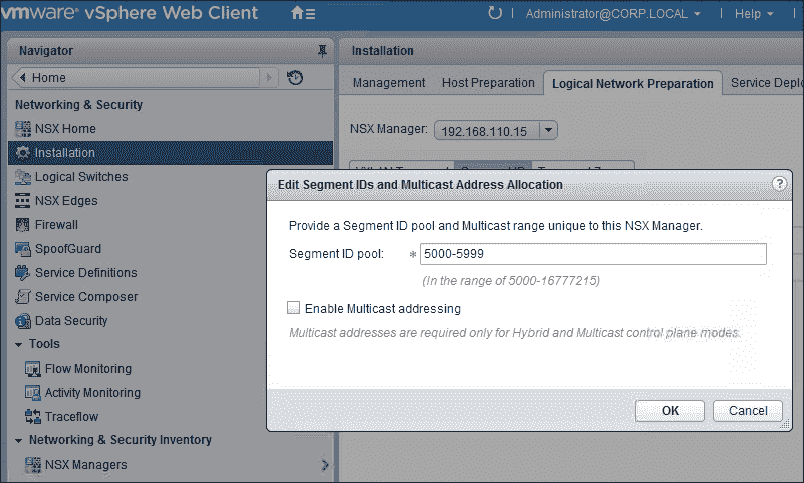

在这个示例中，我们并没有使用多播网络，而是希望利用单播网络。一个经典的多播 VXLAN 网络示例是，当客户已经有现有的 VXLAN 网络（在使用 vCloud 网络安全时创建）且管理软件升级到 NSX 后，很多人会在 NSX 中继续使用多播模式 VXLAN 网络。请注意，在这种情况下，我们甚至不需要控制器。不要使用 239.0.0.0/24 或 239.128.0.0/24 作为多播地址范围，因为这些网络用于本地子网控制，这意味着物理交换机会泛洪所有使用这些地址的流量。完整的列表已在 [`tools.ietf.org/html/draft-ietf-mboned-ipv4-mcast-unusable-01`](https://tools.ietf.org/html/draft-ietf-mboned-ipv4-mcast-unusable-01) 中文档化。

### 传输区

传输区是 VNI 的边界。同一传输区中的所有集群共享相同的 VNI。一个传输区可以包含多个集群，一个集群也可以属于多个传输区，换句话说，一个主机可以属于多个传输区。在下图中，我们有三个集群：**集群 A**、**集群 B** 和 **集群 C**。**集群 A** 和 **集群 B** 属于 **传输区 A**，**集群 C** 属于 **传输区 B**。

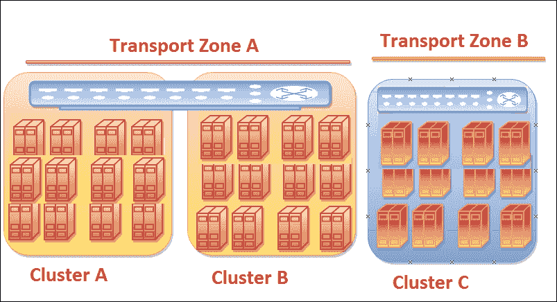

#### 配置全局传输区

以下步骤将帮助您配置传输区：

1.  在 **逻辑网络准备** 标签页中，点击 **传输区**。

1.  点击绿色加号打开 **新建传输区** 对话框，配置以下选项后点击 **确定**：

    +   在 **名称** 文本框中输入传输区名称。

    +   在 **控制平面模式** 下，选择 **单播**、**多播** 或 **混合模式** 按钮。

    +   在 **选择要添加的集群** 中，勾选列出的每个 vSphere 集群的复选框。同时，查看红色高亮的分布式交换机选择。我们遵循 NSX-DVS 设计最佳实践之一。两个计算集群运行在 **Compute_VDS** 上，管理集群运行在 **Mgmt_Edge_VDS** 上。

1.  更新后，验证传输区是否出现在传输区列表中，并根据前述选择设置控制平面模式为单播、多播或混合模式。参见下图：

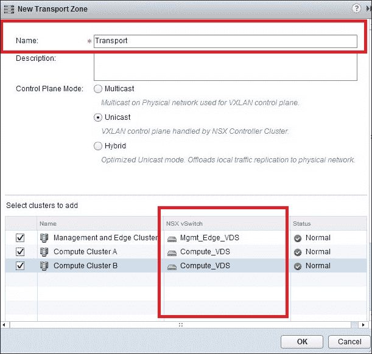

我们现在已经完成了 NSX 逻辑网络的所有先决条件。在这个示例中，我们已经在 vSphere 中创建了以下虚拟机，但尚未建立网络连接。我们将继续创建四个逻辑网络，并将其连接到虚拟机，稍后进行连通性测试：

+   **两个 Web 服务器**：web-sv-01a 和 web-sv-02a

+   **一个数据库服务器**：DB-sv-01a

+   **应用服务器**：app-sv-01a

## 创建逻辑交换机

在传统的 vSphere 环境中，理想情况下，虚拟机将连接到预配置的 vSphere PortGroup，无论是否使用 VLAN 标记。但现在我们处于 NSX 世界，并且让我们利用 NSX 逻辑交换机来连接虚拟机。在左侧导航窗格中，选择**Logical Switches**，在中心窗格中点击绿色的加号打开**New Logical Switch**对话框。按照以下步骤配置逻辑交换机：

1.  在**Name**文本框中输入`App-Tier`。

1.  验证**Transport Zone**选择项是否为**Transport**。

1.  验证**Control Plane Mode**选择项是否为**Unicast**。

1.  点击**确定**：

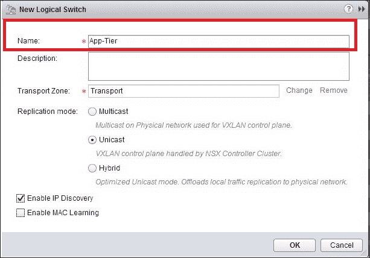

以下是在**New Logical Switch**屏幕上显示的两个选项：

+   ****启用 IP 发现****：另一个伟大的功能，能够最小化 VXLAN 网络中的 ARP 泛洪。当虚拟机发送 ARP 包时，交换机安全模块——即附加到 VNIC 的 dvfilter 模块——将查询 NSX 控制器，看看是否有目标 IP 的 MAC 条目。每个人都知道在这种情况下我们有两个选择：

    +   控制器有 MAC 条目

    +   控制器没有 MAC 条目

    +   在第一种情况下，由于控制器有 MAC 条目，它会回应 MAC 地址，从而减少 ARP 流量。在第二种情况下，控制器没有 MAC 回应，ARP 流量将以常规方式泛洪。

+   ****启用 MAC 学习****：启用 MAC 学习时，会在每个 vNIC 上维护一个 VLAN/MAC 对表，该表由 dvfilter 数据使用。无论虚拟机从一个主机迁移到另一个主机，借助 dvfilter 数据，该表将保持不变。

等待更新完成并确认 app-network 显示状态为**正常**。重复步骤 1-4 并创建三个逻辑交换机，分别命名为**Web-Tier**、**DB-Tier**和**Transit**网络。成功创建逻辑交换机后，当它们在逻辑交换机下显示时，将呈现以下截图所示的相同结果：

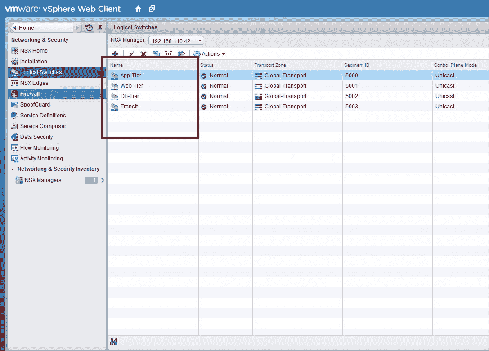

通过之前的步骤，我们看到在 vSphere 网络选项中创建了四个端口组，它们的 VNI-ID 如下：

+   **5000**：**Transit**网络

+   **5001**：**Web_Tier**网络

+   **5002**：**App_Tier**网络

+   **5003**：**DB_Tier**网络

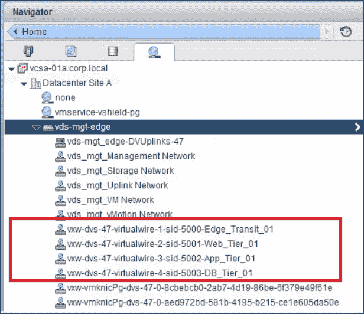

# 理解复制模式

让我们更详细地讨论复制模式，稍后我们将把逻辑交换机连接到虚拟机。随着 NSX 控制器的加入，VXLAN 对物理网络的多播协议支持要求完全消除。复制模式有三种：

+   ****组播****：当为给定的逻辑交换机选择组播复制模式时，NSX 依赖于数据中心物理网络的第 2 层和第 3 层组播功能，以确保 VXLAN 封装的多目标流量能够发送到所有 VTEP。这种模式仅在从旧版本的 VXLAN 部署（如 vCloud 网络安全）升级时推荐使用。它需要物理网络上的 PIM/IGMP 支持。

+   ****单播****：控制平面由 NSX 控制器处理。所有单播流量使用头端复制。无需组播 IP 地址或特殊的网络配置。在单播模式下，NSX 域中的 ESXi 主机根据其 VTEP 接口所属的 IP 子网被划分到不同的 VTEP 段中。每个段都会选择一个 UTEP 作为**单播隧道端点**（**UTEP**）。UTEP 负责复制从承载源流量的虚拟机的 ESXi 主机接收到的多目标流量，这些流量属于不同 VTEP 段，并且是该段内所有 ESXi 主机的一部分。

+   ****混合模式****：优化的单播模式。将本地流量复制卸载到物理网络（L2 组播）。这需要在第一跳交换机上启用 IGMP 嗅探，但不需要 PIM。第一跳交换机负责子网的流量复制。

我们将把下面的截图视为网络拓扑，并解释所有三种复制模式，这将帮助我们精确了解复制是如何工作的：

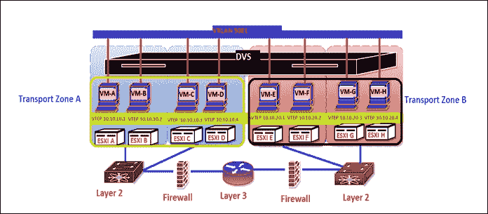

首先，让我们理解一下配置。前面的截图显示了以下内容：

+   在这个设置中，有两个传输区，分别是****传输区 A****和****传输区 B****。

+   一个****分布式虚拟交换机**（**DVS**）**是两个传输区的组成部分。

+   所有虚拟机都连接到一个公共的 VXLAN 网络 —— ****VXLAN 5001****。

我们将逐一讨论所有模式，并在接下来的章节中讨论它们的设计决策。

## 单播模式数据包行走

让我们讨论一下单播模式 VXLAN 数据包行走：

+   **VM-A** 生成了**广播、未知单播、组播**（**BUM**）流量，通常是第 2 层流量。

+   **ESXi-A** 将执行本地 VTEP 查找，并学习到数据包需要在本地进行复制（同一子网），在这种情况下是 **ESXi-B**。

+   除此之外，数据包还会被远程复制。由于我们有四台主机位于远程子网（ESXi E、F、G 和 H），它会将数据包发送到哪一台主机？这是组播模式 VXLAN 和单播模式之间的一个关键区别。在单播模式下，数据包将被发送到一个名为 **UTEP** 的代理模块，设置了本地复制位。为什么会这样？答案很简单：由于设置了本地复制位，UTEP 将数据包在本地复制到同一子网中的某一台 ESXi 主机。在这个例子中，我们有两个子网；根据网络拓扑，处理过程在每个子网中是相同的。

### 单播模式 VXLAN 的设计决策

关于单播模式 VXLAN 设计，没有太多需要讨论的内容。然而，了解以下几点很重要：

+   我们可以简单地沿用传统的 IP 网络设计，只需确保将 MTU 增加到 1,600。

+   让我们回过头来看一下单播模式下的 VXLAN 数据包处理流程，简而言之，它做了什么？它会在本地复制数据包，然后将一份发送到远程子网，再次在本地复制。谁来执行这个复制工作？ESXi 主机完成了所有这些智能化操作，当然，基于环境的大小或 **BUM** 流量的频率，它会给虚拟化管理程序带来一些轻微的开销。所以我建议单播模式作为开始使用 VXLAN 的最佳方式；然而，它并不是大型环境的理想选择。

+   在客户有组播限制的环境中，单播模式 VXLAN 是最佳选择。

## 组播模式数据包处理

每当我解释组播 VXLAN 网络时，总让我想起 VMware **vCloud Networking and Security**（**vCNS**）解决方案的时代。组播模式 VXLAN 是 VXLAN 实现在虚拟化 vSphere 环境和运行 vCloud director 软件的云环境中的初始阶段。这个解决方案非常强大；然而，物理网络的前提条件是所有架构师面临的困难之一，因为它确实违背了 NSX 可以在任何 IP 网络上运行的说法。残酷的现实是，IP 网络确实要求一些条件才能使技术无缝工作。话虽如此，让我们从数据包处理开始：

+   **VM-A** 生成 **BUM** 流量。

+   **ESXi A** 主机将数据包封装在一个 VXLAN 头部（5001）中。现在开始猜测它会将数据包发送到哪里。它会仅仅广播吗？二层帧是一个广播帧，并带有 VXLAN 头部；然而，主机会将其发送到某个组播组。我们如何确保组播只到达**ESXi B**、**E**、**F**、**G** 和 **H**，因为我们有一个虚拟机正在同一个 VXLAN 网络上运行？这就是为什么物理网络要求必须的原因。我们需要 IGMP snoop；如果没有，它将被视为一个未知的组播数据包。

+   **路由器** 将执行 L3 多播并将其发送到二层交换机，交换机会再次检查多播组，并将其发送到正确的主机。最终，目标主机上的虚拟机将在 VTEP 解封装后接收到该数据包。

### 多播模式 VXLAN 的设计决策

如我所提到的，我们确实需要在多播模式的 VXLAN 网络中处理物理网络的前提要求：

+   **IGMP snoop** 和 **IP 多播** 在整个网络中的交换机和路由器上是必需的。

+   理想情况下，一个 VXLAN 段对应一个多播组是提供最佳多播转发的推荐方式，这也要求如果我们有较大的段，则需要增加多播组。这是我在云环境中看到的，VXLAN 网络是动态创建的，云提供商会确保为 1:1 映射提供足够的多播 IP；这样，转发给一个租户的数据包就不会被其他租户看到。

## 混合模式数据包转发

混合模式 VXLAN 推荐用于大多数大型环境，主要是因为其简便性和对网络中配置更改的限制要求。让我们来看一下混合模式 VXLAN 数据包的转发过程：

1.  **虚拟机 A** 生成 **BUM** 流量。

1.  **ESXi A** 主机将 **L2 头** 封装为 **VXLAN 头 5001**，并将其发送到物理交换机。

1.  在这种情况下，一个封装的 L2 头将被发送到物理交换机上定义的多播组。我希望现在更加清晰了。物理交换机会将数据包传递到该多播组中的目标 ESXi 主机，在这个例子中是 ESXi B、C、D。除此之外，ESXi A 会将一个设置了 `Locally_Replicate_BIT` 的数据包发送到远程子网。这个数据包将由一个称为 **Multicast Tunnel End Point**（**MTEP**）的代理模块接收。同样，这是一个直接的答案，因为设置了本地复制位，MTEP（ESXi 主机）将把数据包本地复制到同一子网中其他 ESXi 主机。

1.  MTEP 将再次将数据包发送到物理交换机，物理交换机会将数据包传递到同一多播组中所有的主机。

### 混合模式 VXLAN 的设计决策

混合模式 VXLAN 作为最广泛使用的复制模式之一，我相信我们都会对一些关键的设计决策感兴趣：

+   **IGMP snoop** 需要在整个 VXLAN 网络中的物理交换机上进行配置。

+   在整个网络中的物理路由器不需要 IP 多播。我不确定我是否可以说得足够安全，因为可以根据每个逻辑交换机选择复制模式，这意味着我们可以在单播、多播或混合模式下部署逻辑交换机。如果我们在同一个 VXLAN 域中将逻辑交换机 A 部署为多播模式，逻辑交换机 B 部署为混合模式，那么这就需要物理网络中启用 IP 多播。但再次强调，对于混合模式的 VXLAN 网络，我们并不显式地需要 IP 多播。

强烈建议为每个 VLAN 定义一个**IGMP Querier**，以确保成功的 L2 多播传输并避免非确定性行为。为了让 IGMP 和 IGMP 嗅探功能正常工作，网络上必须存在一个多播路由器并生成 IGMP 查询。为嗅探（持有每个多播组成员端口的表格）创建的表格与查询器相关联。我相信我们已经在 VXLAN 及其复制模式方面打下了坚实的基础；接下来让我们继续讨论逻辑交换机和虚拟机的连接。

### 连接虚拟机到逻辑交换机

由于我们已经创建了逻辑交换机，接下来让我们将逻辑交换机连接到以下虚拟机：

+   **两台 Web 服务器**：web-sv-01a 和 web-sv-02a

+   **一台数据库服务器**：DB-sv-01a

+   **应用服务器**：app-sv-01a

让我们看看如何连接逻辑交换机：

1.  点击**vSphere Web Client**主页图标。

1.  在**vSphere Web Client**主页标签页中，点击**库存** | **网络与安全**。

1.  在左侧导航窗格中，选择**逻辑交换机**。在中间窗格中，选择**应用层**逻辑交换机。

1.  点击**添加虚拟机**图标，或者从**操作**下拉菜单中选择**添加虚拟机**。

1.  在**应用层**中，点击虚拟机对话框。

1.  在筛选器列表中，勾选**app-01a**复选框。

1.  点击**下一步**。在**选择 VNICs**列表中，勾选**网络适配器 1（虚拟机网络）**复选框。

1.  点击**下一步**，如以下截图所示：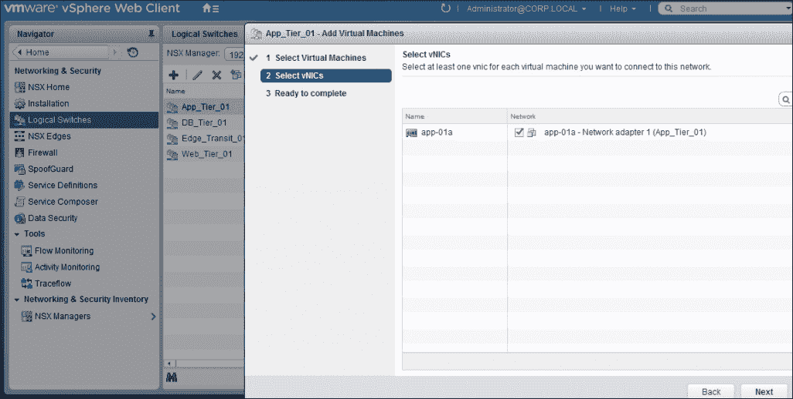

1.  点击**完成**。

1.  重复步骤 1-7，连接两个 Web 服务器（web-sv-01a，web-sv-02a）和数据库服务器。

# 测试连接性

由于我们知道三层应用程序，web、app 和 DB，已连接到逻辑交换机，让我们做一些基本测试以确认它们的连接性：

1.  首先，启动这些虚拟机。

1.  点击**vSphere Web Client**主页图标。

1.  在**vSphere Web Client**主页标签页中，点击**库存** | **虚拟机和模板**图标。

1.  展开虚拟机和模板库存树，并启动在已发现的虚拟机文件夹中的以下虚拟机：

    +   web-sv-01a

    +   web-sv-02a

    +   app-sv-01a

    +   db-sv-01a

    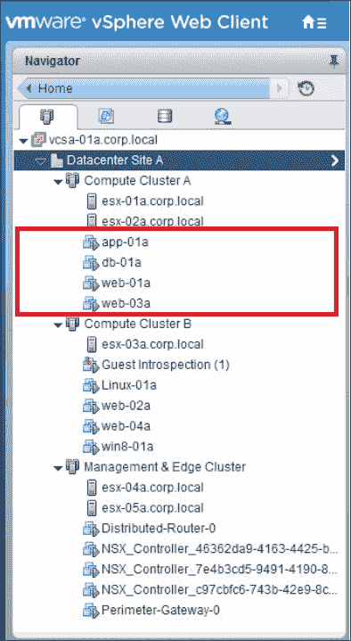

1.  要启动虚拟机，请在库存中选择虚拟机，然后从**操作**下拉菜单中选择**开机**。

1.  一旦虚拟机启动，我们将记录它们的 IP 地址：

    +   `web-01a`：`172.16.10.11`

    +   `web-02a`：`172.16.10.12`

    +   `app-01a`：`172.16.20.11`

    +   `DB-01a`：`172.16.30.11`

接下来，我们对`web-01a`和`app-01a`进行简单的 ping 测试，如以下截图所示：

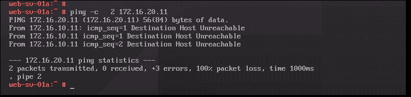

为什么当我们 ping `web-01a (172.16.10.11)` 和 `app-01a(172.16.20.11)` 时会出现 100% 丢包？逻辑交换机会执行第三层路由吗？当然不会。传统的路由方式是通过物理路由器来执行，这意味着必须走出机架，将数据路由到正确的目的地。我们在此不使用传统的路由方式，而是利用 NSX 逻辑路由器功能。

# 分布式逻辑路由器

路由的主要目的是在两个不同的 IP 网络之间处理数据包。在深入了解逻辑路由器之前，让我们先讨论一下路由的基础知识。每个路由器都会构建一个路由表，其中包含 **目标网络**、**下一跳路由器**、**度量值和管理距离** 等信息。构建路由表有两种方法：

+   **静态路由**：静态路由是由网络管理员手动创建和更新的。根据网络拓扑，我们需要在每个路由器上配置静态路由，以实现端到端的网络连接。尽管这种方式可以完全控制路由，但在大型网络中配置路由将是一项非常繁琐的工作。

+   **动态路由**：动态路由是通过运行在路由器上的路由协议创建和更新的；**路由信息协议** (**RIP**) 和 **开放最短路径优先** (**OSPF**) 就是其中的一些例子。动态路由协议足够智能，能够在路由基础设施发生变化时选择更好的路径。

VMware NSX 分布式逻辑路由器支持静态路由、OSPF、ISIS 和 BGP 路由协议。需要注意的是，动态路由协议仅在 **分布式逻辑路由器** (**DLR**) 的外部接口（上行链路）上受支持。DLR 允许 ESXi 超级管理程序在本地执行路由智能，从而优化东西向数据平面流量。

## 部署分布式逻辑路由器

DLR 是一种虚拟设备，具有控制平面智能，并依赖于 NSX 控制器将路由更新推送到 ESXi 内核模块。

### 部署逻辑路由器的步骤

让我们逐步配置分布式逻辑路由器：

1.  在 vSphere Web 客户端中，导航到 **主页** | **网络与安全** | **NSX 边缘**。

    ### 注意事项

    选择适当的 NSX 管理器，以便进行更改。如果您正在创建一个通用逻辑路由器，则必须选择主要的 NSX 管理器。我们将在 第七章 中讨论主要/次要 NSX 管理器的概念，*NSX 跨 vCenter*。

1.  选择您希望添加的路由器类型；在本例中，我们将添加 **逻辑路由器**。

1.  选择 **逻辑（分布式）路由器** 以将逻辑路由器添加到选定的 NSX 管理器本地。

    ### 注意事项

    由于我们尚未讨论跨 vCenter 的 NSX 环境，本章不会使用通用逻辑分布式路由器（DLR）。

1.  为设备输入一个名称。此名称将出现在您的**vCenter 库存**中。该名称在单个租户的所有逻辑路由器中应唯一。您还可以选择输入主机名。该名称将显示在 CLI 中。如果没有指定主机名，自动创建的边缘 ID 将显示在 CLI 中。

1.  默认情况下选中了**部署边缘设备**选项。边缘设备（也称为逻辑路由器虚拟设备）用于动态路由和逻辑路由器设备的防火墙，适用于逻辑路由器的 ping、SSH 访问和动态路由流量。如果您只需要静态路由，并且不想部署边缘设备，您可以取消选中**部署边缘设备**选项。逻辑路由器创建后，无法再添加边缘设备。

1.  默认情况下，**启用高可用性**选项没有选中。选中**启用高可用性**复选框以启用并配置高可用性。如果您计划进行动态路由，则需要高可用性。我希望大家从云提供商的角度考虑：如果您的租户请求高可用性功能，您如何满足这个要求？NSX Edge 会为备用设备复制主设备的配置，并确保即使使用 DRS 和 vMotion，两个高可用性的 NSX Edge 虚拟机也不会部署在同一 ESXi 主机上。两个虚拟机被部署在 vCenter 中，与您配置的设备位于同一资源池和数据存储中。NSX Edge HA 为高可用性虚拟机分配本地链接 IP，以便它们能够相互通信。但请记住，我们现在有两个控制 VM，而不是一个控制 VM，因此肯定会消耗两倍的计算资源。

    以下截图展示了 NSX DLR-VM 的部署：

    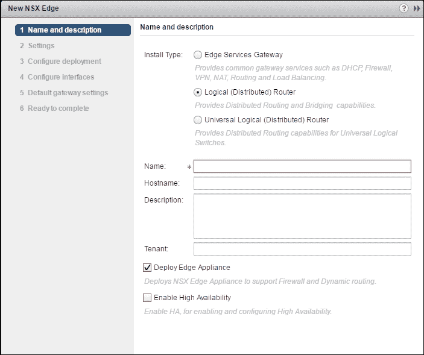

1.  为逻辑路由器输入并重新输入密码。密码必须为 12-255 个字符，并且必须包含以下内容：

    +   至少一个大写字母

    +   至少一个小写字母

    +   至少一个数字

    +   至少一个特殊字符

1.  启用**SSH**并设置日志级别（可选）。默认情况下，**SSH**是禁用的。如果您没有启用 SSH，仍然可以通过打开虚拟设备控制台访问逻辑路由器。在这里启用 SSH 会使 SSH 进程在逻辑路由器虚拟设备上运行，但您还需要手动调整逻辑路由器的防火墙配置，以允许 SSH 访问逻辑路由器的协议地址。协议地址是在您为逻辑路由器配置动态路由时配置的。默认情况下，日志级别为紧急。

    ### 注意

    在逻辑路由器上，仅支持 IPv4 地址。

1.  配置接口。在配置接口下，向逻辑路由器添加四个**逻辑接口**（**LIFs**）：

    +   上行接口连接到**Transit-Network-01** 逻辑交换机，IP 地址为 192.168.10.2/29

    +   内部接口连接到**Web-Tier-01 逻辑交换机**，IP 地址为 172.16.10.1/24

    +   内部接口连接到**App-Tier-01 逻辑交换机**，IP 地址为 172.16.20.1/24

    +   内部接口连接到**DB-Tier-01 逻辑交换机**，IP 地址为 172.16.30.1/24

    以下截图显示了**添加接口**的界面：

    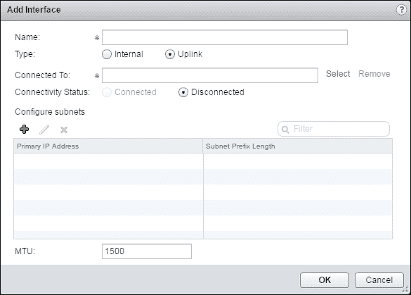

1.  配置此 NSX Edge 的接口：内部接口用于连接逻辑交换机，允许虚拟机之间的通信（东西向）。内部接口是在逻辑路由器虚拟设备上创建的，我们称之为 LIF。上行接口用于南北向通信。逻辑路由器的上行接口可以连接到 NSX Edge 服务网关、第三方路由器虚拟机，或连接到 VLAN 支持的 dvPortgroup，从而直接将逻辑路由器与物理路由器连接。为了使动态路由正常工作，必须至少有一个上行接口。上行接口作为 vNIC 在逻辑路由器虚拟设备上创建。

    ### 注意

    部署逻辑路由器后，我们可以添加、删除和修改接口。

以下截图显示了我们迄今为止执行的 DLR 配置：

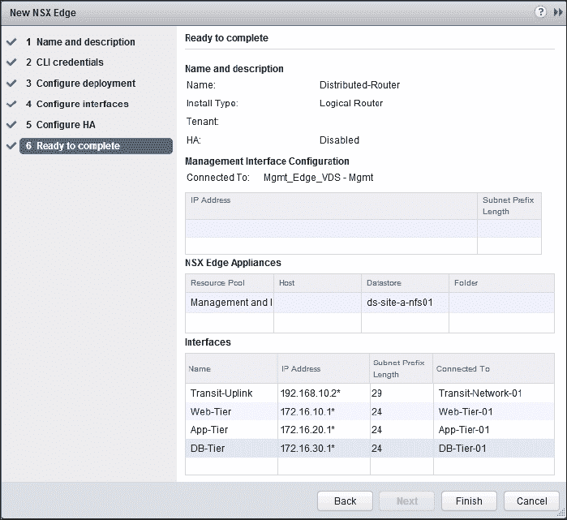

现在我们已经成功部署了一个 DLR 并配置了逻辑接口，我们希望 DLR 能够执行基本的路由功能，使 Web、应用和数据库服务器可以互相通信，这在之前是无法实现的。

以下截图显示了没有路由的三层应用架构：

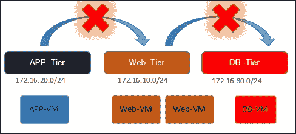

让我们进行一次快速的 ping 测试，测试`web-01a (172.16.10.11)`和`app (172.16.20.11)`之间的连通性。如下面的截图所示，Web 服务器和应用服务器能够互相通信，因为我们有一个分布式逻辑路由器，在此案例中负责路由。第一次 ping 测试结果是在添加分布式逻辑路由器之前：

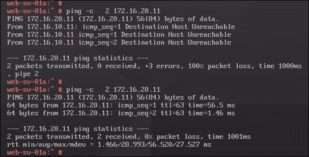

到目前为止，我们已经讨论了**分布式逻辑路由器**（**DLR**），它使 ESXi 虚拟化平台能够在本地执行路由智能，从而优化东西向的数据平面流量。但我知道我们很期待查看 ESXi 主机中的 DLR 路由表。让我们聚焦于下面的截图，了解网络拓扑。

以下截图显示了连接了 DLR 的三层应用架构：

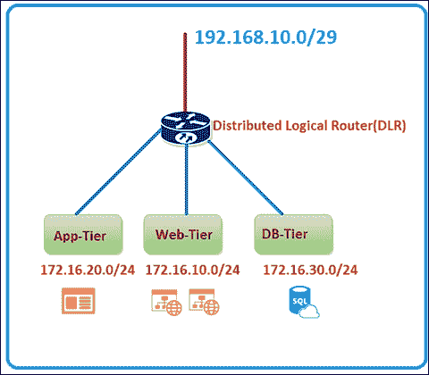

我们可能会有以下问题：

+   我们有多少个网络？

    +   172.16.10.0/24

    +   172.16.20.0/24

    +   172.16.30.0/24

    +   192.168.10.0/29

+   网络是否直接连接到路由器？

    +   是的，它们已连接到路由器。

我们将通过 SSH 登录到其中一台 ESXi 主机，检查逻辑路由器实例、MAC 地址、ARP 和路由表，这将为我们提供更详细的信息：

```
Net-vdr -I -l

```

上述命令将显示逻辑路由器实例，如下图所示。你可以看到以下参数：

+   `VDR 名称`为`default+edge-19`

+   `LIF 数量`为`4`

+   记得我们将四个逻辑网络连接到了分布式路由器吗？因此数量是`4`

+   `路由数`为`4`

由于我们已连接四个逻辑网络，因此路由器能够识别这些直接连接的网络：

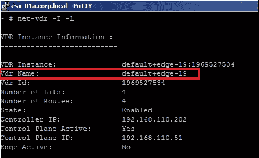

以下命令将验证由 DLR 发现的网络路由：

```
net-vdr --route -l VDR Name

```

例如：

```
net-vdr --route -l default+edge-19

```

逻辑路由器的路由表由 NSX 控制器推送到 ESXi 主机，并且在所有 ESXi 主机之间保持一致。你将看到以下输出：

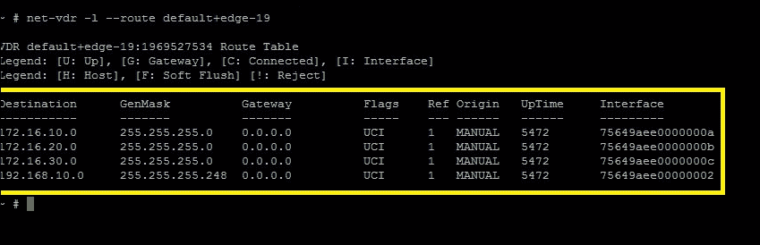

现在登录到控制器 CLI 查看逻辑路由器状态信息：

```
nvp-controller **# show control-cluster logical-routers instance all (List all LR instances)** 

```

你将看到以下输出：

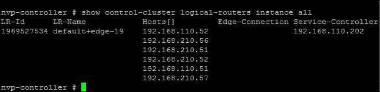

另一个命令是：

```
nvp-controller **# show control-cluster logical-routers interface-summary 1460487509** 

```

我们连接到逻辑路由器的四个逻辑交换机（VXLAN 5000、5001、5002 和 5003）都显示在以下输出中，并带有它们各自的接口 IP，这些 IP 将作为 Web、应用和数据库机器的默认网关。再次强调，这里的目的是展示 NSX CLI 命令的强大功能，它们提供了细粒度的信息，在故障排除时非常有用：

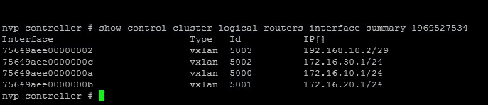

### 理解逻辑接口

我相信我们现在对 NSX 环境中分布式路由的工作原理有了充分的理解。再次强调，NSX DLR 不仅限于 VXLAN 网络；我们完全可以利用 VXLAN 和 VLAN 网络之间的路由功能。接下来让我们更详细地讨论逻辑接口：

+   如果分布式逻辑路由器连接到 vSphere 分布式交换机端口组，则该接口称为**VLAN LIF**。VLAN LIF 使用**指定实例**（**DI**）来解析 ARP 查询。NSX 控制器会随机选择一个 ESXi 主机作为指定实例，以便处理 ARP 流量，这样该子网的任何 ARP 流量都会由其中一台 ESXi 主机处理，其他所有 ESXi 主机也会知道 DI 的运行位置。

+   如果分布式逻辑路由器连接到逻辑交换机，则该接口称为**VXLAN LIF**。

+   一个 LIF 可以是上行链路接口或内部接口。

+   可以在一个分布式逻辑路由器实例上配置多个 LIF。

+   每个 LIF 都有一个 ARP 表。

+   每个 LIF 都分配了一个 IP 地址，表示它连接的逻辑网络的默认 IP 网关，并且分配了一个 vMAC 地址。每个 LIF 的 IP 地址是唯一的，而所有定义的 LIF 都分配了相同的虚拟 MAC 地址。

+   我们最多可以配置 999 个接口，最多支持 8 个上行链路。

+   路由表可以通过多种方式填充：

    +   直接连接

    +   静态路由

    +   OSPF

    +   BGP

    +   路由重分发

我们将在 第五章 中讨论动态路由和路由重分发，*NSX Edge 服务*，这将清楚地展示租户如何访问公共网络（北南连接）。

### 逻辑路由器部署注意事项

**分布式逻辑路由器** (**DLR**) 的部署在 NSX 环境中至关重要。让我们检查一些关键的决策因素：

+   在部署逻辑路由器之前，确保控制器已启动并正常运行。

+   在控制器部署期间不要部署逻辑路由器。这不仅限于 DLR 部署，适用于所有 NSX 功能。

+   如果逻辑路由器要连接到 VLAN dvPortgroups，请确保安装了逻辑路由器设备的所有虚拟化主机能够通过 UDP 端口 6999 互相访问，以便逻辑路由器 VLAN 基于 ARP 代理功能能正常工作。

+   如果两个网络位于同一 vSphere 分布式交换机上，则逻辑路由器接口不应创建在两个不同的分布式端口组（dvPortgroups）上，并且它们的 VLAN ID 应相同。

+   从 VMware NSX for vSphere 6.2 开始，L2 桥接功能现在可以参与分布式逻辑路由。桥接实例连接的 VXLAN 网络将用于连接路由实例和桥接实例。这个功能在早期版本中不支持。

+   DLR 接口不支持中继；但是，每个 DLR 接口可以连接到支持中继的 NSX Edge 子接口。不过，我们在子接口上使用 IP-Sec、L2-VPN、BGP（动态路由）、DHCP 和 DNAT 功能时有所限制。

+   DLR 支持 1,000 个逻辑接口。

+   DLR 不支持 **虚拟路由与转发** (**VRF**)。要实现真正的网络多租户功能，我们需要部署一个独特的 DLR，它可以连接到相同或不同的 NSX Edge。

+   **等价成本多路径** (**ECMP**) 在 DLR 中受支持；然而，由于存在非对称路由行为，状态全防火墙不受支持。

    ### 注意

    我们将在下一章讨论 ECMP 和非对称路由。

+   DLR 控制虚拟机不应部署在计算集群中。如果主机失败，数据平面和控制平面将同时受到影响，特别是当控制虚拟机也位于相同的 ESXi 主机上时。因此，部署 DLR 控制虚拟机的正确位置应为管理集群，或者如果我们有一个单独的 vSphere Edge 集群，那将是最佳选择。

# 层 2 桥接

在 NSX 环境中，由于多种原因，可能需要将逻辑网络连接到物理网络：

+   在 **物理到虚拟** (**P2V**) 迁移过程中，如果不更改 IP 地址

+   将虚拟服务扩展到逻辑交换机外部设备

+   将物理网络服务扩展到逻辑交换机中的虚拟机

+   访问现有的物理网络和安全资源

由于 Layer 2 桥接是 NSX Edge 分布式逻辑路由器功能的一部分，L2 桥接运行在与边缘逻辑路由器控制虚拟机相同的主机上。桥接完全在内核级别完成，就像分布式逻辑路由一样。使用了一种特殊的 dvPort 类型，称为**接收端口**，用于将数据包引导到桥接中。在以下截图中，我们有一个 VXLAN 环境，其中 VXLAN 网络 5006 中的虚拟机需要与 VLAN-100 中的物理站点进行通信：

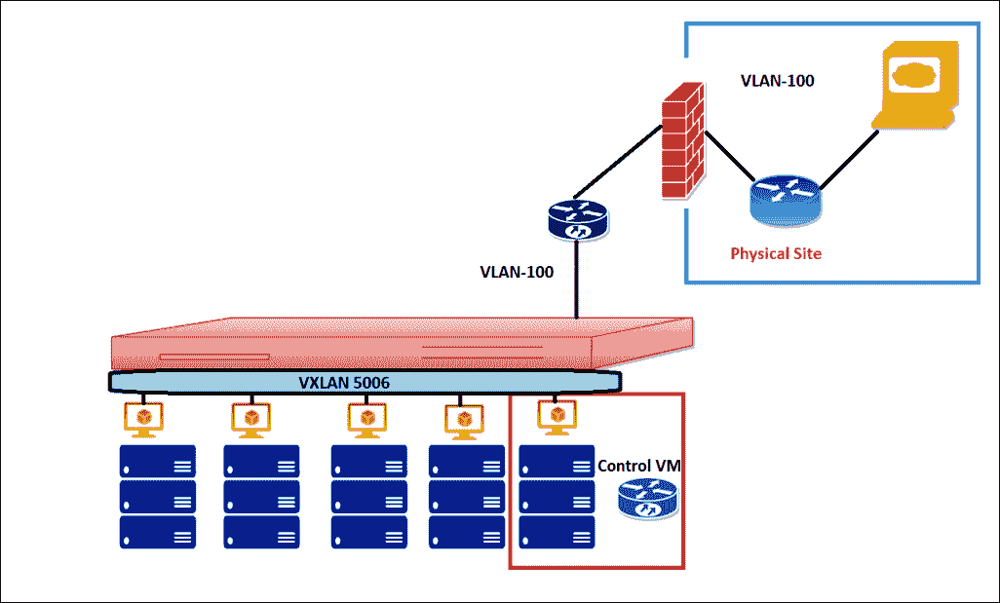

NSX Layer 2 桥接

## 部署 L2 桥接

让我们来看一下 Layer 2 桥接的部署：

1.  登录 vSphere Web 客户端。

1.  点击**网络与安全**，然后点击**NSX 边缘**。

1.  双击逻辑路由器。

1.  点击**管理**，然后点击**桥接**。

1.  点击添加图标。

1.  输入桥接的名称。

1.  选择要为其创建桥接的逻辑交换机。

1.  选择要将逻辑交换机桥接到的分布式虚拟端口组。

1.  点击**确定**。

在以下示例中，我们将逻辑交换机**bRANCH**与启用 VLAN 的**Mgmt_Edge_VDS**端口组进行桥接：

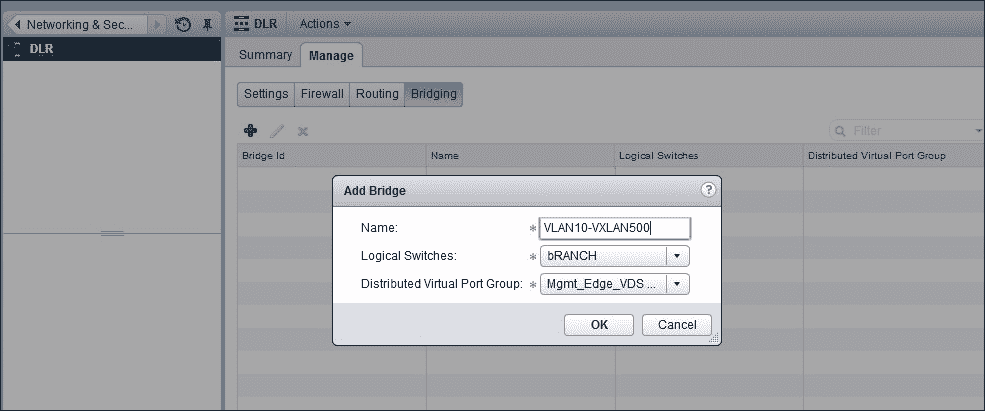

## L2 桥接的设计考虑

与任何其他 NSX 组件一样，L2 桥接是一个同样重要的设计决策因素。以下是关键要点：

+   不支持桥接 VLAN-ID 0。

+   每个逻辑路由器支持多个桥接实例；然而，我们不能在每个 VXLAN-VLAN 配对中拥有多个活动的桥接实例。

+   桥接不能用于 VLAN-VLAN 连接。

+   桥接不是数据中心互连技术。

+   从 NSX 6.2 开始，DLR 接口可以连接到与 VLAN 网络桥接的 VXLAN 网络。早期版本没有此功能。

+   不要将 DLR 和下跳路由器（NSX Edge）混合部署在同一主机上；主机故障会对这两个设备产生直接影响。

+   尽管 Layer 2 桥接是一个很好的功能，但请记住，所有的 ARP 解析都是由运行在与我们部署逻辑路由器相同主机上的桥接实例模块显式完成的。出于同样的原因，运行过多的桥接实例，尤其是它们都在同一主机上，再加上如果 UTEP 和 MTEP 也都在同一主机上运行，肯定会对性能产生影响。因此，尽量将桥接实例分布在不同的主机上，或者换句话说，跨管理集群分布逻辑路由器的部署。

# 概要

本章开始时，我们介绍了 NSX 分布式逻辑路由器，并讨论了 VXLAN 复制模式和一些数据包流程。接着，我们介绍了在部署 DLR 时的一些关键设计决策。我们还讨论了 DLR 的 Layer 2 桥接功能，并继续讲解了在利用桥接功能时需要注意的重要设计决策。

在前方有令人激动的时刻，我们将讨论越来越多的功能及其作用。

在下一章，我们将讨论 NSX Edge 路由，并通过动态路由协议与 DLR 建立连接。
