# 第五章：NSX Edge 服务

NSX Edge 是一款功能丰富的网关虚拟机，提供 L3 到 L7 的服务。Edge 网关是连接所有逻辑网络的粘合剂，提供 DHCP、NAT、路由、VPN、防火墙、负载均衡和高可用性功能。理想情况下，这些设备会在 vSphere 数据中心的边缘层进行配置。

在本章中，我们将讨论以下主题：

+   介绍 Edge 服务

+   介绍 Edge 服务外形规格

+   介绍 OSPF、BGP 和 ISIS 协议

+   DLR 与 NSX Edge 路由器之间的路由

+   NSX Edge 服务使用案例

# 介绍 Edge 服务

NSX Edge 网关是一种虚拟机，提供如网络地址转换、动态主机配置协议、DNS 转发、虚拟专用网络、负载均衡和路由功能等服务。首先，并没有一条固定的规则说我们必须通过一个 Edge 来利用所有这些功能。为了实现真正的多租户，我们可以部署多个 Edge 来满足不同功能的需求。在我们开始路由和其他话题之前，让我们先来看看 Edge 网关的外形规格。

# 介绍 Edge 外形规格

我们曾无数次地部署虚拟机，假设某些特定的值足以满足计算和存储需求。然而，当我们开始面临性能问题时，我们不得不回过头来重新检查应用程序需求。就影响而言，这通常仅限于一个虚拟机，因此来回调整和修改是可行的。然而，这种方法不适用于 NSX Edge，主要因为它是一个边缘设备，影响要大得多。出于同样的原因，选择正确的外形规格至关重要，以确保获得最佳性能。以下截图展示了每个 Edge 外形规格所提供的默认计算能力：

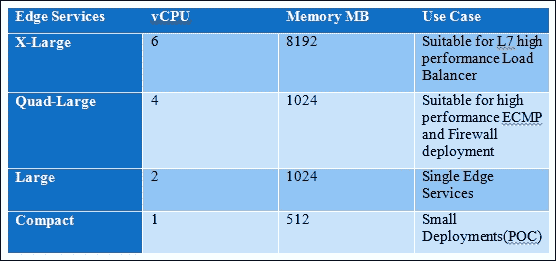

需要注意的积极方面是，我们始终可以回过头来更改这些外形规格。例如，在初始部署时，我们选择部署了**大规格**的 NSX Edge。稍后，我们可以将外形规格从**大规格改为任何更高版本**。然而，负面影响是，在此过程中，NSX Edge 服务会出现中断。因此，推荐的部署选项是选择正确的 Edge 外形规格。对于负载均衡器等服务，其中有大量的 SSL 终止和卸载任务，这些任务会消耗大量的 vCPU 周期，首选的外形规格是 Edge **X-Large**。话虽如此，我们将从 NSX 世界中最激动人心的主题之一开始。路由的简便性和功能丰富的集成，使 NSX 成为所有 vSphere 架构师的理想平台。

# 介绍 OSPF、BGP 和 ISIS

正如我们所知，VMware NSX 中的分布式路由功能提供了一种优化且可扩展的方式来处理数据中心中的东西向流量。NSX Edge 服务路由器提供传统的集中式路由。我们在企业环境中还需要什么？这两个组件，**分布式逻辑路由器**（**DLR**）和 Edge，提供了企业路由架构中的前沿解决方案。在我们开始讨论这些解决方案之间的路由如何工作的之前，让我简单介绍一下在 NSX 环境中支持的路由协议，然后我们一起探讨 DLR 和 NSX Edge 之间的 OSPF 路由协议配置。听起来有趣吗？那我们开始吧。

## 探索开放最短路径优先

根据我的经验，在教学和实验室操作中，人们常常发现理解 **开放最短路径优先**（**OSPF**）协议非常困难。所以，让我们将这个缩写分解成它的组成部分：

+   **开放**：是的，这是一个开放标准协议，由广泛的网络厂商开发。这意味着它在任何支持动态路由协议的路由器上都是公开可用的。同样，我们不仅仅局限于在 CISCO、Juniper 或其他厂商的路由器上运行 OSPF，在 OSPF 路由环境中，任何厂商的路由器都可以使用。对于多厂商部署场景，这肯定是可以配置的。

+   **最短路径优先**：**最短路径优先**（**SPF**）使用 Dijkstra 算法找到通往目标网络的唯一最短路径。

简而言之，我们有一个开放标准的路由协议，它计算到达目的地的最短路径。现在，我们将暂停一下，理解路由协议的分类，然后再回到 OSPF 的话题。路由协议有三种分类，分别是：

+   **距离矢量**：距离矢量协议通过判断距离找到通往远程网络的最佳路径。RIP 是一种距离矢量路由协议。在 RIP 路由中，路由器会选择经过最少跳数的路径来到达目标网络。矢量这个术语指的是到目标网络的方向。

+   **链路状态**：链路状态协议也叫做最短路径优先协议。在链路状态协议环境中，路由器创建三个独立的表：

    +   直接连接的邻居

    +   整个网络的拓扑

    +   路由表

    +   在后台，链路状态协议会将自己链路的状态更新发送到网络中所有其他直接连接的路由器。

+   **混合型**：混合协议是距离矢量协议和链路状态协议的结合，**增强型内部网关路由协议**（**EIGRP**）就是一个很好的例子。

### 理解基本的 OSPF 术语

为了理解 OSPF 的基础知识，让我们先澄清一些基本的 OSPF 术语：

+   **Link**: 链路是分配给任何给定网络的网络或 OSPF 路由器接口。是的，了解我们是否有多个运行状态的接口是很重要的；OSPF 不会将它们视为链路。只有当接口添加到 OSPF 进程时，它才被视为链路。

+   **Router ID**: **路由器 ID**（**RID**）是用于标识 OSPF 路由器的 IP 地址。

+   **Neighbor**: 邻居是在共同网络上拥有接口的两个或多个 OSPF 路由器：

    +   区域 ID

    +   Stub 区域标志

    +   认证密码

    +   Hello 和死亡间隔

    ### 注意

    所有上述参数应匹配以形成邻居关系。

+   **Adjacency**: 邻接关系是允许两个 OSPF 路由器直接交换路由更新的关系。这完全取决于网络类型和路由器的配置：

    +   **Designated Router**: 每当 OSPF 路由器连接到同一广播网络时，都会选举一个**指定路由器**（**DR**），以减少形成的邻接数。选择可以是手动的或基于优先级值作为第一个参数的自动化选择。同一网络上的所有路由器都将与 DR 和 BDR 建立邻接关系，从而确保所有路由器的拓扑表同步。

    +   **Backup Designated Router**: **备份指定路由器**（**BDR**）是指 DR 路由器的备份。

    +   **Hello protocol**: OSPF Hello 协议提供动态邻居发现并维护邻居关系。Hello 数据包发送到组播地址`224.0.0.5`。Hello 数据包和**链路状态广告**（**LSAs**）构建拓扑数据库。

    +   **Neighborship database**: 邻居数据库是所有可见 Hello 数据包的 OSPF 路由器列表。让我们讨论一下 OSPF 数据库如何更新。

### 更新拓扑数据库

我们知道 OSPF 路由器直接教授**直连邻居**，**整个互联网络的拓扑**，最后是**路由表**。让我们讨论一下 OSPF 路由器如何更新拓扑数据库：

+   **Link state advertisement**: 我简单地称之为 OSPF 语言；OSPF 路由器通信的方式。LSA 是包含链路状态和路由信息的 OSPF 数据包，这些信息在 OSPF 路由器之间共享。

+   **Areas**: OSPF 区域是连续网络和路由器的分组。同一区域中的所有路由器共享相同的区域 ID。以下图展示了一个简单的 OSPF 拓扑：

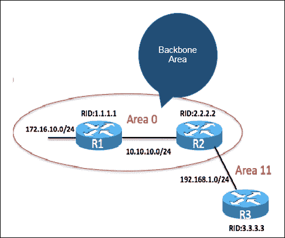

在 OSPF 中总共有八种重要的 LSA 类型：

+   **LSA Type 1: Router LSA**: 区域内的每个路由器都会向区域内传播类型 1 的路由器 LSA。

+   **LSA Type 2: Network LSA**: 网络 LSA 或类型 2 是为每个多接入网络创建的。网络 LSA 是由指定路由器生成的。

+   **LSA Type 3: Summary LSA**: **区域边界路由器**（**ABR**）将创建 LSA 3 摘要，并将 LSA 信息传递给其他区域。

+   **LSA 类型 4：汇总 ASBR LSA**：路由器需要知道在哪里找到 ASBR。在这种情况下，ABR 将生成汇总。

+   **LSA 类型 5：自治系统外部 LSA**：类型 5 LSA 将由边界路由器发送，以通知其他路由器如何通过内部网络到达边界路由器。

+   **LSA 类型 7：非截断区域 LSA**：这不允许外部 LSA（类型 5）。它所做的只是生成类型 7 LSA。

那么，类型 6 和类型 8 呢？类型 6 在 OSPF v2 中不再受支持，而类型 8 LSA 是 OSPF v3 的链路本地 LSA。类型 8 LSA 用于提供关于链路本地地址的信息以及链路上 IPv6 地址的列表。在本模块中，我们将通过在 NSX Edge 和 DLR 之间建立动态路由，讨论在 NSX 世界中应用 OSPF 的实际案例。

现在，咱们继续讨论 ISIS 协议。

## 探索中间系统到中间系统

中间系统路由协议是一种与 OSPF 类似的链路状态协议。它也被称为 ISP 规模协议，主要是因为它支持比 OSPF 更多的区域。中间系统是一个 **路由器**，而 **中间系统到中间系统**（**IS-IS**）是将数据包在中间系统之间路由的协议。IS-IS 路由器有三种类型：Level 1（区域内）、Level 2（区域间）或 Level 1-2（两者）。Level 1 路由器与同一区域的其他 Level 1 路由器交换路由信息，Level 2 路由器只能与其他 Level 2 路由器建立关系并交换信息。Level 1-2 路由器与两个级别的路由器交换信息，用于连接区域间路由器和区域内路由器，如下图所示：

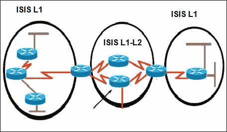

简要了解 ISIS 协议后，让我们现在来理解 **边界网关协议**（**BGP**）。

### 探索边界网关协议

首先，最重要的是，这是一种外部网关协议。BGP 主要由**互联网服务提供商**（**ISP**）和大型企业公司在与多个 ISP 连接时使用。它的作用就是将较小的自治（互联网络）绑定在一起，以确保无论位置如何，都能够实现高效的路由。BGP 本质上是由一组自治系统组成的。这就引出了另一个问题：什么是自治系统？**自治系统**（**AS**）是由共同管理的网络组成的群体。就像私有和公有 IP 的概念一样，AS 也有私有和公有的编号。公有 AS 编号的范围是 1 到 64511，私有 AS 编号的范围是 64512 到 65535。当我们在一个 AS 内进行路由时，它被称为 iBGP 路由，而 eBGP 则是指在两个不同的自治系统之间进行路由。形成 BGP 对等连接的过程非常简单。需要建立一个 TCP 会话，BGP 的源端口是临时端口，目标端口为 TCP 端口 179。下图展示了 iBGP 和 eBGP 的拓扑结构：

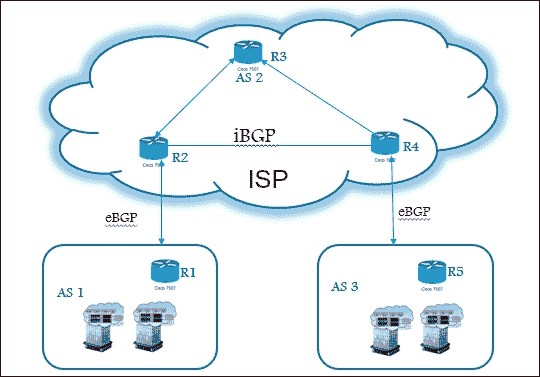

我对 BGP、ISIS 和 OSPF 的解释有所限制，主要是因为要覆盖所有的路由协议方面内容，就需要写一本不同的书。话已说完——让我们通过配置 OSPF 路由来完成网络拓扑。在我们开始配置分布式逻辑路由器和 NSX Edge 网关之间的路由之前，让我们回到第四章中使用的实验拓扑，*NSX 虚拟网络与逻辑路由器*，理解我们现在的位置以及接下来的要求。从下图可以清楚地看到，我们已经在 web、app 和 DB 网络之间建立了路由。现在是时候提出一些问题了。我们需要让这些网络通过一个中继网络与另一个网络（192.168.100.0/24）通信。我们该如何做到呢？我们能否将中继网络连接到 NSX Edge 并利用动态路由功能，使得应用、Web 和数据库能够与外部网络通信？

下图展示了利用 DLR 功能的三层应用：

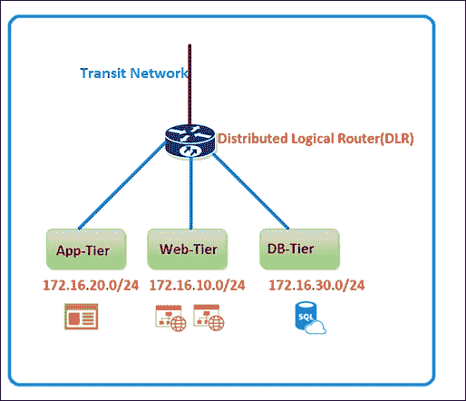

# 部署 NSX Edge 网关

NSX Edge 网关是一个边缘设备，因此，网络虚拟化数据中心中的所有入口和出口流量必须通过 Edge 设备，并最终到达上游路由器。在我们的例子中，三层应用需要与外部网络（192.168.100.0/24）通信，因此需要部署一个 Edge 网关。让我们部署一个 NSX Edge 网关并与分布式逻辑路由器（DLR）连接。简而言之，我们所做的就是将两个路由器连接起来，为它们创建一个动态路由环境，以便交换网络，从而最终使得我们的三层应用能够与网络 192.168.100.0/24 进行通信。

步骤如下：

1.  在 vSphere Web 客户端首页标签中，点击**库存** | **网络与安全**。

1.  在左侧导航窗格中，选择**NSX Edge**。

1.  在中间窗格中，点击绿色加号打开**新建 NSX Edge**对话框。

1.  在**名称和描述**页面，保持选择**Edge Services Gateway**。

1.  在**名称**文本框中输入`Perimeter Gateway`并点击**下一步**。

    以下截图显示了 NSX Edge：

    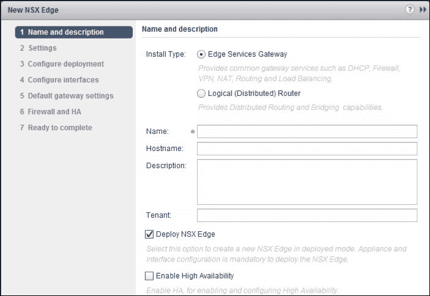

1.  在 CLI 凭证页面，在**密码**文本框中输入密码。

1.  正确输入密码，因为没有提供验证框：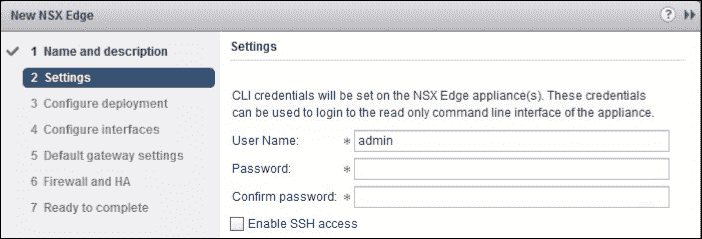

1.  在**配置部署**页面，确认**数据中心**选择的是我们在初始 vSphere 集群设计阶段创建的 Edge 集群。

1.  确认**设备大小**选择为**Compact**。

1.  确认**启用自动规则生成**复选框已选中。

    ### 注意

    NSX Edge 添加防火墙、NAT 和路由，以便控制流量通过这些服务。如果此选项被禁用，我们需要手动创建防火墙规则，这是繁琐的工作。

1.  在**NSX Edge 设备**下，点击绿色加号，如下截图所示，打开**添加 NSX Edge 设备**对话框，并执行以下操作：

    1.  从**集群/资源池**下拉菜单中选择**管理和 Edge 集群**。

    1.  从**数据存储**下拉菜单中选择**共享数据存储**。

    1.  保持其他字段为默认值并点击**确定**。

    1.  点击**下一步**，如以下截图所示：

    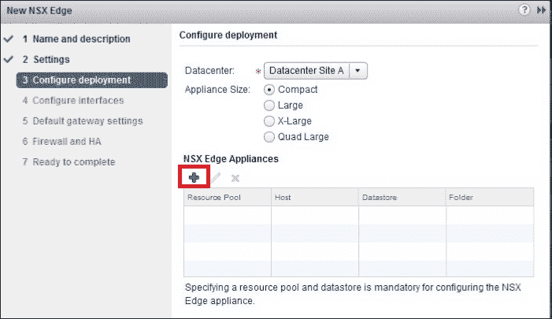

1.  在**配置接口**页面，点击绿色加号打开**添加 NSX Edge 接口**对话框，并执行以下操作配置两个接口中的第一个：

    1.  在**名称**文本框中输入`Uplink-Interface`。

    1.  对于**类型**，保持选择**上行链路**。

    1.  点击**连接到** | **选择**链接。

    1.  点击**分布式端口组**。

    1.  点击**Mgmt-Edge-VDS-HQ 上行链路**按钮并点击**确定**。

    1.  点击**配置子网**下方的绿色加号。

    1.  在**添加子网**对话框中，点击绿色加号添加一个 IP 地址字段。

    1.  在**IP 地址**文本框中输入`192.168.100.3`并点击**确定**确认输入。

    1.  在**子网前缀长度**文本框中输入**24**。

    1.  点击**确定**关闭**添加子网**对话框。

    1.  保持其他设置为默认值并点击**确定**。

1.  点击绿色加号打开**添加 NSX Edge 接口**对话框，并执行以下操作配置第二个接口：

    1.  在**名称**文本框中输入`Transit-Interface`。

    1.  对于**类型**，点击**内部**。

    1.  点击**连接到** | **选择**链接。

    1.  点击**Transit-Network**按钮并点击**确定**。

    以下截图显示了 NSX Edge 接口选择：

    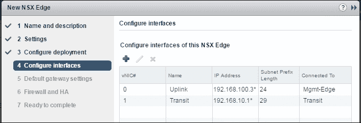

1.  点击**下一步**。

1.  在**默认网关设置**页面上，勾选**配置默认网关**复选框。

1.  验证**vNIC**选择是否为**上行链路接口**。

1.  在**网关 IP**文本框中输入`192.168.100.2`。

1.  此值是一个路由器的 IP 地址，该路由器可在 HQ 上行链路端口组中使用。

1.  保留其他所有设置为默认值并点击**下一步**，如下图所示：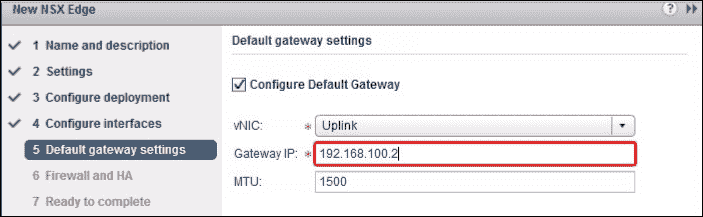

1.  在**防火墙和高可用性**页面上，勾选**配置防火墙默认策略**复选框。

1.  对于**默认流量策略**，点击**接受**。

    ### 注意

    这是一个非常重要的步骤，因为默认情况下，所有流量都被阻止。

    **配置高可用性参数**。高可用性（HA）确保通过在虚拟化基础架构上安装一对活动的 Edge 设备，使 NSX Edge 设备始终可用，关于 Edge 高可用性模块的详细内容将进一步讨论。因此，目前我们将其余设置保持不变。以下截图展示了 Edge 防火墙和 HA 设置：

    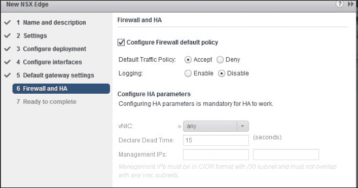

1.  在**准备完成页面**上，查看配置报告并点击**完成**。

所以，我们已部署了**分布式逻辑路由器**，然后是**NSX Edge 网关**。再一次，主要目的是让我们的 Web、应用和数据库服务器与网络 192.168.100.0/24 通信，而且我们确信这些网络不是直接连接的网络。在继续配置路由之前，让我们快速查看以下图示，看看当前的拓扑结构。

下图展示了连接到 DLR 的三层应用程序和 DLR 与 Edge 的连接：

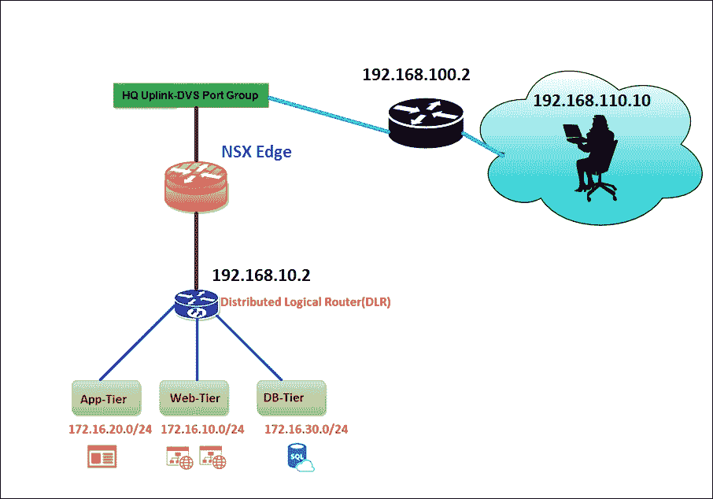

现在我们已完成 NSX Edge 部署，接下来将继续配置 NSX Edge 上的 OSPF。

# 配置 NSX Edge 上的 OSPF

在 NSX Edge（边缘防火墙）上配置 OSPF 路由允许逻辑网络通过逻辑路由器进行学习，并通过传输网络进行分发。具体步骤如下：

1.  在路由类别列表中，选择**全局配置**。

1.  在**动态路由配置**面板中，点击**编辑**以打开**编辑动态路由**，如下图所示：

1.  在**动态路由配置**对话框中，执行以下操作：

    +   从**路由器 ID**下拉菜单中选择**上行链路 - 192.168.100.3**。

    +   勾选**启用 OSPF**复选框。

    +   保留所有其他字段为默认值，并点击**保存**，如下图所示：

    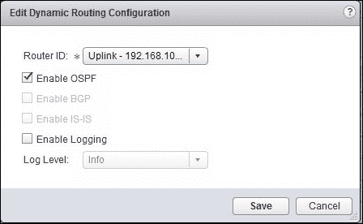

1.  在**全局配置**页面顶部，点击**发布更改**。

1.  在路由类别面板中，选择**OSPF**。

1.  在区域定义列表中，验证是否出现具有以下属性的区域，如下图所示：

    +   **区域 ID**：**0**

    +   **类型**：**正常**

    +   **身份验证**：**无**

    

    ### 注意

    区域 0 是 OSPF 中的默认区域，所有其他区域将连接到区域 0。

1.  在区域定义列表的上方，点击绿色加号以打开**新建区域定义**对话框，并执行以下操作：

    +   在**区域 ID**文本框中输入**10**。

    +   保留所有其他设置为默认值，并点击**确定**。

1.  在**区域接口映射**下，页面底部点击绿色加号以打开**新建区域到接口映射**对话框，并执行以下操作：

    +   确认**vNIC**选择为**上行接口**。

    +   从**区域**下拉菜单中选择**0**。

    +   保留所有其他字段为默认值，并点击**确定**。

1.  在**区域接口映射**下，页面底部点击绿色加号以打开**新建区域到接口映射**对话框，并执行以下操作，如下图所示：

    +   从下拉菜单中选择**过境**-接口。

    +   从**区域**下拉菜单中选择**10**。

    +   保留所有其他字段为默认值，并点击**确定**：

    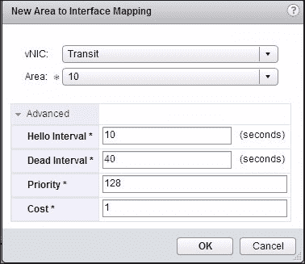

1.  在 OSPF 页面顶部，点击**发布更改**。

    ### 注意

    我们可以通过 OSPF 配置 Perimeter Gateway 发布的子网类型。

1.  在**路由**类别面板中，选择**路由重分发状态**。

1.  在**路由重分发表**下，页面底部点击绿色加号以打开**新建重分发标准**对话框，并执行以下操作：

    +   在**允许学习自**下，选中**已连接**复选框。

    +   现在可以学习连接到 Perimeter Gateway 的子网。

    +   保留所有其他设置为默认值，并点击**确定**，如下图所示：

    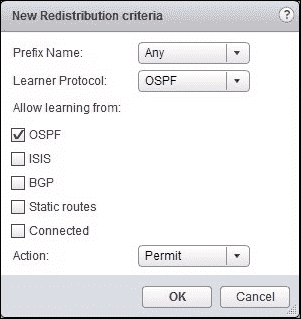

1.  在**路由重分发状态**面板的页面顶部，查看 OSPF 旁边是否出现绿色勾选标记。此时没有，如下图所示：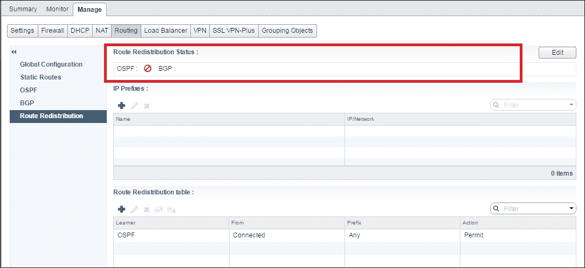

1.  如果没有出现绿色勾选标记，请执行以下操作：

    +   在**路由重分发状态**面板的右侧，点击**更改**。

    +   在**更改重分发设置**对话框中，选中**OSPF**复选框，如下图所示：

    +   点击**保存**。

    +   在**路由重分发状态**面板的页面顶部，确认 OSPF 旁边出现绿色勾选标记：

    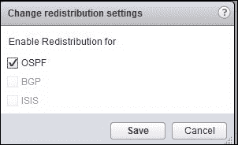

1.  在页面顶部，点击**发布更改**：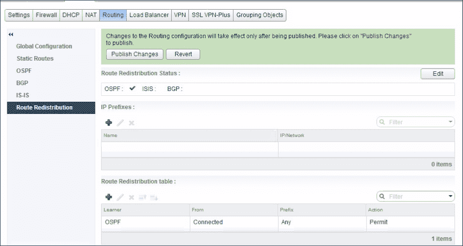

通过上述步骤，我们已成功在外围网关上配置了 OSPF。到目前为止，我们所做的只是为外围网关选择了一个**路由器 ID**并启用了 OSPF。随后，我们创建了 Area-10，并进行了区域到接口的映射，最后启用了**路由重分发**。接下来，让我们回顾一下在 NSX Edge 部署过程中选择的防火墙策略；我们已经允许了流量并选中了**启用自动规则生成**复选框。在本示例中，我们已经在 NSX Edge 上配置了 OSPF，并且我们期望防火墙表中自动配置 OSPF 规则。让我们通过切换到**外围网关** | **管理** | **防火墙**标签来验证这一点，如下图所示：

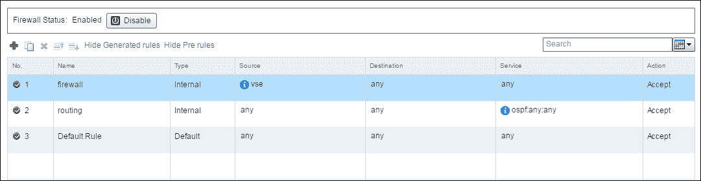

如我们所见，已经自动配置了三条防火墙规则：两条**内部**规则和一条**默认**规则。现在，OSPF 进程已在 NSX Edge 上运行，并且防火墙规则已自动配置，接下来我们继续在分布式逻辑路由器上配置 OSPF。

# 在分布式逻辑路由器上配置 OSPF 路由

让我再次强调分布式逻辑路由器的使用案例。DLR 的核心目的是实现智能的东西向路由，这允许虚拟机之间的通信无需通过传统的数据中心逐跳路由。接下来，让我们在 DLR 上配置 OSPF：

1.  在**路由**类别面板中，选择**全局配置**。

1.  在**动态路由配置**面板的右侧，点击**编辑**。

1.  在**编辑动态路由配置**对话框中，从**路由器 ID**下拉菜单中选择接口为**Transit 和 192.168.10.2**，如下面的截图所示：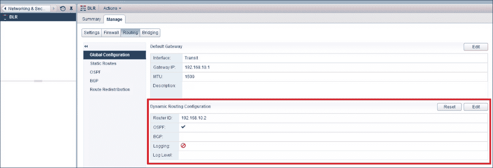

1.  在配置 OSPF 之前，必须指定此设置。

1.  保留其他字段的默认值并点击**保存**。

1.  在**全局配置**页面的顶部，点击**发布更改**。

1.  在**路由**类别面板中，选择**OSPF**。

1.  在**OSPF 配置**面板的右侧，点击**编辑**以打开**OSPF 配置**对话框，并执行以下操作：

    1.  选择**启用 OSPF**复选框。

    1.  在**协议地址**文本框中输入`192.168.10.3`。

    1.  在**转发地址**文本框中输入`192.168.10.2`。

        ### 注意

        **协议地址**：与其他路由器建立路由协议会话。在我们的示例中，该地址将用于与 NSX Edge 外围网关建立路由协议会话。**转发地址**：用于路由器数据路径模块在主机中转发数据路径包的 IP 地址。

1.  点击**确定**：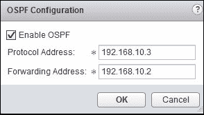

1.  在**区域定义**面板中，点击绿色加号打开**新建区域定义**对话框。

1.  在**区域 ID**文本框中输入**10**。

1.  将所有其他字段保留为默认值，然后点击**确定**。

1.  在**区域到接口映射**面板中，点击绿色加号以打开**新的区域到接口映射**对话框。

1.  确认**接口**选择为**传输**。

1.  从**区域**下拉菜单中选择**10**。

1.  将所有其他字段保留为默认值，然后点击**确定**。

1.  在**OSPF 配置**页面顶部，点击**发布更改**。

1.  更改发布后，请验证**OSPF 配置状态**是否为**已启用**，如下截图所示: 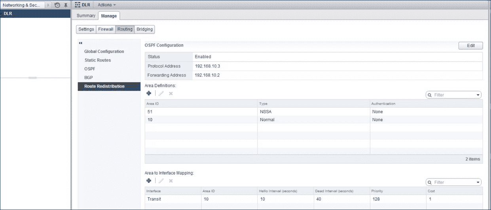

1.  我们可以通过 OSPF 配置广播的分布式路由器的子网类型：

    +   在**路由**类别面板中，选择**路由重分发**。

    +   在**路由重分发表**中，选择出现的单个条目，点击铅笔图标以打开**编辑重分发标准**对话框，并验证以下设置：

        +   **前缀名称**: 任意

        +   **学习协议**: **OSPF**

        +   **允许学习来自**: **连接**

        +   **动作**: **允许**

1.  点击**取消**。

1.  如果默认路由重分发条目未出现在列表中或未按指定配置进行配置，请点击绿色加号并配置第 13 步指定的标准创建新的路由重分发。下图显示了 OSPF 路由重分发表: 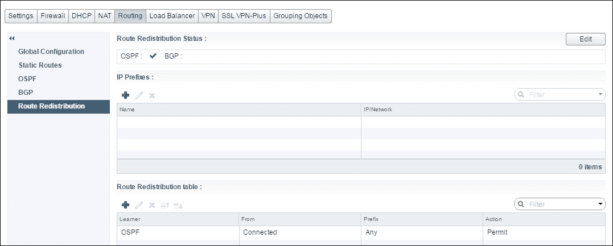

让我们验证分布式路由器防火墙策略，确认我们是否有必要的 OSPF 学习规则。我们当然已经填充了 OSPF 自动规则；然而，唯一的区别是默认规则是**拒绝**，如下截图所示**。** 我们当然会检查该规则是否在我们的示例中阻止了任何流量。目前，我们不会更改该规则:

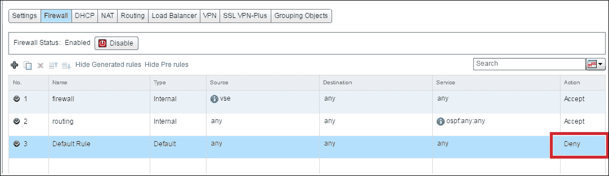

即使 NSX GUI 很好，我们无法查看路由表；我们只能运行 CLI 命令进行检查，我们有两种方法可以做到这一点:

+   直接控制台到 NSX Edge 和逻辑路由器

+   SSH 会话到 NSX Edge 和逻辑路由器。

让我们 SSH 到 NSX Edge。我们正在使用 IP 地址`192.168.100.3`连接到 NSX Edge。从此输出中可以注意到一些有趣的事情，如下截图所示：

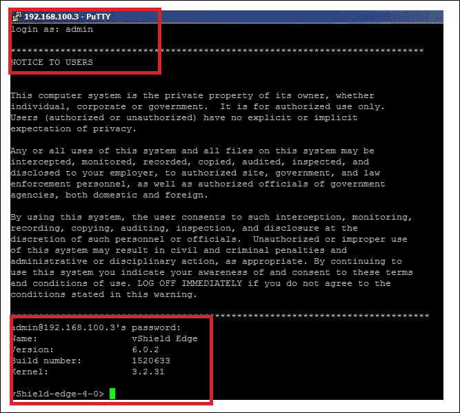

名称被标注为**vShield Edge**。不要因为这个输出而感到尴尬。正如在第一章中所解释的，*网络虚拟化介绍*，NSX 是一个由 VMware **vCloud Networking Security**（**vCNS**）创建的产品。不管我们是进行 NSX 的绿地部署，还是在旧的 VCNS 升级为 NSX 的棕地部署中，边缘设备仍然会显示为 vShield Edge。然而，根据 VCNS/NSX 管理版本的不同，版本号肯定会有所不同。我们列出一些显示命令，并记下几项配置：

+   `Show IP OSPF interface`：此命令将显示运行 OSPF 协议的接口。例如，如果一个路由器有 10 个接口，其中只有两个接口连接到 OSPF 区域，则只会列出这两个接口：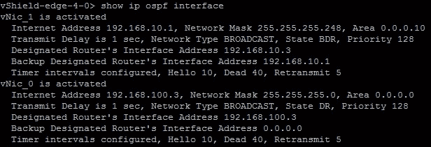

    我们在 OSPF 配置中有两个接口：

    192.168.10.1（传输接口）

    192.168.100.3（上行）

+   `Show IP OSPF neighbor`：此命令显示我们 OSPF 邻居的 IP 地址，如下图所示的输出：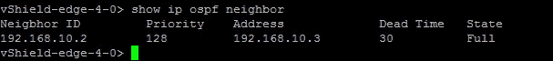

    邻居 ID 是`192.168.10.2`。NSX Edge 的传输接口（`192.168.10.1`）连接到邻居 DLR，DLR 的 IP 地址为`192.168.10.2`，它们的 OSPF 状态为`Full`（在此状态下，NSX Edge 和 DLR 已经完全邻接）。当 OSPF 邻接关系建立时，路由器会经历几个状态变化，直到与邻居完全邻接。状态包括`Down`、`Attempt`、`Init`、`2-Way`、`Exstart`、`Exchange`、`Loading`和`Full`。我花了很多时间和练习才能理解 OSPF 的基础。我使用 GNS3 进行过无数次实验，并进行了很多 Wireshark 捕获，Wireshark 能提供有关 LSA 包的详细信息，精确展示通信如何进行。对于那些觉得跟不上我步骤的人，我的建议是记录下所有步骤，并不断绘制拓扑图。

+   `Show IP route`：`Show IP route`命令将显示该路由器的完整路由表：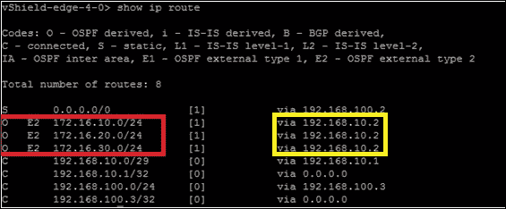

    从上面的截图中，我们可以看到：

    总共有 8 条路由，其中有三条 OSPF 路由，分别对应网络 172.16.10.0、172.16.20.0 和 172.16.30.0/24

    请查看黄色高亮的列，以了解 NSX Edge 周边网关是通过哪个 IP 地址进行学习的—192.168.10.2（DLR 传输接口）

+   `Show IP OSPF database`：此命令显示 IPv4 OSPF 数据库。故障排除 OSPF 的最糟糕方式就是不查看数据库。我见过的根本问题是，我们发现输出内容非常冗长，不确定从哪里开始以及该看什么。请看以下从 NSX Edge 捕获的 OSPF 数据库输出。即使在一个简单的网络中，拓扑表也看起来非常冗长且令人困惑，假设一个企业网络的 OSPF 数据库呢？以下截图展示了一个 OSPF 数据库：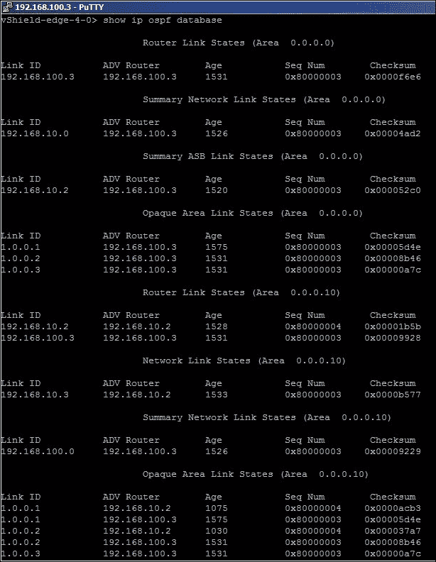

目前，我们将记录一些配置细节：

+   OSPF 是一种链路状态路由协议。根据网络和区域的类型，它将有一个唯一的链路状态表。因此，我们在输出中看到了相同的内容。

+   在我们的例子中，我们有两个区域：

    +   链路 ID - 这是 L1 的 OSPF 路由器 ID，类型为 L2。不过，对于 L3，一个 L5 类型的 LSA 中，链路 ID 是一个网络地址。

    +   区域 10 的链路状态类型：

        +   路由器链路状态

        +   网络链路状态

        +   汇总链路状态

        +   不透明区域链路状态

    +   区域 0（骨干区域）

    +   区域 10（我们创建的普通区域）

这是另一个令人费解的问题：为什么我们在区域 10 中有网络链路状态 LSA？我们所做的只是将 DLR OSPF 路由器通过传输网络连接到 NSX Edge，而传输网络是一个点对点连接。好吧，这就是我需要大家更加集中注意力的地方。传输网络是一个逻辑交换机，它实际上只是一个 vSphere 端口组（L2 段）。这是我们在区域 10 中有网络 LSA 的主要原因。路由器不是点对点连接的；它们是连接到一个逻辑交换机，**指定路由器**（**DR**）会发送类型 2 LSA。汇总 LSA 将帮助路由器从一个区域到另一个区域到达前缀。不透明 LSA 在路由平台（MPLS 流量工程）中的实际应用中使用。

够了，解释这张图的目的就是，理想情况下，当 OSPF 路由表被填充后，我们通过做一个简单的 ping 测试来验证，之后我们从不考虑它们实际是如何工作的。关于 OSPF，我们还有很多可以讨论的内容；不过，这些内容超出了本书的范围。让我们看一下以下图示，它展示了整个拓扑以及 OSPF 路由表：

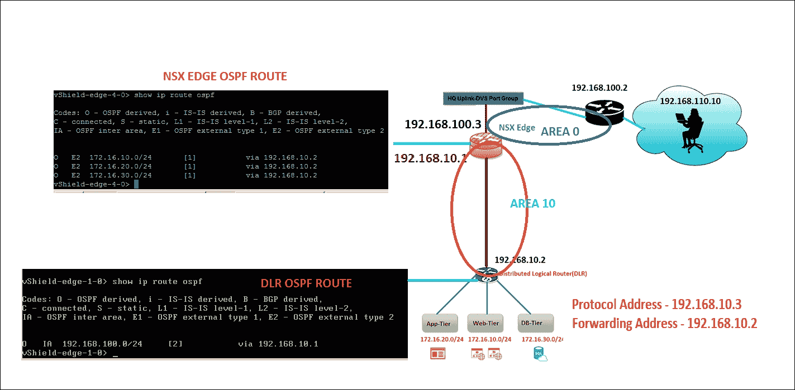

在 DLR 和 NSX Edge 之间具有动态路由能力，我们的三层应用应该能够访问`192.168.110.10`机器，反之亦然。让我们登录到应用服务器，确认是否能够访问`192.168.110.10`。

以下截图显示了从应用服务器（172.16.20.11）到外部网络 192.168.110.0/24 的连接成功，这在之前是无法实现的：

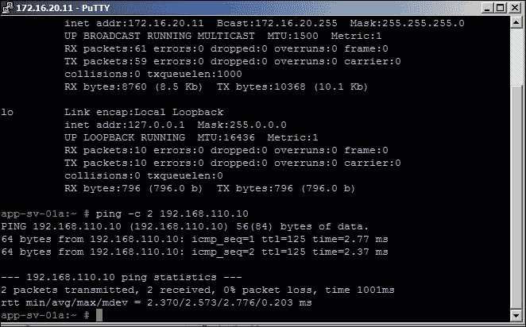

这就是我们的路由模块的总结。我知道很难回忆起到目前为止为建立虚拟化路由环境所做的一切。为了便于记忆，我将它总结为六个步骤：

1.  创建了三个逻辑交换机。

1.  从 NSX Manager 部署了一个分布式逻辑路由器。

1.  NSX 控制器将 DLR 配置推送到底层的 ESXi 主机。

1.  部署了一个 NSX Edge 设备，并在 Edge 和 DLR 上配置了 OSPF。

1.  所有学习到的路由都会推送到 NSX 控制器。

1.  NSX 控制器更新 ESXi 主机 DLR 路由表。

我们现在将进入下一个部分。

# NSX 路由设计决策

假设我们已经决定了某个特定用例所需的路由协议。设计因素是确保它们完美运行的关键：

+   如果我们是服务提供商，并且需要为 DLR 控制 VM 和 **边缘服务网关** (**ESG**) 提供多租户支持，我们应该部署一个单独的实例，这将简化管理。我们还可以实现租户之间的真正隔离。

+   **区域边界路由器** (**ABR**) 应该是物理路由器。

+   如果我们没有为 ESG 和 DLR 使用 **高可用性** (**HA**) 功能，请确保租户 ESG 和 DLR VM 不在同一 ESXi 主机上。然而，推荐的做法是为 DLR 控制 VM 和 ESG 启用 vSphere HA。

+   如果 ESG 中接口不足，我们应利用 trunk 接口，使多个 DLR 可以连接到同一个 ESG。

+   DLR 与 DLR 之间的对等连接不可行。

+   不支持 **IPsec** 与动态路由配合使用。

+   在可能的地方使用路由汇总。

+   DLR 控制 VM 不支持 ABR 配置；然而，它支持正常和 NSSA 区域。

根据我们选择的物理网络类型和供应商，有很多其他设计参数，我们需要明确遵循这些参数，以确保我们能够兼得两全。我强烈建议在实施 NSX 之前阅读供应商设计指南。我不指望每个人都进行 Google 搜索。在第八章，*NSX 故障排除* 中，我将提供所有外部指南链接，届时我们应该在部署 NSX 设置之前参考这些链接。

# NSX Edge NAT

我们如何合并两个具有重复地址的内部网，并确保分配了私有 IP 的主机能够通过互联网与其他主机通信？只有一个解决方案：**网络地址转换** (**NAT**）。

NSX Edge NAT 支持两种类型的 NAT 服务：

+   **源 NAT (SNAT)**：将内部私有 IP 地址转换为公共地址以进行出站访问

+   **目标 NAT (DNAT)**：将公共 IP 地址转换为内部私有地址以进行入站访问

好的，让我们来看看这个功能是如何工作的。在下图中，我们的一个应用服务器需要与公网进行通信。我们可以看到应用服务器**172.16.20.1**向 NSX Edge 发送了一个外发数据包。根据 NSX 管理员之前配置的 NAT 条目，Edge 会进行 NAT 表查找。由于我们配置了**源 NAT**，并且该配置是针对**172.16.20.1**的，因此它会将 IP 地址转换为**170.168.2.1**，即公网 IP。这是一个非常简单的 1:1 NAT 配置示例，用于外向访问。但请记住，Edge 还具有防火墙功能，默认情况下，它会阻止所有流量。因此，仅进行 NAT 是不够的；我们需要在防火墙表中允许相应的源和目的 IP：

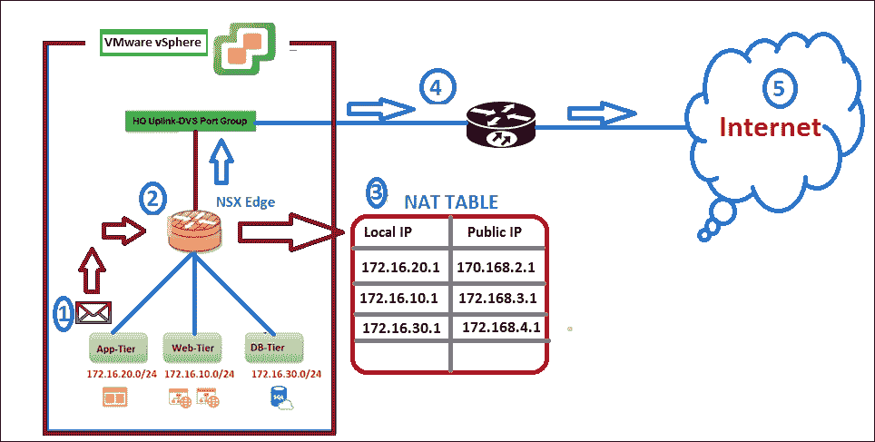

现在让我们继续检查一下在 NSX Edge 中的 NAT 表配置是什么样的：

1.  登录到 VMware vSphere Web 客户端，切换到**网络与安全**解决方案页面。

1.  在**NSX Edge 管理**页面，双击处理 NAT 的 NSX Edge 实例。下图展示了 NSX Edge 的 NAT 配置：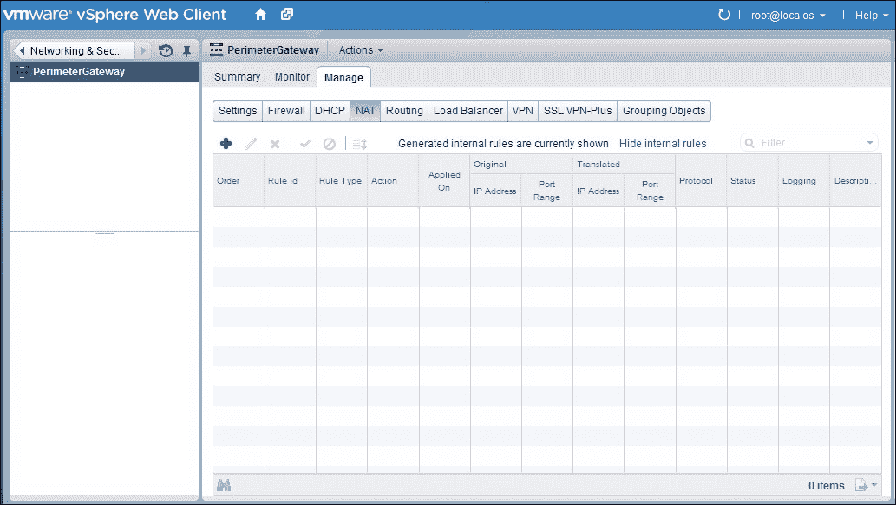

    由于目前我们没有创建任何规则，所以此时表中没有任何内容。让我们进一步探讨 DNAT 和 SNAT 选项：

点击添加图标，选择**添加 DNAT 规则**，并根据业务用例配置以下设置：

+   **应用于**：应用目标 NAT 规则的接口，例如，外部链接。下拉菜单将显示该 NSX Edge 实例的所有 10 个接口的名称。

+   **原始 IP**：原始（公网）IP 地址，格式如下：

    +   IP 地址 172.168.2.1

    +   IP 地址范围 172.168.2.1-172.168.2.3

    +   IP 地址/子网 172.168.2.1/24

+   **协议**：应用程序使用的协议（我们可以简单地更新为**任何**）

+   **原始端口/范围**：原始端口、端口范围或****任何****端口

+   **翻译后的 IP/范围**：由于这是一个 DNAT 规则，翻译后的 IP 将是内部/私有 IP 范围

+   **翻译后的端口/范围**：在内部/私有网络中的翻译后端口或端口范围

如果所有前述参数都配置正确，并且防火墙规则已启用相同配置，那么我们的内部机器将可以从公网访问。在我们的示例中，我们进行了 1:1 DNAT 配置。如下图所示：

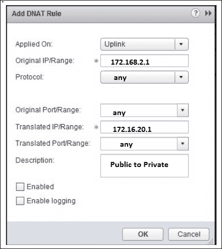

NAT 是 NSX 负载均衡器功能的一个组成部分，我们需要了解 NAT 如何工作，才能理解这一功能。最后但同样重要的是，我们生活在一个没有完美的世界；当出现问题时，我们需要开始排查。一个常见的问题是，并不是 NAT 配置错误，而是中间的罪魁祸首——防火墙，它阻止了所有流量，人们可能会困惑，*我在这个设置中到底错过了什么？* 好吧，不再废话了，让我们继续讨论 NSX Edge 逻辑负载均衡器。

# NSX Edge 逻辑负载均衡器

当我们谈论负载均衡器时，传统的负载均衡器通常放置在汇聚层。负载均衡可以通过硬件、软件或两者的组合来实现。负载均衡的早期方法之一是轮询 DNS。在当前的云时代，我们的应用程序运行在多租户环境中，负载均衡的需求也随之增加。简而言之，如果每个应用层都需要一个负载均衡器，那么获得最佳性能将变得极为困难。这就是虚拟负载均衡器相比物理负载均衡器发挥重要作用的地方。

NSX Edge 负载均衡器使得网络流量可以通过多个路径到达特定目标。负载均衡器将传入的服务请求均匀地分配给多个服务器（虚拟机）。因此，负载均衡有助于实现资源的最佳利用，最大化吞吐量，最小化响应时间，并避免过载。NSX Edge 提供最多至第 7 层的负载均衡功能。让我们熟悉一些在所有负载均衡器中都非常常见的负载均衡术语。

## 服务器池

运行相似应用程序的机器组会被添加到这个池中。这是部署负载均衡器时需要规划的一个关键设计决策。首先，识别需要加入服务器池的虚拟机集。

## 虚拟服务器

这是服务器池中的机器将从负载均衡器接收会话的地址。每个虚拟服务器将拥有一个唯一的**虚拟 IP**（**vIP**）。vIP 是一个 IP 地址，并且还包含服务端口号。

## 应用配置文件

应用配置文件是我们配置访问协议类型（TCP、HTTP 和 HTTPS）以及需要使用哪种负载均衡算法的地方。NSX 负载均衡器支持多种负载均衡算法。

NSX 负载均衡器有两种模式：

+   **代理模式**：单臂负载均衡模式也称为代理模式。NSX Edge 网关使用一个接口来发布 vIP 地址并连接到 Web 服务器。

+   **内联模式**：内联负载均衡模式也称为透明模式。NSX Edge 网关使用以下接口：

    +   用于发布 vIP 地址的接口

    +   用于连接到 Web 服务器的接口

    +   Web 服务器必须将 NSX 边缘网关设置为默认网关

# 负载均衡设计考虑因素

在设置 NSX 负载均衡器时应遵循一些最佳实践。让我们在进行实验之前仔细阅读以下几点：

+   根据服务器池的数量，负载均衡器的数量也会增加。然而，正因为每个租户都有自己的负载均衡器，管理和配置的变更不会影响其他租户的负载均衡器。

+   在 HA 模式下部署负载均衡器以实现高可用性。

+   确保不要在与基础负载均衡机器相同的机器上部署负载均衡器。遵循最佳实践，将其部署在不同的 ESXi 主机或单独的管理边缘集群中。

+   根据应用程序特性选择正确的负载均衡协议。例如，轮询、最少连接、哈希和最少负载是一些常见的算法。

+   一个常见的问题是，*我们需要端到端的 SSL 连接，还是需要终止或卸载 SSL 流量？*

+   注意负载均衡器的带宽和每秒连接数（**CPS**）。

+   一个经验法则是在投入生产环境之前测试负载均衡器的功能，特别是如果这是我们第一次在 NSX 环境中对应用请求进行负载均衡的话。

+   最后，我们需要决定是否愿意把所有鸡蛋放在一个篮子里。这与 NSX 负载均衡器有什么关系呢？嗯，请记住，没有任何东西阻止我们在同一个 Edge/DLR 上配置路由/NAT/VPN/DHCP 等 Edge/DLR 服务功能。因此，仔细规划 Edge/DLR 上需要运行的服务类型。

现在是时候回顾我们到目前为止讨论的所有与 NSX 负载均衡器相关的内容了，我们的目标是对 Web 服务器进行 SSL 负载均衡。然而，在本实验中，我不会使用 SSL 证书来配置 Web 服务器；因此，我们将坚持使用客户端到负载均衡器的 SSL 配置。让我们开始吧。首先，我们目前还没有生成任何 SSL 证书。在这个示例中，我们将使用自签名证书并利用它。

# 生成证书

我们将生成证书请求，并指示 VMware NSX Edge 实例从该请求创建自签名证书：

1.  在左侧导航窗格中，选择**NSX 边缘**。

1.  在边缘列表中，双击**边界网关**条目以管理该对象。

1.  点击**管理**标签并点击**设置**。

1.  在设置类别面板中，选择**证书**。

1.  从**操作**下拉菜单中选择**生成 CSR**以打开**生成 CSR**对话框，并执行以下操作：

    +   在**通用名称**文本框中输入**Webload**。

    +   在**组织名称**文本框中输入**Loadbalancer**。

    +   验证是否选择了**RSA**作为**消息算法**。

    +   验证是否选择了**2048**作为**密钥大小**。

    +   保留所有其他设置为默认值，然后点击**确定**。

1.  在证书列表中，选择新生成的签名请求，然后从**操作**下拉菜单中选择**自签名证书**。

1.  在提示时，在**天数**文本框中输入**365**，然后点击**确定**。

以下截图展示了**生成 CSR**界面，我们需要更新到目前为止讨论的所有步骤：

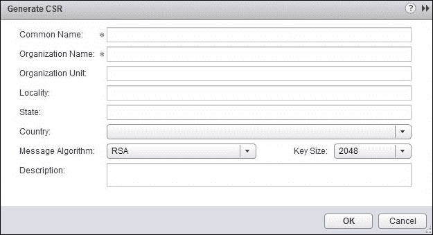

现在我们已经创建了证书，接下来将进行自签名并在负载均衡器配置中使用。以下截图展示了自签名证书的步骤：

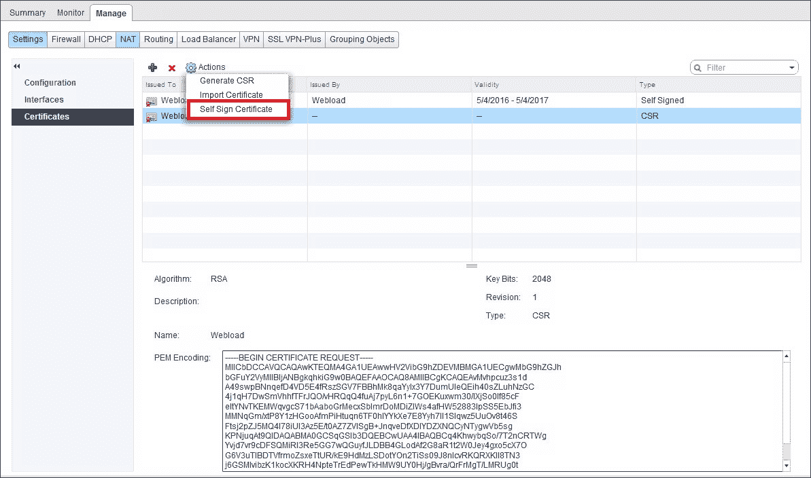

# 设置负载均衡器

我们将按以下步骤顺序设置和测试负载均衡器。

+   设置负载均衡器的全局选项

+   创建一个应用配置文件

+   创建服务监视器以定义健康检查性能

+   创建一个服务器池

+   测试负载均衡器

## 设置全局选项

设置负载均衡器全局选项的过程如下：

1.  登录到 vSphere Web 客户端。

1.  点击**网络与安全**，然后点击**NSX Edges**。

1.  双击一个 NSX Edge。

1.  点击**管理**，然后点击**负载均衡器**选项卡。

1.  点击**编辑**。

1.  选中你希望启用的选项旁边的复选框：

    +   **启用负载均衡器**：允许 NSX Edge 负载均衡器将流量分配到内部服务器进行负载均衡。

    +   **启用服务插入**：允许负载均衡器与第三方供应商设备配合使用。

    +   **启用加速**：启用时，NSX Edge 负载均衡器使用更快的 L4 LB 引擎，而不是 L7 LB 引擎。

    +   **日志记录**：NSX Edge 负载均衡器收集流量日志。你还可以选择日志级别。

1.  点击**确定**。

## 创建应用配置文件

由于我们已启用负载均衡器服务，因此在此步骤中，我们将配置 HTTPS 流量：

1.  在**管理**选项卡下，点击**负载均衡器**。

1.  在负载均衡器类别面板中，选择**全局配置**。

1.  点击右侧全局配置页面上的**编辑**。

1.  在**编辑负载均衡器全局配置**页面上，选中**启用负载均衡器**复选框并点击**确定**。选择我们之前创建的证书，并将所有其他字段保留为默认值。

1.  **插入 X-Forwarded-For HTTP 头**帮助你识别使用 HTTP 负载均衡器时客户端的 IP 地址。

1.  在负载均衡器类别面板中，选择**应用配置文件**。

1.  在顶部面板上方，点击绿色加号以打开**新配置文件**对话框，并执行以下操作：

    1.  在**名称**文本框中输入**Web-Server**。

    1.  点击**HTTPS**。

    1.  保留所有其他字段为默认值，然后点击**确定**。

以下截图展示了负载均衡器的**应用配置文件配置**：

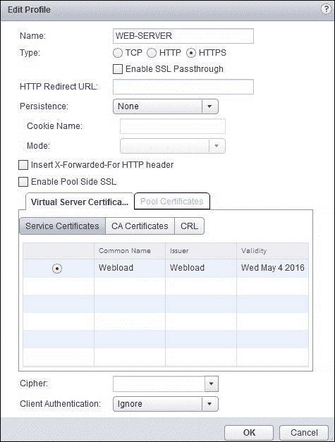

## 创建服务监视器

我们可以创建一个服务监控器，定义特定类型网络流量的健康检查参数。当你将服务监控器与池关联时，池成员将根据服务监控器的参数进行监控。以下截图显示了默认的服务监控池：

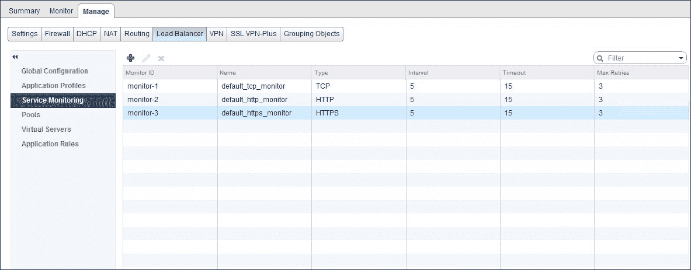

## 创建服务器池

在此步骤中，我们将创建一个轮询服务器池，该池包含两个 web 服务器虚拟机作为成员：

1.  在顶部面板上，点击绿色加号以打开**新建池**对话框，并执行以下操作：

1.  在负载均衡器类别面板中，选择**池**。

    1.  在**名称**文本框中输入**Web-Pool**。

    1.  确认**算法**选择为****ROUND-ROBIN****。

    1.  在监控选择中，我们可以选择****NONE****，一个默认的监控池，或我们手动创建的监控池。

    1.  在**成员**下，点击绿色加号以打开**新建成员**对话框，并添加第一个服务器。

    1.  点击**确定**以关闭**新建成员**对话框。

    1.  在**成员**下，点击绿色加号以打开**新建成员**对话框，并添加第二个服务器。

    1.  点击**确定**以关闭**新建成员**对话框。

    1.  点击**确定**以关闭**新建池**对话框。

1.  在名称字段中输入**Web -01a**。

1.  在 IP 地址字段中输入**172.16.10.11**。

1.  在**端口**字段中，在文本框中输入**443**。

1.  保留所有其他设置为默认值。

1.  重复相同的步骤，添加我们的第二个 web 服务器，`172.16.20.11`。以下截图显示了我们配置的池设置：

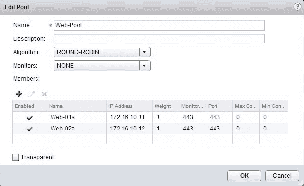

## 创建虚拟服务器

虚拟服务器位于连接到外部网络的上行接口：

1.  在负载均衡器类别面板中，选择**虚拟服务器**。

1.  在顶部面板上，点击绿色加号以打开**新建虚拟服务器**对话框，并执行以下操作：

    1.  确认已选择**启用**复选框。

    1.  在**名称**文本框中输入**VIP**。

    1.  在**IP 地址**文本框中输入**192.168.100.9**。

    1.  从**协议**下拉菜单中选择**HTTPS**。

    1.  确认**端口**设置已更改为 443。

    1.  从**默认池**下拉菜单中选择**Web-Pool**。

    1.  确认**应用程序配置文件**选择为**Web-Server**。

    1.  保留所有其他设置为默认值，并点击**确定**。

以下截图展示了我们正在尝试负载均衡的 web-pool 的虚拟服务器配置：

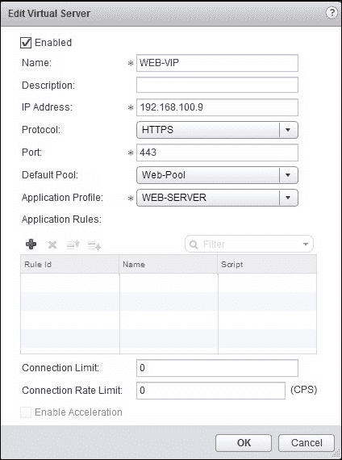

我们在负载均衡设置中没有使用 **应用程序** 规则。使用应用程序规则时，我们可以灵活地指定 HTTP/HTTPS 重定向；无论 URL 如何，流量都将根据规则始终进行重定向。现在我们只需在浏览器中输入 VIP `192.168.100.9`，就能看到流量被重定向到其中一台 Web 服务器。

以下截图显示了针对 web-sv-02a 进行的负载均衡：

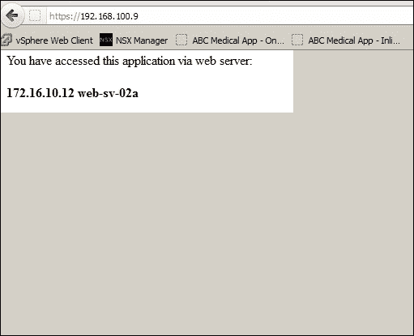

我个人讨厌通过查看 GUI 来学习东西。CLI 是我最好的朋友，我已经捕获了实验室拓扑下负载均衡场景的调试输出，以确保每个人都能清楚地理解这些概念：

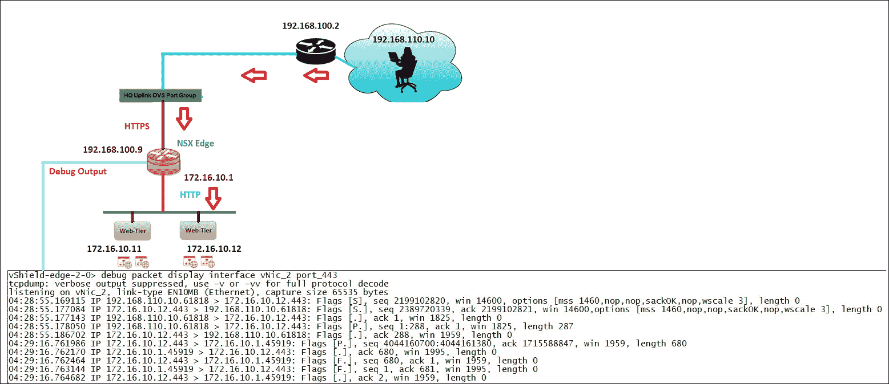

这就结束了负载均衡的主题，我们都知道，要实现负载均衡，肯定需要一个可用的 NSX Edge 实例来平衡任何流量。

# 虚拟私人网络

NSX Edge 支持多种类型的 VPN 服务，如 SSL-VPN、L2-VPN 和 IPsec VPN。具体如下：

+   **SSL VPN-plus**：选择 SSL VPN 连接的主要原因是为了那些需要访问位于边界设备后面的私有网络的用户（漫游配置文件）。

+   **IPsec VPN**：NSX 支持 NSX Edge 网关与大多数第三方 IPsec VPN 设备之间的站点对站点 VPN。

+   **L2 VPN**：在当前的云时代，我们有很多场景需要将本地网络扩展到其他站点，这些站点可以是私有云或任何其他公共云服务，如 vCloud Air、AWS 和 Azure。请不要将其与直连解决方案混淆。L2 VPN 中的虚拟机将处于同一子网，无论是否在不同站点之间迁移。

让我们更深入地讨论这些话题，了解它们的特性以及 NSX 在其中的适用位置，最后我们将集中讨论一些设计决策。

## SSL VPN

NSX SSL VPN 功能为远程用户提供了一个安全的连接，可以连接到位于 NSX Edge 网关后面的私有网络。我们可以选择基于 Web 的连接方式，或者需要安装 SSL 客户端来访问私有网络。在后台，流量将通过隧道安全地定向到私有网络。以下步骤将按相同的顺序配置 SSL VPN 连接：

1.  配置 SSL VPN 服务器设置。

1.  添加一个 IP 池。

1.  添加一个私有网络。

1.  添加认证。

1.  添加安装包。

1.  添加用户。

1.  验证所有配置并启用 SSL VPN。

以下图示显示了三个站点（A、B、C），它们需要通过 SSL-VPN、IPSEC 和 L2 VPN 设置连接到其他站点：

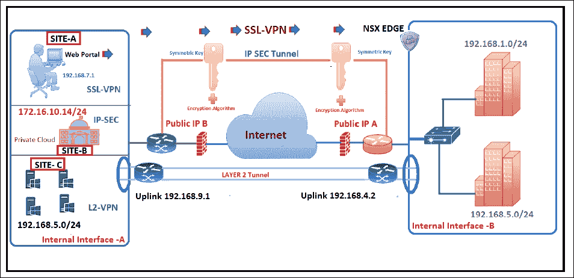

我们将从 SITE-A 的 SSL VPN 配置开始。

### 配置 SSL VPN 服务器设置

如前所述，我们需要按照步骤 1 到 7 配置 SSL-VPN 设置：

1.  在 **SSL VPN-Plus** 标签页中，从左侧面板选择 **服务器设置**。

1.  点击**更改**。

1.  选择**IPv4 地址**或**IPv6 地址**。

1.  如有需要，编辑端口号。该端口号是配置安装包所必需的。

1.  选择加密方式。

1.  从**服务器证书**表中，选择要添加的服务器证书。这是一个可选步骤；此外，请不要觉得尴尬，因为我们看到的是一个 Web 负载的 SSL 证书。这个证书是我们在 SSL 负载均衡话题中早些时候创建的。

1.  点击**确定**。

以下截图展示了 SSL VPN 服务器设置：

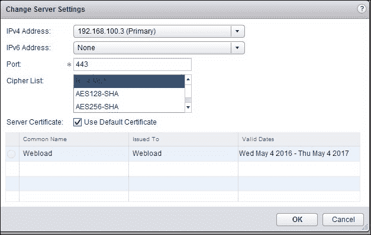

### 添加 ID 池

添加这个池的目的是将**虚拟 IP**（**VIP**）从 IP 地址池分配给远程用户。以下截图展示了 IP 池页面：

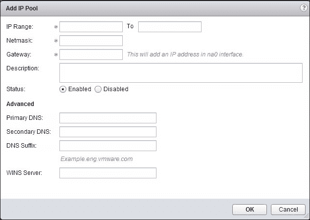

在我们的示例中，我们选择的范围是`192.168.170.2`至`192.168.170.254`，网关是`192.168.170.1`。DNS/WINS 设置是可选的，因此我们跳过该配置。

### 私有网络

私有网络是我们希望远程用户连接并访问的网络。以下截图显示了私有网络配置。我们将 192.168.1.0/24 作为 SSL VPN 访问的网络：

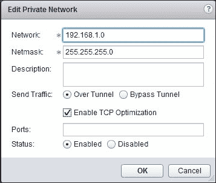

请查看以下步骤：

1.  **添加认证**：支持外部认证服务器，如 AD、LDAP、Radius 或 RSA，或者我们可以简单地创建一个本地用户，使用相同的本地用户名和密码连接到私有网络。

1.  **添加安装包**：我们可以根据需要访问私有网络的操作系统类型，为远程用户创建 SSL-VPN 客户端安装包。在选择安装包时，有几项登录设置可供选择。

1.  **添加用户**：由于我们已经添加了认证方式，现在可以继续添加用户来访问私有网络。

1.  **启用 SSL VPN 服务**：验证完整的配置后，我们需要通过切换到**SSL VPN-Plus**标签来启用 SSL VPN 服务。选择左侧面板中的**仪表板**。以下截图显示了**服务已成功启用**的消息：

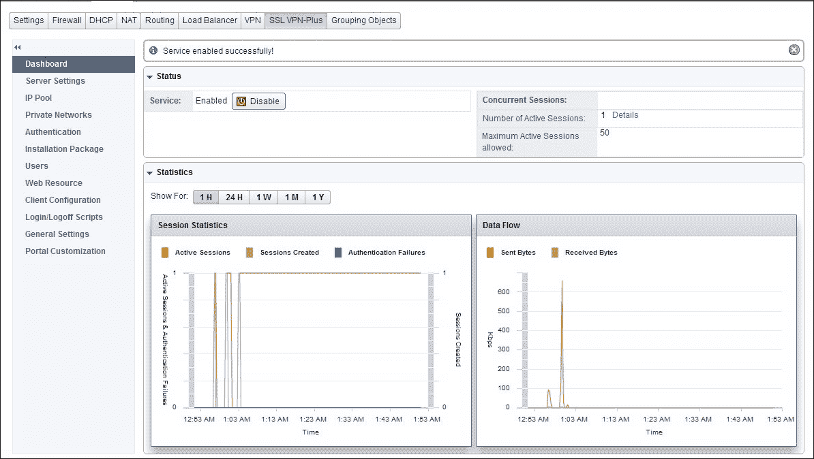

现在我们已经成功启用了 SSL 服务，远程用户（192.168.7.1）可以在身份验证后，基于我们之前选择的认证方式，发起 SSL-VPN 连接到私有网络（192.168.1.0/24）。有几种方式可以检查 SSL 会话。最好的也是最简单的方法是直接在客户端机器（192.168.7.1）上，通过在本地操作系统上执行**路由查找**，我们可以看到一条新的路由已添加至私有网络。完成这一点后，我们将继续进行**Site-B**的 IPsec VPN 配置。

## IPsec VPN

NSX Edge Gateway 支持 NSX Edge 与远程站点之间的站点对站点 VPN。简而言之，原始数据包将进行认证和加密，并将通过**Encapsulation Security Payload**（**ESP**）头、尾部和认证数据进行封装。以下截图展示了初始的 IPsec VPN 配置：

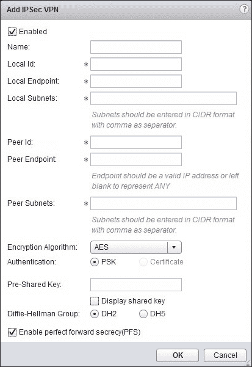

由于我们之前已经共享了拓扑，当前的要求是建立 Site-B 与远程站点（192.168.5.0/24）之间的 IPsec 隧道。让我们开始吧。

以下是配置 IPsec 的步骤：

1.  登录到 vSphere Web 客户端。

1.  点击**Networking & Security**，然后点击**NSX Edges**。

1.  双击 NSX Edge。

1.  点击**Monitor**（监控）选项卡，然后点击**VPN**选项卡。

1.  点击**IPSec VPN**。

1.  点击添加图标。

1.  为 IPsec VPN 输入一个名称。

1.  在**Local Id**中输入 NSX Edge 实例的 IP 地址。这将是远程站点的**Peer Id**。

1.  输入本地端点的 IP 地址。

    ### 提示

    如果您正在使用预共享密钥添加 IP-to-IP 隧道，本地 ID 和本地端点 IP 可以相同。

1.  输入要在站点间共享的子网，使用 CIDR 格式。若要输入多个子网，请使用逗号分隔。

1.  输入**Peer Id**以唯一标识对等站点。对于使用证书认证的对等设备，必须使用对等设备证书中的常用名称作为该 ID。对于使用 PSK（预共享密钥）的对等设备，ID 可以是任何字符串。VMware 推荐使用 VPN 的公共 IP 地址或 VPN 服务的 FQDN 作为对等 ID。

1.  在**Peer Endpoint**中输入对等站点的 IP 地址。如果您留空此项，NSX Edge 将等待对等设备请求连接。

1.  输入对等子网的内部 IP 地址，使用 CIDR 格式。若要输入多个子网，请使用逗号分隔。

1.  选择**Encryption Algorithm**（加密算法）。

    ### 注意

    **Pre-Shared Key (PSK)**：这表示 NSX Edge 与对等站点之间共享的秘密密钥将用于认证。该秘密密钥可以是最大长度为 128 字节的字符串。NSX IPsec VPN 支持对称密钥。**Certificate**（证书）：这表示将在全局级别定义的证书用于认证。

1.  如果匿名站点要连接到 VPN 服务，请输入共享密钥。

1.  点击**Display Shared Key**以显示对等站点的密钥。

1.  在**Diffie-Hellman (DH) Group**中，选择加密方案，使对等站点和 NSX Edge 可以通过不安全的通信通道建立共享密钥。

1.  如果需要，编辑默认的 MTU。

1.  选择是否启用或禁用**Perfect Forward Secrecy**（**PFS**）阈值。在 IPsec 协商中，PFS 确保每个新的加密密钥与任何先前的密钥无关。

1.  点击**OK**。

1.  启用 VPN。

1.  根据我们的拓扑，我们已经在 Edge 中更新了 IPsec 配置。一旦我们配置好合作设备，IPsec 隧道将建立：

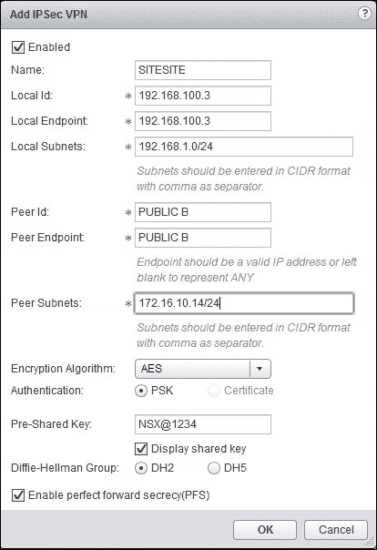

NSX Edge 使用的 IKE 阶段 1 参数包括：

+   主模式

+   AES / AES 256 优先 / TripleDES /

+   SHA-1

+   MODP (DH) 组 2（MODP1024 位）

+   预共享密钥 [可配置]

+   SA 生命周期为 28800 秒（八小时），无千字节重新密钥交换。

+   禁用 ISAKMP 攻击模式

NSX Edge 支持的 IKE 阶段 2 参数包括：

+   AES / AES 256 优先 / TripleDES / [将与第 1 阶段设置匹配]

+   SHA-1

+   ESP 隧道模式

+   MODP (DH) 组 2（MODP1024 位）

+   完美转发保密性用于重新密钥交换。

+   SA 生命周期为 3600 秒（一小时），无千字节重新密钥交换。

+   使用 IPv4 子网选择两个网络之间所有 IP 协议和所有端口的选择器。

## L2 VPN

L2 VPN 允许我们在两个站点之间配置隧道。如前所述，虚拟机将处于相同的子网，不管它们在哪个位置移动。根据我们的拓扑，我们需要在 Site-C 和远程站点 192.168.5.0/24 之间建立 L2-VPN。在我们的示例中，我们将 Site-C 作为 L2 VPN 服务器，远程站点作为 L2 VPN 客户端。L2 VPN 服务器是源 NSX Edge 服务器，目标 L2 VPN 客户端将连接到该服务器。

### 前提条件

分配给 L2 VPN 服务器和客户端的内部 IP 地址必须不同，它们可以在同一子网内。

以下是 L2 VPN 服务器的配置过程：

1.  登录 vSphere Web 客户端。

1.  点击**网络与安全性**，然后点击**NSX Edge**。

1.  双击一个 NSX Edge。

1.  点击**管理**选项卡，然后点击**VPN**选项卡。

1.  点击**L2 VPN**，选择**服务器**，然后点击**更改**。

1.  展开**服务器详细信息**。

1.  在**监听器 IP**中，输入 NSX Edge 外部接口的主 IP 或次 IP 地址。在我们的示例中，IP 地址为 `192.168.9.1`。

1.  L2 VPN 服务的默认端口为**443**。如有需要，可以编辑此端口。

1.  选择加密方法。

1.  选择正在延伸的 NSX Edge 的内部接口。此接口必须连接到 DV 端口组或逻辑交换机。

1.  输入描述。

1.  展开**用户详细信息**并输入用户名和密码。

1.  在服务器证书中，执行以下操作：

    1.  选择**使用系统生成的证书**，以便使用自签名证书进行认证。

    1.  选择用于认证的签名证书。

1.  点击**确定**：

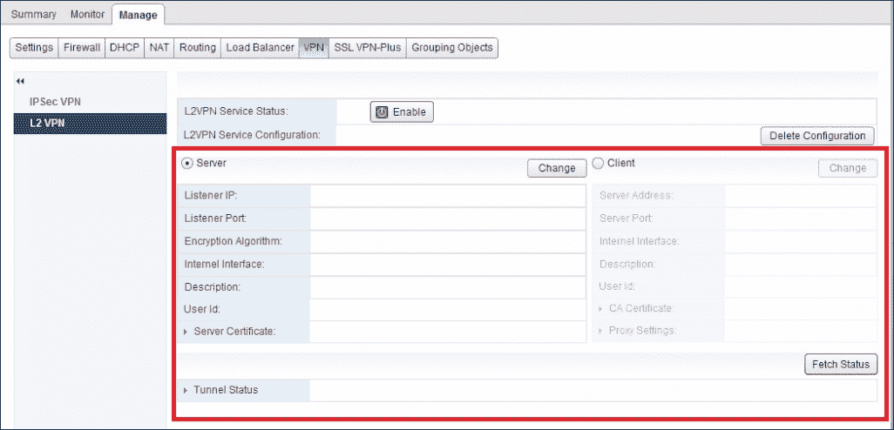

**监听器 IP**：**192.168.9.1**

**监听器端口**：**443**

**加密算法**：**AES256-SHA**

**内部接口**：**内部接口-A**

**用户 ID**：**vpn-user**

**服务器证书**：**TEST.LOCAL**

配置 L2-VPN 客户端时，我们只需要更新客户端应连接的服务器地址和需要延伸的内部接口。除了这些细节，其他配置相同，L2 隧道之后会启动并运行。

+   **L2VPN 服务状态**：**启用**

+   **服务器地址**：**192.168.9.1**

+   **服务器端口**：**443**

+   **内部接口**：**内部接口-B**

+   **用户 ID**：**vpn-user**

## 配置 VPN 时的设计决策

配置 VPN 时我们需要注意的几点：

+   不支持基于路由的 VPN，NSX Edge 仅支持基于策略的 VPN

+   我们最多可以在 10 个站点之间建立 64 个隧道

+   在 VPN 配置中支持 NAT 穿越

+   不允许子网重叠

+   路由汇总支持对等端和本地子网。

+   不支持通过 IPsec 隧道进行动态路由

+   NSX Edge 支持基于预共享密钥和证书的认证。

+   我曾在一些第三方供应商那里看到预共享密钥中存在特殊字符的问题，因此需要注意特殊字符。

这就结束了 VPN 密钥设计决策，通常建议不要偏离产品不支持的配置方式来设置 VPN。

## DHCP 中继

动态主机配置协议（DHCP）自动分配 IP 地址。这是我们都知道的。然而，这种模型确实有一个缺点：DHCP 服务器和客户端必须在同一个广播域内。简而言之，DHCP 中继代理在不同网络之间转发 DHCP 消息。这是一个新功能，已在 **NSX 6.1** 中加入，可以应用于 **DLR 或 NSX Edge**。在早期版本的 NSX 和 VCNS 中，我们只能配置传统的 DHCP 服务器。需要注意的是，我们不能有重叠的子网。但如果我们希望每次虚拟机启动时获得相同的 IP 呢？在这种情况下，NSX DHCP 静态绑定可以解决问题。我们可以简单地将 IP 地址绑定到虚拟机的 MAC 地址。

# 总结

本章开始时，我们介绍了 NSX Edge，随后涵盖了路由协议、NSX Edge 服务、使用案例和一些设计考虑事项。这无疑是一个较长的话题，解释这些内容的目的就是通过几个实验和拓扑尽可能提供有价值的信息。我坚信，在不久的将来，我们会看到更多新功能添加到 NSX Edge 服务中。例如，作为边界设备的 NSX Edge，我们非常期待看到 WAN 加速功能或基于策略的路由。

通过目前所获得的技能，我们已经可以开始进入下一章，讨论 NSX 安全功能和设计决策。我们将仔细研究 NSX 安全策略、组以及一些使用案例。
