# 第六章：NSX 安全特性

传统上，隔离和保护网络是在任何数据中心的边界层面完成的，这是一项容易出错且耗时的活动。在当前的软件定义数据中心（SDDC）环境中，大多数工作负载是动态的，我们需要更好的安全控制功能，同时希望这些任务的配置和管理能够实现自动化，而不影响任何安全特性。如果虚拟机从一台服务器迁移到另一台服务器，我的所有策略应当随之移动，而不受第 2 层和第 3 层边界的限制。但真正的问题是，这真的可能吗？在本章中，我们将讨论 NSX 如何改变现代数据中心安全的视角。我们将通过一些经典示例来讨论以下主题：

+   NSX 分布式防火墙

+   NSX 服务编排器

+   NSX 分布式防火墙监控

+   NSX SpoofGuard

+   DFW 要点总结

# NSX 分布式防火墙

NSX **分布式防火墙** (**DFW**) 关注东西向流量，NSX Edge 防火墙关注南北向流量。那些还记得 vCloud 网络安全时代的朋友会觉得这像是 vShield 应用的增强版。好吧！现在，我当然同意这一点；它无疑是 vShield 应用防火墙的功能增强版。但该应用要求你为每个主机运行一个专用的防火墙虚拟机，并且无论虚拟机移动到哪里，都能保持保护。除了它需要一个特定于虚拟化平台的防火墙（FW）虚拟机外，它还是一个功能单一的防火墙，安装和故障排除也稍显繁琐。NSX 分布式防火墙是一个内嵌在虚拟化内核中的防火墙，策略完全与虚拟化环境兼容。这意味着什么？我们可以在 vCenter 对象上应用策略，如数据中心、集群、虚拟机名称和标签，以及网络构件，如 IP/VLAN/VXLAN 地址。如果我们在 NSX Edge 和分布式防火墙中添加了相同的防火墙规则，会发生什么？哪个策略会首先被执行？这个问题有两个答案。如果流量是从虚拟机流出的，显然会首先检查分布式防火墙规则，主要是因为它是基于虚拟网卡（VNIC）的防火墙策略。然而，如果流量是进入虚拟数据中心，NSX Edge（我们的边界设备）将是防火墙规则表检查的第一点，之后还会进行 VNIC 级别的过滤。是时候提出几个问题并证明为什么它是一个功能丰富的防火墙了：

+   我们能否基于虚拟机名称或操作系统名称动态创建防火墙规则？

+   我有一个域用户**A**，我们需要基于用户访问**A**来**允许**和**阻止**一些规则。这能实现吗？

+   我有两个租户，并且分别使用 IPv4 和 IPv6；我们能否不受 IP 栈限制，利用分布式防火墙功能？

+   我们是否可以基于防火墙规则监控两台虚拟机之间的网络活动？这样可以确保我们的规则按预期工作，或者在需要时我们可以采取主动措施。

+   我正在将虚拟机从集群 A 迁移到集群 B；它会保留安全/防火墙策略吗？我需要在物理网络中添加/删除任何安全/防火墙设置吗？

+   我们是否可以在不更改/影响现有物理网络拓扑的情况下，实施一些网络安全策略？

前面的问题并不是完整的清单。然而，除了想了解当我们使用 NSX 分布式防火墙时是否具备某些安全特性 X 之外，根本性的问题是，是否可以将我的传统物理网络安全控制迁移到 NSX 环境中，使我的功能和策略更具虚拟化感知？或者，另一个问题是，它们是否是具有应用感知的策略，能够查看用户、进程、使用情况等？别误会，我们并不是要取代/删除所有物理网络的安全设置并将其复制到 NSX 环境中。我们需要的是一个更安全的网络虚拟化平台。NSX 分布式防火墙提供了一种微分段功能，可以解决许多网络安全挑战。由于防火墙模块运行在 ESXi 主机内部，我们将始终获得更好的吞吐量，策略配置、删除和监控都可以通过一个单一的管理控制台——vSphere Web 客户端来完成。在讨论防火墙规则及其工作方式之前，让我们了解涉及的组件及它们如何相互通信。正如下图所示，我们有 vSphere Web 客户端、NSX 管理器和加载了所有 VIBS 的 vSphere 集群。通过 Web 客户端连接到 vCenter 服务器后，我们可以创建安全策略，NSX 管理器将把这些策略推送到 vSphere 服务器。**VMware 服务插入平台**（**VSIP**），这是 DFW 内的一个模块，将把策略应用于底层的虚拟机。任何新一代或传统的基于端口的防火墙都会拥有一个智能规则表，而 NSX DFW 也不例外。与 DFW 相关联的有两个表：

+   规则表

+   连接表

虽然规则表维护着所有规则，但连接表将根据我们创建的规则类型跟踪活动连接：

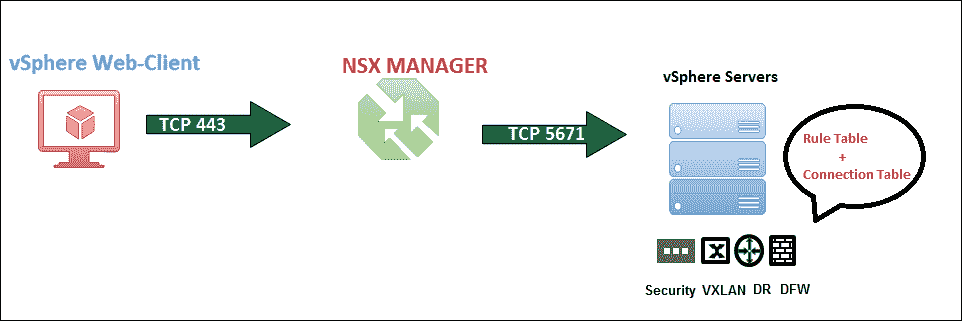

既然我们已经对分布式防火墙有了基本的了解，那么同样重要的是要知道，DFW 是完全虚拟化感知的防火墙，我们可以在以下 vCenter 服务器对象上设置防火墙规则：

+   数据中心

+   集群

+   vSwitch 端口组

+   分布式交换机端口组

+   虚拟应用（vAPP）

+   资源池

+   虚拟机

+   vNIC

+   逻辑交换机

+   安全组

+   IP 集合

+   NSX 服务组合器

NSX Service Composer 是一个内置功能，允许你在安全组和安全策略的帮助下配置安全服务、防火墙规则和安全策略。我们可以创建安全组和安全策略，并可以使用 NSX Service Composer 应用安全组和安全策略的组合，这无疑是自动化规则/策略创建任务的一个极好方法。简而言之，我们正在执行两项任务，最终的结果是实现 NSX 世界中网络安全的自动化：

部署 + 应用 = 网络安全自动化

但问题是，我们要部署什么，并且要在哪里应用它？为此，我们需要了解什么是安全组和安全策略。

## 安全组

安全组是我们定义要保护的资产类型的地方，我们可以通过**动态方式**选择资产来定义该组，或者我们可以简单地创建一个**静态成员**组。我们将回过头去阅读本章中的问卷部分：

我们能否基于虚拟名称或操作系统名称动态创建规则？

这使我们更清晰地理解了为什么动态成员在创建安全组时会成为一个关键因素。简而言之，当我们创建一个动态成员组，并选择*包含所有 Windows 系统版本并应用安全组和安全策略时，这将是我们使用 DFW 防火墙智能创建和保护虚拟机的最简单方法。*

## 安全策略

安全策略是安全服务和防火墙规则的组合。策略可以是防病毒、数据安全、漏洞、网络内省和防火墙规则的组合。

好的！但如果我们需要创建一个动态组，同时排除运行在特定逻辑交换机上的虚拟机，并且所有这些配置都应该是同一个安全组的一部分，那么该怎么办呢？这就是安全组的真正力量：所有这些配置都可以作为一个安全组的一部分，在这种情况下，我们的安全组将是这样的：

动态包含 + 静态包含（如果需要，我们仍然可以有静态包含列表） - 静态排除 = 安全组。

### 创建服务组

在对安全组和安全策略有了基本了解后，我们将继续讨论其中一个安全需求，以展示该功能的强大。让我们看看利用 DFW 功能保护流量的一个网络需求，并讨论实验练习。根据以下拓扑图，我们的三层应用程序运行在三个逻辑交换机和一个传输网络上：

+   App-Tier-01

+   Web-Tier-01

+   DB-Tier-01

+   传输网络

在下图中，通过利用 NSX DFW，我们将在 Web-Tier 逻辑交换机中禁用 ICMP 流量，最终的结果将是 Web-Tier-01 逻辑交换机中的 Web 服务器将阻止 ICMP 流量：

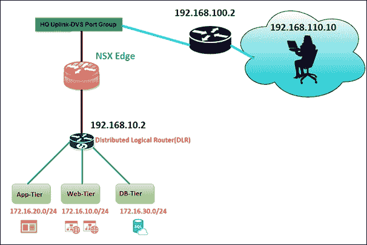

在开始之前，让我们做一个简单的 ping 测试，以确认是否允许 ICMP。以下截图显示了连接到同一逻辑交换机 **Web Tier-01** 的 `web-01a` 和 `web-02a` 之间的 ICMP 流量成功：

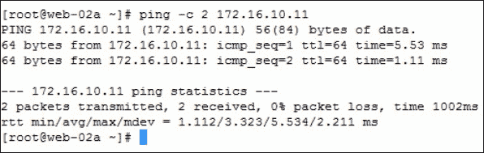

配置分布式防火墙规则时，我们有两种方法：

+   通过选择 **Firewall** | **Networking & Security** | **Firewall**

+   通过选择 **Service Composer** | **Networking & Security** | **Service Composer**

在这个示例中，我正在使用 **Service Composer**。让我们创建一个名为 **Web Security-Group** 的安全组：

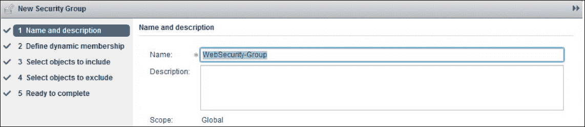

在动态成员列表中，我们没有选择任何选项。然而，值得关注的是 **Criteria Details** 选项，以便清楚地了解可用于定义动态成员组的选项，如下图所示。例如，如果我们在下面的条件列表中选择虚拟机名称，并在白色文本框中输入 Windows 并创建安全组，则任何在 vCenter 服务器中部署的现有/未来虚拟机都会应用 DFW 策略。这是一个非常强大的功能，它可以简化很多重复任务，当一组虚拟机需要相同的策略时，此外，之后对同一组虚拟机的策略添加和删除只需要一步操作：

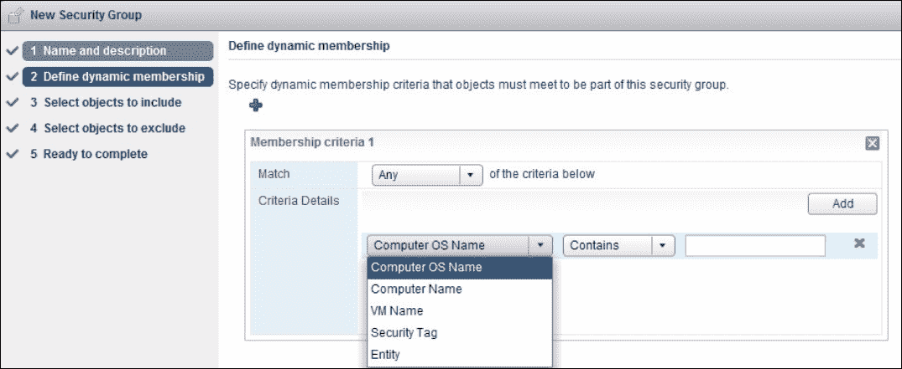

在静态包含列表中，我们将 **Object Type** 设置为 **Logical Switch**，这样我们就可以在下面的截图所示的 **Web-Tier-01** 逻辑交换机上应用策略：

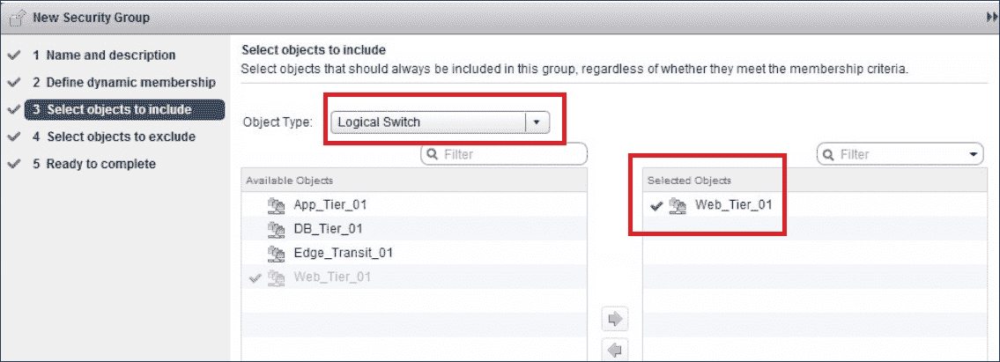

接下来做什么？我故意将一台 **Linux VM** 连接到我们的 **Web-Tier**，目的是排除我们正在创建的安全组策略中的 Linux。尽管我们是在逻辑交换机级别创建安全组，但我们仍然可以通过指定排除条件来以这种方式过滤我们的策略。简而言之，策略是在逻辑交换机级别应用的，但并不是应用于连接到同一逻辑交换机的所有虚拟机。正如我们从以下截图所看到的，我们将 **Object Type** 设置为 **Virtual Machine**，并排除了 **Linux-01a**：

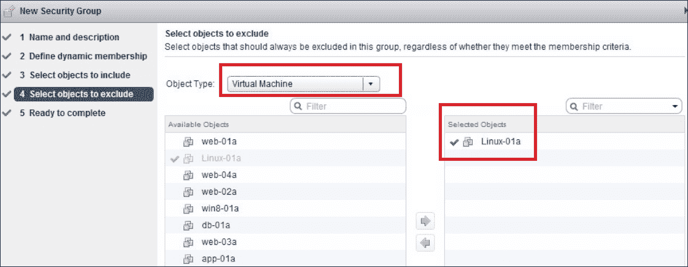

完成此步骤后，我们就完成了安全组的创建，并且可以在 **Service Composer** | **Networking & Security** | **Service Composer** 中看到创建的 web 安全组。我已经特别标出虚拟机，因为我希望大家关注虚拟机编号，它显示为 **1**。通过相同的步骤，我们将创建另一个名为 **Web2Security** 的安全组，并在静态包含中包括 **Web-02a** 虚拟机。

那么让我们回顾一下我们的示例中的两个安全组规则：

+   安全组（Web Security-Group）= 动态包含（未选择任何项）+ 静态包含（选择了 Web-Tier 逻辑交换机） - 静态排除（排除了 Linux 虚拟机）

+   安全组（Web2Security）= 动态包含（未选择任何项）+ 静态包含（Web-02a） - 静态排除（未选择任何项）

以下截图展示了我们创建的两个安全组，我们还可以看到虚拟机数量也显示在那里：

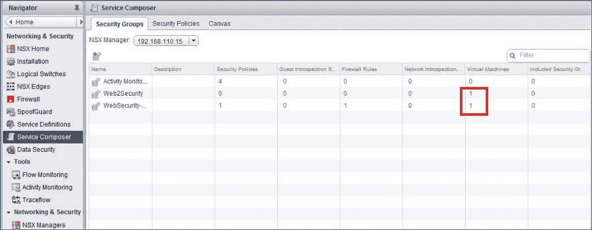

### 创建安全策略

正如我们之前讨论的，策略是安全服务的集合，如防病毒、IPS/IDS 解决方案和 DFW 规则。

在创建策略之前，如果需要，我们需要通过权重属性来确定策略的优先级。此功能的主要目的是，在某些情况下，某些对象（在我们的示例中，我们将虚拟机作为对象）会属于多个策略。根据哪个策略的权重属性较高，较高权重的策略将优先于较低权重的策略。除此之外，如果我们正在创建的策略从另一个安全策略中获取服务，我们需要选择父策略。

以下截图展示了一个安全策略正在被创建；我们将其命名为 **Web Security-Group**：

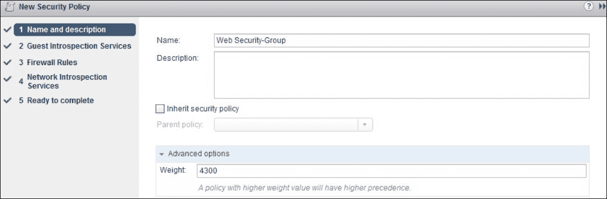

由于在本示例中我们没有使用来宾内省和网络内省服务，我将跳过这些配置，直接进入防火墙规则。这两种配置在以下场景中非常有用：

+   数据安全或第三方解决方案提供商服务（如防病毒或漏洞管理服务）需要端点服务。

+   为了在我们的环境中检测敏感数据，如 **支付卡行业**（**PCI**）、**受保护的健康信息**（**PHI**）和 **个人身份信息**（**PII**），我们可以创建数据安全策略。当我们运行扫描时，数据安全会识别违反您策略的规定的数据，并且会被防火墙策略**阻止**。

+   监控网络的网络内省服务，例如 IPS。

让我们更仔细地查看防火墙源和目标规则：

+   **源**：策略安全组

+   **目标**：Web2Security Group

+   **服务**：我们正在阻止所有 ICMP 流量（选择了总共 4 种 ICMP 流量，我们很快会看到这些）

以下截图展示了前面的规则：

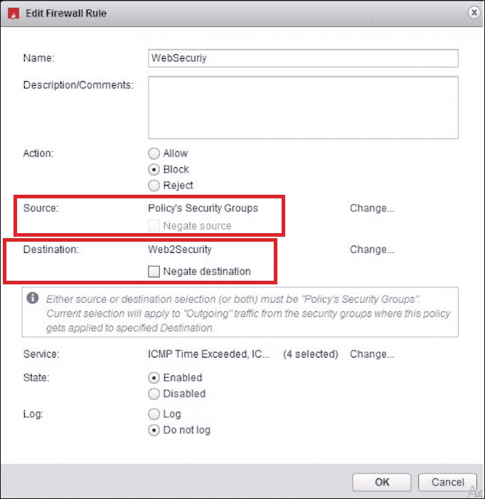

现在我们的安全策略和安全组已经创建完毕，我们可以通过点击以下截图中展示的 **应用策略** 选项，将策略应用到我们之前创建的 **安全组**：

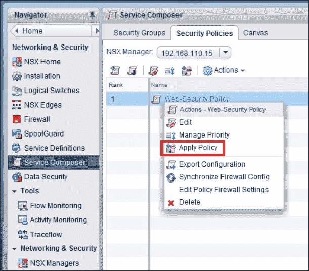

在应用安全策略时，NSX 将向我们展示已创建的所有**安全组**，我们需要确保将其应用于正确的安全组。选择错误的安全组将严重影响网络流量。此外，我们可以看到**应用策略**下方有一个**同步防火墙配置**选项。建议在修改策略时同步防火墙配置。NSX 6.2.3 的最新版本有一个很好的迹象，即如果安全策略不同步，将生成一个不同步安全策略的告警。但是，请注意 NSX Manager 的早期版本，除非报告问题并在故障排除后隔离问题，否则我们永远不会知道策略是否不同步。

### 测试防火墙规则

接下来呢？如果我们到目前为止一直都很警惕，我们将会看到这些规则在**防火墙** | **网络与安全** | **防火墙**中得到填充。以下屏幕截图描述了我们为以下目的创建的 Web 安全规则：

+   **来源**：**Web 安全组**（**Web-01a**）

+   **目标**：**Web2 安全**（**Web-02a**）

+   **服务**：**4 个 ICMP 协议**，**操作**为**阻止**

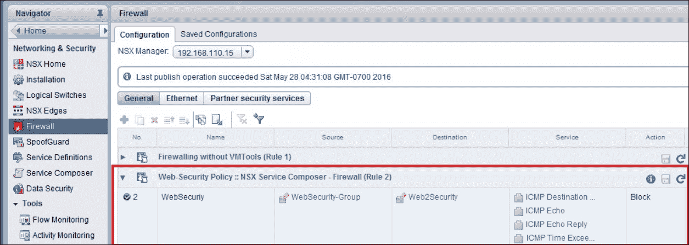

现在是时候测试我们迄今配置的内容，并且我将向您展示 ESXi 主机上详细的防火墙摘要。正如我们从以下屏幕截图中可以看到的那样，我们正在`web-02a`机器上有一个 SSH 会话，并且我们能够 ping 通 172.16.10.11（web-01a）：

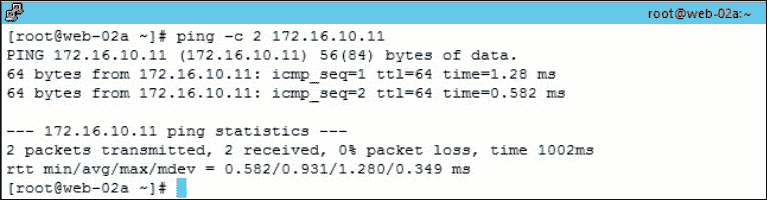

现在，如果我们从`web-01a`到`web-02a`进行 ping 测试，如下面的屏幕截图所示，结果将会失败，主要是因为我们创建的**ICMP DROP**规则：

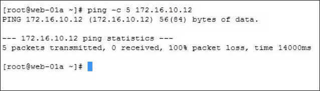

我坚信我们的 DFW 基础知识是非常清晰的。尽管我们即将进行故障排除章节，我非常兴奋地向您展示一个信息丰富的输出，我们可以从底层主机中检查和查看。我们所需做的就是对我们的 Web 服务器正在运行的 ESXi 主机进行 SSH 会话，并发出以下命令：

```
summarize-dvfilter

```

分布式虚拟过滤器是监控由 NSX DFW 保护的出站和入站流量的模块。因此，这个命令会显示相同的输出。以下命令输出适用于 Web-02a 虚拟机，让我们记下与`VM - nic-60841-eth0-vmware-sfw.2`相关联的 vNic 插槽 2 的名称：

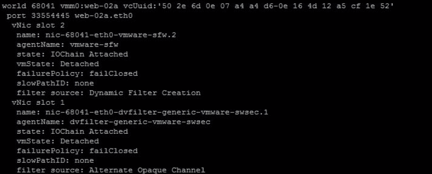

正如我们可以看到的，前述命令和输出并没有提供关于与该虚拟机相关的所有 DFW 规则的任何信息，让我们在同一主机中发出以下命令：

```
Vsipioctl getfwrules -f nic-60841-eth0-vmware-sfw.2

```

以下屏幕截图清楚地显示了所有规则。我已标记了**DROP**规则，我们总共有四条规则，这些仅仅是我们几分钟前创建的 ICMP 规则：

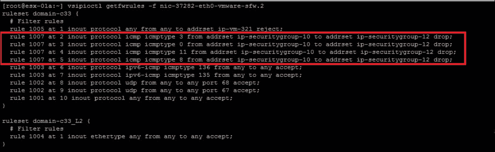

如我之前所说，分布式防火墙的完整集中管理是通过 vSphere web 客户端完成的，至于规则，我们将提供名称、源和目标实体、服务类型、所需的动作以及规则生效的位置。除了常规规则创建，DFW 还支持基于身份的防火墙。

### 理解基于身份的防火墙规则

让我重申我们在讨论 DFW 时遇到的第二个问题：

我有一个域用户 A，我们需要根据用户 A 的访问权限允许和阻止一些规则。这可以实现吗？

使用基于身份的防火墙，我们可以根据**Active Directory**（**AD**）组定义防火墙规则。显然，使用基于身份的防火墙时有一些前提条件和限制，我们稍后将讨论。首先，我们需要在 NSX Manager 中注册 AD。

#### AD 注册过程

我们将按照以下步骤在 NSX Manager 上注册 AD：

1.  首先，我们将登录到 vSphere web 客户端。

1.  点击**网络与安全**，然后点击**NSX 管理器**。

1.  在**名称**列中点击一个 NSX Manager，然后点击**管理**标签页。

1.  点击**域**标签页，然后点击添加域图标。

1.  在**添加域**对话框中，输入完全限定的域名和域的 netBIOS 名称。下图展示了上述步骤：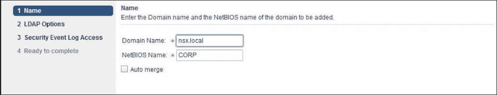

1.  在**LDAP 选项**页面中，指定域控制器与域同步，并选择协议。

1.  如有需要，编辑端口号。

1.  输入域账户的用户凭据。该用户必须能够访问目录树结构。

    下图显示了配置期间需要填写的 LDAP 配置：

    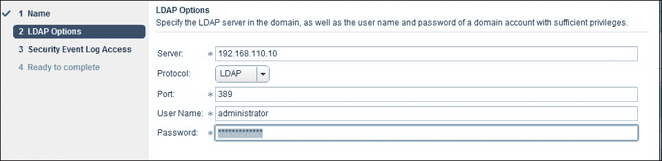

1.  在**安全事件日志访问**页面中，选择连接方法以访问指定 LDAP 服务器上的安全事件日志。如有需要，可更改端口号。

1.  选择**使用域凭据**来使用 LDAP 服务器用户凭据。如需指定备用域账户进行日志访问，请取消选中**使用域凭据**，并指定用户名和密码。指定的账户必须能够读取域控制器上的安全事件日志。

1.  点击**下一步**。

1.  在**准备完成**页面中，检查您输入的设置。

1.  点击**完成**。

一旦按照上述步骤配置了所需的 AD 详细信息，NSX 管理器与 AD 的同步将开始。只有在同步正确完成后，我们才应开始使用**身份防火墙**（**IDFW**）。这是一次性任务，后续的同步是自动进行的。接下来怎么办？我们可以简单地创建安全组（AD 组）和安全策略（防火墙策略），并根据业务需求允许/拒绝服务。下图展示了 AD 与 NSX 管理器的集成，AD 组 MG 作为源，目标是允许 http 和 icmp 服务的 Windows 机器组：

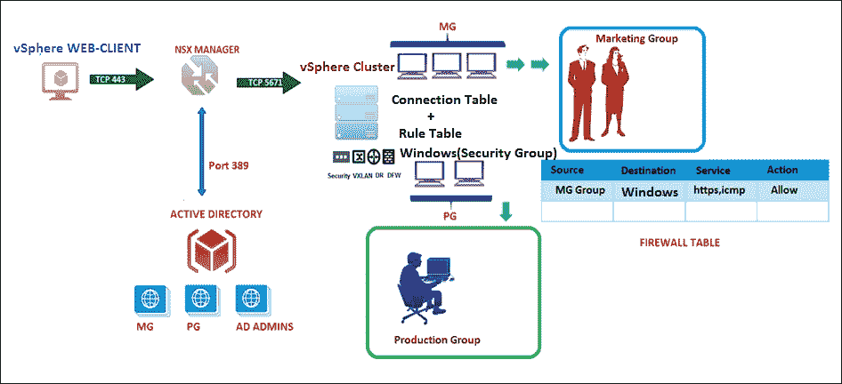

# NSX 流量监控

网络监控工具总是很难设置、配置和分析。到目前为止，大多数人可能已经配置了第三方监控工具来分析网络流量，并根据情况采取相应的行动。也许我们可以在几个点捕获数据包，并使用 Wireshark 进行分析。在这种情况下，我们真的喜欢从一个管理控制台切换到另一个管理控制台吗？我们是否满意第三方监控软件，并期望它展示所有类型的流量集成？我知道大多数人都不喜欢这种依赖供应商的工具。我们需要一种能够帮助我们快速分析情况并采取积极措施的工具。**NSX 流量监控**是一个内置功能，可以提供对任何流量的可视化和控制。简而言之，它配置分布式防火墙以捕获流量，我们可以分析流量流动。流量监控数据包括每个会话传输的会话数和数据包数。会话详情包括源、目标、应用程序和使用的端口，之后我们可以根据会话详情创建防火墙允许或阻止规则。默认情况下，显示的是过去 24 小时的数据，最短时间跨度为 1 小时，最长为 2 周。

启用流量监控：

1.  登录到 vSphere Web 客户端。

1.  从左侧导航窗格中选择**网络与安全**，然后选择**流量监控**。

1.  选择**配置**选项卡。

1.  确保**全局流量收集状态**已设置为**启用**，并且我们没有更改**详细收集策略**。

以下截图显示了**全局流连接状态**设置为**启用**：

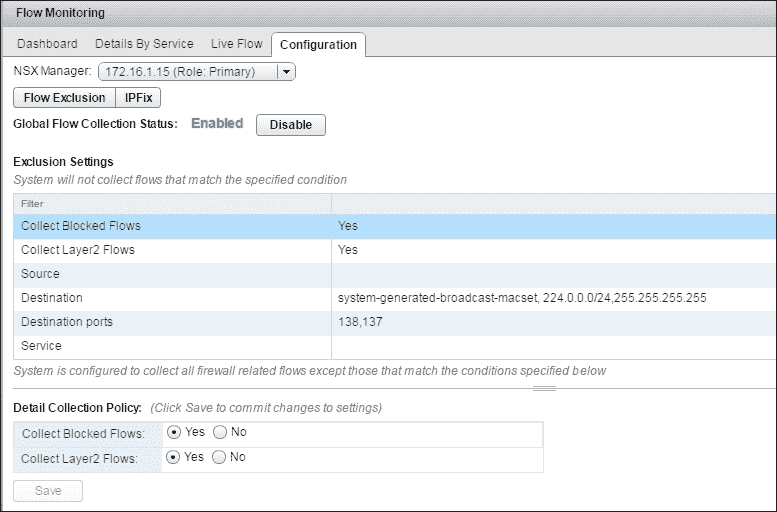

好的！我们已经启用了流量监控，并且应该能看到一些流量统计数据。在我们的例子中，我们将快速检查来自 Windows 2008 机器（192.168.2.2）的实时流量。

捕获实时流量：

1.  登录到 vSphere Web 客户端。

1.  从左侧导航窗格中选择**网络与安全**，然后选择**流量监控**。

1.  点击**实时流量**选项卡。

1.  点击**浏览**并选择**windows-2008（IPSEC）NIC**。

1.  点击**开始**以开始查看实时流量。

下图展示了实时流量统计，我已突出显示了当源主机 windows-2008 192.168.2.2 尝试与目标 IP 192.168.4.2 通信时应用的阻塞规则：

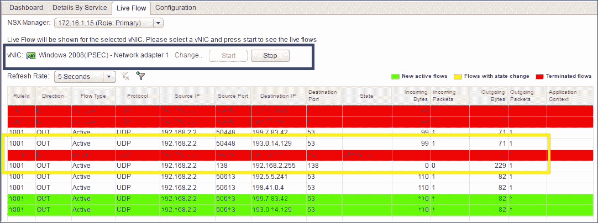

如我们所见，这是一个很棒的功能，我们不仅可以轻松了解哪些流量是被允许的，哪些是被阻止的，还可以查看进出字节数，这对于我们想了解哪个源发送了更多字节，或是我们从哪里接收到更多入站字节非常重要。在我们的案例中，**TCP-SYNC** 数据包被发送，但没有收到回复，因为我创建了一个 DFW 规则，阻止了 192.168.2.2 和 192.168.4.2 之间的流量。

# NSX SpoofGuard

NSX 的另一个强大功能是 SpoofGuard。SpoofGuard 功能将监控和管理虚拟机的 IP 地址。好吧！我们为什么需要这样一个功能呢？如果虚拟机被不小心攻破，会发生什么？黑客肯定可以更改 IP 并绕过所有防火墙策略，后果不堪设想。SpoofGuard 为我们提供了更细致的控制，确保所有 IP 地址更改都经过批准，直到流量被阻止。只要我们安装并运行了 VMware 工具，NSX 管理器就会收集虚拟机的 IP 地址。

SpoofGuard 支持以下方法：

+   **首次使用时自动信任 IP 分配**：此模式允许所有来自虚拟机的流量通过；此外，它会建立一个 vNIC 到 IP 地址分配的表格。这样，我们可以查看此表并进行 IP 地址更改。IPv4 和 IPv6 都受支持。

+   **手动检查并在使用前批准所有 IP 分配**：此模式在您批准每个 vNIC 到 IP 地址的分配之前，阻止所有流量。

这引出了另一个问题。使用 DHCP IP 的虚拟机会怎么样？它们会获得 IP 分配吗？我们需要批准它们的 DHCP IP 分配吗？

如果我们了解了支持的 SpoofGuard 方法，答案就非常简单了。只有在 **手动检查** 中，DHCP 流量才不会被允许，直到我们批准请求；此规则同样适用于 DHCP。如果我们正在手动检查 IP 分配，那么 DHCP 将被阻止。话虽如此，基于以下场景，让我们进行实验测试：

*运行在 Web 服务器逻辑交换机上的虚拟机应检查所有 IP 分配*。

## SpoofGuard 配置过程

我们需要执行以下步骤来配置 SpoofGuard：

1.  首先，登录到 vSphere Web 客户端。

1.  点击 **Networking & Security**，然后点击 **SpoofGuard**。

1.  点击添加图标。

1.  为 SpoofGuard 策略输入一个名称。

1.  我们可以根据业务需求立即启用或禁用。

1.  对于 **操作模式**，我们选择 **手动检查并在使用前批准所有 IP 分配**。以下截图展示了 SpoofGuard 的初始配置：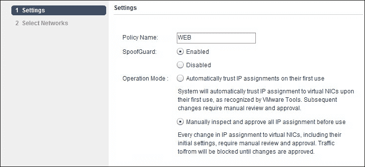

1.  要指定需要应用 SpoofGuard 策略的位置，请点击 **添加** 并选择此策略应该应用的网络、分布式端口组或逻辑交换机。在我们的示例中，我们正在配置 **Web-Tier** 逻辑交换机，如下图所示：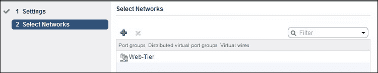

1.  由于我们已将 SpoofGuard 设置为需要手动批准所有 IP 地址，让我们检查一下该分配。

在下面的截图中，我们查看的是 **虚拟网卡 IP 需要批准**屏幕，这是在流量可以进出这些虚拟机之前，需要批准的 IP 地址更改。其他可用选项如下：

+   **活动虚拟网卡**

+   **自上次发布以来的活动虚拟网卡**

+   **具有重复 IP 的虚拟网卡**

+   **非活动虚拟网卡**

未发布的虚拟网卡 IP：

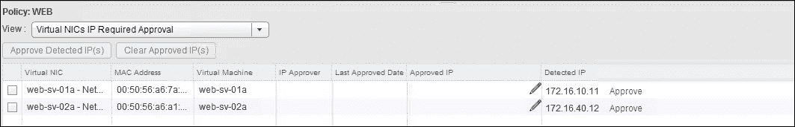

要批准一个 IP 地址，我们需要点击 **批准**，位于 IP 地址选项旁边。这就总结了我们对 NSX 安全性和监控的详细讨论。确实可以与 NSX 进行更多集成，例如与 vRealize 操作管理（之前的 VROPS）、vCloud Director 集成、与 NSX 的 vRealize Automation、NSX 与第三方软件（如 Palo Alto 网络、Check Point 等）集成。考虑到 NSX 在市场上所带来的积极动力，越来越多的集成将不断涌现，这使得所有架构师的工作更加轻松。了解这些集成绝对值得；请阅读我将在 第八章中提供的链接，*NSX 故障排除*。最后，让我们快速看一下需要注意的几个关键点。

# 分布式防火墙要点

分布式防火墙是功能丰富的防火墙。但在安装和创建规则时，我们必须格外小心。过去使用巨型物理防火墙进行流量过滤和其他安全措施的时代已经过去。应用程序要求防火墙更靠近它们，而不是运行在 **机架顶部** (**TOR**)的位置。我们所需要的仅仅是一个更具应用感知的有状态防火墙。当我们在近线速率处理下检查流量，特别是对于东西向流量时，这将为我们提供更好的流量可见性并减少虚拟化数据中心中的攻击漏洞，我们可以称 NSX DFW 防火墙为 **微分段**的基础支柱。担心瓶颈问题？没问题！DFW 是新来的小伙伴。让我们快速浏览一下本章的一些关键要点。

DFW 不需要任何物理网络拓扑更改。

请注意 vSphere 环境中安装的所有管理虚拟机（VMware 设备、第三方设备、AD、DNS 和 Exchange 等），并决定哪些应该成为 DFW 保护的一部分。

VSphere 交换机不支持策略执行；仅支持逻辑交换机和分布式交换机端口组。DFW 完全支持 IPv4 和 IPv6。

从 NSX 6.2 开始，DFW 规则即使没有 VMware 工具也支持利用 vCenter 服务器对象。NSX 6.1 及以上版本在防火墙操作中新增了一个名为 **拒绝**（reject）的选项。这个操作在 NSX Edge 上也可用。

NSX 6.2.3 支持 **简单文件传输协议**（**TFTP**）-ALG 分布式防火墙规则。

基于身份的防火墙仅支持 **Windows 客户端**，非常适合东西向数据中心流量。然而，我们可以将其与 NSX Edge 防火墙和物理防火墙一起配置，从而为整个数据中心提供端到端的安全性。

从 vCenter 删除或添加 vSphere 虚拟机不会删除任何 DFW 规则。如果你想完全排除某个虚拟机免受 DFW 保护，请使用 **排除列表** 功能。关于排除列表的详细内容，我将在 第八章，*NSX 故障排除* 中讨论。

如果我们利用身份防火墙功能，并且由于某些原因，NSX 管理器与 Active Directory 之间存在同步问题，这将直接影响 DFW 规则。因此，这是一个管理平面（NSX 管理器）故障导致数据平面流量问题的场景，因为防火墙受到影响。

如果我们需要识别应用程序并允许/阻止流量，无论端口和协议信息如何，对于这种使用场景，最佳的防火墙方案是将像 Palo Alto 这样的下一代防火墙与 DFW 集成。

在 vSphere 管理集群中安装 DFW 功能不是强制的；如果我们想安装 DFW，请注意 VCenter 服务器机器。确保该机器从列表中排除。如果在同一集群中运行其他第三方管理软件，DFW 无法智能地将其排除在保护之外。我在 VCNS 时代就遇到过这个错误：突然间，VC 无法访问所有管理组件。点击 **安装** 按钮就可能导致重大生产中断。

# 总结

我们以介绍 NSX 安全性开始了本章，随后讲解了 DFW 架构、使用案例和功能。我们还讨论了 NSX 中可用的监控选项，最后，我们总结了在安装 NSX 安全功能之前需要注意的要点。

在下一章，我们将讨论跨 VC 的 NSX，涉及多站点解决方案，包括逻辑交换机、分布式逻辑路由器及跨多个 vCenter 域的 DFW 安装和配置。
