# 第七章：NSX 跨 vCenter

在本章中，我们将详细讨论 NSX 跨 vCenter 的功能。从 NSX 6.2 开始，我们可以通过跨 vCenter 环境利用 NSX 功能，从一个统一的界面管理多个 vCenter Servers。我们将主要覆盖以下主题：

+   理解 NSX 跨 vCenter Server

+   NSX 跨 vCenter Server 组件

+   跨 vCenter 通用逻辑交换机

+   跨 vCenter 通用逻辑路由器

+   NSX 跨 vCenter Server 的网络瓶颈

# 理解 NSX 跨 vCenter Server

早期版本的 NSX 与 vCenter Server 存在 **1:1** 的关系，这意味着 NSX 功能仅限于特定的 vCenter Server。因此，每当我们扩展 vCenter Server 时，需要单独安装和配置 NSX Manager，并且每个环境都必须单独管理。当 VMware 在 2015 年 8 月发布 NSX 6.2 时，安全性和跨 vCenter Server 网络功能成为了令人兴奋的新增功能。通过跨 vCenter 的网络和安全功能，我们可以在 vCenter 边界之间扩展逻辑交换机，此外，我们可以无缝地跨 VCs 扩展分布式路由和分布式防火墙，为两个站点提供真正的网络混合性。客户可以通过这一跨 VC NSX 集成功能受益的使用案例有很多，以下是其中的一些：

+   通过利用跨 vCenter Server，我们可以拥有一个主 vSphere 环境和一个备份 vSphere 环境，并且可以轻松配置灾难恢复站点。

+   无缝地将工作负载从一个 vSphere 环境迁移到另一个环境。

+   简化的跨 vCenter Server 站点数据中心路由；集中式安全策略管理；防火墙规则可以从一个集中位置进行管理。

+   NSX 功能可以在本地部署（单个 vCenter Server）；也可以跨 vCenter Server 部署（跨 vCenter Server）。这样，本地对象可以在本地管理，而全局对象可以在全球管理。

下图描述了一个跨 vCenter Server 的 NSX 环境：

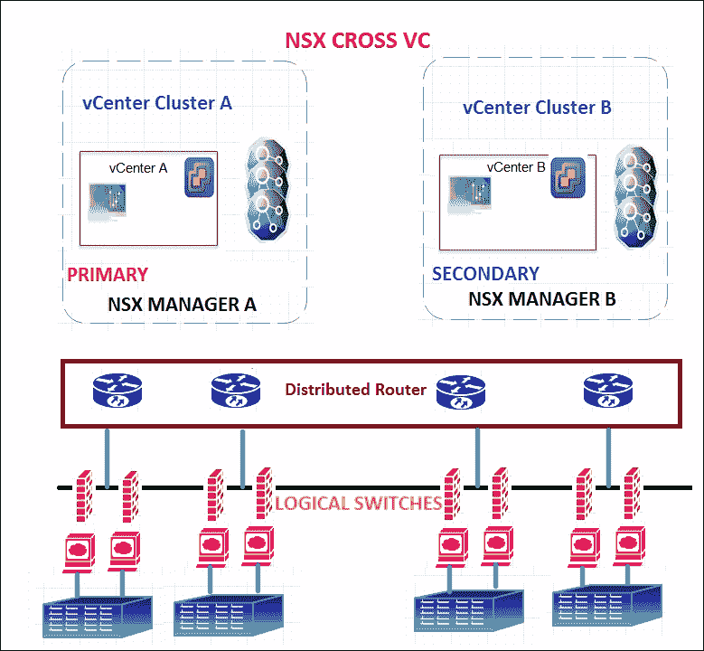

我知道大家都很想了解 NSX 跨 VC 的工作原理。但在讨论此功能之前，让我们先明确一些前提条件和几个要点：

+   vSphere 环境应该是 6.0 版本。

+   每个 vCenter Server 应该与一个唯一的 NSX Manager 注册。好吧！这个点很有趣，不是吗？当我第一次听说跨 VC NSX 架构时，我以为我们将来只需要一个 NSX Manager。但通过进一步的阅读和实验，证明我的理解是错误的。

+   我们必须将一个 NSX Manager 提升为 **主**，其他的将是 **备**。

+   我们当然可以根据业务需求降级 NSX 角色。例如，一个次级 NSX Manager 可以降级为独立的 NSX Manager，这样我们就回到了 NSX 最初开始时的状态（6.2 版本之前的 NSX）。

+   尽管跨 VC NSX 是一个很好的架构，但我仍然认为它是一个新兴的解决方案，并且缺乏独立 NSX Manager 实例中可能具有的所有功能。抛开这些负面看法，我坚信 NSX 的新版本将会开始支持跨 vCenter 服务器的所有功能。

+   仔细规划并集成跨 VC 的 NSX 环境；具体来说，关注我们在主站点和次站点中需要的功能，以及如何管理这些功能。例如，如果我们仅在次站点需要分布式防火墙功能，我不建议进行跨 VC 的 NSX 集成，除非我们希望从一个统一界面管理这些防火墙策略。

# NSX 跨 vCenter 服务器的组件

跨 vCenter NSX 包括以下组件：

+   通用控制器集群

+   通用传输区域

+   通用逻辑交换机

+   通用分布式逻辑路由器

+   通用 IP 集合

+   通用 MAC 集合

+   通用安全组

下表展示了 NSX 跨 vCenter 服务器部署选项；基于这些要点，我们将进行详细解释：

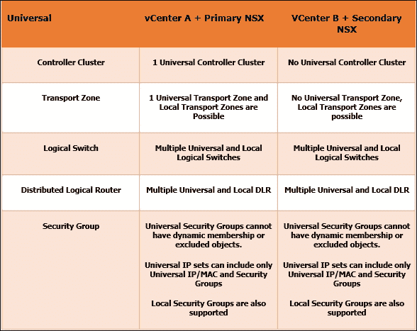

在上表中，我已更新了客户理想情况下会在跨 vCenter NSX 环境中配置的关键 NSX 功能。其他功能，如负载均衡和 L2 桥接，在 NSX 站点之间没有全局级别的适配，因此它们始终局限于 vCenter Server 环境。 在探讨通用 NSX 功能之前，我们需要了解 NSX Manager 可用的角色。

NSX Manager 实例具有以下角色，并且在主 NSX Manager 上将运行同步模块，以确保通用对象能够同步到次级 NSX Manager。NSX Manager 实例具有以下角色：

+   **独立**：在配置 NSX 角色之前，所有的 NSX Manager 都是独立的 NSX Manager。NSX Manager 的全新安装或从 VCNS 升级的 NSX Manager 都是独立 NSX Manager 的典型例子。

+   **主级**：在跨 vCenter NSX 环境中，只有**一个主级 NSX Manager**，我们将在主 NSX Manager 中创建所有通用对象。更具体地说，任何部署、修改或删除任务都将在主 NSX Manager 上进行。

+   **次级**：当一个独立的 NSX Manager 被添加到主 NSX Manager 实例时，它称为次级 NSX Manager。在次级 NSX Manager 实例中，所有的通用对象都是只读的。次级 NSX Manager 实例不能拥有自己的控制器。我们最多可以拥有七个次级 NSX Manager。

+   **中转**：有时我们需要移除或更改 NSX Manager 的主节点和次节点角色，这时中转角色就显得很重要。然而，如果 NSX Manager 实例拥有通用对象，它就不能被定义为独立角色。在这种情况下，NSX Manager 实例将被分配为中转角色。在中转角色下，通用对象只能被删除。当所有通用对象被删除后，NSX Manager 实例可以被分配为次节点角色。

以下图示解释了我们迄今为止讲解的各种 NSX 角色以及根据通用对象提升和降级 NSX 角色的过程：

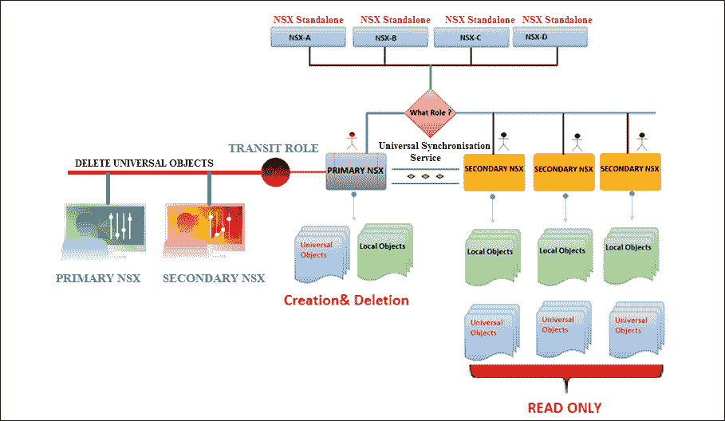

在继续讨论跨 vCenter 之前，我们需要了解**通用同步服务**的重要性。通用同步服务是跨 vCenter NSX 通信的核心。

# 通用同步服务

**通用同步服务**负责将主 NSX Manager 实例的配置更改同步到所有次 NSX Manager 实例。这些是内建服务，运行在主 NSX Manager 中，通过 REST API 调用次 NSX Manager 进行同步。好了，让我们做一些快速测试，看看在我们开始分配角色之前，服务的状态如何。

以下图示显示了与 NSX 6.2 的 GUI 连接，在高亮列中我们可以看到 NSX 通用同步服务的状态：

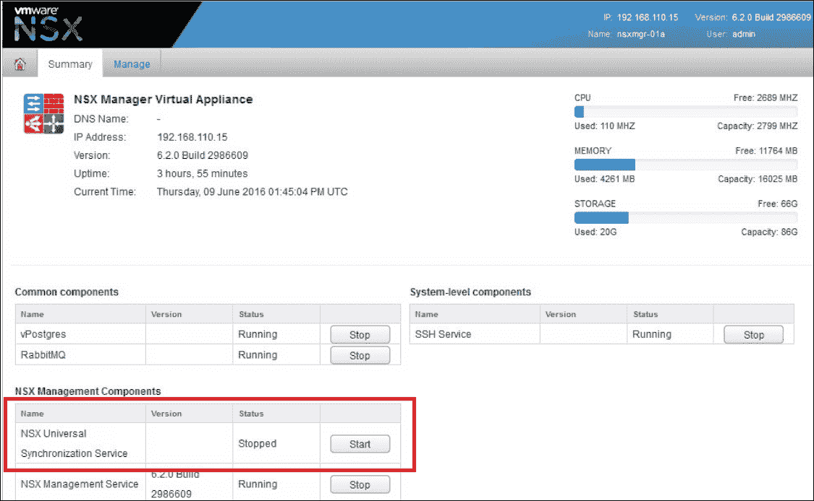

在我们的设置中，我们有两个 NSX Manager 和与之注册的 vCenter Server，它们使用一个共同的**平台服务控制器**（**PSC**）。PSC 是在 vSphere 6 中引入的，负责处理如 vCenter 单点登录、许可证、证书管理和服务器预留等功能。控制器已经在 NSX Manager 192.168.110.15 上部署，这将在短时间内成为我们的主 NSX Manager。我们都知道如何将 NSX Manager 与单独的 vCenter Server 注册，因为我们在第三章中已经讨论过，*NSX Manager 安装与配置*。假设我们已经成功完成了注册，现在是时候将**192.168.110.15**的 NSX Manager 提升为主节点，并将**192.168.210.15**设为次节点：

1.  选择**管理**选项卡并高亮显示**NSX Manager**。

1.  选择**操作**图标。

1.  选择**分配主角色**：


你猜，当我们将 NSX Manager 提升为主节点时会发生什么？如果你的想法与结果一致，我马上就展示这个结果。如果你的答案正确，恭喜你。

以下图示展示了 NSX Manager 主节点角色注册；**复制服务**正在自动启动：

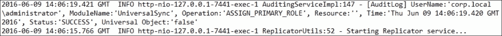

上面的截图是来自主 NSX Manager 的 NSX Manager 日志。正如我们在 GUI 中看到的，**复制服务**已自动启动，因为注册成功。以下图示显示了通用同步服务的运行状态：

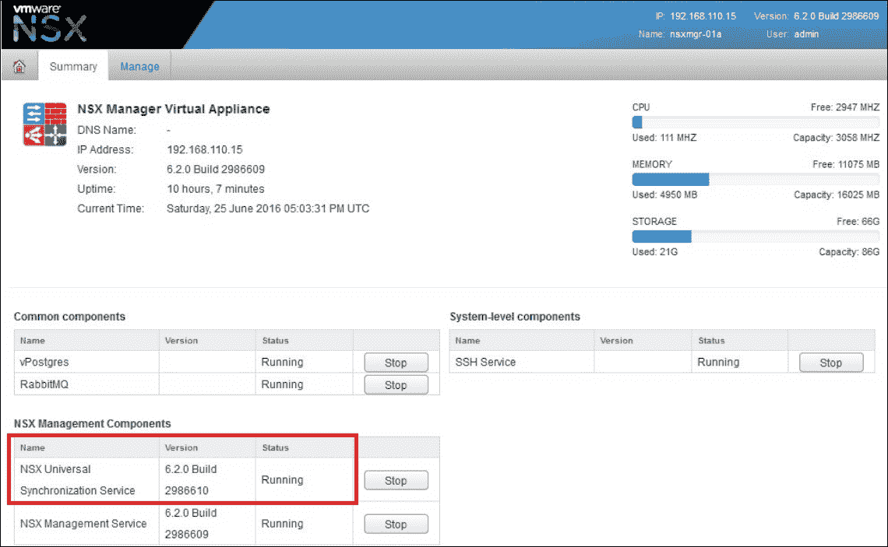

所以请留意这个输出，并在 GUI 中验证输出是否与日志中的输出匹配。这对于故障排除来说极其重要和有用。

# 通用段 ID

通用段 ID 池用于将 VNI 分配给通用逻辑交换机，以确保我们不会为本地和全局逻辑交换机使用相同的段 ID 池；否则最终会出现段 ID 重叠的情况。

以下图示展示了**通用段 ID 池**的创建：

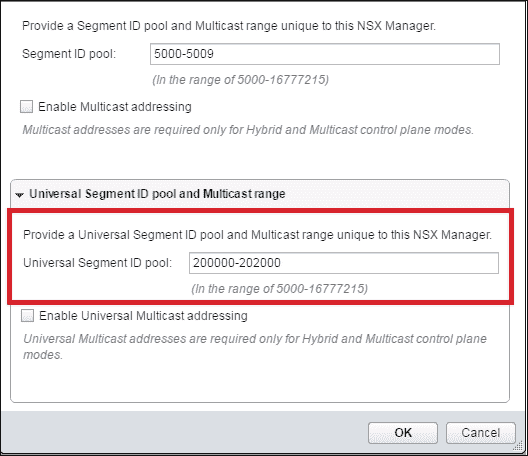

创建通用逻辑交换机的整个目的是为了在 vCenter 站点之间跨越逻辑网络，而不需要进行传统的复杂路由和交换。这样，通用逻辑交换机将可以在跨域的所有 vCenter 服务器上使用，我们可以简单地将虚拟机连接到这些逻辑交换机。虚拟机的逻辑交换机将始终保持为端口组，NSX 将处理跨 vCenter 的交换。难道我们没有配置比这更简化的第二层交换吗？首先，以前是否能够像这样进行第二层交换？我坚信，在本书中我们所增加的意识量足以让我们远离传统网络设计思维。

接下来，我们为第二个 NSX Manager 添加一个次级角色，以便我们可以开始创建通用传输区域和通用逻辑交换机。

添加次级 NSX Manager 的步骤如下：

1.  登录到与主 NSX Manager 链接的 vCenter。

1.  导航到**主页** | **网络与安全** | **安装**，然后选择**管理**选项卡。

1.  点击主 NSX Manager。然后选择**操作** | **添加次级 NSX Manager**。

1.  输入次级 NSX Manager 的 IP 地址、用户名和密码。

1.  点击**确定**。

以下图示展示了**添加次级 NSX Manager**选项：

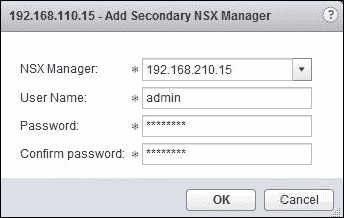

成功添加次级 NSX Manager 后，角色会显示为次级，正如以下截图所示：

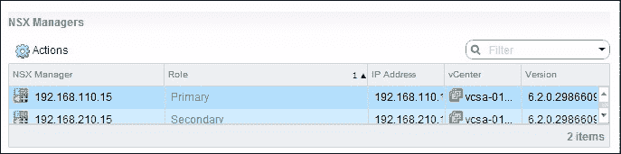

## 通用传输区域

由于我们有主要和次要 NSX 管理器，接下来让我们创建一个通用传输区域。首先，**在跨 vCenter NSX 环境中只能有一个通用传输区域**。在本章中关于 NSX 管理器角色的内容中，我们已经讨论了主要、次要和传输角色的区别，创建通用传输区域时也没有例外。通用对象始终从主要 NSX 管理器中创建。

下图显示了通用逻辑交换机的创建，并且我们已经添加了一个主要 NSX-VC 配对 vSphere 集群：

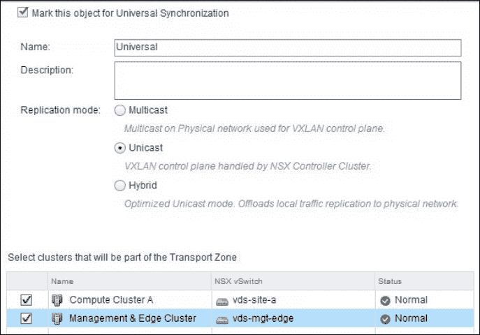

要从次要 NSX-VC 配对 vSphere 站点添加集群，我们需要将管理器设置更改为次要，并点击**连接集群选项**，这样会显示次要 NSX-VC 站点中的所有集群。每当我们添加新的集群时，我们所需要做的就是将这些新添加的集群连接到通用传输区域，在我看来，这也是我们扩展软件定义数据中心最简单的方法：

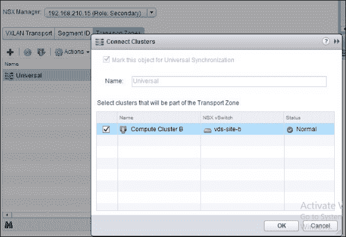

让我们做个快速测试：我们将创建一个通用逻辑交换机，并检查逻辑交换机是否在主要和次要 NSX 站点中被填充。听起来不错吗？那就开始吧。

# 跨 vCenter 通用逻辑交换机创建

好的！我们需要检查几个前提条件，以确保我们能够同时创建逻辑交换机并确保其按预期工作。创建通用逻辑交换机时应遵循以下关键点：

+   应配置 VSphere 分布式交换机

+   控制器必须部署在主要 NSX 管理器中

+   必须为 NSX 准备 VSphere 主机集群

+   必须配置 VXLAN

+   必须配置通用段 ID 池（不应与本地段 ID 重叠）

+   必须创建一个通用传输区域

现在让我们创建一个**通用逻辑交换机**：

1.  在 vSphere Web 客户端中，导航到**首页**|**网络与安全**|**逻辑交换机**。

1.  选择你希望在其上创建逻辑交换机的 NSX 管理器（这应该是主要 NSX 管理器；如果选择了次要 NSX 管理器，将无法选择通用对象）。

1.  点击**新建逻辑交换机**图标。

作为一个通用逻辑交换机，我们当然需要创建一个通用传输区域和段 ID；不过我们已经创建了这些。假设我们已经满足所有前提条件，接下来我们继续：

1.  输入通用逻辑交换机的名称；在我们的例子中，我们将其命名为****Universal****交换机。

1.  选择**传输区域**；这应该是本章之前创建的**通用传输区域**。

下图表示通用逻辑交换机的创建：

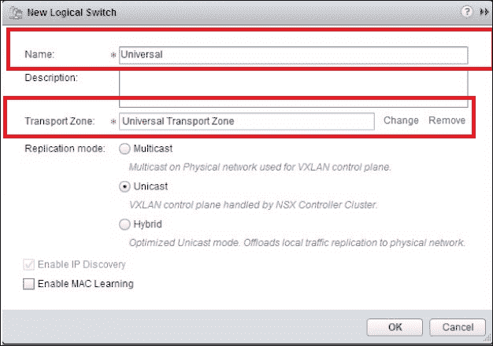

## 将虚拟机添加到通用逻辑交换机

由于我们已经创建了通用逻辑交换机，我们将继续将两个 vCenter 站点的两台虚拟机连接，并执行基本的 ping 测试。考虑到我们到目前为止所掌握的知识，这个实验任务对我们所有人来说都将是轻松的。让我们开始吧：

1.  在逻辑交换机中，我们需要选择您要添加虚拟机的逻辑交换机。

1.  点击**添加虚拟机**图标。

1.  选择您要添加到逻辑交换机的虚拟机。在我们的例子中，我们选择的是**Web-Site A**虚拟机，它已经预配置了 IP 1**72.17.10.11**，如下面的图所示：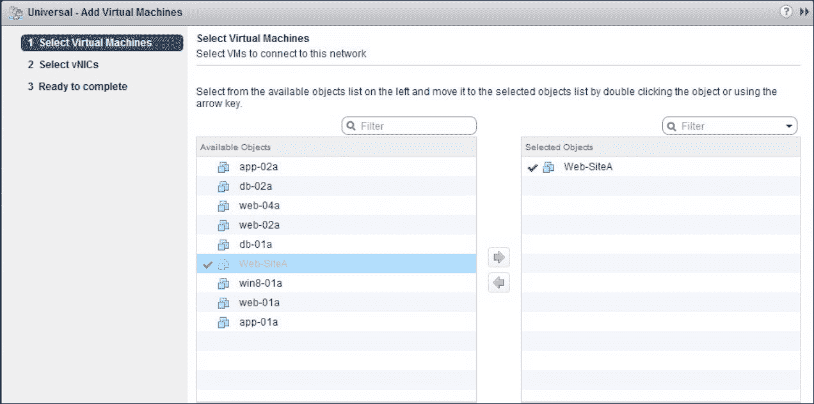

1.  选择您要连接的 vNIC，如下图所示：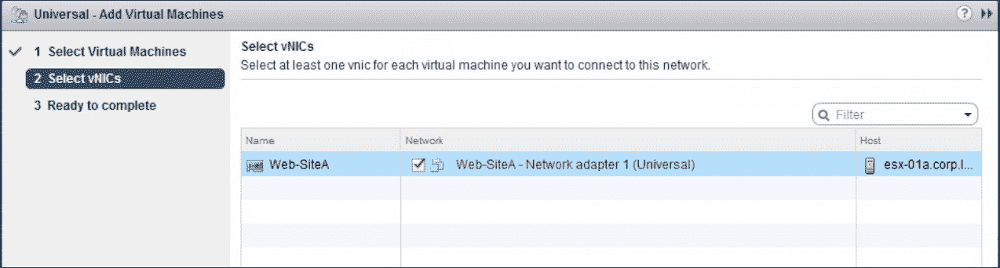

1.  点击**下一步**并**完成**对**Web-Site A**的连接配置任务。

    以下截图显示了**Web-Site A**虚拟机及其 IP 详细信息：

    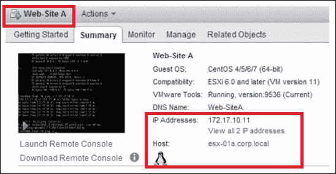

    如果我们在可用对象部分看不到正确的虚拟机，很有可能是我们处于错误的 NSX Manager 中。我们必须在正确的 NSX Manager（主/次）中，以查看 VC 虚拟机的库存列表。

1.  由于我们已经完成了 Site-A，虚拟机已被添加到通用逻辑交换机中，我们需要将 NSX Manager 角色切换到次要角色，这样我们就可以从次要 NSX Manager 的 VC 库存中将虚拟机添加到同一通用逻辑交换机中。我们该如何操作？这只是一个简单的切换，下面的截图演示了这一过程：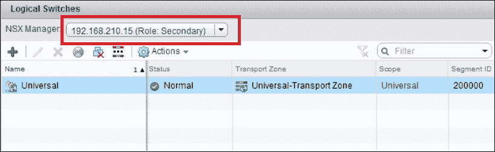

1.  我们需要重复步骤 1、2 和 3，并从第二个 vCenter 服务器添加虚拟机**Web-Site B**，它预配置了 IP **172.17.10.12**。

1.  点击**添加虚拟机**图标。

1.  选择您要添加到逻辑交换机的虚拟机。在我们的例子中，我们选择的是**Web-Site B**虚拟机。

以下截图显示了**Web-Site B**虚拟机及其 IP 详细信息：

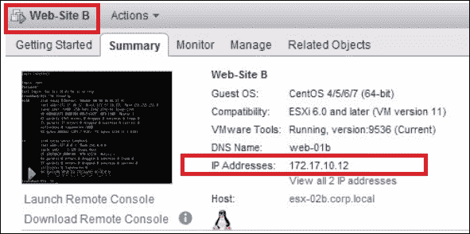

现在我们已经创建了一个通用逻辑交换机，并连接了位于两个 vCenter 服务器中的**Web-Site A**和**Web-Site B**虚拟机。传统上，在这种情况下我们需要一个二层交换机，因为虚拟机位于两个 vCenter 服务器上并且在相同的子网中。然而，跨 vCenter 的 NSX 通用逻辑交换机改变了数据中心二层交换的游戏规则。这无疑是一个很好的使用案例，不仅是为了跨 vCenter 虚拟机连接，我们还可以轻松设计一个活动-活动、活动-被动的 vSphere 数据中心用于灾难恢复配置，并与 VMware SRM 一起使用。

让我们做一个简单的 ping 测试，以确认这些 Web 服务器是否按预期进行通信。以下截图显示了**Web-Site B**虚拟机与**Web-Site A**的连接：

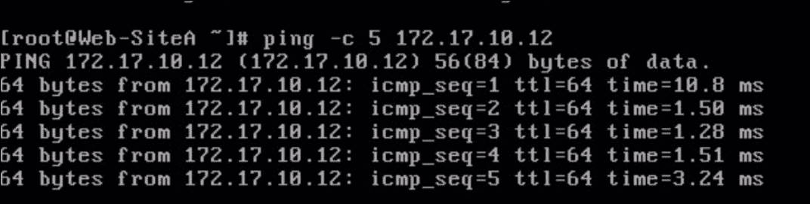

好的！通过利用通用逻辑交换机，我们已经在两个 vCenter 站点之间建立了二层连接。如果整个网络流看起来复杂或令人困惑，请让我们关注以下图示，它展示了我们迄今为止为了建立通用逻辑交换所做的全部配置：

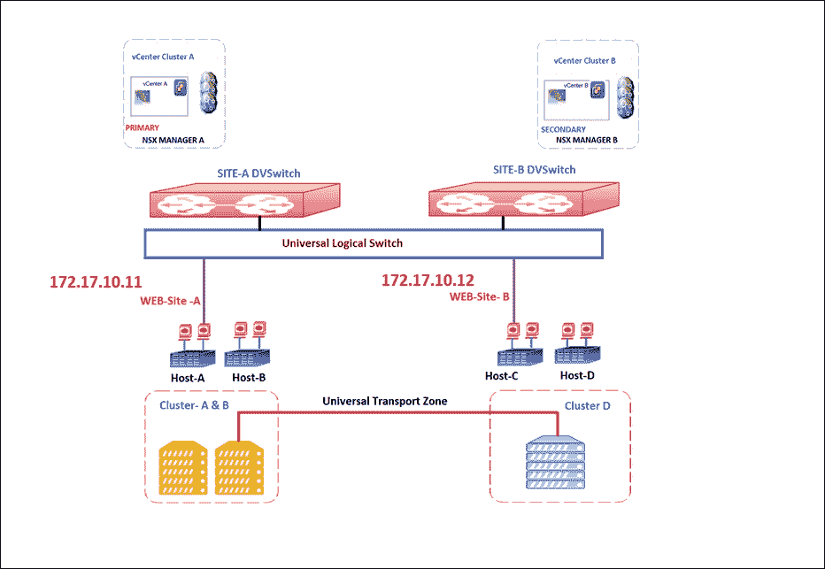

# 跨 vCenter Server 通用逻辑路由器

通用逻辑路由器提供了东-西数据中心流量之间的 vCenter Server 站点优化路由。目前，我们可以将此路由器称为**全球 NSX 路由器**，它将简化管理任务，如从单一管理界面配置和创建路由（静态/动态）和防火墙规则。我再次强调：与通用逻辑路由器相关的创建/删除以及所有管理活动只能在主 NSX 管理器上进行。接下来，我们将配置一个跨 vCenter Server 的通用逻辑路由器，并在两个 vCenter Server 站点之间建立路由。我们将使用在通用逻辑交换中使用的相同虚拟机进行此配置；然而，我已更改了**Web-Site B**的 IP/子网，这需要在**Web-Site A**和**Web-Site B**之间进行路由。让我们开始吧：

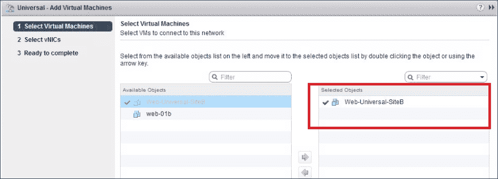

部署通用逻辑路由器的步骤如下：

1.  登录到 vSphere Web 客户端。

1.  点击**网络与安全**，然后点击**NSX 边缘**。

1.  选择**通用逻辑（分布式）路由器**（我们将在本章的*网络瓶颈*部分讨论本地出口）：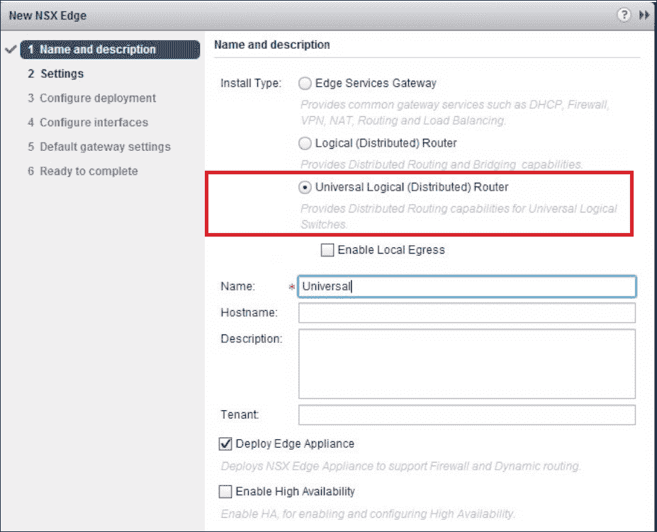

1.  输入**用户名称**和**密码**，用于**通用分布式逻辑路由器**（**UDLR**），如以下图所示：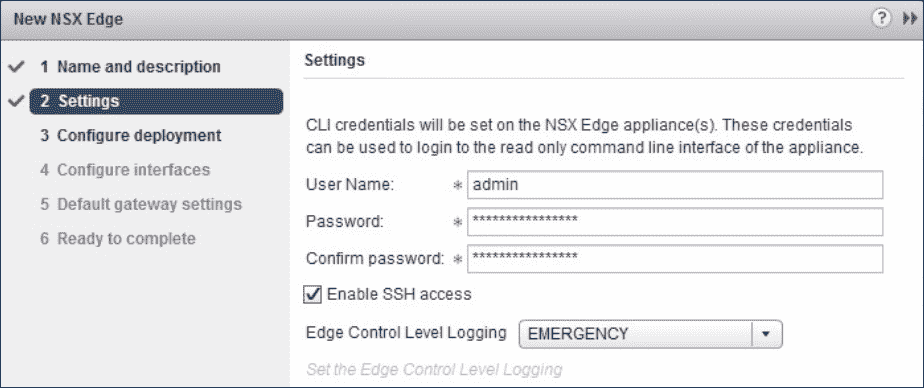

1.  选择**数据中心**和**NSX Edge Appliance**详细信息，如以下截图所示：

    ### 注意

    请注意，如果仅使用静态路由，则**NSX Edge Appliance**不是强制性的。然而，**Appliance 部署**对于动态路由和防火墙是必须的。

    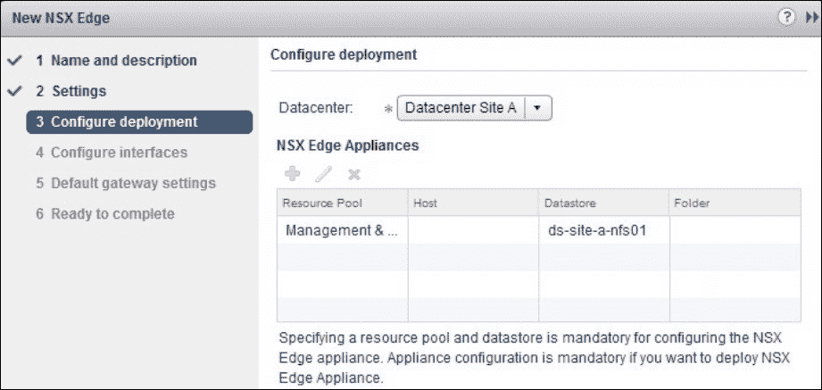

1.  对于高可用性接口配置，我们将接口连接到 vSphere 分布式端口组，并且它们将通过 APIPA 范围（169.250.0.0/26）IP 地址进行通信，如以下截图所示：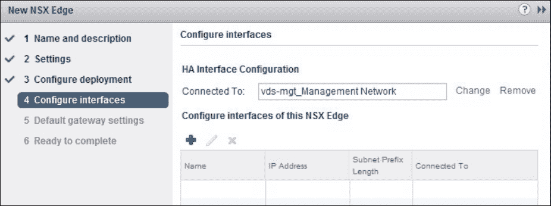

1.  最后，我们将向 UDLR 添加逻辑接口。

    以下截图展示了从 Site-A 到通用逻辑路由器（UDLR）的连接，目的是将 Web-Site-A 虚拟机连接到 UDLR：

    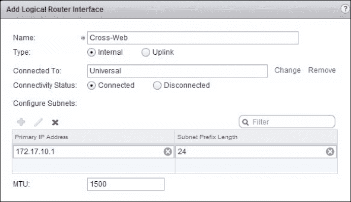

1.  我们需要重复步骤 7，将 Web-Site-B（位于第二个 vCenter 的虚拟机）添加到 UDLR，如下截图所示：

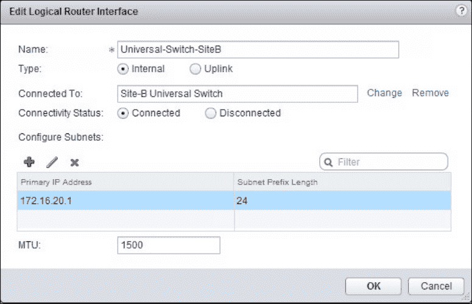

现在我们已经将两个通用交换机连接到 UDLR，让我们继续验证路由表。没有什么高深的技术，如果我们迄今为止都按照步骤认真操作，UDLR 应该会显示那两个逻辑网络作为直接连接的网络。以下截图展示了执行以下命令的输出结果：

```
Net-vdr -route -l UDLR-ID

```

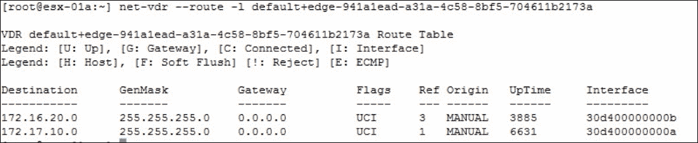

由于 UDLR 显示连接了 **172.16.20.0** 和 **172.17.10.0** 网络，我们应该能够在这些机器之间执行简单的 **ICMP** Ping 操作，前提是我们在路由器中添加了适当的防火墙规则。在我们的例子中，默认规则是允许所有流量，因此这里不应该存在任何瓶颈。

以下截图展示了从 **Web-Site-B**（172.16.10.11）到 **Web-Site-A**（172.17.10.11）的 ICMP Ping 成功：

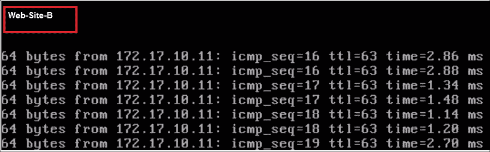

为了明确整体学习过程，让我们通过一个例子来看清楚路由是如何推送到底层 ESXi 主机的；我们以一个多租户拓扑为例，如下图所示：

1.  动态路由协议（OSPF）在 Site-A 和 B 边缘设备之间以及它们各自的数据中心路由器之间运行。

1.  Site-A 和 Site-B 的 NSX 边缘设备与通用分布式逻辑路由器（UDLR）连接。

1.  静态路由在 NSX 边缘设备上创建，用于到达 172.16.10.0 系列网络（根据业务需求，我们当然也可以利用动态路由协议）。

1.  UDLR 控制的虚拟机将把学习到的路由发送到 NSX 控制器集群进行分发。重申一下，由于这是跨 vCenter 的 NSX 解决方案，控制器只在主 NSX 管理器中运行，并且所有 NSX 管理器都通过通用同步服务充分了解通用 NSX 对象。

1.  主 NSX 控制器将把这些路由发送到底层的 ESXi 主机。

1.  ESXi 主机的内核路由模块将更新其路由表，并负责处理它从控制器学习到的那些网络的数据路径流量。

1.  前面提到的六个步骤是 NSX 环境中基本的路由学习过程：

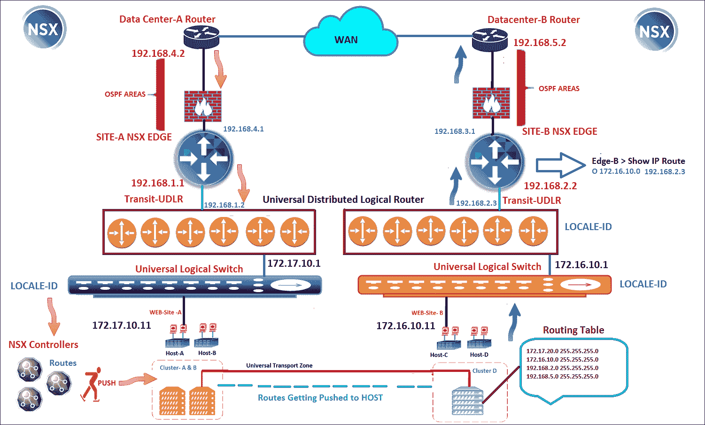

# 网络瓶颈

让我从一句话开始：*除非你非常清楚设计能够满足客户所有需求，否则绝不要提供或实施任何设计*。

这条规则并不限于市场营销或销售人员，它是给所有与技术打交道的人的通用建议。如果没有遵循，我们会听到这样的反馈：*我遇到了噩梦般的情况；所有问题都是在那次设计变更后开始的。你能把这个去掉吗？* 我们设计过或见过各种类型的 vSphere 网络。每种网络拓扑都会有一个漏洞。这个世界上没有完美的东西，我们能做的就是确保自己更好地为故障做好准备，这更像是一种优势而非失败？我希望大家暂停一分钟，看看前面的拓扑图；记录下可能中断数据流量的所有故障场景。再者，如果我们仔细观察拓扑图，会发现通用控制 VM 和边缘设备运行在两个不同的站点。那么，UDLR 控制 VM 如何确保它从特定的 NSX Edge 学到的路由是该站点下的 ESXi 主机所学习的唯一路由呢？我知道这个说法有点困惑。没关系，我们需要的只是，站点 A 的设备（边缘设备/控制 VM）学到的路由会发送到站点 A 的 ESXi 主机，站点 B 则反之亦然。好吧！那么我们开始吧，继续阅读以下有用的要点，确保我们的设计满足客户需求，避免引发任何进一步的问题：

1.  两个数据中心都运行着两台 NSX 设备，我们需要确保它们以 HA 模式运行，并且 vSphere HA 已配置。这样，单个设备/主机故障的影响会更小：

    +   NSX Edge

    +   UDLR 控制 VM

1.  确保我们使用 **LOCALE-ID（默认情况下，该值设置为 NSX 管理器的 UUID）**。通过 Locale-ID 配置，NSX 控制器会将路由发送到匹配 Locale-ID 的 ESXi 主机。在我们的拓扑中，每个站点的 ESXi 主机会维护一个特定站点的本地路由表。我们可以在每个集群、主机级别和 UDLR 级别设置 Locale-ID。这非常适合多租户网络/云环境，其中每个租户都希望维护特定于该租户的路由。

1.  所有 **南北向** 流量由 **站点 A NSX Edge** 和 **站点 B NSX Edge** 在各自的站点中处理。从 NSX 6.1 开始，**等价多路径**（**ECMP**）得到了支持。因此，我们可以部署多个 NSX Edge，ECMP 算法会基于源和目标 IP 对流量进行哈希处理。ECMP 可以在边缘设备和 DLR 上启用。这样，如果发生故障，它会重新计算哈希，并将流量路由到活动的边缘设备/DLR。此外，某些设计可能需要连续的 ECMP 配置，分布式逻辑路由器到 NSX Edge，以及 NSX Edge 到物理路由器。

1.  我们绝不应该设计会破坏现有拓扑的方案。当我们处理 ECMP 时，需要注意的是，NSX Edge 拥有有状态防火墙。我们很可能会遇到非对称路由问题；基本上，从源到目标的包使用一条路径，而回复时则走另一条路径，因为任何时候只有一个 Edge 会知道流量路径。别担心：当我们在 NSX 6.1 中启用 ECMP 时，会收到一条消息，提示启用此功能将**禁用 Edge 防火墙**。**别担心**，我们并没有在这种设计中妥协防火墙规则。我们可以在 NSX Edge 和上游路由器之间部署任何第三方物理防火墙（如图所示），或者我们需要利用分布式防火墙，在 VNIC 层过滤流量。然而，从 NSX 6.1.3 开始，ECMP 和逻辑防火墙可以共同工作，且出于同样的原因，在启用 ECMP 时，逻辑防火墙默认不会被禁用（主动/备用 NSX Edge）。下图展示了同一拓扑中添加 **ECMP** 配置后的情况：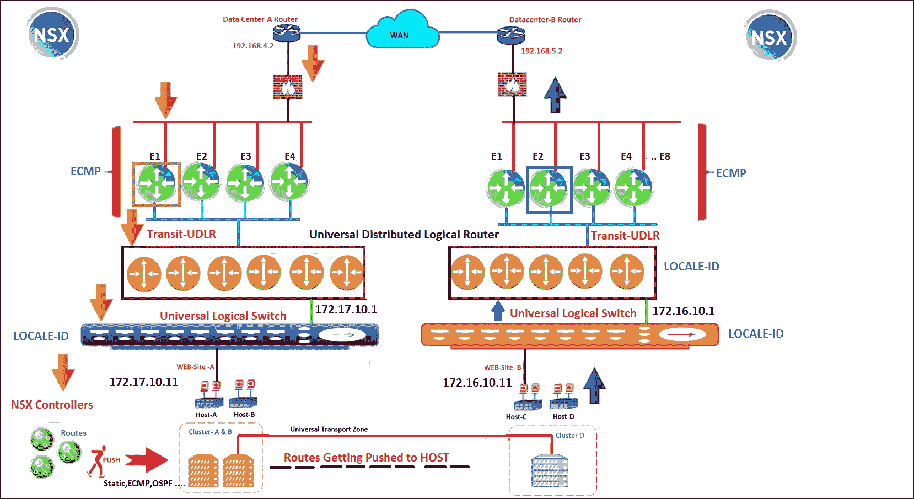

1.  由于每个站点都有运行中的 NSX Edge，因此通过在特定站点的 Edge 上配置 NAT，支持**重叠**的 IP 地址。再次强调，这是一个需求非常高的使用场景，尤其是对于云服务提供商。

1.  我们可以同时让八个 NSX Edge 参与 ECMP 配置；在我们的情况下，每个站点有八个 ECMP 边缘，总共有 16 个 Edge 可以以这种方式运行。

1.  如果发生 Site A 或 Site B 完全故障的最坏情况会怎么样？当然，任何问题都有解决方案，但在这种情况下，解决方案会稍显繁琐，并且取决于物理网络设计。在另一个站点重新配置所有 NSX 组件可能不起作用。

1.  Site-B 是我们拥有主 NSX Manager 的地方，而 Site-B 完全故障。从 NSX Manager 角色更改开始，我们需要部署 Edges 和设备，并且只有在物理网络设计在两个站点之间完全匹配时，才能将环境恢复到正常状态。我知道这是一个繁琐的过程，因此如果我们想自动化这些任务，我们需要利用 NSX API 和 VRO 工作流，以便简化大量手动操作。在极少数情况下，我们可能需要重新配置物理网络，以便 Site-B 的机器在故障期间能够与物理网络通信，尽管它们当时处于 Site-A。

关于故障类型有很多内容可以讨论，比如网络站点中的 NSX 组件同时发生故障，或者虚拟环境与物理网络部分/完全故障的场景。还有一些路由协议（OSPF/BGP）特定的故障场景，这些问题也引发了一些值得讨论的要点。要在一本书中涵盖所有这样的故障场景并根据设计类型采取预防措施是非常困难的。幸运的是，VMware 的 NSX 产品文档并不限于安装、配置和一般设计内容。他们发布了一些专门针对厂商集成的设计指南，比如 NSX+UCS 设计、NSX+CISCO ACI 等。等我们掌握了基础知识后，读一读这些文档是很有价值的。希望到目前为止，我们在七章中学到的内容已经为登上网络虚拟化的阶梯奠定了基础。到目前为止，我们对 VMware NSX 拓扑的讨论非常精彩，乐观地说，到现在为止，我们都已经清楚了 VMware NSX 是如何重塑数据中心网络的。

# 总结

我们从介绍 NSX 跨 vCenter Server 开始，接着讨论了跨 vCenter Server 组件和通用对象创建，最后讨论了一些在跨 vCenter Server 部署 NSX 时需要特别注意的设计决策。早些时候，网络故障排除主要由网络架构师和支持工程师单独完成，这让 vSphere 用户的生活变得更加轻松。由于 NSX 是运行在 vSphere 上的网络软件层，人们通常认为它可能会让他们的生活变得有些复杂，因为他们需要清晰地了解超管和网络虚拟化层的情况。

对我来说，故障排除是一门艺术；如果我们遵循一个系统的检查流程，解决问题简直是小菜一碟。没有任何秘密或简单的自动化可以帮助我们分析和修复网络虚拟化中的问题。

在下一章中，我们将详细讨论 NSX 故障排除。因此，让我们确保回顾一下所学内容，并通过根据具体情况应用这些知识来实践。
