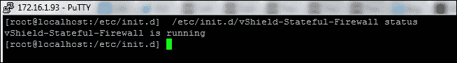
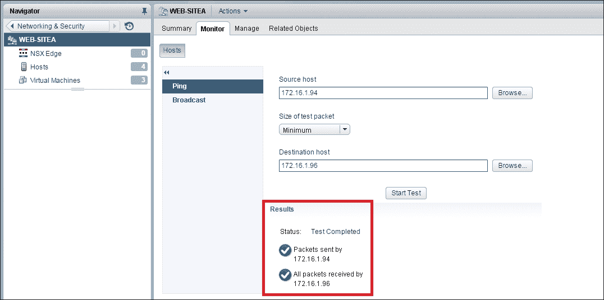

# 第八章.  NSX 故障排除

让我从安提斯滕尼斯的名言开始本章：

> *“不忘记你已经学到的，才是最必要的学习。”*

我找不到比这更合适的名言来提醒大家，确保我们回顾前面章节中学习到的关于如何处理问题的知识，找出最佳解决方案是多么重要。为了让最佳解决方案也是最快的，我们真的需要知道如何处理一个场景，从哪里开始寻找，哪些日志有用，最后，何时需要联系供应商进一步排查。正如我们所知道的，我们的课程集中于 NSX 与 vSphere 的结合。NSX 与 vSphere 紧密集成。

以一个实际例子来说，即使是结构坚固的建筑也无法建立在薄弱的基础上。糟糕的 vSphere 设计将直接影响 NSX 组件，无论 NSX 设计多么优秀。这条经验法则适用于任何基于 vSphere 运行的 VMware 解决方案。在本章中，我们将讨论以下主题：

+   NSX 安装和注册问题

+   日志收集过程和步骤

+   VXLAN 故障排除

# NSX Manager 安装和注册问题

安装 NSX Manager 是最简单的任务之一，残酷的事实是，任何熟悉 vSphere OVA/OVF 部署的人都可以轻松部署 NSX Manager，而无需任何 NSX 产品的先验知识。我们确信，在生产环境中，没有人会采用这种方法。然而，我仍然想让大家了解 NSX 安装的重要性。让我们仔细阅读以下几点：

+   在我们尝试注册 NSX Manager 时，不能与同一 vCenter 注册任何 vCloud 网络安全（VCNS/vShield Manager）。如果我们发现有这样的环境，我们必须确保取消注册其中一个解决方案；肯定是 VCNS/vShield，因为与 NSX Manager 相比，它是一个过时的解决方案。这并不意味着我们可以在同一 vCenter Server 上注册两个 NSX Manager。然而，我们可以将 VCNS 升级到 NSX，升级指南的链接将在本章的最后部分分享。

+   永远不要将以前使用过的 NSX Manager 实例导入新环境并注册为新 vCenter 的解决方案。

+   始终检查 NSX Manager 是否与多少个 vSphere 解决方案注册。例如，我们可能已经将**vCloudAutomation Center**（**VCAC**）和**vCloud Director**（**VCD**）注册到 NSX Manager A，而 NSX Manager A 还与 vCenter Server 环境注册。我之所以对这些解决方案更感兴趣，是因为不仅在安装过程中需要仔细规划和设计，在故障修复时，NSX 产品的卸载也需要特别的考虑。每个解决方案的集成都需要在取消注册 NSX Manager 时采取独立的步骤。

+   在 NSX Manager 初次部署后，始终备份 NSX Manager。绝不要依赖 vSphere 快照功能来进行此备份活动。

+   NSX Manager 可以作为普通的 vSphere 虚拟机来排查任何与网络相关的问题。例如，我们可以将 NSX Manager 从一个主机迁移到另一个主机，或者使用 ESXTOP 命令查看 Tx 和 Rx 计数，以便隔离网络问题。

+   在注册 vCenter Server 时，我们有两个选项：

    +   **查找服务注册**：查找服务注册是导入 SSO 用户的可选功能。然而，如果我们与 SSO 身份源集成，必须遵循所有供应商特定的最佳实践，以确保身份源的可用性。但值得记住的是，除登录到 NSX Manager 外，SSO 出现故障对 NSX 组件及其功能没有任何影响。

    +   **vCenter Server 注册**：vCenter Server 的注册是第一步，也是最关键的集成。因此，我们需要确保以下几点的连接性和配置正确：

        +   **NSX Manager**和**vCenter Server**之间应配置 DNS 解析。

        +   **NTP**应该正确配置；这个点对于大多数专家来说可能非常熟悉，但我还是要重申：错误的 NTP 配置在我们集成查找服务（SSO）并尝试利用基于 SSO 的认证时，影响非常大。

        +   **防火墙**端口应在 NSX Manager 和 vCenter Server 之间打开。始终检查 VMware **知识库**（**KB**）文章以了解端口要求。以下链接指向一篇 VMware KB 文章，讨论了所有端口要求：

            +   `https://kb.vmware.com/selfservice/search.do?cmd=displayKC&docType=kc&docTypeID=DT_KB_1_1&externalId=2079386`

            +   在注册到 NSX Manager 时，确保我们使用的是 vCenter Server 的管理员权限。我们当然可以使用 administrator@vsphere.local 账户将 NSX 注册到 vCenter、vCloud Director 和 vRealize Automation 产品中。

# 故障排除 NSX Manager

根据情况，我们可能需要为 VMware 支持收集 NSX Manager 的诊断信息。在此类情况下，请牢记以下步骤。

## 通过 GUI 收集 NSX Manager 日志

通过 GUI 收集 NSX Manager 日志的步骤如下：

1.  通过网页浏览器登录到****NSX Manager****虚拟设备。

1.  在**NSX Manager 虚拟设备管理**中，点击**下载技术支持日志**。

1.  点击****下载**** | ****保存****。以下截图显示了 NSX Manager 日志下载：


## 通过 CLI 收集 NSX Manager 日志

可能会出现 NSX Manager GUI 无法正常工作，我们可能需要依赖 CLI 来收集日志。对于不喜欢 CLI 的用户，这次没有逃避的机会；我们需要通过以下步骤捕获 NSX Manager 日志：

1.  通过 SSH 会话登录到**NSX Manager**虚拟设备。

1.  通过输入`enable`进入****启用模式****。

1.  在 **启用模式** 下执行以下命令，命令会根据我们选择的主机名将 NSX Manager 日志保存到远程位置：

`export tech-support scp USERNAME@HOSTNAME:FILENAME`

以下截图展示了 NSX CLI 日志捕获：


# VMware 安装包

虚拟化主机本质上是网络虚拟化的骨干。虚拟机能够利用 NSX 特性，主要是因为 ESXi 主机是一个网络虚拟化主机。NSX 安装的一个关键支柱是 ESXi 主机的准备。如果 ESXi 主机上没有运行正确的模块，那么利用 NSX 特性的目的就会失效。可能的症状是我们可能无法安装特性 *X*，或者可以配置特性 *X*，但功能会受到影响。请注意以下在 ESXi 主机中的 VIB：

+   esx-vxlan

+   esx-vsip

+   esx-dvfilter-switch-security（从 NSX 6.2.0 开始，esx-dvfilter-switch-security 成为 esx-vxlan vibs 的一部分）

这是检查 VIB 是否已安装在 ESXi 主机中的命令：

```
esxcli software vib list | grep vibname

```

由于这些是 VIB，我们可以在修复场景中手动卸载并重新安装相同的 VIB。但真正的问题是，谁在推送这些 VIB？我在这里看到的大多数问题都是出自这个原因。幕后，vCenter Server ESX Agent Managers (**EAM**) 负责安装这些 VIB。因此，首要任务是确保 EAM 服务正在运行。以下步骤对于根据操作系统和 vCenter Server 版本收集 EAM 日志非常有用。

## EAM 日志位置

以下是各版本 vCenter Server 和操作系统对应的 EAM 日志位置：

+   VMware vSphere 5.1.x/5.5.x（EAM 是通用 Tomcat 服务器的一部分）：

    +   Windows 2003: `C:\Documents and Settings\All Users\Application Data\VMware\VMware VirtualCenter\Logs\eam.log`

    +   Windows 2008: 与 Windows 2003 相同，VC 日志目录位于 `C:\ProgramData\VMware\VMware VirtualCenter\Logs\`

    +   **vCenter Server 虚拟设备** (**VCVA**): `/storage/log/vmware/vpx/eam.log`

+   VMware vSphere 6.x（EAM 是独立服务，并嵌入了 tcserver）：

    +   Windows 2003: `C:\Documents and Settings\All Users\Application Data\VMware\CIS\logs\eam\eam.log`

    +   Windows 2008: 与 Windows 2003 相同，VC 日志目录位于 `C:\ProgramData\VMware\VMware VirtualCenter\Logs\`

    +   CloudVM: `/storage/log/vmware/eam/eam.log`

我见过很多问题，特别是当 vCenter Server 安装是基于 Windows 时，EAM 尝试使用端口`80`下载 VIB 时。此时，VC 中可能有其他应用程序或服务正在使用端口`80`，这会导致 VIB 下载失败，因此我们必须更改默认的 EAM 端口。然而，从 VMware vSphere 6.0 开始，支持通过端口`443`（而不是端口`80`）下载 VIB。这个端口是动态开启和关闭的。ESXi 主机与 vCenter Server 之间的中间设备（防火墙）必须允许通过该端口的流量。这样，我们将进入下一个主题：控制平面和数据平面日志收集。

# 控制平面和数据平面日志收集

日志收集对于主动预警和根本原因分析至关重要。有多少次我们最终收集了错误的日志集，或者收到了反馈，说我们必须启用或提高某些日志级别，以确保我们收集了合适的日志来分析根本原因？从技术上讲，这类反馈是可以理解的。然而，当涉及到生产影响时，如果在查看日志后发现没有得出结论，那将是令人失望的。解决此问题的唯一方法是：我们应该清楚需要收集哪些日志，最重要的是，应该从哪个位置收集。首先，我们需要了解以下几个背景知识：

## 理解物理拓扑

理解物理拓扑不仅对于整体 NSX 设计和功能配置至关重要，还同样重要的是在发现有更好的设计方式时能够提供有效的反馈。以下是我们需要时刻注意的几个要点：

+   物理网络设计 - 脊叶/层 2 架构

+   现有的防火墙部署和规则

+   整体数据中心路由和交换拓扑

+   vSphere 集群设计（机架放置）和拓扑。除此之外，还需要了解当前或未来配置所需的集群数量（单站点、多站点）、数据中心以及主动-主动或主动-被动的物理数据中心设计。

+   vSphere 分布式交换机上行链路策略

以下是基于上述几点的建议：

+   **物理网络设计 - 脊叶/层 2 架构**：脊叶架构是如今最好的也是最广泛使用的连接方式，因其具备完全网状连接、低延迟、高带宽、ECMP 路由，最重要的是，网络扩展非常容易实现。

+   **现有防火墙部署和规则**：这是一个重要的检查，主要是因为 NSX Edge 防火墙和微分段能力。我的建议是尝试集成 vRealize Network-insight 软件，以便了解南北向和东西向流量的总体增长，然后决定在哪些点配置哪些防火墙策略。在本章的结尾部分，我对 vRealize Network-insight 软件做了简要总结。

+   **整体数据中心路由和交换拓扑**：

    +   在这里，我们主要关注物理网络中使用的路由协议——例如 OSPF、BGP、ISIS。

    +   例如，基于 OSPF 配置的区域类型，假设上游路由器是 **区域边界路由器（ABR）**，我们需要知道哪些路由应该从 NSX Edge 注入到上游路由器，以及允许流量的适当防火墙策略。

    +   在二层方面，理想情况下，ESXi 和 VXLAN 流量是我们需要了解的最重要参数，以便为 VLAN-ID（管理、VMotion、存储、VXLAN）分配/配置。

+   **vSphere 集群设计（机架中的部署位置）和拓扑**：

    +   集群设计应该理想地将管理和边缘集群与计算集群分开，管理和边缘集群至少有 4 台主机，而计算集群最多有 64 台主机（仅在环境运行 vSphere 6.0 时）。

    +   对于配置了 SRM 和 NSX 的灾难恢复环境，建议在灾难恢复站点保持类似的物理和虚拟设计。某些情况下，可能要求工作负载长时间运行在灾难恢复站点，因此我们需要遵循这一严格规则。

+   **vSphere 分布式交换机上行链路策略**：这是我们在 第三章中讨论过的相同主题，*NSX 管理器安装与配置*：

    +   在这里，我们需要选择并配置 NIC 集群和故障转移策略。例如，如果选择 LACP 配置，我们将受到单一 VTEP 配置的限制，而基于端口和源 MAC 哈希的路由支持多 VTEP 配置。防患于未然，建议通过所有可用上行链路负载均衡 VXLAN 流量，而不是因性能问题而遭遇麻烦。

这些小点讨论背后的目的是确保所有配置/设计方面提前得到妥善处理，而不是后期花费时间进行配置和性能调优。

# NSX 控制器日志收集

控制器是 NSX 整体架构中的真正变革性组件。正因如此，在故障排除时它仍然是一个至关重要的部分。正如我们所知，控制器是通过 **开放虚拟化设备**（**OVA**）从 NSX 管理器部署的。在最坏的情况下，甚至控制器的部署可能会失败，这将成为任何 NSX 实施的拦路虎。这类故障大多数发生的原因有以下两个：

+   DNS

+   NTP

在 ESXi 主机、vCenter Server 和 NSX Manager 之间应进行适当的 DNS/NTP 配置，以确保 NSX Controller 部署成功。除此之外，vSphere 中任何虚拟机的成功部署都需要足够的计算和存储容量，NSX Controller 也不例外，主要因为这些都是从 ESXi 主机的角度来看是虚拟机。对于收集 NSX Controller 日志，我们需要完成以下步骤：

1.  首先，我们需要使用 vSphere Web 客户端登录到 vCenter Server。

1.  点击**网络与安全**。

1.  点击左侧面板上的**安装**。

1.  在**管理**选项卡下，选择你想要下载日志的控制器。

1.  点击**下载技术支持日志**。

1.  以下截图展示了 NSX Controller 日志收集过程：


如果 Web 客户端无法使用，或者我们无法访问 Web 客户端怎么办？在这种情况下，我们可以采用两种方法来收集日志：

1.  使用 vSphere 客户端会话，我们可以连接到运行控制器的 vCenter Server 或 ESXi 主机，并且我们可以通过虚拟机控制台会话访问控制器，利用 CLI 命令进行日志收集。

1.  直接通过 SSH 会话连接到控制器并执行 CLI 命令进行日志收集。

## 使用 CLI 步骤收集 NSX Controller 日志

首先，使用之前的任何步骤登录到你想要收集日志的 NSX Controller，并执行如下命令，如截图所示：

```
save status-report filename

```


控制器日志收集完成后，我们可以将这组日志复制到任何与控制器具有 IP 连接的机器上。

在以下示例中，我将控制器日志复制到了其中一台管理 ESXi 主机的 TMP 位置：


接下来，我们将转到 NSX Edge 和 DLR 日志收集，最后会结束于数据平面日志收集和一些重要的服务状态。

收集 Edge 和 DLR 日志的过程几乎相同。

## 通过 Web 客户端收集 Edge 和分布式逻辑路由器日志

以下是收集分布式逻辑路由器日志的步骤：

1.  首先，使用 vSphere Web 客户端登录到 vCenter Server。

1.  点击**网络与安全**图标。

1.  点击左侧面板上的**边缘**。

1.  在右侧面板中，选择我们想要下载日志的边缘设备（**DLR/EDGE**）。

1.  点击**操作**并选择**下载技术支持日志**。

在下图中，我们可以看到**下载技术支持日志**已被高亮显示在分布式逻辑路由器（DLR）上，我之前提到过，这与收集 NSX Edge 日志的过程相同：


要通过 CLI 收集日志，我们需要执行以下命令，可以通过以下任一步骤来执行：

1.  使用 vSphere 客户端会话，我们可以连接到 vCenter Server 或运行控制器的 ESXi 主机，并可以通过 VM 控制台会话连接到控制器，以利用 CLI 命令进行日志收集。

1.  直接通过 SSH 会话连接到控制器并执行 CLI 命令以收集日志：

```
 export tech-support scp user@scpserver:file

```

我们已经讨论了什么是 EAM 以及它在 NSX 环境中的作用。除了 vSphere 故障排除部分，我们还需要检查两个在 NSX 准备的 ESXi 主机上运行的用户世界代理的状态和日志级别。

# NSX 用户世界代理

NSX Manager 负责部署 NSX 控制器集群，推送 **vSphere 安装包**（**VIBs**）以启用 VXLAN、分布式路由、分布式防火墙，并且用于与控制平面级别通信的用户世界代理。用户世界代理的功能至关重要，任何故障都会直接影响控制平面的学习，最终影响数据平面流量。因此，让我们来讨论这些代理及其基本健康检查和日志位置。

## netcpa

它是与 NSX 控制平面通信的用户世界代理，netcpa 服务应在已准备的 NSX ESXi 主机上运行。如果功能受到影响，我们肯定会在 NSX 环境中遇到路由和交换问题，并且自从 netcpa 服务停止运行以来，ESXi 主机将无法学习新路由。因此，这一点非常重要：仅在 NSX Edge 虚拟机上创建路由是无法解决问题的；除非 netcpa 服务已正常运行，否则 ESXi 主机无法学习这些路由。请按以下步骤检查与 netcpa 相关的问题：

1.  检查 netcpa 服务是否在主机上运行（此操作需要在我们遇到网络或控制平面相关问题的主机上进行检查）。

1.  使用以下命令检查 netcpa 服务：

```
 **/etc/init.d/netcpad status** 

```

以下截图显示了 netcpa 代理的状态：


检查 netcpa 配置文件是否显示所有控制器。使用以下命令检查配置文件中的控制器详情：

```
cat  /etc/vmare/netcpa/config-by-vsm.xml

```

以下截图显示了配置文件输出，其中包括控制器 IP 和 SSL 证书指纹信息：


在 ESXi 主机的 `/var/log/netcpa.log` 文件中，我们可以查看完整的 netcpa 日志。以下截图显示了控制器注册信息，这些信息已被填充到 netcpa 日志中：


每当我们遇到 netcpa 服务问题时，我强烈建议重启该服务，以确认是否能解决问题。要重启 netcpa 服务，我们需要按照以下步骤操作：

1.  通过 SSH 或通过 DCUI 控制台以 root 身份登录到 ESXi 主机。

1.  运行`/etc/init.d/netcpad restart`命令以重启 ESXi 主机上的 netcpa 代理。

## Vsfwd

NSX 分布式防火墙是一个集成于虚拟化平台的防火墙，除了主机需要安装防火墙`vib`外，还需要有一个 vsfwd 守护进程在运行，以确保与 NSX 管理器之间的消息总线通信正常。

以下命令和截图显示了 ESXi 主机上的有状态防火墙状态：

```
etc/init.d/vShield-Stateful-Firewall status

```



要检查与 NSX 管理器的活动消息总线会话，可以使用以下命令和截图来查看与 NSX 管理器（172.16.1.5）的活动会话：

```
esxcli network ip connection list | grep 5671

```


如果端口`**5671**`在 ESXi 主机和 NSX 管理器之间未打开，可能会发生潜在的故障。

### Vsfwd 日志位置和收集过程

NSX 分布式防火墙是 vSphere 环境中的新一代防火墙，主要因其能够在虚拟机 NIC 级别过滤流量而广泛使用。因此，理解日志收集和相关的故障排除步骤非常重要。那么，让我们开始吧。

首先，我们需要了解运行**分布式防火墙**（**DFW**）的前提条件。即使以下要求未满足，也无需进行日志收集。运行 DFW 的前提条件如下：

+   VMware vCenter Server 的最低版本应为 5.5

+   VMware ESXi 版本应为 5.1、5.5、6.0

+   VMware NSX for vSphere 6.0 及更高版本

所有与 vsfwd 相关的日志都将位于以下位置，并且其表示方式如下图所示：

```
/var/log/vsfwd.log file on the ESXi host

```


# 从 NSX 管理器收集集中日志

首先，我们需要使用管理员凭据登录到 NSX 管理器并执行以下命令：

```
export host-tech-support host-id scp uid@ip:/path

```

随着 NSX 6.2.3 的推出，VMware 推出了一个导出主机技术支持命令，可以在 NSX 管理器上执行以收集以下信息。我坚信他们将会增加更多的日志收集选项，因为这是集中式的日志收集方式，但很多情况取决于故障类型。如果遇到 NSX 管理器故障，集中式日志功能也会受到影响，因此了解这种情况的下一步计划非常重要，这也是我迄今为止解释日志收集过程的目的。以下是当前集中式日志中包含的日志列表：

+   vmkernel 和 vsfwd 日志文件

+   过滤器列表

+   DFW 规则列表

+   容器列表

+   Spoofguard 详细信息

+   主机相关信息

+   ipdiscovery 相关信息

+   RMQ 命令输出

+   安全组和服务配置文件及实例详细信息

+   esxcli 相关输出

# VXLAN 故障排除

VXLAN 是 VMware NSX 环境中用于首次测试和实施的覆盖技术，最有可能出现一些连接问题。由于虚拟和物理网络配置错误，我们可能会遇到以下一些常见问题：

+   虚拟机没有网络连接，无论是同一 VXLAN 网络中的其他机器之间，还是没有与物理网络的出口连接。

+   经常出现数据包丢失，并且应用团队面临性能差的问题。

+   虚拟机在一些 ESXi 主机上具有正常的网络连接，但当它们被放置在另一组主机上时，则没有网络连接。

+   普通的 ping 测试正常，但当检查 VXLAN 数据包时，会出现数据包丢失。

+   VLAN 网络中的虚拟机具有正常的网络连接；然而，VXLAN 网络无法正常工作。

与 VXLAN 相关的大多数网络问题将集中在上述问题列表中；然而，只有通过应用我们的知识，我们才能清楚地了解客户的网络类型以及他们面临的网络问题。因此，让我们开始了解这些问题的可能症状以及解决问题所需的必要行动。

在实施 VXLAN 解决方案后，我强烈建议在所有 NSX 配置好的 ESXi 主机之间检查 GUI 层面的 PING 和 VXLAN 测试，这是确认是否满足初步要求的最佳方式，这些初步要求是为了从一个虚拟化主机向另一个虚拟化主机发送 VXLAN 数据包。

我们需要选择一个逻辑交换机。进入 **监控** 页面，我们将看到两个选项：

+   **Ping**

+   **广播**

以下截图展示了 **Ping** 和 **广播** 测试选项：

首先，我们将对 `172.16.1.94` 和 `172.16.1.96` 之间的 ESXi 主机进行 **Ping** 测试，然后进行 VXLAN 测试。以下截图展示了成功的 Ping 测试：

以下截图展示了同一 ESXi 主机之间的 VXLAN 测试，我们可以确认，从主机 `172.16.1.94` 发送的 VXLAN 数据包已被 `172.16.1.96` 成功接收：


除了前面的测试外，我们还可以通过 SSH 会话执行 VXLAN ping 测试，我已经捕获了在两台 ESXi 主机之间进行此测试的输出。执行此测试的命令如下：

```
ping ++netstack=vxlan -d -s MTU VTEP-IP

```

以下截图展示了通过 SSH 会话对主机 172.16.1.94 进行的 VXLAN 测试：


上述输出清楚地表明 VXLAN 环境中的 MTU 设置正确，因此我们能够支持大于 1500 的 MTU。如果存在 MTU 配置错误问题，此测试将会失败，正如以下截图所示。我故意将分布式虚拟交换机中的 MTU 从 1600 改为 1500，以展示失败的场景：


网络故障排除离不开数据包捕获。这是本章的最后一个话题，我将展示如何收集 VXLAN 数据包。我们还将快速浏览一下数据包中的信息。考虑到我们迄今为止获得的知识，对于每个人来说，这应该是轻而易举的。

# 数据包捕获与分析

从 ESXi 5.5 开始，pktcap-uw 工具被嵌入到虚拟化管理程序中。你们中的一些人可能已经熟悉 tcpdump 工具，它在 ESXi 中已有提供；pktcap 是其替代工具。集成 pktcap 工具的主要原因是，它能够捕获每一层的所有数据包，这在 NSX 环境中至关重要。因此，我们不再仅限于捕获 vmkernel 层的数据包。从 vCloud Networking 和 Security 时代起，我就一直是这个工具的忠实粉丝，我坚信我们大多数人都会喜欢这个工具。在开始数据包捕获之前，让我们明确以下几点：

+   默认情况下，`Pktcap`只捕获入站数据包，且是单向的。因此，如果我们想要捕获入站和出站流量，我们需要添加一些特定的参数。如果不这样做，捕获数据包的目的就会落空。

+   流量方向标记为`-dir 0`用于入站数据包。

+   流量方向标记为`-dir 1`用于出站数据包。

+   我们可以在 vmkernel、vmnic 和交换机端口级别（DVS）捕获数据包。

+   如果在 ESXi 主机上输入以下命令，可以查看详细的命令语法：

```
Pktcap-uw -h 

```

够多的理论了；让我们通过捕获数据包来分析 VXLAN 字段。在此之前，先让我解释一下我的实验室设置和虚拟机详情，以便我们可以验证这些输出是否与捕获的数据包详情相匹配。

## 实验室环境详情

在这个实验室中，我有两个 vSphere 集群，并且有一个跨越这两个集群的 VXLAN 网络 5001。两个集群都有各自的分布式交换机。

集群 A 中的虚拟机 IP 是`192.16.10.12`，其 VTEP IP 为`172.16.1.32`，运行在 ESXi `172.16.1.97`上。

集群 B 中的虚拟机 IP 是`192.16.10.14`，其 VTEP IP 为`172.16.1.33`，运行在 ESXi `172.16.1.94`上。

## VNIC 数据包捕获用于出站流量

要开始数据包捕获，我们需要通过 SSH 连接到主机`172.16.1.97`，并确定虚拟机运行在哪个 VNIC 上：

1.  输入 `ESXTOP` 命令并按 *n* 键显示网络参数。以下截图展示了 ESXTOP 屏幕。我们已经识别出我们的源虚拟机 192.16.10.12 正在 `vmnic0` 上运行：

1.  输入以下命令以捕获出站流量。输出将保存到 ESXi 主机的 **tmp** 目录中：

    ```
    pktcap-uw --uplink vmnic0 --dir 1 --stage 1 -o /tmp/webAvxlan.pcap

    ```

1.  从源虚拟机发起 `ping` 请求到目标虚拟机，如下图所示：

1.  在一段时间后，通过按 *Ctrl + C* 停止数据包捕获，在 ESXi putty 会话中看到以下输出：

1.  保存的数据包 `webAvxlan.pcap` 需要导入到 Wireshark 工具中。我相信大家都知道如何从 ESXi 主机复制或下载文件。

1.  将文件导入到 Wireshark 后，我们将获得以下输出：

1.  展开 **虚拟可扩展局域网（Virtual eXentsible Local Area Network）** 选项，将显示完整的 VXLAN 头字段，如下图所示：

从高亮区域可以看出，我们得到了以下输出，完美匹配我们之前提到的实验环境详情：

+   内部 IP `Src` 是 `192.16.10.12`，`Dst` 是 `192.16.10.14`（我们已测试过的两个 ping 命令的机器）

+   VXLAN 网络是 `5001`（我们的虚拟机所在的逻辑交换机）

+   VXLAN UDP 端口是 `4789`

+   外部 IP `SRC: 172.16.1.32` 和 `DST: 172.16.1.33`（VXLAN 隧道端点 IP 地址）

我坚信这是最精确的 VXLAN 输出，它将帮助我们在许多场景中，而 pktcap-uw 是一个伟大的工具，虽然很多人没有使用它，主要是因为缺乏相关知识。通过将捕获的输出导入 **Wireshark** 工具，它能提供所有字段的细节级信息。所以，保持这些步骤在手，我敢打赌在生产环境中它将非常有用。

# NSX 升级检查清单和规划顺序

在初期就阻止某些事情发生总比事后修复损坏要好。每次产品升级都应该遵循一步步的流程并进行适当的规划，NSX 升级也不例外。以下步骤是升级 NSX 环境时需要遵循的正确顺序：

1.  升级 NSX Manager

1.  升级 NSX 控制器

1.  升级由 NSX 准备的 ESXi 集群

1.  升级分布式逻辑路由器和边缘服务网关

1.  升级数据安全性和来宾内省服务

首先，在进行任何升级之前，我们需要确保满足以下前置检查条件。

以下是 NSX 升级前检查清单：

+   对 NSX Manager 进行备份。在跨 VC NSX 环境中，我们需要为所有 NSX Manager 进行备份，并对所有 NSX Manager 完成以下过程。

+   对所有 NSX Manager 进行快照。这仅用于在正常备份不可用或因人为错误或灾难性事件而损坏时提供额外保护。

+   登录 NSX Manager 并运行 show filesystems 命令来显示 `/dev/sda2` 文件系统的使用情况。如果文件系统使用率为 100%，升级过程肯定会失败，针对这种情况，我们需要清除管理器日志和 NSX 系统命令，并在开始升级之前重新启动 NSX Manager。

+   在 NSX Manager 中发出以下命令来清理 NSX 日志和系统命令：

    +   清理日志管理器

    +   清理日志系统

+   重新启动 NSX Manager 设备以便日志清理生效。

+   在升级 NSX Manager 之前，应卸载 NSX 数据安全。

+   确保所有控制器已连接，并且在现有控制器升级阶段不计划部署任何新控制器。

+   将 vSphere 集群的 ESXi 主机置于维护模式，并执行升级和重新启动主机。对准备好的 NSX ESXi 主机执行相同操作，以便将新的 VIB 推送到所有 ESXi 主机，最后将主机退出维护模式。

+   从 NSX Manager 6.2.3 版本开始，默认的 VXLAN 端口是 `4789`。在 NSX 6.2.3 之前，默认的 VXLAN UDP 端口号是 `8472`。因此，如果我们打算继续使用新的 VXLAN 端口 `4789`，请确保您的防火墙允许该端口通过。

+   NSX Edge 和 NSX 分布式逻辑路由器控制 VM 可以按任意顺序进行升级，并且对于启用 HA 的 NSX Edge 和控制 VM，不需要重复升级过程。这两个设备同时进行升级。

+   最后，我们可以继续升级客户端内省虚拟机和相应的伙伴设备。

+   升级完成后，应删除为 NSX Manager 拍摄的所有快照，确认所有组件和服务均已启动运行。

以下截图显示了各个 NSX 组件升级阶段期间受到操作影响的任务和未受影响的任务和服务：

| **NSX 组件** | **操作影响** | **无影响** |
| --- | --- | --- |
| **NSX Manager** | 阻止 NSX Manager GUI 和 API 相关的新任务 | 控制平面和数据平面继续工作 |
| **NSX 控制器** | 逻辑网络不接受修改，也不接受新的逻辑网络创建 | 管理平面和数据平面 |
| **vSphere 集群** | 在此阶段不接受特定 vSphere 集群的新 VM 配置 | 其他 vSphere 集群的管理平面、控制平面和数据平面相关任务将继续工作（如果我们一次只对一个 vSphere 集群进行升级） |
| **NSX 边缘和控制虚拟机** | 在此操作期间，所有边缘和控制虚拟机服务将受到影响。 | 管理平面、新的边缘和控制虚拟机可以部署。所有旧边缘的现有配置将被保留。 |
| **访客自我检查和数据安全** | 在此阶段，虚拟机将没有保护 | 所有其他与 NSX 相关的任务和服务将保持完整。 |

这就是我们最后一章的内容，我相信这段网络虚拟化的旅程到目前为止非常精彩。

# NSX 的未来

当前和未来的 IT 选择肯定是软件定义数据中心，毫无疑问。我相信这个产品和技术之所以是 VMware 产品组合中的“点睛之笔”，其中一个主要原因就是 VMware 拥有成熟且庞大的生态系统，客户可以在私有云、公有云（vCloud Air）以及两者混合的环境中，充分利用 NSX，构建一个真正的混合云平台。数百万个工作负载被 vCloud Air 灾难恢复数据中心保护，而在幕后，这些工作负载都是完全通过 NSX 进行网络虚拟化的 vSphere 环境。最近，Gartner 已经认可 vCloud Air 灾难恢复解决方案是公共云市场中最好的解决方案之一，这一点也不奇怪。VMware NSX 的方式非常简单：*跟随虚拟机的脚步，无论它们是走向私有云、公有云，还是混合云，始终保持安全*。从跨厂商的角度来看，VMware 确实做出了一些艰难的决策，尤其是像 NEXUS 1000V 这样的产品，已经不再支持 VMware NSX。然而，在一个全新的部署场景中，唯一可能提出的问题是：如果要将 NSX 集成，开发或重构现有应用程序的成本和人力是多少？这是否需要对网络架构进行全面更改？是否需要特定型号的交换机或路由器？我们现在都知道答案：NSX 并不要求在整体物理网络上做任何重大更改。作为软件定义网络的公认领导者，VMware 通过于 2016 年 6 月 13 日收购 Arkin，做出了又一个明智的决策，这将进一步简化许多 NSX 操作任务。Arkin 的跨域可视化将帮助客户更细致地了解物理到覆盖层的映射及其他安全参数，通过这种方法和输出，日常操作任务将变得更加简化。我们多久收到过关于虚拟机如何连接到网络的问题？传统的检查方式是通过多个产品之间的连接，获取端到端的连接视图。我坚信，像这样的任务，通过将 Arkin 与 NSX 集成后，将会大大简化，并且，借此，我们能够精确了解数据中心中的流量类型，以及东-西流量、南-北流量、互联网流量等的总体流量百分比，以上只是一些例子。

VMware vRealize 网络洞察（Arkin）是一个智能安全和运营管理解决方案，适用于网络，提供通过网络流量分析的虚拟和物理网络的 360 度可视化。该解决方案自 2016 年 8 月 1 日起可供下载。VMware 最近还宣布了 NSX 多虚拟化平台的新版本 NSX transformers，它支持 KVM 和 vSphere 等虚拟化平台，用户可以将它们放置在一个共同的 NSX 传输区中。目前对于 transformers 的未来发展还言之过早，因此目前我们只能观察并等待。NSX 无疑是软件定义网络（SDN）的进化，它具备了达到更高水平所需的所有组成部分，能够极大地帮助各类企业。我感谢大家成为这个旅程的一部分，鼓励大家开始测试并实现这一伟大解决方案。让我们一起成为这款改变游戏规则的软件的一部分。根据你们的技术背景以及我们理解和学习技术的速度，我相信会有一些问题，如果你们能通过 LinkedIn 与我联系，我将不胜感激。请放心，我会尽早处理所有问题。

# 摘要

本章以故障排除的介绍开始，接着是 NSX 管理器、控制器和数据平面的日志收集，以及当问题出现时的主要关注点。最后，我们以 NSX 的未来作为本章的结尾，并附上了一些文档阅读的链接。

# 参考文献

最后，正如之前承诺的，我将发布我们所有人都应该阅读的所有文章。你可以相信我，攀登 NSX 阶梯的正确方式就是阅读每一篇可用的文档；这将成倍增加我们的知识：

+   《CISCO NEXUS 9000 设计指南》讨论了与 UCS 服务器相关的一些设计场景。这是一本非常适合理解 NSX 物理网络设计的好指南：[`www.vmware.com/content/dam/digitalmarketing/vmware/en/pdf/whitepaper/products/nsx/design-guide-for-nsx-with-cisco-nexus-9000-and-ucs-white-paper.pdf`](http://www.vmware.com/content/dam/digitalmarketing/vmware/en/pdf/whitepaper/products/nsx/design-guide-for-nsx-with-cisco-nexus-9000-and-ucs-white-paper.pdf)

+   通过 vCloud Air 提供的高级网络服务。阅读这篇文档值得一看，了解 NSX 如何帮助 vCloud Air 客户，并通过在公共云中提供零信任安全性来提供哪些服务：[`vcloud.vmware.com/service-offering/advanced-networking-services`](http://vcloud.vmware.com/service-offering/advanced-networking-services)

+   VMware NSX 设计指南 for vSphere 是另一个关于在 vSphere 环境中设计 NSX 的知识库：[`www.vmware.com/content/dam/digitalmarketing/vmware/en/pdf/products/nsx/vmw-nsx-network-virtualization-design-guide.pdf`](http://www.vmware.com/content/dam/digitalmarketing/vmware/en/pdf/products/nsx/vmw-nsx-network-virtualization-design-guide.pdf)

+   如果我们真的想保持技术更新，我们都应该阅读这个博客。这是来自 VMware 的网络虚拟化博客，讨论了大量的视频和使用案例：[`blogs.vmware.com/networkvirtualization/#.V5NU0Pl95QI`](http://blogs.vmware.com/networkvirtualization/#.V5NU0Pl95QI)

+   VMware 集成 OpenStack 与 NSX 配置指南。此文档要求具备一定的 VIO 知识；然而，读者将能够了解 NSX 在 VIO 环境中的工作原理：[`communities.vmware.com/docs/DOC-30985`](https://communities.vmware.com/docs/DOC-30985)

+   完整的 VCNS 升级到 NSX 的指南。本指南包含了逐步的说明，帮助将所有 vCloud 网络安全解决方案升级到 NSX：[`pubs.vmware.com/NSX-62/topic/com.vmware.ICbase/PDF/nsx_62_upgrade.pdf`](https://pubs.vmware.com/NSX-62/topic/com.vmware.ICbase/PDF/nsx_62_upgrade.pdf)

+   我要大声喊：“练习，练习，再练习！” 练习成就完美，因此请继续练习免费的 VMware HOL 实验室。我强烈建议在开始 NSX 实验室之前，从 vSphere 分布式交换机的 A 到 Z 实验开始：[`labs.hol.vmware.com/HOL/catalogs/catalog/130`](http://labs.hol.vmware.com/HOL/catalogs/catalog/130)

+   这份文档是关于实现 VMware NSX 与 Brocade VCS 部署的指南：[`www.brocade.com/content/html/en/deployment-guide/brocade-vcs-gateway-vmware-dp/GUID-329954A2-A957-4864-A0E0-FD29262D3352.html`](http://www.brocade.com/content/html/en/deployment-guide/brocade-vcs-gateway-vmware-dp/GUID-329954A2-A957-4864-A0E0-FD29262D3352.html)
