# 第一章 安装 VCM

在本章中，我们将涵盖以下内容：

+   准备我们的 VCM 部署 – 安装 SQL

+   准备我们的 VCM 部署 – 安装和配置 IIS

+   准备我们的 VCM 部署 – 配置 SSRS

+   准备我们的 VCM 部署 – 安装其他先决条件

+   安装 VCM – 单层部署

+   安装 VCM – 双层部署

+   安装 VCM – 三层部署

+   VCM 安装后任务 – 数据库微调

# 介绍

什么是**vRealize Configuration Manager**（**VCM**），它能为你做些什么？

vRealize 配置管理器是 VMware 提供的完整配置管理解决方案。这是 vRealize Operations 套件的一部分，包括**vRealize Operations Manager**、**vRealize Hyperic**和**vRealize Infrastructure Navigator**等。作为该套件的一部分，VCM 负责合规性和补丁管理，这也是它的核心功能。

VCM 是一个自动从受管机器收集数据的工具，这些机器可以运行 Windows 或 Unix 系统，以及虚拟化工具如**vCenter**、**vShield**和**vCloud Director**等。基于这些数据，VCM 可以执行合规性检查并帮助你通过控制台管理虚拟机。

VCM 可以执行受管机器的补丁管理，这些机器可以是物理或虚拟的，并且支持 Windows 和多种 Unix/Linux 版本，如**Red Hat Enterprise Linux**（**RHEL**）、**SUSE**、**CentOS**和**Mac OS**。为了对这些操作系统进行补丁更新，我们需要一台 RHEL 服务器作为补丁仓库。对于非 Windows 服务器，这个 RHEL 补丁仓库会下载补丁，所有受管机器可以通过 HTTP、HTTPS、FTP 或 NFS 下载它们。VCM 可以对所有支持的 Windows 版本进行补丁更新。

你可以下载 VMware 和其他组织创建的各种合规性包。只需下载并导入它们，它们就可以与你的受管机器一起使用。这些包包括但不限于**国防信息系统局**（**DISA**）、**国家标准与技术研究院**（**NIST**）、**互联网安全中心**（**CIS**）开发的安全最佳实践；**萨班斯-奥克斯利法案**（**SOX**）、**支付卡行业**（**PCI**）标准、**健康保险流通与问责法案**（**HIPAA**）、以及**联邦信息安全管理法案**（**FISMA**）等法规要求；以及来自 VMware 和微软的强化指南。

你不仅可以检查基础设施的合规性，还可以强制执行它以提升你的合规性评分。强制执行合规性意味着 VCM 可以对服务器进行必要的更改，使其符合合规要求。

这并不限制你创建自己的规则和合规模板；你可以创建一个全新的规则，或者结合 VMware 提供的多个规则集中的规则。

VCM 可以用于在裸金属上安装操作系统，或者你可以部署虚拟机。你可以使用 VCM 在托管机器上部署应用程序，且此功能仅限于 Windows。通过 **VCM 远程客户端** 等功能，你可以管理移动 Windows 机器的通信和管理机制，帮助它们连接和断开网络。

使用 **vRealize Operations**（**vROps**）**管理器**管理包，你可以将托管虚拟机的合规性评分推送到 vROps 控制台。vROps 是 VMware 提供的监控解决方案，用于监控虚拟基础设施；将合规性评分推送到控制台，可以让我们在一个控制台下查看基础设施。同时，如果需要，可以配置警报，当评分超过某个限制时触发。

除此之外，我们还可以使用 VCM 管理 **Active Directory**。VCM for Active Directory 可以跨域和森林收集 Active Directory 对象，并通过单一控制台显示它们。信息会被汇总并组织在 Active Directory 滑块下，让你查看 Active Directory 结构、排查问题、检测变化，并确保合规性。

## 理解 VCM 组件

VCM 是由多个组件组成的应用程序，如下图所示：

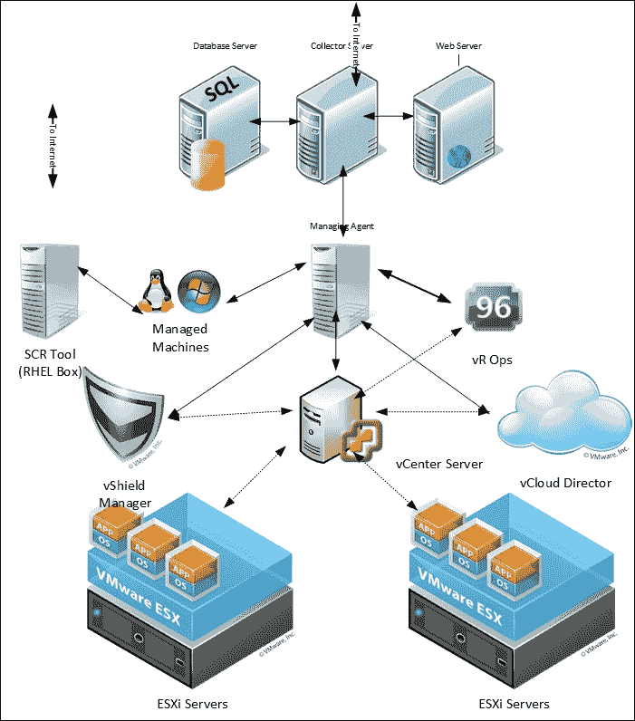

### 数据库服务器

数据库服务器包含 `VCM`、`VCM_Coll`、`VCM_Raw` 和 `VCM_UNIX` 数据库。VCM 支持使用共享 SQL Server 实例。然而，VCM 在查询和事务处理方面大量依赖 SQL Server。你必须确保你有足够的能力，或者可以向共享 SQL Server 实例添加足够的容量，以确保 VCM 及其他共享服务器上的数据库不会出现性能下降的情况。

VCM 与 SQL Server 的标准版、企业版或数据中心版兼容。你必须在 VCM 使用的数据库服务器上安装 64 位 SQL Server 2008 R2、2012 或 2014 版本。

SQL Server 许可证必须包括 **SQL Server Reporting Services**（**SSRS**），该服务被 VCM 用于报告功能。

### VCM 收集器服务器

**VCM 收集器**是一个独立的应用程序，即使其他 VCM 组件未激活，它仍然可以运行。这在定时收集的情况下特别有用，因为这意味着 VCM 门户不必保持运行。收集器拥有执行请求功能所需的所有信息和能力。你可以停止收集器，仍然查看数据，因为 UI 不直接与收集器服务交互；相反，它通过与安装在与收集器相同机器上的各种可执行文件进行通信。

Windows 补丁将在默认配置下托管在 VCM 收集器上。Linux 补丁将由 **备用连续复制**（**SCR**）服务器处理。我们将在 第三章 中详细了解 Linux 补丁，*Linux 补丁*。

安装 VCM Collector 的支持操作系统包括 Windows Server 2008 R2、2012 或 2012 R2。VCM Collector 必须安装在 AD 域成员上。

我们将在本章中的多个食谱中讨论 VCM Collector 服务器的安装。

### Web 服务器

Web 服务器包含诸如 IIS 和 SSRS、其他服务以及 VCM 软件组件等 Web 应用程序。在安装 VCM 之前，必须配置 Web 服务器。托管 Web 组件的 Windows 机器必须运行 **Internet 信息服务** (**IIS**) 7.5。支持安装 Web 服务器的操作系统包括 Windows Server 2008 R2、2012 或 2012 R2。

我们将在 *准备我们的 VCM 部署 - 安装并配置 IIS* 这一食谱中讨论 Web 服务器的安装和配置。

### 管理代理

我们需要安装代理来通过 VCM 管理这些机器。对于 vCenter Server、vCloud Director 和 vCloud Networking and Security Manager，VCM 使用中介 **管理代理** 来收集数据。此中介通过使用 vSphere VIMAPI、vCloud REST API 和 vCloud Networking and Security Manager REST API 收集数据，然后将其传递给 VCM Server。

我们需要在指定为管理代理的系统上安装 VCM agent 5.5 或更高版本。然而，在代理部署之后，还需要进行一个额外步骤。在收集任何 vCenter、vCloud Networking and Security 或 vCloud Director 数据之前，必须与指定为管理代理的系统建立双向互信。

通过管理代理进行的 vCenter 收集过程是串行的，且非常消耗 CPU。基于这个原因，建议为虚拟基础设施使用单独的管理代理。如果 vCenter 或 vCloud Server 实例的数量增加，可以水平扩展管理代理的数量。

我们将在 第二章，*配置 VCM 来管理您的基础架构* 中，看到这一操作，内容来自 *为虚拟环境管理配置管理代理机器* 这一食谱。

### SCR 工具

为确保在 VCM 部署补丁时所有补丁依赖项都得到满足，SCR 工具会下载所有必要的补丁（除了已经被更新补丁替代的补丁）。VCM 补丁管理在补丁部署时处理所有依赖项。如果补丁在 SCR 工具安装和配置时可用，它将被下载。如果补丁在 SCR 工具最后同步时不可用，则不会下载，因此也无法分发到管理的机器上。如果补丁仍然由操作系统供应商提供，它将通过 SCR 工具的补丁复制过程进行下载。SCR 服务器不会共享或同步它下载的补丁详细信息；VCM 从 [`www.vmware.com/`](http://www.vmware.com/) 获取已发布补丁的详细信息。因此，我们需要确保与供应商如 RHEL 或 SUSE 完全同步，并且已将所有补丁下载到存储库中。

SCR 工具不用于运行补丁评估或部署。它也不会评估机器配置或用于补丁部署的下载补丁内容。这个任务由 VCM 服务器完成。

SCR 工具从**内容分发网络**（**CDN**）下载补丁签名文件和操作系统供应商的补丁内容，并从操作系统供应商的内容网站下载仅限订阅内容。我们将在 第三章中更详细地介绍 *Linux 补丁*。

### 分布式 VCM 部署

根据您管理的基础架构的规模，VCM 可以以多种方式部署。

如果您计划在两层或三层上安装 VCM，请查看此链接了解如何调整硬件环境： [`kb.vmware.com/kb/2033894`](http://kb.vmware.com/kb/2033894)。

#### 单层安装

单层安装适用于管理服务器少于 2,000 台的组织以及 POC/试点项目。

所有组件，如 VCM 数据库服务器、Web 服务器和 VCM 收集器，均安装在同一台服务器上，如下所示：

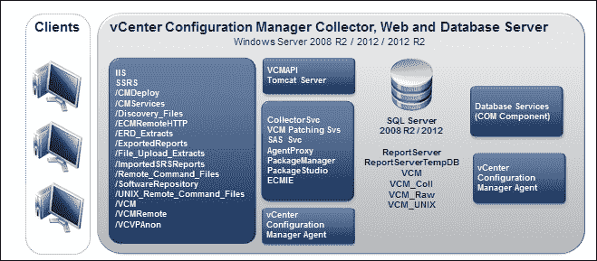

#### 双层安装

双层安装适用于管理服务器数量在 2,000 到 5,000 之间的组织。

在这个部署中，我们将应用服务器（收集器）和 IIS 放在一台机器上，将 SQL Server 实例放在另一台机器上，SSRS 可以安装在任一系统上，如下所示：

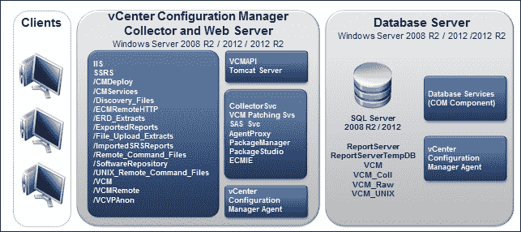

#### 三层安装

三层安装适用于管理服务器数量超过 5,000 台的组织。其结构如下所示：

+   应用服务器（收集器）、IIS 和 SQL Server 实例分别安装在不同的机器上。

+   SSRS 可以安装在 IIS 或 SQL Server 系统上。

该图展示了一个三层安装：

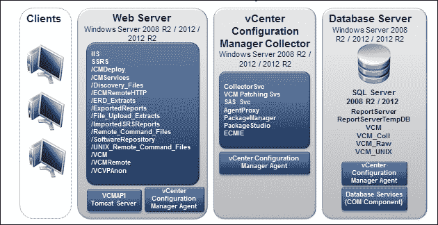

## 了解 VCM 的要求

每个安装的软件应用程序都有其成功安装和运行所需的要求，VCM 也不例外。在本节中，我们将讨论部署 VCM 所需的硬件和软件要求。

### 软件要求

安装 VCM 所需的软件：

| **软件组件** | **支持的版本** |
| --- | --- |
| VCM Web、Collector 和数据库服务器的操作系统 | Windows Server 2008 R2、Windows Server 2012 或 Windows Server 2012 R2 |
| SQL 版本 | SQL Server 2008 R2、2012 或 2014 标准版、企业版或数据中心版（64 位） |
| SSRS 版本 | SQL Server 2008 R2、2012 或 2014 报告服务 |
| SCR 的操作系统* | RHEL 7.x |

(*SCR：软件内容库，用于下载和存储非 Windows 操作系统的补丁)

### 最低硬件要求

托管 VCM 也有一些硬件要求，这些要求在以下表格中提供：

支持 1-1,000 台管理机器的最低硬件要求：

|  | **单层** | **2 层数据库** | **2 层 Web/Collector** | **3 层数据库** | **3 层 Web** | **3 层 Collector** |
| --- | --- | --- | --- | --- | --- | --- |
| **RAM** | 8 GB | 8 GB | 4 GB | 8 GB | 4 GB | 4 GB |
| **处理器** | 双 Xeon 或单个双核 2 GHz | 双 Xeon 或单个双核 2 GHz | 双 Xeon 或单个双核 2 GHz | 双 Xeon 或单个双核 2 GHz | 单个 2 GHz 处理器 | 单个 2 GHz 处理器 |

支持 1,001-2,000 台管理机器的最低硬件要求：

|  | **单层** | **2 层数据库** | **2 层 Web/Collector** | **3 层数据库** | **3 层 Web** | **3 层 Collector** |
| --- | --- | --- | --- | --- | --- | --- |
| **RAM** | 12 GB | 12 GB | 4 GB | 12 GB | 4 GB | 4 GB |
| **处理器** | 四路 Xeon 或两个双核 2 GHz | 四路 Xeon 或两个双核 2 GHz | 四路 Xeon 或两个双核 2 GHz | 四路 Xeon 或两个双核 2 GHz | 单个 2 GHz 处理器 | 双 Xeon 或单个双核 2 GHz |

支持 2,001-5,000 台管理机器的最低硬件要求：

|  | **单层** | **2 层数据库** | **2 层 Web/Collector** | **3 层数据库** | **3 层 Web** | **3 层 Collector** |
| --- | --- | --- | --- | --- | --- | --- |
| **RAM** | 16 GB | 16 GB | 8 GB | 16 GB | 4 GB | 8 GB |
| **处理器** | 八路 Xeon 或四个双核 2 GHz | 八路 Xeon 或四个双核 2 GHz | 双 Xeon 或单个双核 2 GHz | 八路 Xeon 或四个双核 2 GHz | 单个 2 GHz 处理器 | 双 Xeon 或单个双核 2 GHz |

### 服务账户

让我们看看 VCM 正常工作所需的账户和权限列表。

你可以将一个账户重用于多个功能，但为故障排除和追踪创建专用账户可能会更有帮助。

Collector、VCM Remote、Tomcat 和 vSphere Client VCM 插件可以使用同一个账户。如果你重复使用一个账户，请应用为 Collector 服务账户显示的权限。

| **角色** | **权限** | **描述** |
| --- | --- | --- |
| VCM 管理员 | （仅在安装期间）VCM 收集器和 Web 服务器的本地管理员权限。（仅在安装期间）数据库服务器上 VCM SQL Server 实例的系统管理员权限。此帐户必须是交互式帐户，并且与表中其他帐户分开。 | VCM 管理员帐户是安装 VCM 时使用的登录帐户，并且可能会在安装后用于 VCM 的管理和维护。 |
| VCM 收集器服务 | VCM 收集器和 Web 服务器的本地管理员权限。这不是域管理员或交互式用户帐户。 | 收集器服务帐户是 VCM 收集器、VCM 数据库和 VCM 补丁管理服务运行的帐户。在安装期间，VCM 会为收集器服务帐户配置 SQL Server 中 VCM 数据库的 DBO 和批量插入权限。 |
| VCM 远程服务 | VCM Web 服务器的本地管理员权限。这不是域管理员或交互式用户帐户。 | VCM 远程服务帐户由 VCM 远程客户端用于对 Web 服务器上 VCM 远程虚拟目录的匿名访问。 |
| VCM Tomcat 服务 | VCM 数据库服务器的本地管理员权限。对 VCM 数据库的公共访问权限。这不是一个交互式用户帐户。 | Tomcat 服务帐户作为 VCM 应用程序编程接口，用于 SQL 登录到 E12VCM 数据库服务器。 |
| vSphere 客户端 VCM 插件服务 | VCM Web 服务器的本地管理员权限。这不是交互式用户帐户。 | **vSphere 客户端 VCM 插件**（**VCVP**）帐户通过 HTTP 提供 vSphere 访问到 VCM 管理的机器。**VCM 高级安装**选项会提示输入 VCVP 帐户的凭据。典型安装不会提示。 |
| VCM 默认网络权限 | 对使用 DCOM 代理从 VCM 收集数据的 Windows 机器的本地管理员权限。根据企业规模和便利性，可能需要一个具有 Windows 机器权限的独立域管理员帐户。这不是一个交互式用户帐户。 | 网络权限帐户用于从 DCOM Windows 机器收集数据。 |

### 提示

**重要**：绝不要使用服务帐户登录 VCM 控制台或用于任何其他目的。使用服务帐户登录 VCM 可能会导致意外或不一致的行为。使用相同帐户作为已登录用户的服务可能会修改已登录用户的当前角色或机器组，或者将用户从系统中注销。 |

如果由于某种原因您无法获得用于 NAA 的本地管理员帐户，您至少需要以下表中提到的权限。为了让 VCM 对许可的机器进行更改，例如重启和管理审计设置，与 VCM 代理交互的帐户需要在每台许可机器上具有以下权限和权利：

| **操作** | **所需用户权限** |
| --- | --- |
| 紧急修复磁盘 | 备份文件和目录 |
| NTFS 权限 | 管理审计和安全日志 |
| 重启 | 关闭系统，强制从远程系统关机 |
| 服务变更 | 关闭系统 |
| 共享权限 | 管理审计和安全日志 |

要检查或设置每台机器的适当权限，你可以使用以下任何一种方法：

+   **本地安全策略**: **安全设置** | **本地策略** | **用户权限分配**

+   **组策略插件**: **本地计算机策略** | **计算机配置** | **Windows 设置** | **安全设置** | **本地策略** | **用户权限分配**

### VCM 数据库

VCM 创建了四个数据库；下表列出了这些数据库及其用途。部署 VCM 时，安装程序会创建这些数据库。

### 提示

确保数据库启用了自动增长。

| **数据库名称** | **最小大小** | **用途** |
| --- | --- | --- |
| `VCM` | 3 GB | 该数据库包含 VCM 应用程序本身的配置数据、来自 Windows 系统和虚拟基础设施的收集数据、所有系统的更改详细信息，以及补丁和合规性评估的结果。基本名称 `VCM` 是默认的，可以更改。 |
| `VCM_Coll` | 1 GB | 该数据库提供 Collector 服务的操作状态信息，主要用于跟踪正在运行的作业和已管理客户端系统的最后联系状态。 |
| `VCM_Unix` | 1 GB | 该数据库包含从环境中的任何 Linux、Unix 或 Mac 代理收集的已管理机器数据。 |
| `VCM_RAW` | 1 GB | 为了提高性能，该数据库临时存储收集的数据，直到这些数据被转换成 `VCM` 和 `VCM_UNIX` 数据库。原始数据库不应备份或包含在维护计划中。 |

### VCM 支持的操作系统

VCM 支持的操作系统列表如下表所示，但这不是一个完整的列表。

你可以查看 *VMware vRealize Configuration Manager 安装指南* 中的 *VCM 管理机器的硬件和操作系统要求* 章节 ([`www.vmware.com/pdf/vrealize-configuration-manager-58-installation-guide.pdf`](http://www.vmware.com/pdf/vrealize-configuration-manager-58-installation-guide.pdf)) 以获得完整的列表。

| **支持的操作系统** | **支持的硬件平台** |
| --- | --- |
| Microsoft Windows Server 2003 SP2 | x86 和 x64 |
| Microsoft Windows Server 2008 R2 Enterprise Gold | x64 |
| Microsoft Windows 7 Enterprise Gold | x86 和 x64 |
| Microsoft Windows 8.1 Enterprise | x86 和 x64 |
| Microsoft Windows Server 2012 R2 Datacenter | x64 |
| Red Hat Enterprise Linux 5.0-5.11, 6.0-6.5, 和 7.0(x64) 服务器、桌面工作站及高级平台 | x86 和 x64 |
| SUSE Linux Enterprise Server (SLES) 10.0-10.2（仅支持到代理版本 5.5.0）SUSE Linux Enterprise Server (SLES) 10.3-10.4, 11.0-11.3, 和 12 | x86 和 x64 |
| Windows 10 | x86 和 x64 |

### vRealize Configuration Manager 端口和协议概述

下表显示了环境中正确功能所需的端口和协议要求：

| **来源** | **目标** | **端口和协议** | **描述** |
| --- | --- | --- | --- |
| 管理代理 | vCloud 管理 vCenter | HTTPS：443 | 与 vCenter API 的 Web 服务连接。需要有效凭据和证书指纹。 |
| 管理代理 | vCloud vCenter | HTTPS：443 | 与 vCenter API 的 Web 服务连接。需要有效凭据和证书指纹。 |
| VCM 收集器 | VCM 数据库服务器 | SQL：1433 | Windows 身份验证连接。 |
| VCM 收集器 | VCM 数据库服务器 | DCOM：135 | 在两层配置中，收集器和数据库服务器之间需要 DCOM，以便数据库服务器在各种作业结束时回调到收集器。 |
| VCM 收集器 | VCM 数据库服务器 | SMB：TCP 端口 139 和 445 | VCM 在安装期间向数据库服务器创建共享。 |
| VCM 收集器 | VCM 数据库服务器 | HTTP：80 | 从 VCM 服务器到 DB SSRS 实例的 SSRS 连接。 |
| VCM 收集器 | VCM 数据库服务器 | ICMP | 登录详细信息不会发送到代理。使用双向身份验证，代理在 LocalSystem 下运行。数据通过新的 TLS 会话传回到收集器。 |
| VCM 收集器 | 代理 | HTTP：26542 | 登录详细信息不会发送到代理。使用双向身份验证，代理在 LocalSystem 下运行。数据通过新的 TLS 会话传回到收集器。 |
| VCM 收集器 | 代理 | ICMP | 登录详细信息不会发送到代理。使用双向身份验证，代理在 LocalSystem 下运行。数据通过新的 TLS 会话传回到收集器。 |
| VCM 收集器 | 代理 | SMB：TCP 端口 139 和 445 | 这是 Windows 补丁下载的映射驱动器。 |
| 代理软件 | RedHat 补丁服务器 | HTTPS：443/80 | 这取决于您如何配置 Apache，用于从补丁库下载补丁。 |

### 许可

vRealize Operations 提供两种许可模型：

+   **每个处理器带有无限 VM**：对于高共享比例的虚拟环境，vRealize Operations 作为 VMware vRealize Suite、VMware vCloud Suite 和 VMware vSphere with Operations Management 的一部分，按处理器提供。

+   **每个虚拟机或物理服务器**：对于低共享比例的虚拟环境，vRealize Operations 还可以按照 25 VM 或 OS 实例许可包单独购买。

新版本 VCM 5.8.2 支持混合云套件许可密钥，因此 VCM 将不再是 vCloud Suite 的一部分。这些内容随时会变动；您可以联系 VMware 获取当前定价详情或在此处查看更多详情：[`www.vmware.com/products/vrealize-operations/pricing`](https://www.vmware.com/products/vrealize-operations/pricing)。

# 准备我们的 VCM 部署 - 安装 SQL

VCM 需要专用 SQL 系统上的四个数据库。在本文中，我们将学习如何正确安装 SQL Server 组件。

## 准备工作

根据我们选择的部署类型，我们需要一个专用 SQL Server（用于两层和三层部署），或者我们可以使用用于 VCM Collector 服务器的 Windows 服务器（单层部署）。

我们需要操作系统——Windows Server 2012（或更高版本）——和 SQL 2012。

出于概念验证或测试目的，你可以使用共享 SQL；否则，使用专用 SQL。

## 如何操作...

安装 SQL 的步骤在所有三种类型的 VCM 部署中都是相同的——只有服务器会根据层级类型的不同而变化。

### 注意

由于这不是专门的 SQL 安装和配置指南，我们不会包括所有的屏幕截图；如果需要进一步的帮助，请咨询你的 DBA 团队以获取详细的指导。

按照以下步骤操作：

1.  启动 SQL 安装程序。

1.  在安装菜单下，选择**新建 SQL Server 独立安装或为现有安装添加功能**。

1.  确保所有设置支持规则已通过。

1.  如果没有 Internet 连接，忽略产品更新错误。

1.  输入产品密钥。

1.  接受最终用户许可协议（EULA）。

1.  在**设置角色**下，选择**SQL Server 功能安装**。

1.  选择以下功能：

    +   **实例功能**

        +   **数据库引擎服务**

            +   **全文和语义提取用于搜索**

        +   **报告服务 - 原生**

    +   **共享功能**

        +   **文档组件**

        +   **管理工具 - 基本**

            +   **管理工具 - 完整**

1.  根据你的服务器配置选择安装文件夹。

1.  确保所有安装规则已通过。

1.  选择默认实例，并在需要时更改安装文件夹位置。

1.  使用服务帐户来运行 SQL 服务总是更好的，如果你将安装一个两层或三层 VCM 实例，你需要一个域帐户。

    ### 注意

    在多层 VCM 部署中，数据库位于不同的服务器上，我们需要一个域服务帐户，以便 SQL 能够通过网络通信。

    提供正确的服务帐户给 SQL 安装向导。

1.  VCM 支持的排序规则是`SQL_Latin1_General_CP1_CI_AS`；请确保选择此项。

1.  从 Active Directory 添加 SQL 管理员组。根据公司政策，启用**混合**模式并为`SA`帐户设置密码。

1.  对于报告服务，我们只会安装 SSRS，而不会进行配置。

1.  按照向导步骤安装 SQL。

## 工作原理...

SQL 将托管 VCM 所需的所有四个数据库。我们现在不需要创建或配置任何数据库；它们将在安装 VCM 时创建。我们需要为 SQL Server 提供特殊权限，如前述的*服务帐户*小节中所述。

此外，所有与机器相关的活动，如合规性检查和补丁状态检查，都是使用数据库中可用的数据来执行的，这增加了数据库的工作负载，突出了对专用 SQL Server 的需求。所有计划任务都以 SQL 作业的形式存储在 SQL 中，这进一步增加了 SQL Server 的工作压力。

VCM 使用 SSRS 托管报告功能；在部署 SQL 时我们也安装了 SSRS，接下来的教程中我们将对其进行配置。

# 准备我们的 VCM 部署 - 安装并配置 IIS

另一个重要的部分是 SQL 数据库之后的 IIS。VCM 应用程序是一个连接到数据库的基于 Web 的门户，因此所有操作都是通过 Web 界面执行的，这需要 IIS。在本教程中，我们将安装并配置 IIS。

## 准备就绪

同样，根据 VCM 部署的类型，您可能需要专用服务器（二层或三层）或单个 VCM 服务器（单层）安装。我们需要 Windows Server 2012 R2 来开始此过程。

如本章第一张图（在 *理解 VCM 组件* 小节中）和 *分布式 VCM 部署* 小节所示，IIS 的位置根据部署类型而变化。

## 如何操作...

VCM Collector 的 Web 组件包括 IIS 和 SSRS 等 Web 应用程序、其他服务和 VCM 软件组件。在安装 VCM 之前，必须先配置 VCM Collector 的 Web 组件。

### 注意

我们将介绍在 Windows 2012 R2 上的安装过程。Windows 2008 上的安装可能有所不同。

### 安装 IIS

按照以下步骤安装 IIS：

1.  登录 IIS 服务器并启动 **服务器管理器**。进入 **管理** | **添加角色和功能**。

1.  添加 **Web 服务器（IIS）** 角色。 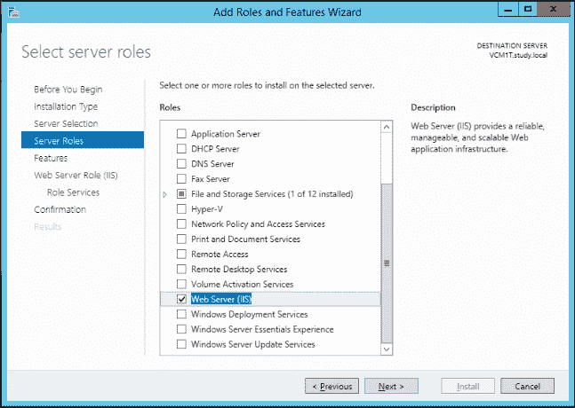

1.  添加 **.NET Framework 3.5** 特性。

1.  添加以下组件：

    | **序号** | **选项** | **操作** |
    | --- | --- | --- |
    | **1** | 常见 HTTP 功能 | 静态内容默认文档目录浏览 HTTP 错误 HTTP 重定向 |
    | **2** | 应用开发 | ASP.NET.NET 扩展性 3.5.NET 扩展性 4.5ASPASP .NET 3.5ASP .NET 4.5ISAPI 扩展 ISAPI 过滤器 |
    | **3** | 健康与诊断 | HTTP 日志记录工具请求监控追踪 |
    | **4** | 安全性 | 基本认证 Windows 认证摘要认证 URL 授权请求过滤 IP 和域限制 |
    | **5** | 性能 | 静态内容压缩动态内容压缩 |
    | **6** | 管理工具 | IIS 管理控制台 IIS 管理脚本和工具管理服务 |

1.  如有需要，提供 Windows 2012 ISO 的路径。

1.  点击 **安装**，让安装开始；按照向导完成安装，并确保安装成功。

### 配置 IIS

一旦安装了 IIS，我们需要配置它：

1.  点击 **开始**，进入 **所有程序** | **管理工具** | **Internet 信息服务（IIS）管理器**。

1.  展开**<服务器名称>**，展开**站点**，然后点击**默认网站**。

1.  在**操作**窗格中，点击**管理网站**和**浏览网站**下的**高级设置**。

1.  展开连接的**限制**并将**连接超时（秒）**设置为`3600`。

1.  点击**确定**

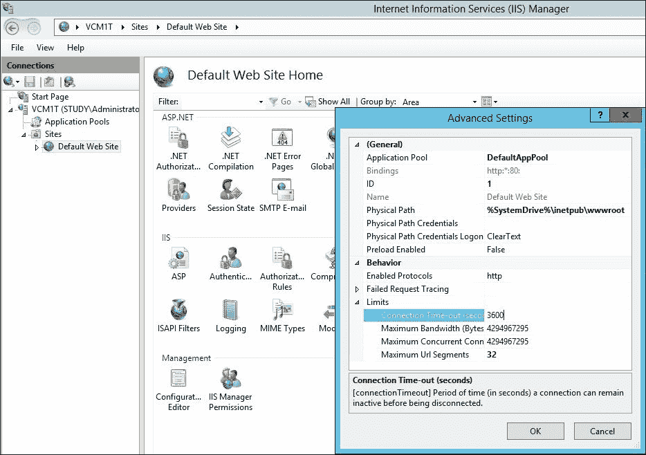

### 配置 IIS 7.5 默认网站

IIS 7.5 提供了一个默认网站，用于定义应用程序和虚拟目录的默认身份验证设置。验证 IIS 7.5 默认网站是否具有正确的设置。

按照以下步骤配置 IIS：

1.  点击开始，进入**所有程序** | **管理工具** | **Internet 信息服务 (IIS) 管理器**。

1.  展开**<服务器名称>**，展开**站点**，然后点击**默认网站**。

1.  在**默认网站**的主页窗格中，找到 IIS 选项。

1.  双击**身份验证**并将身份验证设置如下：

| **序号** | **选项** | **操作** |
| --- | --- | --- |
| **1** | **匿名身份验证** | 设置为**禁用**。 |
| **2** | **ASP.NET 假冒身份验证** | 设置为**禁用**。 |
| **3** | **基本身份验证** | 设置为**启用**。 |
| **4** | **表单身份验证** | 设置为**禁用** |

你的屏幕应该如下所示：

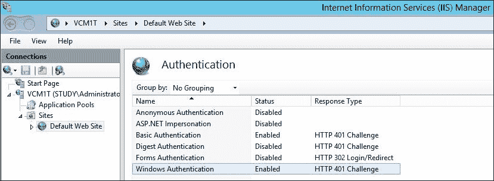

## 它是如何工作的...

VCM 使用 IIS 托管展示数据的 Web 应用程序。Web 应用程序将我们从 VCM 控制台发送的命令转发给数据库，操作执行后，最终结果会再次显示在控制台 GUI 上。VCM 在 IIS 中创建多个应用程序，这些应用程序是 VCM 所需的。`CMAppPool` 和 `CMServices` 是 IIS 应用程序池，用于 VCM 虚拟目录和 Web 服务。

# 准备我们的 VCM 部署 - 配置 SSRS

SSRS 被 VCM 用于提供报表功能。

## 准备中

在本配方中，我们将配置 SSRS 以供 VCM 使用；由于这不是一个专门的 SQL 指南，建议在配置 SSRS 时向 DBA 团队咨询。

为了避免因 SQL 的多重许可证收费，建议将 SSRS 安装在与数据库服务器相同的服务器上，这也是我们在安装 SQL Server 时所采取的做法。

我们需要在数据库服务器上安装 SSRS 才能开始。

## 如何操作...

使用服务账户凭据连接到数据库服务器，启动**报告服务配置管理器**，并按照向导操作：

1.  连接到安装了报告服务的 SQL Server 实例。提供正确的服务器名称和实例。

1.  在**服务账户**页面，使用将用于 VCM 服务的相同服务账户。点击**应用**。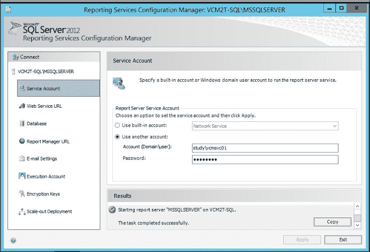

1.  在**Web 服务 URL**页面，选择端口`80`并点击**应用**。

1.  在**数据库**下，点击**更改数据库**并按照向导**创建一个新的报告数据库**。这包括以下步骤：

    1.  选择**创建新的报告服务器数据库**。

    1.  在**连接到数据库服务器**下，提供以下值：

        +   **服务器名称**：SQL 数据库服务器的名称

        +   **身份验证类型**：**当前用户 - 集成安全性**

    1.  使用默认的数据库名称和语言。

    1.  在**凭据**下，使用**服务凭据**。

    1.  接受摘要，点击**下一步**，然后在下一页点击**完成**来完成数据库创建。

1.  对于**报告管理器 URL**标签，选择**虚拟目录：**`Reports`，然后点击**应用**。

1.  对于 VCM 其余的参数我们不需要配置；你可以和你的数据库管理员（DBA）团队确认是否需要配置这些参数，如果需要，应该选择哪些最佳选项。

1.  写下 URL（我们在安装 VCM 时需要用到这个）。

## 如何操作...

在安装 VCM 时，会提供报告管理器和 Web 服务的 URL，VCM 将使用这些 URL 通过其控制台展示报告。

当我们安装 VCM 时，安装程序会在 SSRS 实例上创建默认的报告，用户在开始使用 VCM 时会访问这些报告。

# 准备 VCM 部署 - 安装其他先决条件

在我们实际开始安装 VCM 之前，还有一些其他的先决条件需要安装。我们将在这个步骤中进行安装。

## 准备就绪

如果这些安装程序尚未可用，我们需要访问互联网以下载它们。我们需要在 VCM 层级中的所有服务器上安装这些工具。

我们需要按顺序安装它们，否则它们将无法安装。

本书中使用了以下链接；如果你更换了 SQL 版本，这些链接可能会发生变化，例如**SQL Native Client**和**SQL 命令行工具**的链接：

| **序号** | **描述** | **下载位置** |
| --- | --- | --- |
| **1** | SQL Native Client | [`go.microsoft.com/fwlink/?LinkID=239648&clcid=0x409`](http://go.microsoft.com/fwlink/?LinkID=239648&clcid=0x409) |
| **2** | SQL 命令行工具 | [`go.microsoft.com/fwlink/?LinkID=239650&clcid=0x409`](http://go.microsoft.com/fwlink/?LinkID=239650&clcid=0x409) |
| **3** | SQLXML 4.0 SP1 | [`www.microsoft.com/en-us/download/details.aspx?id=30403`](http://www.microsoft.com/en-us/download/details.aspx?id=30403) |

## 如何操作...

这是一个非常简单的安装过程，你只需要点击**下一步**和**完成**。

只需按顺序进行操作并安装所有三个工具。你必须在所有服务器上安装它们，也就是说，如果你正在部署一个三层的 VCM 安装，这三个工具必须在所有三台服务器上安装。

## 如何操作...

这些工具被 VCM 用于与 SQL 数据库进行通信。如果服务器上缺少它们，那么基础检查将会失败，你必须安装这些工具并重新启动安装程序。

# 安装 VCM - 单层部署

在本食谱中，我们将在 Windows Server 2012 R2 上部署 vRealize Configuration Manager 5.8.2。如标题所示，这是一个单层安装；因此，所有 VCM 组件将安装在一台服务器上。因此，VCM 数据库服务器、Web 服务器和 VCM Collector 组件将驻留在一台 Windows Server 2008 R2、2012 或 2012 R2 机器上（在我们的案例中是 Windows Server 2012 R2），这台机器被称为 VCM Collector，如下图所示：

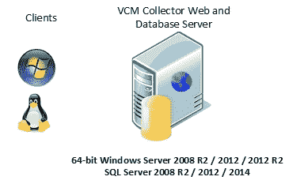

## 准备就绪

在本案例中，我们将需要一个已经安装了 SQL、配置了 IIS 并通过前面的步骤安装了所有先决条件的单个 Windows Server 2012 R2 安装。

VCM 安装程序可以在[`www.vmware.com/`](http://www.vmware.com/)下载。你需要在[my.vmware.com](http://my.vmware.com)上拥有账户才能下载安装程序。

你需要在 Active Directory 中准备好所有必需的服务账户，并且它们应该具有 VCM 需求文档中描述的权限。服务器应该是 Active Directory 域的一部分，并且你必须使用具有服务器本地管理员权限的 AD 账户登录。

## 如何操作...

你需要使用希望拥有 VCM 管理权限的账户登录，因为用于安装 VCM 的账户将获得 VCM 应用程序的完全管理员权限，因此你可以选择自己的账户或任何专门创建的 VCM 管理员账户。

从互联网下载安装程序并将其复制到 VCM 服务器。然后，按照以下步骤操作：

1.  安装 ISO 并通过双击`setup.exe`启动安装向导。选择**典型安装**。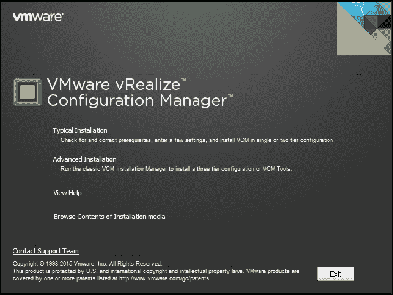

    ### 注意

    **典型安装**：主要用于单层或双层安装，所需信息较少。

    **高级安装**：主要用于三层安装，在这种类型中，我们需要将 Collector 和 Web 服务器的安装分布到不同的服务器上。

1.  阅读并接受许可协议，并选择“**我是客户/最终用户的授权代理人和/或代表**”以及**“我已阅读并同意上述条款和条件**”。

1.  它将执行先决条件检查并运行一些测试；测试完成后，选择**查看先决条件检查的完整结果**。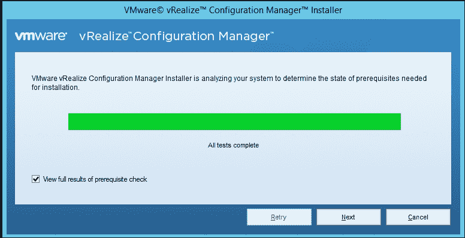

1.  结果将在 Internet Explorer 中启动，并检查是否有任何错误和/或警告；如果有警告可以继续安装，但如果有错误则无法继续。

1.  一旦看到任何错误，你可以点击报告中的错误链接进一步查看，它会告诉你为何出现错误。

在我们的案例中，我们没有安装 `ServerSideIncludes` IIS 角色服务，以下是错误报告：

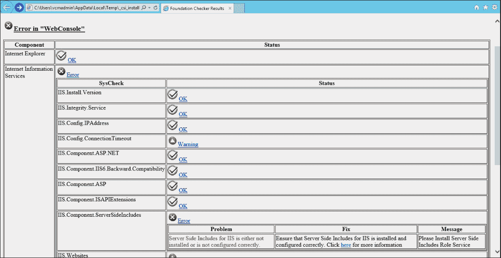

安装缺失的组件后，我们可以继续安装程序。

1.  在下一步中，我们需要提供以下信息：

    +   **VCM 数据库服务器（本地或远程 SQL Server 实例）**: 我们安装的服务器，因为这是一个单层部署。

    +   **SQL Server Reporting Services WebService URL**: 在配置 SSRS 时你必须记下这个 URL；如果没有，去启动 SSRS 配置向导来查看 URL。默认值为 `http://<Server-Name>/ReportServer`。

    

1.  点击 **验证...** 在 SSRS Web 服务下，提供以下信息：

    +   **数据库服务器**: SSRS 服务器的主机名

    +   **域**: Active Directory 域

    +   **用户名**: 用于连接到 SSRS 实例的帐户

    +   **密码**: 用户的密码

    +   **端口**: 配置 SSRS 时配置的端口

    +   **虚拟目录**: 配置 SSRS 时配置的目录

    点击 **验证**，确保验证成功。

    填写完信息后，屏幕应显示如下：

    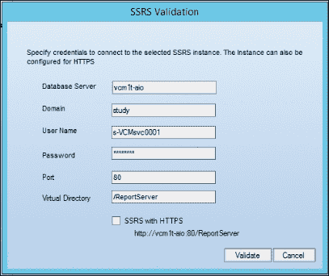

1.  输入许可证密钥，提供服务帐户的用户名和密码，然后点击 **验证**。

1.  提供安装路径。

1.  选择 **使用 HTTPS。默认情况下会生成一个自签名证书。这里可以选择其他证书。**

    它将自动生成一个证书；如果需要，你也可以在此处添加自己的证书：

    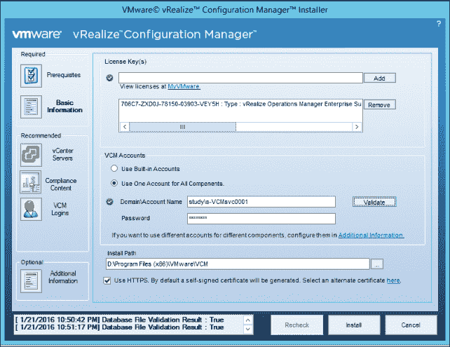

    安装过程可能需要最多一个小时，具体取决于服务器的配置。

    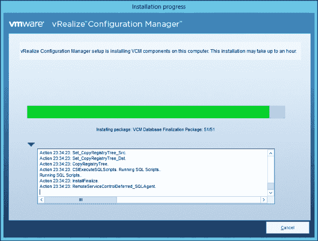

1.  完成后，使用 `https://<Collector 的 IP 或主机名>/VCM` 启动控制台。

1.  如本步骤开始所提到的，只有具有访问 VCM 控制台权限的帐户才能用于安装；我们可以稍后添加其他用户。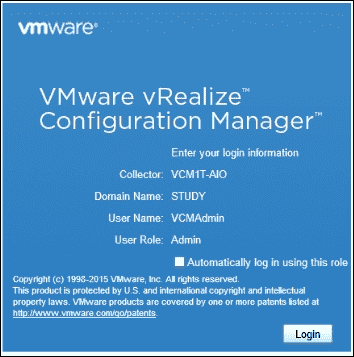

1.  点击 **登录**，首次展示 VCM 控制台界面：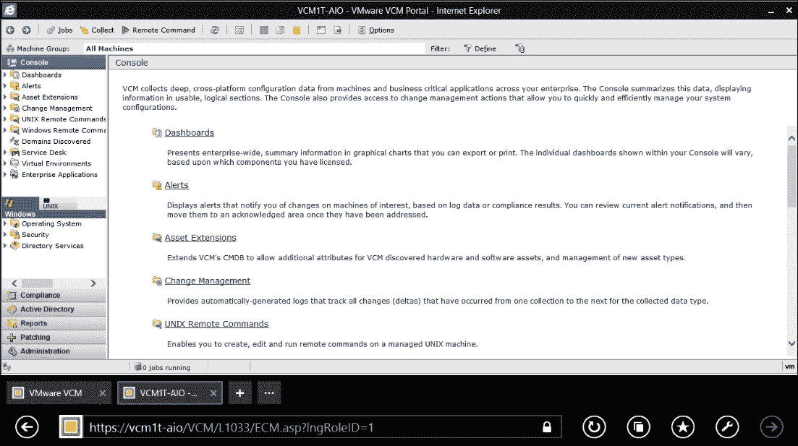

## 它是如何工作的...

我们在一台已经安装了 SQL、SSRS 和 IIS 的单台服务器上安装 VCM。然后可以使用此控制台来管理整个基础架构。在接下来的章节中，我们将使用该控制台执行补丁管理、合规性检查、发布软件导出报告等操作。

# 安装 VCM - 两层部署

如你所知，VCM 依赖于 SQL，如果我们有中等规模的基础架构，单台服务器承载 SQL、SSRS、Web 和 Collector 组件会成为过重的负担。我们可以通过将 SQL 数据库移至专用服务器，并将 Web 和 Collector 组件移至另一台服务器来分担负载。

这就是两层部署的示意图：

## 准备工作

我们需要两台服务器；其中一台需要安装 SQL Server 2012 并配置 SSRS，SSRS 配置应根据之前的步骤进行。

在 SQL 和 Collector 服务器上安装所有前提条件。确保所有提到的服务账户已准备好，并在需要的地方打开防火墙端口。

按照*准备我们的 VCM 部署 - 安装和配置 IIS* 方案安装并配置 IIS。

## 如何操作...

由于这是一个双层 VCM 部署方案，你应该猜到我们需要在两台服务器上进行安装——其实并不完全正确；我们只需要在 SQL 服务器上安装 SQL、配置 SSRS，并安装前提条件；所有操作都会在 VCM Collector 服务器上进行。

使用具有本地管理员权限的域账户登录到 Collector 服务器；这是你希望在 VCM 应用程序中获得管理员访问权限的账户。

将下载的 ISO 文件复制到服务器并挂载。

双击安装盘中的`setup.exe`启动安装程序，并按照向导安装 VCM，如下所示：

1.  在此方案中，我们将选择**高级安装**。

1.  点击**下一步**进入介绍页面。

1.  点击**下一步**进入专利信息页面。

1.  阅读并接受许可协议，并选择“**我是客户/最终用户的授权代理和/或代表**”以及“**我已阅读上述条款和条件**”。

1.  在**选择安装类型**下，选择以下选项：

    +   **VMware vRealize 配置管理器**

        +   **VCM Web 控制台**

        +   **VCM Collector 组件**

    +   **工具**

        +   **导入导出工具**

        +   **基础检查器**

        +   **VMware VCM 包管理器 for Windows**

        +   **VMware VCM 包工作室**

    

1.  安装程序将执行前提条件检查并展示结果；检查成功后，点击**下一步**；如果有错误，点击**查看结果**，解决任何错误和警告，并重新检查。

1.  除非没有错误，否则不要继续；如果有警告，你可以继续，但不推荐这样做。这是一个成功检查的示例：

1.  在下一页，输入序列号。

1.  在**配置组件**页面，提供 SQL 服务器的主机名，并输入`VCM`作为数据库名称；点击**验证**。

    如果验证成功，它会为你提供数据和日志文件的路径，并提供**大小**和**自动增长**选项。你可以选择默认设置。

    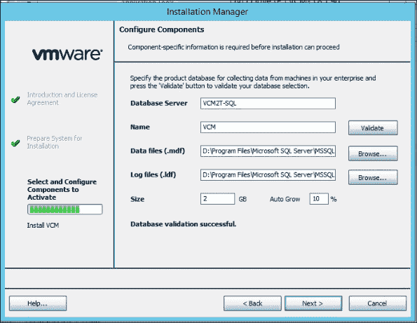

1.  在下一页，提供 Tomcat 服务账户及其密码。

1.  在下一页，提供**WebService URL**中的 URL；验证详细信息的凭据包括**域**、**用户名**和**密码**。点击**验证**。接受关于不安全 SRS 的警告，因为我们已将其配置为使用端口`80`。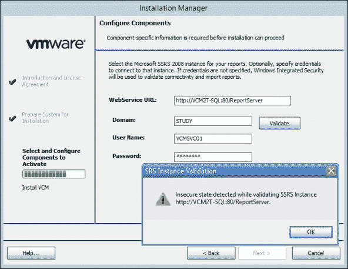

1.  提供安装 Web 控制台的路径。

1.  提供一个应用程序的 URL；默认的`/VCM`是一个不错的选择。

    我们可以提供 SMTP 地址；默认值为收集器服务器。如果现在不知道，稍后可以在 VCM 控制台中配置。

1.  提供安装收集器组件的路径，并接受 SSL3 警告。

1.  提供一个路径用于存储暂存数据；这是数据在添加到数据库之前临时存储的路径。

1.  提供 Collector 服务账户的详细信息。该账户将被授予作为服务登录的权限；接受确认对话框。

1.  提供网络权限账户的详细信息。我们以后可以添加任意数量的账户，但目前至少需要一个。更多细节请参考本章介绍中的*服务账户*小节。

1.  下一页是关于证书的内容。点击**生成**，然后点击**下一步**。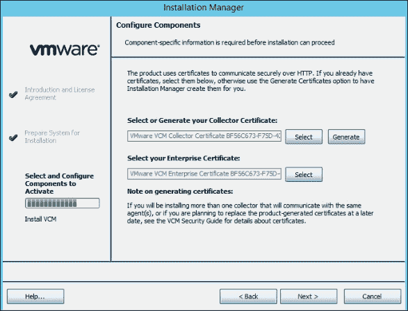

1.  在下一页，您可以选择要运行发现的域，选择特定的 NetBIOS 和 AD 域。

    ### 注意

    如果您有多个 AD 或 NetBIOS 域，检测所有域可能需要超过 24 小时，最终安装可能会失败。为了避免这种情况，请先选择一些域进行开始，等 VCM 准备好后再添加其余域。

    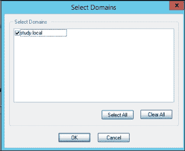

1.  提供虚拟目录的详细信息和访问凭据。

1.  提供虚拟化客户端插件的凭据。

1.  在下一页，提供安装包管理器组件的路径。

1.  在下一页，提供本地软件包缓存的路径。

1.  在下一页，提供软件库和本地缓存的路径。

1.  提供虚拟目录的名称。

1.  提供 Package Studio 组件的路径。

1.  最后，我们将到达总结页面；检查选项并点击**安装**。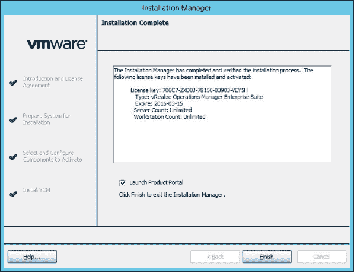

1.  登录门户并确保安装成功。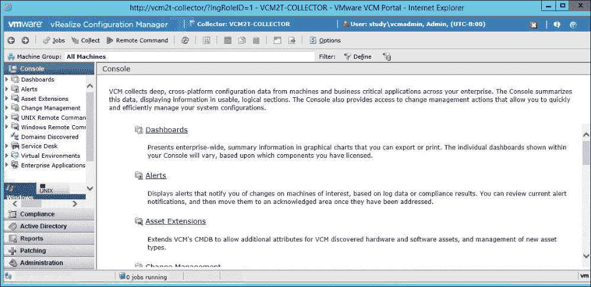

## 工作原理...

我们在两台服务器上安装了 VCM；我们已经在 SQL Server 上安装了 SQL 和 SSRS，而 Web 和收集器组件则安装在 Collector 服务器上。然后，控制台可以用于管理基础架构。我们将在接下来的章节中使用该控制台进行修补、合规检查、发布软件导出报告等操作。

# 安装 VCM - 三层部署

到目前为止，我们已经讲解了在单一和两层系统上安装 VCM。将来可能会遇到这些配置不够的情况，您需要管理更大的基础架构。为了为这种大型基础架构提供服务，我们可以将负载分配到三个层次，分别是数据库层、Web 层和收集器层。在这个方案中，我们将在三台不同的服务器上安装 VCM。

这就是三层部署的配置方式：

## 准备工作

我们将需要三台不同的服务器来安装 VCM 服务器的数据库、Web 和采集组件。

我们需要在所有三台服务器上安装所有先决条件。我们应准备好所有提到的服务账户，并确保需要的防火墙端口已打开。

仅需在 Web 服务器上配置 IIS。

必须安装 SQL Server 并按前述步骤配置 SSRS。

## 如何操作...

尽管这是三层安装，但我们在 SQL 服务器上无需做太多事情；除了安装 SQL Server 2012 外，还需要安装 SQL Native Client、SQL 命令行工具和 SQLXML 4.0 SP1。

我们将详细查看 Web 和采集服务器。

我们先来看看 Web 服务器。

### 安装 Web 组件

我们需要使用具有本地管理员权限的域账户登录到 Web 服务器。挂载`VCM` ISO 文件，并双击安装盘上的`setup.exe`。按照向导中的步骤安装 VCM 的 Web 组件，具体如下：

1.  选择**高级安装**，因为这是一个三层安装。

1.  点击**下一步**进入介绍页面。

1.  点击**下一步**进入专利信息页面。

1.  阅读并接受许可协议，然后选择“**我为客户/最终用户的授权代理人和/或代表**”以及“**我已阅读上述条款和条件**”。

1.  在**选择安装类型**下，选择以下选项：

    +   **VMware vRealize Configuration Manager**

        +   **VCM Web 控制台**

    +   **工具**

        +   **VMware VCM Package Manager for Windows**

        +   **VMware VCM Package Studio**

    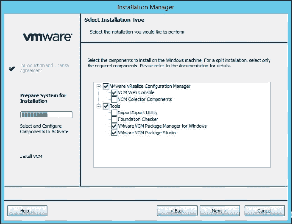

1.  在弹出的对话框中点击**确定**，接受你已故意选择拆分安装。

1.  安装程序将进行先决条件检查并显示结果。如果检查成功，点击**下一步**；如果有失败，点击**查看结果**，修正所有错误和警告后进行重新检查。直到没有错误才能继续操作。

1.  在下一页，输入序列号。

1.  在**配置组件**页面，提供 SQL 服务器的主机名并输入`VCM`作为数据库名称；点击**验证**。

    如果验证成功，系统将为数据和日志文件提供路径，并提供**大小**和**自动增长**选项。你可以使用默认值。

    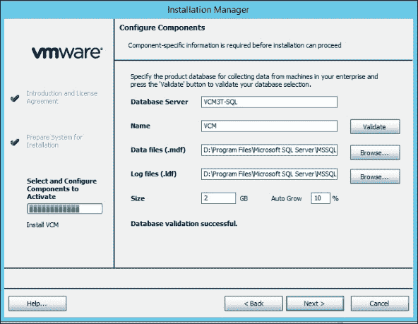

1.  在下一页，提供 Tomcat 服务账户的详细信息及其密码。

1.  在下一页，在**WebService URL**中提供网址。验证详细信息的凭据包括**域名**、**用户名**和**密码**。点击**验证**。接受 SRS 不安全警告，因为我们已将其配置为使用端口`80`。

1.  提供安装 Web 控制台的路径。

1.  提供应用程序的 URL；使用默认值也是可以的。

    我们可以提供一个 SMTP 地址，默认是采集器服务器。如果现在不清楚，可以在 VCM 控制台中进行配置。

1.  提供虚拟化客户端插件的凭证。

1.  在下一页面，提供安装包管理器组件的路径。

1.  在下一页面，提供本地包缓存的路径。

1.  在下一页面，提供软件仓库和本地缓存的路径。

1.  提供虚拟目录的名称。

1.  提供 Package Studio 组件的路径。

1.  之后，你将进入总结页面。检查选项并点击**安装**。

1.  点击**完成**退出向导。

这完成了 Web 组件的安装；接下来，我们需要在采集器服务器上执行类似的步骤。

### 正在安装采集器服务器组件

完成 Web 服务器配置后，使用具有本地管理权限的域账户登录到采集器服务器。从下载位置复制 VCM 安装程序的 ISO 文件并挂载。

双击已挂载安装介质中的`setup.exe`文件，并按照这些步骤完成向导。

1.  从**高级安装**开始。

1.  点击**下一步**进入介绍页面。

1.  点击**下一步**进入专利信息页面。

1.  阅读并接受许可协议，选择“**我是客户/最终用户的授权代理人和/或代表**”以及“**我已阅读上述条款和条件**”。

1.  在**选择安装类型**下，选择以下选项：

    +   **VMware vRealize 配置管理器**

        +   **VCM 采集器组件**

    +   **工具**

        +   **导入导出工具**

        +   **基础检查器**

        +   **VMware VCM 包管理器（Windows 版）**

    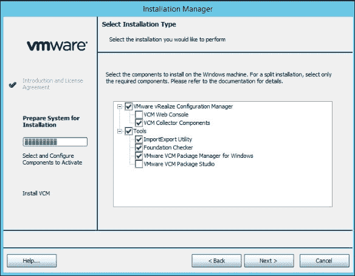

1.  接受你有意选择分离安装–点击**确定**。

1.  安装程序将执行前提检查并展示结果。如果检查成功，请点击**下一步**；如果检查失败，请点击**查看结果**，修复任何错误和警告，并重新检查。出现零错误之前，请不要继续操作。

1.  在下一页面，输入序列号。

1.  提供安装采集器组件的路径，并接受 SSL3 警告。

1.  指定与你安装 Web 组件时相同的数据库服务器和数据库名称。

1.  提供采集器服务账户的详细信息；该账户将被授予作为服务登录的权限；接受相应的对话框。

1.  提供网络权限账户的详细信息。我们可以稍后添加任意数量的账户，但目前至少需要一个。更多信息可以在本章介绍的*服务账户*小节中找到。

1.  下一页面是证书页面；点击**生成**并点击**下一步**。

1.  在下一页面，为了选择运行发现的域，选择**特定的 NetBIOS 和 AD 域**。

    ### 注意

    如果你有多个 AD 或 NetBIOS 域，检测所有域可能需要超过 24 小时，并且安装最终可能会失败。为了避免这种情况，建议先选择几个域进行启动，并在 VCM 准备好后再添加其他域。

1.  在下一页，提供安装包管理组件的路径。

1.  在下一页，提供本地包缓存的路径。

1.  现在，你将进入总结页面；检查选项并点击**安装**。安装收集器服务器组件

1.  在向导的最后页面，点击**完成**以关闭它并启动 VCM 控制台。

1.  一旦连接到控制台，你将能察觉到单层和双层部署与三层部署的不同之处。

    之前，我们的收集器和 Web 服务器是相同的，但现在，收集器与 Web 服务器是不同的。当然，这一点是预期的，因为我们刚刚完成了它们的单独安装。

    

## 它是如何工作的...

对于较大的环境，比如需要管理超过 2000 台机器的环境，建议使用三层架构部署。在这里，收集器充当前端 IIS Web 组件和后端 SQL 数据库组件之间的中介。这样可以在所有三个组件之间分配负载。

在三层架构的安装中，当你需要连接到 VCM 控制台时，你需要使用 Web 服务器，而不是收集器服务器。所以，链接将类似于这样：

`https://<Web Server IP/Hostname>/VCM`

# VCM 安装后任务 - 数据库优化调整

VCM 在操作中高度依赖其 SQL 数据库。为了优化 SQL Server 性能，你必须更新默认设置。我们将为 VCM 数据库创建一个维护计划。

## 准备中

使用具有 SQL 管理员权限的帐户登录到 SQL Server。

## 如何操作...

我们将在以下子章节中详细说明，如何在三个不同的层次上进行优化调整。

### SQL Server - 数据库设置

为确保 VCM 在生命周期内的高效运行，并且需要较少的操作员干预，请设置定期维护计划。可以参考*VCM 管理指南*。

打开 SQL Server 管理工作室并连接到 VCM SQL Server 实例。然后，按照以下步骤操作：

1.  右键点击你安装的 SQL 实例，并选择**属性**。

1.  在**选择页面**区域，选择**数据库设置**。

1.  配置以下设置：

    +   **默认索引填充因子**：将填充因子设置为`80%`，以确保每个索引页面保留 20%的空闲空间。

    ### 提示

    **注意**：此设置为每个索引页面重建时可用的空闲空间设置一个百分比值。将填充因子设置为`80%`，以确保每个索引页面保留 20%的空闲空间。此设置是 SQL 维护计划向导的一部分。如果你使用此设置配置默认填充因子，当运行维护计划时，保持索引页面的空闲空间。

    +   **恢复间隔（分钟）**：将值设置为`5`

    ### 提示

    **注意**：此配置了 SQL Server 执行恢复过程所需的大致时间。默认设置为`0`，这会使 SQL Server 调整此值，并根据服务器的历史操作来基于该值进行计算。在大型环境中，恢复间隔可能会影响 VCM 的整体性能。由于 VCM 不断更新与 SQL Server 的交互方式，以处理那些间隔不同的活动，如检查请求和合规运行，因此服务器会花费大量时间不断调整此值。通过将恢复间隔设置为`5`分钟，SQL Server 将不再需要调优此值。

1.  点击**确定**保存设置。

### SQL Server - 维护计划

为确保 VCM 在整个生命周期中保持最佳性能，并且需要的操作员干预最小，必须设置常规维护计划。VCM 的运行严重依赖其 SQL 数据库。

该维护计划使用 SQL Server 实例上的自动化维护功能，这些实例托管着 VCM 数据库。

在 VCM SQL Server 实例上，执行以下步骤：

1.  点击**开始**。

1.  选择**所有程序** | **Microsoft SQL Server {version}** | **SQL Server Management Studio**。

1.  展开**管理**文件夹，右键点击**维护计划**，然后选择**维护计划向导**。

1.  在**维护计划向导**页面，点击**下一步**。

1.  在**选择计划属性**页面，输入维护计划名称，选择**整个计划的单一计划或无计划**，然后点击**更改**。

1.  在**作业计划属性 - 维护计划**页面，设置计划属性，使维护计划在 SQL Server 空闲或负载低时运行。

1.  点击**确定**返回到**选择计划属性**页面，然后点击**下一步**。

1.  在**选择维护任务**页面，选择以下维护任务并点击**下一步**：

    +   **检查数据库完整性**

    +   **重建索引**

    +   **更新统计信息**

    +   **清理历史**

1.  在**选择维护任务顺序**页面，排列维护任务顺序并点击**下一步**。

1.  在**定义数据库完整性检查任务**页面，定义维护计划如何检查数据库完整性：

    1.  点击**数据库**下拉菜单。

    1.  选择以下数据库并点击**确定**：

        +   `VCM`

        +   `VCM_Coll`

        +   `VCM_Raw`

        +   `VCM_UNIX`

        ### 提示

        **注意**：你必须选择`VCM_Raw`数据库，因为它包含其他数据库所使用的临时数据。

    1.  选择**包括索引**，然后点击**下一步**。

1.  在**定义重建索引任务**页面，定义维护计划如何重建索引：

    1.  点击**数据库**下拉菜单。

    1.  选择以下数据库并点击**确定**：

        +   `VCM`

        +   `VCM_Coll`

        +   `VCM_UNIX`

        ### 提示

        **注意**：不要重建`VCM_Raw`数据库的索引。

    1.  在**高级选项**区域，选择**在 tempdb 中排序结果**，然后点击**下一步**。

1.  在**定义更新统计信息任务**页面，定义维护计划如何更新数据库统计信息：

    1.  点击**数据库**下拉菜单。

    1.  选择以下数据库并点击**确定**：

        +   `VCM`

        +   `VCM_Coll`

        +   `VCM_UNIX`

        ### 提示

        **注意**：不要更新`VCM_Raw`数据库的统计信息。

1.  在**定义历史数据清理任务**页面，定义维护计划如何清理 SQL Server 机器上的历史数据，然后点击**下一步**：

    1.  选择**备份和恢复历史**。

    1.  选择**SQL Server Agent 作业历史**。

    1.  选择**维护计划历史**。

    1.  设置清理任务以删除超过 4 个月的历史数据。

1.  在**选择报告选项**页面，保存维护计划操作的报告：

    1.  选择**将报告写入文本文件**。

    1.  选择一个文件夹保存报告并点击**下一步**。

1.  在**完成向导**页面，验证你在**维护计划向导**摘要中的选择，展开选择以查看设置，然后点击**完成**。

1.  当**维护计划向导**进度完成时，验证每个操作是否成功。

## 它是如何工作的...

在本教程中，我们试图确保 VCM 的 SQL Server 运行最优，并且我们不需要太多操作员干预来进行 VCM 维护。

我们安排了一个维护计划，以保持我们的数据库整洁并帮助其更好地运行。
