# 第三章：Linux 补丁管理

本章我们将涵盖以下内容：

+   安装 SCR 所需的先决条件

+   安装 SCR 工具

+   设置 SCR 配置文件

+   安排内容下载

+   配置 Apache

+   在 VCM 中配置补丁仓库选项

+   配置 VCM 中的暂存选项

+   配置 SCR 工具的补丁库基础路径

+   创建补丁评估模板

+   在 Linux 机器上部署补丁 - 按需

+   在 Linux 机器上部署补丁 - 定时

# 简介

在进行 Linux/Unix 或 Macintosh 补丁管理之前，我们需要配置一个可以下载供应商提供格式的补丁的仓库。一旦补丁下载完成，我们需要确保它们可以被我们计划补丁的机器访问。这时，VMware 的 **软件内容仓库**（**SCR**）工具就派上用场了。SCR 是一个基于 Java 的工具，安装在一个独立的 RHEL 7 虚拟机上。SCR 从 **内容分发网络**（**CDN**）下载补丁签名文件和操作系统供应商补丁内容，并从操作系统供应商的网站下载仅限订阅的内容。

自 SCR 6.1 版本发布以来（该版本与 VCM 5.7.3 一起发布），VMware 仅支持在 RHEL 7.x 上安装（请参阅 VCM 7.5.3 发布说明）。

### 注意

请注意，您必须具备基本的 RHEL 7 或基本的 Linux 命令知识，才能顺利完成本章内容。

请注意，如果您需要为 RHEL 7 目标机器打补丁，您必须使用基于 RHEL 7 Server（64 位）的新 SCR 工具 6.1 版本。然而，VCM 仍然支持在 RHEL 6 Server（64 位）上使用 SCR 工具进行早期 Linux 平台的补丁管理。

SCR 不涉及补丁管理、配置或部署。它仅充当一个仓库，供需要补丁的客户端通过 HTTP、HTTPS、FTP 和 NFS 等多种方式访问。作为 VCM 管理员，我们需要定义受管机器访问内容的方式，例如通过 HTTP、HTTPS 或 NFS 下载。我们需要在 SCR 服务器上进行必要的更改，如安装 Web 服务器以通过 HTTP 提供补丁，添加适当的证书以便通过 HTTPS 访问等。

## Linux 补丁管理工作原理

以下是来自 VMware 文档的图示，展示了 VCM 如何与 SCR 配合工作：

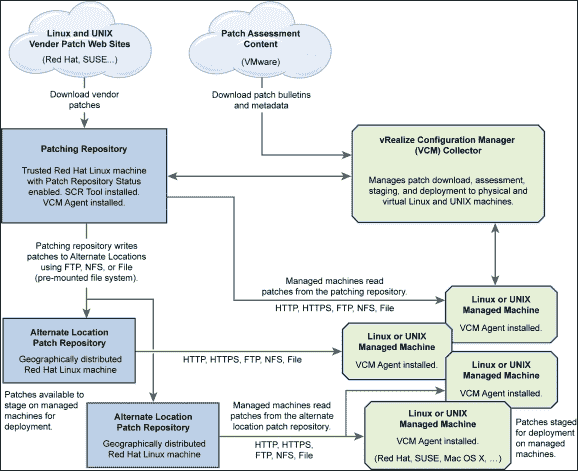

以下是根据前述图示使 Linux 补丁管理正常工作的步骤：

1.  我们在 RHEL 机器上配置 SCR 工具（最大的蓝色框）；我们可以为负载均衡配置多个此类工具。

1.  补丁通过 CDN 或供应商下载到 SCR 服务器上配置的相应文件夹中。

1.  同时，VCM 服务器（最大的绿色框）检查已管理的 Linux 机器（较小的绿色框）的补丁状态。然后，VCM 管理员决定安装哪些补丁。VCM 从 [`www.vmware.com/`](http://www.vmware.com/) 下载补丁通告，以获取有关补丁的最新信息。

1.  一旦 VCM 管理员决定要安装哪些补丁，所有的 Unix/Linux 机器都会访问 SCR 服务器以获取这些补丁。

1.  管理的机器安装补丁并将最新状态通知 VCM 服务器；基于此，如果需要，VCM 管理员可以采取进一步措施，例如故障排除或安装未成功的补丁。

## SCR 虚拟机要求

让我们看看您应该考虑的一些值，以便为 SCR 虚拟机进行规划。

### 各平台所需 SCR 存储空间估算

| **支持的平台** | **补丁内容文件和负载所需的最小存储空间** |
| --- | --- |
| AIX | 130 GB |
| CentOS | 80 GB |
| HP-UX | 15 GB |
| Mac OS X | 210 GB |
| Oracle 企业版 Linux (OEL) | 80 GB |
| RedHat | 80 GB |
| Solaris | 325 GB |
| SUSE | 60 GB |

### SCR 虚拟机硬件要求

以下是部署 SCR 所需的基本硬件要求：

| **硬件** | **规格** |
| --- | --- |
| **操作系统** | RHEL 7.x x86_64 |
| **硬盘** | 20 GB 基础操作系统 + 按前表所列的额外磁盘。此磁盘需要挂载在服务器的`/opt/vcmpatches`目录下。请按照[`www.techotopia.com/index.php/Adding_a_New_Disk_Drive_to_an_RHEL_6_System`](http://www.techotopia.com/index.php/Adding_a_New_Disk_Drive_to_an_RHEL_6_System)中的步骤，这适用于 RHEL 6，但在 RHEL 7 上也能很好地工作。 |
| **处理器** | 如果是虚拟机，需 2 个 vCPU |
| **RAM** | 4 GB |
| **网卡** | 1 GBps，具有互联网访问 |

### SCR 的补丁网站列表

这是我们需要访问的用于下载相应操作系统补丁的网站列表：

| **平台** | **下载网址** |
| --- | --- |
| **所有平台** | [`configuresoft.cdn.lumension.com/configuresoft`](http://configuresoft.cdn.lumension.com/configuresoft)[`novell.cdn.lumension.com/`](http://novell.cdn.lumension.com/)[`a248.e.akamai.net/f/60/59258/2d/`](https://a248.e.akamai.net/f/60/59258/2d/)[`vmware.cdn.lumension.com/`](http://vmware.cdn.lumension.com/) |
| **CentOS** | [`vault.centos.org`](http://vault.centos.org) 你也可以使用 Web 服务返回的镜像：[`mirrorlist.centos.org`](http://mirrorlist.centos.org) |
| **RedHat** | [`xmlrpc.rhn.redhat.com/XMLRPC`](http://xmlrpc.rhn.redhat.com/XMLRPC) |
| **SUSE** | [`you.novell.com/update/`](https://you.novell.com/update/)[`nu.novell.com/repo/$RCE/`](https://nu.novell.com/repo/$RCE/) |

### 注意

查看[`www.vmware.com/pdf/vrealize-configuration-manager-software-content-repository-tool-61-guide.pdf`](http://www.vmware.com/pdf/vrealize-configuration-manager-software-content-repository-tool-61-guide.pdf)获取更多 SCR 支持的操作系统详细信息。

# 安装 SCR 先决条件

如前所述，SCR 是一个基于 Java 的工具，因此它有一些先决条件，比如在基础操作系统上安装最新版本的 JRE 和 JDK。现在我们将检查启动 SCR 所需的所有要求。

## 准备工作

在开始之前，我们必须部署一个 RHEL 7 服务器，RHEL 安装程序的最低安装选项会安装我们启动时所需的必要功能。我们将需要安装 Apache 和一些其他工具，但这些可以稍后安装。最新的 JRE 和 JDK RPM 文件可以从 Oracle.com 下载。我们还需要 root 凭据来安装补丁。

## 如何操作...

使用 SSH 工具（如 **PuTTY**）登录到 RHEL 服务器，进入已复制安装程序的文件夹。然后，按照以下步骤操作：

1.  **下载中**：

    访问 [`www.oracle.com/index.html`](http://www.oracle.com/index.html)，下载适用于 RHEL 7 x64 的最新 JRE 和 JDK RPM 文件。

    一旦 RPM 文件下载完成，您可以使用 **winscp** 等工具将安装程序复制到 SCR 服务器。

1.  **使用 RPM 安装 JDK**：

    使用 `cd` 命令进入您复制了安装程序的文件夹，然后运行此命令：

    ```
    rpm -ivh <jdk Installer filename>.rpm

    ```

1.  **安装 JRE**：

    继续之前的操作，运行此命令以安装 JRE：

    ```
     rpm -ivh <jre Installer filename>.rpm

    ```

1.  **验证 Java 加密扩展（JCE）**：

    默认情况下，当您安装包含 JCE 的 Java 工具时，无需单独再次安装 JCE。

    运行以下命令验证 JCE 是否已安装：

    ```
    find / -iname US_export_policy.jar

    ```

    

## 它是如何工作的...

由于 SCR 是一个基于 Java 的工具，因此我们需要安装最新的 JRE 来使工具正常工作。

您可以安全安装的最低 Java 版本是 JRE 8u72，这是我们在本书中使用的版本。AIX、HP-UX、RedHat、Solaris 和 SUSE 需要 JCE。它在我们使用第三方凭据的属性文件中加密密码，这些属性文件用于下载补丁内容。

VCM 从 [`www.vmware.com/`](http://www.vmware.com/) 下载关于补丁的元数据。

VCM 完全不了解 SCR 服务器上有哪些补丁可用；它从 [`www.vmware.com/`](http://www.vmware.com/) 获取数据，而 SCR 从其他位置获取更新。

SCR 和 VCM 之间没有同步，因此建议您将 SCR 服务器在夜间同步，以确保所有补丁都已下载，然后从 VCM 开始推送补丁。

# 安装 SCR 工具

在本教程中，我们将在之前准备的 RHEL 虚拟机上安装 SCR 工具。

## 准备工作

您应该已经确认满足了前面教程中提到的所有先决条件。

从 [`www.vmware.com/`](http://www.vmware.com/) 下载最新版本的 SCR，本文撰写时为 SCR 6.1.21。将 ZIP 文件复制到 SCR 虚拟机的 `/tmp` 目录中。

我们还需要 RHEL 和 SUSE 等供应商的登录凭据，以便加密密码以便稍后在配置文件中使用。

## 如何操作...

使用 root 凭据登录到 SCR 虚拟机，并按照以下步骤安装并进行 SCR 的基本配置。

### 安装 SCR

1.  使用以下命令创建 `/opt/SCR` 文件夹：

    ```
     mkdir /opt/SCR

    ```

    从现在开始，我们将此位置称为 `scr_root`

1.  解压 SCR 安装文件：

    ```
    tar -zxvf /tmp/SCR-vmware-6.1.21.tar.gz -c /opt/SCR

    ```

### 加密内容仓库的密码

从我们在第 2 步停下的地方继续，并开始使用以下命令加密密码：

1.  使用以下命令进入 `/opt/SCR/bin` 目录：

    ```
     cd /opt/SCR/bin

    ```

1.  运行加密密码的脚本：

    ```
    ./lumension_encryptor_tool.sh

    ```

1.  提供密码（并确认密码）。

1.  复制加密的密码字符串，并保留它以备后续配置步骤使用。

不仅供应商连接密码，如果需要，代理密码也需要以这种方式加密。

### 注意

请注意，如果你提供的是未加密的密码，SCR 会假设它已加密，因此无法连接并下载补丁。

## 它是如何工作的…

我们现在正在准备解压安装程序并加密所有必需的密码，例如 RedHat 网络访问密码、用于从 SUSE 下载内容的密码或用于通过代理的密码。

我们需要在 SCR 使用的明文属性文件中输入密码作为配置输入，以便在开始下载补丁时使用。如果我们输入的是未加密的密码，任何有权限访问该文件的人都能读取它。为避免这种情况，有一个脚本可以加密密码，我们可以在配置文件中提供这个加密后的密码。

这些密码可以在明文配置文件中设置，以便 SCR 进一步处理。

SCR 服务器必须对所有的仓库应用程序文件拥有执行权限，才能访问和更新属性文件。要提供这些权限，请按照以下步骤操作：

1.  在 SCR 服务器上，切换到 `scr_root` 目录。

1.  要更改权限模式，运行 `chmod -R a+x **/*` 命令。

# 设置 SCR 配置文件

SCR 的核心是它的配置文件；如果我们在这里犯错，就无法下载补丁，也无法让我们的 SCR 实例准备好。请注意你所选择的内容；如果某个通道不需要，就不要在配置文件中提到它。

在本节中，我们将查看各种配置选项，它们的含义以及如何配置它们。

## 准备工作

按照 *安装 SCR* 配方安装 SCR，并准备加密密码。

请咨询你的操作系统支持团队，了解哪些 Linux/Unix 操作系统将由 VCM 打补丁，这样你可以提前下载这些补丁。

## 如何操作…

在本节中，我们将为 RedHat Linux 打补丁做准备；然而，同样的原则适用于所有 Linux 操作系统。

示例属性文件位于 `scr_root/conf/` 目录中。

如果你到目前为止一直按正确步骤操作，那么 RHEL 属性文件将位于 `/opt/SCR/redhat-rt.properties`。

如前所述，我们需要配置一个属性文件，SCR 工具将使用该文件来获取配置详细信息并据此执行操作。

要配置文件，请使用你喜欢的 Linux 编辑器打开它。

我们将保持默认值的选项在这里没有讨论。

这里是需要配置的选项：

+   `platform`

    `platform`参数指定要下载的补丁内容类型。

    ```
              platform=LINUX
    ```

+   `arch`

    `arch`参数指定指定平台的有效架构字符串。

    ```
              arch=X86, X86_64
    ```

+   `dist`

    `dist`参数指定 Linux 的发行版。多个值必须用逗号分隔，且不能有空格。

    ```
              dist=REDHAT
    ```

+   `folder`

    `folder`参数指定存储 SCR 工具输出的**根文件夹**。默认情况下，此`folder`为`/tmp/SCR/download`。

    将其更改为`folder=/opt/vcmpatches`（我们已将第二个硬盘挂载到此文件夹下；如果你不理解这一点，请咨询你的 Linux 管理员）。

    SCR 工具会在根输出文件夹下创建子目录树。

+   `thirdparty`

    将值设置为`true`以支持 CentOS、Oracle Linux、RedHat、Solaris 和 SUSE 的第三方下载。

    ```
              thirdparty=true or false
    ```

+   `user`

    `user`参数指定第三方供应商下载的用户 ID，例如 SUSE 或 RHEL。

    ```
              user=string
    ```

+   `pwd`

    `pwd`参数为`user`参数指定的用户 ID 指定一个加密密码。更多详细信息请参见*安装 SCR 配方*。

    ```
              pwd=[encrypted password string]
    ```

+   `configlog`

    此参数指定输出文件，包含参数和值的列表。这些值反映了 SCR 工具在之前或当前执行过程中使用的参数配置，并可以用于排查问题。

    ```
              configlog=config_log_file_path/filename.log
    ```

+   `checkPayload`

    ```
              checkPayload=true or false
    ```

    将此设置为`true`。

+   `dependencyCheck`

    这会关闭 Linux 平台的依赖 RPM 下载。

    ```
              dependencyCheck= Valid values (not case sensitive): NONE, DIRECT,
              and TRANSITIVE
    ```

    VMware 建议使用`TRANSITIVE`，因为这将下载所有相关的补丁。

+   `channels`

    渠道基本上是 Linux/Unix 操作系统的版本；例如，在 RHEL 的情况下，我们有`client-x`、`server-x`或`workstation-x`。

    这是一个针对 RedHat 的示例：

    ```
              channels=es-4, server-5
    ```

    如果你只想下载 RHEL 7 的补丁，请选择`server-7`。SCR 将只下载此版本的补丁。

    这是你需要与 Linux 团队咨询的地方，了解他们支持哪些操作系统版本，以便仅将这些版本作为渠道并避免不必要的补丁下载。

+   `downloadPayload`

    如果值为`true`，则下载所有补丁。如果值为`false`，则只下载包含在缓存请求文件夹中的补丁。如果值为`false`并且没有缓存请求 XML 文件，则内容会被处理，但不会下载补丁。

    ```
              downloadPayload=true or false
    ```

    建议将此项保持为`true`。

+   `cacheRequestFolder`

    ```
              cacheRequestFolder=path/CacheRequest.xml

              /opt/SCR/cacherequest
    ```

    缓存请求 XML 文件用于限制下载的补丁，仅限于那些你从 VCM 数据库中的`ecm_sysdat_patch_pls`表中获取到 UID 的补丁。

    即使你没有使用这个选项，也不要取消它，否则补丁下载将失败。

+   `proxyServer`

    这指定了您的基础设施中用于互联网访问的代理服务器 IP 地址。

    ```
              proxyServer=IP_address
    ```

+   `proxyPort`

    这指定了您的基础设施中用于互联网访问的代理服务器端口。

    ```
              proxyPort=port_number
    ```

+   `proxyUser`

    这指定了代理服务器身份验证的用户 ID（如果适用）。

+   `proxyPwd`

    这指定了代理服务器的加密密码（如果您需要代理用户）。此密码是使用`lumension_encryptor_tool.sh`脚本生成的，正如前面配方中所解释的那样。

    ```
              proxyPwd=string
    ```

+   `证书`

    将其指向包含您的 RedHat 授权证书的文件。此文件由订阅管理器在您将订阅附加到已注册的 RedHat 系统时创建，路径为`/etc/pki/entitlement`。证书的文件名各不相同，但始终采用`XXXXXXXXXXXXXXXXXXX.pem`的形式，其中`X`是十进制数字。

    如果您在没有设置证书的情况下尝试下载 RedHat 7 RPM 文件，将出现以下错误信息：

    ```
     java.lang.IllegalArgumentException: certificate cannot be null or
              not 
    a file 

    ```

    此参数的示例值：

    ```
     certificate=/etc/pki/entitlement/5280746408908734973.pem 
              privateKey=/etc/pki/entitlement/5280746408908734973-key.pem

    ```

以下命令用于将 RHEL 7 与 RedHat 订阅管理进行注册：

```
subscription-manager register --username <User_Name> --password <Pass_Word> -auto-attach

```

这是我们无法使用任何其他版本的 Linux 作为 SCR 服务器的原因。

### 注意

大部分细节都来自[`www.vmware.com/pdf/vrealize-configuration-manager-software-content-repository-tool-61-guide.pdf`](http://www.vmware.com/pdf/vrealize-configuration-manager-software-content-repository-tool-61-guide.pdf)。

保存属性文件。

此文件还有另一个问题；我们需要将工作中的`redhat-rt.properties`文件复制到`REDHAT-rt.properties`文件中，因为在错误日志中观察到 VCM 尝试查找大写的`REDHAT`文件时失败，而且在 Linux 中，`REDHAT-rt.properties`和`redhat-rt.properties`是两个不同的文件。

配置完成后，文件应如下所示：

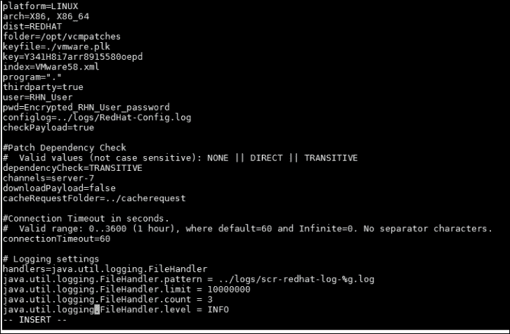

文件保存后，转到`/opt/SCR/bin`并运行以下命令：

```
./startup.sh redhat-rt

```

然后，检查日志文件和下载文件夹；如果日志文件中没有错误日志，则 SCR 将开始同步补丁。

## 它是如何工作的...

当我们使用 SCR 工具开始下载补丁时，它会使用配置文件中提供的信息然后执行操作；例如，它将使用配置文件中提供的代理和配置的凭据进行身份验证。

它将使用文件夹路径下载补丁，并使用共享的凭据与操作系统供应商进行身份验证。

它将只下载在通道配置中提到的操作系统版本的补丁；如果我们按照这种方式配置文件，它可能不会下载任何补丁，并且在使用 VCM 进行部署时可能会遇到失败。

SCR 工具首先尝试从 CDN 下载有效负载。如果在 CDN 中未找到补丁，SCR 工具则从供应商的网站（例如 RedHat、SUSE 或 Solaris）下载，使用在用户和密码参数中提供的凭据。

如果现在发生类似情况，您知道该从哪里开始查看。这里提到的日志文件位置非常有用，前提是您已正确配置了所有内容。如果 SCR 无法下载补丁，可以查看配置文件中提到的日志文件。

如果您是 Linux 新手，可以使用一个叫做 winscp 的工具；它允许您浏览 Linux 文件系统并操作文件。

在 winscp 中打开日志文件，查找某些信息，确认系统正在注册到 RHN，以确保一切正常：

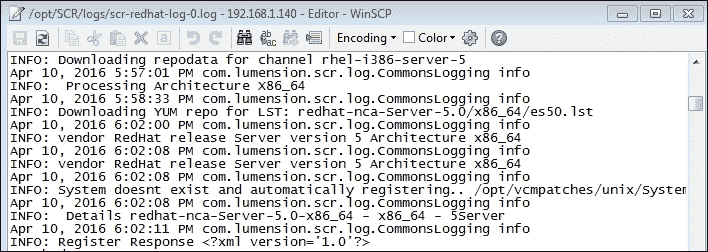

我们将在第九章中查看关于排查 SCR 下载问题的食谱，*排查 VCM*。

# 安排内容下载

操作系统厂商持续发布补丁。我们不能仅仅登录 SCR 手动同步补丁；我们可以设置一个计划任务，让 SCR 自动处理所有所需补丁的下载。

## 准备工作

SCR 虚拟机必须能够访问互联网，并按前两个步骤配置。

配置`redhat-rt.properties`文件，设置正确的配置，例如 RHN 用户详情和代理设置，并保存文件。

## 如何操作...

要设置定时任务，我们需要创建可以自动运行的脚本。

按照以下步骤创建脚本并安排其执行。

1.  登录 SCR 服务器后，进入 SCR 安装位置（对我们来说是 `/opt/SCR`）。

1.  **将以下内容复制到文件中**：

    ```
     vi /opt/SCR/bin/start_all_nix_replication.sh

    ```

    按 *i* 进入编辑模式

    输入或复制以下内容：

    ```
              #echo Running startup.sh hp-rt 
              #./startup.sh hp-rt 
              #echo Running startup.sh osx-rt 
              #./startup.sh osx-rt 
              echo Running startup.sh redhat-rt 
              ./startup.sh redhat-rt             
              #echo Running startup.sh solaris-rt 
              #./startup.sh solaris-rt 
              #echo Running startup.sh suse-rt 
              #./startup.sh suse-rt 

    ```

    删除 RedHat 条目前面的 `#`，因为我们需要同步该条目的补丁，如果您有其他版本的 Linux，也请对它进行相同操作。

    完成后，按[*ESC*]键，然后输入 *:wq* 保存内容并退出 vi。

1.  **为创建的文件分配可执行权限：**

    ```
     chmod +x  /opt/SCR/bin/start_all_nix_replication.sh 

    ```

    一旦脚本准备好，我们需要安排它执行。

1.  **安排定时任务每天下载补丁：**

    ```
     cd /etc/cron.daily 
           touch /etc/cron.daily/SCR 
           chmod +x /etc/cron.daily/SCR

    ```

    ### 提示

    请注意，以下脚本每天运行并同步您的补丁内容：

    `vim /etc/cron.daily/SCR`

1.  **将以下代码添加到文件中**：

    ```
     #!/bin/sh 
           cd /opt/SCR/bin 
           echo "### Get all new Unix content" 
           ./start_all_nix_replication.sh 

    ```

主机必须对所有的仓库应用文件赋予执行权限，才能访问并更新配置文件。要授予此权限，请在主机上运行以下命令。

切换到 SCR 根目录（`/opt/SCR`）。

### 提示

请注意，在 `/opt/SCR` 目录中执行以下命令：`**cd /opt/SCR**` `**chmod -R a+x **/***`

运行 SCR 文件以创建目录结构：

1.  切换到 `/etc/cron.daily` 目录。

    ```
     cd /etc/cron.daily

    ```

1.  运行 SCR 文件以创建目录结构并下载内容：

    ```
     ./SCR

    ```

1.  通过运行以下命令来监视文件大小：

    ```
     du -sh /opt/vcmpatches

    ```

## 工作原理...

我们创建一个每日调度任务，它将在凌晨 12:00 执行，然后使用属性文件中提供的配置设置，下载补丁到 SCR 服务器。补丁随后可以用于通过 VCM 部署。在开始使用 VCM 部署补丁之前，必须将其下载到 SCR 服务器，因为 VCM 不知道哪些补丁是可用的，哪些是不可用的。

# 配置 Apache

到目前为止，我们已经将所有补丁下载到 SCR 服务器；接下来，我们需要一个机制，使它们在被管理的机器需要安装时能够获取。

我们可以配置一个 Web 服务器来分发来自 SCR 仓库的补丁。

正如前面所述，我们可以通过 HTTP/HTTPS 分发补丁；我们将配置 Apache Web 服务器，使包含补丁的文件夹（`/opt/vcmpatches`）可以通过 HTTP 访问。然后，我们将在 VCM 服务器中进行必要的修改，指示 Linux/Unix 机器根据我们的 Web 服务器配置下载补丁。

## 准备工作

由于你已经将 SCR 服务器注册到 RedHat 网络，这是下载 RHEL 7 补丁的前提条件，因此你已经拥有一个仓库，准备安装 Apache。

**安全增强 Linux**（**SELinux**）应禁用或配置为允许我们在端口 `80` 或 `443` 上连接。

如果你不清楚如何实现此操作，可以查看以下文章：

[`access.redhat.com/documentation/en-US/Red_Hat_Enterprise_Linux/7/html/SELinux_Users_and_Administrators_Guide/chap-Managing_Confined_Services-The_Apache_HTTP_Server.html#sect-Managing_Confined_Services-The_Apache_HTTP_Server-The_Apache_HTTP_Server_and_SELinux`](https://access.redhat.com/documentation/en-US/Red_Hat_Enterprise_Linux/7/html/SELinux_Users_and_Administrators_Guide/chap-Managing_Confined_Services-The_Apache_HTTP_Server.html#sect-Managing_Confined_Services-The_Apache_HTTP_Server-The_Apache_HTTP_Server_and_SELinux)

防火墙应禁用或配置为允许我们通过端口`80`/`443`访问补丁。

查看这篇文章，了解如何操作 RHEL 防火墙：

[`access.redhat.com/documentation/en-US/Red_Hat_Enterprise_Linux/7/html/Security_Guide/sec-Using_Firewalls.html`](https://access.redhat.com/documentation/en-US/Red_Hat_Enterprise_Linux/7/html/Security_Guide/sec-Using_Firewalls.html)

你还可以使用以下文章来配置端口 80，并对端口`443`做必要的修改：

[`linuxconfig.org/how-to-open-http-port-80-on-redhat-7-linux-using-firewall-cmd`](https://linuxconfig.org/how-to-open-http-port-80-on-redhat-7-linux-using-firewall-cmd)

## 如何操作...

这是一个比较长的操作步骤，我们将其分成多个部分，如下所示：

+   *安装 Apache*

+   *配置 httpd.conf 以设置 Apache*

+   *配置 .htaccess 文件*

+   *在 Apache 中配置 HTTPS*

### 安装 Apache

为了使补丁在我们的基础设施中可用，我们可以将 SCR 服务器作为 Web 服务器来使用，并在 VCM 中进行配置，使受管理的机器通过端口 `80` 或 `443` 从 SCR 服务器访问这些补丁。

我们将通过以下步骤来实现：

1.  使用 root 账户登录到 SCR 服务器。

1.  安装 Apache：

    ```
     # yum install httpd

    ```

1.  确保 httpd 在操作系统启动时自动启动：

    ```
     # systemctl enable httpd

    ```

1.  现在启动 httpd 服务：

    ```
     # systemctl start httpd.service

    ```

现在，我们需要配置位于 `/etc/https/conf` 的 `httpd.conf` 文件，以使 Apache 按照我们的需求运行。

### 配置 Apache 的 httpd.conf

Apache 的配置存储在 `httpd.conf` 文件中，位于 `/etc/https/conf`。继续执行以下步骤以在配置文件中做必要的更改。

1.  在对 `httpd.conf` 进行更改之前，我们需要在我们用来下载补丁的文件夹（`/opt/vcmpatches`）和 `httpd.conf` 中暴露的文件夹（`/var/www/html`）之间创建一个符号链接。

1.  使用 root 账户登录到 SCR 服务器。

1.  使用 `cd /var/www/html` 命令进入 `/var/www/html`。

1.  运行 `ln -s /opt/vcmpatchs vcmpatches` 命令。

1.  编辑 `httpd.conf`：

    ```
     # vi /etc/httpd/conf/httpd.conf

    ```

1.  输入 *I* 进入编辑模式，并在 `AccessFileName` 部分下方添加以下行：

    ```
           AccessFileName /vcmpatches/.htaccess 

    ```

    ### 注意

    请注意，我们将在本教程的下一部分创建这个 `.httaccess` 文件。

### 配置 .htaccess 文件

为了确保安全，我们可以添加一个 `.htaccess` 文件，以便只有配置过的用户可以访问补丁。

在 `/opt/vcmpatches` 创建并编辑 `.htaccess` 文件：

```
# vi /opt/vcmpatches/.htaccess

```

将以下行添加到文件中：

```
AuthType Basic 
AuthName "Restricted Area" 
AuthUserFile /opt/vcmpatches/.htpasswd 
require valid-user 

```

现在，为 `httpuser` 用户创建一个加密的密码：

```
#  htpasswd -c /opt/vcmpatches/.htpasswd  httpuser

```

它会提示你输入密码；请输入你想要设置的密码。

这将在相同位置创建另一个文件 `.htpasswd`，并存储加密的密码，你可以通过以下命令查看它：

```
# cat /opt/vcmpatches/.htpasswd 
httpuser:$apr1$1UgtgyfY$ed2kr8fDOB7XVd6UoytgE0

```

### 配置 Apache 中的 HTTPS

Apache 的默认安装将为我们提供一个 HTTP 连接到补丁库。我们需要在 Apache 中创建并配置证书，以便我们的受管虚拟机可以从 SCR 服务器安全地下载补丁。要配置 HTTPS，我们需要按照以下步骤操作：

1.  **安装 Mod SSL**

    为了设置自签名证书，我们首先需要确保 Apache 和 Mod SSL 已经安装。你可以通过一个命令同时安装这两者：

    ```
     rpm -ivh mod_ssl-2.2.15-29.e16_4.x86_64.rpm

    ```

1.  **创建一个新目录**

    接下来，我们需要创建一个新目录，用于存储服务器密钥和证书：

    ```
     mkdir /etc/httpd/ssl

    ```

1.  **创建一个自签名证书**

    当我们请求新的证书时，可以通过修改 `1000` 参数为我们希望的天数，来指定证书的有效期：

    ```
     Openssl req -x509 -nodes -days 1000 -newkey rsa:2048 -keyout 
     /etc/httpd/ssl/apache.key -out /etc/httpd/ssl/apache.crt

    ```

    使用此命令，我们将同时创建自签名的 SSL 证书和保护它的服务器密钥，并将它们放入新目录中。此命令会提示终端显示需要填写的字段列表。最重要的一行是 **Common Name**。在这里输入你的官方域名，或者如果你还没有域名，可以使用你网站的 IP 地址。

    您将被要求输入信息，这些信息将被纳入您的证书请求中。

    提供以下详细信息：

    +   **国家名称（两字母代码）**：`IN`

    +   **州或省的全名**：`Maharashtra`

    +   **地方名称（例如，城市）**：`Pune`

    +   **组织名称（如公司名称）**：`VCM_Cookbook`

    +   **组织单位名称（例如，部门名称）**：`信息技术`

    +   **通用名称（例如，服务器的完全限定域名或您的名字）**：`VCMCookbook.com`

    +   **电子邮件地址**：`Abhijeet@vcmcookbook.com`

    ### 注意

    请注意，示例值需要根据您的基础设施进行更改。

1.  **设置证书**：

    我们现在已经具备了完整证书所需的所有组件。接下来的工作是设置虚拟主机以显示新的证书。

    打开 SSL 配置文件：

    ```
     vi /etc/httpd/conf.d/ssl.conf

    ```

    现在，将以下代码块添加到文件中：

    ```
              ## SSL Virtual Host Context 
              <VirtualHost *:443> 
                  ServerAdmin root@localhost 
                  DocumentRoot /var/www/html 
                  ServerName SCR Server FQDN 
                  ServerAlias SCR Server hostname 
                  SSLEngine on 
                  SSLCertificateFile /etc/httpd/ssl/apache.crt 
                  SSLCertificateKeyFile /etc/httpd/ssl/apache.key 

              </VirtualHost> 
              <VirtualHost _default_:443> 

    ```

1.  **重启 Apache**：

    您完成了。重启 Apache 服务器将重新加载它，并应用所有更改。

    ```
     #systemctl restart httpd.service

    ```

完成此步骤后，您应通过浏览器访问 VCM 补丁文件夹，网络上应该会显示如下截图。

当您访问该链接时，它会要求进行身份验证。请使用在之前步骤中创建的 `httpuser` 用户和密码。

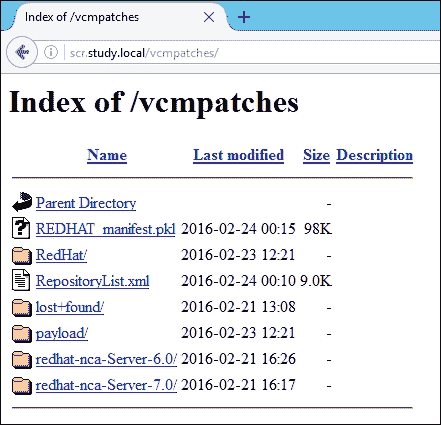

## 它是如何工作的...

Linux 和 Unix 管理的机器可以使用 HTTP/HTTPS 直接从 RedHat Linux 补丁仓库机器获取补丁。

VCM Collector 协调并组织所需的任务，以使用安装在补丁仓库机器上的 VCM 代理和目标受管机器上的 VCM 代理，下载、存放和部署补丁以及执行自定义的预部署、后部署和重启操作。

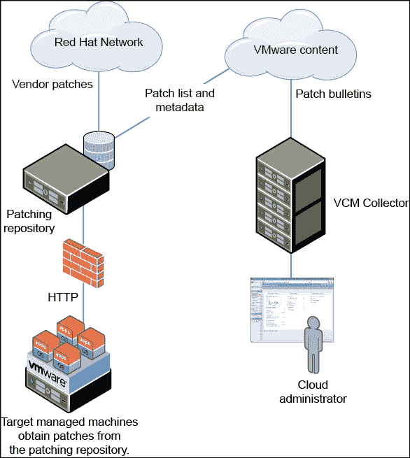

补丁可在 SCR 服务器上获取，在 Apache 服务器的帮助下，我们创建了一个 Web 服务器，将补丁提供给受管机器。

## 还有更多...

配置完成后，我们需要在 VCM 控制台中进行必要的配置更改，并将暂存选项设置为 HTTP，同时将受管机器重定向到 `/opt/vcmpatches` 文件夹以下载补丁。我们将在接下来的配方中执行此操作，*在 VCM 中配置补丁仓库选项* 和 *配置暂存选项*。

# 在 VCM 中配置补丁仓库选项

一旦 SCR 方面的一切配置好并准备就绪，我们应当开始配置 VCM 中的仓库。这是我们设置作为仓库的机器（SCR 服务器）的位置。

## 准备就绪

在开始之前，我们应该完成所有之前的配置步骤，因为这些步骤是相互依赖的。按照 第二章 *配置 VCM 以管理您的基础设施* 章节中的 *在 Linux 服务器上安装代理* 配方描述，安装 VCM 代理，并为 SCR 机器执行初步数据收集。

## 如何操作...

要在 VCM 中设置补丁仓库，请登录到 VCM 控制台并按照以下步骤操作：

1.  转到**管理** | **证书**并选择 SCR 服务器。点击屏幕顶部的**更改信任状态**。如何操作...

1.  在向导中，选择 SCR 机器并勾选**勾选以信任，取消勾选以不信任所选机器**选项。

1.  你应该能在 SCR 服务器前看到一个握手标志。

1.  现在，保持选中 SCR 机器并点击屏幕顶部的**补丁仓库**。

1.  确保选中 SCR 服务器，然后选择**启用 - 允许将选定的机器作为补丁仓库**。点击**下一步**。

1.  点击**完成**以关闭向导。

1.  最终结果应该类似于这样：如何操作...

## 它是如何工作的...

我们将补丁仓库设置为我们将管理的所有 Linux/Unix 机器的指定补丁仓库。现在，VCM 知道如果机器需要补丁时，应该重定向到哪里；我们需要进行进一步的配置更改，比如设置机器可以从哪里下载补丁，但这些将会在下一个配方中进行。

# 配置 VCM 中的阶段选项

阶段选项是我们设置 VCM 将虚拟机精确地重定向到`https://<SCR Server>/<Patch location>`的地方。目前，我们已经下载了补丁并添加了一个服务器作为仓库，现在，我们将设置文件夹的名称并配置机器组映射到阶段选项。

## 准备中

我们是在前面的配方基础上构建的，所以在继续这个配方之前，我们应该已经完成了所有的配方。如果需要任何特殊的机器组，它们应该在我们开始这个配方之前就准备好。

## 如何操作...

登录到 VCM 服务器控制台并按照以下步骤配置补丁阶段：

1.  以 VCM 管理员身份登录到 VCM 控制台。

1.  转到**管理** | **设置** | **常规设置** | **补丁** | **UNIX** | **补丁阶段**。点击**添加**。

1.  给一个名称并添加描述。

1.  在**仓库类型**下，选择**从补丁仓库获取补丁：<SCR 服务器名称>**。

1.  在下一页中，提供以下详细信息：

    +   **仓库路径：**`/vcmpatches`（这是我们下载补丁的相对路径）

    +   **协议：**选择**HTTPS**

    +   **端口：**输入`443`，除非你已经在`httpd.conf`中做了更改并使用了其他端口。

    +   选择所需的凭证

    +   **用户名：**`httpuser`（或在`.htaccess`文件中设置的任何用户）

    +   **密码：**明文密码（不要在这里使用加密密码）

1.  点击**完成**。

现在我们已经设置了阶段选项，我们需要将其分配给机器组，这样机器就知道从哪里下载补丁了。

1.  转到**管理** | **设置** | **常规设置** | **补丁** | **UNIX** | **机器组映射**。

1.  选择**机器组**并点击**编辑**。

1.  将补丁路径值设置为**标准部署和源**，用于分阶段补丁到**SCR-HTTP**。

1.  协议和路径将自动填充，即，如果您没有创建证书，它将分配端口 80，如果您通过创建自签名证书来确保您的 Apache 设置，那么它将像这样：

    +   `HTTP://scr:80/vcmpatches`

    +   `HTTPS://scr:443/vcmpatches`

1.  点击**下一步**并点击**完成**以保存设置。

1.  对所有包含 Linux/Unix 机器并将使用 VCM 进行打补丁的机器组执行此操作。

## 它是如何工作的...

如果我们没有设置暂存选项，则机器打补丁将失败，因为机器不知道从哪里获取安装程序。作为最佳实践，请使用 HTTPS。

# 配置 SCR 工具基路径以进行打补丁仓库

VCM 中 SCR 工具基路径的设置必须指向您在打补丁仓库机器上安装 SCR 工具的位置。

基路径目录包含 SCR 二进制文件、配置文件和日志的目录。

## 准备就绪

如同以往，我们正在构建一个打补丁机制，因此所有之前的操作步骤对于继续进行后续步骤至关重要。这一点对于本食谱同样适用：在开始本食谱之前，完成所有前面的食谱。

## 如何操作...

在本食谱中，我们将对 VCM 配置进行一些更改；只需按照以下步骤操作：

1.  导航到**管理** | **设置** | **常规设置** | **打补丁** | **UNIX** | **附加设置**。

1.  选择**打补丁期间临时文件的默认机器组映射**，并将其更改为一个您知道有足够空间下载补丁的文件夹，供安装前使用。

    足够的空间取决于部署的补丁数量。

    如果整个 Linux/Unix 服务器具有标准分区，请选择一个有足够空间的路径。

    在我们的案例中，它是`/var/tmp`，如图所示：

    

1.  点击**下一步**（截图中不可见）并点击**完成**以关闭并保存设置。

1.  列表中的下一个是**默认 UNIX>Linux 包仓库路径**。

1.  这是我们*下载补丁*的路径；在我们的案例中，它是`/opt/vcmpatches`。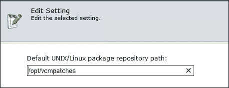

1.  点击**下一步**（截图中不可见）并点击**完成**以关闭并保存设置。

1.  列表中的最后一个设置是**默认 UNIX/Linux 包仓库 SCR 基路径**。

1.  这是我们从[`www.vmware.com`](http://www.vmware.com)下载并*解压或安装 SCR 文件*的目录。

1.  在我们的案例中，它是`/opt/SCR`。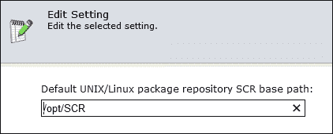

1.  点击**下一步**（截图中不可见）并点击**完成**以关闭并保存设置。

## 它是如何工作的...

每个设置的详细信息仅在此处解释；这基本上是确保 SCR 文件的位置，以便找到位于`/opt/SCR/conf`文件夹中的`properties`文件。

要检查`manifest.pkl`文件，该文件位于`/opt/vcmpatches`文件夹下，其中列出了所有的 RPM 包。

# 创建补丁评估模板

补丁评估模板基本上是将要安装在受管机器上的补丁列表，或者用于检查补丁合规性的。

## 准备就绪

我们需要在 Collector 服务器上有互联网访问权限，以便下载补丁元数据。

## 如何操作...

登录到 VCM 控制台并按照以下步骤创建所需的评估模板：

1.  导航到**打补丁** | **所有 UNIX/Linux 平台** | **评估模板**，然后点击**添加**。

1.  模板也可以在各个 Unix/Linux 平台上创建。

1.  给模板起一个描述性的名称并添加描述。

1.  选择**静态**作为模板类型。静态模板和动态模板的区别如下：

    +   **静态模板：** 使用此模板，我们可以选择哪些补丁要包含在模板中。

    +   **动态模板：** 使用此模板，VCM 会根据我们设置的查询选择补丁。

    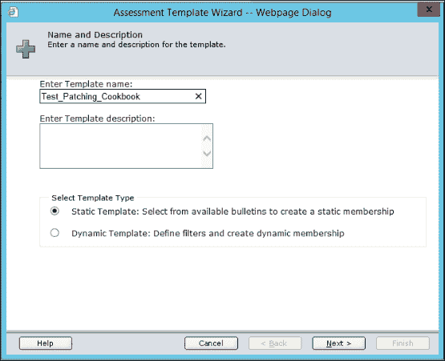

1.  如果我们选择了动态模板，我们可以设置查询条件，如**操作系统名称**、**操作系统版本**和**严重性**，并且可以创建多个查询并选择**与**/**或**操作符。

    ### 注意

    请注意，所有查询只能使用一个**与**/**或**操作符。

    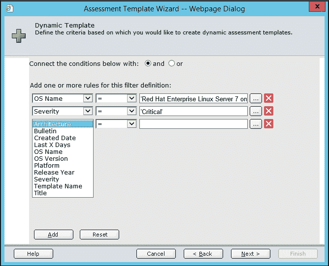

1.  如果我们选择**静态**模板，我们可以自由选择所有想要的补丁。

1.  我们可以应用一个临时筛选器来限制选择的补丁数量。

    ### 注意

    请注意，多个产品公告可以通过这种方式打包。VCM 只会尝试修补受影响的产品，也就是说，如果虚拟机运行的是 RedHat 6，那么 VCM 不会尝试应用 RedHat 7 的公告。

    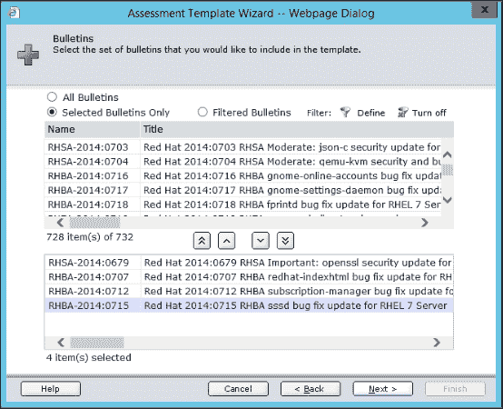

1.  选择所有需要的补丁后，点击**下一步**。

1.  点击**完成**来关闭向导。

## 如何操作...

我们不能在没有创建评估模板的情况下部署补丁；这些模板将用于评估机器的状态，检查缺失的补丁，然后进行部署。

我们无法确保在模板中选择的补丁是否存在于 SCR 服务器上，因此为了避免失败，我们应该始终将所有补丁下载到 SCR 服务器上。

## 另见

+   此补丁评估模板将用于*按需部署 Linux 机器上的补丁*和*按计划部署 Linux 机器上的补丁*配方。

# 在 Linux 机器上部署补丁 – 按需部署

这就是我们执行所有这些配方的目的：为服务器打补丁。到此时，我们已经准备好在受管机器上安装补丁。我们可以选择按计划安装补丁，也可以按需安装。在本配方中，我们将直接从控制台安装缺失的补丁。

## 准备就绪

确保你想要修补的虚拟机在 VCM 中是受信任的；如果不是，请按照我们为 SCR 服务器建立信任时所遵循的步骤，在*配置 VCM 中的修补存储库选项*中操作。

我们必须确保 Linux 机器与待修补机器以及 SCR 和 VCM 服务器之间可以进行 DNS 解析。

受管机器必须能通过其 IP 与 VCM 和 SCR 服务器连接。

我们应该执行一个集合，使用**修补 - Unix 评估结果**作为**过滤集**选项，如在第二章中的*从受管机器收集数据*食谱所解释的那样，*配置 VCM 以管理你的基础设施*。

## 如何操作...

使用管理员权限登录 VCM 控制台并按照以下步骤开始安装补丁：

1.  转到**修补** | **RedHat** | **评估模板**并选择你创建的评估模板。

1.  点击右上角的**查看报告**。

1.  一旦看到报告，将**推荐操作**拖动到**过滤器**栏；现在，默认视图会发生变化，你可以看到它根据**推荐操作**进行排序。

1.  点击**安装路径**前的小箭头，选择补丁并从顶部菜单点击**部署**。如何操作...

1.  选择项目并点击**包括前提补丁**。

1.  验证补丁。

1.  点击**高级**，并查看是否对你或你的 Linux 管理员有兴趣。

1.  确认补丁部署并选择阶段选项。

    ### 注意

    请注意，如果你想修补的机器属于一个没有分配阶段选项的机器组，你将只看到一个选项，即**无：手动阶段补丁**。

    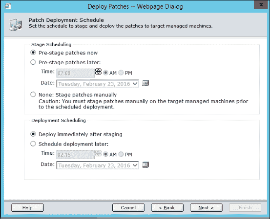

1.  在下一页，选择是否要重启服务器。

1.  点击**完成**以关闭向导。

1.  VCM 将开始安装补丁，你可以查看它运行的作业状态：所有三个作业——**下载**、**阶段**和**部署**——应该以**成功**的结果结束。

    如果你选择重启服务器，那么在重启后，像我们在食谱的第 3 步和第 4 步中所做的那样检查状态；它应该显示**成功**并列出我们刚刚安装的路径名称。

    在**管理** | **作业** | **经理** | **其他作业** | **过去 24 小时**的作业历史中，它将呈现如下：

    

1.  你可以在 VCM 控制台中检查补丁的状态，它会显示补丁已安装。要检查状态，请前往**修补** | **RedHat** | **评估模板** | "模板名称" :

## 它是如何工作的...

当我们从 VCM 控制台推送补丁时，它首先评估机器，检查自上次评估以来是否已经安装了补丁。如果仍然需要补丁，那么在配置的暂存位置中准备好的补丁将被安装，随后 VCM 代理会检查补丁是否正确安装。

如果我们在此之后安排重启，那么 VCM 中将配置另一个作业并开始，具体取决于我们在部署补丁时选择的配置。如果补丁安装花费的时间超过了计划中的固定重启时间，则重启作业将失败。

# 在 Linux 机器上部署补丁 - 计划任务

当我们执行按需补丁时，我们确保为 Linux 或 Unix 机器设置的补丁基础设施正常工作。现在，我们需要将其提升到一个新的层次，通过自动执行所有操作。在这个教程中，我们将配置所有必需的作业，以便 VCM 能够按计划对 Linux/Unix 机器进行补丁。

## 准备工作

准备工作与之前相同。确保你要打补丁的虚拟机在 VCM 中是受信任的；如果不是，请按照我们在*配置 VCM 中的补丁库选项*教程中所做的步骤，信任 SCR 服务器。

我们应该确保 Linux 机器和待打补丁的 SCR 及 VCM 服务器之间能够进行 DNS 解析。

虚拟机所在的机器组应配置适当的暂存。

## 如何操作...

我们现在知道，补丁 Linux 是一个三步过程：

+   使用**补丁 - Unix 评估结果**作为**筛选集**选项来收集最新数据。

+   执行实际的补丁操作

+   再次收集数据（这算是可选的，因为 VCM 也会收集数据——这只是一个预防措施）。

所以，让我们从在 VCM 中安排所需任务开始，以便我们的机器能够自动打补丁：

| **序号** | **名称** | **计划** | **原因** |
| --- | --- | --- | --- |
| **1** | 初步收集 | 第一个星期天上午 08:00 | 实际补丁前 12 小时 |
| **2** | 部署补丁 | 第一个星期天晚上 08:00 | 计划补丁维护窗口 |
| **3** | 最终评估 | 第一个星期天晚上 11:00 | 补丁后 3 小时，给自动收集留出时间（发生在补丁安装和重启后的 30 分钟） |

### 步骤 1 – 初步收集

1.  登录到 VCM 控制台并进入**管理** | **作业管理器** | **计划任务**。

1.  点击**添加**，在向导启动后选择**收集**，然后点击**下一步**。

1.  提供一个合适的名称和描述。

1.  选择**补丁 - Unix 评估结果**作为**筛选集**选项。

1.  选择要在此计划中打补丁的机器组。

1.  选择一个计划，最好是实际补丁前最多 24 小时。

1.  点击**下一步**，并最终在验证没有冲突后，点击**完成**。

1.  这完成了我们的第一阶段。接下来是实际的补丁计划。

### 步骤 2 – 部署补丁

要安排补丁操作，请按照以下步骤进行：

1.  进入 **Patching** | **所有** **Unix/Linux 平台** | **自动部署**

1.  给部署指定一个名称并添加描述。

1.  选择我们要打补丁的 **机器组**，并且该机器组的数据在之前的初始采集步骤中已经被收集。

1.  选择用于部署补丁的 **评估模板**。

1.  在下一页中，选择以下内容：

    +   **计划的自动部署运行**

    +   根据组织的政策，选择是否需要重启。

    +   **阈值数据年龄**：`2` 天应该没问题，因为我们正在对过去 24 小时的数据进行采集。如果数据比配置的天数更旧，则服务器将不会被打补丁。

    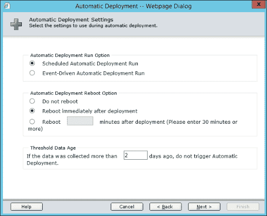

1.  选择计划并在最后一页点击 **完成** 以保存计划的补丁。

### 第 3 步 – 最终评估

+   补丁安装完成后，VCM 执行一次采集，选择 **Patching - Unix 评估结果** 作为 **过滤集** 选项。仍然，我们可以再安排一个任务来收集详细信息。

+   按照我们为配置预补丁数据收集时的相同步骤操作，但这次需要更改名称和采集时间表，使得此次采集会在补丁安装完成后几小时开始。

## 它是如何工作的...

基本上，我们正在将之前手动执行的任务进行计划安排，这样可以节省时间，并且不需要在午夜时分醒来为服务器打补丁。VCM 会按时启动计划的任务，收集数据，检查缺少哪些补丁，安装这些补丁，最后收集补丁后的数据，以便我们在运行补丁报告时，能够看到托管机器的最新状态。

要查看报告，可以查看 第四章 中的 *补丁报告* 配方，*Windows 补丁*。我们在这里唯一可以期待的不同之处是名称不同；我们需要将 Windows 替换为 Unix。
