# 第四章。Windows 补丁更新

在本章中，我们将涵盖以下内容：

+   配置 VCM 以使用 Microsoft 更新

+   自动化补丁更新简介

+   创建补丁评估模板

+   Windows 补丁更新——按需

+   Windows 补丁更新——定期

+   在多域环境和工作组中进行机器补丁更新

+   补丁虚拟机模板

+   补丁报告

# 介绍

到目前为止，我们已经讨论了如何在一个或多个层级上部署 VCM，如何配置它，以及如何在我们想要管理的机器上部署代理。在本章中，我们将探讨如何对 Windows 服务器和桌面进行补丁更新。

尽管所有产品都经过严格的质量测试，但总会留下些未修复的漏洞，如果不修复，这些漏洞可能会被利用。补丁管理的作用就是来完成这个任务。在 VCM 的帮助下，我们可以对基础设施进行自动化、定期的补丁缺失分析，并根据需要部署补丁。市场上有许多工具，如 Microsoft System Center Configuration Manager 或 BMC BSA，能够完成这项任务，但使用 VCM 的好处是它是 vRealize Operation 套件的一部分，因此你不需要为 VCM 额外付费。它不仅可以为 Windows 和 Linux 进行补丁更新，还可以用于补丁 Unix 和 Mac OS。我们可以安排补丁任务，VCM 会执行补丁操作并在中央控制台上更新状态。

借助 vRealize Automation 和 vRealize Orchestrator，我们可以自动化 Windows 补丁更新的部署。我们可以在虚拟机中创建一个注册表项，这个项将在 VCM 执行收集时被捕获，并根据这个注册表项，虚拟机会被放入正确的机器组，该组专门用于在相同的时间表上进行补丁更新。

为了执行定期补丁更新，我们需要配置至少四个任务。第一个是初始收集，它将收集**Patching - Windows Security Bulletins**筛选器集的状态详情。一旦这些详细信息被存入 VCM 数据库，另一个任务将启动初步评估，检查服务器上缺失哪些补丁。一旦 VCM 获得了缺失补丁的详细信息，补丁评估模板中的补丁将开始实际的补丁任务。在每个补丁任务完成后，VCM 会启动自己的数据收集任务，以获取服务器的更新状态。最后，我们需要安排最终评估，以更新补丁部署后的补丁状态。

# 配置 VCM 以使用 Microsoft 更新

在这个步骤中，我们将配置 VCM 与 Microsoft 同步补丁元数据，以便我们可以选择一个或多个补丁并检查我们的基础设施合规性。如果 VCM 检测到不合规的情况，我们可以部署补丁。

## 准备工作

我们需要一个完全部署的 VCM 服务器来执行此操作。为了使用 VCM 进行修补，我们需要通过互联网将补丁从 Microsoft 下载到 VCM 收集器服务器。我们应该有代理的相关信息，如 IP 地址、端口名称和用户凭证。如果您在一个安全的网络中，请确保至少能够访问[`www.microsoft.com/`](https://www.microsoft.com/)和[`www.vmware.com/`](http://www.vmware.com/)。

防火墙要求在 vRealize 配置管理器端口和协议摘要的*安装 VCM*章节中进行了讨论。

### 注意

请注意，在修补 Windows Server 2008 和 Windows 7 机器之前，您需要验证 Windows Update 服务是否正在运行，这意味着它的设置不是**禁用**状态。

## 如何操作...

为了准备 Microsoft 补丁，我们将这项任务分为几个步骤。只有在通过代理访问互联网时，才需要执行代理步骤。

### 配置代理

在实际场景中，VCM 服务器需要通过代理才能访问互联网上的修补网站；我们需要在 vRealize 配置管理器中更新这些设置。我们可以按照以下步骤进行操作：

1.  使用管理员权限登录 VCM。

1.  转到**管理** | **设置** | **常规设置** | **修补** | **互联网**。

1.  分别选择**HTTP 代理服务器**和**登录**。点击顶部的**编辑**按钮并提供代理详细信息。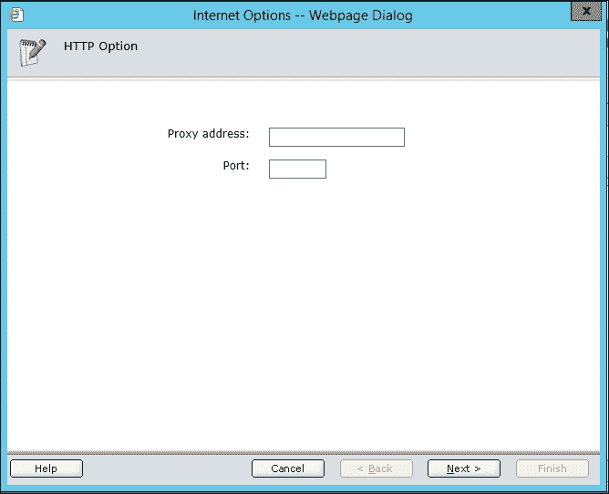

1.  输入在**准备阶段**中获取的凭据。

1.  点击**下一步**，然后点击**完成**。

一旦我们填写了代理选项，VCM 就可以连接到互联网并下载 Microsoft 补丁。

如果您可以直接访问互联网，则无需填写这些详细信息。您可以跳过这一部分。一旦代理配置完成，我们可以设置检查更新的频率以及需要下载的补丁语言。

除非在将补丁部署到受管机器时需要，否则 VCM 不会在收集器上下载任何补丁，并且管理员选择下载它时才会下载。VCM 仅同步来自[`www.vmware.com/`](http://www.vmware.com/)的 Windows 和 Linux/Unix 机器的元数据，然后，这些信息会以可分发补丁的形式呈现给 VCM 管理员。

### 下载设置

下载设置是我们定义同步计划和额外语言的地方，若有需要。补丁有多种语言版本，适用于我们已安装的操作系统；在这里，我们可以选择我们基础设施所需的语言。Microsoft 补丁每月第二个星期二发布，也就是*补丁星期二*，但有些补丁可能会在非定期发布，因此我们可以将计划设置为每日，以确保我们不会错过这些非定期发布的补丁信息。

要配置下载设置，请按照以下步骤操作：

1.  转到**管理** | **设置** | **常规设置** | **补丁管理** | **Windows** | **公告和更新**。

1.  更改调度以满足您的需求，或者使用默认设置。

**已替代的补丁**

这些更新中的一些可能会*替代*之前安装的更新，也就是说，微软可能会重新发布一个补丁或发布一个替代/取代先前补丁的新补丁。只需要安装补丁的新版本。

一个例子是补丁 MS15-024 替代了补丁 MS15-016，而 MS15-016 又替代了补丁 MS14-085。这意味着只需要下载补丁 MS15-024。

微软的替代信息可以在安全公告顶部的**更新替代**列中的**受影响软件**表格中找到：

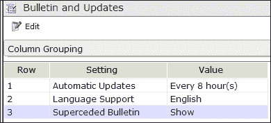

### 网络权限帐户

如第一章中*服务帐户*小节所解释的，*安装 VCM*，我们需要网络权限帐户。现在，我们将这些帐户与计算机组或域进行关联。

首先按照以下步骤操作：

1.  转到**管理** | **设置** | **网络权限**。

1.  现在我们有以下选项：

    **已识别的可用域**

    在安装 VCM 时，我们添加了域。请查看第一章中*安装 VCM – 两层部署*食谱的第 19 步，了解更多细节。

    **可用帐户**

    在 VCM 部署过程中，我们分配了一个网络权限帐户；请查看第一章中*安装 VCM – 两层部署*食谱的第 17 步，了解更多细节。

    **已分配帐户**

    对于这个食谱，我们将选择**已分配帐户**。

    为了能够在多个域中进行补丁修复，我们需要将可用帐户分配给可用的域或计算机组。为此，请转到**已分配帐户** | **按域** | **Active Directory**。

    以下截图展示了`study.local` Active Directory 域的已分配网络权限帐户：

    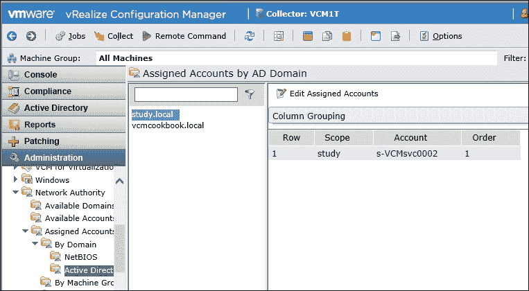

### 与微软同步补丁

一旦我们有了互联网连接（无论是直接连接还是通过代理），我们可以通过以下步骤与微软同步补丁元数据：

1.  转到**补丁管理** | **Windows** | **公告** | **按公告**并点击**检查更新**。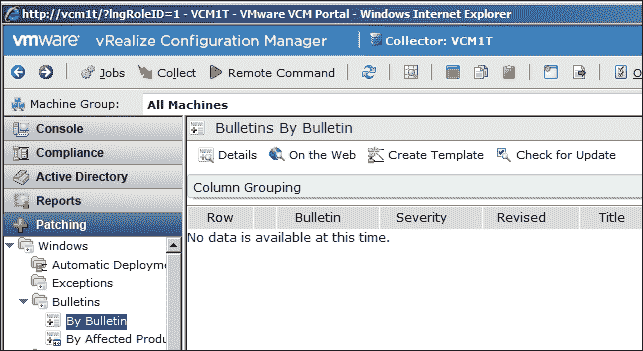

1.  要监控同步状态，请转到**补丁管理** | **作业管理** | **Windows** | **作业管理器** | **正在运行**。

1.  完成工作后，您可以查看**补丁管理** | **Windows** | **公告** | **按公告**下的公告，这些可以用来创建补丁评估模板。

现在，您可以在右侧查看补丁的详细信息：


在 VCM 的早期版本中，曾经有一个同步问题。即使同步完成，补丁也不可见。这里有一篇*知识库*文章提供了解决方法：[`kb.vmware.com/selfservice/microsites/search.do?language=en_US&cmd=displayKC&externalId=2053975`](http://kb.vmware.com/selfservice/microsites/search.do?language=en_US&cmd=displayKC&externalId=2053975)。幸运的是，在最新版本的 VCM 中，我们不需要做这个操作。

## 它是如何工作的...

我们正在进行必要的初始配置，以便 VCM 能够访问互联网，并同步补丁元数据，借此检查基础架构中的机器缺少哪些补丁，哪些补丁不需要。

VCM 中的代理配置用于补丁的同步和下载，一旦我们开始部署补丁，它们将从互联网下载到 Collector 服务器。

### 下载目录

默认下载目录是`X:\Program Files (x86)VMware\VCM\WebConsole\L1033\Files\SUM Downloads`。

该目录共享为`\\collector_name\cmfiles$\SUM Downloads`。

请注意，如果没有互联网连接，你必须手动获取补丁并将其存储在 VCM Collector 上的`\\collector_name\cmfiles$\SUM Downloads`目录中。

## 另见

+   更多关于网络权限账户的详细信息可以参考第二章中的*将网络权限账户添加到多个域中管理机器*一节，*配置 VCM 以管理基础设施*。

# 自动化补丁简介

完成准备工作后，我们将看看如何利用 VCM 自动填充特定机器组，以便它们可以按计划自动打补丁。正如本章介绍中所讨论的，如果你使用 vRealize Automation 和 vRealize Orchestrator 来部署新的虚拟机，你可以使用它们来创建一个注册表项，该项将在初始数据收集中被 VCM 捕获。根据该注册表项，单个虚拟机会被分配到相应的机器组，这些机器组将用于自动化补丁。

如果你没有使用自动化部署工具来创建注册表项，则必须每次部署新机器/服务器时，手动填充机器组。

## 准备工作

向 vRA 和 vRO 专家寻求帮助，他们将在门户上为用户提供请求机器的选项；否则，创建脚本，向管理机器添加所需的注册表项。

对于这个操作，我们将手动进行，以模拟整个过程。

## 如何操作...

使用 vRA 和 vRO 进行自动化补丁的说明不在本书的范围之内；有关此方面的内容，请联系你的 vRA 和 vRO 专家。

以下是可以用来添加注册表项的示例脚本。每行代表一个脚本，并将添加所需的注册表项：

```
REG ADD HKLM\Software\VCM-CookBook /v VCMPatchWindow /t REG_SZ /d "MW01" 
REG ADD HKLM\Software\VCM-CookBook /v VCMPatchWindow /t REG_SZ /d "MW02" 
REG ADD HKLM\Software\VCM-CookBook /v VCMPatchWindow /t REG_SZ /d "MW03" 
REG ADD HKLM\Software\VCM-CookBook /v VCMPatchWindow /t REG_SZ /d "MW04" 

```

您可以使用任何工具来执行此操作，或手动在每台机器上运行它们。我们已经在第二章中的*创建机器组*食谱里查看了如何使用它来创建机器组，*配置 VCM 以管理您的基础设施*。

## 工作原理...

它为我们提供了一个变量，该变量将用于在机器组中创建过滤器，然后，这些过滤器将确保相应机器组中的机器可以按计划进行补丁更新。要根据此捕获的注册表项创建机器组，请查看第二章中的*创建机器组*食谱，*配置 VCM 以管理您的基础设施*。

## 另请参见

+   如食谱中所述，请查看第二章中的*创建机器组*食谱，*配置 VCM 以管理您的基础设施*。

+   要设置计划的补丁更新，请参考本章后面的*Windows 补丁更新-计划*食谱

# 创建补丁评估模板

补丁评估模板基本上是将补丁按组排列的列表，例如，所有 Windows Server 2008 的补丁、某一特定月份的所有安全补丁，或所有 Windows 操作系统的安全更新。我们可以创建静态模板或动态模板。在静态模板中，我们手动选择补丁，而在动态模板中，我们根据补丁发布日期、补丁的严重性、产品等定义标准。

## 准备工作

在开始此操作之前，我们需要一个完全正常工作的 VCM 设置，并且按照*配置 VCM 以使用 Microsoft 更新*中提到的步骤进行操作。

## 如何操作...

您的任务是为 Windows 服务器实施组织的补丁策略，并且您的安全团队将每月测试并向您提供批准的补丁列表。您需要创建一个补丁模板，并确保所有服务器根据批准的补丁进行更新。

首先，您需要创建一个补丁模板并每月更新。由于您将获得批准的补丁列表，因此最好创建一个静态模板并每月添加补丁。

要创建补丁评估模板，请遵循以下过程：

1.  登录 VCM 后，转到**Patching** | **Windows** | **Assessment Template**，点击**Add**。这将启动向导。

1.  给模板命名，提供适当的描述，并根据需求选择**动态模板**或**静态模板**。

1.  在我们的案例中，我们需要选择**静态模板**。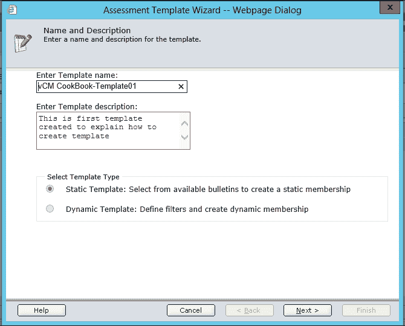

    +   对于**静态模板**，选择所需的补丁并保存模板。

    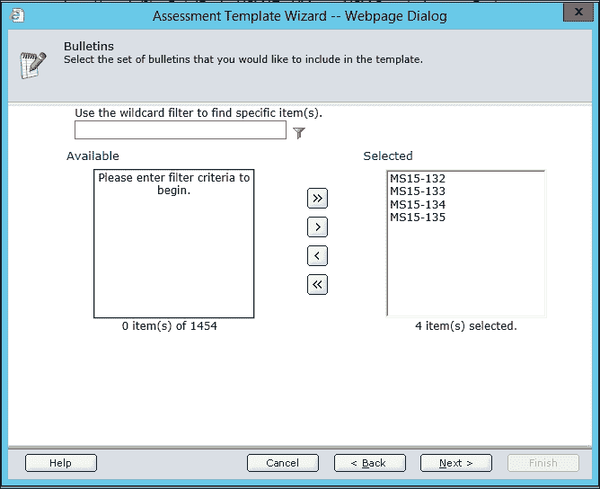

    +   对于**动态模板**，定义条件；VCM 将根据这些条件填充补丁。

    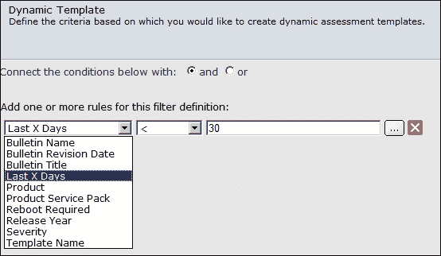

### 注意

请注意，一旦选择并保存了模板类型，就无法更改为另一种类型。

## 它是如何工作的……

在创建评估模板之前，我们不能部署补丁；这些模板将用于评估机器的状态，检查缺失的补丁，然后再进行部署。

如前所述，您可以创建一个动态的月度模板，用于评估并更新 vCenter 中的 Windows 模板，因为这些模板每月都会进行补丁更新，我们不需要通过一个庞大的长评估模板来评估它们。

我们可以创建一个大型评估模板，用于扫描和检查整个基础设施中的实时机器，并且只包括公司安全团队批准的补丁。

您需要注意，如果某些具有管理员权限的用户卸载了某个补丁，那么这个大型评估模板将派上用场，因为它会列出被卸载的补丁，然后 VCM 会重新安装该补丁。

这是不同模板类型的对比：

**动态模板**：此模板会根据我们在创建过程中提供的条件更新补丁列表。请参阅之前的截图：我们有选项根据**公告名称**或**过去 X 天**等参数来筛选补丁，这样我们就可以为当前月份准备一个月度评估模板；或者按严重性筛选，以便只包括安全补丁。

**静态模板**：此模板不会自动更新；管理员需要登录 VCM 来添加/移除列表中的补丁。如果您的安全团队每月发布批准的补丁列表，您可以创建一个主模板，并持续添加新的补丁，移除已被替代的补丁，并保持一个更新的评估模板以供部署使用。

每个模板在 VCM 数据库中都有一个唯一的 ID；如果我们创建一个模板，使用它进行部署，删除它，然后重新创建一个具有相同名称的模板，那么新创建的模板将被 VCM 视为不同的模板，并且不会自动在之前使用旧模板的部署中使用。

# Windows 补丁 – 按需

一旦补丁评估模板准备好，我们需要首先评估机器以查找缺失的补丁，然后使用该评估来为其打补丁。评估还将用于检查补丁合规性，形式为报告，我们将在本章末尾讨论。

## 准备就绪

我们需要将 VCM 服务器连接到互联网，并按照*配置 VCM 使用 Microsoft 更新*和*创建补丁评估模板*配方中的步骤进行配置。我们可以使用 VCM 创建的默认机器组，或根据需要创建新的机器组；该过程在第二章的*创建机器组*配方中进行了说明。

## 如何操作……

我们将使用刚才提到的食谱中列出的默认机器组，目前不创建任何新组。因此，我们将首先登录 VCM 并按照以下步骤操作：

1.  转到**补丁**|**Windows**|**评估模板**。

1.  选择评估模板，确保在顶部选择了正确的机器组（机器组用于筛选选择的机器，而不是显示 VCM 管理的所有机器）。

1.  如果你点击数据网格，你将能够查看所有已安装 VCM 代理并且属于选定机器组的机器的状态。如果**数据年龄**为**N/A**，那么我们需要对这些机器执行数据收集。以下截图显示了`dc01`机器的**建议补丁**值为**必须重新评估 - 评估运行后添加的机器**：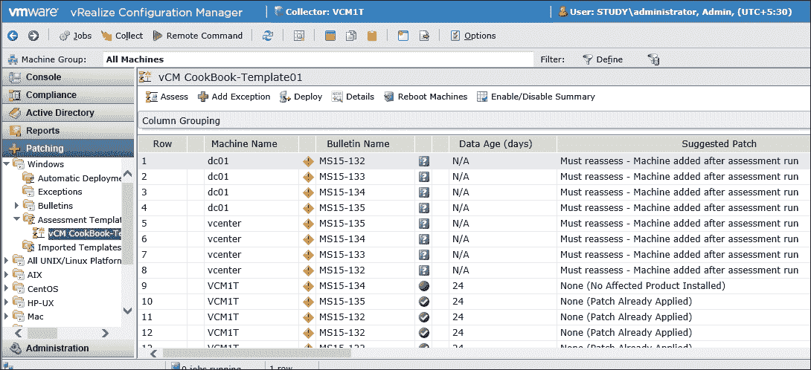

1.  只需选择机器并点击左上角的**收集**。这将启动一个向导；确保所有必需的机器都位于右侧的**已选择**框中。

1.  选择**选择一个要应用于这些机器的收集过滤器集**，并**不限制收集仅为增量**；任何优先级都可以，选择默认即可。

1.  在**过滤器集**下，选择**补丁 - Windows 安全公告**。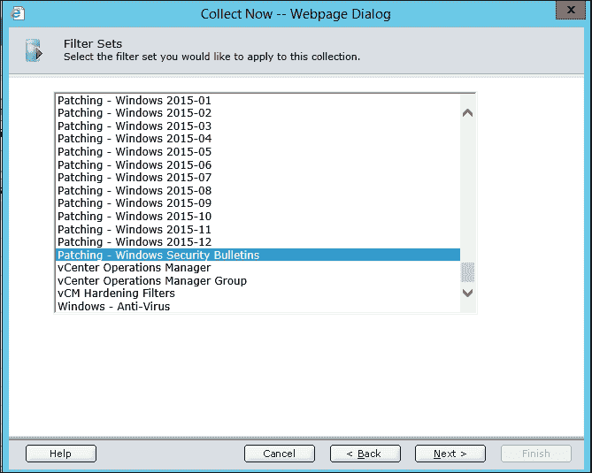

    确保任务成功完成；添加详细信息到 VCM 数据库将需要 10 分钟时间。

1.  收集完成后，点击**评估**。这将检查每台机器的补丁状态。评估模板的内容将与管理的机器的补丁状态进行对比。然后，将展示缺失或已安装补丁的详细结果。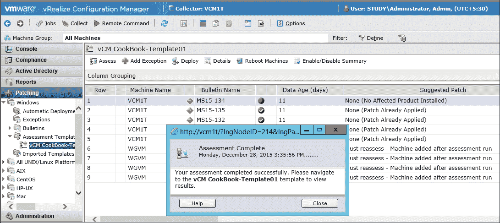

1.  评估完成后，你将看到如**安装缺失的补丁**或**未安装受影响的产品**等选项。要安装缺失的补丁，请选择它们并点击**部署**。这将再次启动一个向导。

1.  在第一页，选择你要部署的补丁。

1.  在下一步中，它将尝试查找补丁的位置。它会报告补丁是否找到，并包括公告编号：

    +   ***在收集器上找到***：Windows 补丁文件已在下载目录中找到。

    +   **在互联网上找到**：Windows 补丁文件已在下载站点找到并且必须下载。

    +   **未找到**：在收集器或互联网中未找到 Windows 补丁文件。

1.  在安装之前，我们需要先下载补丁，因此请选择**立即下载**：

    +   ***运行时下载***：这将在部署补丁时，将补丁下载到默认的下载目录或备用的本地补丁路径。由于部署可以安排定时执行，因此你可以在网络负载较轻时运行部署并下载文件。

    +   ***立即下载***：这会将补丁文件立即拉取到默认下载目录或备用的本地补丁路径中。根据网络负载和要下载的文件数量，你可以立即下载补丁文件。

1.  由于这是按需补丁，选择 **在部署期间将补丁复制到目标机器** 和 **立即运行操作**。 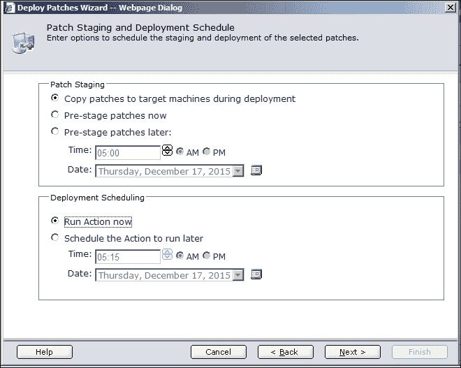

1.  根据需要选择 **重启选项**。 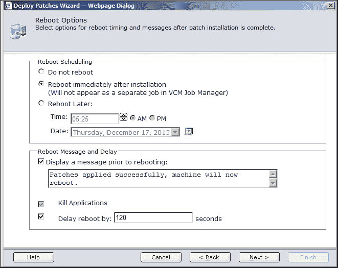

1.  下载补丁后，部署将开始。

    部署过程可以在 **Patching** | **Job Management** | **Windows** | **Job Manager** | **Running** 中监控。

    

1.  一旦补丁部署到目标机器上，它将显示如下消息：


在我们启动部署后，可能需要监控其进展。为此，请点击 VCM 控制台中的 **Jobs**，然后跟踪 **Patching** 任务。一旦补丁部署完成，我们需要检查 VCM 控制台中的状态更新，也就是说，在 **Suggested Patch** 下，它之前显示了 **Install the Patch**，现在应该显示 **None (Patch Already Applied)**。为此，返回 **Patching** | **Windows** | **Assessment Template** | <你在开始时使用的补丁模板> 并开始收集。一旦收集完成，执行评估（点击顶部菜单中的 **Assess**），刷新后将显示你想要的结果，即受管机器的状态——无论补丁是否已部署，机器是否失败，或仍在等待重启（如果没有，请在部署补丁时设置重启）。

以下截图展示了在补丁部署、重启和数据收集后的受管机器上运行评估的状态：


### 注意

请注意，VCM 会运行 **Job Summary: Patching Automated Collection - Patching - Windows Security Bulletins** 在补丁部署后进行收集，但有时运行该收集会花费一些时间。我们可以像开始时一样运行收集，并进行评估。

## 工作原理...

在初步评估后，VCM 根据服务器上缺少的补丁，给出建议的补丁安装建议，例如安装缺失的补丁。你可以选择安装这些缺失的补丁。现在，VCM 会尝试查找补丁是否可以在 Collector 服务器上获取——已下载用于在其他服务器上安装——或者是否可以从互联网获取；这时代理配置就显得特别有用。如果 Collector 服务器上没有这个补丁，它会提供下载补丁的选项。

一旦修补程序下载完成，它会在管理机器上进行修补准备并开始安装。安装完毕后，如果修补程序需要重启，根据我们选择的选项，服务器将会重启。重启完成后，系统会执行修补后的数据收集，并将安装状态更新到 VCM。如果我们在修补和数据收集后进行另一次评估，我们可以检查修补程序的当前状态：它必须已经安装。

# Windows 修补 - 已安排

在之前的操作中，我们按需部署了修补程序，并发现我们需要执行一些任务才能完成工作。我们无法每次都站在服务器前执行按需修补程序，因此，我们可以做的是安排修补程序的部署。因为评估仅针对 VCM 数据库中的数据运行，我们必须在进行评估之前和之后收集管理机器的修补数据。

## 准备中

我们需要一台具备 Internet 连接的 VCM 服务器，并且已经完成了早期的配置，如*为 Windows 修补配置 VCM*和*创建修补评估模板*。对于定时修补，建议在开始之前先创建机器组。

## 如何操作...

正如在之前的操作中看到的，我们需要遵循四个步骤才能完全执行修补任务；因此，我们将为一个修补维护窗口安排四个任务。

任务安排如下：

+   **初始收集**：在修补程序之前从机器收集修补状态数据

+   **初步评估**：在修补程序之前，将收集到的数据与评估模板进行比较

+   **部署修补程序**：根据计划安装修补程序

+   **最终评估**：在修补程序之后，将收集到的数据与评估模板进行比较

这是一个计划的时间表，具体如下：

| **序号** | **名称** | **时间安排** | **原因** |
| --- | --- | --- | --- |
| **1** | 初始收集 | 每月第一个星期天早上 08:00 | 实际修补程序前 12 小时 |
| **2** | 初步评估 | 每月第一个星期天下午 02:00 | 实际修补程序前 6 小时 |
| **3** | 部署修补程序 | 每月第一个星期天晚上 08:00 | 定时修补维护窗口 |
| **4** | 最终评估 | 每月第一个星期天晚上 11:00 | 修补后 3 小时，以便进行自动化收集（发生在修补和重启后 30 分钟） |

### 初始收集

我们无法安装修补程序，除非 VCM 知道是否需要它；在初始收集中，我们将使用这些信息更新 VCM 数据库。VCM 创建一个名为**修补 - Windows 安全公告**的过滤器集，并在每次 Microsoft 发布新修补程序后更新该过滤器。

在这个示例中，我们将使用一个名为`VCM-CookBook-MW01`的机器组，这是我们为本演示创建的。

按照以下步骤开始自动化 Windows 修补部署配置：

1.  要执行初始收集，我们需要以管理员权限登录到 VCM，进入**管理** | **任务管理器** | **已安排**，点击**添加**，然后选择**收集**。

1.  提供合适的名称并添加描述。

1.  确保选择**补丁管理 - Windows 安全公告**作为**筛选集**。

1.  选择正确的机器组以便进行此计划的维护窗口。

1.  提供与本配方开始时表格中描述的相符的时间表。

一旦按照要求的筛选集安排了初始数据收集，我们可以进入下一个步骤，初始评估。

### 初始评估

初始评估涉及检查前一步收集的数据中，机器上补丁的状态。我们给 VCM 六个小时的时间来从所有机器上正确收集数据，因此，此任务可以在初始数据收集后的六小时内，和实际补丁时间前的六小时内安排。请按照以下步骤进行：

1.  导航到**补丁管理** | **任务管理** | **Windows** | **已安排** | **评估**，然后点击**添加**。

1.  提供与维护窗口相关的合适任务名称和描述。

1.  选择正确的模板。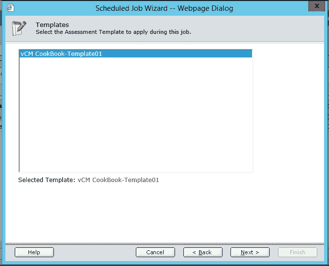

1.  选择相关的机器组。

1.  选择合适的时间表，如本配方开始时所讨论的。

### 部署补丁

此时，VCM 服务器已经知道哪些补丁在属于该机器组的机器上缺失，现在我们可以通过以下步骤安排实际的补丁部署任务：

1.  导航到**补丁管理** | **Windows** | **自动部署**。点击**添加**。

1.  选择与维护窗口相应的正确机器组。

1.  选择所需的评估模板。

1.  在此页面上，选择**计划的自动部署** **运行**，如果公司的政策允许，选择**部署后立即重启**。

1.  对于**阈值数据年龄**，我们可以使用默认值`2`，因为我们已经安排了任务来收集数据并在实际补丁时间前 12 小时进行评估。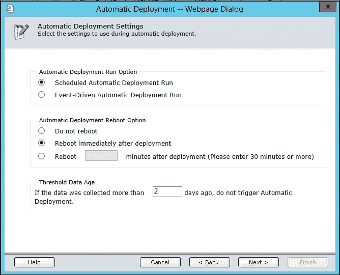

1.  最后，选择我们在本配方开始时决定的时间表，并点击**下一步**。

1.  第三步完成后，我们点击**确定**。

### 最终评估

到目前为止，我们已经计划了数据收集和评估，并完成了实际的补丁安装。现在，我们将安排一个任务，使用这些更新来更新 VCM 数据库。在前面的步骤中，我们了解到，在执行补丁部署后，当机器重启时，VCM 会启动数据收集任务，收集补丁安装后的机器详细信息。因此，我们只需要按照最初评估步骤中所做的方式安排评估任务；只需确保名称和描述表明这是最终评估，并且它被安排在补丁安装后的某个时间（如开始时决定的 3 小时后），以便给 VCM 服务器一些时间完成任务。按照以下步骤操作：

1.  导航到**补丁管理** | **作业管理** | **Windows** | **已计划** | **评估**，然后点击**添加**。

1.  提供一个与维护窗口相关的适当作业名称以及合适的描述。

1.  选择正确的模板。

1.  选择关联的机器组。

1.  选择合适的计划，正如开始时所讨论的那样。

完成最终评估后，VCM 将更新用户界面上的当前详细信息并生成报告。

## 它是如何工作的……

这让负责补丁管理的管理员的工作变得轻松许多。所有补丁管理所需的活动都可以被计划，这样管理员就不需要一直坐在 VCM 控制台前手动推送补丁。

我们计划了初始数据收集，使用了**补丁管理 - Windows 安全公告**筛选集，确保我们在 VCM 数据库中拥有托管服务器的最新详细信息。根据收集的数据，我们进行了初步评估。此评估会检查补丁模板并为我们提供补丁需求信息。

接下来，如果收集服务器缺少补丁，它会从互联网下载实际的补丁，并将其阶段性地安装到托管的机器上。一旦时间合适，VCM 代理就会安装补丁，并根据配置执行重启操作。补丁安装完成后，VCM 会使用相同的筛选集重新启动数据收集，筛选集为**补丁管理 - Windows 安全公告**，但这一次，我们会得到更新后的详细信息，因为补丁已安装。

这些更新的信息会添加到 VCM 数据库中，并在最终评估中使用，以获取当前补丁的状态。

## 还有更多……

除了常规选项外，如果您计划管理中到大型基础设施，还应该注意一些附加设置。

以下是配置基础设施所需的详细信息。您需要以 VCM 管理员权限登录，并进入**管理** | **常规设置** | **补丁管理** | **Windows** | **附加设置**。

| **序号** | **设置** | **说明** |
| --- | --- | --- |
| **1** | 自动补丁部署 - 阈值数据年龄（天） | 此项设置自动补丁部署的触发条件，基于阈值数据年龄。当补丁公告的数据年龄大于阈值时，VCM 不会部署补丁。要更新补丁公告的数据年龄，必须运行新的收集和评估。默认值为`2`天，必要时可以修改。 |
| **2** | 整个补丁部署作业的超时时间（分钟） | 运行补丁部署作业的时间，直到进程超时。默认值为`60`；如果你一次性修补大量机器，则需要将此值更改为更高的值，例如`120`或`180`，具体取决于机器数量和批准的维护窗口。 |
| **3** | 执行补丁后收集前的等待时间（分钟） | 这决定了补丁部署完成后，VCM 在从重启的托管机器收集补丁状态数据之前等待的时间。默认值为`30`分钟；如果你觉得这个时间太长或太短，可以进行更改。 |

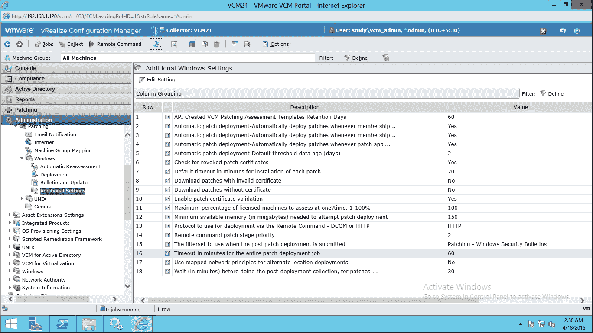

你需要以 VCM 管理员权限登录，并进入**管理** | **常规设置** | **补丁** | **Windows** | **部署**。

将最大并发代理安装的值从`21`更改为更高的值。

如果在附加设置中你选择了`60`分钟作为整个补丁部署作业的超时时间，并且将最大并发设置为默认的`21`，那么如果你有一个非常大的评估模板，一些机器可能会超时而未部署补丁。这可能会造成问题，因为一个月后可能会有一些机器没有补丁。

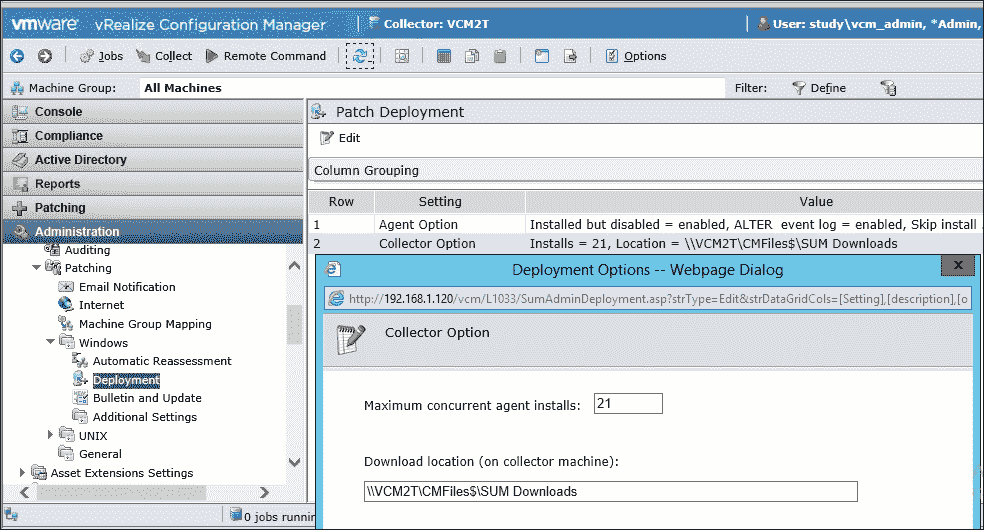

# 在多域环境和工作组中修补机器

通常，在中型到大型的组织中，会存在多个 Active Directory 域。我们可以使用 VCM 修补多个域中的服务器。以下是你需要做的步骤。

除了多个域外，还有一些机器不属于任何域，或者它们在工作组中。要管理和修补工作组中的机器，你需要为机器组分配一个网络权限帐户，该机器组中包含位于工作组中的机器。

## 准备工作

我们需要遵循第二章中*将网络权限帐户添加到管理多个域中的机器*的流程，*配置 VCM 以管理你的基础设施*，并为修补多域服务器提供正确的域及其相应的 NAA 帐户。

为了修补工作组中的机器，我们需要创建一个具有静态成员资格的机器组，并将所有不在域中的机器添加到该组。

在 VCM 服务器和托管服务器之间打开必要的端口，无论是在工作组中还是在其他域中。

## 如何操作...

我们将以两种方式接近此方法：

首先，我们将讨论多个域。

我们需要做的第一件事是根据第二章的*将网络权限帐户添加到多个域中管理机器* 配方配置所有所需的**网络访问帐户**（**NAA**）帐户，*配置 VCM 管理您的基础设施*。

然后，您可以按需从本章的*Windows 补丁-按需* 配方进行补丁，或者按计划进行的*Windows 补丁-定期* 配方进行补丁。

第二种方法适用于工作组服务器。

我们需要添加一个带有`.`（点）域和用户名及密码通用于工作组机器的可用帐户。按照以下步骤进行：

1.  转到**管理** | **设置** | **网络权限**，在**可用帐户**下点击**添加**。

1.  添加帐户后，我们需要将其与为工作组机器创建的机器组关联。

1.  如果没有通用帐户可用，则可以按以下格式为每台服务器添加一个帐户。在这里，**域**是机器的名称：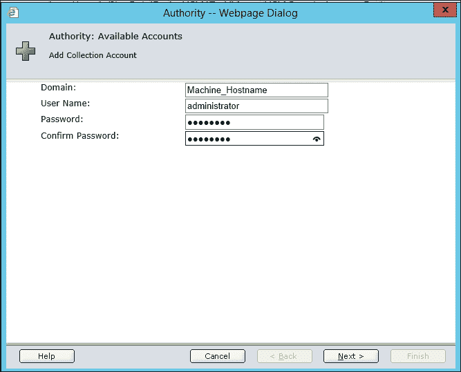

1.  现在，转到**按机器组分配的帐户**，为工作组机器选择一个机器组，并分配先前添加的帐户。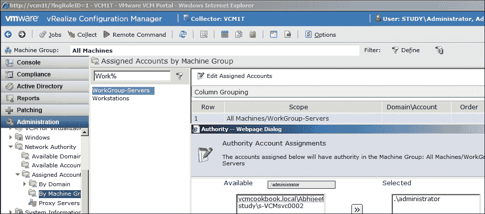

如前面的配方所述，VCM 尝试所有帐户，直到找到一个有效帐户；将所有帐户分配给机器组没有问题。

### 注意

请注意，我们不能有多个具有相同帐户名和域的帐户，因此对于`.`（点）域，我们不能在可用帐户中注册超过一个管理员作为用户。

还有另一种选择：如果出于某种原因，您不希望将所有帐户分配给机器组，可以创建网络权限帐户，然后为每台机器分配一个帐户，并确保在添加可用帐户时，将域定义为机器名称。

1.  一旦添加了所需的帐户，进入**管理** | **授权机器** | **授权的 Windows 机器**。

1.  选择需要更改网络权限帐户的机器；在菜单中点击符号，将启动向导。

1.  确保我们要更改其 NAA 的机器在**选定**下是可用的。

1.  选择此机器的关联网络权限帐户。

1.  点击**下一步**，然后完成向导。

1.  为确保帐户已正确更改，请向右滚动，并在**网络权限**列下验证该机器。

完成此更改后，我们可以通过 VCM 成功管理机器，包括数据收集、软件和补丁安装以及合规性检查和强制执行。

然后，您可以根据需求选择*按需进行 Windows 补丁*或*定时进行 Windows 补丁*的方法。

## 工作原理...

定义的网络授权帐户将被 VCM 用于管理工作组中机器的补丁。

# 对 VM 模板进行补丁

当 VM 首次创建时，使用的虚拟机模板必须是最新的。这将减少 VM 最终用户进行补丁时的停机时间，并减少系统范围内的漏洞。

## 如何操作...

按照以下步骤对 VM 模板进行补丁：

1.  要对 VM 模板进行补丁，将其转换为 VM，提供 IP，并确保能够访问 VCM 服务器。

    每个模板上都应该有代理安装程序可用。

1.  一旦代理程序安装完成，请在 VCM 中为机器许可证并进行收集。

1.  机器应该作为**模板补丁**的一部分进行管理。执行按需补丁。

1.  安装补丁并重新启动 VM 并由 VCM 验证补丁状态后，卸载代理。

1.  在 VCM 中清除 VM。

1.  将 VM 转换回模板。

## 工作原理

这是一个完全手动的过程，我们将模板转换成虚拟机，安装代理，然后安装补丁。补丁完成后，在卸载代理并最终将机器转换为 vCenter 模板后，我们从 VCM 控制台清除该机器。

# 补丁报告

基础设施补丁完成后，我们需要一些精美的报告来向管理层展示我们在补丁方面的绿色情况。在报告方面，VCM 不会让您失望——有多个预配置报告可供选择，可以定期或按需运行，并导出到多种格式，如`.xls`、`.doc`、`.csv`和`.pdf`。

## 准备工作

在进行操作之前，我们必须准备一个合规性模板。

## 如何操作...

登录 VCM 后，转到报告部分是必要的。

1.  导航至**报告** | **机器组报告** | **VCM 补丁**。

    这些是 VCM 用于 Windows 补丁的默认报告：

    | **序号** | **名称** | **描述** |
    | --- | --- | --- |
    | **1** | 基于 VCM 补丁评估的 VCM 补丁评估 | 这些报告使用由 VCM 补丁评估（在 VCM 补丁滑块上）生成的数据来生成其补丁状态结果 |
    | **2** | 补丁状态摘要 | 显示企业范围内 Windows 和 Unix 的补丁状态 |
    | **3** | VCVP Windows 补丁状态详细信息 | 显示虚拟化机器的 Windows 补丁状态详细信息 |
    | **4** | 按公告信息进行 Windows 补丁评估 | 这使得可以通过公告信息对 VCM 进行补丁修复 |
    | **5** | Windows 产品信息补丁评估 | 这使得通过产品信息对 VCM 进行补丁修复成为可能。 |
    | **6** | Windows 补丁评估结果详细信息 | 这显示按机器、通告或模板分组的 VCM 补丁评估详细信息 |
    | **7** | 按通告显示的 Windows 补丁评估结果详细信息 | 这显示按通告分组的 Windows 补丁评估结果详细信息 |
    | **8** | 按机器显示的 Windows 补丁评估结果详细信息 | 这显示按机器分组的 Windows 补丁评估结果详细信息 |
    | **9** | 按模板显示的 Windows 补丁评估结果详细信息 | 这显示按模板分组的 Windows 补丁评估结果详细信息 |
    | **10** | 按模板显示的 Windows 补丁评估结果趋势 | 这显示按天、周、月或季度的 VCM 补丁评估模板趋势 |
    | **11** | Windows 补丁评估趋势 | 这显示按天、周、月或季度的 VCM 补丁评估趋势 |
    | **12** | Windows 补丁状态 | 这显示 Windows 补丁状态 |
    | **13** | 按模板显示的 Windows 补丁状态详细信息 | 这提供按模板分组的 VCM 补丁状态详细信息 |
    | **14** | 按模板显示的 Windows 补丁状态概述 | 这提供按模板分组的 VCM 补丁状态概述 |
    | **15** | Windows 补丁状态详细信息 | 这提供 Windows 补丁状态的详细信息 |

1.  从 VCM 控制台中，选择你要运行的报告，并点击 **运行**；向导将开始。一旦填充了详细信息，它将显示报告。如前所述，报告可以导出为多种格式供管理员使用。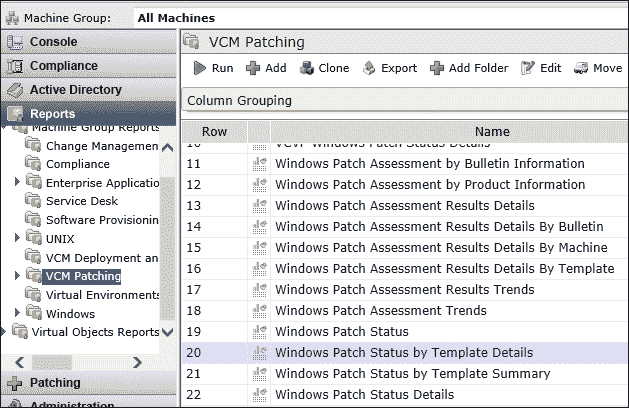

1.  我们需要记住的一个重要点是顶部的机器组选择；这会筛选出将包含在报告中的机器。

1.  我们也可以安排报告的生成。我们将在 第八章中的*调度报告*配方里介绍更多细节，*与 vROps 的集成和调度*。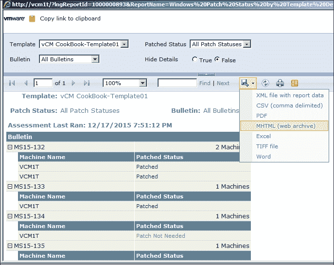

## 它是如何工作的...

这里有一个很大的现有报告列表，我们可以运行并导出这些报告。我们甚至可以安排这些报告的定期生成，然后，它们可以被导出到指定位置，或者如果配置了有效的 SMTP 邮件服务，还可以发送到指定的电子邮件地址。

## 还有更多...

你可以查看 第八章中的*调度补丁报告*配方，了解如何调度报告，*与 vROps 的集成和调度*。
