# 第五章：Windows 软件配置

在本章中，我们将涵盖以下内容：

+   在 Windows 上安装软件仓库

+   在代理上部署附加组件

+   创建软件包

+   将软件包发布到仓库

+   向 VCM 添加仓库

+   向包管理器添加仓库源

+   部署软件包

# 介绍

VCM 的软件配置提供了用于创建和管理软件包的工具、资源和机制，以便最终将软件安装到受管机器上。VCM 的软件分发仅适用于 Windows，而不支持其他操作系统。

在本章中，我们将介绍软件配置的概述，并讲解通过 VCM 在受管机器上安装软件所需的步骤。

软件配置是一个过程，通过该过程我们可以创建软件包，将这些包发布到仓库，然后将其安装到目标机器上。

为支持配置过程，VCM 的软件配置组件包括以下内容：

+   软件包仓库

+   包管理器

+   VMware vCenter 配置管理器 Package Studio

## Windows 软件仓库

Windows 软件仓库是一个共享位置，软件包由**Package Studio**发布到该位置，并且包管理器从该位置下载软件包以便进行安装。

## Windows 的包管理器

包管理器是安装在每台机器上的应用程序，用于管理软件包中软件的安装和卸载。包管理器配置为使用一个或多个仓库作为包的来源。

该图展示了 VCM 收集器服务器、软件仓库和包管理器实例之间的关系：


### 注意

这些定义和图表摘自 vCenter 配置管理器管理指南（[`www.vmware.com/pdf/vcenter-configuration-manager-57-administration-guide.pdf`](http://www.vmware.com/pdf/vcenter-configuration-manager-57-administration-guide.pdf)）。

## VMware vCenter 配置管理器 Package Studio

Package Studio 是用于构建软件包以便在目标 Windows 服务器和工作站上安装的应用程序。

软件包提供了安装和卸载程序所需的文件和元数据。软件包的一个重要功能是关于依赖关系、冲突和其他关系的元数据，这些内容在软件安装文件中没有体现。此元数据用于确定是否具备必要的依赖项，以确保安装成功；如果没有，元数据会说明为使安装成功所需的内容。

在软件包创建并准备分发后，它会被发布到软件仓库。然后我们使用包管理器将软件包从仓库下载到本地机器，并在 Windows 系统上安装它。

# 在 Windows 上安装软件仓库

软件仓库至少在基础设施中的一台 Windows 机器上安装，Package Studio 需要安装在同一台机器上，并且仓库必须先于 Package Studio 安装。

## 准备工作

由于仓库默认安装在 Collector 服务器上，如果我们需要另一个仓库，则需要安装另一台带有 IIS 的 Windows 服务器。IIS 的要求与 Collector 服务器中提到的相同，请参见第一章，*安装 VCM*，以及*准备 VCM 部署——安装和配置 IIS*食谱。

## 如何操作...

要在其他服务器上部署软件仓库，请按照此流程操作：

1.  首先，我们在以下位置找到`Repository.msi`：

    ```
     X:\Program Files (x86)\VMware\VCM\AgentFiles\Products (on the VCM 
           collector Server) 

    ```

1.  当我们双击`Repository.msi`文件时，它会启动向导，接受最终用户许可协议（EULA）并选择安装位置后，它会要求你提供一个虚拟目录：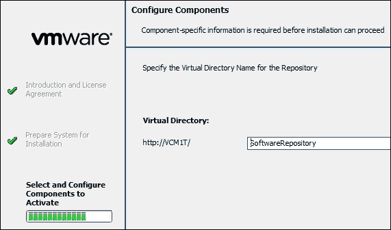

    我们可以选择使用默认名称或更改名称。

1.  按照向导完成安装。

## 它是如何工作的...

仓库由 Package Studio 用于存储创建的软件包，这些包将用于配置管理机器。我们可以创建多个仓库并将其靠近管理机器，以避免通过广域网（WAN）消耗带宽；此外，本地配置会更快。

由于仓库将用于存储安装程序，因此需要提供足够的磁盘空间，具体取决于你计划分发的应用程序数量和类型。它就像一个文件服务器，所有 VCM 管理的机器将从这里复制软件包并进行安装。具有两个 vCPU 和 8GB 内存的服务器应该足以满足专用软件仓库的需求。

# 在代理上部署附加组件

软件包管理器安装在目标机器上，负责管理软件包的安装。它不包含软件包，而是包含指向其所知仓库源中软件包的指针。当被指示进行安装时，软件包会从仓库复制到目标机器上的`cratecache`文件夹中。软件包管理器将文件解压到`%TMP%`目录，并运行配置的安装程序。

### 注意

这适用于 VCM 5.7.3 或更早版本；如果你已经使用 5.8.0 或更高版本，请忽略此部分。

## 准备工作

对于此食谱，我们需要一个正在运行的 VCM 服务器和安装了 VCM 代理的管理机器。

## 如何操作...

我们将按照以下流程检查代理扩展是否已安装。如果没有安装，我们将进行安装。

这仅适用于 VCM 5.7.3 或更早版本。步骤如下：

1.  登录到 VCM 并具有管理员权限后，进入**管理** | **机器管理器** | **许可机器** | **许可的 Windows 机器**。

1.  在数据表格中，找到你正在验证所需代理扩展存在性的机器，并验证**代理扩展.用于提供版本**列是否包含 5.3 或更高版本的值。

1.  你需要向右滚动才能看到**代理扩展.用于提供版本**列：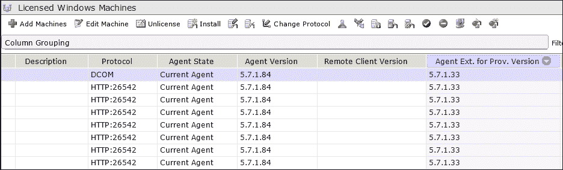

1.  如果没有，你需要从 VCM 控制台安装或升级 VCM 代理。请参阅第七章中的*升级 VCM 代理*教程，*VCM 维护*。

## 它是如何工作的...

用于提供的代理扩展必须安装在我们需要提供软件的受管机器上。通过遵循此过程，我们确保它们已经安装，如果缺失，我们将采取必要的措施来安装它们。

### 注意

请注意，包管理器是在目标机器上安装的，而 VCM 代理版本 5.3 或更高版本*是从 Collector 安装的*。

# 创建软件包

Package Studio 是用于构建安装包，以便在由 VCM 管理的目标 Windows 计算机上安装的软件包应用程序。

### 注意

请注意，我们想要为其创建包的软件必须能够在没有用户交互的情况下安装和卸载。这被称为**静默安装**。通常使用命令行选项。

## 准备就绪

在我们开始之前，我们需要一个完全安装的 VCM 服务器和安装好的包管理工具，以便创建包。

## 如何操作...

在本教程中，我们将为从[`www.rarlab.com`](http://www.rarlab.com/)下载的`WinRAR.exe`创建一个包。

要这样做，请按照以下步骤操作。

启动 VMware vCenter 配置管理器 Package Studio。转到**开始** | **VMware vCenter 配置管理器** | **Package Studio**。

### 注意

请注意，在 Windows 2008 服务器上运行 Package Studio 时，我们必须以管理员身份运行该应用程序。

点击**管理包**，并根据以下选项卡中的选项配置包内容：

1.  点击**属性**，输入**名称**、**版本**和**描述**，并选择**架构**。这些字段是必需的。你可以根据需求更新其他字段：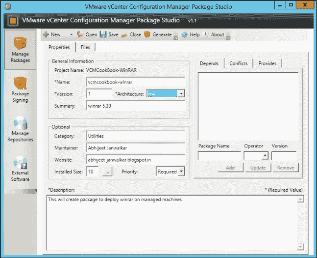

1.  点击**文件**，导入安装文件，并按如下方式配置命令：

    1.  点击**选择文件夹**，然后进入安装程序所在的位置。

    1.  点击**导入**文件。

    1.  点击**设置命令**，然后在**命令**文本框中，命令将被创建。在我们的例子中，它将是`winrar-x64-530.exe`。

    提供任何额外的参数；在这种情况下，`/s`用于静默安装 winrar。

    你可以从你尝试安装的软件供应商那里获取所需的选项，或者可以访问像[www.itninja.com](http://www.itninja.com/)这样的站点。

    请参考[`www.itninja.com/question/what-switches-to-use-with-exe-files-in-silent-mode`](http://www.itninja.com/question/what-switches-to-use-with-exe-files-in-silent-mode)上的博客。

1.  我们有两个选项：**安装**或**移除**。在这种情况下，我们将选择**安装**：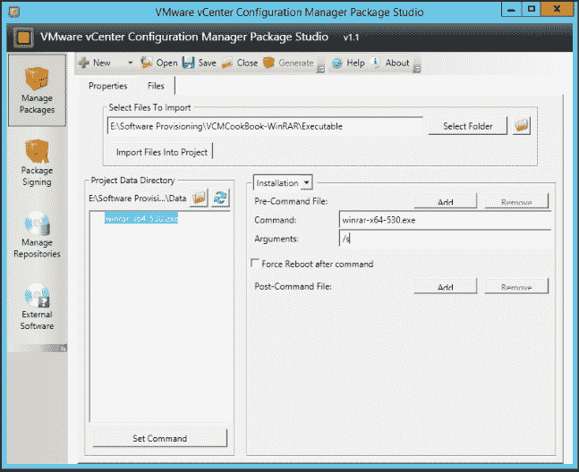

1.  点击**保存**以保存项目文件，以便在需要时我们可以返回并编辑它：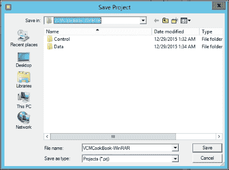

1.  点击**生成**；这将生成一个`.crate`文件，用于在托管机器上提供 winrar：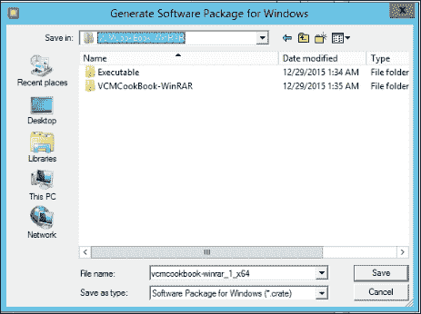

这就是我们如何创建一个可以用于供应的软件包。

## 它是如何工作的...

通过这个配方，我们可以创建一个 VCM 识别的软件包（`.crate`格式），该包会发布到多个仓库，然后由托管机器上的 VCM 代理下载并处理，以安装实际的软件。

# 将软件包发布到仓库

在前一个配方中，我们创建了一个`.crate`格式的软件包。接下来的第一步是将包分发到仓库，并从那里分发到托管机器的临时文件夹，以进行安装。

现在，我们将把在之前配方中创建的包发布到仓库，以便进行进一步处理。

## 准备就绪

我们需要在包管理器中创建一个包，比如在之前的配方中创建的那个包，并且需要按照*在 Windows 上安装软件仓库*配方中的步骤安装一个仓库，才能完成这个配方。

## 如何操作...

我们可以从前一个配方中继续操作，或者重新启动包管理器并打开之前创建的项目文件。

按照以下步骤将包发布到你的仓库：

1.  点击左侧的**管理仓库**按钮。进入**仓库**页面后，点击**添加平台**。基本上，这是我们可以确定哪个包放入哪个文件夹的方式。这些平台和部分会分配给托管的机器（或在以下配方中提到的软件包管理器）。

    我们可以创建多个平台，比如 Windows Server 2008 或 Windows Server 2012：

    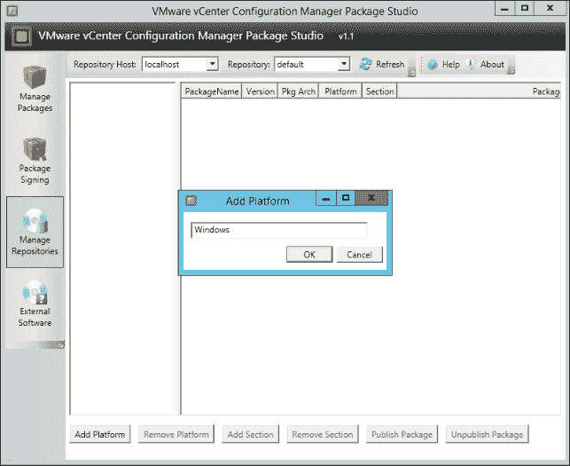

1.  每个平台有多个部分；我们可以添加任意数量的部分，并按照需要命名。建议你将它们命名为 x86 和 x64，以便相应地分类你的软件：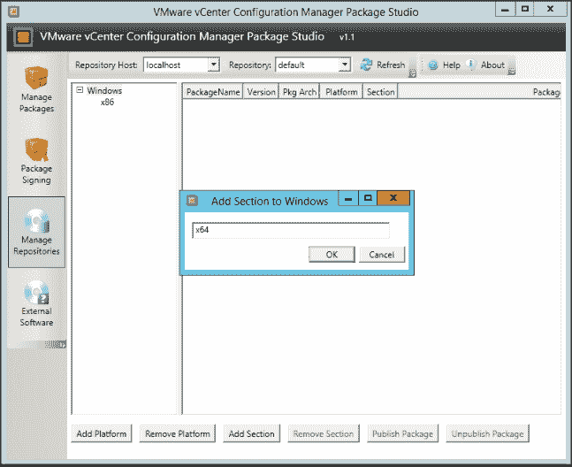

1.  一旦添加了各个部分，选择适当的部分——`x86`或`x64`——然后点击**发布包**。浏览到`.crate`文件的位置并选择它：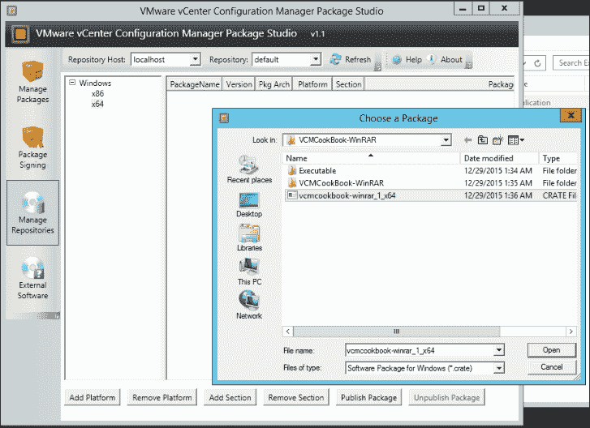

1.  选择部分(s)：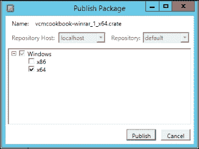

1.  我们现在准备好了：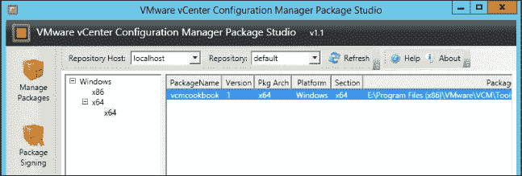

你可以通过以下方式之一或两者来检查包是否已发布：

1.  转到`X:\Program Files(x86)\VMware\VCM\Tools\Repository\Crates\`。

    您将找到一个单字母名称的文件夹。该字母将是我们 `.crate` 文件的首字母。

    在那里，您会找到一个准备好部署的 `.crate` 文件：

    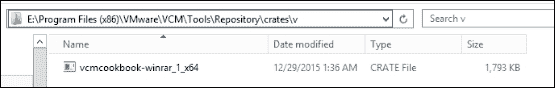

1.  在 Internet Explorer 中，访问 `http://<Repository Server name/ IP>/SoftwareRepository/Crates/X`。

    再次强调，*X* 是一个字母，它是 `.crate` 文件名的首字母。

    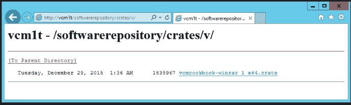

## 如何操作...

在此操作中，VCM 将 `.crate` 文件复制到仓库服务器的正确位置，以便包管理器在尝试部署已发布的软件包时可以访问它们。

**关于平台**：平台值可用于定义软件包可以安装的操作系统架构。我们可以创建并使用平台来帮助管理基于操作系统平台的软件包分发。当我们使用更高层次的特定性时，结果是更小的包群，并提高了安装哪些软件包的可预测性。

**关于章节**：章节用于进一步细化每个平台上软件包的组织方式。它们用于指定包管理器的仓库源，允许我们控制哪些软件包对哪些机器可用。如何使用章节可以根据您的特定业务需求进行调整。以下是使用章节的一些示例：

+   **业务线组**：市场营销、销售、人力资源部门和工程部门

+   **开发状态**：开发、验收和生产

+   **IT 软件管理结构**：软件发布者、部门和业务组

# 将仓库添加到 VCM

一旦软件包被创建并发布到仓库中，我们需要将仓库分配给受管机器，以便它们能够下载并安装该软件包。

要查看 VCM 中的软件包和包管理器信息，我们必须从受管机器收集包管理器数据。

## 准备就绪

我们需要准备好安装了包管理器的代理，也就是说，我们需要按照 *在代理上部署附加组件* 这一操作步骤进行，并且仓库应根据之前的步骤发布我们计划部署的软件。

## 如何操作...

这是一个两步过程。在第一步中，我们将收集所有需要安装软件的受管机器的数据并检查它们的状态；在第二步中，我们将收集来自仓库服务器的数据，检查哪些软件包可供部署。

### 收集软件部署包管理器数据

我们需要在所有需要部署软件且已安装包管理器的机器上运行此操作。按照以下步骤收集数据：

1.  一旦以管理员身份登录 VCM，点击 VCM 控制台左上角的 **收集**：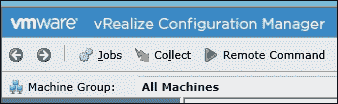

1.  这将启动向导；选择**机器数据**，在下一步中，选择所有需要收集详细信息的机器。

1.  在**数据类型**下，确保已选择**软件配置 - 包管理器**：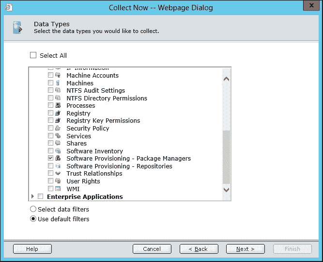

    确保没有冲突，并让任务完成。

1.  你可以前往**管理 | 任务管理器 | 历史记录 | 即时收集 | 过去 24 小时**，查看任务状态。它应该是成功的。你可以点击**查看详情**查看更多信息：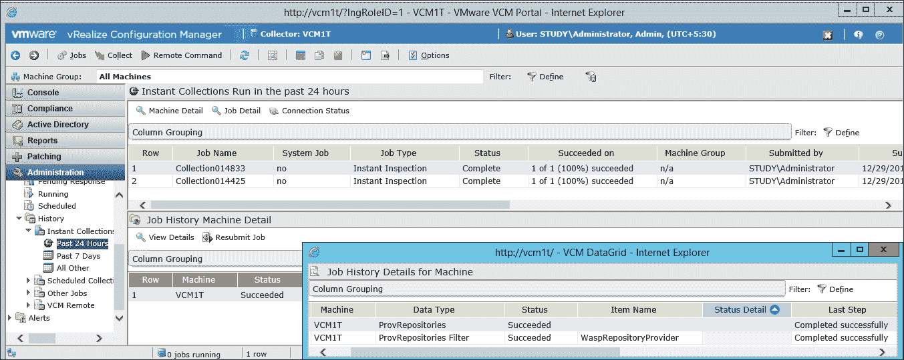

1.  一旦数据被收集，可以通过前往**控制台 | 操作系统 | Windows | 软件配置 | 包管理器**来查看详细信息：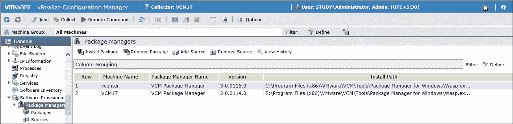

### 收集软件仓库数据

收集仓库数据，以识别哪些软件包在什么仓库中。从收集的信息中，你可以根据可用的包来决定将哪些仓库分配给机器。

我们需要对那些已经创建了软件仓库的机器执行此操作。

这个过程与之前的步骤类似，但有两个不同之处：

+   我们对所有仓库服务器执行此操作

+   **数据类型**的值更改为**软件配置 - 仓库**

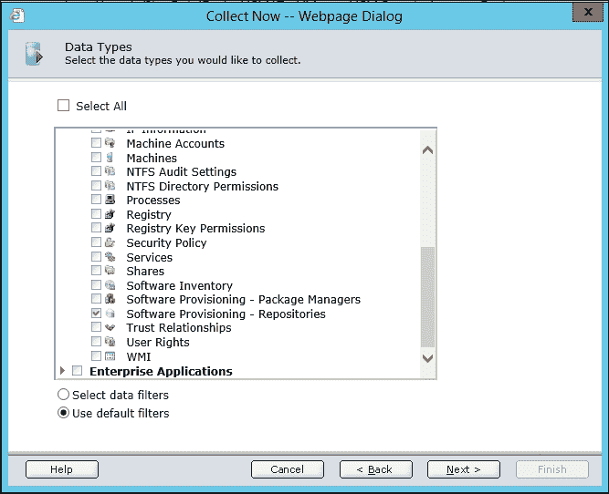

你可以前往**管理 | 任务管理器 | 历史记录 | 即时收集 | 过去 24 小时**，查看任务的状态。它应该是成功的：

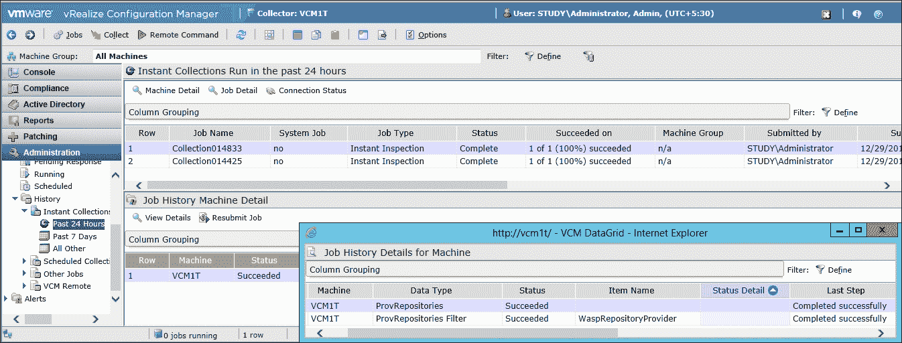

在**控制台 | 操作系统 | Windows | 软件配置 | 包管理器 | 仓库**下，它是这样的显示。

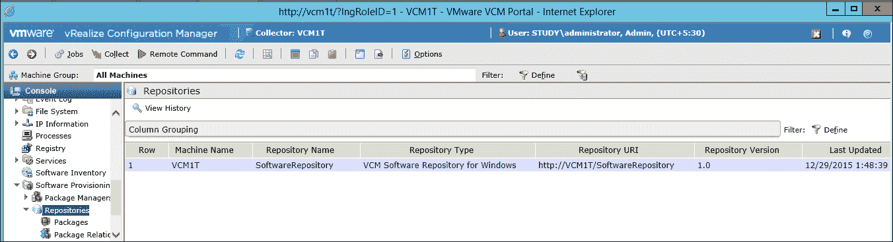

## 它是如何工作的...

在这个两步的过程中，我们收集来自被管理机器和软件仓库的数据。在第一步中，我们从所有被管理机器中收集数据，获取 VCM 中的包和包管理器信息。

在第二步中，我们收集仓库数据，以识别哪些软件包在什么仓库中。当我们需要根据包的可用性将仓库分配给机器时，这些信息非常有用。

# 将仓库源添加到包管理器

仓库源是包管理器将能够下载并安装包的位置。我们需要手动在包管理器（管理的机器）中定义这些位置，并且可以定义多个位置。然后，VCM 包管理器将按照其流程下载包。

## 准备就绪

我们需要将仓库发布到 VCM，按照*将仓库添加到 VCM*的步骤，并收集包管理器数据，以便将仓库分配给它。

## 如何操作...

添加源会让所选机器上的包管理器实例能够访问指定章节中可用的软件包。源按优先级编号。当你添加新的源时，可以指定是将其添加到列表的开头还是末尾。你也可以删除源。

按照这些步骤，我们可以将源添加到包管理器：

1.  使用管理员权限登录到 VCM 服务器，进入**控制台** | **Windows** | **操作系统** | **软件配置** | **包管理器**。

1.  点击**添加源**：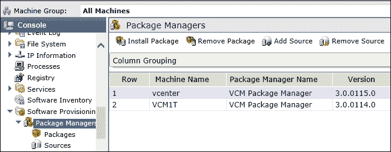

    这将启动一个向导。

1.  在**选择机器**页面，确认下方窗格中显示的机器是你要添加源的机器，然后点击**下一步**。

1.  在**浏览源**页面，选择**VCM 管理的仓库**，选择仓库，并点击**确定**：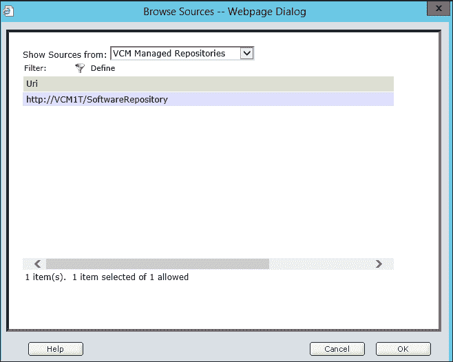

    如果有多个仓库，可以选择**将源添加到现有源列表的开头**或**将源添加到现有源列表的末尾**，这取决于包管理器与仓库之间的距离。

1.  在发布软件包时，验证平台名称和章节名称是否与仓库中使用的完全一致：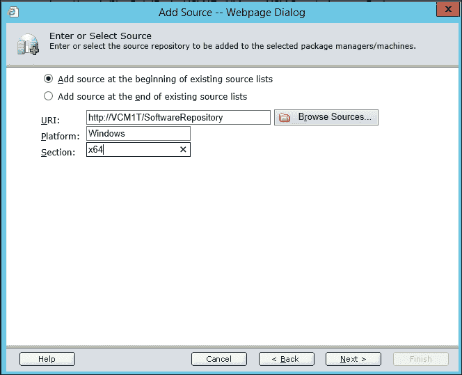

1.  在**调度**页面，选择一个调度选项并根据需要进行配置。

1.  在**确认**页面，检查信息并点击**完成**。

1.  添加的源会显示在**包管理器 – 源**数据表格中。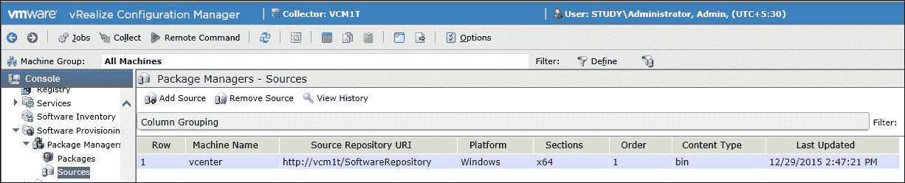

## 它是如何工作的...

我们并不依赖于包管理器下载发布的软件包的位置，而是简单地分配仓库，并决定从哪些位置按顺序获取软件包。

## 还有更多...

一旦仓库被添加到包管理器中，剩下的工作就是安装软件包。

# 部署软件包

最后，我们准备好部署软件包——换句话说，我们准备好配置软件。

## 准备工作

我们需要完成本章中所有前面的步骤，才能继续执行此步骤。

## 如何操作...

要在托管机器上配置软件，请按照以下步骤操作：

1.  使用管理员权限登录到 VCM 服务器，进入**控制台** | **Windows** | **操作系统** | **软件配置** | **包管理器** | **软件包**。

1.  选择要安装的软件包并点击**安装软件包**：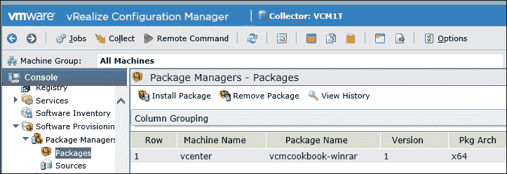

1.  跟随向导，必要时可以添加更多机器来安装选定的软件包（本例中为 winrar），或者点击**下一步**：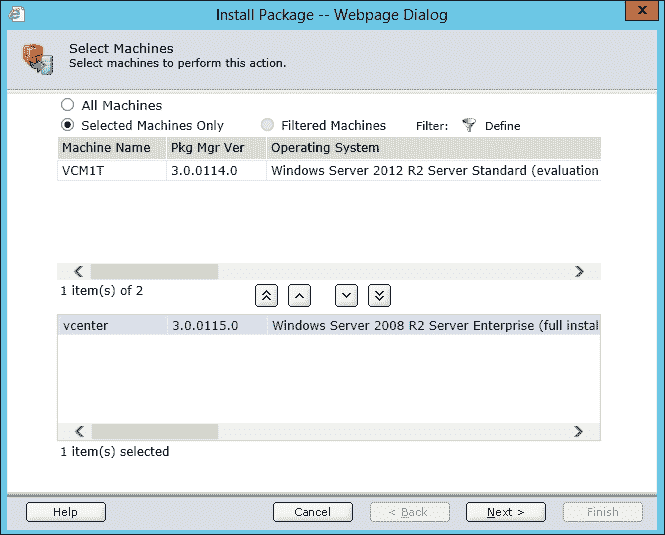

1.  由于我们没有签名软件包，因此接受警告并允许未签名的软件包：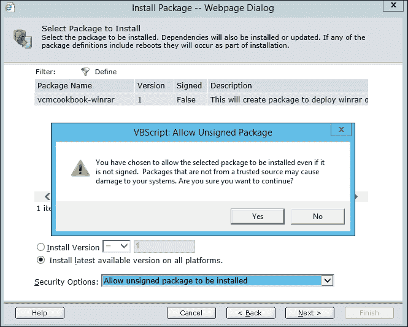

1.  安排操作或选择**立即执行操作**。

1.  接受确认后，你就可以开始了：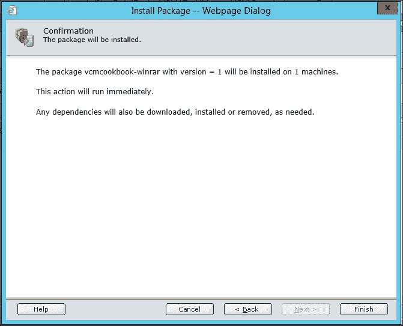

如果你选择了**立即运行操作**，那么将立即启动软件包安装过程；如果你设置了计划，则将在稍后的时间启动安装。

## 它是如何工作的...

如果你按照所有步骤操作，那么你将会理解软件供应中各种 VCM 组件之间的关系，创建并发布了一个软件仓库，创建并发布了一个软件包，并将仓库源添加到包管理器中。

让我们看一下安装软件包的最后一步。

`.crate` 文件被复制到受管机器上的 `C:\Program Files (x86)\VMware\VCM\Tools\Cratecache`：


从这里，包管理器解压 `.crate` 文件，并使用创建软件包时提供的安装命令和参数来安装应用程序。

该应用程序可以在**程序和功能**中看到：

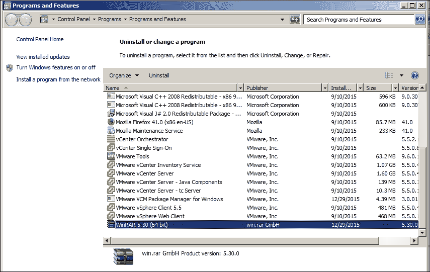

这就结束了我们关于使用 VCM 进行软件供应的探索。
