# 第六章 合规性管理

本章将介绍以下内容：

+   导入合规包

+   创建合规规则组

+   为 Windows 创建自定义合规规则

+   为 Linux 创建自定义合规规则

+   为虚拟化创建自定义合规规则

+   修改默认过滤器集

+   创建合规模板

+   检查基础设施的合规性

+   导出合规规则

+   合规报告

+   创建合规例外

# 介绍

合规性意味着满足要求。它也用于指代行业或政府的规定，说明如何管理数据，以及组织必须遵守这些规定。

考虑一个关于密码复杂度的规则，比如密码长度不得少于 12 个字符。现在，您需要检查您的基础设施中的所有机器是否符合此要求。假设您需要检查几千台机器，如果它们不符合要求，还需要重新配置。

您可以想象，逐一检查每台机器、查看设置并在发现不合规时进行修正需要多长时间。现在，如果需要针对几百条规则进行类似操作，您如何记录所有状态以供审计员查看？当您需要遵守多个政府和行业标准，如 ISO、HIPAA 和萨班斯-奥克斯利法案时，情况会变得更加复杂。每个标准可能有几百条规则，并且每个操作系统可能会有不同的变更。此外，您可能还有自己独特的合规规则，这些规则可能与其他标准不同，您也需要检查这些规则。对于某些规则，可能需要您的安全团队批准偏差，因此，违反该规则不应影响您的合规性评分，您需要将这些作为例外情况处理。

现在，合规性的复杂性更加清晰，我们需要一种可以轻松处理这一切的工具。市场上也有其他工具，如 System Center Configuration Manager、BMC BSA 和 Puppet，它们都可以完成此任务，但 VCM 在以下几个方面优于这些工具：

+   有超过 50 个现成可用的行业和政府标准合规包

+   创建您自己的合规包是一个非常简单的过程

+   规则是在 VCM 服务器上捕获并存储的数据上处理的，以便我们获得在服务器上配置的设置

+   它更加具有成本效益，因为它是 vRealize Operations 套件的一部分

+   我们可以在一个控制台中检查 VMware 虚拟基础设施以及受支持的管理机器的合规性

+   我们可以强制执行不合规规则的合规性（尽管并非所有规则和操作系统都受支持）

在我看来，这个列表已经足够让我们理解为什么我们应该使用 VCM 而不是其他工具来管理基础设施的合规性。

## VCM 合规的构成

为了衡量合规性，我们需要在 VCM 中创建各种元素。让我们来了解一下它们。

### 规则

我们已经了解到，合规性意味着满足标准所提出的要求，因此要检查合规性，我们需要创建一个规则。基本上，规则是对标准所提出的要求的解释，然后 VCM 可以理解它。继续我们之前的示例，我们的要求是密码长度至少为 12 个字符。当我们将这一要求转化时，在 VCM 中得到的就是一个规则。

规则可以是简单的也可以是复杂的。一个简单的规则仅检查数据属性的内容，而一个复杂的规则可以利用逻辑检查条件。

### 过滤器

过滤器用于根据条件筛选机器。例如，我们创建了一些规则，想让这些规则仅对某一操作系统进行检查。那么，我们就为该操作系统创建一个过滤器。

### 规则组

规则被归类在规则组下；例如，我们可以将适用于 Windows Server 2012 R2 的所有规则放在一个规则组下。

### 模板

模板用于将多个规则组组合在一起。它们用于检查机器组的合规性。

例如：在我们公司，我们有一些规则，这些规则可能因不同版本的 Windows 而有所不同。我们可以为每个操作系统创建所需的规则组，并根据每个规则组中创建的过滤器进行过滤。然后，所有规则组将被组合在一个单一的模板中，该模板可以用来检查基础设施的合规性。

# 导入合规包

提供超过 50 个合规包可供下载，且随着 VMware 不断添加新的合规包，列表还在不断增长。

## 准备工作

我们需要 VCM 服务器的互联网连接才能从 VMware 下载合规包。**内容向导**工具将使用系统级别配置的代理；有关代理详细信息，请参阅本食谱中的*更多内容...*部分。

## 如何操作...

现在我们将从互联网下载一个合规包：

1.  登录到 VCM 服务器的操作系统。

1.  从桌面启动**内容向导**工具（**开始** | **VMware vRealize Configuration Manager** | **内容向导工具**）。

1.  在向导的下一页，选择**从互联网获取更新**。

    另一个选项是**从本地文件系统获取更新**；为此，所有文件必须存放在`C:\ProgramData\CM\Content`文件夹中。您必须从 VMware 获取更新的文件并手动将它们复制到该目录。可从[`vcmupdates.vmware.com/CPC/VCM/5_7/`](https://vcmupdates.vmware.com/CPC/VCM/5_7/)下载文件。

1.  向导将检查互联网连接，并开始从 VMware 下载`Updates.xml`文件。

1.  接下来，它将显示可供下载的包列表。选择适用于您基础设施的包；在此示例中，我们选择了**Windows 的 ISO 27001-27002**：如何操作...

1.  选中的包将被下载并准备导入。

1.  下载完成后，它将作为向导的一部分开始导入。

1.  一旦导入完成，它将呈现**日志结果**页面，并提供保存日志的选项。点击**关闭**。

1.  在下一页，点击**完成**以完成合规包的导入。

1.  你可以通过登录 VCM 控制台并进入**合规性**|**机器组合规性**|**模板**来检查已导入的合规包：

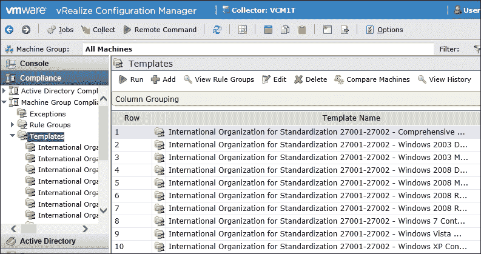

## 它是如何工作的……

如介绍中所述，我们可以创建自己的合规规则，或者通过导入 VMware 创建的合规包来导入规则。这将为我们提供衡量合规性所需的所有必要构件，例如 ISO 27001、SOX 和 HIPPA 等标准。

该工具将规则以 XML 格式下载，然后导入 VCM 数据库。该包包括规则、规则组、过滤器和模板，这些都是为了选定的标准；在我们的例子中，是针对 Windows 的 ISO 27001-27002 标准。

一旦合规包导入完成，我们可以使用新创建的模板来检查我们的基础设施是否符合 ISO 27001-27002 行业标准。请参阅本章中的*检查基础设施的合规性*食谱。

## 还有更多……

如果你的互联网访问需要使用代理，可以通过更改一些注册表设置来实现。进入`HKEY_Current_User\Software\Microsoft\Windows\CurrentVersion\Internet Settings Proxy Server`检查代理详细信息；如果配置了代理且你所在的环境不需要代理，或者代理已被更改，你需要在开始排查为什么内容向导无法连接到[`www.vmware.com/`](http://www.vmware.com/)之前检查这一点。

# 创建合规规则组

在前一个食谱中，我们导入了一个合规包，创建了所需的规则、规则组、过滤器和模板。当我们想要检查与自己标准的合规性时，我们需要创建它们。在本食谱中，我们将创建一个合规规则组。

## 准备工作

我们需要一个正常工作的 VCM 服务器以及管理员登录凭据。

## 如何操作……

这是一个分为两部分的过程；首先，我们将创建一个规则组，然后创建所需的过滤器。

### 创建规则组

以下是创建规则组的步骤：

1.  使用管理员账户登录 VCM。

1.  进入**合规性**|**机器组合规性**|**规则组**。

1.  点击绿色加号创建一个新的规则组。

1.  它将启动一个向导；填写适当的名称并提供描述。创建此类内容时，最好遵循一些命名约定。我们将在附录 A 中详细介绍命名约定——*定义命名约定*。在这种情况下，我们为公司的规则创建了一个 Windows Server 2012 的规则组，因此将使用以下名称：

    +   **规则组名称**：`01_MyCompany_Win2k12`

    +   **描述**：提供合适的描述。

    +   **过滤器集**：使用**默认**过滤器集。

    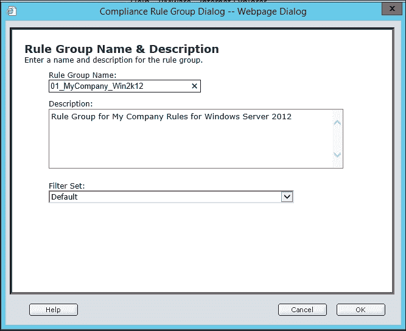

    ### 注意

    请注意，所选的收集过滤器集用于计算合规性模板中规则的数据年龄。过滤器集必须收集规则组中规则所包含的相同数据类型。如果过滤器集没有收集相同的数据类型，则不会计算数据年龄。

1.  通过点击**确定**，接受规则组创建确认框。

一旦规则组创建完成，我们需要创建必要的过滤器，以便仅检查该规则组中预期的机器。

### 创建过滤器

这是该配方的第二部分；在这里，我们将为规则组创建必要的过滤器。步骤如下：

1.  点击新创建的规则组，也就是`01_MyCompany_Win2k12`，然后点击**过滤器**。

1.  点击绿色的**+**按钮以添加新过滤器。

1.  提供合适的**名称**和**描述**。

1.  选择数据类型。

    我们选择正确数据类型的想象力是唯一的限制；VCM 代理捕获的所有属性都可以在 VCM 数据库中找到，所有这些属性都可以用来创建过滤器。在我们的例子中，我们将使用操作系统名称作为过滤标准；因此，我们选择了**机器**。你可以浏览并查看其他可用选项：

    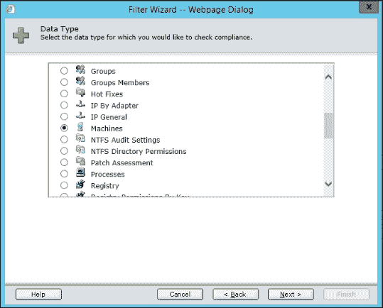

1.  现在，所选的**数据类型**将用于创建规则。因为我们只需要检查操作系统名称，所以我们选择了**基本**：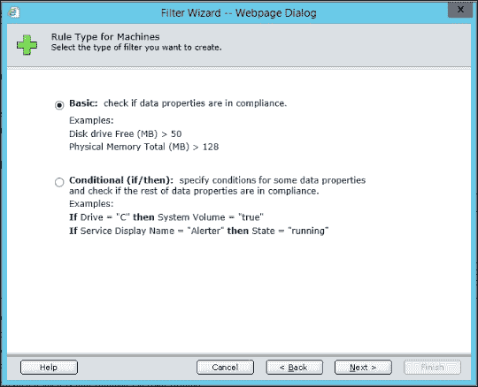

1.  在这里，我们也有多个选择来进行过滤，我们将选择操作系统名称全称，然后选择条件运算符，再输入值。

    由于我们正在为 Microsoft Windows Server 2012 创建过滤器，我们选择了**操作系统名称全称** **=** **Microsoft Windows Server 2012 %**（**%**是通配符）：

    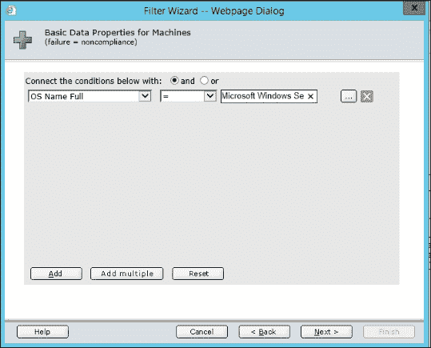

    ### 注意

    **VCM 中的通配符：**

    | **通配符** | **含义** |
    | --- | --- |
    | **%** | 匹配所有字符 |
    | **_**（下划线） | 匹配一个字符 |
    | ***** | 相当于**%** |
    | ? | 相当于**_** |

1.  点击**完成**以完成过滤器创建。

1.  要验证我们的过滤器，点击**预览**，它应该显示基础架构中所有带有 Windows Server 2012 的机器，因为我们的规则只查找这样的机器：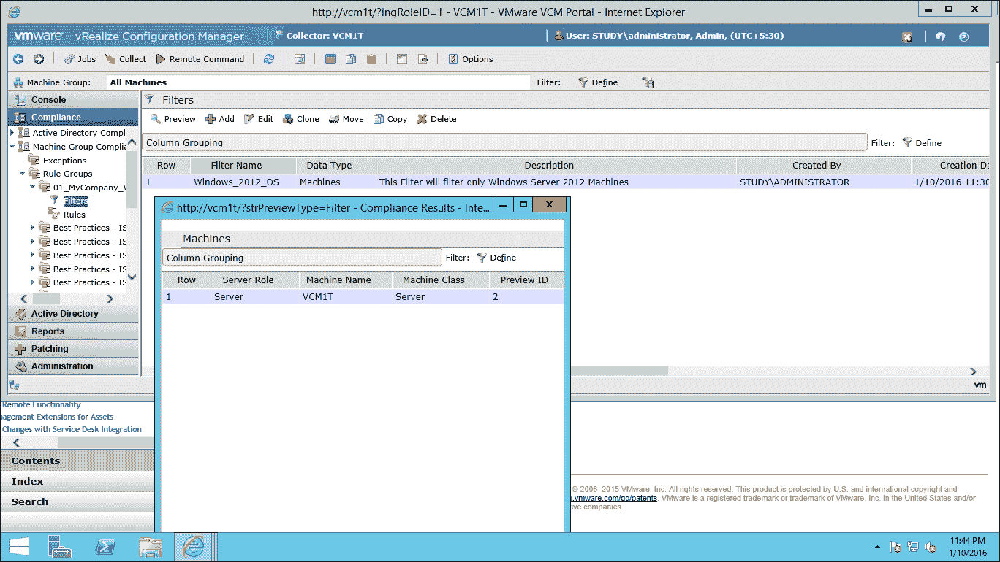

    ### 注意

    请注意，如果在一个规则组中创建了多个过滤器，它们作为逻辑**AND**一起工作，也就是说，只有当所有条件**为真**时，才会显示机器，因此在创建多个过滤器时需要小心。

## 工作原理...

在这个配方中，我们只创建了一个规则组，该规则组将包括我们公司要通过 VCM 测量的安全规则，并选择了默认过滤器集，因为信息将作为默认过滤器集的一部分进行收集。

之后，我们创建了一个筛选器，能够在 VCM 中仅筛选出 Windows Server 2012 机器。

# 为 Windows 创建自定义合规规则

VCM 将合规性分为两大类：

+   *机器组合规性*

+   *虚拟环境合规性*

## 机器组合规性

在此类别中，合规性在操作系统级别进行检查，例如所有受支持的 Windows 或 Linux 版本。

## 虚拟环境合规性

在此类别中，将检查 vCenter 中存在的 ESXi 主机、vCenter 和虚拟机的合规性。

现在，既然我们已经准备好规则组，让我们开始为组织填充规则。我们可以通过两种方式创建规则：要么复制我们在第一步中下载的标准合规性包中已创建的规则并根据需求进行修改，要么从头开始创建规则。

在本步骤中，我们将基于机器组合规性创建一个自定义合规规则。

## 准备工作

我们需要一台完全准备好的 VCM 服务器，并且为了从另一个规则组复制规则，我们应该完成 *导入合规性包* 的步骤。我们还需要创建自己的规则组，以便可以在其中创建规则。

## 如何做到这一点...

我们将继续以要求密码复杂性和最小密码长度为 12 个字符为例；首先，我们会尝试在导入的合规性包中查找规则，然后我们将创建自己的规则。

### 从另一个规则组复制规则

我们可以从已下载并添加到 VCM 的合规性包中复制规则，然后根据我们的需求修改它们，或根据需要将不同合规包或标准中的规则组合起来，以支持我们的内部公司标准。

按照以下步骤从另一个规则组复制规则：

1.  使用管理员权限登录 VCM，进入 **合规性** | **机器组合规性** | **规则组**。

1.  由于我们想复制规则，我们必须知道原始规则的位置；在我们的例子中，规则位于 **最佳实践 - ISO 27001-27002 Windows 2008 R2 Mbr** 规则组中，因此我们将前往该组并选择所需的规则：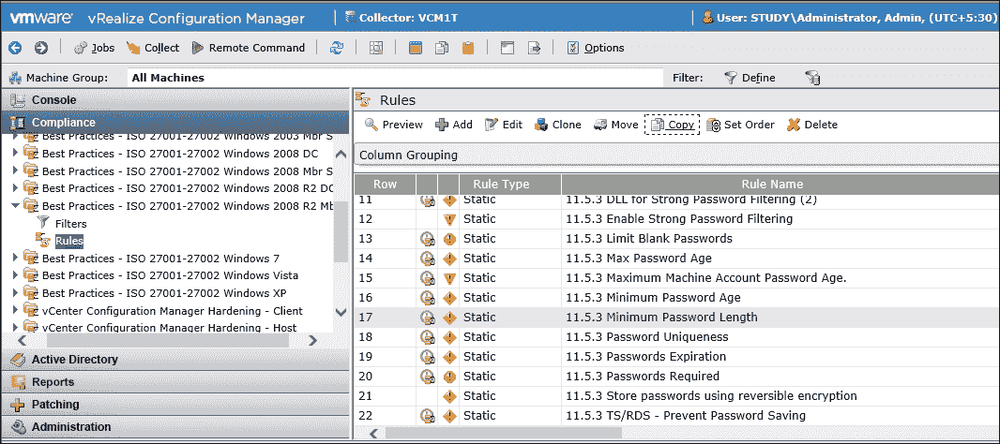

1.  点击 **复制**，在向导启动时，选择您想要复制规则的规则组：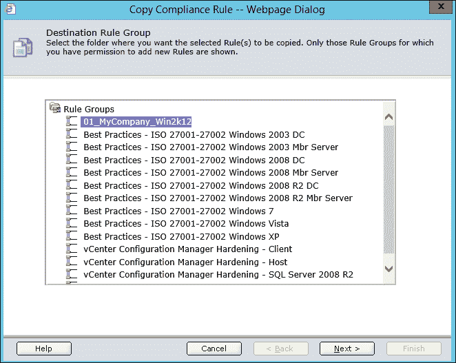

1.  在下一步中，确认您想要复制的规则，并点击 **完成**。

1.  现在，规则已被复制到我们的规则组中。

1.  它应如下所示：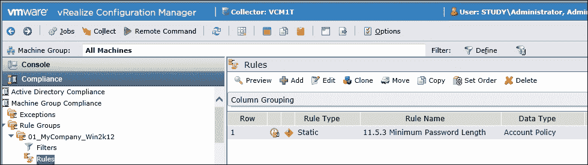

### 创建新规则

现在，既然你已经看到如何复制规则，我们将继续考虑如果找不到我们需要的规则，则需要创建规则的情况。

按照以下步骤创建所需的规则：

1.  再次登录 VCM，进入 **合规性** | **机器组** **合规性** | **规则** **组**。

1.  选择为存储我们规则而创建的机器组，进入**规则**，点击**添加**，并按照向导进行操作。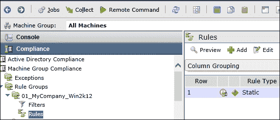

1.  提供规则的**名称**和**描述**。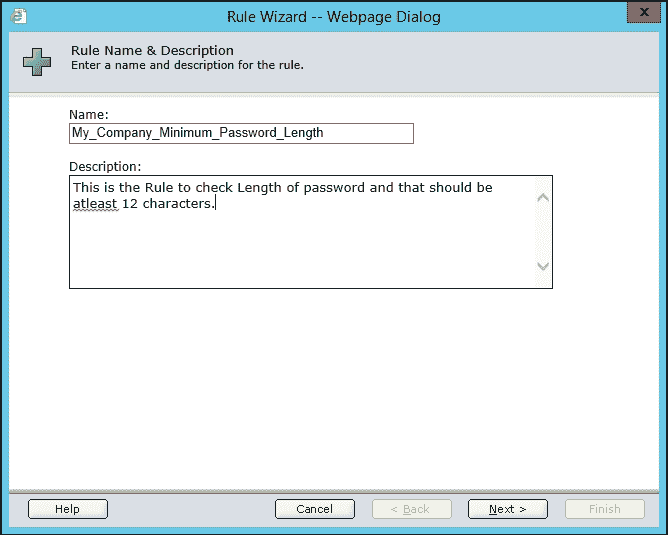

1.  选择正确的**数据类型**；在我们的例子中，它是**帐户策略**。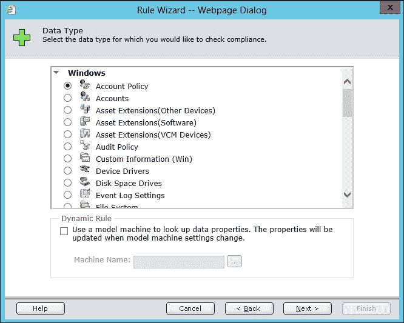

1.  选择**基本规则**。

1.  （有关规则类型的更多详细信息，请参见*VCM 合规性的构建*食谱中的*规则*子部分）。

1.  选择一个**最小长度**值大于（**>**）`12`，作为条件，以便如果条件未满足，它将标记为不合规。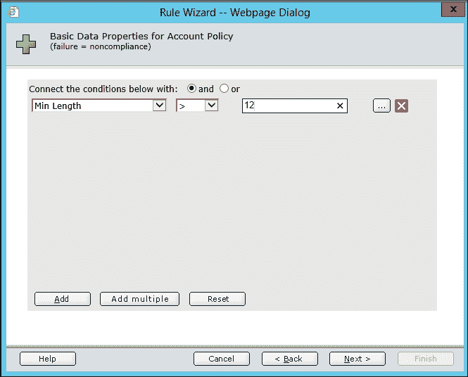

1.  选择**中等严重性**，确认规则创建并点击**完成**。

1.  我们刚刚为 Windows 创建了我们的第一个内部标准规则。

## 它是如何工作的…

为了衡量合规性，我们需要为每个已声明的要求创建规则；在本示例中，我们首先复制了一个从导入的标准中获得的规则，然后为了理解流程，我们创建了相同的规则。该规则将存储在规则组中，并将检查 Windows 机器的密码长度合规性。

# 为 Linux 创建自定义合规规则

在之前的示例中，我们查看了一个为 Windows 创建的检查最小密码长度的规则；我们将在这里继续相同的要求，只不过是针对 Linux。过程将类似，只是数据类型会发生变化。

## 准备就绪

我们需要一个功能完全的 VCM 和一个用于存储 Linux 规则的规则组。

## 操作步骤...

就像在之前的示例中一样，这里我们也有两种方法来创建这样的规则，即从另一个导入的合规包规则组中复制，或者创建我们自己的。复制过程与 Windows 相同，因此我们不会再重复它。

我们将通过完成以下步骤为 Linux 创建一个新规则，以检查最小密码长度：

1.  再次，我们需要以管理员权限登录 VCM，并转到**合规性 | 机器组合规性 | 规则组**。

    转到为 Linux 规则创建的机器组，点击规则组名称前的箭头，并选择**规则**。

1.  点击**添加**，它将启动一个向导来创建一个新规则。

1.  在向导的第一页，提供名称和描述。

1.  在数据类型的下一页，选择**Unix** | **自定义信息**。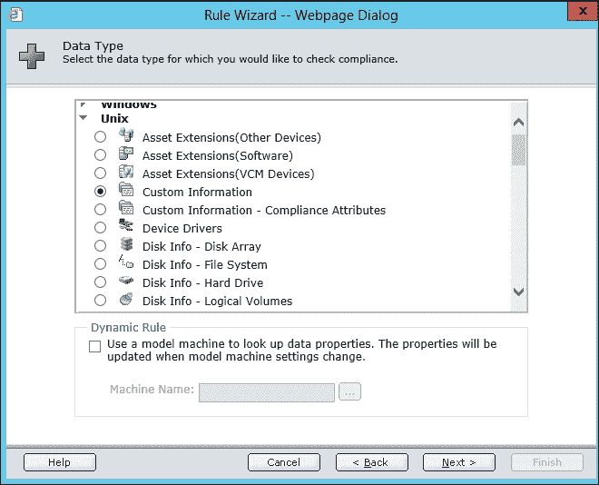

1.  如果你是 Linux 管理员，你已经知道在哪里找到所需的详细信息；如果不是，请咨询你的 Linux 管理员。

    在我们的例子中，我在咨询了我的 Linux 管理员后填写了相关信息。

    这是我们填写的内容：

    +   **信息类型：`builtin:login.defs`**

    +   **文件路径：`/etc/login.defs`**

    +   **内部路径：`/builtin:login.defs`**

    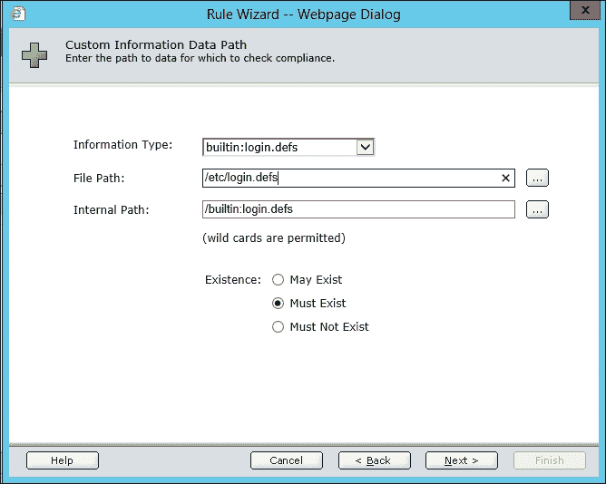

1.  选择`PASS_MIN_LEN`条件大于（**>**）`12`，也就是说，如果找到的值小于 `12`，那么我们就不合规，VCM 会通知我们。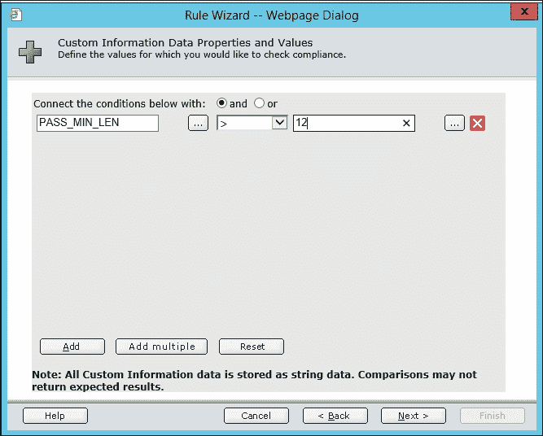

1.  将**严重性**设置为**中等**，按照向导步骤进行，并接受规则创建，最后点击**完成**来完成设置。

## 它是如何工作的...

就像 Windows 合规规则一样，该规则将被存储，并处理从 Linux 机器收集的存储数据，给出它们的合规状态。

# 为虚拟化创建自定义合规规则

到目前为止，我们为机器组合规性创建了规则，即为 Windows 和 Linux 创建了规则。现在，我们将为虚拟环境合规性创建规则。在虚拟环境中，我们无法继续使用最小密码长度的示例，因此我们将其更改为我们另一个要求，即虚拟机的快照不应保存超过 10 天。

那么，让我们开始，首先创建一个规则，看看有多少虚拟机不符合我们的规则。

## 准备开始

我们需要创建一个规则组，用于在已完全部署且功能正常的 VCM 服务器中存储虚拟化合规规则。

## 如何做到这一点...

像我们之前处理规则的经验一样，如果你知道从哪里复制，它也可以从另一个标准包中复制；这个过程与 Windows 规则类似，所以我们在这里不再重复。

我们将通过以下步骤开始创建一个新规则：

1.  我们需要再次以管理员身份登录 VCM，并进入**合规性 |** **虚拟环境合规性** |** 规则组**。

1.  选择为存储虚拟环境合规规则而创建的规则组。点击它旁边的箭头，进入**规则**。

1.  点击**添加**以启动向导。填写规则名称和描述，然后点击**下一步**。

1.  查看之前我们为 Windows 和 Linux 创建规则的截图，并根据这些步骤为虚拟化进行相应的修改。

1.  在向导的下一页中，选择**数据类型**，选择**vCenter - 客户机 - 快照**，因为我们要检查快照的年龄。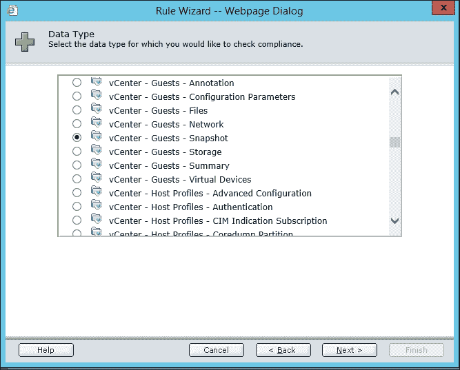

1.  选择**基本**作为规则类型，然后点击**下一步**。

1.  要形成一个条件，选择**快照年龄**小于或等于（**<=**）`10`，也就是说，如果快照年龄小于 `10`，那么我们是合规的，但如果超过 `10`，我们就不合规，需要标记出来。点击**下一步**。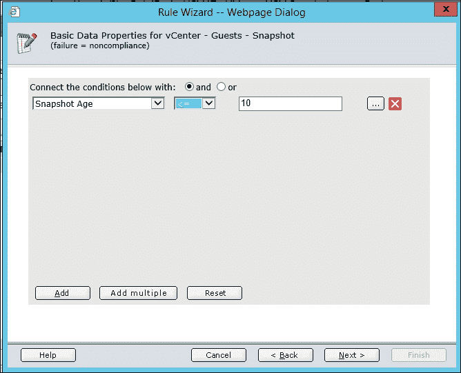

1.  选择**中等严重性**，确认规则创建，并点击**完成**以关闭向导。

这完成了所有类型的合规规则的创建。

## 它是如何工作的...

该过程与 Windows 和 Linux 的机器组合规性和规则相同；在虚拟环境中，所需的数据将从 vCenter 服务器收集，并且 vCenter 服务器的合规得分会发生变化，而不是单独虚拟机的合规得分。

# 修改默认过滤器集

现在你知道 VCM 检查的是已收集并存储在数据库中的数据的合规性，而不是直接检查实时机器上的数据。这带来了一个限制：如果某个特定数据类型未被采集，那么它将无法使用，因此我们无法衡量该规则的合规性，VCM 会告诉你该规则的结果中没有收集到相关数据。

为了克服这种情况，我们可以设置多个包含不同类型过滤器集的采集，这些过滤器集由 VCM 创建，或者我们可以修改默认过滤器集并添加所需的过滤器。

### 注意

请注意，VMware 不建议修改默认集。请创建你自己的过滤器集，包含所需的过滤器，并使用它来执行数据采集。

那么，什么是过滤器和过滤器集？

**VCM 过滤器**：过滤器定义了 VCM 代理在执行数据采集时应收集哪些数据；例如注册表设置、服务状态、文件权限等。

**VCM 过滤器集**：这些是过滤器的集合，可以用来从管理的机器收集数据。大多数情况下，我们使用默认过滤器集，但在安装 VCM 时会默认创建几个过滤器集，导入合规包时也会添加一些过滤器集。合规包创建所需的过滤器和过滤器集，以便收集数据并在运行合规性检查时处理这些数据。

我们需要在执行数据采集时选择正确的过滤器集，以便将所需的详细信息添加到 VCM 数据库中，修改默认过滤器集，或创建一个新的过滤器集，并使用该过滤器集来收集数据。

## 准备工作

我们需要一个完全功能的 VCM 服务器，并且我们应当知道需要添加哪些数据过滤器到默认过滤器集中，因此我们应该像在第一个食谱中那样导入合规包。

## 如何操作...

我们将添加一个 Linux 过滤器，用于收集在*为 Linux 创建自定义合规规则*食谱中使用的所需数据类型，其中我们使用了来自`:/etc/login.defs`文件的详细信息，而这些信息并不包含在默认过滤器集中。在这个示例中，我们正在修改默认过滤器集，但你也可以使用相同的过程，首先创建一个过滤器集，然后将所需的过滤器添加到其中。

让我们进入 VCM 控制台来修改默认过滤器集吧：

1.  首先，登录到 VCM 并转到**管理** | **数据采集过滤器** | **过滤器集**。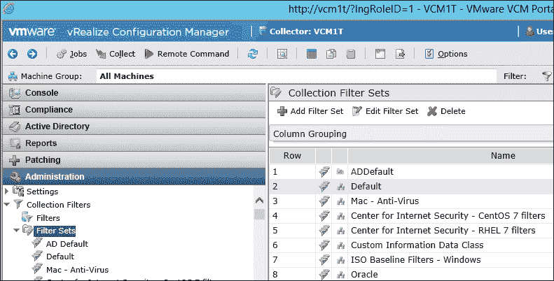

1.  选择默认过滤器集并点击**编辑过滤器集**。

1.  向导将启动；如你所见，有 9000 个筛选器可用；我们无法逐个搜索它们，所以创建一个**筛选器**，点击**定义**，它将弹出一个窗口。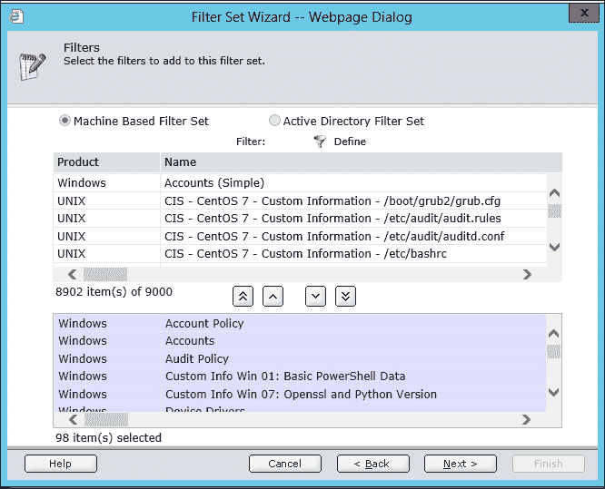

1.  由于我们希望在**筛选器**中查找登录详情，请创建一个像**Name**类似于**%log%**的筛选器（**%**充当通配符）。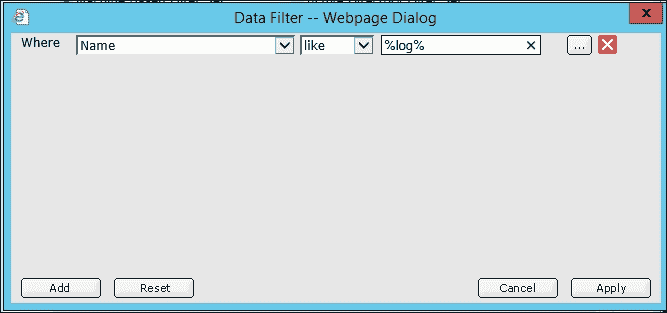

1.  现在，我们需要检查的筛选器只有 169 个。浏览它们并选择符合我们要求的筛选器，在这种情况下是**CIS - RHEL 7 - 自定义信息 - /etc/login.defs**。

1.  选择并点击向下箭头，然后点击**下一步**。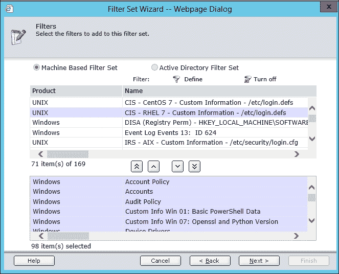

1.  确保没有冲突，然后点击**下一步**。

1.  在下一页，它将显示此筛选器集中的筛选器列表；点击**完成**接受它们。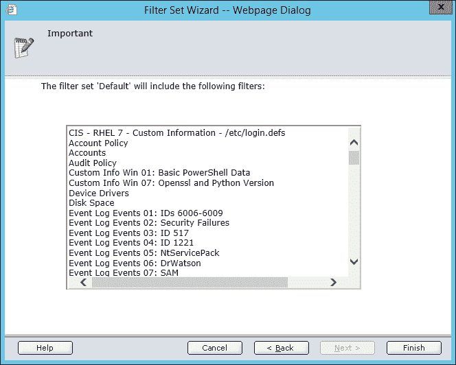

## 它是如何工作的……

如前所述，我们需要指示 VCM 收集哪些数据；否则，我们将错过数据收集，无法检查这些规则的合规性。我们可以通过两种方式来做：使用多个筛选器集多次收集数据，或者像这里一样，添加所需的筛选器集并准备一个主筛选器集来收集所有详细信息。

我们选择了第二个选项。从现在开始，每当我们使用默认筛选器集收集数据时，它将从 Linux/Unix 管理的机器中收集有关`/etc/login.defs`文件的详细信息，我们可以使用这些信息。

# 创建合规模板

现在，所有必需的规则组和所需的筛选器都已准备好，并且它们已经填充了所有规则以满足安全官员的要求，我们需要继续并开始检查合规性。但等一下，我们不能直接检查规则或规则组的合规性；我们需要一个合规模板，它可以包含所有所需的规则组。

所以我们先从为与 Windows 相关的规则组创建合规模板开始。

## 准备就绪

我们需要创建所有必需的规则组，并确保它们已填充与之关联的规则，且在完全功能的 VCM 服务器上运行。

## 如何操作...

到目前为止，你应该已经知道在哪里创建合规模板；如果不知道，只需按照这个过程，你也将学会如何操作：

1.  转到**合规性** | **机器组合规性** | **模板**，然后点击**添加**。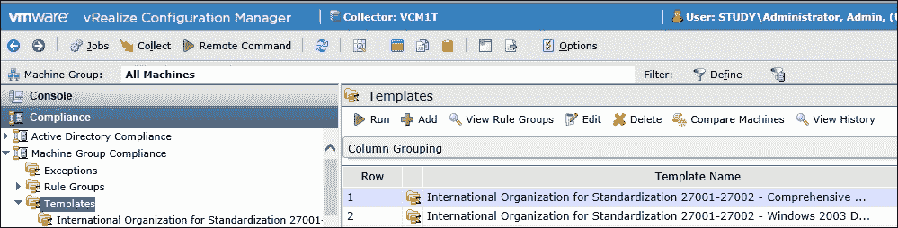

1.  启动创建新模板的向导后，提供一个合适的**名称**和**描述**值。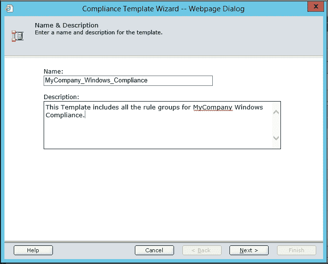

1.  选择所有应该包含在此模板中的规则组。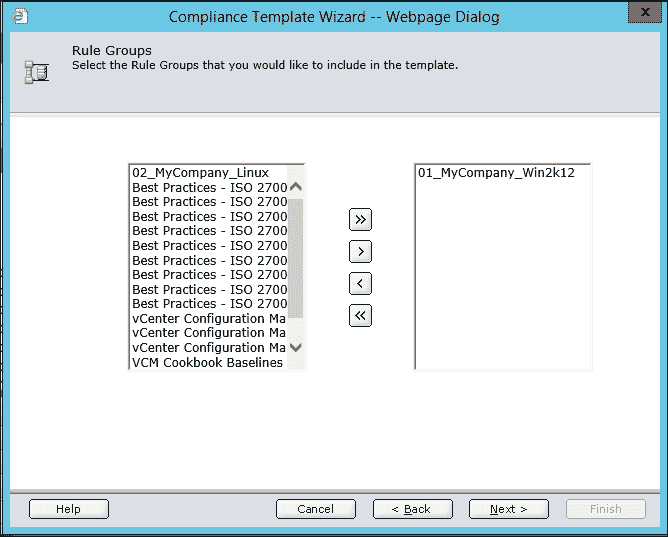

1.  确保它能够提供合规和不合规的详细信息，并处理合规例外（更多内容请参见本章末尾的*创建合规例外*部分）。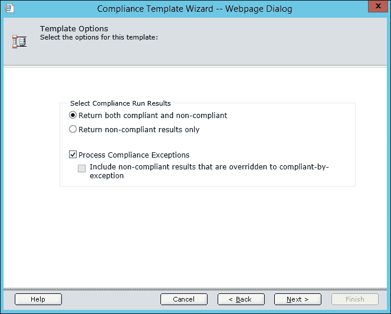

1.  确认模板的创建并点击**完成**。

## 工作原理...

我们可以为每个版本的 Windows 创建规则组，例如 Windows Server 2003、Windows Server 2008、2008 R2、Server 2012 和 2012 R2。每个规则组会有自己特定的过滤器，使得这些规则仅应用于为其创建的操作系统。现在，我们可以有一个单一的模板，应用于包含所有 Windows 机器的大型机器组；VCM 会为它们选择正确的规则，这样我们就可以避免需要多个模板和相关机器组来检查合规性（检查基础设施的合规性是我们的下一个教程）。

当被称为“合规”的规则通过并且失败时，我们在某个设置上就是不合规的。现在，可能需要对规则做出一些例外，就像本章最后的教程《创建合规性例外》中，我们会创建这样的例外。

# 检查基础设施的合规性

我们已经完成了创建所有规则、规则组和模板的繁重工作，达到了这一步：检查基础设施的合规性。现在，我们准备好检查我们是否符合内部标准，或者我们可以直接使用我们在第一个教程中下载并导入的标准合规性包。

由于我们只创建了测试规则，我们将使用我们在第一个教程中导入的标准模板。

## 准备工作

所有繁重的工作应该已经在 VCM 服务器上完成；例如，模板应该已经准备好，并且至少有一个机器组，其中包含我们需要检查合规性的机器，或者我们可以使用默认的机器组。更优的选择是我们自己的机器组。

## 如何操作...

如前所述，我们将使用一个名为**国际标准化组织 27001-27002- Windows 2008 R2 Mbr 服务器控制**的标准模板，并将其应用于默认机器组**所有机器**。

按照此流程检查 Windows 服务器的合规性：

1.  登录 VCM 后，前往**合规性**|**模板**。

    ### 注意

    请注意，您应该确保在顶部选择了正确的机器组；这是 VCM 决定将哪个机器应用于模板并进行合规性测量的方式。如果您想更改机器组，请点击机器组，在弹出的窗口中选择正确的机器组。

1.  在右侧选择所需的模板，然后点击**运行**。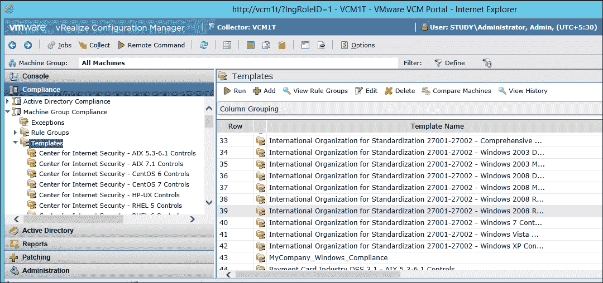

1.  根据组织的政策，决定是否执行合规性检查。

    ### 注意

    请注意，并非所有规则都可以强制执行；此外，我们还可能会创建问题，例如破坏一个正在工作的应用程序。例如，如果要求禁用打印后台处理程序服务，而当我们强制执行合规性时，我们禁用了该服务，那么这将导致打印机组出现问题，因为它将无法正常工作。因此，最好先了解哪些是非合规的，然后做出必要的例外，再从 VCM 强制执行，或者要求相应的服务器拥有者采取必要的措施。

1.  根据你在机器组中需要检查的机器数量，合规性检查将在几分钟内完成。点击**关闭**。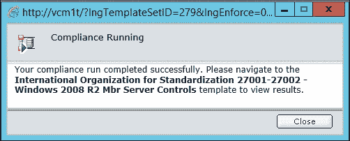

1.  可以通过导航到左侧的模板并从顶部选择正确的机器组来查看合规性状态。

    对我们来说，我们的支持团队需要做很多工作，因为我们是非合规的。

    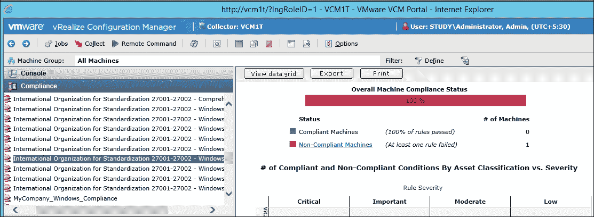

## 它是如何工作的...

当我们请求 VCM 检查合规性时，它首先应用规则组中可用的过滤器，然后，只有通过这些过滤器的机器才会被考虑。

合规性检查是基于 VCM 收集并存储在数据库中的数据进行的，与一些其他工具不同，这些工具是在客户端端进行检查，并由客户端提交数据。VCM 所采用的流程更好，因为它可以在当时处于离线状态的服务器上执行，并且当我们检查结果时，可以得到导致机器违反规则的具体值。

但是，这样也有一些问题：首先，我们需要确保我们的 VCM 是干净的；我的意思是，当一台机器被退役时，它应该从 VCM 中清除；否则，我们会保留那些在基础设施中已不存在的机器的详细信息，这可能会影响我们的最终合规性评分。

第二个问题是它没有给我们实时的详细信息，因为它是基于数据库中的数据进行工作的；这可能会导致一些误报。

为了应对这个问题，我们可以在对机器组进行全面数据收集后安排合规性检查；这样我们就不会处理过时的数据。

一旦完成合规性检查，如果我们选择执行合规性，它将创建任务来强制执行这些规则，并开始在受管理的机器上执行；例如，如果我们有规则检查服务的状态，并且期望某些服务处于运行状态，那么 VCM 将启动这些服务。

# 导出合规性规则

我不知道你怎么样，但我可是个懒管理员——我喜欢一次性做完事情，然后尽可能多次使用它。创建完整的合规性配置是一个庞大的任务，可能需要几个月的时间；现在假设你又有另一个部署了 VCM，你想要重新创建所有规则、规则组和模板。没人会同意几个月的重复工作，你自己也不会喜欢这种重复的工作。

这时，VMware 提供的与 VCM 捆绑的导入导出工具就派上用场了。你可以将所有设置导出为一个 XML 文件，然后根据需要导入任意数量的 VCM 部署，一旦导入，你也可以根据需求进行修改。

在本教程和接下来的教程中，我们将探讨这两个操作。首先，我们将导出配置文件到一个 XML 文件中，然后再导入回来。

## 准备就绪

在开始之前，我们需要一个完全功能的 VCM，且所有所需的规则组、过滤器、规则和模板应该在开始之前准备好。

## 如何操作...

要进行此操作，你无需登录到 VCM 控制台，但需要从 VCM 服务器的桌面启动 **导入导出** 工具。请按照以下步骤操作：

1.  一旦 **导入导出** 工具启动，点击 **连接源**。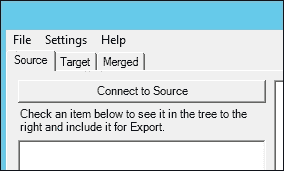

1.  选择数据库服务器并点击连接。选择 **VCM** 数据库并点击 **确定**。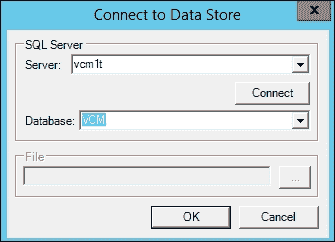

1.  由于我们想要导出合规性模板（这将包括所有规则组、过滤器和规则），点击 **合规性模板**；工具将显示右侧可用的合规性模板。

1.  接受依赖警报——如果我们修改或创建新的过滤器集，我们需要适当的文档，以便在新环境中重新创建它们，届时我们将再次导入此模板。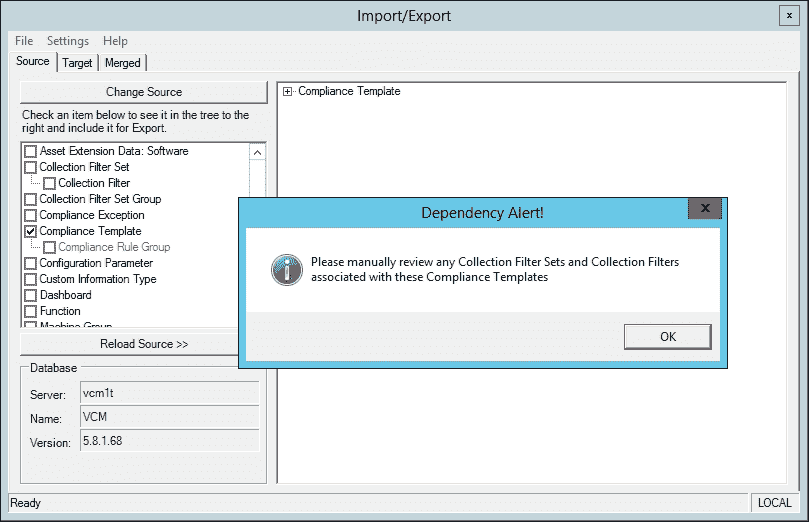

1.  选择你创建并希望导出的合规性模板，然后前往 **文件** | **保存源文档**。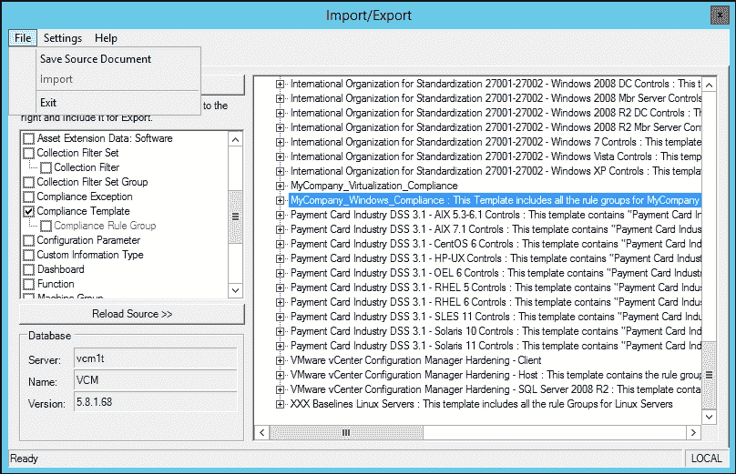

1.  在下一步中，使用箭头按钮移动你想导出的模板，然后点击 **确定**。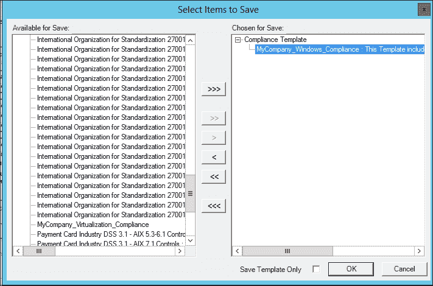

1.  在 **保存选项** 下输入评论。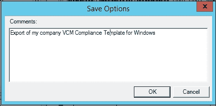

1.  提供一个描述性名称并点击确定。

1.  点击 **确定** 完成保存。

1.  现在，我们已经完成了导出，并准备与大家分享我们的辛勤工作成果。

## 如何操作...

数据以 XML 格式导出，可以在任何其他环境中使用相同的工具重新创建合规性细节，这些细节可能需要几个月才能重新创建。

# 合规性报告

不管你有多合规，除非你能提供一份完整的报告，显示所有基础设施的详细信息，否则都无济于事。VCM 在这方面也不会让你失望：有 15 个默认报告可供导出。我们将在本教程中了解如何实现这一点。

## 准备就绪

我们需要一个完全部署的 VCM 服务器，且应该完成基础设施的合规性检查，这样我们就能查看生成报告的选项。

### 注意

请注意，如果我们没有运行合规性检查，就无法看到报告——这点显而易见，但我们确实偶尔会忽视它。

## 如何操作...

要从 VCM 导出报告，请按照以下步骤操作：

1.  登录到 VCM 控制台，进入**报告** | **机器组报告** | **合规性**。

1.  选择所需报告；使用此列表了解报告中能看到的内容：

    | **序号** | **名称** | **描述** |
    | --- | --- | --- |
    | **1** | 按对象显示合规性徽章映射结果 | 显示按对象详细列出的合规性徽章映射结果 |
    | **2** | 按模板显示合规性徽章映射结果 | 显示按模板详细列出的合规性徽章映射结果 |
    | **3** | 合规性徽章汇总详情 | 显示合规性徽章的详细汇总 |
    | **4** | 合规性徽章汇总摘要 | 显示合规性徽章汇总摘要 |
    | **5** | 合规性变更历史 | 显示一系列合规性检查的变更历史 |
    | **6** | 合规性机器组汇总 | 显示按机器组划分的合规性汇总 |
    | **7** | 按机器显示合规性结果详情 | 显示按机器分组的合规性检查结果，并包括规则描述 |
    | **8** | 按规则显示合规性结果详情 | 显示按规则名称分组的合规性检查结果，并包括规则描述 |
    | **9** | 合规性结果详情 | 按合规性模板显示合规性结果详情 |
    | **10** | 按机器组显示合规性结果详情 | 显示按机器组分组的合规性检查结果 |
    | **11** | 合规性结果汇总 | 按合规性模板显示合规性结果汇总 |
    | **12** | 按规则显示合规性结果汇总 | 按合规性模板为资产分类和规则严重性显示合规性结果汇总 |
    | **13** | 合规性结果趋势 | 显示所选模板的合规性结果趋势 |
    | **14** | 按规则组显示合规性规则详情 | 显示现有的合规性规则详情以及包含这些规则的规则组 |
    | **15** | 合规性模板列表 | 按模板显示合规性模板列表，并附带规则组详情 |

1.  选择报告后，点击顶部菜单中的**运行**。这将启动一个向导，供你跟随操作。

    ### 注意

    请注意，你必须确保从顶部选择了正确的机器组；如果你之前从未对该机器组进行过合规性检查，下一窗口的下拉选项将为空。

    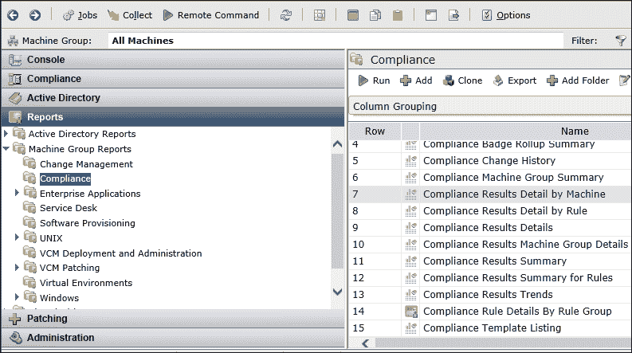

1.  选择选项（这些选项会因所选报告不同而有所不同）；下拉选项会根据你用来检查合规性的模板而有所变化。

1.  剩下的选项可以根据你的需求进行选择；一旦选择了所有必需的选项，点击**查看报告**。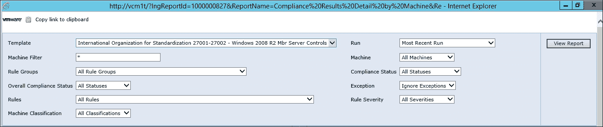

1.  报告将显示，并且可以导出为多种格式，如 XML、CSV、PDF 和 MHTML。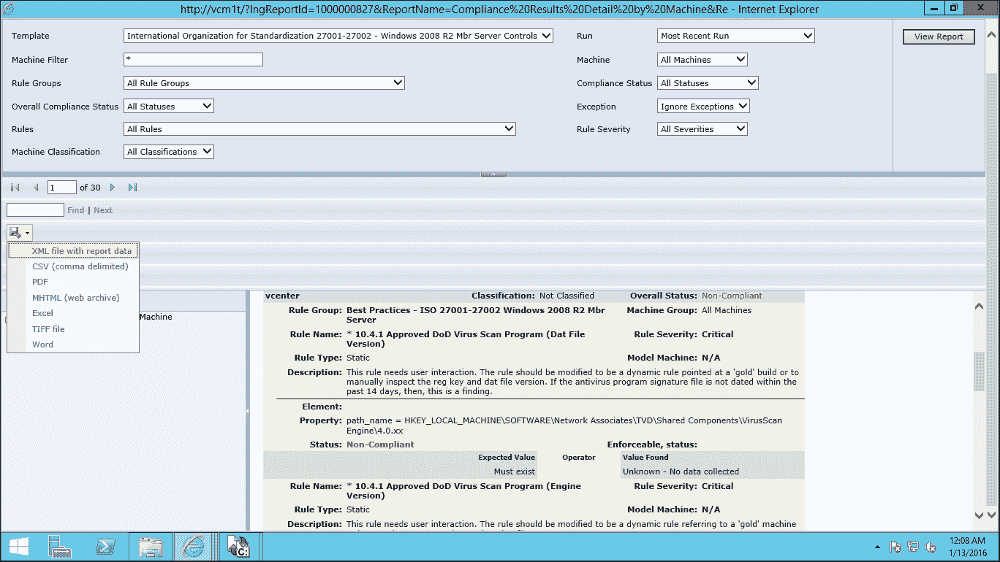

## 操作步骤...

VCM 使用 SSRS 进行报表功能。当我们点击运行按钮时，为了显示报表，VCM 会启动另一个 Internet Explorer 窗口，这会带我们到 SSRS。然后，报表会询问我们一些选项，比如合规模板、机器和严重性（这些根据报表不同而变化），然后它会访问 VCM 数据库并提取数据。数据将以漂亮的报表形式显示在屏幕上，或者可以导出为前面截图中所示的格式。

# 创建合规性例外

正如您所知，每条规则都有一个例外，合规性规则也是如此。您可以为所有服务器创建一条禁用打印后台处理程序服务的规则，然后您会有需要运行此服务的打印服务器。现在，如果我们知道这是一个已知并接受的偏差，我们就不能禁用此服务，而且我们不希望由于此原因影响我们的合规性得分。我们可以做的是添加一个例外，这样在检查合规性时就不会产生问题。

## 准备工作

我们的组织有一项政策，要求在服务器上禁用不必要的服务，而打印后台处理程序被认为是一个不必要的服务，因此必须在所有服务器上禁用。当然，打印服务器是例外。我们将为打印服务器机器组创建一个例外，允许其不受此规定约束。

我们需要在 VCM 中创建所需的规则，并且需要一个包含所有打印服务器的机器组。

## 如何操作…

让我们通过以下步骤为打印服务器创建一个例外：

1.  登录到 VCM 并转到**合规性**|**机器组合规性**|**例外**。

1.  点击**添加**。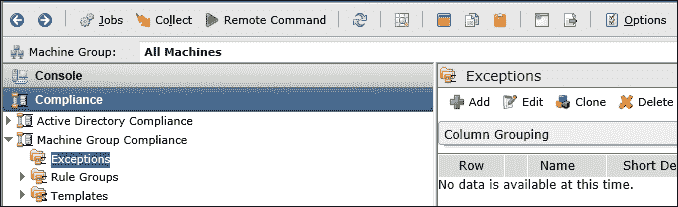

1.  提供一个描述性的名称和描述，然后点击**下一步**。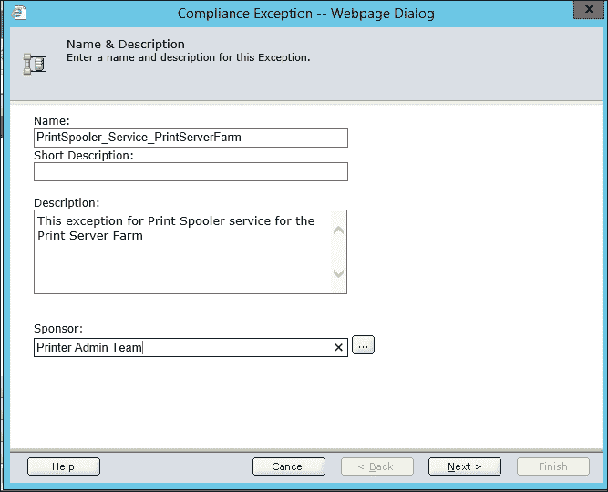

1.  选择要将此机器组排除在外的模板。

1.  在这种情况下，我们选择的是由我们组织规则创建的选项；点击**下一步**。

1.  选择为此例外创建的机器组——在我们的案例中，它被命名为**打印服务器**——然后点击**下一步**。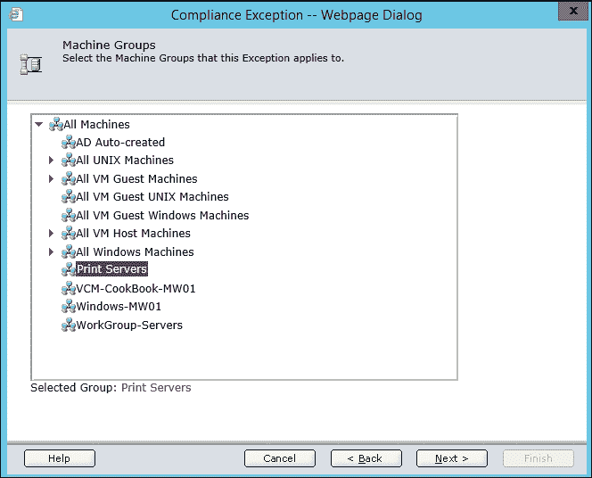

1.  选择**将不合规结果覆盖为合规**。

1.  我真的不知道为什么会有另一个选项，但一定有我不知道的使用案例。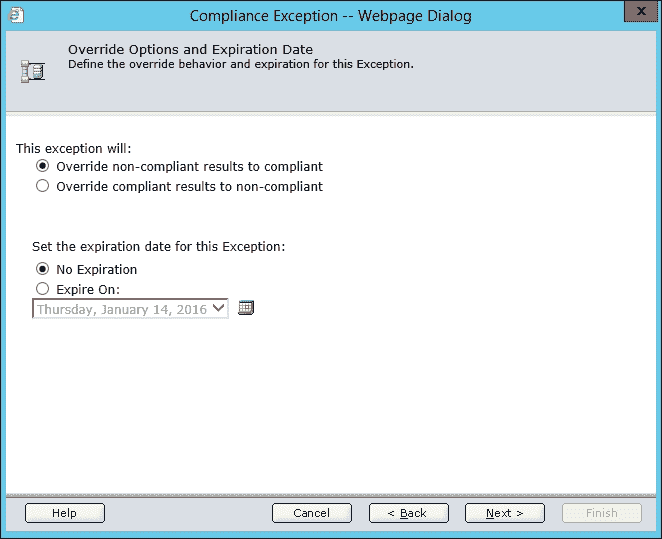

1.  我们只想为打印后台处理程序服务器的规则创建此例外，称为**Service_Print_Spooler**，因此选择了该规则。根据您的需求，您也可以为整个规则组创建例外。但在我们的情况下，单个规则的例外就足够了。

1.  点击**完成**。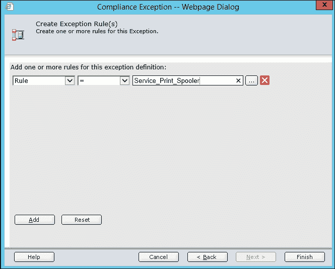

1.  您可以根据需要启用/禁用此例外。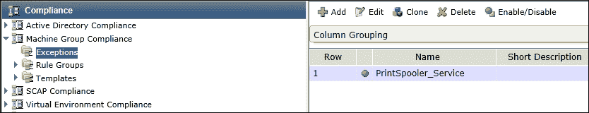

## 它是如何工作的…

在执行合规性检查时，会考虑到例外情况，并计算出最终得分。通过创建例外，我们确保不会因为需要让某些事项不合规而导致得分不好。此外，这在执行合规性时也很有帮助。例如，在之前的案例中，如果我们强制要求服务状态应该禁用，那么 VCM 将会在包括打印服务器在内的所有服务器上禁用打印后台处理程序服务，这将影响生产力。

因此，创建合规性例外对于两个团队来说都是双赢的局面——安全团队拥有一个良好的合规环境，而打印管理员团队则拥有一个正常工作的打印服务。
