# 第七章. VCM 的维护

本章将涵盖以下食谱：

+   从先前版本升级 VCM - 就地

+   从先前版本升级 VCM - 并行

+   从另一个域迁移 VCM

+   应用新许可证密钥

+   升级 VCM 代理

+   更改服务帐户密码

+   用户管理

+   弃用虚拟机 - 手动虚拟机清除

+   弃用虚拟机 - 定期虚拟机记录清除

# 介绍

安装和配置完成后，另一个极为重要的方面是我们需要关注 VCM 的生命周期管理。VMware 会不断改进 VCM，为了实施这些改进，我们也需要投入时间来维护我们已构建的基础设施。

这不仅仅限于 VMware 的更新和升级，还包括我们自己基础设施的变动；例如，搬迁数据中心可能需要我们更改 IP，或者我们可能决定更改我们的 Active Directory 域，并且需要将管理服务器迁移到新创建的域。这一切都属于维护范畴，我们将看看可以为 VCM 做些什么。

除此之外，我们还在管理我们的基础设施，它有自己的生命周期需要管理；例如，一旦服务器被弃用，我们需要将其从 VCM 中移除，升级 VCM 后，我们还需要在托管服务器上升级 VCM 代理。

为了管理 VCM，我们将有一个支持团队；并不是每个人都需要在服务器上拥有管理员权限。为了遵循最小权限的安全原则，我们需要创建一些组，并给予他们适当的 VCM 访问权限。

我们将在本章中查看这些要点，以确保我们拥有一个维护良好的 VCM 基础设施，从而更好地管理我们的基础设施。

# 从先前版本升级 VCM - 就地

在本节中，我们将进行 VCM 就地升级，意味着我们将进行常规升级，而不会更改底层的操作系统。如果你想更改底层操作系统，可以参考以下食谱。

## 准备工作

要开始此活动，你必须确保所有用户帐户都已就位，并且他们拥有第一章中“理解 VCM 的要求”食谱下的*服务帐户*小节中所描述的权限。你必须拥有除服务帐户之外的一个用户帐户，这个帐户可以是你自己的，并且在 VCM 收集器服务器上具有管理员权限。

如果你使用的是物理服务器，那么使用你在基础设施中使用的工具对服务器进行备份；否则，如果该收集器服务器是虚拟机，则对虚拟机进行快照。

对数据库（`Excel VCM_Raw`）进行备份，这样如果出现问题，你可以恢复到升级前的状态。如果你不知道如何操作，可以寻求 SQL 管理员的帮助进行数据库备份。

你必须能够访问[`my.vmware.com`](https://my.vmware.com)以下载最新的 VCM 安装 ISO 文件。

## 如何执行...

在以下示例中，我们将执行一个两层 VCM 部署的就地升级：

### 注意

请注意，您不应使用 VCM 服务账户来升级 VCM。使用任何在 VCM 服务器上具有管理员权限的域账户。如果您有权限，可以使用您自己的账户登录到 VCM Collector 服务器；如果没有，请暂时为您的账户分配这些权限。

1.  将从互联网下载的 ISO 文件挂载到您的 VCM Collector 虚拟机上。

1.  使用 [用户权限/角色] 登录到 Collector 操作系统。

1.  打开资源管理器窗口，导航到刚挂载的光驱。

1.  右键点击 `setup.exe` 并选择 **以管理员身份运行**。

1.  选择 **升级** 并点击 **下一步**：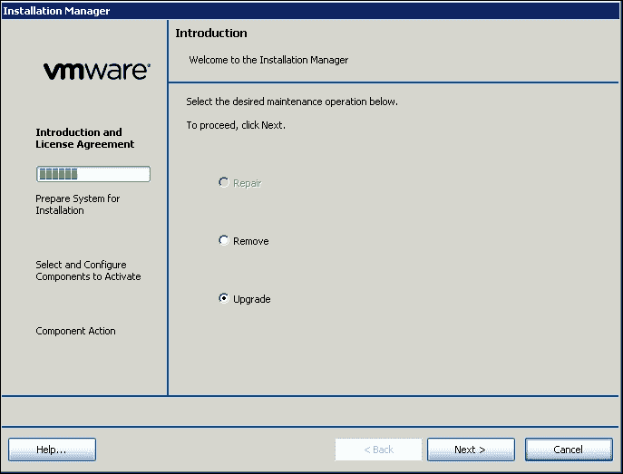

1.  接受许可协议，然后点击 **下一步**。

1.  确认需要升级的组件，并点击 **下一步**：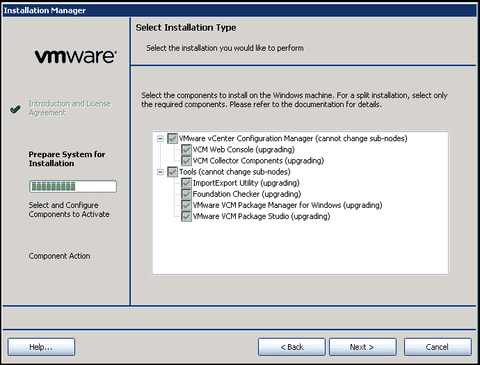

1.  等待检查完成，检查成功后点击 **下一步**；如果失败，检查需要修复的内容，解决问题后重新检查。

    ### 注意

    请注意，在执行升级时，向导中要求的详细信息应该会自动填充。如果没有，填写适当的详细信息；如果您想进行任何更改，现在是进行更改的时机，例如更改服务账户。

1.  如果您想更改 Tomcat 服务账户，提供详细信息；否则，使用默认值并点击 **下一步**。

1.  在此输入 SQL 报告服务详细信息和凭据，并点击 **验证**；验证后，点击 **下一步**：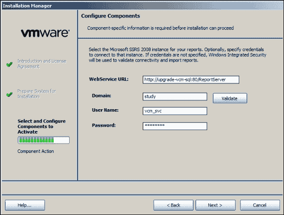

1.  输入 Collector 服务账户（如果需要），然后点击 **下一步**。

1.  如果未自动填写，输入默认的网络权限账户并点击 **下一步**。

1.  证书应该已自动选择。如果没有，点击 **选择** 选择您的证书，选择完毕后，点击 **下一步**。

1.  如果未自动填写，输入您的远程虚拟目录详细信息并点击 **下一步**。

1.  如果未自动填写，输入您的虚拟化客户端插件详细信息并点击 **下一步**。

1.  如果未自动填写，输入安装目录，并点击 **下一步**。

1.  您无法更改本地软件包缓存位置的路径；点击 **下一步**。

1.  软件仓库路径选项已预选，无法更改；点击 **下一步**。

1.  输入 Package Studio 文件夹位置并点击 **下一步**。

1.  确认详细信息并点击 **升级**：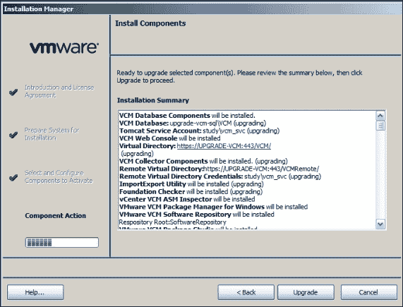

1.  升级所有组件的过程可能需要半小时或更长时间。

1.  通过检查 VCM 的版本来验证升级是否成功。

1.  安装完成后，登录 VCM 并检查版本；它应该是 **5.8.2.160**，如以下截图所示，或者是您从 [`www.vmware.com/`](http://www.vmware.com/) 下载的版本：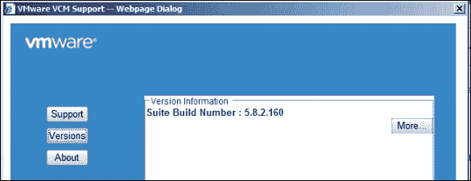

## 如何操作...

我们在同一服务器上安装了最新版本的 VCM，并使用我们基础设施收集的旧数据。

以下是升级选项，用于升级版本：

+   直接从 VCM 5.6 或更高版本升级，通过运行 VCM 5.8.x 安装管理器

+   将 VCM 版本低于 5.6 的版本升级到 VCM 5.6，然后再从 VCM 5.6 升级到 VCM 5.8.x。

较早的版本包括 VMware VCM 5.5.x、5.4、5.3、5.2.1，EMC Ionix SCM 5.0 或更高版本，或 Configuresoft ECM 4.11.1 或更高版本。

### 后续照料

升级 VCM 后，我们需要将代理升级到最新版本；请查看本章中的*升级 VCM 代理*食谱以进行操作：

+   从旧版本升级到 5.8.1 版本的代理存在一个小 bug（已在 5.8.2 中解决）；请查看第九章中的*故障排除代理升级*问题食谱及其后面的内容，了解如何解决该问题。

+   升级完成后，浏览 VCM 控制台，检查是否所有以前管理的服务器（如 vCenter、vCloud 和 VCNS）都能看到。

## 还有更多……

如果你在基础设施中指定了管理代理，那么在升级后，管理代理和 VCM Collector 之间的信任可能会被破坏。为了解决这个问题，请按照以下步骤操作：

按照第九章中*故障排除代理通信问题*一节的*问题 1 - 相互认证失败*子节的步骤操作，*故障排除 VCM*。

要重新启用服务器作为管理代理，我们需要 VCM Collector 再次信任该服务器；为此，登录到 VCM 控制台并按照以下步骤操作：

1.  转到**管理**|**证书**，选择管理代理服务器。点击顶部的**更改信任状态**。

1.  在向导中，选择管理代理机器，并勾选**选中以信任，取消选中以不信任所选机器**选项。

你应该能看到管理代理服务器前的握手标志。

现在，我们需要重新启用旧的管理代理，让它像在第二章中*配置用于虚拟环境管理的管理代理机器*一节那样继续工作。

# 从以前的版本升级 VCM——并行升级

如果你不仅想升级 VCM，还想升级其底层的操作系统，那么这就是你需要参考的食谱。VCM 5.8.2 现在支持 Windows Server 2012 R2，这是进行升级的好机会。

## 准备工作

要开始这项工作，你必须确保所有用户账户已经配置好，并且具有第一章中描述的权限。你需要有一个除了服务账户外的用户账户，这个账户可以是你自己的账户，且需要有 VCM Collector 服务器上的管理员权限来执行安装。

如果使用的是物理服务器，请使用您在基础设施中使用的工具备份服务器；如果该收集器服务器是虚拟机，请为该虚拟机创建快照。

备份数据库，以便在出现问题时能够恢复到升级前的状态。如果您不清楚如何操作，可以向您的 SQL 管理员寻求帮助，以备份数据库。

您必须访问[`my.vmware.com`](https://my.vmware.com)才能下载最新的 VCM 安装 ISO 文件。

部署另一台最新支持的操作系统服务器，即 Windows Server 2008 R2、Windows Server 2012 或 Windows Server 2012 R2。请在第一章的*理解 VCM 的要求*部分下查阅 VCM 的要求，*安装 VCM*。

## 如何执行此操作...

在以下示例中，我们将执行一个两层 VCM 部署的并行升级。

本食谱分为多个部分。

### 迁移 VCM 证书

首先，我们将导出 VCM 企业证书，然后开始安装 VCM。

那么，让我们登录到旧的 VCM 服务器，并按照以下步骤导出证书：

1.  启动`mmc.exe`并添加**证书（本地计算机）**的管理单元。

1.  进入**受信任的根证书颁发机构** | **证书**；选择**VMWare VCM 企业证书...**，然后右键点击证书，选择**所有任务** | **导出...**: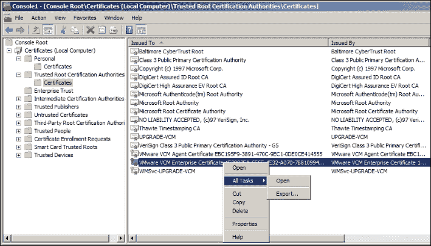

1.  这将启动向导；导出私钥。

1.  对于文件格式，选择**个人信息交换**并执行以下操作：

    1.  如果可能的话，包含证书链中的所有证书。

    1.  导出所有扩展属性。

1.  输入并确认密码；将其保存在安全的位置——我们稍后会用到它。

1.  提供一个名称和路径来保存文件，证书导出就完成了。

1.  对于证书收集器，在**个人** | **证书**下执行相同的过程。

1.  将证书复制到新的 VCM 服务器，然后从导出的原文件夹中导入它们。导入这两个证书时，请使用之前设置的相同密码。

1.  在*禁用并停止 VCM 服务*后，*关闭*旧的 VCM 服务器。

### 将 VCM 迁移到新服务器

一旦证书可用，我们可以通过以下步骤开始部署新的 VCM 实例：

1.  登录到新创建的 VCM 服务器并挂载从[`my.vmware.com/`](https://my.vmware.com/)下载的 VCM 安装 ISO。

1.  导航到挂载的 ISO，右键点击`setup.exe`，选择**以管理员身份运行**。

1.  选择**高级安装**。

1.  单击**下一步**进入介绍页面。

1.  单击**下一步**以进入专利信息页面。

1.  阅读并接受许可协议，选择**我为客户/最终用户的授权代理人和/或代表**和**我已阅读上述条款和条件**。

1.  在**选择安装类型**下，选择以下选项：

    +   **VMware vRealize 配置管理器**

        +   **VCM Web 控制台**

        +   **VCM 收集器组件**

    +   **工具**

        +   **导入导出工具**

        +   **基础检查器**

        +   **VMware VCM 包管理器（Windows 版）**

    +   **VMware VCM 包工作室**

1.  安装程序将执行先决条件检查，并在检查成功时显示结果。点击**下一步**；如果有失败，请点击**查看结果**，解决任何错误和警告，然后重新检查。

    ### 提示

    在没有错误之前不要继续。

1.  在下一页，输入序列号。

1.  在**配置组件**页面，提供与早期 VCM 实例一起使用的 SQL 服务器的主机名和 VCM 作为数据库名称（如果你将 VCM 数据库命名为其他名称，请提供该名称），然后点击**验证**：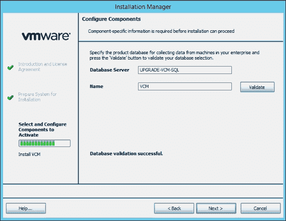

1.  在下一页，提供 Tomcat 服务账户及其密码。

1.  在下一页，提供**WebService URL**中的详细信息（这是 SQL 服务器的路径——与旧 VCM 部署相同）。提供安装 Web 控制台的路径。以下截图提供更多详情：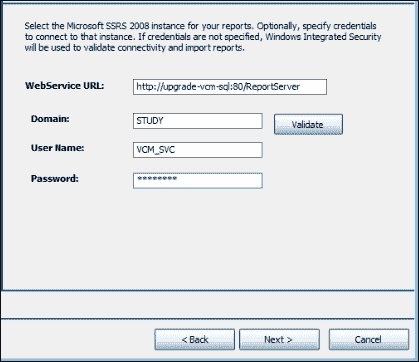

1.  提供应用程序的 URL，默认即可。

1.  我们可以提供 SMTP 地址；默认是收集器服务器的。如果你现在不知道，也可以稍后在 VCM 控制台中配置。

1.  提供安装收集器组件的路径并接受 SSL3 警告。

1.  提供用于存储暂存数据的路径；这是在将数据添加到数据库之前暂时存储数据的路径。

1.  提供收集器服务账户的详细信息；该账户将被授予作为服务登录的权限；接受提示。

1.  提供网络权限账户的详细信息；我们可以稍后添加任意多个账户。目前我们至少需要一个。关于此账户的更多信息可以在第一章的*服务账户*部分中找到，*安装 VCM*。

1.  下一页是证书页面；在这里，我们需要重用从旧的 VCM 服务器导出的证书。

1.  点击**选择**并提供收集器和企业证书：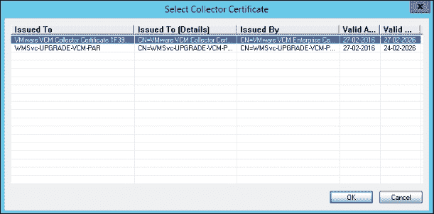

1.  提供虚拟目录的详细信息以及访问它的凭证。

1.  提供虚拟化客户端插件的凭证。

1.  在下一页，提供安装包管理器组件的路径。

1.  在下一页，提供本地包缓存的路径。

1.  在下一页，提供软件库和本地缓存的路径。

1.  提供虚拟目录名称。

1.  提供包工作室组件的路径。

1.  最后，你将进入总结页面。检查选项并点击**安装**: 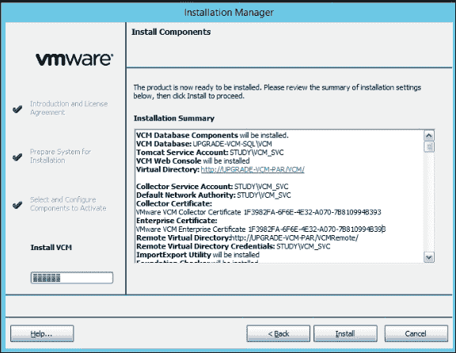

1.  一旦 VCM 成功安装，使用安装 VCM 时所用的账户登录控制台。检查所有受管机器是否可用，以及你配置的所有虚拟基础设施元素是否存在。

1.  还要检查版本—它应该是**5.8.2.160**，如下截图所示：

1.  对控制台上任何可用的受管虚拟机进行采集。

## 工作原理...

我们升级到了最新的 Windows 操作系统，然后将 VCM 安装迁移，以获得优势。也就是说，如果你使用的是微软不再支持的旧版本操作系统，或者该操作系统不被支持作为 VCM 的*基础*操作系统，那么你可以在保留所有旧数据的情况下进行迁移。如果你的旧服务器是物理服务器，还可以进行硬件刷新。

当我们执行并行升级时，我们从旧操作系统迁移，但仍然使用旧数据库。由于保留了旧数据库，因此所有采集的数据在升级后都会保留下来。我们保留了所有代理和所有已经配置的 vCenter 服务器。这有助于我们将旧配置与 VCM 的最新版本和最新支持的基础操作系统保持一致。

选择正确的证书是成功的关键。如你所知，安装代理时会使用证书。如果我们重新生成或使用错误的证书，代理与服务器之间的通信将中断，届时我们将不得不安装一个新的代理，并从服务器获取最新的证书。

### 后续操作

请参考前一个食谱中相应部分的后续操作说明。

## 还有更多...

请参考前一个食谱中的相应部分。需要按照相同的步骤进行。

# 将 VCM 从一个域迁移到另一个域

在某些情况下，我们需要从一个域迁移到另一个域，并且不能丢失我们管理的机器的所有历史数据。在本食谱中，我们将查看如何将 VCM 服务器从旧域迁移到新域。

## 准备工作

确保 VCM 收集器服务器的网络和 DNS（正向和反向）配置正确。将 VCM 收集器添加到新域中，并根据第一章中*理解 VCM 的要求*小节下的*服务账户*部分的描述，创建或识别你要使用的域账户。

## 如何操作...

要将 VCM 服务账户更改为使用不同的域账户运行，请按照以下步骤操作：

1.  在 VCM 数据库服务器上，运行以下 SQL 更新查询，针对核心 VCM 数据库进行操作。根据需要替换适当的名称：

    ```
           DECLARE     @collector_service_account NVARCHAR(128) 
           SET @collector_service_account = N'domain-name\account-name'      

           DECLARE     @collector_config_id INT 
           SELECT @collector_config_id = c.configuration_id       
                 FROM dbo.ecm_sysdat_configuration_values c       
                 WHERE c.configuration_name = 'collector_service_account'      

           EXEC dbo.ecm_sp_configuration_values_update       
                 @configuration_id = @collector_config_id,       
                 @configuration_value = @collector_service_account      

           EXEC dbo.ecm_sp_security_collector_service_account_setup       
                 @collector_service_account = @collector_service_account 

    ```

1.  选择并停止以下服务：

    +   **VCM 收集器**

    +   **VCM 数据库服务**

    +   **VCM 补丁管理**

1.  右键点击每个服务，选择**属性**，然后选择**登录**选项卡。

1.  将账户凭据更改为新账户，并点击 **确定**。

1.  进入 **开始** | **管理工具** | **组件服务**。

1.  在左侧，进入 **控制台根** | **组件服务** | **计算机** | **我的电脑** | **DCOM 配置** | **LicenseDcom**。

1.  右键点击，选择 **属性**，然后选择 **身份** 标签。

1.  选择 **此** 用户，输入新域账户凭据，并点击 **确定**。

1.  从 **开始** | **管理工具** | **服务**，重新启动你停止的服务。

1.  进入 **开始** | **管理工具** | **服务器管理器**。

1.  在左侧，导航到 **服务器管理器**（主机名） | **配置** | **本地用户和组**。

1.  双击 **组**。

1.  选择 `VCM_LDP_GROUP`，右键点击并选择 **属性**。

1.  删除旧账户并添加新账户。

1.  导航到 **服务器管理器**（主机名） | **配置** | **服务**，双击 **组**，选择 `CSI_COMM_PROXY_SVC`，并重复此过程来更换账户。

    ### 注意

    注意，如果你运行 VCM 安装程序的 **修复** 选项，账户更改会恢复为安装时所指定的账户。

    注意，如果你运行 VCM 安装程序来升级到 VCM 的新版本，账户更改将默认为你在旧版本安装时所指定的账户。升级过程中请输入你想要的账户更改。

1.  将新域添加到 VCM 的网络权限中。

1.  添加新域所需的任何新用户。

## 它是如何工作的…

VCM 在安装时使用你指定的账户运行服务。安装完 VCM 后，你的站点条件可能需要你将服务的运行账户从最初的域账户更改为其他域账户。

此过程同样适用于你需要将服务从内置 Windows 账户更改为域账户的情况。要从域账户更改为内置账户，请参阅下一个操作步骤，我们将在那里提供新的凭据来运行新域中的服务，并在 VCM 中保留历史数据。

# 应用新许可证密钥

在你安装 VCM 时，你可能使用了临时许可证密钥，或者基础设施的规模可能比预期增长，现在你需要提供新的许可证来管理基础设施。此时，你需要提供新密钥，输入新的序列密钥并不是一个简单的控制台选项；这里有一个名为 **jlicense.cmd** 的命令行工具可以帮助你完成此操作。

## 准备就绪

获取要使用的新密钥。你必须在 VCM 控制台上拥有管理员权限。

## 如何操作…

使用 VCM 管理员权限登录到 VCM 服务器，并按照以下步骤操作：

1.  以管理员权限启动 CMD，并进入 `X:\Program Files (x86)\VMware\VCM\Tools`（*X* 是 VCM 安装所在的驱动器）。

1.  运行 `jlicense.cmd -k xxxxx-xxxxx-xxxxx-xxxxx-xxxxx`（这是你要添加到 VCM 的新密钥），如以下截图所示：

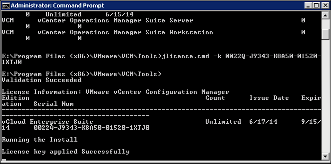

## 它是如何工作的…

它将附加到 VCM 的现有容量上，也就是说，它将增加我们可以管理的机器数量以及密钥的过期日期。

使用**jlicense.cmd**工具，您可以：

+   更新单个服务器的许可证密钥

+   更新单个工作站的许可证密钥

+   输入服务器和工作站的两个密钥

+   输入单个服务器或工作站的许可证密钥，或者输入两个用于服务器和工作站的许可证密钥。

以下是如何使用 JLicense 工具：

+   若要显示 JLicense 帮助信息，请运行以下命令：`jlicense -h`

+   若要评估许可证密钥但不安装它，请运行以下命令：

    ```
     jlicense -n -k xxxxx-xxxxx-xxxxx-xxxxx-xxxxx

    ```

    在此，`xxxxx-xxxxx-xxxxx-xxxxx-xxxxx`是许可证密钥

+   要更改许可证，请运行以下命令：

    ```
     jlicense -k xxxxx-xxxxx-xxxxx-xxxxx-xxxxx

    ```

    在此，`xxxxx-xxxxx-xxxxx-xxxxx-xxxxx`是许可证密钥

# 升级 VCM 代理

在 VCM 服务器升级后，您需要升级 VCM 代理。本篇内容涉及 Windows 和 Linux 的 VCM 代理从先前版本的升级。

## 准备工作

您必须拥有一些旧版代理，以便将它们升级到最新版本，并且它们应该与 VCM 服务器进行通信。

## 如何执行...

在 Windows 的情况下，有两种方式来升级代理。从控制台中，您可以选择**升级**作为选项，或者选择安装并在向导中选择**移除当前代理**。这两个过程都完成同一任务——将代理升级到最新版本——但**安装并移除当前版本**需要更多时间。两种选项都保留所有以前收集的数据。

我们将在本篇中使用**升级**方法。

### Windows

这是在 Windows 中执行的方法：

1.  使用管理员权限登录 VCM。

1.  导航至**管理** | **机器管理器** | **授权机器** | **授权 Windows 机器**。

1.  右键点击机器并选择**升级代理**: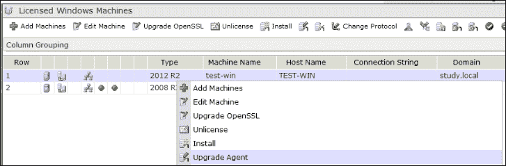

1.  在**机器**页面，选择要升级的 Windows 机器，并点击箭头将机器移至选定面板。点击**下一步**。

1.  在安装选项页面，选择或验证代理安装选项，并点击**下一步**。

1.  在**计划**页面，安排操作并点击**下一步**。

1.  在**重要**页面，验证摘要并点击**完成**。

1.  点击**作业**按钮，查看作业是否已成功完成。

1.  作业完成后，检查控制台以查看代理版本。它应该是最新版本，如下图所示：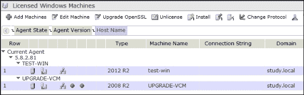

### Linux

以下是在 Linux 中执行的方法：

1.  使用管理员权限登录 VCM。

1.  点击**控制台**，并进入**UNIX 远程命令** | **UNIX 代理升级**。

1.  在**UNIX 代理升级**数据网格中，点击适合操作系统和机器版本的远程升级包：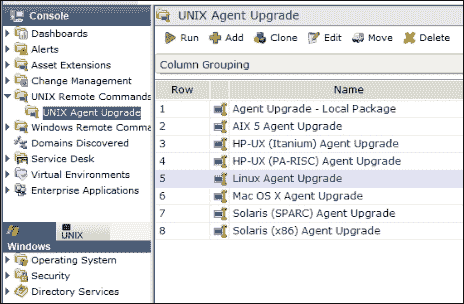

1.  点击**运行**，并按照向导将远程命令和升级包发送到所选机器上的代理。

    代理将执行包升级。

1.  选择你想要升级代理的管理机器。

1.  在**计划**页面，选择**立即运行远程命令**或安排稍后操作，然后点击**下一步**。

1.  在**重要**页面，验证总结并点击**完成**。

1.  验证任务是否成功完成。

1.  在管理机器上执行一次收集。

1.  在 VCM 控制台上检查代理的状态；它应该看起来像下面的截图：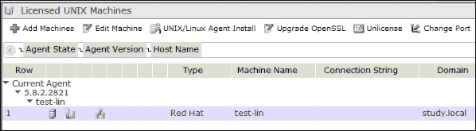

## 它是如何工作的...

我们从 VCM 控制台推送最新的安装程序，它被复制到管理机器上，开始升级旧的代理文件，最终在管理机器上创建一个 VCM 服务，并返回成功状态。

代理安装完成后，你可以执行一次收集，以确保升级过程中没有出现任何问题。

在 Linux 升级的情况下，过程将从 VCM 控制台复制最新的代理安装程序，并附带在 Linux/Unix 机器上运行的远程命令。然后，执行脚本来安装代理。

## 还有更多...

观察到在大多数代理或服务器升级后，我们需要按照*问题 1 - 互认证失败*小节中的步骤操作，*故障排除代理通信问题*配方，见第九章，*故障排除 VCM*，因为升级后的代理与 VCM 收集器之间的信任被破坏。

你将看到前面配方中描述的错误消息，因此只需按照步骤解决即可。

## 另请参阅

+   在从旧版本升级到 5.8.1 版本的代理时，有一个小 bug（在 5.8.2 中已解决）；请查看第九章中的*故障排除代理升级*问题配方，*故障排除 VCM*。

# 更改服务账户密码

有时我们需要更改服务账户的密码；在这个配方中，我们将学习如何操作。

## 准备中

你必须有新的密码可供替换。

## 如何操作...

我们将查看 VCM 使用的各种服务账户，如果需要，我们可以更改它们。

要更新 VCM 服务账户的密码，请按以下步骤操作。

### 收集器服务账户

1.  在收集器上，转到**开始** | **管理工具** | **服务**。

1.  选择并停止以下服务：

    +   **VCM 收集器**

    +   **VCM 数据库服务**

    +   **VCM 补丁管理**

1.  右键点击每个服务，选择**属性**，然后选择**登录**标签。

1.  更新账户密码并点击**确定**。

1.  转到**开始** | **管理工具** | **组件服务**。

1.  在左侧，转到**控制台根目录** | **组件服务** | **计算机** | **我的计算机** | **DCOM 配置** | **LicenseDcom**。

1.  右键点击，选择**属性**，然后选择**身份**标签。

1.  在**此**用户下，更新密码并点击**确定**。

### VCM 远程服务账户

我们在安装过程中提供了 VCM 远程用户的详细信息。

VCM 远程服务帐户由 VCM 远程客户端用于匿名访问 Web 服务器上的 VCM 远程虚拟目录。请按照以下步骤操作：

1.  在 Web 服务器上，进入**开始** | **管理工具** | **IIS 管理器**。

1.  在左侧，导航到**{web-server-hostname}** | **站点** | **默认网站** | **ECMRemoteHTTP**。

1.  双击**身份验证**。

1.  选择**匿名身份验证**。

1.  在右侧的**操作**窗格中，选择**编辑**。

1.  点击**设置**。

1.  输入现有的域名/用户名，然后输入新密码，点击**确定**。

1.  导航到**{web-server-hostname}** | **站点** | **默认网站** | **VCMRemote**，并重复这些步骤来更改密码。

**网络权限帐户**

请按照以下步骤为网络权限帐户操作：

1.  在 VCM 中，点击**管理**，进入**设置** | **网络权限** | **可用帐户**。

1.  点击**编辑密码**。

**SSRS**

对于 SSRS 帐户，请运行`RSConfig`命令以更改嵌入的帐户信息。

## 它是如何工作的...

VCM 在安装过程中运行在您指定的帐户下。安装 VCM 后，您所在位置的条件可能要求更改帐户的密码，这时也需要在 VCM 中更新密码。

我们可以使用刚才讲解的步骤进行这些更改。

# 管理用户

您需要管理 VCM 登录并分配角色给有访问权限的用户。角色决定每个用户的访问级别，可以针对特定机器组和 VCM 功能进行调整。

## 准备就绪

如果您计划创建自定义角色，它们必须在开始本步骤之前准备好。

## 如何操作...

按照以下步骤添加新用户和组，并授予他们适当的权限：

1.  导航到**管理** | **用户管理器** | **VCM 登录**。

1.  点击**添加用户**。

    ### 注意

    请注意，您不能将 Collector 服务帐户添加为 VCM 登录。

1.  选择**输入域帐户**并点击**下一步**。

    ### 注意

    请注意，也可以添加单个 Active Directory 帐户。添加组确保通过 Active Directory 进行基于角色的访问控制。

1.  输入`DOMAIN\Group`格式的安全组并点击**下一步**。

1.  双击**管理员**（或用于一般访问的较低角色），点击**下一步**。

1.  点击**完成**。

## 它是如何工作的...

当 VCM 安装时，安装者会在控制台上获得管理员权限。我们需要添加用户或组来授予他们访问权限。通过遵循这个步骤，我们可以为需要访问的用户添加权限。

### 注意

请注意，当用户启动 VCM 时，如果分配了多个角色到他们的登录账户，会出现一个下拉列表，允许用户选择所需的角色。要使用特定角色自动登录 VCM，用户可以勾选 **自动使用此角色登录** 选项。要切换角色或不自动登录，用户可以选择不同的角色或取消勾选此选项。

### 默认角色

这是 VCM 默认角色列表及每个角色的简短描述：

| **序号** | **名称** | **描述** |
| --- | --- | --- |
| **1** | 管理员 | 顶级角色。管理员对数据库中的所有内容都有权限。 |
| **2** | 域控制器管理员 | 对域控制器动态机器组具有完全访问权限的角色。 |
| **3** | 只读 | 仅对所有机器和数据具有读取权限的角色。 |
| **4** | 帮助台 | 仅允许更改域控制器的密码。 |
| **5** | IIS 管理员 | 对 Microsoft Internet Information Servers 动态机器组具有完全访问权限的角色。 |
| **6** | 服务器管理者 | 对服务器动态机器组具有完全访问权限的角色。 |
| **7** | SQL Server 管理员 | 对 Microsoft SQL Server 动态机器组具有完全访问权限的角色。 |
| **8** | 工作站管理员 | 对工作站动态机器组具有完全访问权限的角色。 |
| **9** | VCM 审计员 | 具有对许可证管理器的读取权限的角色。 |
| **10** | `AD_Admin` | 内置角色，具有访问 AD 数据和 AD 管理的权限。 |
| **11** | `AD_User` | 内置角色，仅具有访问 AD 数据的权限。 |
| **12** | 变更受限 | VCM **变更受限** 角色。拥有此角色的用户可以发现机器，从中收集数据，评估它们，显示公告和模板详情，检查更新并查看历史记录。用户可以添加、编辑和删除报告、合规性规则和规则组，以及合规性和补丁评估模板。拥有 **变更受限** 角色的用户还可以安装 VCM 代理、升级 VCM 或卸载它。 |

## 还有更多...

在创建角色时，我们需要了解访问规则，因为它们定义了用户可以访问的 VCM 区域以及他们可以执行的操作。

VCM 角色和访问规则是相辅相成的；角色定义了谁可以访问哪些区域，而规则定义了用户可以获得的访问权限类型，如 **无权限**、**只读**、**完全访问** 或 **自定义**。当您选择 **自定义** 时，它将细化到非常具体的权限，您可以选择单个特权，如仅 **添加自动部署** 或 **运行报告**。

您可以使用 14 个默认访问规则，或根据您的需求创建新的规则：

1.  要创建新的访问规则，请登录 VCM 控制台，进入 **管理** | **用户管理** | **VCM 访问** | **访问规则**，然后点击 **添加规则**。

1.  提供一个友好的名称和描述。

1.  在 **规则类型** 下，选择 **基础规则**（这定义了要访问的 VCM 数据类型和区域）或 **管理员访问规则**（访问 VCM 管理区域）。

1.  对于 **基本规则**，在 **数据类型** 下，包括数据类型，即机器数据或 Active Directory 数据，然后定义对 VCM 控制台的访问，除了 **管理** 标签。

1.  **管理员访问规则** 定义了在 **管理** 标签中定义的访问类型，如 **无**、**只读**、**完全控制**，或者使用 **自定义** 进行详细设置。

1.  最后，在向导的 **重要** 页面上点击 **完成**，关闭并创建这条新的访问规则。

如前所述，已创建了 12 个默认角色，但如果您仍有需要其他角色的用例，则可以创建自己的角色。请按照以下步骤操作：

1.  登录到 VCM 控制台，转到 **管理 **| **用户管理器** | **VCM 访问** | **角色**。

1.  点击 **添加角色** 按钮并按照向导操作。

1.  创建角色时，您将需要一些信息。首先，为新创建的角色提供名称和描述。

1.  对于 **角色访问**，我们可以选择 **机器数据**（根据所选机器组访问数据）、**Active Directory**（根据 AD 结构访问 Active Directory 对象）或 **管理员**（访问管理功能）访问。

1.  在下一页中，您可以根据 **机器数据访问** 过滤此新角色用户可以访问的机器组。

1.  在 **Active Directory** 页面下，选择应用于 AD 根目录的 **访问规则**，如果已配置。

1.  对于 **管理员访问**，选择适当的规则以提供访问权限。

1.  在 **登录** 下，选择要分配此角色的任何登录名，并在 **重要** 下查看后，关闭向导以完成。

# 停用 VMs – 手动 VM 清除

作为受管理机器的生命周期管理的一部分，我们需要从 VCM 控制台中删除受管理机器的详细信息。

## 准备工作

您必须提供要从 VCM 中移除的机器名称。

## 如何操作...

这是一个两步过程：首先释放许可证并保留数据。接下来，清除所有内容并从 VCM 数据库中移除受管理机器。

### 取消许可受管理机器

1.  使用管理员特权登录 VCM。

1.  转到 **管理** | **机器管理** | **已许可的机器** | **已许可的 Windows 机器** 或 **已许可的 UNIX 机器**。

1.  右键单击要从显示中移除的机器名称。

1.  选择 **取消许可** 选项并按照提示操作。

### 注意

请注意，这将将机器返回到 **可用机器** 列表，并释放机器的许可证以便重用。

### 清除该机器

1.  使用管理员特权登录 VCM。

1.  转到 **管理 **| **机器管理** | **可用机器**。

1.  从这里，如果需要，我们可以为机器授权并将其移到 **已许可的 Windows 机器** 或 **已许可的 UNIX 机器**，或从 VCM 数据库中移除。

1.  选择机器，然后在顶部菜单中点击 **清除**。

1.  按照向导操作；它将完全从 VCM 数据库中移除该机器。

## 它是如何工作的...

该过程将从 VCM 数据库中获取记录和收集的数据，帮助我们清理 VCM 中的杂乱数据，因为我们想删除的机器已经被停用。如果这些机器没有从 VCM 中删除，我们可能会得到不正确的合规评分。我们总会有一些机器无法安装补丁，并且永远无法达到预期的评分。

## 还有更多...

如果您熟悉 vRealize Orchestrator，VMware 已经发布了一个 VCM 的包（可以在[`my.vmware.com`](https://my.vmware.com)下载）。借助这个包，您可以创建一个工作流来移除/清除托管机器。

# 停用虚拟机 – 计划虚拟机记录清除

在云时代，我们希望虚拟机停用能够自动完成，这样我们的运维团队可以做更多创意性工作，而不是清理 VCM 数据库。

## 准备工作

您必须有权限访问托管 VCM 数据库的 SQL 服务器，并且需要了解 SQL 管理工作室的基本操作。

## 如何操作...

以下存储过程可以在 VCM 数据库（`VCM`）中作为计划任务实现。该任务将清除过去 3 周未联系的虚拟机记录。

在脚本中修改`@expire int = xx`（机器未联系的天数）值：

```
USE [VCM] 
GO 
/****** Object:  StoredProcedure [dbo].[ecmSVC_sp_remove_noncollected_machines]    Script Date: 11/20/2012 11:40:58 ******/ 
SET ANSI_NULLS ON 
GO 
SET QUOTED_IDENTIFIER ON 
GO 
ALTER PROCEDURE [dbo].[ecmSVC_sp_remove_noncollected_machines] 
@expire int = 21, 
@value NVARCHAR(5) = 'True' 
 AS 
/**************************************************************************/
Procedure:  dbo.ecmSVC_sp_remove_noncollected_machine 
--------------------------------------------------------------------------- 
REVISION HISTORY 
Modified:  <YYYY.MM.DD> by <Author> 
    Description - 
    Issue/ATS# - 
Created:   2006-05-11 by Chris Lennon 
--------------------------------------------------------------------------- 
DESCRIPTION 
  Check for machines not pingable and haven't been collected over x amount
  of days 
  Removed from the Licensed Machines into the Available Machines and as an 
  option purge from ECM. 
---------------------------- Copyright Notice ----------------------------- 
This code may not be copied, altered, reused, or redistributed in any way without the express written consent of Configuresoft, Inc. 
   Copyright 1998-2006 Configuresoft, Inc.  All rights reserved. 
---------------------------- Configuresoft, Inc. -------------------------- 
**************************************************************************/ 
BEGIN 
    DECLARE 
        @uids VARCHAR(8000), 
        @creator_id int, 
        @owner_id int 
    SELECT @uids = '' 

    --Locate machines with no ping and not collected over x amount of days 
    SELECT @uids = @uids + ISNULL(LTRIM(CAST(machine_id AS NVARCHAR(32))), 
    '') + N'|' 
    FROM ecm_view_rpt_machine_info_all 
    WHERE (connection_state = 'ICOStatusConnectionNoPing16' 
    or connection_state = 'ICOStatusConnectionNoName16') 
    and [date last contacted] < DATEADD(dd, -@expire, GETUTCDATE()) 
    and managed = '1' 
    -- remove trailing pipe if it exists 
    IF RIGHT(@uids, 1) = '|' 
    BEGIN 
        SELECT @uids = SUBSTRING(@uids, 1, LEN(@uids) - 1) 
    END 
    IF @uids <> '' 
    BEGIN 
            --Remove from Licensed Machines 
            exec dbo.ecm_sp_machines_set_state @uids, N'|', 5 

            --Purge from ECM if @value is TRUE 
            IF @value = 'TRUE' 
            BEGIN 
                SELECT @creator_id = dbo.userid() 
                SELECT @owner_id = dbo.role_current() 
                exec dbo.ecm_sp_machine_delete_all_data @uids, 1, N'|',             
                @owner_id, @creator_id 
            END 
    END 
END 

```

### 在 SQL 中计划任务

1.  展开**SQL Server 代理**节点，在**SQL Server 代理**的**作业**节点上右键点击，并选择**新建作业**：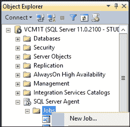

1.  在**新建任务**窗口中，在**常规**标签页中输入任务名称和描述：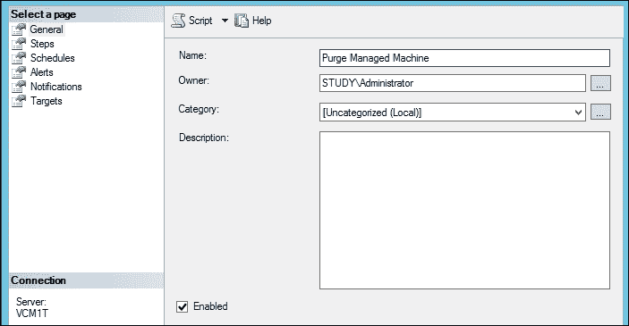

1.  在窗口的左侧选择**步骤**，然后点击底部的**新建**。

1.  在**步骤**窗口中，输入步骤名称并选择您希望查询运行的数据库：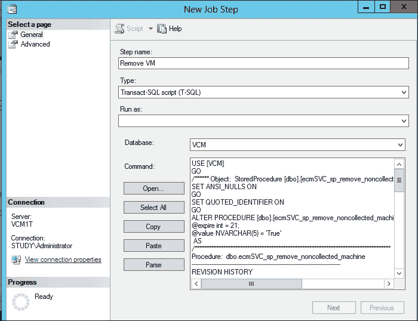

1.  将您想要运行的`T-SQL`命令粘贴到命令窗口中，然后点击**确定**。

1.  点击**新建任务**窗口左侧的**计划**菜单，并输入计划信息（例如，设置为每天并指定时间）。

1.  点击**确定**，就完成了。

## 它是如何工作的...

该任务将按照您提供的时间表运行，并清理过去 21 天没有通信的托管机器；如果这个时间段看起来太长，您可以根据需求在脚本中修改为适当的天数。
