# 第 8 章。与 vROps 和调度集成

在本章中，我们将涵盖以下步骤：

+   安装和配置 vROps 管理包以支持 VCM

+   配置 vROps – VCM 合规性映射和调度

+   调度操作系统和合规性数据收集

+   调度合规性

+   调度报告

+   调度 vCenter 收集

+   调度 vCenter 发现

# 介绍

在本章中，我们将讨论两个不同的主题。首先，我们将在 vROps 中安装 VCM 适配器并集成它们，以便可以从 VCM 发送合规性数据到 vROps。

没有人喜欢坐在控制台前面做工作，自动化是一切的关键。在本章中，我们将介绍 VCM 的调度器功能，例如调度作业以收集来自托管机器的数据，推送合规性详细信息到 vROps，或者导出报告并保存在共享位置或通过电子邮件发送给某人。

所以，让我们从 vROps 和 VCM 的集成开始。

# 安装和配置 vROps 管理包以支持 VCM

将 VCM 与 vROps 集成，可以从 VCM 向 vROps 控制台提供合规性和事件详细信息。这意味着在故障排除时，您可以了解特定服务器的情况。事件可以提供信息，例如服务器何时重新启动，路径何时完成，或者从 VCM 安装软件的时间。除此之外，VCM 还可以推送关于托管机器的合规性详细信息及其已创建的映射。

## 准备工作

我们需要一个已配置的 VCM，其中包含完成的合规性配置，并且有管理员访问权限的工作中的 vROps 服务器。我们还需要可以登录 VCM 并在 VCM 应用程序中具有管理员访问权限的用户凭据。我们需要从 [`solutionexchange.vmware.com/`](https://solutionexchange.vmware.com/) 下载最新的 VCM 解决方案。

vROps 必须监控由 VCM 管理的相同 vCenter 服务器。

## 如何操作...

在这个步骤中，我们将安装 vROps 的 VCM 适配器。我们将登录 vROps 并按照给定步骤操作：

1.  使用管理员帐户登录 vROps，或其他具有管理员权限的帐户，并转到**解决方案**。单击**解决方案**下方的绿色加号符号，如下图所示：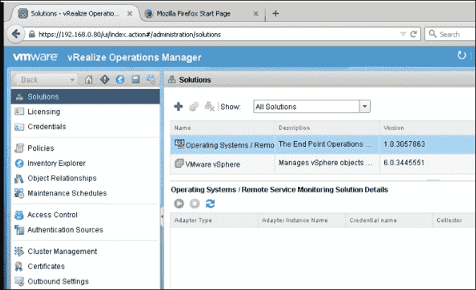

1.  点击**浏览**，转到从互联网下载 VCM 解决方案的位置，然后点击**上传**。然后，您将看到类似以下截图的屏幕：

1.  如果 vROps 显示未签名解决方案警告，请接受它。

1.  接受 EULA。

1.  让 vROps 完成安装，完成后点击**完成**。

1.  这完成了适配器的安装。现在我们需要配置适配器实例。

1.  这次，在 **解决方案** 下，选择 **vSphere 的 VCM 管理包**，然后点击顶部带有两个齿轮的 **配置** 按钮：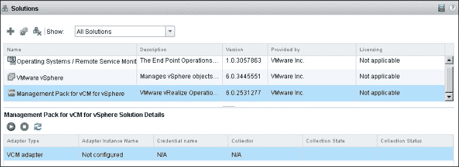

1.  提供以下信息：

    +   **显示名称**：这是适配器的显示名称

    +   **描述**：提供一个好的描述，以便其他人在你不在时能够理解它是什么。

    +   **数据库主机**：这是 VCM 数据库服务器的 IP 或名称（对于单层架构，这是 VCM 收集器服务器）

    +   **数据库端口**：这是 VCM 服务器上的 SQL 端口

    +   **数据库名称**：这是 VCM 数据库的名称；默认值是 `VCM`

    +   **数据库实例**：如果你安装了 SQL 作为 **实例**，提供名称，如果是默认的，可以留空！如何操作...

1.  提供以下信息以完成 **管理凭证** 窗口：

    +   **凭证名称**：这是凭证的描述性名称

    +   **数据库用户名**：这是 VCM 数据库的数据库用户账户

        ### 注意

        **注意**，你需要在 Active Directory 中创建一个专用服务账户，并赋予该账户在 VCM 中的管理员角色。

    +   **数据库密码**：这是用户账户的密码

    +   **数据库认证**：这将是 SQL 或 Windows 认证（推荐）

    +   **Windows 域**：在使用 Windows 认证时，提供域名，如下图所示：

    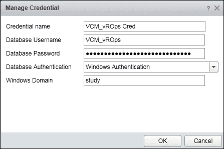

1.  提供完信息后，点击 **测试连接**。

1.  测试成功后，点击 **保存设置**。不用担心高级设置，暂时可以保留默认设置。

1.  等待 2 分钟，并检查 **管理员** | **集群管理** 是否已收集对象和指标：

## 工作原理

现在我们准备连接到 VCM 数据库并获取所需的信息，以便在 VCM 控制台上显示。vROps 会连接到 VCM 数据库并开始收集所需的详细信息，如合规分数或事件；这些会显示在 vROps 控制台上：

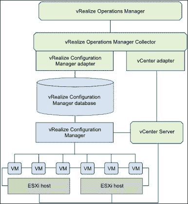

### 注意

**图片来源**：[www.vmware.com](http://www.vmware.com)

## 还有更多...

用于适配器配置的账户不能是用于交互式用户登录的账户。适配器账户会频繁地登录和退出 VCM。如果你将其作为交互式账户使用，必须定期刷新连接，这会影响你的 VCM 体验。

# 配置 vROps – VCM 合规映射和调度

一旦 VCM 与 vROps 集成，我们需要继续操作，使其能够运行合规性检查并将合规分数显示在 vROps 控制台上。我们将在 VCM 中创建一个映射，它将运行合规性检查并将结果更新到 vROps 中。

## 准备就绪

要执行此任务，你应该已经完成了之前的操作步骤，安装了管理包并进行了配置。

## 如何操作...

我们需要以管理员权限登录 VCM 控制台以执行此操作。登录后，请按照步骤完成映射：

1.  导航至 **合规性** | **机器组合规性** | **vCenter 操作经理徽章** | **映射**，然后点击 **添加**：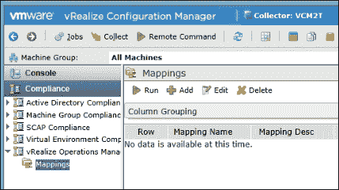

1.  启动向导时，提供适当的名称和描述：

    +   **选择徽章**：**风险合规性**

    +   **汇总类型**：**简单百分比**

    +   **选择组上下文**：根据需求

1.  选择 **正确的机器组**。

    当映射运行时，它将针对所有属于此机器组的机器进行运行。

1.  选择 **对应的合规性模板**。

    选择需要与之前选定的机器组进行合规性检查的模板。您可以选择为您的组织创建的合规性模板，或者选择从互联网下载的任何标准模板。

1.  点击 **完成**。这将保存映射。

    一旦映射创建完成，我们需要运行此映射，以便计算属于机器组的机器的合规性分数，然后将结果告知 vROps 以便在 vROps 控制台显示。

1.  选择映射，然后点击顶部的 **运行** 按钮。

1.  它将首先对 **机器组** 运行合规性检查，然后当 vROps 通过管理包更新详细信息（如 *vROps 管理包的安装和配置* 食谱中所述）时，状态将更新。

    根据机器组中机器的数量和合规性模板中的规则数量，可能需要一些时间。

1.  要检查 vROps 中的合规性选项卡，请登录 vROps 控制台并导航至 **环境** | **vCenter 适配器** | **虚拟机**，然后选择 **机器转到分析** | **合规性**。

    您将看到机器的合规性状态。

    它将显示通过和失败的规则数量，并显示用于检查合规性的合规性模板以及 VCM 报告的整体合规性状态：

    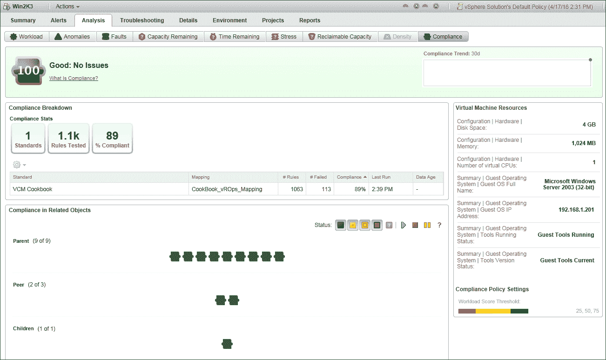

一旦映射完成，我们可以安排此映射，以便它按照计划更新 vROps。从我们上次停下的地方继续：

1.  导航至 **管理** | **作业管理器** | **已计划**，然后点击 **添加**。

1.  在向导的 **作业类型** 页面上选择 **vCenter 操作经理合规徽章映射运行**。

1.  提供 **名称** 和 **描述**。由于 **名称** 有字符限制，您可以自由创意，所有计划任务都将集中在 VCM 中的同一位置。

1.  选择您要安排的映射：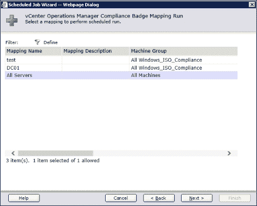

1.  选择计划并点击 **完成**。由于这与合规性相关，请确保在操作系统和合规性数据收集之后安排此任务，因为那时我们将拥有最新的数据来进行合规性检查。

## 它是如何工作的...

要获取详细信息，vCenter 服务器必须由 vROps 监控并由 VCM 管理。

当我们添加并配置 VCM 管理包时，它会从 VCM 中提取合规性详细信息，并将其显示在 vROps 控制台上。

VCM 合规性数据基于合规性模板，这些模板是针对从与 vRealize Operations Manager 中监控的相同 vCenter Server 对象收集的数据执行的。模板是必须在目标对象上存在的配置设置，以便该对象被视为符合模板标准。标准可能是 VMware vSphere 硬化指南、支付卡行业标准、健康保险携带与责任法案（HIPAA）或其他 VMware 或行业标准。

当我们选择映射时，它将首先使用所选模板进行合规性检查，然后更新 vROps 控制台上的合规性得分。得分会在受管虚拟机的**分析**|**合规性**标签中显示。该标签将显示与各种模板（如果已配置）相关的合规性状态、百分比、规则数量等。一旦我们安排了任务，该作业将确保合规性得分在 vROps 控制台上得到更新。

# 安排操作系统和合规性数据采集

**集合**是根据**筛选集**从受管机器中提取数据。如你所知，VCM 并不会在每次需要处理与受管机器相关的内容时（如**补丁**或**合规性**状态）都去访问受管机器，而是使用数据库中已有的数据，处理完数据后给出结果，例如是否需要补丁，或当前的合规性水平。

如果关于受管机器的数据没有频繁更新，VCM 会处理过时数据，这可能导致误报或合规性得分非常差，即使我们是符合要求的。

为了克服这种情况，我们可以进入 VCM 控制台，自己开始收集详细信息，或者在 VCM 中安排任务并要求它去执行。

持续的服务器管理基于从目标服务器收集的最新数据。Windows 和 Linux 数据会出现在 VCM 中，并可用于多个管理操作，包括**控制台**仪表盘和报告、**合规性视图**以及**VCM 补丁管理**。

## 准备就绪

我们需要配置好的 VCM，其中已经创建了所有必要的机器组，如在第二章中的*创建机器组*配方和*配置 VCM 以管理您的基础设施*所述。

## 如何操作...

要执行此操作，请使用管理员帐户登录 VCM，并按照以下步骤进行操作：

1.  导航到**管理**|**作业管理器**|**已安排**，然后点击**添加**：

1.  在向导的**作业类型**页面中选择**集合**。

1.  提供**名称**和**描述**。你可以发挥创意，虽然**名称**有字符限制，但如果使用命名规范会更好。可以参考第二章，*配置 VCM 以管理您的基础设施*，因为所有调度的任务都会集中在 VCM 的同一位置：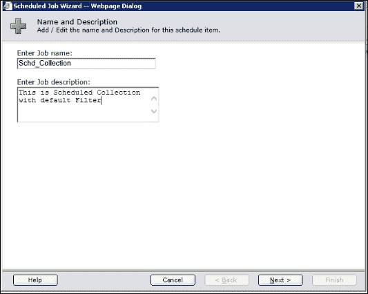

1.  根据需求选择过滤器集。如果你希望每次调度的收集任务收集所有数据，还是仅收集自上次收集以来的增量数据，请进行选择。你可以根据数据收集的频率来决定这一点。如果频率过高，并且你需要管理庞大的基础设施，可以选择**增量**，因为增量会更快：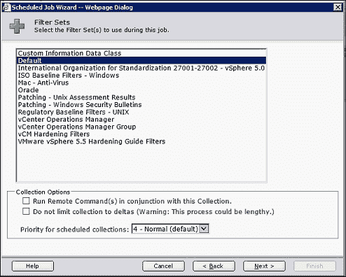

1.  选择你在*准备就绪*部分计划的机器组：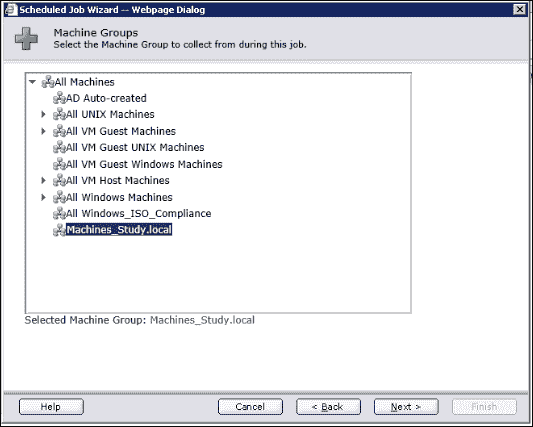

1.  提供调度信息，这将根据你的需求和你实际收集的内容而有所不同，使用你的想象力来安排此任务为**每日**、**每周**、**每月**或**一次性**：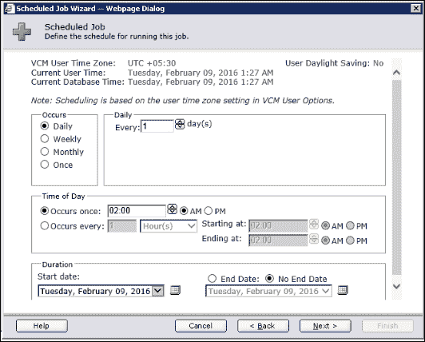

1.  确认没有冲突后，点击**完成**。

## 如何操作...

基本上，我们是在 SQL 中创建一个调度任务，该任务将根据我们创建的调度触发。然后，它将要求所有受管机器提供在选定过滤器集中定义的详细信息。数据将存储在 VCM 数据库中，进一步用于各种目的，例如检查合规性、**补丁状态**或**获取报告**。

### 注意

请注意，显示的数据仅限于上次收集时的数据。

## 更多内容...

收集过滤器控制 VCM 从受管实体收集的数据。通常，收集过滤器与合规性模板配对，只收集合规性模板要求的数据。例如，ISO 基准过滤器- Windows 收集集定义了需要导入的额外信息，用于衡量 ISO 27001 合规性。

### 注意

请注意，收集任务应与所使用的合规性模板一起安排额外的收集过滤器。此过程与 Windows 和 Linux 操作系统的收集过程相同。

## 另见

+   在开始创建此调度任务之前，请确保按照第二章中的*创建机器组*食谱，已创建所需的机器组，*配置 VCM 以管理您的基础设施*。

# 调度合规性

合规性是一个持续的过程，我们需要定期检查它，以准确了解我们所在的位置，并判断是否需要采取修复措施来保持良好的状态。在之前的步骤中，我们安排了数据收集，现在是时候利用这些数据了。

## 准备就绪

我们需要确保 VCM 数据库中的最新数据可供处理，因此请在数据收集后几个小时安排合规性检查，以便它有足够的时间更新数据库。

## 如何操作...

要执行以下操作，使用管理员账户登录 VCM 并按照步骤操作：

1.  导航到**管理** | **作业管理** | **已调度**，然后点击**添加**：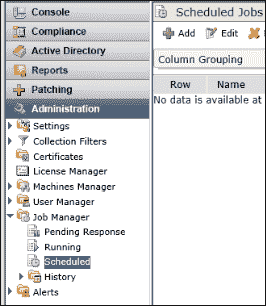

1.  在向导的**作业类型**页面选择**合规性**。

1.  提供**名称**和**描述**。你可以发挥创意，因为**名称**有字符限制，你可以使用任何命名约定，因为所有调度作业最终都会出现在 VCM 中的同一个位置：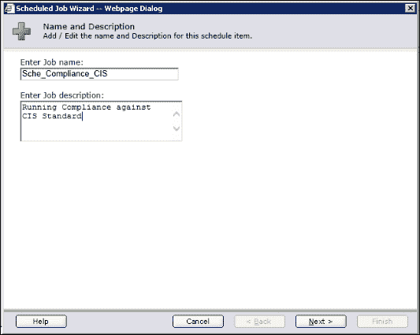

1.  选择你想要检查合规性的模板。

1.  有一些规则可以强制执行合规性，比如启动或停止服务，如果你希望自动执行合规性，可以在这里选择。

    ### 注意

    请注意，只有复杂规则可以用于强制执行合规性。当你执行合规性时，可能会破坏现有的配置，例如，如果你的安全策略要求禁用打印后台处理程序服务，那么强制执行合规性时，VCM 将禁用该服务。然而，如果你有由 VCM 管理的**打印服务器**且在 VCM 中没有创建例外，这可能会导致问题。

    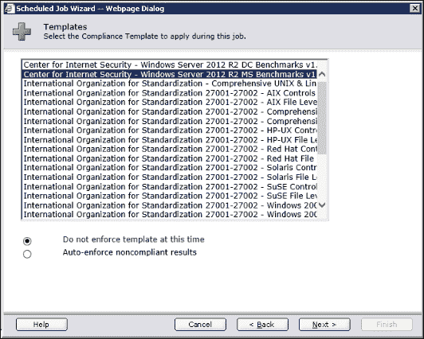

1.  选择适当的**机器组**。

1.  提供调度，确保将其安排在收集作业之后，并确保给 VCM 一些时间来收集数据并将其插入数据库。

1.  点击**完成**以关闭向导：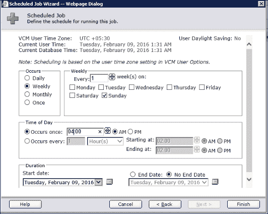

## 它是如何工作的...

每个调度作业都是 VCM 数据库中的调度作业，合规性作业使用 VCM 数据库中的数据进行处理。一旦作业完成，它将更新 VCM 控制台上的合规性统计信息，然后可以将其导出为报告，报告也可以调度。

# 调度报告

我们不希望一直坐在 VCM 控制台前导出报告。我们可以调度这些报告，并且当我们登录时它们会出现在我们的收件箱中。修补和合规性报告也可以安排自动发送给安全官员查看基础设施。由于报告是自动发送的，管理员可以利用这个时间来修复实际问题，而不是导出和发送报告。

## 准备就绪

为调度报告准备合适的名称，并创建与应运行的报告相关的机器组。对于合规性报告，确保已执行合规性检查，以便报告中有一些数据。

## 如何操作...

要执行此操作，使用管理员账户登录 VCM 并按照步骤操作：

1.  导航到**管理** | **作业管理** | **已调度**，然后点击**添加**。

1.  查看之前配方中的截图

1.  在向导的**作业类型**页面选择**运行报告(s)**。

1.  提供**名称**和**描述**，你可以发挥创造力，因为**名称**有字符限制，你可以使用任何命名约定，所有安排的任务都会出现在 VCM 的同一位置：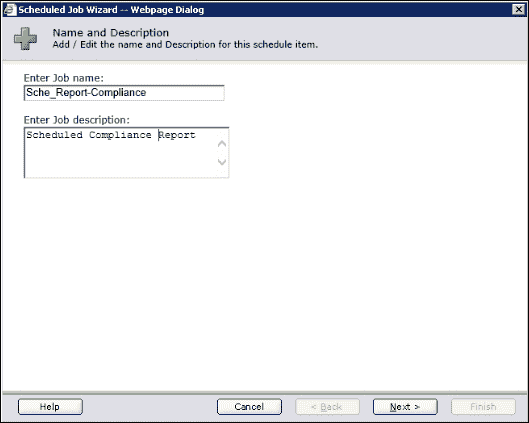

1.  在向导的**报告文件夹**页面上，选择你要安排的报告。在这种情况下，我们将选择与修补相关的报告。

1.  提供一个位置来保存导出的报告，该位置可以是一个共享位置，所有报告都会保存在该位置。

1.  选择**仅选择某些要运行的内容**：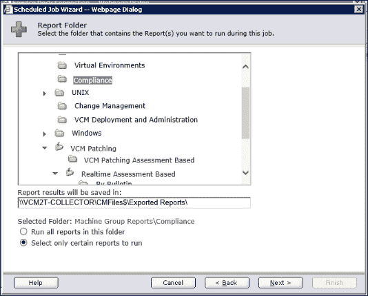

1.  选择要运行的报告：选择你要安排的报告，悬停在报告名称上以查看完整名称：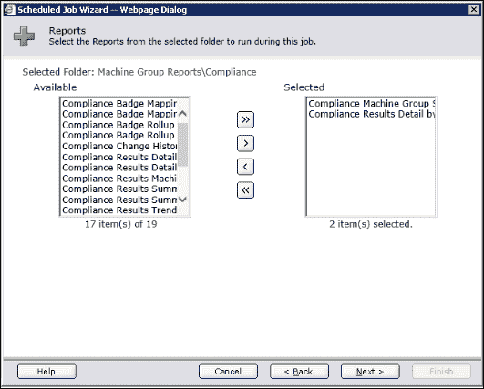

1.  点击报告名称前面的箭头以提供输入详情，详情会根据你在前面步骤中选择的报告而变化：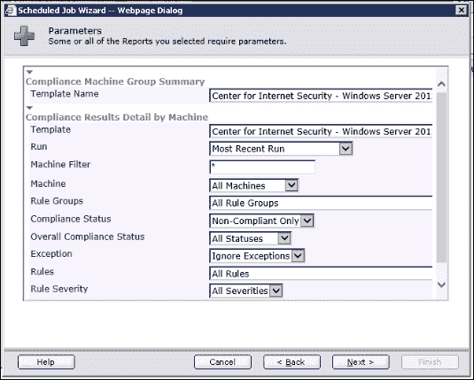

1.  提供你需要的文件格式，如果你已经配置了 SMTP，也可以通过电子邮件发送报告，并在 SSRS 上保存一些报告副本：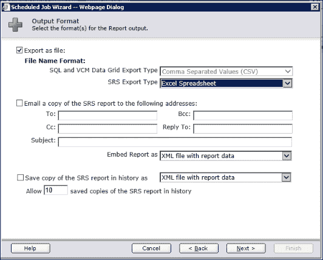

1.  选择你希望运行报告的机器组。

1.  选择安排并点击**完成**以关闭向导。

## 它是如何工作的...

VCM 会访问数据库并准备所请求的报告，然后根据选择的选项，它将以请求的格式将报告转储到共享位置并/或发送到配置的电子邮件地址。

确保你已经提前安排了依赖任务，并在开始此报告之前完成，比如在此情况下，你应先配置合规性检查，一旦完成后，你可以安排此报告，或者在已安排的修补程序完成后配置修补报告。

# 安排 vCenter 集合

要管理虚拟机，VCM 必须从注册的 vCenter 收集虚拟基础架构数据。我们可以直接在 vCenter 集合添加的机器上添加、授权并安装代理。

## 准备工作

确保通过遵循第二章中的*添加 vCenter 服务器实例*食谱，已将 vCenter 添加到 VCM 中，*配置 VCM 以管理你的基础设施*。你已按照第六章中的*导入合规性包*食谱导入了 vSphere 5.5 硬化的合规性包，*合规管理*。通过遵循第二章中的*创建机器组*食谱，创建一个仅包含 vCenter 服务器的机器组，*配置 VCM 以管理你的基础设施*。

## 如何操作...

1.  转到**管理** | **任务管理器**| **已安排**，然后点击**添加**。查看早期食谱中的截图。

1.  在向导的**任务类型**页面上选择**收集**。

1.  提供 **名称** 和 **描述**。你可以发挥创意，因为 **名称** 有字符限制，你可以使用任何命名约定，因为所有调度的任务都会在 VCM 中到达同一个地方。

1.  选择 **VMware vSphere 5.5 加固指南过滤器**。该收集过滤器集是在你准备工作部分时下载的：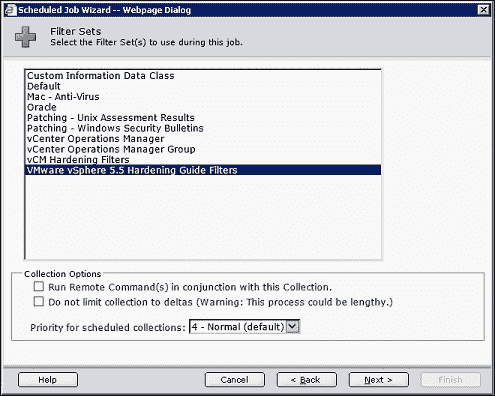

1.  选择 **vCenter 服务器机器组**。该机器组是在你准备工作部分时配置的。

1.  安排 vCenter 收集任务为每日收集。

    ### 注意

    请注意，这意味着任何新部署的服务器将每天被发现。如果你知道这些机器会频繁部署，并且希望它们尽早被发现，你可以根据需要更改调度。

## 工作原理...

在本配方中，VCM 从已经添加到 VCM 中进行管理的 VCM 服务器收集数据，然后通过执行发现和管理（如检查合规性和打补丁）使新的虚拟机可以安装代理。

## 另见

+   在第二章中的 *添加 vCenter 服务器实例* 配方，*配置 VCM 来管理你的基础设施*：确保 vCenter 已经在 VCM 中添加

+   来自 第六章的 *导入合规性包* 配方，*合规性管理*：导入 vSphere 5.5 加固的合规性包

+   在第二章中的 *创建机器组* 配方，*配置 VCM 来管理你的基础设施*：创建一个仅包含 vCenter 服务器的机器组

# 安排 vCenter 发现

**发现**用于确定是否有任何新的机器可以添加到 VCM 进行管理。如果不进行此操作，则需要手动添加和授权需要管理的机器。

在你可以从机器中收集数据之前，VCM 必须先发现环境中的机器。你可以创建一个发现规则以发现所有机器，或者你可以应用过滤器来限制 VCM 发现的机器。

### 注意

请注意，vCenter 发现必须在 vCenter 收集之后进行。这看起来有些反直觉，但简单来说，vCenter 发现是通过 vCenter 收集来发现那些已经通过 vCenter 管理的新虚拟机。

请注意，对于服务器和工作站，超出许可证密钥的限制会产生警告，但不会限制 VCM 操作。

在本配方中，我们计划执行一个 vCenter 发现，以便所有新创建的虚拟机可以被添加，并且代理可以在 VCM 中安装并授权。

## 准备工作

检查是否有足够的许可证可容纳新添加的虚拟机，确保 vCenter 已通过遵循第二章中的*添加 vCenter 服务器实例*的食谱添加到 VCM 中。你必须通过遵循第二章中的*添加发现规则*的食谱创建发现规则。在运行此发现之前，必须已安排 vCenter 收集。如果超过了许可证密钥的限制，请通过遵循第七章中的*应用新许可证密钥*的食谱来添加一个许可证密钥。

## 如何操作...

1.  导航到**管理** | **任务管理器** | **已安排**并点击**添加**。

1.  查看之前食谱中的截图。

1.  在向导的**作业类型**页面上选择**发现**。

1.  提供**名称**和**描述**。由于**名称**有字符限制，你可以自由发挥，使用任何命名规范，因为所有已安排的任务都将统一进入 VCM 的同一位置。

1.  选择在第二章中创建的 vCenter 发现规则，*配置 VCM 以管理您的基础设施*：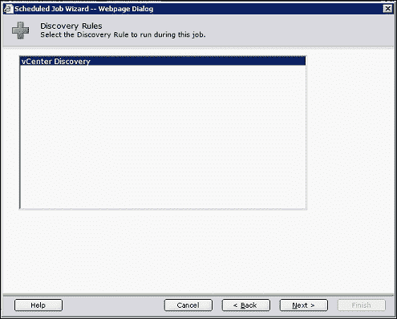

1.  点击**下一步**并选择一个日程安排。

    ### 注意

    请注意，最好在收集之后安排发现。对于大多数环境，间隔两到三小时应该足够，但对于大环境，请再次检查 vCenter 收集任务的状态。

## 它是如何工作的...

创建了发现规则；我们只是要求 VCM 按照计划运行它。如果每天有太多虚拟机安装，我们可以通过选择**每 XX 小时发生一次**来增加频率，并按此安排。这将进入数据库，检查 vCenter 收集获取的详细信息，并将新创建的虚拟机添加到已授权的机器中。如果在发现规则中选择了安装代理，则它会在发现后跟随并安装代理。

## 另见

+   在第二章中，*添加 vCenter 服务器实例*的食谱，*配置 VCM 以管理您的基础设施*：将 vCenter 添加到 VCM。

+   在第二章中，**添加发现规则**的食谱，*配置 VCM 以管理您的基础设施*：创建一个用于该日程安排的 vCenter 发现规则。

+   在第七章中，*应用新许可证密钥*的食谱，*VCM 的维护*：如果超过了许可证密钥的限制，添加许可证密钥。
