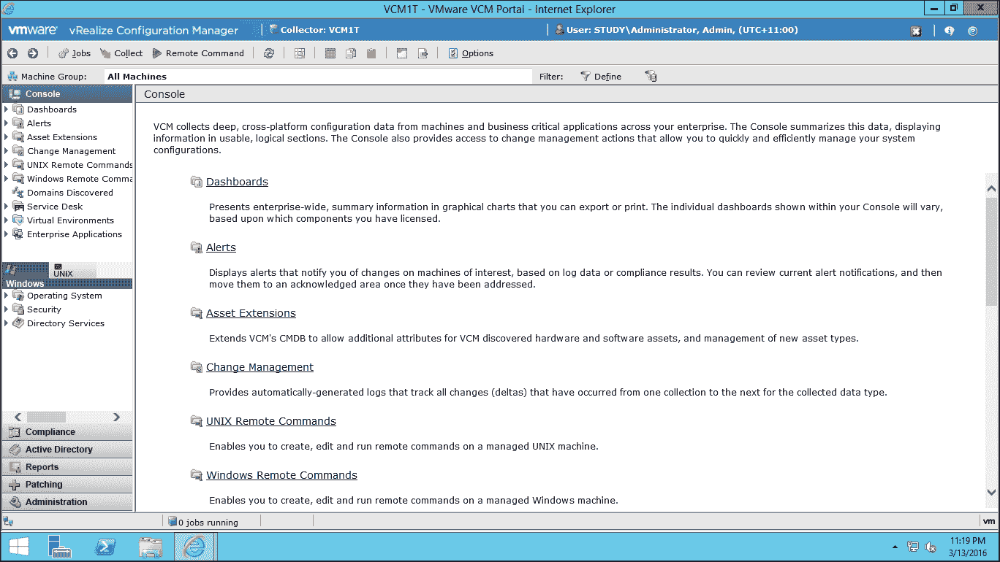

# 第十一章：理解 VCM 控制台

在开始使用 VCM 之前，让我们先了解一下控制台，因为我们在整个书中都用到了它，最好先对它有所熟悉。

以下是如何连接到 VCM 控制台：

| **序号** | **VCM 部署** | **默认控制台链接** |
| --- | --- | --- |
| **1** | 单层 | `https://<VCM Server IP/FQDN>/VCM` |
| **2** | 双层 | `https://<Collector Server IP/FQDN>/VCM` |
| **3** | 三层 | `https://<Web Server IP/FQDN>/VCM` |

唯一支持的浏览器是不同版本的 IE，因此请在浏览器中输入 URL，按下 *Enter* 键并提供凭证。如果你有多个角色，请选择角色，然后你就可以进入神奇的 VCM 世界。

控制台界面如下所示：

第一行蓝色区域显示了你的采集器服务器名称以及连接到它的用户。

在下一行，你会看到菜单选项。最重要的选项是 **任务** 和 **收集**，而其余选项允许你选择、复制和导出控制台中显示的数据。

在第三行，你会看到 **机器组：–** 这一点非常重要，因为你在左侧滑块中执行的所有操作都会作用于你在此选择的机器组中的机器。例如，如果你想修补一个在控制台视图中不可见的机器，但你确定该机器是 VCM 的一部分，请查看你所选的机器组——该机器不属于你从顶部选择的机器组。

接下来是左侧的滑块，你可以在这里找到以下主要选项：

1.  **控制台**

    如前面的截图所示，这是你启动时的默认滑块。在这里，你可以执行以下功能——请注意，这不是一个全面的列表，一旦你熟悉 VCM，你可以探索更多：

    +   你可以查看受管机器的完整摘要信息

    +   你可以查看所有的 vCenters、vCloud 和 vShield 实例，以及从它们收集的数据，例如虚拟机、ESX 和 ESXi 服务器，以及 vApps 网络。

    +   你可以查看各种仪表板，可以在不同的演示中使用它们。

    +   你可以运行 Linux 远程命令

1.  **合规性**

    在这里，你可以检查基础设施的合规性，创建或修改新规则和模板。

1.  **Active Directory**

    在这里，你可以查看你的 Active Directory 基础设施，如 AD 域、AD 对象、架构以及 Active Directory 站点列表，包括站点链接、站点桥接、子网、站点间传输和服务器。

    所有与 Active Directory 相关的内容都在这里。

1.  **报告**

    这是你可以以各种格式导出从受管对象中提取的详细信息的地方，如 XLS、CSV、DOC 等。

    有很多默认报告可供使用，除此之外，你还可以根据需要创建自己的自定义报告。

1.  **修补**

    你将花费大量时间在这里，剩余时间在管理部分。这里是你为所支持并想要修补的各种操作系统创建补丁评估模板、安排与补丁相关的任务以及执行按需补丁的地方。  

1.  **管理**  

    这是你在使用 VCM 时大部分时间会花费的地方。这里是 VCM 的核心功能。你可以在这里执行以下操作：  

    +   添加/移除任何新的管理机器，如果这没有自动发生的话  

    +   检查任务的状态，无论是正在运行还是已完成，以帮助故障排除  

    +   更改各种设置，以根据你的需求微调 VCM  

    +   检查你的许可证状态，以确保在许可证方面不会失去合规性  

    +   检查并批准证书  

    +   创建各种发现规则、机器组等

这只是一个非常有限的列表；你将随着工作的进行进一步探索。  
